# Audit Log

## Overview

The **Audit Log** is the record of who did what.

Every sensitive action across the product — logins, torrent deletions, file operations, settings changes, module toggles, media-server tests, automation rule runs, acquisition approvals — writes a row: the **actor**, the **action**, the **object**, the **IP address**, the **user agent**, the **result**, and any relevant **metadata**.

It is a **core** module (id `audit`, permission `audit.view`), and it is the thing you reach for when something changed and nobody remembers changing it.

## Why / when to use it

- **Something is gone and nobody admits to deleting it.** The audit log knows.
- **A setting changed and broke something.** The audit log knows when, and by whom.
- **You share the instance.** Attribution is the point of having accounts at all.
- **An automation rule did something surprising.** Every rule run is mirrored here as `automation.rule.executed`, with its result.

## Prerequisites

- The `audit.view` permission. **Power User does not have it** — by default, only Administrator and Super Admin do.

## Concepts

**Audit row** — one recorded action:

| Field | Meaning |
|-------|---------|
| `userId` | Who. Nullable — a system-generated action has no user. **Deleting a user keeps their rows but orphans them** (the field is set to null, not cascaded away). |
| `action` | What, as a dotted string: `auth.login`, `file.deleted`, `automation.rule.executed`, `media.integration.test_failed`, … |
| `objectType` / `objectId` | Which thing it happened to. |
| `result` | `success` or `failure`. Defaults to `success`. |
| `ipAddress` / `userAgent` | From where. |
| `metadata` | Action-specific detail. |
| `createdAt` | When. |

**Target** — a **humanized** description of the object, resolved at read time. Instead of an opaque uuid, a row targeting a media item shows *`Silo (2023) — S01E03`*. This is resolved for torrents, wanted episodes, media items, and acquisition actions and watchlist items — either by a batched database lookup, or by parsing the release name out of the row's metadata.

**Append-only** — see the important caveat below.

## How it works

```mermaid
flowchart LR
    subgraph Actors
      U[A user action]
      S[A system action<br/>userId = null]
      A[An automation rule run]
    end

    U --> AS[AuditService.record&#40;&#41;]
    S --> AS
    A --> AS

    AS --> TC{try / catch}
    TC -->|success| DB[(audit_logs<br/>append-only in practice)]
    TC -->|failure| SW[Logged and SWALLOWED.<br/>Never throws into the<br/>calling request path.]

    DB --> Q[GET /api/audit<br/>audit.view]
    Q --> EN[Enrich: resolve a humanized<br/>target per row<br/>+ attach the username]
    EN --> UI[Audit page:<br/>paginated, expandable rows]

    style SW fill:#3a2f16,stroke:#f5a623,color:#fff
```



:::info An audit write can never break a request
`AuditService.record()` is wrapped in a try/catch and **never throws into the calling request path**. A failed audit write is logged and swallowed.

That is the right trade-off for a self-hosted media tool — you would rather the delete succeed than have the whole request fail because the audit table was momentarily unavailable. But it does mean the audit log is **best-effort**, not a transactional guarantee. Do not treat it as a compliance-grade tamper-evident ledger. It is not one, and it does not claim to be.
:::

## Configuration

There is very little to configure. That is mostly by design, and partly a gap.

### Endpoint

| Method | Path | Permission | Query |
|--------|------|-----------|-------|
| GET | `/api/audit` | `audit.view` | `page`, `pageSize` (default **50**, hard cap **200**), `action` |

Rows are ordered newest-first.

:::caution What the audit log does not have
Be clear-eyed about the current limits, so you can plan around them:

- **The only backend filter is `action`, and it is an exact-match equality.** There is **no** filtering by user, date range, result, object type, IP address, or free text.
- **The UI exposes no filter controls at all** — not even the `action` filter the backend supports. It is a paginated list with expandable rows.
- **There is no export.** No CSV, no JSON download, no button.
- **There is no retention policy.** No TTL, no scheduled prune, no delete endpoint. **Rows accumulate indefinitely.** On a busy instance this table grows without bound, and you should plan for that in your [backup](/operate/backup) and disk sizing.
- **"Append-only" is by omission, not by design.** The application has no code path that updates or deletes an audit row. But there is **no database constraint, no trigger, no hash chain, and no tamper-evidence**. Anyone with database access can modify rows freely. The accurate claim is: *the application never modifies or deletes audit rows.* It is not "immutable".
:::

## What gets audited

A representative sample — this is not exhaustive:

| Area | Actions |
|------|---------|
| **Auth** | `auth.login` (success **and** failure), `auth.change_password`. A pending 2FA challenge is deliberately **not** audited as a failed login. |
| **Account** | `account.password_changed`, `account.2fa_enabled`, `account.2fa_disabled`. |
| **Files** | `file.created_folder`, `file.renamed`, `file.moved`, `file.copied`, `file.deleted`, `file.cleanup_execute`, `file.restore`, `file.trash_empty`, `file.bulk.<op>`, `file.operation_failed` — with the user, source/destination, byte count, and result. |
| **Automation** | `automation.rule.executed`, with `success`/`failure`, the rule name, and the list of actions. |
| **Media Manager** | Destructive, rename, move, and integration actions. Test/refresh failures (`media.integration.test_failed`, `media.integration.refresh_failed`) — recorded **without secrets**. |
| **RSS** | Rule creation, and separately `rss.rule.created_for_inactive_show` when someone overrides the ended-show warning. |
| **Smart Download** | Evaluations, approvals, rejections, and overrides. |
| **Notification Center** | Every channel/rule/template/recipient/preference change, plus manual sends and retries. |
| **Modules** | Every enable and disable. |
| **Prowlarr / Indexers** | Settings views and updates, API-key changes, connection tests, and opens. |

## Step-by-step walkthrough

**1. Open Administration → Audit Log.** You get a paginated, newest-first list.

**2. Expand a row.** You see the target type and id, the resolved media label (not just a uuid), the result badge, the timestamp, the user agent, and the humanized metadata.

**3. Read it after every significant change.** Toggle a module, delete a torrent, change a setting — then look. Building the habit of *checking* the audit log is what makes it useful when you *need* it.

**4. Work around the missing filters.** The UI has none. If you need to find every `file.deleted`, use the API directly:

```bash
curl -s "https://ultratorrent.example.com/api/audit?action=file.deleted&pageSize=200" \
  -H "Authorization: Bearer $TOKEN"
```

That exact-match `action` filter is the only one that exists. For anything else — by user, by date, by result — you will need to page through the API and filter client-side, or query the database.

## Screenshots


:::tip Watch this tutorial
_Video coming soon._
:::

## Real-world examples

### "Where did my show go?"

An entire season vanished from the library. Open the audit log and look for `file.deleted` — or, more likely, a Smart Download `upgrade_existing` decision that acquired a better release and correctly removed the superseded one, which is exactly what you configured it to do. The row names the object, the actor (a user, or the system), and the result. Case closed in under a minute.

### "Who turned off Release Scoring?"

Module enable/disable is audited. The row has the user, the timestamp, and the IP. This is the single most common "nobody remembers changing that" scenario, and it is precisely what the log is for.

### "Why did the automation rule not fire?"

Every rule run writes `automation.rule.executed` with a `success` or `failure` result, the rule name, and the actions attempted. If there is no row at all, the rule never matched — go check its conditions. If there is a `failure` row, the message tells you which action threw. See [Automation](/modules/automation).

## Troubleshooting

| Symptom | Cause | Fix |
|---------|-------|-----|
| I cannot see the audit log | You lack `audit.view`. **Power User does not have it.** | Assign Administrator or Super Admin. |
| I cannot filter by user or by date | **Those filters do not exist.** The only backend filter is exact-match `action`, and the UI exposes no filter controls at all. | Use `GET /api/audit?action=...` and filter client-side, or query the database. |
| I cannot export the log | **There is no export.** No CSV, no JSON download. | Page through the API and write the output yourself. |
| The table is enormous | **There is no retention policy** — no TTL, no prune job, no delete endpoint. Rows accumulate indefinitely. | Plan for it in disk sizing and [backup](/operate/backup). Pruning, if you need it, is a manual database operation. |
| An action I expected is missing | Not every action is audited, and `AuditService.record()` **swallows its own failures** rather than breaking the request. | Cross-check against the module's own logs. Audit is best-effort. |
| A row shows a raw uuid, not a title | Target humanization covers torrents, wanted episodes, media items, and acquisition actions and watchlist items. Other object types show the raw id. | Expected. Earlier versions dumped raw JSON metadata; that has since been humanized. |
| A user was deleted and their rows show no user | Deliberate. The `userId` is set to null rather than cascading — **the rows survive**, so the history is not destroyed by deleting an account. | This is the intended behaviour. Prefer **deactivating** a user over deleting one, so attribution survives intact. |
| The dashboard's "Recent activity" is a wall of noise | Historically, bursty background events and polled reads flooded it. Fixed: burst collapsing was broadened (by action + result + actor) and polled reads are no longer audited. | Update. |

## Best practices

- **Restrict `audit.view`.** The log contains IPs, user agents, and object names. It is not a page for everyone.
- **Deactivate users; do not delete them.** Deletion orphans their audit rows. Deactivation revokes every session instantly and preserves attribution.
- **Do not use the shared `admin` account day to day.** Every action it takes is attributed to "admin", which is to say attributed to nobody.
- **Plan for unbounded growth.** There is no retention policy. Size your disk and your backups accordingly.
- **Check the log after every significant change.** It is the cheapest habit in this documentation.
- **Do not treat it as compliance-grade evidence.** It is append-only in practice, not tamper-evident by design.

## Common mistakes

- **Expecting filters or export in the UI.** Neither exists. Use the API.
- **Assuming it is immutable.** The application never modifies or deletes rows — but there is no constraint, no trigger, and no hash chain. Database access defeats it.
- **Assuming every action is logged.** It is best-effort, and a failed write is silently swallowed rather than breaking your request.
- **Deleting a user to "clean up"** and orphaning their entire history.
- **Letting the table grow for years** without noticing, because nothing prunes it.

## FAQ

**Is the audit log immutable?**
**No.** It is **append-only in practice** — the application has no code path that updates or deletes an audit row. But there is no database-level constraint, no trigger, and no tamper-evidence. Someone with database access can change it. Describe it accurately.

**Can I export it?**
Not today. There is no export endpoint or button. Page through `GET /api/audit`.

**Can I filter by user or by date?**
Not through the API. The only filter is an **exact-match `action`**. The UI exposes no filters at all.

**How long are rows kept?**
Forever. There is no retention setting, TTL, or prune job.

**What happens to a deleted user's rows?**
They survive, with `userId` set to null. The history is not destroyed — but the attribution is. **Deactivate rather than delete.**

**Can an audit failure break my request?**
No. `AuditService.record()` catches and swallows its own errors. That means the log is best-effort by design.

**Are automation rule runs logged here?**
Yes — `automation.rule.executed`, with the result, the rule name, and the action list, in addition to the automation module's own execution log.

## Checklist

- [ ] Confirm only privileged roles hold `audit.view`. Expected: Power User cannot see the page.
- [ ] Delete a test torrent. Expected: a row appears with the actor, object, IP, user agent, and result.
- [ ] Expand it. Expected: a **humanized target** (a title, not a raw uuid) and readable metadata.
- [ ] Toggle a module. Expected: an audit row for the enable/disable.
- [ ] Run an automation rule that fails. Expected: `automation.rule.executed` with `result: failure`.
- [ ] Query `GET /api/audit?action=file.deleted`. Expected: only exact matches on that action.
- [ ] Confirm the log is in your [backup](/operate/backup). Expected: the `audit_logs` table is included, and you have sized for its unbounded growth.

## See also

- [Users & Roles](/modules/users) — attribution depends on people having their own accounts.
- [Automation](/modules/automation) — rule runs are mirrored here.
- [File Manager](/modules/files) — every file operation is audited.
- [Security](/operate/security)
- [Backup](/operate/backup)
- [Permissions reference](/reference/permissions)
