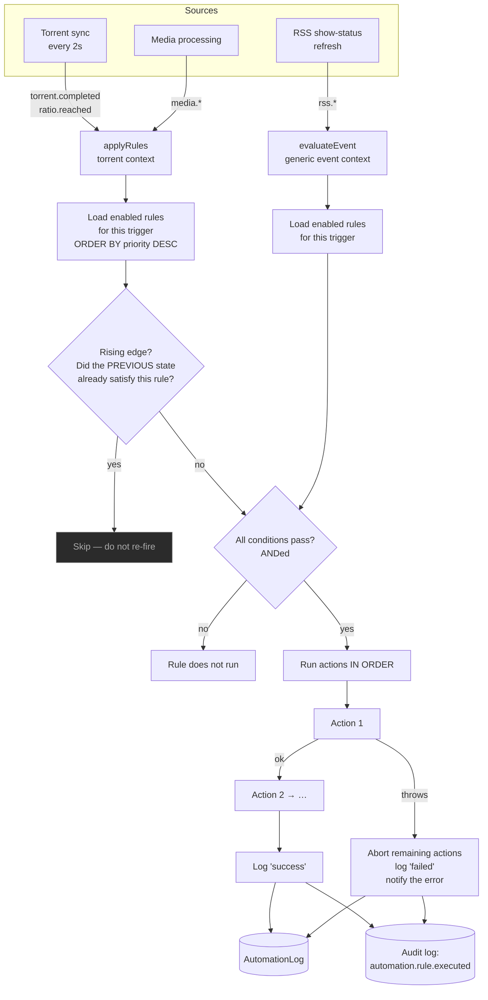

# Automation

## Overview

**Automation** is the rule engine. It watches for things happening, checks whether they meet your conditions, and runs actions.

```
trigger  →  conditions (all must pass)  →  actions (run in order)
```

That is the whole model, and it is deliberately small. "When a download completes, **and** its label is `movies`, **and** its ratio is above 2.0 — move it, then notify me."

It is a **core** module (id `automation`, permissions `automation.view` / `automation.manage`), and it is what [Smart Download](/modules/smart-download) and [RSS](/modules/rss) both hook into.

## Why / when to use it

- **Post-processing.** Move a completed download somewhere else; hand it to Media Manager for renaming.
- **Seeding hygiene.** Stop or delete a torrent once it has hit your ratio target.
- **Integration.** Fire a webhook into something UltraTorrent knows nothing about.
- **Reacting to your library.** A show ends — convert its RSS rule to backfill, automatically.

If you find yourself doing the same thing by hand twice a week, it belongs here.

## Prerequisites

- A working [engine](/modules/engines) (`automation` declares it as a hard dependency).
- `automation.view` to see rules and their logs; `automation.manage` to create or change them.
- For notification actions: a configured channel in the [Notification Center](/modules/notification-center).

## Concepts

**Trigger** — the event that starts a rule. A rule has exactly one.

**Condition** — a `{ field, op, value }` test against the event's context. Conditions are **ANDed**: *every* one must pass. **Zero conditions means the rule always matches.**

**Action** — what to do. A rule has an ordered list, and they run **sequentially**. The first action to throw **aborts the remaining actions of that rule**, logs the run as `failed`, and dispatches an error notification.

**Priority** — an integer. **Higher priority runs first.** Every matching rule runs; there is no stop-after-first-match.

**Rising edge** — a rule only fires on the *transition* into a matching state, not repeatedly while it stays there. This applies to `ratio.reached`: if the previous state already satisfied the conditions, the rule is skipped.

**Execution log** — every run is recorded in `AutomationLog` with a status (`success` / `failed`), the context, and a message. It is also mirrored to the [audit log](/modules/audit).

## How it works



### Idempotency on `torrent.completed`

A completion is an **edge**: the torrent crosses from incomplete to complete, and the rule fires. But what about a torrent that was *already* complete when you wrote the rule? It never crosses the edge, so it never fires — which is why "completed torrents keep seeding despite my delete rule" was a real and confusing bug.

It is fixed with a **backfill**: `torrent.completed` rules are re-run against already-complete torrents, using successful `AutomationLog` rows (keyed `ruleId::hash`) as a ledger of what has already been done. Failures are **not** recorded as done, so they retry on the next cycle.

## Configuration

### Triggers

Fourteen triggers exist, in three families.

| Trigger | Category | Fires when |
|---------|----------|-----------|
| `torrent.completed` | torrent | A download completes (plus the backfill above). |
| `ratio.reached` | torrent | The share ratio crosses your threshold. **Rising-edge.** |
| `media.detected` | media | A new media file is scanned. |
| `media.matched` | media | An item is identified. |
| `media.unmatched` | media | An item could not be identified. |
| `media.missing_artwork` | media | An item has no artwork. |
| `media.missing_subtitles` | media | An item has no preferred subtitles. |
| `media.rename_completed` | media | A rename/move completed. |
| `media.server_refresh_failed` | media | A media-server refresh failed. |
| `rss.rule.created_for_inactive_show` | rss | Someone overrode the ended/canceled warning. |
| `rss.show_status.changed` | rss | A monitored show's airing status changed. |
| `rss.show.became_active` | rss | A monitored show came back. |
| `rss.show.ended` | rss | A monitored show ended. |
| `rss.show.canceled` | rss | A monitored show was canceled. |

### Condition operators

Exactly eight:

| Operator | Behaviour |
|----------|-----------|
| `eq` / `neq` | Strict equality / inequality. |
| `gt` / `gte` / `lt` / `lte` | Numeric comparison — **both sides are coerced to numbers**. |
| `contains` | Substring match on the stringified value. |
| `matches` | Case-insensitive regular expression. **An invalid regex returns `false` rather than throwing** — so a typo silently never matches. |

:::warning An unknown operator returns `false`
Any operator that is not one of these eight evaluates to `false`, so the rule never fires. If a rule mysteriously never runs, check the operator first.
:::

### Actions

Twenty-two actions exist, in four families.

**Torrent actions** (need a real torrent — only valid on the torrent triggers):
`move` (param `destination`), `pause`, `stop`, `delete`, `delete_with_data`, `rename_for_media` (params `preset`, `mode` — default `hardlink` — `libraryPath`, `template`).

**Context-free actions** (valid on any trigger):
`notify` (params `title`, `message`), `send_notification` (full [Notification Center](/modules/notification-center) dispatch: `channelIds`, `recipientIds`, `groupIds`, `templateId`, `variables`, `priority`, `title`, `message`), `webhook` (POSTs JSON to `params.url`), `notify_admin` (event-context only).

**Media actions:**
`media_scan_library`, `media_match`, `media_fetch_metadata`, `media_fetch_artwork`, `media_generate_nfo`, `media_rename`, `media_move`, `media_server_refresh`, `media_notify`.

**RSS actions:**
`refresh_rss_show_status`, `disable_rss_rule`, `convert_rule_to_backfill` (turns off `autoDownload` — keep the rule, stop forward auto-grabbing).

:::caution Most triggers and actions are API-only today
The **UI rule builder currently exposes only two triggers** (`torrent.completed`, `ratio.reached`) and **eight actions** (`notify`, `move`, `pause`, `stop`, `delete`, `delete_with_data`, `webhook`, `rename_for_media`), with condition fields limited to `name`, `label`, `state`, `ratio`, `size`, `progress`, `downloadRate`, `uploadRate`.

The other **twelve triggers** (all `media.*` and `rss.*`) and **fourteen actions** (all `media_*`, `rss_*`, and `send_notification`) exist in the engine and are fully functional, but are reachable **only through the REST API** — `POST /api/automation/rules`. The full live catalog is at `GET /api/automation/catalog`.

If you need them, create the rule via the API. It will run correctly; you just cannot author it in the form yet.
:::

### Event-context rules

The five `rss.*` triggers run through a separate path (`evaluateEvent`) that matches conditions against a **plain event object** rather than a torrent. Only **event-safe** actions are permitted there: `notify`, `notify_admin`, `send_notification`, `webhook`, and the three `rss_*` actions. Any other action id is rejected with `Action "<type>" is not valid for an event trigger`, logged as `failed`, and notified.

### Rule fields

| Field | What it does | Default |
|-------|--------------|---------|
| `name` | Display name. | — |
| `description` | Free text. | — |
| `trigger` | The one trigger. | — |
| `conditions` | The ANDed condition array. **Empty = always matches.** | `[]` |
| `actions` | The ordered action array. | `[]` |
| `isEnabled` | Whether it runs. | `true` |
| `priority` | Higher runs first. | `0` |

### Endpoints

| Method | Path | Permission |
|--------|------|-----------|
| GET | `/api/automation/catalog` | `automation.view` |
| GET | `/api/automation/rules` | `automation.view` |
| POST | `/api/automation/rules` | `automation.manage` |
| PATCH | `/api/automation/rules/:id` | `automation.manage` |
| DELETE | `/api/automation/rules/:id` | `automation.manage` |
| GET | `/api/automation/rules/:id/logs` | `automation.view` |

## Step-by-step walkthrough

**1. Go to Automation → Automation Rules.**

**2. Create a rule with an obviously-safe action first.** Trigger `torrent.completed`, no conditions, one action: `notify`. Save it, enabled.

**3. Complete a download.** You get a notification. You have now proved the trigger fires and the action runs — which is the thing most people never actually verify before writing something destructive.

**4. Add a condition.** `label` `eq` `movies`. Complete a torrent with a different label. The rule should **not** run. Check the **Execution log** to confirm.

**5. Now do something real.** Add a `move` action with a destination, or a `rename_for_media` action. Put it *after* the notify, so if the destructive action fails you still get told.

**6. Watch the execution log.** Every run is recorded, success or failure. So is the [audit log](/modules/audit), under `automation.rule.executed`.

:::danger There is no dry-run
Automation has **no test, simulate, or preview** capability. A rule is either off or live.

So: build the rule with a `notify` action first, prove the trigger and conditions behave, and only then swap in the action that deletes things. There is no undo, and a rule with zero conditions matches **everything**.
:::

## Screenshots


:::tip Watch this tutorial
_Video coming soon._
:::

## Real-world examples

### Stop seeding at a ratio target

Trigger: `ratio.reached`. Condition: `ratio` `gte` `2.0`. Actions: `notify` (so you know), then `stop`.

Because `ratio.reached` is **rising-edge**, this fires exactly **once** — on the transition past 2.0 — not on every 2-second sync tick for the rest of the torrent's life. If you also want the data gone, use `delete_with_data` instead of `stop`, but test with `stop` first.

### Hardlink completed movies into the library

Trigger: `torrent.completed`. Condition: `label` `eq` `movies`. Action: `rename_for_media` with `preset: plex`, `mode: hardlink`, and your movie `libraryPath`.

`hardlink` is the default mode for a reason: the file appears in the library **and** the original stays where the torrent client left it, so seeding continues. One copy of the bytes.

### Convert an RSS rule to backfill when a show ends (API-only today)

Trigger: `rss.show.ended`. Actions: `notify_admin`, then `convert_rule_to_backfill`.

When the hourly show-status refresh notices a monitored show has ended, this turns off that rule's auto-download — you keep the rule and its history, but it stops forward-grabbing episodes that will never air. The action targets a rule either by explicit `ruleId` or by the show identity carried on the trigger's context.

Create this one via `POST /api/automation/rules`; the UI form does not yet offer `rss.*` triggers.

### Fire a webhook into anything

Trigger: `torrent.completed`. Action: `webhook` with your URL. It POSTs a JSON body containing the torrent (or the event) and your params. That is your escape hatch for everything UltraTorrent does not do natively.

## Troubleshooting

| Symptom | Cause | Fix |
|---------|-------|-----|
| Completed torrents keep seeding despite a working delete rule | Two separate historical bugs. **(1)** `torrent.completed` only fired on the completion *edge*, so a torrent that was already complete when the rule was written never triggered. **(2)** rTorrent's `delete` did not verify that removal actually happened. Both are fixed — there is now a backfill (using successful log rows as a ledger) and delete verifies + retries. | Update. Then check the rule's **Execution log** — if the run shows `success` and the torrent is still there, it is an engine problem, not a rule problem. |
| A rule never fires | Most likely an **unknown operator** (which evaluates to `false`), or an invalid regex in a `matches` condition (which also returns `false` rather than throwing). Or the trigger genuinely is not firing. | Check the operator against the eight listed above. Then set the rule to zero conditions and one `notify` action to prove the trigger itself fires. |
| A rule fires **constantly** | Zero conditions means **always matches**. And only `ratio.reached` is rising-edge — other triggers fire every time the event occurs. | Add conditions. |
| Only some of a rule's actions ran | The **first action to throw aborts the rest** of that rule. | Read the **Execution log** — the failure message names what went wrong. Put non-destructive actions first. |
| `Action "media_rename" is not valid for an event trigger` | Event-context rules (the `rss.*` triggers) only permit `notify`, `notify_admin`, `send_notification`, `webhook`, and the three `rss_*` actions. | Use a torrent or media trigger for torrent/media actions. |
| I cannot find the `media.*` or `rss.*` triggers in the UI | The rule-builder form currently exposes only the two torrent triggers. The rest are engine-side and API-only. | Create the rule via `POST /api/automation/rules`. See `GET /api/automation/catalog` for the full live list. |
| A numeric condition behaves oddly | `gt` / `gte` / `lt` / `lte` **coerce both sides to numbers**. Comparing a non-numeric field numerically gives you `NaN` semantics. | Compare numeric fields numerically; use `eq` / `contains` for strings. |
| Two rules conflict | Every matching rule runs; there is no stop-after-first-match. Ordering is by **priority, descending**. | Use `priority` to sequence them, and make conditions mutually exclusive. |

## Best practices

- **Prototype with `notify`.** Prove the trigger and the conditions before you attach anything destructive. There is no dry-run and no undo.
- **Put the notify action first.** If a later action fails, you still get told.
- **Never leave a destructive rule with zero conditions.** Zero conditions matches everything.
- **Use `priority` deliberately** when rules could overlap.
- **Read the execution log after any change.** It is the only feedback loop you have.
- **Prefer `stop` over `delete_with_data`** until you are certain.
- **Remember `ratio.reached` is rising-edge** — that is why it does not spam you.

## Common mistakes

- **Writing a `delete_with_data` rule with no conditions** and enabling it. This will delete everything, on completion, forever.
- **Assuming there is a dry-run.** There is not.
- **Using an operator that does not exist** (`ne`, `regex`, `startsWith`…) and concluding the engine is broken. Unknown operators silently evaluate to `false`.
- **Expecting every trigger to be rising-edge.** Only `ratio.reached` is.
- **Trying to use a media action on an RSS trigger.** Event-context rules reject it.
- **Looking for `media.*` triggers in the UI form.** They are API-only for now.

## FAQ

**Can I test a rule before enabling it?**
No. There is no dry-run, simulate, or preview endpoint in the automation module. Build it with `notify` and observe.

**How often are torrent rules evaluated?**
On the torrent-sync loop, which runs every **2 seconds**.

**Do all matching rules run, or just the first?**
**All** of them, in order of `priority` descending.

**What happens if an action fails?**
It aborts the remaining actions of that rule, the run is logged as `failed`, and an error notification is dispatched. Other rules are unaffected.

**Why does my `ratio.reached` rule only fire once?**
Because it is rising-edge — it fires on the *transition* into the matching state. If the previous state already satisfied the conditions, the rule is skipped. This is the desired behaviour, not a bug.

**Is there a visual/drag-and-drop rule builder?**
Not today. The UI is a structured form — rule cards, a create dialog, condition rows, and action rows with per-type parameter widgets. There is no canvas.

**Are rule runs audited?**
Yes. Every run writes `automation.rule.executed` to the [audit log](/modules/audit), with `success` or `failure`, the rule name, and the action list — in addition to the module's own execution log.

## Checklist

- [ ] Create a rule: `torrent.completed`, no conditions, one `notify` action. Expected: it fires on the next completion.
- [ ] Add a `label` `eq` condition. Expected: it fires for matching labels only; the execution log shows nothing for others.
- [ ] Deliberately use an unknown operator. Expected: the rule never fires — confirming the silent-`false` behaviour.
- [ ] Add a second action after the notify. Expected: both run, in order.
- [ ] Make the second action fail (a bad destination). Expected: the run logs `failed`, and an error notification arrives.
- [ ] Check the audit log. Expected: an `automation.rule.executed` row with `result: failure`.
- [ ] Create a `ratio.reached` rule and let a torrent pass the threshold. Expected: it fires **exactly once**, not repeatedly.

## See also

- [Torrents](/modules/torrents) — where torrent triggers come from.
- [Media Manager](/modules/media-manager) — `media.*` triggers and the media actions.
- [RSS automation](/modules/rss) — `rss.*` triggers and the backfill action.
- [Notification Center](/modules/notification-center) — the `send_notification` action.
- [Audit log](/modules/audit) — where rule runs are mirrored.
- [API reference](/reference/api)
