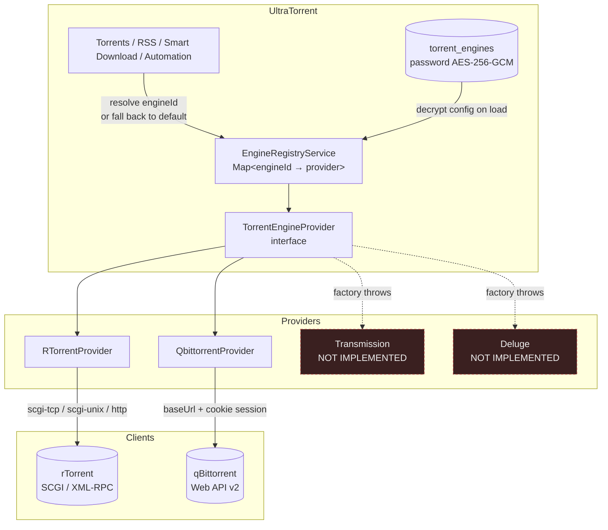

# Engines

## Overview

UltraTorrent **does not download torrents itself**. It drives a torrent client — an *engine* — through a provider abstraction, and everything else in the product is written against that abstraction rather than against any particular client.

The **Engines** module (id `engine`, core) is where you connect one. Once an engine is connected and healthy, [Torrents](/modules/torrents), [RSS](/modules/rss), [Smart Download](/modules/smart-download), and [Automation](/modules/automation) all light up. Until then, none of them can do anything.

## Why / when to use it

You configure an engine **once, at install time**, and then rarely think about it again. You come back to this page when:

- You are setting up for the first time.
- You want to **switch clients** — from rTorrent to qBittorrent, say — without touching any other configuration.
- You want **more than one engine** — a fast local one for new grabs and a slow archival one for a seedbox, for example.
- Something is broken, and you need to know whether the problem is UltraTorrent or the client.

## Prerequisites

- A running torrent client that UltraTorrent can **reach over the network**. In the bundled Docker stack, that means bringing up one of the optional Compose profiles:

  ```bash
  docker compose --profile rtorrent up -d
  # or
  docker compose --profile qbittorrent up -d
  ```

- The client's connection details — for rTorrent, its SCGI host/port; for qBittorrent, its Web UI URL and login.
- `system.view` to see engines, `engines.manage` to create, edit, test, or delete them.
- An `ENCRYPTION_KEY` in your environment. Engine passwords are encrypted at rest with it, and it must be different from your `JWT_ACCESS_SECRET`. Generate one with `openssl rand -base64 48`.

:::warning There is no default engine
UltraTorrent does **not** seed an engine row at first boot. A fresh install has zero engines, and the Torrents page will tell you so. Creating one is a required setup step — see [Quick start](/learn/quick-start).
:::

## Concepts

**Engine** — a connection to one torrent client. It has a name, a `kind`, a config blob, an enabled flag, and a default flag.

**Kind** — which client this is. Two are implemented: **`rtorrent`** and **`qbittorrent`**. Two more (`transmission`, `deluge`) pass validation but are **not implemented** — the provider factory throws, and the UI select disables them.

**Provider** — the code that speaks a given client's protocol. `TorrentEngineProvider` is the interface: connect, health-check, list, add, remove, start/stop/pause/resume, recheck, move, rename, set priorities and limits, manage trackers. Everything above the engine layer only knows this interface.

**Default engine** — the one used when a request does not name an `engineId`. Exactly one engine can be default; setting the flag on one clears it from the others. If no engine is marked default, the first loaded one is used.

**Health check** — a live probe returning `{ online, latencyMs, version, error, checkedAt }`. For rTorrent it calls `system.client_version`; for qBittorrent it hits the Web API.

**Torrent sync** — the background job that reads every enabled engine every **2 seconds** and pushes the result to the UI.

## How it works



The registry holds one live provider per **enabled** engine row, and rebuilds itself whenever you create, update, or delete an engine. Every torrent route accepts an optional `engineId`; if you omit it, the registry resolves the default.

Because everything upstream is written against the interface, **the rest of the product is engine-agnostic**. Adding a client means writing one provider class — see [Providers](/develop/providers).

## Configuration

### rTorrent

rTorrent speaks XML-RPC, usually over SCGI. Pick the transport that matches how your rTorrent is exposed.

| Field | What it does | Default | Recommended |
|-------|--------------|---------|-------------|
| **Mode** | `scgi-tcp` (raw TCP), `scgi-unix` (Unix socket), or `http` (XML-RPC over HTTP). | `scgi-tcp` | `scgi-tcp` — it is what the bundled container exposes. |
| **Host** | Hostname for `scgi-tcp`. | `rtorrent` (the Compose service name) | `rtorrent` on the bundled stack; the container/host name otherwise. |
| **Port** | Port for `scgi-tcp`. | `5000` | `5000`. |
| **Socket path** | Filesystem path, for `scgi-unix` only. | — | Only if rTorrent and UltraTorrent share a filesystem. |
| **URL** | The XML-RPC endpoint, for `http` mode only. | — | Only if rTorrent sits behind an HTTP endpoint. |
| **Timeout (ms)** | How long to wait for the client. | `15000` (form pre-fills `10000`) | `10000`. Raise it if the client is on slow/remote storage. |

### qBittorrent

qBittorrent speaks its Web API v2 over HTTP, with a cookie session.

| Field | What it does | Default | Recommended |
|-------|--------------|---------|-------------|
| **Base URL** | The Web UI's URL. | `http://qbittorrent:8080` (form pre-fill) | The Compose service name on the bundled stack. `http://<host>:8081` from outside, if you published the default `QBITTORRENT_PORT`. |
| **Username** | Web UI login. | — | Not `admin`/`adminadmin`. Change it in qBittorrent first. |
| **Password** | Web UI password. **AES-256-GCM encrypted at rest.** | — | A real one. |
| **Timeout (ms)** | How long to wait. | `15000` | `15000`. |

:::info The password is never returned
`GET /api/engines` returns `hasPassword: true|false`, never the password itself. On edit, **leaving the password field blank keeps the stored one**. A rotated or corrupt `ENCRYPTION_KEY` fails closed — the field reads as absent rather than surfacing ciphertext.
:::

### Common fields

| Field | What it does | Default |
|-------|--------------|---------|
| **Name** | Display name (max 120 chars). | — |
| **Kind** | `rtorrent` or `qbittorrent`. **Cannot be changed after creation** — the edit form disables it. | — |
| **Enabled** | Whether the registry loads this engine at all. | `true` |
| **Default** | Whether it is used when no `engineId` is given. Setting it clears the flag on every other engine. | `false` |

### Endpoints

| Method | Path | Permission |
|--------|------|-----------|
| GET | `/api/engines` | `system.view` |
| GET | `/api/engines/health` | `system.view` (optional `?engineId=`) |
| POST | `/api/engines/test` | `engines.manage` |
| POST | `/api/engines` | `engines.manage` |
| PATCH | `/api/engines/:id` | `engines.manage` |
| DELETE | `/api/engines/:id` | `engines.manage` |

`POST /api/engines/test` probes a config **without saving it** — that is what the *Test connection* button in the form calls. On failure it returns `{ online: false, error: "..." }` rather than throwing, so you get a readable message instead of a stack trace.

:::danger Do not configure the engine with environment variables
`.env.example` lists `RTORRENT_SCGI_HOST` and `RTORRENT_SCGI_PORT`, but **no application code reads them**. They are leftovers. The engine connection lives in the database and is configured **only** through **Downloads → Engines** or the API. If you set those variables and expect UltraTorrent to pick up your rTorrent, nothing will happen.
:::

## Step-by-step walkthrough

**1. Start a client.** On the bundled Docker stack, bring up a profile:

```bash
docker compose --profile rtorrent up -d
```

Confirm it is running and listening (`docker compose ps`).

**2. Go to Downloads → Engines** and click **Add engine**.

**3. Fill in the connection.** For the bundled rTorrent: kind `rtorrent`, mode `scgi-tcp`, host `rtorrent`, port `5000`. For the bundled qBittorrent: kind `qbittorrent`, base URL `http://qbittorrent:8080`, plus the username and password you set in qBittorrent's own UI.

**4. Click Test connection *before* saving.** A healthy engine returns `online: true` with a latency and the client's version string. If it fails, the error message tells you what went wrong — fix it now, not after you have saved a broken row.

**5. Mark it default** (assuming it is your only one) and save.

**6. Verify.** Go to **Downloads → Torrents**. The engine health badge in the header should be green. Add a well-seeded magnet; it should appear within about two seconds.

## Screenshots


:::tip Watch this tutorial
_Video coming soon._
:::

## Real-world examples

### Migrate from rTorrent to qBittorrent with no downtime

Add the qBittorrent engine alongside your existing rTorrent one, and **do not** mark it default yet. Test it, confirm it is healthy, and let both run. New grabs keep going to rTorrent. When you are confident, flip the default flag to qBittorrent: new grabs now go there, while rTorrent keeps seeding everything it already has. Once rTorrent's torrents have finished seeding to your satisfaction, disable it. Nothing in RSS, Smart Download, or Automation had to change — they only ever talked to the interface.

### Route grabs to a seedbox and keep the local box for archives

Create two engines: `Seedbox` (remote qBittorrent, marked default) and `Local Archive` (rTorrent). New automated grabs land on the seedbox because it is the default. When you want something on the local box instead, add it explicitly with that `engineId`. The engine health badge shows both, and the torrent list can be filtered per engine.

## Troubleshooting

| Symptom | Cause | Fix |
|---------|-------|-----|
| "No torrent engine is configured" | There are zero engine rows. UltraTorrent does not create one for you. | Create one at **Downloads → Engines**. |
| `Engine "transmission" is planned but not yet implemented` | Only rTorrent and qBittorrent have providers. Transmission and Deluge pass DTO validation but the factory throws. | Use rTorrent or qBittorrent. |
| Test connection fails with a timeout, but the container is running | The host/port is wrong for the network you are on. Inside Docker, use the **service name** (`rtorrent`, `qbittorrent`), not `localhost` — `localhost` inside the backend container is the backend, not the engine. | Use the Compose service name and the internal port. |
| qBittorrent login fails against a recent build | Modern qBittorrent replies to a successful login with `204 No Content` rather than a body, which older client code did not accept. Fixed. | Update UltraTorrent. Then double-check the username/password against the qBittorrent Web UI directly. |
| rTorrent keeps crashing and restarting under load | rTorrent 0.9.8 has an **unfixed upstream bug** — `internal_error: priority_queue_insert(...) called on an invalid item`, fired during tracker-announce scheduling. It is **load-driven**: one real host with 752 torrents crashed 44 times in 4 days; another with 7 torrents on the identical build crashed zero times. There is no in-engine fix. | Each crash exits cleanly, Docker restarts it, and the saved session reloads — **no torrents are lost**. The bundled config sets `trackers.use_udp.set = no` to remove a secondary crash variant (HTTP/HTTPS trackers and PEX still find peers). The Compose healthcheck surfaces a wedged-but-running engine. If you run at high torrent counts, prefer **qBittorrent**. |
| A magnet reports `download.failed` and then downloads fine | rTorrent does not register a magnet's info-hash until it fetches metadata from DHT, which routinely takes far longer than the old ~6 s confirmation window. This produced false failures — on one host, 257 "failures" of which **256 actually loaded** (median ~53 s later). Fixed: magnets are now *accepted/pending* and reconciled by the 2 s sync. `.torrent` files still hard-fail. | Update. |
| Completed torrents never get removed despite a delete rule | rTorrent's `delete` did not verify that removal actually happened. Fixed: it now verifies and retries. | Update. |
| The engine badge is green but nothing downloads | The engine is reachable but its download slots are full of dead torrents. | See the [parking queue](/modules/torrents). |
| DHT is causing rTorrent crashes | The bundled rTorrent build can crash on a DHT `internal_error`. | `RT_DHT` defaults to `off` in `.env.example` for exactly this reason. Leave it off. |

## Best practices

- **Always Test before you Save.** A saved-but-broken engine looks identical to a working one until something tries to use it.
- **Use Compose service names, not `localhost`,** inside Docker. This is the single most common connection mistake.
- **Set `ENCRYPTION_KEY` before you create an engine with a password**, and never rotate it casually — a rotated key makes stored passwords unreadable, and the field fails closed.
- **Prefer qBittorrent at scale.** rTorrent 0.9.8's crash is load-driven and unfixed upstream. It is fine for tens of torrents; it is a liability at hundreds.
- **Keep exactly one default engine.** Ambiguity here shows up later as "why did that grab go to the wrong box?"
- **Change qBittorrent's default credentials** before you connect to it.

## Common mistakes

- **Setting `RTORRENT_SCGI_HOST` and expecting it to do something.** It does nothing. The engine is configured in the UI/database.
- **Pointing the backend at `localhost:5000`** from inside a container. That is the backend's own loopback.
- **Choosing Transmission or Deluge** from the kind list. They are visibly disabled in the UI for a reason.
- **Deleting an engine to "reset" it.** Its torrents keep running in the client; you have just made UltraTorrent blind to them. Disable it instead.
- **Expecting the kind to be editable.** It is not — create a new engine instead.

## FAQ

**Which torrent clients are supported?**
**rTorrent** and **qBittorrent**, fully. Transmission and Deluge are named in the type union but have no provider — the factory throws if you try.

**Can I run more than one engine at once?**
Yes. The registry loads every enabled engine, every torrent route takes an optional `engineId`, and one engine is the default for requests that omit it.

**Where is the engine password stored?**
Encrypted with AES-256-GCM in the engine's config JSON, keyed from your `ENCRYPTION_KEY`. It is never returned by the API and never logged.

**How often does UltraTorrent read the engine?**
Every **2 seconds** (`TorrentSyncService`). That job also broadcasts `torrents:update`, `stats:update`, and `engine:status` to the UI.

**Is there TLS support?**
There is no dedicated TLS toggle. TLS is implied by the scheme in your `url` (rTorrent `http` mode) or `baseUrl` (qBittorrent) — use `https://`.

**Can I add support for my own client?**
Yes — implement `TorrentEngineProvider` and register it in the factory. See [Providers](/develop/providers).

## Checklist

- [ ] Bring up an engine container. Expected: `docker compose ps` shows it running.
- [ ] Create the engine and click **Test connection**. Expected: `online: true`, a latency figure, and the client's version string.
- [ ] Save it and mark it default. Expected: it appears in the engine list with a default badge.
- [ ] Open **Downloads → Torrents**. Expected: a green engine health badge, no "no engine configured" empty state.
- [ ] Add a well-seeded magnet. Expected: it appears in the list within ~2 seconds and starts downloading.
- [ ] Re-open the engine for editing. Expected: the password field is blank/masked and shows `hasPassword`, not the password.

## See also

- [Torrents](/modules/torrents) — what you do once an engine is connected.
- [Providers](/develop/providers) — the abstraction, and how to add a client.
- [Docker Compose install](/install/docker-compose) — bringing up the bundled engine profiles.
- [Environment reference](/reference/environment) — `ENCRYPTION_KEY`, `QBITTORRENT_PORT`, `RT_DHT`.
- [Quick start](/learn/quick-start)
- [Troubleshooting](/operate/troubleshooting)
