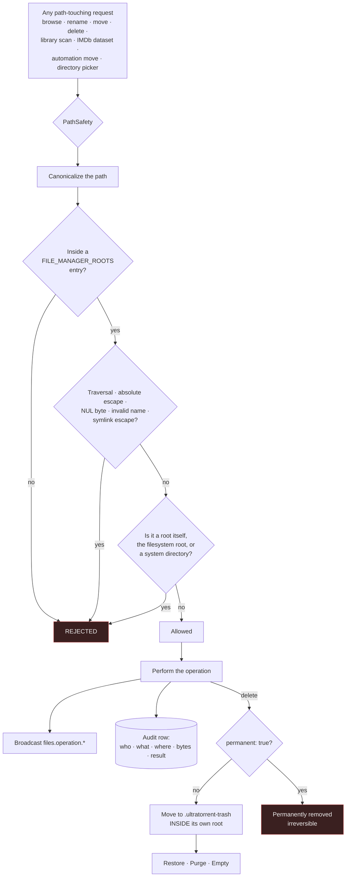

# File Manager

## Overview

The **File Manager** is a browser-based file manager for the directories your torrent engine writes to. Browse, preview, rename, move, copy, delete, and bulk-operate — without SSH-ing into the box.

It is a **core** module (id `files`, permissions `files.*`), and it is more foundational than it looks: it owns the **root allow-list** that constrains *every* path-touching feature in the product. [Media Manager](/modules/media-manager)'s library scanning, the IMDb dataset path, Automation's move destinations, and every directory picker in the app are all confined by the boundary this module defines.

## Why / when to use it

- **Clean up after a download.** Delete the sample, the `.nfo`, the `Subs/` folder in nine languages.
- **Reclaim space.** The Cleanup Wizard finds junk, duplicates by hash, orphaned subtitles, and partial downloads.
- **Fix a mistake safely.** Deletes go to a **Trash**, not the void.
- **Inspect.** Preview a text file, check a file's sha-256, see how big a folder actually is.

## Prerequisites

- `FILE_MANAGER_ROOTS` set correctly (see below). This is a **deployment-level** decision, not a UI one.
- `files.view` to browse, plus the granular permission for each operation.

## Concepts

**Hard roots** (`FILE_MANAGER_ROOTS`) — an explicit, comma-separated allow-list of directories, set in the environment. **This is the security boundary.** Every operation, in every module, resolves to a path **inside** one of these roots or is rejected.

```bash
FILE_MANAGER_ROOTS=/downloads,/media   # default: /downloads
```

**Default Root Path** — an *optional narrowing* inside the hard roots, set by an admin (permission `settings.manage_root_path`). Hard roots `= /downloads`, Default Root Path `= /downloads/complete`. It can **only narrow within** the hard roots — never widen past them, never reach a system directory.

**`PathSafety`** — the enforcement. It canonicalizes every path and defeats `../` traversal, absolute-path escape, NUL bytes, invalid names, and **symlink escapes**, and refuses to operate on a configured root itself, the filesystem root, or a system directory.

**Trash** — deletes are **soft by default**. The item moves to a `.ultratorrent-trash` directory **inside its own storage root** (so it never crosses a filesystem boundary), and a row records its original path, size, and who deleted it.

**Cleanup Wizard** — scans a folder, classifies removable candidates into categories, and shows you an estimated space saving. **It never deletes automatically.**

## How it works



**The backend is authoritative.** The frontend only *hides* what you cannot do; the server is what *refuses*. That distinction matters — a crafted request cannot escape the roots by bypassing the UI.

## Configuration

### Roots

| Setting | Where | Default | Recommended |
|---------|-------|---------|-------------|
| `FILE_MANAGER_ROOTS` | Environment | `/downloads` | **Keep it as narrow as possible.** Add `/media` if your libraries live there. Never add `/`, `/etc`, or a home directory. |
| `fileManager.defaultRootPath` | **Settings → Default Root Path** (needs `settings.manage_root_path`) | `""` (use the env roots as-is) | Narrow it to the subtree people actually need, e.g. `/downloads/complete`. |

The Default Root Path is changed **only** via `PUT /api/files/root` (validated + audited), **not** through the generic settings endpoints — it is a protected key, and writing it via `PATCH /api/settings` returns a `403` telling you so.

`GET /api/files/root` reports the effective root plus **exists / readable / writable**, which is surfaced in Settings with a warning if the app cannot write there.

### Directory picker

Path fields across the whole app — Add-Torrent save path, RSS rule save path, Media Manager library paths, Automation move destinations, and the Default Root Path itself — use a **root-limited directory picker**. Breadcrumbs cannot go above the root, folders can be created in place (with `files.create_folder`), and the selection is validated **server-side** on use. Manual entry is still available, and still validated.

### Capabilities and permissions

| Capability | Endpoint | Permission |
|-----------|----------|-----------|
| Browse a directory | `GET /api/files` | `files.view` |
| Properties (size, item count, ext, sha-256) | `GET /api/files/properties` | `files.view` |
| Preview text (≤ 256 KB) | `GET /api/files/preview` | `files.preview` |
| Download a file | `GET /api/files/download` | `files.download` |
| Create folder | `POST /api/files/folders` | `files.create_folder` |
| Rename | `POST /api/files/rename` | `files.rename` |
| Move | `POST /api/files/move` | `files.move` |
| Copy (recursive) | `POST /api/files/copy` | `files.copy` |
| Delete (Trash or permanent) | `POST /api/files/delete` | `files.delete` |
| Bulk move/copy/delete/cleanup | `POST /api/files/bulk` | `files.bulk_actions` |
| Cleanup preview / execute | `POST /api/files/cleanup-preview` · `…/cleanup-execute` | `files.cleanup` |
| Trash list / restore / purge / empty | `GET /api/files/trash` · `…/trash/*` | `files.view` / `files.delete` |

`files.manage` is retained as a **legacy umbrella** permission; the file manager itself uses the granular ones above.

### Cleanup categories

| Category | Heuristic |
|----------|-----------|
| `sample_files` | Video files whose name contains `sample` |
| `empty_folders` | Folders whose every child is also being removed |
| `zero_byte_files` | Files of size 0 |
| `duplicate_files` | Identical size **and** sha-256 (keeps the first) |
| `orphan_subtitles` | A subtitle with no video file in its folder |
| `orphan_artwork` | An image with no video file in its folder |
| `nfo_files` / `sfv_files` / `txt_files` | By extension |
| `hidden_temp_files` | Dotfiles, `~`/`.tmp`/`.bak`, `Thumbs.db`, `.DS_Store` |
| `partial_downloads` | `.part`, `.crdownload`, `.aria2`, `.!ut`, … |

The preview returns per-category groups (item count and bytes) and an `estimatedSpaceSaved` total. **Every candidate is individually selectable.**

## Step-by-step walkthrough

**1. Get the roots right, in the environment.** This is the one decision that matters. `FILE_MANAGER_ROOTS=/data` (with downloads and media inside it) is a good shape — it lets [Media Manager](/modules/media-manager) hardlink between them, because they are on one filesystem.

**2. Narrow the Default Root Path** if you want the UI to start somewhere more specific. **Settings → Default Root Path**. Confirm the exists/readable/**writable** badges are all green — if it is not writable, half the operations will fail later in ways that look like bugs.

**3. Browse.** **Files → File Manager**. You cannot navigate above the root; the breadcrumb will not let you.

**4. Delete something, then restore it.** Delete a test file. It goes to **Trash**. Restore it. It comes back to its original location. **Confirm this works before you ever delete anything you care about.**

**5. Run the Cleanup Wizard.** Point it at a completed-downloads folder. It scans and classifies. **Read the categories before selecting anything** — `nfo_files` and `txt_files` are junk to some people and metadata to others.

**6. Select and execute.** Cleanup removes only the paths you selected, **to Trash by default**.

## Screenshots


:::tip Watch this tutorial
_Video coming soon._
:::

## Real-world examples

### Reclaim 40 GB from a completed-downloads folder

Run the Cleanup Wizard on `/downloads/complete`. It finds: 60 sample files, a handful of zero-byte files, 200 orphaned subtitles from packs you deleted the video from, a dozen partial downloads from cancelled torrents, and — the big one — **duplicate files matched by identical size *and* sha-256**, which is how you discover you have the same movie twice under two different release names.

Select the categories you actually want gone. Execute. It goes to Trash, so if you were wrong, you can restore it.

### Give a housemate read-only access

Create a role with `files.view`, `files.preview`, and `files.download` — and nothing else. They can browse and download; they cannot rename, move, or delete a single byte. Then set the **Default Root Path** to the shared subtree so they never even see the rest.

### Recover from a bad delete

You deleted the wrong folder. It is in **Trash**, with its original root-relative path recorded. Click **Restore**. It returns exactly where it was. Restore **never overwrites** an existing item unless you explicitly pass `overwrite: true`.

## Troubleshooting

| Symptom | Cause | Fix |
|---------|-------|-----|
| A path is rejected: outside the roots | It is outside `FILE_MANAGER_ROOTS`. This is a **hard boundary**, and it applies to Media Manager library scanning and the IMDb dataset path too. | Add the root to `FILE_MANAGER_ROOTS`, or move the content inside an existing one. |
| The Default Root Path will not save via the settings API | `fileManager.defaultRootPath` is a **protected key**. `PATCH /api/settings` returns a `403` explaining that you must use the dedicated route. | Use **Settings → Default Root Path** (which calls `PUT /api/files/root`), with the `settings.manage_root_path` permission. |
| Operations fail with permission errors on disk | The root exists and is readable but **not writable** by the app's user. | `GET /api/files/root` reports exists/readable/**writable**; Settings shows a warning. Fix the ownership/`PUID`/`PGID`. |
| Deleted files did not free any space | They went to **Trash**, which is inside the same root. That is the point. | **Purge** the item, or **Empty** the trash. Or pass `permanent: true` on delete to bypass the trash — irreversibly. |
| I cannot see the trash directory when browsing | The `.ultratorrent-trash` directory is **hidden from normal listings** by design. | Use the **Trash** view. |
| Cleanup deleted something I wanted | It never deletes automatically — you selected it. But it went to Trash. | **Restore** it. Then read the categories more carefully next time. `nfo_files` and `txt_files` are junk to some, metadata to others. |
| A restore refuses to run | Something already exists at the original path. Restore never silently overwrites. | Move the existing item, or restore with `overwrite: true`. |
| Media Manager cannot scan a library | Its `path` is outside the hard roots — the scanner calls `assertWithinHardRoots` before it walks anything. | Same fix: move it in-root, or widen `FILE_MANAGER_ROOTS`. |

## Best practices

- **Keep `FILE_MANAGER_ROOTS` as narrow as possible.** It is a security boundary. Every path in the product is confined by it.
- **Never add `/`, `/etc`, or a home directory** as a root.
- **Use the Default Root Path to narrow further** for day-to-day use, without loosening the hard boundary.
- **Leave the trash on.** Soft delete is the default for a reason, and it has saved more people than it has annoyed.
- **Preview cleanup before executing it.** Always. The preview is read-only.
- **Grant granular permissions, not `files.manage`.** The granular set is why a role can browse without being able to delete.
- **Use the directory picker** rather than typing paths. It cannot select an out-of-root path.

## Common mistakes

- **Setting `FILE_MANAGER_ROOTS=/`** to "make things easier". You have just given the web UI your whole filesystem.
- **Assuming a delete freed space.** It went to Trash, which is inside the same root.
- **Selecting every cleanup category** without reading them. `nfo_files` may be the metadata your media server relies on.
- **Putting downloads and media on different filesystems** — which breaks [Media Manager](/modules/media-manager)'s hardlinking, and means a "move" is really a copy-and-delete.
- **Trying to set the Default Root Path through the generic settings API.** It is protected; it has its own route.

## FAQ

**Can the file manager reach my whole filesystem?**
No. It is confined to `FILE_MANAGER_ROOTS`, and every path is canonicalized and checked by `PathSafety`, which defeats traversal, absolute-path escape, NUL bytes, and **symlink escapes**, and refuses to operate on a root itself, the filesystem root, or a system directory.

**Is delete reversible?**
By default, yes. Deletes are **soft** — the item moves to a `.ultratorrent-trash` directory inside its own storage root. Pass `permanent: true` to bypass the trash, which is irreversible.

**Why is the trash inside the root, rather than somewhere central?**
So it never crosses a filesystem boundary. A trash directory on a different volume would turn every delete into a full copy.

**Does the cleanup wizard delete anything on its own?**
No. `cleanup-preview` is **read-only**. You select what to remove, and `cleanup-execute` removes **only** those paths — to Trash by default.

**How does it find duplicates?**
Identical size **and** identical sha-256. It keeps the first and offers the rest.

**Is everything audited?**
Yes. Every operation writes an audit row (`file.created_folder`, `file.renamed`, `file.moved`, `file.copied`, `file.deleted`, `file.cleanup_execute`, `file.restore`, `file.trash_empty`, `file.bulk.<op>`, and `file.operation_failed`) with the user, the source and destination, the byte count, and the result.

**Does the UI update live?**
Yes. Mutating operations broadcast `files.operation.started` / `.completed` / `.failed`, `files.cleanup.completed`, and `files.trash.updated`, and the frontend live-refreshes the current listing.

## Checklist

- [ ] Confirm `FILE_MANAGER_ROOTS` contains only the directories you intend. Expected: no `/`, no home directory.
- [ ] Open **Settings → Default Root Path**. Expected: exists, readable, and **writable** all green.
- [ ] Browse in **Files**. Expected: the breadcrumb refuses to go above the root.
- [ ] Delete a test file. Expected: it lands in **Trash**, not oblivion.
- [ ] Restore it. Expected: it returns to its exact original path.
- [ ] Run a cleanup **preview**. Expected: per-category groups with byte totals and an `estimatedSpaceSaved`, and **nothing deleted**.
- [ ] Execute cleanup on a selected subset. Expected: only those paths are removed, to Trash.
- [ ] Check the audit log. Expected: an entry per operation, with actor, paths, bytes, and result.

## See also

- [Media Manager](/modules/media-manager) — which is confined by the same roots.
- [Torrents](/modules/torrents) — the save paths that land here.
- [Automation](/modules/automation) — the `move` action, validated against the same roots.
- [Audit log](/modules/audit) — where every operation is recorded.
- [Security](/operate/security) — the full path-validation model.
- [Environment reference](/reference/environment) — `FILE_MANAGER_ROOTS`.
- [Backup](/operate/backup)
