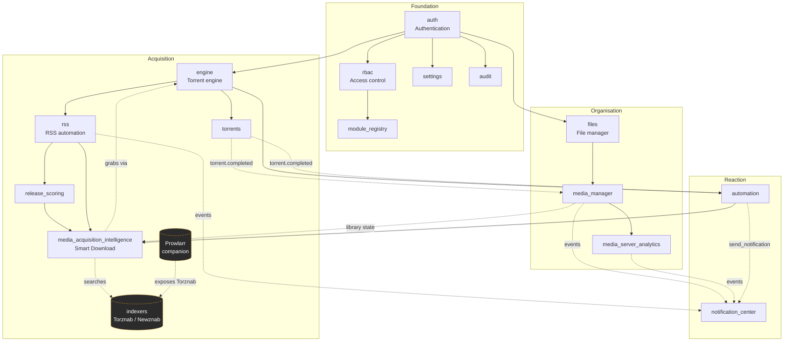

# Modules

UltraTorrent is not a monolith with a settings page bolted on. **Every feature is a module** — a self-contained NestJS module that declares a *manifest*: its id, its tier, the modules it depends on, the permissions it introduces, the API routes it owns, the WebSocket events it emits, and the scheduled jobs it runs.

At boot, the **module registry** loads every manifest, validates it, resolves the dependency graph, and decides what is active. This page is the map: what each module is for, how they fit together, and which page to read next.

## Why it works this way

A module registry buys you four things that matter in a self-hosted product:

- **You can turn things off.** Don't want library management? Disable Media Manager and its UI, routes, and jobs go quiet. Nothing else breaks, because the registry knows who depends on whom.
- **Nothing half-loads.** Manifests are validated at startup — a dependency on an unknown module, or a circular dependency, is rejected with a clear error rather than a mysterious runtime failure.
- **Permissions are declared, not discovered.** Each manifest lists the permissions it introduces; the registry syncs them into the permission catalog so RBAC can assign them from day one.
- **Adding a feature is additive.** A new module is a new manifest plus a guarded controller — see [Creating modules](/develop/creating-modules).

:::info Single tier, no paywall
There is **no licensing, edition, product key, or feature gating** in UltraTorrent. Every module ships in the one community product. `core` and `community` are about *whether you can turn a module off*, not about what you paid. Access is governed **only** by [RBAC permissions](/reference/permissions).
:::

## Tiers

| Tier | Meaning |
|------|---------|
| `core` | Always available, **cannot be disabled**. The system would not be coherent without it — auth, RBAC, engine, torrents, RSS, files, settings, audit, Media Server Analytics, Notification Center. |
| `community` | Bundled optional modules, **on by default but toggleable** by an admin — Media Manager, Release Scoring, Media Acquisition Intelligence. |

## Module state

For every module the registry computes a state:

| State | Meaning | What to do |
|-------|---------|-----------|
| `enabled` | Dependencies satisfied and turned on. | Nothing. |
| `disabled` | Allowed, but an admin turned it off. | Enable it from **Administration → Modules**. |
| `missing_dependency` | It wants to run, but something it depends on is off. | Enable the dependency first. |

`enabled` requires **all** dependencies to be enabled, computed as a fixpoint — so disabling a module **cascades** to everything that depends on it. Disabling RSS, for example, takes Release Scoring and Media Acquisition Intelligence down with it, because both declare RSS as a hard dependency.

Two rules protect you from breaking the install:

- **Core modules cannot be disabled.**
- **A module may only be disabled if no enabled module depends on it.**

Every enable/disable is recorded as a module event **and** an audit-log entry.

## How the modules relate

Solid arrows are **declared manifest dependencies** (the registry enforces them). Dashed arrows are **runtime collaborations** — one module using another's data or events without a hard dependency. The dashed boxes are subsystems that are not registry modules: **Indexers** is RBAC-gated but has no manifest, and **Prowlarr** is an optional external container.

Read the graph as a story:

1. **auth / rbac** decide who you are and what you may do. Nothing else runs without them.
2. **engine** talks to your torrent client; **torrents** is the UI and lifecycle on top of it.
3. **rss** watches feeds; **release_scoring** grades what it finds; **media_acquisition_intelligence** (Smart Download) decides whether a graded release is actually worth acquiring, and asks the engine to grab it.
4. **files** gives every path-touching feature a safe sandbox; **media_manager** organises finished downloads into libraries; **media_server_analytics** reports on what people actually watch.
5. **automation** and **notification_center** are the reactive layer — every other module emits events into them.

## The modules

### Downloading

| Module | Tier | What it does |
|--------|------|--------------|
| [Torrents](/modules/torrents) | core | The torrent list, detail view, lifecycle actions, and bulk operations. |
| [Engines](/modules/engines) | core | The torrent-client abstraction — connect, health-check, and sync your engine. |
| [Indexers](/modules/indexers) | (subsystem) | Torznab/Newznab search endpoints, and the bridge that turns a missing episode into a download. |
| [Prowlarr](/modules/prowlarr) | (companion) | Optional external indexer manager, run as a Compose companion. |

### Acquiring

| Module | Tier | What it does |
|--------|------|--------------|
| [RSS automation](/modules/rss) | core | Feeds, rules, ranked match candidates, and TV airing-status awareness. |
| [Smart Download](/modules/smart-download) | community | The explainable acquisition decision engine: what to grab, when, which release, and whether to upgrade. |
| [Missing Episodes](/modules/missing-episodes) | community | Diffs the IMDb episode catalogue against your library to find the gaps. |

### Organising

| Module | Tier | What it does |
|--------|------|--------------|
| [Media Manager](/modules/media-manager) | community | Scan, identify, enrich, rename, and organise your media libraries. |
| [Media Server Analytics](/modules/media-server-analytics) | core | Plex/Jellyfin/Emby/Kodi monitoring, watch history, reports, and newsletters. |
| [File Manager](/modules/files) | core | Path-safe browsing, file operations, trash, and the cleanup wizard. |

### Reacting

| Module | Tier | What it does |
|--------|------|--------------|
| [Automation](/modules/automation) | core | The trigger → condition → action rule engine. |
| [Notification Center](/modules/notification-center) | core | Provider-driven messaging: rules, templates, recipients, channels, delivery queue. |

### Administering

| Module | Tier | What it does |
|--------|------|--------------|
| [Users & roles](/modules/users) | core | User management, role assignment, 2FA. |
| [API keys](/modules/api-keys) | core | Programmatic access for scripts and integrations. |
| [Audit log](/modules/audit) | core | The append-only trail of every sensitive action. |
| [System](/modules/system) | core | Health probes, settings, and the module registry itself. |

## Managing modules

Modules are managed at **Administration → Modules** (`/modules`), which requires `modules.view` to see and `modules.manage` to change.

:::note Screenshot needed
Capture: **Administration → Modules** — the module grid showing tier badges, enabled/disabled toggles, and dependency chips.
:::

The page lists every module with its tier, state, dependencies, permissions, and health. Core modules render their toggle as locked. A community module whose dependents are still enabled refuses to be disabled, and tells you which module is holding it.

The equivalent API surface:

| Method | Path | Permission |
|--------|------|-----------|
| GET | `/api/modules` | `modules.view` |
| GET | `/api/modules/enabled` | authenticated (this is what drives the client navigation) |
| GET | `/api/modules/:id` | `modules.view` |
| GET | `/api/modules/:id/manifest` | `modules.view` |
| GET | `/api/modules/:id/health` | `modules.view` |
| POST | `/api/modules/:id/enable` | `modules.manage` |
| POST | `/api/modules/:id/disable` | `modules.manage` |

:::tip Watch this tutorial
_Video coming soon._
:::

## Real-world examples

### A minimal download box

You want a headless torrent client with a good web UI and nothing else. Leave the core modules alone (they're mandatory anyway), and **disable** Media Manager, Release Scoring, and Media Acquisition Intelligence at **Administration → Modules**. The Media, Release Scoring, and Media Acquisition nav groups disappear, their routes 404 for non-admins, their scheduled jobs stop ticking, and the app gets measurably quieter.

### A full media pipeline

You want RSS to find episodes, Smart Download to pick the best release and skip what you already own, Media Manager to file the result into a Plex-shaped library, and Notification Center to Telegram you when it lands. That is: `rss` + `release_scoring` + `media_acquisition_intelligence` + `media_manager` + `notification_center`, all enabled (the default). Start at [Quick start](/learn/quick-start), then work through [RSS](/modules/rss) → [Smart Download](/modules/smart-download) → [Media Manager](/modules/media-manager).

## Troubleshooting

| Symptom | Cause | Fix |
|---------|-------|-----|
| A nav entry vanished after an upgrade | The module is disabled, or you lost the permission that gates it. | Check **Administration → Modules** for its state, then check your role at **Administration → Users → Roles**. Module enablement is *never* authorization — see [RBAC](/develop/rbac). |
| "Cannot disable: module X depends on it" | Another **enabled** module declares this one as a hard dependency. | Disable the dependent module first, or leave this one on. |
| A module shows `missing_dependency` | Something it depends on is disabled. | Enable the dependency; the state recomputes as a fixpoint. |
| The backend refuses to start with a manifest error | A manifest references an unknown module id, or a cycle was introduced. | This is a code-level error, not a config one. See [Creating modules](/develop/creating-modules). |
| An admin can still open a disabled module's page | Deliberate — users with `modules.manage` keep access so they can re-enable it. | Nothing to fix. |

## Best practices

- **Disable what you do not use.** Every enabled module costs you scheduled jobs, WebSocket traffic, and attack surface.
- **Grant permissions, not roles-by-vibes.** Read [Permissions](/reference/permissions) once and build roles deliberately.
- **Treat the audit log as the record.** Every enable/disable is audited; use it when something changes and nobody remembers why.
- **Enable one module at a time** when you're first setting up, and verify each before moving on.

## Common mistakes

- **Assuming a hidden nav entry means the route is protected.** It does not. The nav is a convenience layer; the backend RBAC guard is the enforcement point.
- **Disabling `rss` to "quieten things down"** — it cascades to Release Scoring and Smart Download, which is almost never what you wanted. Disable the leaf module instead.
- **Expecting a disabled module's data to be deleted.** Disabling stops the routes and jobs; it does not drop tables. Re-enabling picks up where you left off.

## FAQ

**Is there a paid tier or a licence key?**
No. Every module is in the community product. The registry consults an availability seam that always answers "yes" — it exists so the code has a single place to ask the question, not to gate anything.

**Does disabling a module delete its data?**
No. It stops the module's routes, jobs, and UI. The database rows stay.

**Why can't I disable a core module?**
Because the rest of the system assumes it. Auth, RBAC, the engine, and the audit log are not optional in any coherent configuration.

**How do I add my own module?**
Build the NestJS module, add a manifest, guard the controller, and add the nav entry. The full walkthrough is at [Creating modules](/develop/creating-modules).

**Where do I see exactly which permissions a module introduces?**
Its manifest, surfaced at `GET /api/modules/:id/manifest` and rendered on the [Module reference](/reference/modules) page.

## Checklist

- [ ] Open **Administration → Modules**. Expected: every module listed with a tier badge and a state.
- [ ] Confirm core modules show a locked toggle. Expected: no disable control.
- [ ] Disable one community module (e.g. Release Scoring). Expected: its nav entry disappears for non-admins, and an audit row is written.
- [ ] Try to disable `rss` while Smart Download is enabled. Expected: refused, naming the dependent module.
- [ ] Re-enable the module you disabled. Expected: nav entry returns, no data lost.

## See also

- [Core concepts](/learn/concepts) — the vocabulary used across every module page.
- [Module reference](/reference/modules) — the auto-generated manifest table.
- [Permissions reference](/reference/permissions) — every permission string.
- [Creating modules](/develop/creating-modules) — build your own.
- [Glossary](/help/glossary)
