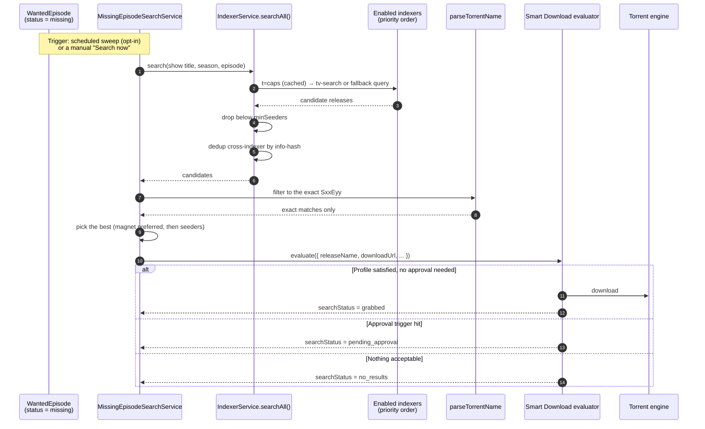

# Indexers

## Overview

An **indexer** is a search endpoint. You ask it "do you have `Severance S02E05` in 1080p?" and it answers with a list of releases. That is fundamentally different from an [RSS feed](/modules/rss), which only tells you what a tracker happened to publish recently.

Indexers are what let UltraTorrent go **looking** for something. Specifically, they are the bridge that turns *"[Missing Episodes](/modules/missing-episodes) says I don't have S02E05"* into *"S02E05 is now downloading"*:

```
Missing Episodes  →  search the indexers  →  evaluate the candidates  →  download
   (detection)            (this page)          (Smart Download)          (engine)
```

UltraTorrent speaks **Torznab** and **Newznab** — the two standard search protocols. Anything that exposes one of those endpoints works: [Prowlarr](/modules/prowlarr), Jackett, or a tracker that natively supports it.

:::info Indexers is a subsystem, not a registry module
Unlike most features on this site, Indexers has **no module manifest** — you will not find it in **Administration → Modules** and you cannot toggle it. It is always present, and access is governed purely by the `indexers.*` RBAC permissions.
:::

## Why / when to use it

Add indexers when you want UltraTorrent to be **proactive** rather than reactive:

- **Fill gaps in a series.** Missing Episodes finds the holes; only an indexer can go and get them.
- **Catch up on a back catalogue.** RSS will never show you an episode from 2019. An indexer will.
- **Cover more trackers than you have feeds for.** One Prowlarr instance can expose dozens of trackers as Torznab endpoints.

If you only ever want new releases as they appear, RSS alone is enough. The moment you care about something that *already exists*, you need an indexer.

## Prerequisites

- **A Torznab or Newznab endpoint.** The easiest way to get one — often several dozen — is the bundled [Prowlarr](/modules/prowlarr) companion container.
- **That endpoint's API key.**
- A working [engine](/modules/engines) — a search that finds a release still needs something to download it.
- Permissions: `indexers.view` to see, `indexers.manage` to add/edit/delete, `indexers.test` to test and run a search.
- For auto-acquire: the **Media Acquisition Intelligence** module enabled, plus a populated [Missing Episodes](/modules/missing-episodes) watchlist.

## Concepts

**Torznab / Newznab** — the search protocols. Newznab came from Usenet; Torznab is its torrent-flavoured sibling. Both are HTTP query APIs with an `apikey` parameter and XML responses.

**Capabilities (`t=caps`)** — before searching, UltraTorrent asks the indexer what it can do: which categories it carries, whether it supports `tv-search`, and its result limits. The answer is cached. If an indexer does **not** advertise `tv-search`, the client falls back to a plain `t=search&q="Show SxxEyy"` query.

**Priority** — a number, **lower is tried first**. It also breaks ties during cross-indexer deduplication.

**`minSeeders`** — a floor. A candidate release with fewer seeders is dropped. **This is the single most important field on this page** — see the warning below.

**`searchStatus`** — the state of a wanted episode's search: `idle → searching → grabbed | pending_approval | no_results | failed`. It is preserved across rescans, so a grabbed episode is never re-searched.

**The sweep** — the scheduled background job that searches for missing episodes. It is **opt-in and off by default**.

## How it works



Two things are worth noticing here.

First, the winning candidate is handed to **the same evaluator that RSS and manual grabs use**. There is no separate "missing episode quality logic" — your acquisition profile governs it exactly as it governs everything else. A search that finds a terrible release will correctly refuse to download it.

Second, grab-state is written back onto the `WantedEpisode` and **survives rescans**, exactly like your `ignored` overrides. That is what stops the sweep from re-grabbing the same episode every hour. The state clears automatically once the episode shows up as owned in your library.

## Configuration

### Indexer fields

| Field | What it does | Default | Recommended |
|-------|--------------|---------|-------------|
| **Name** | Display name. | — | Name it after the tracker, not the proxy. |
| **Implementation** | `torznab` or `newznab`. | — | `torznab` for torrents. |
| **Base URL** | The API base. `/api` is appended if absent. | — | For Prowlarr, copy the per-indexer Torznab URL from Prowlarr's indexer list. |
| **API key** | **AES-256-GCM encrypted at rest**, never returned by the API. | — | For Prowlarr, this is Prowlarr's own API key (**Settings → General → Security → API Key**). |
| **Enabled** | Whether the search fan-out includes it. | On | Disable a flaky indexer rather than deleting it. |
| **Priority** | Lower is tried first; also the dedup tie-breaker. | — | Put your best/private trackers first. |
| **Categories** | Newznab categories to query. | `5000,5030,5040` (TV) | Leave the default for TV. Add movie categories if you monitor movies. |
| **`minSeeders`** | Drop candidates below this seeder count. | **unset** | **Set it. Always. Start at `3`.** |
| **Capabilities** | Cached `t=caps` negotiation. | Auto | Re-run **Test** if the indexer's capabilities change. |

:::danger Set `minSeeders` on every indexer
The per-indexer seeder filter **only applies when the column is set**. Leave it unset and zero-seeder releases sail straight through.

This is not theoretical. On a real install, two of four indexers had no `minSeeders`, the missing-episode sweep worked through a whole back catalogue, and the client ended up holding **1,137 torrents moving 0 bytes** — 1,114 of them with zero seeders. A zero-seeder magnet can never fetch its metadata, yet the engine counts it as an *active download* the entire time it tries, so 100 active slots were permanently pinned by torrents that could never finish, and 1,034 healthy torrents queued behind them forever.

Set `minSeeders`. Also enable the [parking queue](/modules/torrents) as a second line of defence.
:::

### API-key handling

The API key is redacted to `••••••••` on every read. **Sending the mask back on an update keeps the existing key** — so you can edit an indexer's name without retyping its key. The key is injected into the `apikey=` query parameter and the full URL is **never logged**.

### The auto-acquire sweep (settings key `media_acquisition.settings`)

| Key | What it does | Default | Recommended |
|-----|--------------|---------|-------------|
| `autoSearchMissing` | Enables the scheduled sweep. | **`false`** | Turn it on once your library is well-identified and your indexers have a `minSeeders` floor. Not before. |
| `searchIntervalMinutes` | Per-episode re-search backoff. An episode is not searched again until this has elapsed. | `60` | `60`–`360`. Searching a non-existent episode every minute helps nobody. |
| `maxSearchesPerSweep` | Episodes searched per sweep tick. | `50` | `50`. Lower it if you are hammering your indexers. |
| `missingSearchProfileId` | The acquisition profile used for grabs. Falls back to the watchlist item's own profile. | `null` | Set it to a deliberately conservative profile. |

Configure these at **RSS & Acquisition → Acquisition Intelligence → Settings** ("Auto-download missing episodes").

### Manual search

A manual search runs whenever the module is enabled, **regardless of `autoSearchMissing`**. That makes it the safe way to try the pipeline before you turn the sweep on.

- `POST /api/media-acquisition/missing-episodes/:id/search` — one episode.
- `POST /api/media-acquisition/missing-episodes/series/:watchlistItemId/search` — a whole series.

Both need `media_acquisition.evaluate`.

### Endpoints and permissions

| Method | Path | Permission |
|--------|------|-----------|
| GET | `/api/indexers` | `indexers.view` |
| GET | `/api/indexers/:id` | `indexers.view` |
| POST | `/api/indexers` | `indexers.manage` |
| PATCH | `/api/indexers/:id` | `indexers.manage` |
| DELETE | `/api/indexers/:id` | `indexers.manage` |
| POST | `/api/indexers/:id/test` | `indexers.test` |
| GET | `/api/indexers/:id/search?q=&season=&ep=` | `indexers.test` |

## Step-by-step walkthrough

**1. Get a Torznab endpoint.** The path of least resistance is [Prowlarr](/modules/prowlarr): bring up the companion container, add your trackers there, and copy each one's Torznab URL.

**2. Add the indexer.** **Downloads → Indexers → Add**. Paste the base URL and the API key. **Set `minSeeders` to at least 3.** Set a priority.

**3. Test it.** The **Test** button runs `t=caps`. A green result means the endpoint answered and UltraTorrent now knows its categories and capabilities. A red one tells you what failed.

**4. Search manually, from the indexer.** Use `GET /api/indexers/:id/search?q=...` (or the UI's search) to confirm the indexer actually returns results for a show you know it carries. Fix this before going further — an indexer that returns nothing here will never fill a gap.

**5. Fill one gap by hand.** Go to **Missing Episodes**, find a `missing` episode, and click **Search now**. Watch the `searchStatus` badge move. It should land on `grabbed` (auto-downloaded), `pending_approval` (routed to the approval queue), or `no_results`.

**6. Only now, turn on the sweep.** Once step 5 works reliably, enable `autoSearchMissing`. Check back in an hour and look at what it grabbed — and at the seeder counts on those grabs.

## Screenshots


:::tip Watch this tutorial
_Video coming soon._
:::

## Real-world examples

### Backfill a season you never had

You have seasons 2–4 of a show and want season 1. RSS is useless here — no feed is going to republish a five-year-old season. Add the series to the [Missing Episodes](/modules/missing-episodes) watchlist, scan it, and the season-1 episodes appear as `missing`. Hit **Search all** on the series. The indexers get queried per episode, the evaluator applies your profile, and what passes gets downloaded into the show's existing library folder.

### Stop the sweep from grabbing garbage

You turned on `autoSearchMissing` and woke up to forty stalled torrents. Diagnose it in this order: **(1)** Do all your indexers have a `minSeeders`? Almost certainly not — that is the cause. Set it. **(2)** Enable the [parking queue](/modules/torrents) so dead grabs cannot pin download slots. **(3)** Raise `searchIntervalMinutes` so you are not re-searching the same absent episodes every hour. **(4)** Point `missingSearchProfileId` at a stricter acquisition profile with a higher `minimumScore`.

## Troubleshooting

| Symptom | Cause | Fix |
|---------|-------|-----|
| The client fills up with 0-seeder torrents that never start | An indexer has no `minSeeders`, so dead releases pass the filter. A 0-seeder magnet holds an active download slot forever while it hunts for metadata it will never find. | Set `minSeeders` on **every** indexer. Enable the [parking queue](/modules/torrents). |
| A grab from a self-hosted Prowlarr silently does nothing | The `.torrent` URL resolves to a private Docker/LAN IP, and the SSRF guard blocks the fetch: *"Torrent URL resolves to a blocked internal address"*. The Prowlarr **connection test still passes** — the health check trusts private hosts, but the torrent fetch is a separate, stricter guard. | Add the host to `SSRF_ALLOW_HOSTS`. The bundled stack defaults to `prowlarr`; keep it in the list when adding others (`SSRF_ALLOW_HOSTS=prowlarr,indexer.lan`). |
| Test fails with "blocked by Cloudflare Protection" | The tracker is behind Cloudflare's anti-bot challenge. | Run the **FlareSolverr** companion and tag the indexer in Prowlarr. See [Prowlarr](/modules/prowlarr). |
| Search returns results, but nothing is ever grabbed | The evaluator is doing its job. Either the release fails your acquisition profile's `minimumScore`, or you already own it at equal/better quality, or it was routed to the approval queue. | Check **Smart Download → Rejected** and **→ Approval queue**. The evaluation's trace tells you exactly which step said no. |
| An episode is never found, though the tracker clearly has it | A candidate only matches when its scene title **parses to the show name**. A show known by an alias different from your watchlist title will not match — the release is skipped rather than mis-grabbed. | Rename the watchlist item to the scene title, or grab it manually. |
| The sweep never runs | `autoSearchMissing` is `false`. That is the default. | Enable it in **Acquisition Intelligence → Settings**. Manual search works regardless. |
| An episode shows `no_results` forever | The indexers genuinely do not have it, or the per-episode backoff has not elapsed. | Check `searchIntervalMinutes`. Then run a manual search on the indexer directly to see raw results. |
| Movies are never auto-searched | Auto-search is **episode-only** today. `WantedMovie` rows carry the same grab-state columns, but nothing sweeps them. | Grab movies manually, or via RSS. |

## Best practices

- **`minSeeders` on every indexer, before you enable the sweep.** This is the whole ballgame.
- **Prove it manually first.** Test → indexer search → one manual episode search → *then* the sweep.
- **Prioritise your good trackers.** Lower priority number = tried first = wins the dedup tie-break.
- **Use a conservative profile for the sweep.** `missingSearchProfileId` exists precisely so background grabs can be pickier than your foreground ones.
- **Re-identify your library before you trust the gap list.** Missing Episodes is only as accurate as your library's identification — see [Missing Episodes](/modules/missing-episodes).
- **Enable the parking queue.** Belt and braces.

## Common mistakes

- **Leaving `minSeeders` blank** because it looked optional. It is optional in the schema and mandatory in practice.
- **Adding an RSS feed URL as an indexer.** RSS feeds are not indexers. Only Torznab/Newznab endpoints are searched here.
- **Turning on `autoSearchMissing` on day one**, before the library is identified and before the indexers are proven. You will grab a lot of things you did not want.
- **Assuming a passing Prowlarr connection test means downloads will work.** It does not. That is the SSRF trap above, and it is the single most confusing failure in the product.
- **Expecting movie gaps to be auto-filled.** They are not, yet.

## FAQ

**What is the difference between an indexer and an RSS feed?**
An RSS feed **pushes** you whatever a tracker published recently. An indexer lets you **pull** — to ask for a specific title, season, and episode. RSS cannot backfill; indexers can.

**Do I need Prowlarr?**
No. Any Torznab/Newznab endpoint works — Jackett, a native tracker endpoint, whatever you have. Prowlarr is just the most convenient way to get dozens of them.

**Where is the API key stored?**
Encrypted with AES-256-GCM (`SecretCipher`), redacted from every API response, and never written to logs — including the request URL, which carries it as a query parameter.

**Does the search bypass my quality rules?**
No. The winning candidate goes through the **same evaluator** as every other acquisition path. Your acquisition profile decides whether it downloads, waits, holds for approval, or is skipped.

**Will it re-grab an episode it already grabbed?**
No. `searchStatus` is written back to the wanted episode and preserved across rescans. There is also a per-episode `lastSearchedAt` backoff, a re-entrancy guard on the sweep, cross-indexer info-hash dedup, and the evaluator's own "already owned" check.

**How often does the sweep run?**
It runs on the acquisition scheduler tick, but the *effective* cadence per episode is `searchIntervalMinutes` (default 60), and each tick is capped at `maxSearchesPerSweep` (default 50).

## Checklist

- [ ] Add an indexer with a `minSeeders` of at least 3. Expected: it saves, and the API key shows as `••••••••`.
- [ ] Click **Test**. Expected: a green status, and the indexer's categories and capabilities are cached.
- [ ] Run an indexer search for a show you know it carries. Expected: candidate releases with seeder counts.
- [ ] Run a **Search now** on one missing episode. Expected: the `searchStatus` badge moves to `grabbed` or `pending_approval`.
- [ ] Confirm the grab landed in the show's library folder, not `/downloads`. Expected: the save path resolves to the show's folder.
- [ ] Enable `autoSearchMissing`, wait one interval, and inspect the grabs. Expected: every grab has a healthy seeder count.
- [ ] Check the [parking queue](/modules/torrents) is enabled. Expected: no dead torrent can pin a slot.

## See also

- [Missing Episodes](/modules/missing-episodes) — the detection half of this pipeline.
- [Smart Download](/modules/smart-download) — the evaluator that decides on each candidate.
- [Prowlarr](/modules/prowlarr) — the companion indexer manager, and the SSRF trap.
- [Torrents](/modules/torrents) — the parking queue.
- [RSS automation](/modules/rss) — the push half of acquisition.
- [Security](/operate/security)
