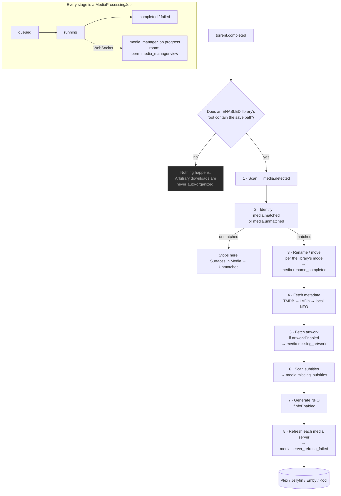

import Tabs from '@theme/Tabs';
import TabItem from '@theme/TabItem';

# Media Manager

## Overview

A completed torrent is a folder with a name like `Show.Name.S02E05.2160p.WEB-DL.DDP5.1.HDR.H265-GROUP`. A media server wants `Show Name/Season 02/Show Name - S02E05 - Episode Title.mkv`, with a poster, an overview, and subtitles.

**Media Manager** is the machine that turns the first thing into the second thing.

It scans your folders, identifies what each file actually is, enriches it with metadata and artwork, finds subtitles, generates NFO sidecars, and renames or hardlinks files into a media-server-shaped library — then tells Plex, Jellyfin, Emby, or Kodi to refresh.

It is a `community` module (id `media_manager`, permissions `media_manager.*`) that depends on `auth` and [`files`](/modules/files). It can be disabled if you do not want it.

## Why / when to use it

- **Your media server cannot see your downloads.** Scene naming is not Plex naming. Media Manager bridges that.
- **You are seeding and cannot move files.** Hardlinking (the default) puts the file in the library *and* leaves the original in place for the torrent client. One copy of the bytes, two paths.
- **You want [Smart Download](/modules/smart-download) to work.** Its entire "do I already own this?" logic reads Media Manager's library. Without a well-identified library, Smart Download is confidently wrong.
- **You want [Missing Episodes](/modules/missing-episodes) to be accurate.** Same reason.

## Prerequisites

- **`FILE_MANAGER_ROOTS`** must include the paths your libraries live under. This is the hard boundary — a library whose path falls outside it is **rejected at scan time**. See [File Manager](/modules/files).
- Somewhere for the library to live (which can be the same volume as your downloads — that is what hardlinking is for).
- Permissions: `media_manager.view` to look, plus the granular ones for each action.
- **Optional but transformative:** a **TMDB API key** (setting `media.tmdbApiKey`, or `TMDB_API_KEY`). Without it, metadata falls back to reading local `.nfo` sidecars only.

## Concepts

**Library** (`MediaLibrary`) — a folder on disk plus the rules for organising what is in it: its kind, its naming preset, and its rename mode.

**Item** (`MediaItem`) — one identified *title*. A TV item is a show; a movie item is a movie.

**File** (`MediaFile`) — one physical file, with its parsed technical attributes (container, codecs, resolution, HDR, language, release group).

**Identification** — parsing a release name into type / title / year / season / episode, with a **confidence** score. When the filename alone omits the title — the common case for tidy libraries where the show name lives in the folder (`Show/Season 01/S01E01.mkv`) — identification **climbs to the first meaningful parent folder**, skipping generic `Season N` / `Specials` containers, to recover it.

**Match status** — `unmatched` (could not confidently resolve), `matched` (auto-identified), or `manual` (a human matched it). **A `manual` match is never auto-overwritten.**

**Rename mode** — what actually happens to the file. This is the most consequential setting in the module:

| Mode | Effect | Safe to seed? |
|------|--------|--------------|
| `preview` | Dry run. Build the plan, touch nothing. | Yes |
| `hardlink` | **Default.** Hardlink into the library, original stays. One copy of the bytes. | **Yes** |
| `symlink` | Symlink into the library, original stays. | Yes |
| `copy` | Copy to the library, original stays. Two copies of the bytes. | Yes |
| `rename_in_place` | Rename the original **in place**. | **No** |
| `rename_move` | **Move** the original to the destination. | **No** |

**Preset** — a set of default naming templates shaped for a media server: `plex`, `jellyfin`, `emby`, `kodi`, or `custom`.

## How it works



Three properties of this pipeline are worth internalising:

1. **It is opt-in and scoped.** The post-download workflow fires **only** for enabled libraries whose root `path` *contains* the torrent's save path. If you download something to a folder no library covers, nothing happens to it. This is deliberate — arbitrary downloads are never auto-organised.
2. **Each stage is isolated.** A failure in one stage never aborts the rest, and the handler never throws — it cannot take down the torrent sync loop.
3. **Everything long-running is a background job.** Scans, identification, metadata, artwork, subtitles, rename, and NFO all run through an in-process queue that persists each unit as a `MediaProcessingJob` and streams progress over WebSocket. That is why a scan of a 24,000-file library does not time out the HTTP request.

## Configuration

### Library

| Field | What it does | Default | Recommended |
|-------|--------------|---------|-------------|
| **Name** | Display name. | — | — |
| **Kind** | `tv`, `anime`, `movie`, `music`, `audiobook`, or `general`. | `tv` | **Get this right.** The library's kind is *authoritative* for movie-vs-TV identification. A TV show in a `movie` library will be identified as a movie. |
| **Path** | The root folder to scan. Must be inside `FILE_MANAGER_ROOTS`. | — | Use the directory picker; it cannot select an out-of-root path. |
| **Preset** | `plex`, `jellyfin`, `emby`, `kodi`, `custom`. | `plex` | Match your media server. |
| **Template** | A per-library rename template, overriding the preset. | Unset | Leave unset unless you have a reason. See the template warning below. |
| **Mode** | The rename mode (table above). | `hardlink` | **`hardlink`.** It puts the file in the library while leaving the original for the torrent client to seed. |
| **Enabled** | Whether the library participates in scans and the post-download workflow. | On | — |
| **Scan interval (minutes)** | Optional periodic re-scan, which auto-populates metadata and artwork for new folders. Never renames or moves files. | Unset | Set it if you add files outside UltraTorrent. |
| **NFO enabled** | Generate NFO sidecars during the workflow. | **Off** | On, if your media server prefers local metadata. |
| **Artwork enabled** | Fetch artwork during the workflow. | **On** | On. |

:::danger Hardlinks need one filesystem
A hardlink cannot cross a filesystem boundary. If `/downloads` and `/media` are different volumes, hardlinking **will fail** and you will end up copying (two copies of the bytes) or moving (breaking your seed). Mount them as one volume — this is the single most common Docker media-stack mistake.
:::

### Rename templates

Tokens are **case-sensitive** and use `{Token}` syntax. Numeric tokens accept zero-padding as `{Token:00}`. `{Token?…}` renders its inner literal only when the token is present.

| Token | Value |
|-------|-------|
| `{Movie Title}` | Movie title |
| `{Series Title}` | Series/show title |
| `{Episode Title}` | Episode title |
| `{year}` | Release year |
| `{season}` / `{episode}` / `{episodeEnd}` | Numbers, e.g. `{season:00}` |
| `{Resolution}` | `1080p`, `2160p`, … |
| `{Source}` | `BluRay`, `WEB-DL`, … |
| `{Codec}` | Video codec |
| `{Release Group}` | Release group |
| `{ext}` | File extension |

<Tabs>
<TabItem value="tv" label="TV (Plex preset)" default>

```
{Series Title}/Season {season}/{Series Title} - S{season:00}E{episode:00}{episodeEnd? - E{episodeEnd:00}} - {Episode Title}.{ext}
```

</TabItem>
<TabItem value="movie" label="Movie (Plex preset)">

```
{Movie Title} ({year})/{Movie Title} ({year}) - {Resolution}.{ext}
```

</TabItem>
</Tabs>

Every path segment is sanitized (traversal neutralized), and `Season 00` is rewritten to `Specials`.

:::warning A corrupt template used to be able to destroy filenames
A library whose template was truncated to a lone `{` rendered **every** episode's destination to the literal string `{` — an unclosed token is not a legal token, and `{` is not an illegal filename character, so it survived sanitisation. Every episode in a folder was renamed onto the same name, overwriting the last: on one real host, **284 files named `{`, ~111 GB, original names unrecoverable**.

This is fixed. A rendered path is now only usable for a primary video if it is non-empty, contains **no** unresolved `{` or `}`, and its basename ends in the file's own extension. A file failing that check is **skipped** with `reason: 'invalid naming template'` and a warning, never moved.

Still: **preview a template change before applying it.** `preview` mode exists for exactly this.
:::

### Metadata providers

| Provider | Needs | Notes |
|----------|-------|-------|
| **`local`** | Nothing | Reads a local `.nfo` sidecar next to the media. Always available, offline. |
| **`tmdb`** | An API key | The Movie Database v3. The good one. |
| **`imdb`** | Your own dataset, or a licensed API | See below. |

The TMDB key resolves at runtime: the setting **`media.tmdbApiKey`** first, then the environment variable **`TMDB_API_KEY`**. If neither is set, the provider **silently degrades** to the offline local provider — metadata still works from NFO sidecars, but you get nothing new.

### IMDb integration

:::info No scraping. Ever.
UltraTorrent does **not** scrape IMDb web pages. IMDb support uses **user-provided IMDb datasets** (the official non-commercial `.tsv.gz` files) or **licensed IMDb API access** that you are entitled to use. Neither is required to run UltraTorrent — with no IMDb configuration, the provider stays disabled and nothing else is affected.
:::

Modes (**Media → Settings → IMDb**, setting `media.imdb.mode`):

| Mode | Behaviour |
|------|-----------|
| `disabled` | Off. **Default.** |
| `dataset` | Serve from your imported dataset tables only — fully offline. |
| `official_api` | Query your configured licensed IMDb REST API only. |
| `hybrid` | Prefer the dataset; fall back to the licensed API. |

**Dataset import**, which is what [Missing Episodes](/modules/missing-episodes) depends on:

1. **Get the datasets.** Download the seven `.tsv.gz` files from IMDb's official datasets page, subject to IMDb's terms: `title.basics`, `title.akas`, `title.crew`, `title.episode`, `title.principals`, `title.ratings`, `name.basics`.
2. **Place them under your root path.** They must live **under one of your `FILE_MANAGER_ROOTS`**. A path outside is rejected.
3. **Validate.** The server checks each file exists, is in-root, and is a readable gzip/TSV with the expected header. Progress streams over WebSocket.
4. **Import.** A detached, resumable job streams each gzipped TSV row-by-row into the IMDb tables. The endpoint returns immediately; the job continues in the background with live progress.

**You must enable "Import TV series & episodes"** if you want [Missing Episodes](/modules/missing-episodes) to work at all. A movies-only import leaves the episode catalogue empty.

| IMDb setting | Default |
|--------------|---------|
| `mode` | `disabled` |
| `apiBaseUrl` / `apiKey` | `null` (key is AES-GCM encrypted, redacted) |
| `datasetPath` | `null` |
| `preferredRegion` / `preferredLanguage` | `null` |
| `includeAdult` | `false` |
| `minVotes` | `0` |
| `cacheTtl` | `3600` s |

### Media-server integrations

Media Manager pushes library refreshes to **Plex**, **Jellyfin**, **Emby**, and **Kodi**, under `/api/media/server-integrations` (all gated by `media_manager.manage_integrations`).

Secret config keys (`token`, `apiKey`, `password`) are **AES-GCM encrypted at rest** and **redacted to `••••••••`** in every response. On update, a placeholder of only `•` characters means "keep the existing secret."

### Permissions

| Permission | Grants |
|-----------|--------|
| `media_manager.view` | Dashboards, libraries, items, artwork, subtitles, duplicates, presets, history. |
| `media_manager.manage_libraries` | Create / update / delete libraries. |
| `media_manager.scan` | Trigger a library scan. |
| `media_manager.match` | Match / unmatch / re-identify items. |
| `media_manager.edit_metadata` | Edit items; fetch and edit metadata. |
| `media_manager.manage_artwork` | Select and upload artwork. |
| `media_manager.manage_subtitles` | Scan subtitles. |
| `media_manager.rename` | **Execute** a rename plan. |
| `media_manager.generate_nfo` | Generate NFO sidecars. |
| `media_manager.manage_integrations` | Manage / test / refresh media-server integrations. |
| `media_manager.imdb.*` | `view`, `configure`, `import_dataset`, `search`, `match`. |

`move_files`, `delete`, and `admin` are declared in the catalog but **reserved** — no endpoint enforces them yet.

## Step-by-step walkthrough

**1. Get the volume layout right, first.** Downloads and media must be on **one filesystem** for hardlinks to work. In Docker, mount a single volume (e.g. `/data`) with `/data/torrents` and `/data/media` inside it, and set `FILE_MANAGER_ROOTS=/data`.

**2. Set a TMDB key.** **Media → Settings**. Everything downstream is better with it.

**3. Create a library.** **Media → Libraries → New**. Kind = `tv`. Path = your TV folder (use the picker). Preset = `plex`. Mode = `hardlink`. Artwork on.

**4. Scan it.** The scan runs as a **background job** with a live progress bar and a per-file action log. On a large library this takes a while — that is expected, and the HTTP request will not time out.

**5. Clear the unmatched pile.** **Media → Unmatched**. For each item, either re-run auto-identification (`match` with an empty body), or match it manually. Use **bulk re-identify** to retry all the failures at once — `manual` matches are never overwritten.

**6. Preview a rename before you apply one.** **Media → Rename Engine**. Look at the plan. Confirm the destinations are what you expect. *Then* apply.

**7. Connect your media server.** **Media → Settings → Media Server Integrations**. Add Plex/Jellyfin/Emby/Kodi, **Test** it, and confirm it goes green.

**8. Let the pipeline run.** From now on, a completed torrent whose save path is inside the library's root is scanned, identified, hardlinked into place, enriched, and pushed to your media server — automatically.

## Screenshots

:::note Screenshot needed
Capture: **Media → Media Dashboard** — the library health overview with item counts, unmatched counts, and duplicate groups.
:::


:::note Screenshot needed
Capture: **Media → Libraries** — the library list, and a scan in progress showing the modal with the progress bar and the auto-scrolling per-file action log.
:::


:::note Screenshot needed
Capture: **Media → Unmatched** — unmatched items with the manual-match dialog open, showing search results and confidence scores.
:::


:::note Screenshot needed
Capture: **Media → Rename Engine** — a rename preview showing source → destination for several files, with the mode selector visible.
:::


:::note Screenshot needed
Capture: **Media → Settings → IMDb** — the provider mode selector, dataset path picker, and the dataset import with its live progress.
:::


:::tip Watch this tutorial
_Video coming soon._
:::

## Real-world examples

### Seed and serve the same file

You are on a private tracker and must seed for weeks. You also want Plex to see the file *now*, named correctly. Set the library's mode to **`hardlink`**. The torrent client keeps seeding `/data/torrents/Show.S02E05.../file.mkv`; Plex reads `/data/media/tv/Show/Season 02/Show - S02E05 - Title.mkv`. **One copy of the bytes on disk.** Both paths point at the same inode. When you eventually stop seeding and delete the torrent's copy, the library's link survives.

### Rescue a library the renamer never touched

You have thousands of files in scene-named folders that a previous tool never organised. Create the library over them, set the mode to `hardlink` (or `rename_in_place` if you are not seeding them and want them tidied in place), and scan. The scanner organises in-place files into `Show/Season` structure — with a safety guard that keeps the move **within the file's own show folder**, so it can never fling a file across your library. Then re-identify to fill in season/episode numbers, and let the IMDb link resolve.

### Find and kill duplicates

**Media → Duplicates** groups items by reason: `title_year`, `show_season_episode`, `external_id`, `file_hash`, or `similar_filename`. That last one catches the case where you have the same episode from two different release groups at two qualities. Review the groups, keep the better copy, and remove the other — through the [File Manager](/modules/files), which soft-deletes to Trash rather than destroying anything.

## Troubleshooting

| Symptom | Cause | Fix |
|---------|-------|-----|
| A library scan is rejected before it starts | The library's `path` falls **outside** `FILE_MANAGER_ROOTS`. This is a hard security boundary, checked at scan time. | Move the library inside a configured root, or add the root to `FILE_MANAGER_ROOTS`. |
| Hardlinking fails / files are being copied | `/downloads` and `/media` are on **different filesystems**. A hardlink cannot cross one. | Mount them as one volume. This is the classic Docker media-stack mistake. |
| A large library scan returns 504 Gateway Time-out | Historically, scanning was **synchronous** — the HTTP request awaited the whole scan, and a ~24k-file library blew past the gateway's `proxy_read_timeout`. (The scan itself completed server-side.) Fixed: scans are now detached background jobs that return a `jobId` immediately, with live WebSocket progress. | Update. |
| Every file in a folder collapsed onto a single file named `{` | A corrupt/truncated naming template. See the template warning above. **Fixed** — a rendered path with unresolved braces is now skipped, never applied. | Update. Repair the template. The original names are not recoverable. |
| A show fragments into one "show" per episode | Historically, an episodic file whose filename carried no title produced a separate item per episode. Fixed: identification climbs to the **show folder** for episodic files. | Update, then bulk re-identify. |
| A TV show is identified as a **movie** | Historically, the media type was inferred per file. Fixed: the library's **`kind` is now authoritative** for movie-vs-TV, and `(Year)` is stripped from episode titles. | Set the library's kind correctly, then re-identify. |
| `Hijack.2023.S02E03` gets a mangled title | A bare year *before* the episode marker is the **series year**, not part of the title. Fixed. | Update. |
| A title with an acronym (`M.I.A.`) is mis-parsed | Separator normalization used to turn a title's own dots into spaces. Fixed: repeated single-letter-plus-dot patterns survive. | Update. |
| Metadata never populates | No TMDB key. The provider silently degrades to reading local NFO sidecars — and if there are none, you get nothing. | Set `media.tmdbApiKey` or `TMDB_API_KEY`. |
| The IMDb dataset import fails validation | A file is missing, is not under `FILE_MANAGER_ROOTS`, or is a truncated/renamed gzip. | Confirm all seven `.tsv.gz` files are present, in-root, and intact. Re-download if truncated. |
| An IMDb-heavy operation hangs for minutes | Historically, IMDb lookups were full table scans — 47.8 s per call, and a movie scan could wedge indefinitely. Fixed with GIN trigram indexes, which now build **concurrently at runtime** with zero downtime. | Update, and allow the index build to complete on first boot. |
| A media-server refresh fails | Bad URL, bad token, or the server is unreachable. Failures are audited **without** secrets. | **Test** the integration. Check the audit log for `media.integration.test_failed`. |
| Nothing happens after a torrent completes | The torrent's save path is **not inside** an enabled library's root. This is by design — arbitrary downloads are never auto-organised. | Set the save path on the RSS rule / watchlist item to a folder inside the library. |

## Best practices

- **One filesystem for downloads and media.** Everything else follows from this.
- **`hardlink` mode, always,** unless you have a specific reason not to. It is non-destructive and seeding-safe.
- **Preview before you apply.** Especially after a template change.
- **Get the library `kind` right.** It is authoritative for identification.
- **Re-identify after any identification fix.** The improvements are real, but they only apply to items you re-run.
- **Import the IMDb dataset with TV enabled** if you want gap detection.
- **Never rely on `rename_move` while seeding.** You will break every torrent in that folder.

## Common mistakes

- **Separate volumes for downloads and media.** Hardlinks silently degrade, and you double your disk usage — or move the file and break your seed.
- **Setting mode to `rename_move` because it "sounds tidier"**, while the torrent client is still seeding the original.
- **Skipping the TMDB key** and then wondering why every item has no poster and no overview.
- **A movies-only IMDb import** followed by confusion about why [Missing Episodes](/modules/missing-episodes) is empty.
- **Editing a template by hand and applying without previewing.**
- **Expecting an unmatched item to be organised.** Identification is a gate: unmatched items stop at step 2 and go no further.

## FAQ

**Does Media Manager move my files?**
Only if you tell it to. The default mode is **`hardlink`**, which is non-destructive — the original stays exactly where the torrent client put it. Only `rename_in_place` and `rename_move` relocate the original.

**Will organising break my seeding?**
Not in `hardlink`, `symlink`, `copy`, or `preview` mode. It will in `rename_in_place` and `rename_move`.

**Do I need TMDB?**
No, but without it metadata comes only from local `.nfo` sidecars. With it, you get titles, overviews, posters, ratings, and cast.

**Does it scrape IMDb?**
**No.** It reads IMDb's official downloadable datasets that *you* provide, or a licensed IMDb REST API that *you* configure. Neither is required.

**Why did nothing happen to my completed download?**
The post-download workflow fires **only** when the torrent's save path is inside an **enabled** library's root. That is deliberate: arbitrary downloads are never auto-organised.

**Where do secrets go?**
Media-server tokens, the IMDb API key, and integration passwords are AES-GCM encrypted at rest, redacted from responses, and never logged.

**Can I undo a rename?**
There is a rename **history** (`GET /api/media/history`), but no one-click undo. Preview first. That is what preview is for.

## Checklist

- [ ] Confirm downloads and media share one filesystem. Expected: `stat` shows the same device id for both.
- [ ] Set a TMDB key. Expected: newly fetched items get a poster and an overview.
- [ ] Create a library inside `FILE_MANAGER_ROOTS` with mode `hardlink`. Expected: it saves; the directory picker never offers an out-of-root path.
- [ ] Scan it. Expected: a background job with a live progress bar; no 504.
- [ ] Check **Media → Unmatched**. Expected: near-empty after a bulk re-identify.
- [ ] Preview a rename. Expected: sensible destinations, no `{` or `}` in any path.
- [ ] Apply it, then check disk usage. Expected: **unchanged** — hardlinks do not duplicate bytes.
- [ ] Confirm the torrent is still seeding. Expected: yes.
- [ ] Test a media-server integration. Expected: green, and a manual refresh makes the new item appear in Plex/Jellyfin.
- [ ] Complete a torrent into the library's root. Expected: the full pipeline runs automatically, streamed over WebSocket.

## See also

- [File Manager](/modules/files) — the root boundary, path safety, and the cleanup wizard.
- [Missing Episodes](/modules/missing-episodes) — what the IMDb dataset unlocks.
- [Smart Download](/modules/smart-download) — which reads this library to decide what you already own.
- [Media Server Analytics](/modules/media-server-analytics) — which reuses the same server connections.
- [Automation](/modules/automation) — `media.*` triggers and actions.
- [Notification Center](/modules/notification-center) — being told when a library scan or rename completes.
- [Security](/operate/security)
