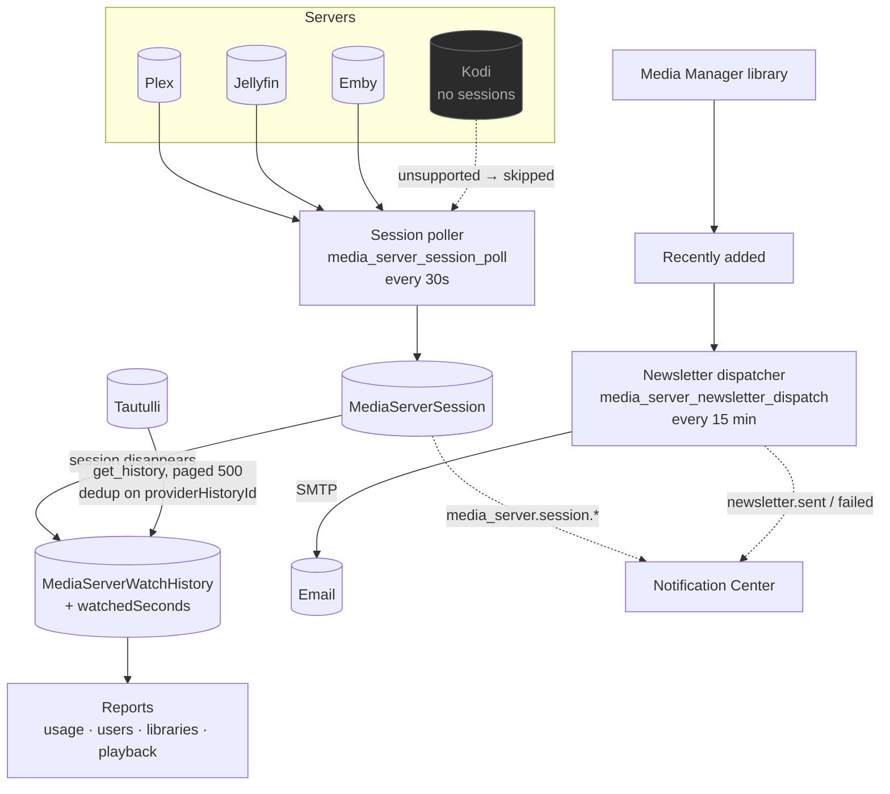

# Media Server Analytics

## Overview

You have a media server. People watch things on it. **Media Server Analytics** turns that into information: who is watching what right now, what they watched last month, which libraries actually get used, and which of your carefully-curated 4K files nobody has ever opened.

It also sends **newsletters** — a scheduled email digest of what has been added recently — and can **import your historical analytics from Tautulli**, so switching does not mean losing years of history.

It is a **core** module (id `media_server_analytics`, permissions `media_server_analytics.*`).

:::info It extends Media Manager, it does not duplicate it
Connections, encrypted secrets, and the Plex/Jellyfin/Emby/Kodi provider layer are **reused from [Media Manager](/modules/media-manager)**. That is why `media_manager` is a hard dependency: the same server you told Media Manager to refresh is the server this module reads statistics from.
:::

## Why / when to use it

- **You share your server.** You want to know who is streaming, from where, on what, and whether they are transcoding (which costs you CPU).
- **You want to prune.** Usage reports tell you which content nobody watches.
- **You want to tell people what is new.** The newsletter does it on a schedule, with posters.
- **You are migrating from Tautulli** and do not want to throw away your history.

## Prerequisites

- A media server: **Plex**, **Jellyfin**, **Emby**, or **Kodi**.
- Its URL and an auth token (Plex: `X-Plex-Token`; Jellyfin/Emby: `X-Emby-Token`; Kodi: JSON-RPC, optionally with basic auth).
- The `media_manager` module enabled (a hard dependency).
- For newsletters: **SMTP settings** configured (**Settings → Email settings**, needs `media_server_analytics.manage_settings`).
- For Tautulli import: a running Tautulli and its API key.

## Concepts

**Connection** — one media server. You may have **unlimited** connections, including several of the same type ("Plex Home" + "Plex Remote"). Each stores a name, type, base URL, encrypted token, enabled/default flags, health status, version, platform, capabilities, and notes.

**Capability** — what a given provider can actually do. Each declares its own set: `libraries`, `recentlyAdded`, `sessions`, `watchHistory`, `refresh`.

| Provider | Auth | Notes |
|----------|------|-------|
| Plex | `X-Plex-Token` | Full capability set. |
| Jellyfin | `X-Emby-Token` | Full capability set. |
| Emby | `X-Emby-Token` | Full capability set. |
| **Kodi** | JSON-RPC (optional basic auth) | **A client, not a server.** No section list, no sessions. It declares those capabilities `false`. |

:::tip Unsupported is not the same as broken
A capability a provider genuinely cannot serve returns a **clean typed result** (`{ supported: false }`), not a generic failure. Analytics degrades gracefully per server — a Kodi connection simply contributes no live sessions, rather than breaking the Live Activity page.
:::

**Session** — a now-playing stream. Captured by a poller and reconciled into `MediaServerSession` rows.

**Watch history** — a completed playback. When a session **disappears**, it is written to `MediaServerWatchHistory` with the seconds watched. This is the media-server-native history source; Tautulli import is the other one.

**Newsletter** — a scheduled email campaign of recently-added media, rendered as a responsive dark "media digest".

**Analytics import** — Tautulli, behind a separate `MediaAnalyticsImportProvider` abstraction. **Tautulli is not a media server** — it is a historical analytics source, and it is modelled as one.

## How it works

The **session poller** runs every **30 seconds**, but only when the module is enabled *and* connections exist. It fetches now-playing sessions from each server (Plex `/status/sessions`, Jellyfin/Emby `/Sessions`; Kodi is unsupported and skipped) and reconciles them. When a session vanishes, that is the signal that playback ended — and the row is written to watch history.

## Configuration

### Connection

| Field | What it does | Recommended |
|-------|--------------|-------------|
| **Name** | Display name. | Distinguish multiple servers of the same type. |
| **Type** | `plex`, `jellyfin`, `emby`, `kodi`. | — |
| **Base URL** | How the backend reaches it. | Inside Docker, use the service name — **not `localhost`**. |
| **Token / credentials** | **AES-256-GCM encrypted at rest**, redacted in every response. | — |
| **Enabled** | Whether it is polled. | — |
| **Default** | The default connection (used for the newsletter's server name, among other things). | Set one. |

**Test** a connection to probe it and persist its health: status, version, platform, and capabilities.

### Newsletters

The newsletter is an original dark "media digest" email built from tables and inline styles (for broad email-client support), with a 720 px container and an amber accent.

- **Sections per content type.** Recently-added items are split into one section per group: TV/anime/episode → *TV Shows*, movie → *Movies*, music/music video/concert → *Music & Concerts*, documentary → *Documentaries*, other → *Recently Added*. Empty groups are omitted.
- **Episodic groups collapse into show cards.** Episodes are grouped by show, and the summary reads "N Shows / M Episodes" — never a flat per-episode list. This is the difference between a readable digest and a wall of 200 rows.
- **Scoping.** A newsletter can be scoped to a subset of content types, so a "TV Shows" newsletter only ever contains grouped shows.
- **Preview + test send.** Both exist. Sample data renders in the preview when the library has no new items, and there is a desktop/mobile preview toggle.
- **Localized** (`en-US` + `es-PR`), with a plain-text alternative always generated.

**Poster hosting is admin-selectable** (**Settings → Newsletter poster images**). Posters are always downscaled to a ~240 px JPEG first, then delivered per the chosen mode:

| Mode | How | Trade-off |
|------|-----|-----------|
| **Embed** (`attach`) | A **CID inline attachment**. **Default.** | Self-contained, no remote fetch, works anywhere. Gmail lists them in the attachment strip. |
| **Serve from this instance** (`self_hosted`) | A **signed, expiring, public image URL**, gated by an HMAC-SHA256 token over `(artworkId, expiry)`. It only ever serves a downscaled artwork **by id** — never an arbitrary path. | No attachments. **Requires your instance to be reachable** at the configured public base URL. |
| **External host** (`external`) | Uploads the downscaled poster to Imgur (client id stored encrypted) and links it. | No attachments; works even if your instance is private. |

Any mode with missing config **silently degrades to `attach`**, so a send never produces broken images. A missing poster degrades to a gradient-initial placeholder — the layout never breaks.

### Tautulli import

1. **Add a source** — Tautulli URL + API key (encrypted at rest, redacted; only `hasApiKey` is ever returned).
2. **Test** — proves the key works.
3. **Preview** — reports the total history and user counts **without importing anything**.
4. **Import** — a background job streams `get_history` in **pages of 500**, writing rows keyed on a unique `(importSourceId, providerHistoryId)`. **Duplicates never inflate statistics, and a re-run is safe.** Progress streams over WebSocket.
5. **Summary** — final counts on the job row.

Phase 1 imports **watch history**. Users, libraries, playback/device/transcode statistics, newsletter config/history, mapping, and incremental sync remain follow-ups.

### Permissions

`media_server_analytics.` + `view`, `manage_connections`, `manage_mappings`, `view_live_activity`, `view_users`, `view_history`, `view_reports`, `export`, `manage_newsletters`, `send_newsletters`, `manage_imports`, `run_imports`, `manage_settings`, `admin`.

### Key endpoints

| Method + path | Permission |
|---------------|-----------|
| `GET /dashboard` | `media_server_analytics.view` |
| `GET/POST/PATCH/DELETE /connections` | `…manage_connections` |
| `POST /connections/:id/test` · `/sync` | `…manage_connections` |
| `GET /live` | `…view_live_activity` |
| `GET /watch-history` | `…view_history` |
| `GET /reports/usage` · `/users` · `/libraries` · `/playback` | `…view_reports` |
| `GET /recently-added` | `media_server_analytics.view` |
| `GET/POST /import-sources`, `POST /import-sources/:id/test` · `/preview` | `…manage_imports` |
| `POST /import-sources/:id/import` | `…run_imports` |

## Step-by-step walkthrough

**1. Add a connection.** **Media Server Analytics → Server Connections → Add**. Type, base URL, token. **Test** it — the green result tells you the version, platform, and the capabilities it actually supports.

**2. Watch Live Activity.** Start playing something on the server. Within 30 seconds it appears under **Live Activity**, with the user, the device, the playback method (direct play vs. transcode), and the bitrate.

**3. Stop playing.** The session disappears from Live Activity and lands in **Watch History**, with the seconds watched.

**4. Import your Tautulli history** (if you have one). **Import Analytics → Add source** → URL + API key → **Test** → **Preview** (this tells you how much history you are about to bring in, without importing anything) → **Import**. Watch the progress. Because it dedups on Tautulli's own history id, re-running is safe.

**5. Read the reports.** **Analytics Reports** now has real data — usage over time, per-user activity, per-library breakdowns, and playback methods.

**6. Set up a newsletter.** Configure SMTP under **Settings → Email settings**. Then **Newsletters → New**: pick the content sections, the schedule, and the recipients. **Preview** it (desktop and mobile), send a **test**, and only then schedule it. The dispatcher checks every 15 minutes.

## Screenshots

:::tip Watch this tutorial
_Video coming soon._
:::

## Real-world examples

### Find out who is melting your CPU

Your server's fans are audible and you do not know why. Open **Live Activity**. Two users are streaming 4K HDR to devices that cannot direct-play it, so the server is transcoding both — that is your CPU. Now open **Analytics Reports → Playback** and you can see whether that is habitual or a one-off. Then wire a [Notification Center](/modules/notification-center) rule on `transcode_detected` so you find out *while* it happens, not after.

### Migrate off Tautulli without losing three years of history

Add Tautulli as an import source. **Preview** first — it tells you exactly how many history rows and users exist, without writing anything. Then import. The job streams in pages of 500 and dedups on Tautulli's own history id, so it cannot double-count and a re-run is safe. When it finishes, your **Analytics Reports** cover the full three years, and going forward the 30-second session poller captures history natively. Tautulli is no longer needed — UltraTorrent does not uninstall it for you, it simply stops being load-bearing.

### A weekly "what's new" email that people actually read

Configure SMTP. Create a newsletter scoped to **TV Shows** and **Movies** only. Because episodic groups collapse into show cards, a week with 47 new episodes across 6 shows renders as **6 show cards** reading "6 Shows / 47 Episodes" — not 47 rows. Preview it on mobile, send yourself a test, then schedule it. Leave poster hosting on **Embed** unless your instance is publicly reachable.

## Troubleshooting

| Symptom | Cause | Fix |
|---------|-------|-----|
| A connection tests green but Live Activity is always empty | The provider does not support sessions. **Kodi** is a client, not a server — it declares `sessions: false` and is skipped by the poller. | This is correct behaviour, not a bug. Use Plex/Jellyfin/Emby for live activity. |
| Live Activity is empty for Plex/Jellyfin/Emby | Nobody is playing anything, or the token lacks permission to read sessions. | Play something and wait up to 30 seconds. Then re-**Test** the connection. |
| The connection test fails | Wrong base URL or token. Inside Docker, `localhost` is the backend container, not your media server. | Use the reachable hostname/service name. Re-copy the token. |
| Watch history is empty though people watch | History is written **when a session ends**. If the module was disabled, or connections did not exist, the poller was not running. | It only captures from the moment it is enabled. Backfill the past with a **Tautulli import**. |
| Newsletter images are broken in Gmail | You chose `self_hosted` and your instance is not reachable at the configured public base URL. | Switch poster hosting to **Embed** (`attach`) — it is self-contained. Any misconfigured mode silently degrades to `attach` anyway. |
| The newsletter never sends | SMTP is not configured, or the schedule has not come due. The dispatcher checks every 15 minutes. | Configure **Settings → Email settings**, and send a **test** to prove SMTP works before relying on the schedule. |
| The newsletter is a wall of 200 episode rows | It should not be — episodic groups **collapse into show cards** by design. | Confirm you are on a current version. |
| A Tautulli import inflated my statistics | It should not — imports dedup on the unique `(importSourceId, providerHistoryId)` key, so a re-run is safe. | Re-check that you did not add the same Tautulli twice as **two different sources**. |
| A report is empty for one server but fine for another | Capability-aware degradation. That server genuinely cannot serve that data. | Check the connection's stored capabilities on the Connections page. |

## Best practices

- **Test every connection and read the capability list.** It tells you upfront what that server will and will not contribute.
- **Preview a Tautulli import before running it.** It costs nothing and tells you exactly what you are about to bring in.
- **Keep newsletter poster hosting on Embed** unless your instance is genuinely publicly reachable. It is the mode that cannot break.
- **Send a test newsletter before scheduling one.** SMTP failures are much easier to debug on demand than on a cron.
- **Scope newsletters by content type.** A TV-only digest is far more readable than an everything digest.
- **Wire `transcode_detected` into the [Notification Center](/modules/notification-center)** if your server is CPU-constrained.

## Common mistakes

- **Expecting Kodi to report sessions.** It cannot. It is a client.
- **Using `localhost` as the base URL** from inside a container.
- **Assuming watch history is retroactive.** It starts when the poller starts. Import from Tautulli for the past.
- **Choosing `self_hosted` poster images on a private instance**, then wondering why every image is broken in the email.
- **Scheduling a newsletter before proving SMTP.**

## FAQ

**Which media servers are supported?**
Plex, Jellyfin, Emby, and Kodi. Kodi is a client, so it has no sections and no sessions, and declares those capabilities as `false`.

**Is Tautulli a media server?**
No. It is an **analytics import source**, behind a separate abstraction. It exists here so you can bring your history with you.

**Does this copy any Tautulli code?**
No. No Tautulli code, UI, templates, or assets are used. This is original functionality that reads Tautulli's public API.

**How often are sessions polled?**
Every **30 seconds**, and only when the module is enabled and connections exist.

**Where are tokens stored?**
AES-256-GCM encrypted at rest, redacted from every API response, never logged.

**Can I run several servers of the same type?**
Yes. Connections are unlimited, and several of the same type are supported ("Plex Home" and "Plex Remote" side by side).

**How is the newsletter image URL secured?**
The `self_hosted` mode serves images from a deliberately **unguarded** controller — mail clients cannot send a bearer token. Access is gated instead by an **HMAC-SHA256 token over `(artworkId, expiry)`**, and it only ever serves a downscaled artwork **by id**, never an arbitrary file path.

## Checklist

- [ ] Add and **Test** a connection. Expected: green, with the version, platform, and capability list persisted.
- [ ] Play something on the server. Expected: it appears in **Live Activity** within 30 seconds, with the playback method shown.
- [ ] Stop playing. Expected: the session leaves Live Activity and appears in **Watch History** with `watchedSeconds`.
- [ ] Run a Tautulli **Preview**. Expected: total history and user counts, with **nothing imported**.
- [ ] Run the import. Expected: live progress, and a final `processed / imported / skipped` summary.
- [ ] Re-run the same import. Expected: everything is skipped as a duplicate — statistics do not inflate.
- [ ] Configure SMTP and send a **test** newsletter. Expected: it arrives, with posters, in both desktop and mobile layouts.
- [ ] Check the reports. Expected: usage, users, libraries, and playback all populated.

## See also

- [Media Manager](/modules/media-manager) — the shared server connections and provider layer.
- [Notification Center](/modules/notification-center) — routing `media_server.*` events to Telegram, email, and SMS.
- [Automation](/modules/automation) — reacting to media-server events.
- [Modules overview](/modules/) — module dependencies.
- [Configuration profiles](/operate/configuration-profiles)
