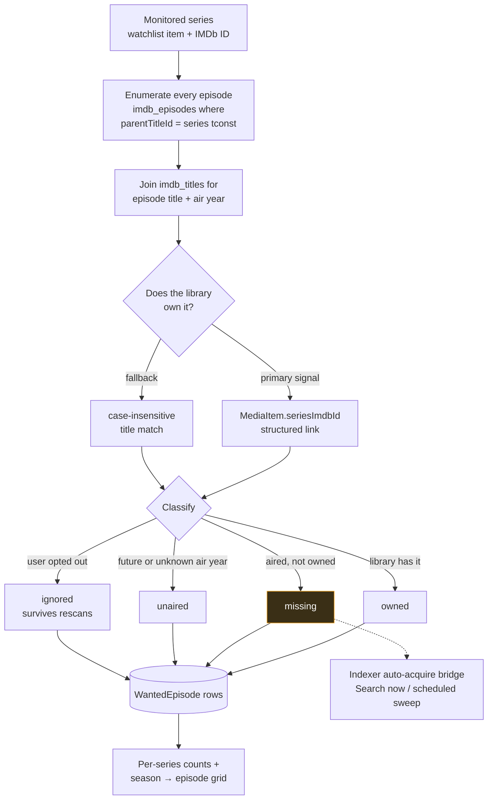

# Missing Episodes

## Overview

**Missing Episodes** answers one question precisely: *which episodes of this series do I not have?*

It answers it by **diffing** two lists — every episode IMDb says exists for the series, against every episode your library actually contains — and classifying each one as `owned`, `missing`, `unaired`, or `ignored`.

That gives you a Sonarr-style wanted list: a per-series summary (owned / total / missing / unaired / ignored) and a season → episode grid you can expand.

It is the **detection** half of gap-filling. The other half — actually going and getting those episodes — is the [Indexers](/modules/indexers) auto-acquire bridge.

## Why / when to use it

- **You inherited a messy library** and genuinely do not know what is complete.
- **You want to backfill a series** and need to know exactly what to look for.
- **You want gaps filled automatically.** Missing Episodes is the prerequisite: nothing can search for an episode until something has established that the episode is missing.

## Prerequisites

Two things, and **both are hard requirements**.

### 1. TV episodes in the local IMDb mirror

The "what episodes *should* exist" side of the diff comes from the `imdb_episodes` table, which is **only populated when the IMDb dataset import runs with "Import TV series & episodes" enabled** (`importTvShows`).

A movies-only import gives you an empty episode catalogue and therefore no gaps, ever. See [Media Manager → IMDb integration](/modules/media-manager).

### 2. A monitored series with an IMDb ID

A series is monitored when it is on the [Smart Download](/modules/smart-download) **watchlist** as a `series` (or `season`) item **with an IMDb ID** in its external IDs (e.g. `tt0903747`). Without one, the series shows as **not monitorable** and is skipped.

:::tip Use "Add from library" — do not hand-type IMDb IDs
The Missing Episodes page has an **Add from library** picker: a searchable multi-select of the TV series already in your libraries, with their IMDb IDs **resolved automatically** (from each show's `seriesImdbId`, or from an episode's `imdb` external id).

Select the shows to monitor and add them all at once. Series already on the watchlist are shown pre-checked and locked. Shows with no resolvable IMDb ID are flagged — you can still add them, but re-identify the library to make them scannable.
:::

You also need `media_acquisition.view` to look, and `media_acquisition.manage_watchlist` to scan or ignore.

## Concepts

**Monitored series** — a `series`/`season` watchlist item with an IMDb ID.

**The catalogue** — `imdb_episodes` joined to `imdb_titles`. This is your local mirror of what IMDb says the series contains. It is only as fresh as your last import.

**Ownership signal** — how the scan decides you have an episode. The **primary** signal is the structured `MediaItem.seriesImdbId` link, set during identification for TV/anime items. If a library has not been re-identified, it falls back to a case-insensitive **title match** against the series title.

**`WantedEpisode`** — one row per catalogue episode, carrying its classification and its search state.

**Statuses:**

| Status | Meaning |
|--------|---------|
| `owned` | The library has this season/episode. |
| `missing` | It aired (it has a past air year) and you do not have it. |
| `unaired` | Its air year is in the future, or unknown. It cannot be acquired yet. |
| `ignored` | You opted this episode out. It **survives rescans**. |

Season 0 (specials) is excluded from the missing math.

**`searchStatus`** — set by the [indexer](/modules/indexers) bridge: `idle → searching → grabbed | pending_approval | no_results | failed`. Like `ignored`, it is preserved across rescans, so a grabbed episode is never re-searched. It clears automatically once the episode is owned.

## How it works

Scans are **idempotent**: rescanning rebuilds everything **except** your `ignored` overrides and the search state.

### Self-healing

A monitored series whose IMDb ID is wrong or missing used to be a dead end. It is now largely self-correcting:

- A series with **no IMDb ID** resolves one from the local catalogue by title → `tvSeries`/`tvMiniSeries`, with most-episodes winning.
- A series whose stored tconst is actually an **episode**, not the series, is healed back up to the series.
- Titles that differ only by **punctuation** or **accents** now match (`Pokémon` ↔ `Pokemon`), and year-less items are handled.

The practical effect was large: on one real install, monitorable shows went from **74 of 8,986** to nearly all of them.

## Configuration

There is very little to configure — Missing Episodes is mostly a consequence of other things being set up correctly.

| Setting | Where | Default | Notes |
|---------|-------|---------|-------|
| **Import TV series & episodes** | Media → Settings → IMDb (dataset import) | — | **Mandatory.** Without it there is no episode catalogue. |
| **Watchlist item IMDb ID** | The watchlist add/edit dialog, or **Add from library** | — | **Mandatory.** Without it, the series is not monitorable. |
| `autoSearchMissing` | Acquisition Intelligence → Settings | `false` | Enables the scheduled search sweep. See [Indexers](/modules/indexers). |
| `searchIntervalMinutes` | Acquisition Intelligence → Settings | `60` | Per-episode re-search backoff. |
| `maxSearchesPerSweep` | Acquisition Intelligence → Settings | `50` | Episodes searched per sweep tick. |

### Endpoints

| Method | Path | Permission |
|--------|------|-----------|
| GET | `/api/media-acquisition/missing-episodes` | `media_acquisition.view` |
| GET | `/api/media-acquisition/missing-episodes/:watchlistItemId` | `media_acquisition.view` |
| GET | `/api/media-acquisition/missing-episodes/:id/seasons` | `media_acquisition.view` |
| POST | `/api/media-acquisition/missing-episodes/scan` | `media_acquisition.manage_watchlist` |
| POST | `/api/media-acquisition/missing-episodes/:id/ignore` · `/unignore` | `media_acquisition.manage_watchlist` |
| POST | `/api/media-acquisition/missing-episodes/:id/search` | `media_acquisition.evaluate` |
| POST | `/api/media-acquisition/missing-episodes/series/:watchlistItemId/search` | `media_acquisition.evaluate` |

`POST /scan` with no body scans **every** monitored series; with `{ watchlistItemId }` it scans one.

## Step-by-step walkthrough

**1. Import the IMDb dataset with TV enabled.** Media → Settings → IMDb. Download the seven `.tsv.gz` files, put them under your root path, validate, and import — with **Import TV series & episodes** checked. This is the step everyone skips, and it is the step that makes everything else work.

**2. Make sure your library is identified.** Go to **Media → Unmatched** and clear it out. Run a bulk re-identify. Ownership is computed from identification, so a library full of unidentified files will report almost everything as missing.

**3. Add series to the watchlist.** Open **Missing Episodes → Add from library**, tick the shows you want to monitor, and add them. Their IMDb IDs resolve automatically.

**4. Scan.** Click **Scan all**, or **Scan** on one series. You get per-series counts.

**5. Read the results critically.** If a series says "38 missing" and you are fairly sure you have them all, that is an identification problem, not a gap. Go back to step 2.

**6. Ignore what you do not want.** Expand a series and click **Ignore** on episodes you will never acquire (a recap special, a crossover you do not care about). Ignores survive rescans.

**7. Fill the gaps.** Click **Search now** on one missing episode. If that works reliably, enable `autoSearchMissing`. See [Indexers](/modules/indexers) — and **set `minSeeders` on every indexer first**.

## Screenshots

:::note Screenshot needed
Capture: **RSS & Acquisition → Acquisition Intelligence → Missing Episodes** — the per-series list showing owned/total/missing/unaired counts, the TV airing-status badge per series, and the **Scan all** button.
:::

:::note Screenshot needed
Capture: a series expanded on the Missing Episodes page — the season → episode grid with per-episode status chips (owned / missing / unaired / ignored), **Ignore** and **Search now** buttons, and `searchStatus` badges.
:::

:::note Screenshot needed
Capture: **Missing Episodes → Add from library** — the searchable multi-select showing library shows with their resolved IMDb IDs, already-watchlisted shows pre-checked and locked, and shows with no resolvable IMDb ID flagged.
:::

:::tip Watch this tutorial
_Video coming soon._
:::

## Real-world examples

### Audit a library you inherited

You have a 6 TB drive of TV from someone else and no idea what is complete. Import the IMDb dataset with TV enabled, re-identify every library, then **Add from library** → select all → **Scan all**. Within minutes you have an exact per-series gap list. Sort by missing count and you know precisely where to spend your bandwidth.

### Backfill one series end to end

You want *The Wire*, complete. Add it from the library picker (or by IMDb ID). Scan. You get 60 episodes, of which you own 44. The 16 `missing` rows each get a **Search now** button. Click **Search all** on the series: each missing episode is searched across your indexers, filtered to the exact `SxxEyy`, and handed to the [Smart Download](/modules/smart-download) evaluator, which applies your acquisition profile. What passes downloads — into the show's existing library folder, not into `/downloads`.

### Ignore the things you will never want

A long-running show has 40 clip-shows, recaps, and specials you have no interest in. They show as `missing` and skew your counts and your sweeps. Expand the series and **Ignore** them. They drop out of the missing math permanently — rescans will not resurrect them.

## Troubleshooting

| Symptom | Cause | Fix |
|---------|-------|-----|
| No episodes at all, for any series | The IMDb import ran **movies-only**. `imdb_episodes` is empty, so there is nothing to diff against. | Re-run the import with **Import TV series & episodes** enabled. |
| A series shows as "not monitorable" | The watchlist item has no IMDb ID. | Use **Add from library** (which resolves it), or set it by hand. Re-identify the library if the picker cannot resolve it either. |
| Everything reports as missing, though you have the files | **Ownership tracks identification quality.** `MediaItem.season` and `.episode` are filled by filename identification, not by a raw file scan. A library with poorly-named or unidentified files over-reports missing. | Re-identify the library in [Media Manager](/modules/media-manager). This is by far the most common cause. |
| A show is missing episodes that definitely aired recently | **The mirror lags IMDb.** The catalogue is only as fresh as your last import, and the optimized import drops episodes with no air date. | Check the mirror date shown on the page. Re-import to refresh. |
| A show is permanently unresolvable — its title has accents | Historically, accents were **stripped** rather than folded, so `Pokémon` never matched `Pokemon`. Fixed: matching now folds accents. | Update. Resolution self-heals. |
| A show with no year never resolves ("90 Day Fiance") | Historically, the punctuation/accent match was gated on the item's year, so a year-less item skipped it entirely. Fixed. | Update. |
| A watchlist "series" is actually a single episode | Historically, a downloaded episode could be folded into a series watchlist item under its own name. Fixed. | Update, then delete the bogus entry. |
| The whole sweep aborts partway through | Historically, a wanted row that vanished mid-sweep threw and killed the tick. Fixed — a vanished row no longer aborts the sweep. | Update. |
| Grabbed episodes land in `/downloads` | No save path resolved. | Save path resolves in order: the linked Show Rule's path → an **RSS rule whose name matches the show title** → the show's **existing library folder** → a constructed `<TV library>/<Title> (Year)`. Give it at least one of those. |
| Movies are never gap-filled automatically | Auto-search is **episode-only** today. Missing *movies* are detected (`WantedMovie`), but nothing sweeps them. | Grab movies manually or via RSS. |

## Best practices

- **Re-identify before you scan.** Every "missing" count is downstream of identification. Fixing identification is the highest-leverage thing you can do on this page.
- **Use "Add from library".** It resolves IMDb IDs for you and prevents the single most common setup error.
- **Ignore aggressively.** Recaps, clip shows, and specials you will never want are noise in the counts and work for the sweep.
- **Prove one manual search before enabling the sweep.** And set `minSeeders` on every indexer first — see [Indexers](/modules/indexers) for what happens if you do not.
- **Watch the mirror date.** If it is months old, your "missing recent episodes" are just stale-catalogue artefacts.

## Common mistakes

- **Running a movies-only IMDb import** and then wondering why Missing Episodes is empty.
- **Trusting the missing count on an unidentified library.** It will be dramatically wrong, and it will be wrong in the direction that makes you download things you already own.
- **Hand-typing IMDb IDs** when the picker will resolve them.
- **Enabling `autoSearchMissing` before proving a manual search** — and before setting `minSeeders`.
- **Expecting `unaired` episodes to be searched.** They cannot be — they do not exist yet. That is what the status means.

## FAQ

**Where does the "what should exist" list come from?**
Your **local IMDb mirror** (`imdb_episodes`), populated by the IMDb dataset import. It is fully offline once imported. UltraTorrent does not scrape IMDb.

**Why does it think I am missing episodes I actually have?**
Because ownership is determined by **identification**, not by looking at filenames on disk. If Media Manager could not identify a file, its season/episode fields are empty and it cannot be matched to a catalogue episode. Re-identify.

**Do my ignores survive a rescan?**
Yes. `ignored` is a user override and is preserved. So is the search state (`searchStatus`, `grabbedAt`, `releaseTitle`), which is why a grabbed episode is never re-searched.

**Are scans scheduled?**
Scanning is manual (**Scan** / **Scan all**). The *search* sweep can be scheduled — that is `autoSearchMissing`, and it is off by default.

**What about missing movies?**
Missing **movies** are detected the same way (`WantedMovie`, classified `owned`/`missing`/`unaired`/`ignored`, via the IMDb external-id link or a title+year match), and missing **seasons** are a per-season rollup of the episode gaps. But **auto-search is episode-only** today.

**Why is season 0 not counted?**
Specials are excluded from the missing math deliberately — they are inconsistently catalogued and would otherwise dominate every gap list.

## Checklist

- [ ] Run the IMDb import **with TV enabled**. Expected: `imdb_episodes` is populated; the page shows a mirror date.
- [ ] Re-identify your TV libraries. Expected: **Media → Unmatched** is empty or nearly so.
- [ ] Add series via **Add from library**. Expected: IMDb IDs resolve automatically; none are flagged as unresolvable.
- [ ] **Scan all**. Expected: per-series owned/total/missing/unaired counts.
- [ ] Spot-check one series you know is complete. Expected: `missing: 0`. If not, go back to identification.
- [ ] Ignore an episode. Expected: the missing count drops, and the ignore survives a rescan.
- [ ] **Search now** on one missing episode. Expected: the `searchStatus` badge moves and, on success, the torrent lands in the show's library folder.

## See also

- [Indexers](/modules/indexers) — the auto-acquire bridge that fills these gaps.
- [Smart Download](/modules/smart-download) — the watchlist, and the evaluator each candidate goes through.
- [Media Manager](/modules/media-manager) — identification, and the IMDb dataset import.
- [RSS automation](/modules/rss) — forward-looking acquisition.
- [Troubleshooting](/operate/troubleshooting)
