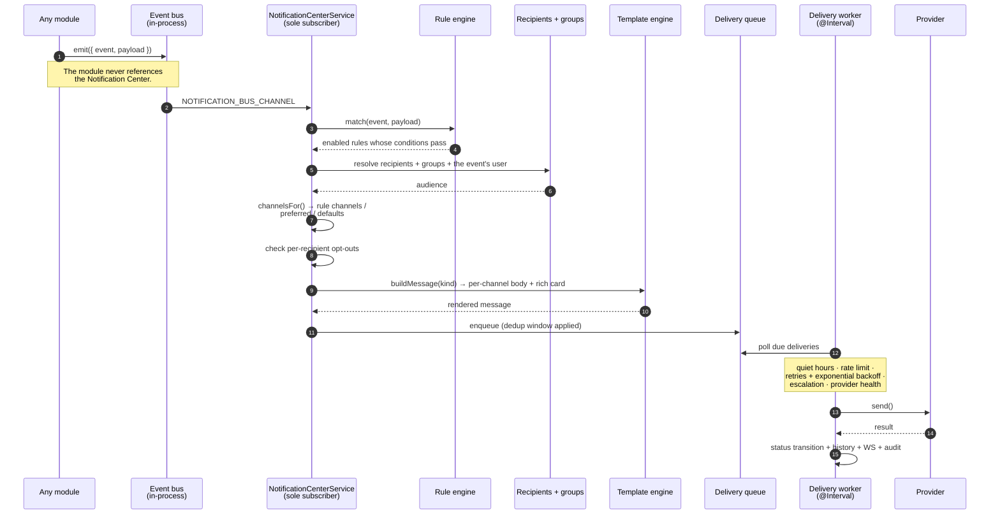

# Notification Center

## Overview

Most applications hardcode their notifications. Somewhere in the source there is a line that says "when a download completes, send an email", and if you want a Telegram message instead, you file an issue.

**Notification Center** inverts that. Every module **publishes events onto an in-process event bus**. The Center is the sole subscriber. **Configurable rules** — which you own, and can edit — decide **if**, **when**, **how**, and **to whom** each event becomes a notification.

**Nothing is hardcoded. Every notification is an editable rule.**

It is a **core** module (id `notification_center`, permissions `notifications.*`).

## Why / when to use it

- **You want to know when something happens** — a download finished, an RSS feed broke, a disk is filling, someone started watching.
- **You want to know it *where you are*** — Telegram, not an email you will read on Tuesday.
- **You want to *not* be told at 3 a.m.** — quiet hours, dedup windows, and rate limits exist so automation cannot become a pager.
- **You want different people told different things** — the Administrators group hears about failures; Media Users hear about new content.

## Prerequisites

- At least one **channel** configured: SMTP for email, Twilio for SMS/WhatsApp, or a bot token for Telegram.
- At least one **recipient**, with the right address for the channel you chose (an email address, a phone number, a Telegram chat id).
- Permissions: `notifications.view` to look, plus the granular ones per surface.

## Concepts

**Event** — something a module did. Modules `emit()` an envelope onto the bus (`NOTIFICATION_BUS_CHANNEL`) and **never reference the Center**. That decoupling is why adding a notification never requires touching the module that produced the event.

**Provider** — the code that talks to a messaging service. Business logic never touches a provider API directly.

**Channel** — one *configured instance* of a provider. "My Gmail SMTP" is a channel; "Email" is a provider.

**Recipient** — a person. Holds display name, email, phone, Telegram chat id, WhatsApp number, language, timezone, preferred channel, quiet hours, per-event preferences, and an optional mapped UltraTorrent user.

**Group** — a named set of recipients. Seeded: Administrators, Operators, Media Users, Developers, Support, Executives.

**Rule** — the routing decision. Which event, under which conditions, to which recipients, over which channels, with which template.

**Template** — the message body, per channel. Supports `{{variable}}` interpolation and `{{#if}}` / `{{#unless}}` blocks.

**Notification card** — a **provider-agnostic** rich object (poster, backdrop, title, subtitle, overview, metadata badges, rating, genres, runtime, action buttons, footer, timestamp). Each provider renders it **to its own capability level** — Telegram gets a photo with an inline keyboard; **SMS collapses to concise plain text**. You author once.

**Delivery** — one attempt to send one notification to one recipient over one channel. It has a full lifecycle: `queued · sending · sent · delivered · failed · cancelled · skipped · retrying · throttled`.

## How it works

### Providers

| Provider | Backend | Rich rendering |
|----------|---------|----------------|
| **Email** | SMTP (nodemailer) | Responsive HTML card (poster, badges, buttons) + a plain-text alternative. |
| **SMS** | Twilio Messaging API | Concise plain text — the card is collapsed, not truncated. |
| **Telegram** | Bot API | Photo + Markdown caption + inline-keyboard buttons. |
| **WhatsApp** | Twilio WhatsApp | Rich text + poster media. |

Adding a provider (Discord, Slack, ntfy, Gotify, Pushover, a generic webhook…) is **one class plus one registry entry** — no business-logic change. See [Providers](/develop/providers).

## Configuration

### Channel

A channel is a configured provider instance. Its **credentials are AES-256-GCM encrypted at rest** and **redacted from every response**. Destinations are masked in list views.

Use **Send test** on a new channel before you point a single rule at it. A rule that fires into a broken channel just fails quietly into the delivery history.

### Rule

| Field | What it does | Recommended |
|-------|--------------|-------------|
| `event` | Which event this rule listens for. | — |
| `conditions[]` | ANDed conditions on the payload. Operators: `eq`, `neq`, `gt`, `gte`, `lt`, `lte`, `contains`, `in`, `exists`, `regex`. | Use them. "Notify me when a download completes" is noise; "…when a download **fails**" is signal. |
| `recipients{}` / `channelIds[]` | Who, and over what. Rules can also address **the event's own user**. | Address a **group**, not individuals — then changing who is on call is one edit. |
| `templateId` | The message body. | — |
| `severity` / `priority` | How urgent. Drives queue ordering. | Reserve `critical` for things that are actually critical. |
| `quietHoursOverride` | Lets a rule punch through quiet hours. | **Only** for genuine emergencies. |
| `dedupeWindowSec` | Suppress duplicates of the same notification within this window. | Set it on anything chatty. |
| `rateLimitPerHour` | Cap the rule. | Your last line of defence against a notification storm. |
| `retryPolicy` / `escalationPolicy` | What happens on failure. | — |
| `schedule` | Time-based gating. | — |

:::tip 47 rules are already seeded for you
A **default catalog of 47 rules** — across Media Server, Downloads, RSS, Media Manager, and System — is **seeded once** (idempotently, only when no system rules exist) and is **fully editable**. It is never clobbered on upgrade.

Do not start from scratch. Start by enabling the seeded rules you want and pointing them at your channels.
:::

### Template

`{{variable}}` interpolation plus `{{#if}}` / `{{#unless}}` blocks, with per-channel bodies (subject, title, subtitle, html, text, markdown, sms, whatsapp, telegram), a rich-card builder, localization, and a **preview endpoint**.

Available variables include `{{userDisplayName}}`, `{{mediaTitle}}`, `{{episodeTitle}}`, `{{overview}}`, `{{posterUrl}}`, `{{rating}}`, `{{serverName}}`, `{{device}}`, `{{playbackMethod}}`, `{{bitrate}}`, `{{watchUrl}}`, `{{torrentName}}`, `{{rssRule}}`, `{{errorMessage}}`, `{{eventTime}}`.

### The delivery worker

Two background jobs:

- **`notification_delivery_worker`** — processes due deliveries, applying **priorities, retries with exponential backoff, per-channel rate limiting, quiet hours (with rule override), a dedup window, and provider health**.
- **`notification_provider_health`** — health-checks channels and emits `notification.provider.online` / `.offline`.

### What already publishes events

| Module | Events |
|--------|--------|
| **Media Server Analytics** | `user_started_watching`, `user_finished_watching`, `transcode_detected`, `newsletter_sent`, `newsletter_failed` |
| **Downloads** | `download.torrent_completed` |
| **RSS** | `rss.feed_failed`, `rss.rule_matched` |
| **Media Manager** | `media.processing_completed` / `_failed`, `media.metadata_match_failed`, `media.renamed`, `media.missing_artwork`, `media.missing_subtitles`, `media.library_scan_completed` |
| **Indexers** | `media.missing_episode_filled` |
| **System** | `system.settings_changed`, `system.api_key_created`, `system.disk_space_low`, `system.cpu_high`, `system.memory_high` |
| **Auth** | `system.new_login`, `system.failed_login` |

:::caution Some seeded rules have no publisher yet
The seeded catalog includes rules for events that are **not yet emitted** — `media_added`, `server_online` / `offline`, `download.torrent_added` / `_failed` / `_stalled`, `ratio_reached`, `rss.new_episode_available`, `media.duplicate`, `system.update_available`.

Their rules exist and are correct. They will go live the moment those hooks emit. Until then, enabling one has no effect — which is confusing if you do not know to expect it.
:::

### Permissions

`notifications.` + `view`, `manage_channels`, `manage_templates`, `manage_rules`, `manage_recipients`, `manage_groups`, `view_history`, `retry`, `send_test`, `manage_preferences`, `manage_settings`, `admin`.

## Step-by-step walkthrough

**1. Create a channel.** **Automation → Notification Channels → Add**. For Telegram: a bot token from BotFather. For email: your SMTP host, port, user, and password.

**2. Send a test.** Do this **before anything else**. `POST channels/:id/test`, or the button. If it does not arrive, nothing built on top of it will work either.

**3. Create a recipient.** Give them the address that matches your channel — a Telegram **chat id**, not a username; a real email address; an E.164 phone number.

**4. Put them in a group.** Add yourself to **Administrators**. Rules should address groups, not people.

**5. Enable a seeded rule.** Do not write one yet. Go to **Notification Rules**, find *Media Server Offline* (or *Download Completed*), enable it, and point it at your channel.

**6. Trigger it.** Complete a download. Take the media server offline. Watch the notification arrive.

**7. Now tune.** Set a `dedupeWindowSec` on anything chatty. Set `rateLimitPerHour` as a safety net. Set quiet hours on your recipient record so a 3 a.m. RSS failure does not wake you — and override quiet hours **only** on genuinely critical rules.

**8. Check the delivery history.** Every attempt is there, with its status. A failed one can be **retried** from the UI.

## Screenshots

:::tip Watch this tutorial
_Video coming soon._
:::

## Real-world examples

### Telegram now-playing cards

Add a **Telegram** channel with your bot token. Create a recipient with your Telegram **chat id**. Enable the seeded **"User Started Watching"** rule (it ships **disabled by default**, deliberately) and point it at the Telegram channel.

Now, when someone starts a stream, you get a photo card with the poster, the title, the episode, the quality, the user, their device, the playback method, the codecs and bitrate — plus **View / Open buttons**. The same card, sent to an SMS channel, collapses to one concise line. You authored it once.

### Be told when the pipeline breaks, and only then

The useful notifications are the failures. Enable the rules for `rss.feed_failed`, `media.processing_failed`, `media.server_refresh_failed`, and `system.disk_space_low`. Point them at the **Administrators** group. Set `severity: critical` and `quietHoursOverride: true` on **disk space only** — a full disk at 3 a.m. is worth waking up for; a flaky RSS feed is not.

### Notify from an Automation rule

The [Automation](/modules/automation) module exposes a **`send_notification`** action. Its parameters (`channelIds`, `recipientIds`, `groupIds`, `templateId`, `variables`, `priority`, `title`, `message`) flow straight into the Center, which resolves the audience and channels (falling back to the Administrators group and default channels), renders per channel, and enqueues. So an automation rule can send a **fully-templated** notification through **any** channel — you are not limited to the events modules happen to publish.

## Troubleshooting

| Symptom | Cause | Fix |
|---------|-------|-----|
| A test notification never arrives | The channel's credentials are wrong, or the address format is wrong for that provider. | Re-run **Send test**. Check the **delivery history** — the failure is recorded there with an error. Telegram needs a **chat id**, not a username. |
| A rule is enabled but never fires | The event has **no publisher yet**. Several seeded rules are for events that are not emitted. | Check the publisher table above. If the event is not listed, that rule is inert by design. |
| Notifications stop arriving overnight | **Quiet hours** on the recipient, working exactly as intended. | Set `quietHoursOverride: true` on the rules that genuinely warrant it — and only those. |
| The same notification arrives repeatedly | No `dedupeWindowSec` on a chatty rule. | Set one. Also consider `rateLimitPerHour` as a hard cap. |
| A notification storm | A rule matched far more than expected. | The Center's per-channel rate limiting, quiet hours, and dedup window exist to prevent exactly this — but only if you configure them. Tighten the rule's `conditions[]`. |
| A delivery shows `throttled` | The per-channel rate limit was hit. | This is the system protecting you. Raise the limit if it is genuinely too low. |
| A channel shows `offline` | The provider health worker could not reach it. | Fix the credentials or the service. `notification.provider.online` fires when it recovers. |
| SMS messages are truncated / unreadable | They should not be — the card **collapses** to concise text for SMS rather than being truncated. | Confirm you are on a current version. Then simplify the template's `sms` body. |

## Best practices

- **Send a test before you build on a channel.** Everything downstream assumes it works.
- **Address groups, not people.** Changing who is on call becomes one edit, not twenty.
- **Notify on failure, not on success.** A notification for every completed download is training you to ignore notifications.
- **Set a dedup window and a rate limit on every chatty rule.** Treat them as required, not optional.
- **Reserve `quietHoursOverride` for real emergencies.** If everything is urgent, nothing is.
- **Start from the seeded catalog.** 47 rules already exist and are correct. Enable, do not author.
- **Use per-recipient preferences.** People can opt out of event types individually, which is far better than deleting a rule someone else needs.

## Common mistakes

- **Enabling a rule for an event nothing publishes yet**, then concluding the Center is broken.
- **Using a Telegram username instead of a chat id.**
- **Notifying on `download.torrent_completed`** and then muting the whole channel a week later, because it fires forty times a day.
- **Overriding quiet hours everywhere** because it seemed convenient at the time.
- **Editing a seeded rule beyond recognition** rather than duplicating it. Seeded rules are never clobbered, but you still want the original as a reference.

## FAQ

**Is anything hardcoded?**
No. Every notification is a rule you can edit, disable, retarget, or delete.

**How do modules talk to the Center?**
They do not. They `emit()` an envelope on an in-process event bus and never reference the Center at all. The Center is the sole subscriber. That is what makes it possible to add a notification without touching the module that produced the event.

**Which providers ship?**
Email (SMTP), SMS (Twilio), Telegram (Bot API), and WhatsApp (Twilio). Adding another is one class plus one registry entry.

**Do I have to write a template per channel?**
No. You author a provider-agnostic **card**, and each provider renders it to its own capability level. Telegram gets a photo with buttons; SMS gets concise text.

**Are credentials safe?**
AES-256-GCM encrypted at rest, redacted from every response, and never logged. Destinations are masked in list views. Full message bodies are not logged by default.

**Can automation send a notification?**
Yes — the `send_notification` action feeds directly into the Center with a full parameter set. See [Automation](/modules/automation).

**Can a recipient opt out?**
Yes. Recipients have per-event preferences, a preferred channel, quiet hours, and a language and timezone.

## Checklist

- [ ] Create a channel and **Send test**. Expected: it arrives, and the delivery history shows `sent`/`delivered`.
- [ ] Create a recipient with the correct address for that channel. Expected: it validates and normalizes.
- [ ] Add the recipient to the **Administrators** group. Expected: group membership updates.
- [ ] Enable a seeded rule pointing at your channel. Expected: it shows enabled in the catalog.
- [ ] Trigger the event for real. Expected: the notification arrives, rendered to the channel's capability level.
- [ ] Set `dedupeWindowSec` and fire the event twice quickly. Expected: only one delivery.
- [ ] Set quiet hours on the recipient and fire a non-override rule inside them. Expected: the delivery is `skipped` or held.
- [ ] Break a channel deliberately and fire a rule. Expected: the delivery shows `failed` and can be **retried** from the history.
- [ ] Check the audit log. Expected: channel/rule/template/recipient changes, manual sends, and retries are all recorded.

## See also

- [Automation](/modules/automation) — the `send_notification` action.
- [Media Server Analytics](/modules/media-server-analytics) — the richest source of events.
- [Media Manager](/modules/media-manager) — `media.*` events.
- [RSS automation](/modules/rss) — `rss.*` events.
- [System](/modules/system) — disk/CPU/memory alerts.
- [Providers](/develop/providers) — adding a new messaging provider.
- [WebSockets](/develop/websockets) — the realtime `notification.*` events.
