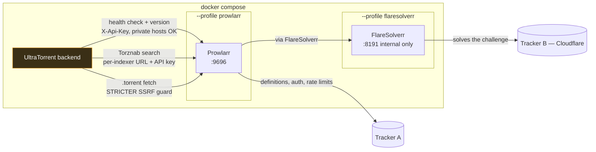

# Prowlarr

## Overview

[Prowlarr](https://prowlarr.com/) is an **indexer manager**. It ships definitions for hundreds of public and private trackers, handles their login flows, rate limits, and quirks, and exposes each one as a clean **Torznab endpoint** — which is exactly the protocol UltraTorrent's [Indexers](/modules/indexers) subsystem searches.

UltraTorrent can run Prowlarr as an **optional companion container** and link to it from the UI.

:::info Prowlarr is not embedded in UltraTorrent
It is a separate service behind a Compose profile that is **off by default**. UltraTorrent boots and runs perfectly without it. Nothing about the integration activates until an operator enables the profile *and* fills in the connection settings.
:::

The UltraTorrent-side integration is deliberately **link-only**: it stores the connection, verifies its health, and offers an "Open Prowlarr" shortcut. It does **not** proxy arbitrary Prowlarr endpoints and does **not** auto-configure your indexers. Those remain explicit actions you take inside Prowlarr.

## Why / when to use it

Use Prowlarr when you do not want to hand-maintain tracker definitions.

Without it, every indexer you add to UltraTorrent is a Torznab URL you sourced yourself. With it, you add trackers once in Prowlarr — it knows their APIs, their categories, and how to log in — and copy the resulting Torznab URLs into UltraTorrent.

You do **not** need Prowlarr if you already have Jackett, a native Torznab endpoint, or a single tracker you are happy to configure by hand. The [Indexers](/modules/indexers) subsystem does not care where the endpoint came from.

## Prerequisites

- The bundled Docker Compose stack (or your own Prowlarr instance reachable from the backend).
- The `integrations.prowlarr.view` permission to see the settings panel; `…manage` to change it, `…test` to test, `…open` to see the sidebar shortcut.
- Understanding of **one trap**, described in detail below: a passing connection test does **not** mean downloads will work.

## Concepts

**Companion container** — an optional service in the same Compose file, behind a **profile**. Profiles are off unless you name them, so `docker compose up -d` alone never starts Prowlarr.

**Internal URL** — how the *backend* reaches Prowlarr. On the bundled stack: `http://prowlarr:9696` (the service name on the internal Docker network).

**Public URL** — how *your browser* reaches Prowlarr, for the "Open Prowlarr" link. E.g. `http://localhost:9696`, or your reverse-proxied hostname.

**FlareSolverr** — a second optional companion: a headless-browser proxy that solves Cloudflare's anti-bot challenge on behalf of Prowlarr.

**SSRF guard** — UltraTorrent refuses to fetch a `.torrent` from a private/internal IP address unless you allow-list the host. This exists to stop a malicious feed from making your server probe your own network. It is also the number-one source of confusion on this page.

## How it works



Notice the three separate arrows from the backend to Prowlarr. They are governed by **different rules**, and that is the whole trap:

- The **health check** deliberately *trusts* private hosts — `prowlarr:9696` is the intended target, so blocking it would be absurd.
- The **`.torrent` fetch** uses a stricter guard that *blocks* private and internal addresses unless the host is in `SSRF_ALLOW_HOSTS`.

So a green *Connected* badge proves only that UltraTorrent can reach Prowlarr's **API**. It does **not** prove that a grab will download.

:::danger The passing-test / failing-download trap
When an RSS rule, Smart Download decision, or missing-episode sweep grabs a release, the backend fetches Prowlarr's `.torrent` proxy link — which resolves to a **private Docker/LAN IP**. Without an allow-list entry, that fetch is blocked with *"Torrent URL resolves to a blocked internal address"*, and **auto-downloads silently do nothing** while the connection test keeps showing green.

The bundled stack **defaults `SSRF_ALLOW_HOSTS=prowlarr`**, so it works out of the box. If you override that variable, or run Prowlarr under a different host or IP, you must list it — keeping `prowlarr` if you use the bundled one:

```bash
SSRF_ALLOW_HOSTS=prowlarr,indexer.lan
```
:::

## Configuration

### Enable the container

Prowlarr lives behind the `prowlarr` Compose profile:

```bash
# Bring up (or add to) the stack with the Prowlarr companion
docker compose --profile prowlarr up -d

# Combine with other optional profiles as needed
docker compose --profile rtorrent --profile prowlarr up -d --build
```

Open Prowlarr at `http://<host>:9696` (or your `PROWLARR_PORT`), complete its first-run wizard, and add the indexers you want.

Get its **API key** from **Settings → General → Security → API Key** inside Prowlarr.

### Environment variables

| Variable | Default | Purpose |
|----------|---------|---------|
| `PROWLARR_PORT` | `9696` | Host port the Prowlarr web UI is published on. |
| `PROWLARR_BASE_URL` | `http://prowlarr:9696` | Seeds the **Internal URL** default in the settings form. |
| `PROWLARR_PUBLIC_URL` | `http://localhost:9696` | Seeds the **Public URL** default. |
| `PROWLARR_ENABLED` | `false` | A convenience default. The real toggle is in UltraTorrent's settings. |
| `SSRF_ALLOW_HOSTS` | `prowlarr` (in the bundled compose file) | **Required for auto-downloads.** See the danger box above. |
| `PUID` / `PGID` | `1000` | User/group Prowlarr runs as. |
| `TZ` | `Etc/UTC` | Timezone for the companion container. |

The two URL variables only **seed the defaults** shown in the settings form. The authoritative values are whatever you save in the UI.

| Item | Value |
|------|-------|
| Image | `lscr.io/linuxserver/prowlarr:latest` |
| Web UI port | `${PROWLARR_PORT:-9696}` → container `9696` |
| Volume | `prowlarr_config` → `/config` (Prowlarr's database + settings) |
| Network | `internal` (shared with backend/frontend/engine) |
| Restart policy | `unless-stopped` |

### Connect UltraTorrent

Go to **Settings → Integrations → Prowlarr** (needs `integrations.prowlarr.view`):

| Field | What it does | Recommended |
|-------|--------------|-------------|
| **Enable Prowlarr integration** | The master toggle. | On, once configured. |
| **Internal URL** | How the backend reaches Prowlarr. | `http://prowlarr:9696` on the bundled stack. |
| **Public URL** | Where the "Open Prowlarr" link sends your browser. | `http://localhost:9696`, or your reverse-proxied hostname. |
| **API key** | Prowlarr's API key. **Encrypted at rest**, shown as `••••••••`, never returned. Leave blank on later edits to keep the stored key. | Paste it once. |

Save, then **Test connection**. A green *Connected* badge shows Prowlarr's version and its configured-indexer count.

Once enabled with a public URL, a **Prowlarr** shortcut appears in the sidebar under **RSS & Acquisition** for users with `integrations.prowlarr.open`, opening Prowlarr in a new tab.

### Cloudflare-protected indexers (FlareSolverr)

Some trackers sit behind **Cloudflare's anti-bot challenge**. Prowlarr cannot solve it alone, so testing such an indexer fails with *"blocked by Cloudflare Protection."*

**FlareSolverr** is the standard fix — a headless-browser proxy that solves the challenge and hands the cookies back. It ships as another optional companion, **internal-network only, with no host port**:

```bash
docker compose --profile prowlarr --profile flaresolverr up -d
```

| Item | Value |
|------|-------|
| Image | `ghcr.io/flaresolverr/flaresolverr:latest` |
| Address (from Prowlarr) | `http://flaresolverr:8191` |
| Env | `FLARESOLVERR_LOG_LEVEL` (default `info`), `TZ` |
| State | None — stateless, no volume |

Then wire it up **inside Prowlarr**:

1. **Settings → Indexers → + (Add Indexer Proxy) → FlareSolverr.**
2. **Host:** `http://flaresolverr:8191`. Give it a **Tag** (e.g. `cloudflare`). Save.
3. Open the Cloudflare-protected indexer and add the **same tag** to it. Prowlarr now routes that indexer's requests through FlareSolverr. Re-test.

:::warning FlareSolverr is best-effort
Cloudflare periodically tightens its challenges and FlareSolverr can lag behind. It usually works, but it is not guaranteed. If it cannot solve the challenge, try a different mirror for that indexer in Prowlarr, or rely on your other indexers.

It runs a headless Chromium, so it uses noticeably more RAM (~200–400 MB) and is given a 256 MB `/dev/shm` in the Compose file to avoid crashes.
:::

### Permissions

| Permission | Grants |
|-----------|--------|
| `integrations.prowlarr.view` | See the settings panel (API key redacted). |
| `integrations.prowlarr.manage` | Change the settings and the API key. |
| `integrations.prowlarr.test` | Run the connection test. |
| `integrations.prowlarr.open` | See the sidebar shortcut and open Prowlarr. |

## Step-by-step walkthrough

**1. Start the container.**

```bash
docker compose --profile prowlarr up -d
```

**2. Complete Prowlarr's first-run wizard** at `http://<host>:9696`. Set authentication — do not leave it open.

**3. Add your trackers in Prowlarr.** Test each one there. Fix Cloudflare-blocked ones with FlareSolverr before moving on.

**4. Copy Prowlarr's API key** from **Settings → General → Security → API Key**.

**5. Connect UltraTorrent.** **Settings → Integrations → Prowlarr** → enable, internal URL, public URL, API key → **Save** → **Test connection**. Expect a green badge with the version and indexer count.

**6. Now do the part everyone forgets.** Confirm `SSRF_ALLOW_HOSTS` includes your Prowlarr host. On the bundled stack it defaults to `prowlarr` and you are done. If you set that variable yourself, add `prowlarr` back.

**7. Add the indexers to UltraTorrent.** In Prowlarr, each indexer has a **Torznab URL**. Copy each one into **Downloads → Indexers**, with Prowlarr's API key — and **set `minSeeders`**. See [Indexers](/modules/indexers).

**8. Prove a real download.** Run a manual missing-episode search and confirm the torrent actually lands in your client. If the grab records but no torrent appears, you have hit the SSRF trap. Go back to step 6.

## Screenshots

:::note Screenshot needed
Capture: **Settings → Integrations → Prowlarr** — the panel with the enable toggle, internal URL, public URL, masked API key, and a green *Connected* badge showing the Prowlarr version and indexer count.
:::


:::note Screenshot needed
Capture: the sidebar under **RSS & Acquisition**, showing the external-link **Prowlarr** shortcut that appears once the integration is enabled.
:::


:::tip Watch this tutorial
_Video coming soon._
:::

## Real-world examples

### Go from zero to a working search stack in ten minutes

```bash
docker compose --profile prowlarr up -d
```

Add three trackers in Prowlarr. Copy Prowlarr's API key. Connect it in UltraTorrent settings and test. Copy the three Torznab URLs into **Downloads → Indexers**, each with `minSeeders: 3` and a priority. Test each. Now run a manual **Search now** on a missing episode — you should get candidates from all three, deduplicated by info-hash, with the best one evaluated against your acquisition profile.

### Diagnose "the automation grabbed it but nothing downloaded"

The evaluation shows `download`, an action was recorded, and no torrent exists in the client. That is the SSRF trap, essentially every time. Check the backend logs for *"Torrent URL resolves to a blocked internal address"*. Add the Prowlarr host to `SSRF_ALLOW_HOSTS`, restart the backend, and re-run the grab. The connection test was green the entire time and told you nothing, because it uses a different, more permissive guard.

## Troubleshooting

| Symptom | Cause | Fix |
|---------|-------|-----|
| Connection test is green, but auto-downloads silently do nothing | **The trap.** The health check trusts private hosts; the `.torrent` fetch does not. The grab is blocked with *"Torrent URL resolves to a blocked internal address"*. | Add the host to `SSRF_ALLOW_HOSTS` (default `prowlarr` in the bundled compose file), then restart the backend. |
| Prowlarr is not running at all | The profile is off by default. | `docker compose --profile prowlarr up -d`. |
| An indexer test in Prowlarr fails with "blocked by Cloudflare Protection" | The tracker is behind Cloudflare's anti-bot challenge. | Run the `flaresolverr` profile, add it as an Indexer Proxy in Prowlarr, and tag the affected indexer. |
| FlareSolverr crashes or is very slow | It runs a headless Chromium. It needs RAM and shared memory. | The Compose file allocates a 256 MB `/dev/shm`. Give the host more RAM, or drop the indexer. |
| The connection test fails outright | Wrong internal URL, or a bad API key. Remember: `localhost` inside the backend container is the backend, not Prowlarr. | Use the Compose service name (`http://prowlarr:9696`). Re-copy the API key from Prowlarr. |
| The "Open Prowlarr" link goes nowhere | The **Public URL** is wrong — it must be reachable from *your browser*, not from the backend. | Set it to `http://localhost:9696` or your reverse-proxied hostname. |
| Searches return nothing though Prowlarr has results | You connected the *integration* but never added the per-indexer Torznab URLs to **Downloads → Indexers**. The integration is link-only; it does not auto-configure indexers. | Add each Torznab URL as an indexer. See [Indexers](/modules/indexers). |

## Best practices

- **Verify `SSRF_ALLOW_HOSTS` before you trust any automation.** It is the difference between a working pipeline and a silent one.
- **Do not expose Prowlarr publicly** unless you deliberately route its port. By default it is reachable on the host at `PROWLARR_PORT` and over the internal network. Put it behind your [reverse proxy](/install/reverse-proxy) with auth if you need remote access.
- **Keep FlareSolverr internal.** It executes remote pages in a headless browser to defeat bot checks. It has no published host port for a reason — keep it that way, and never point it at untrusted URLs.
- **Back up the `prowlarr_config` volume.** It holds Prowlarr's entire state: database, indexer definitions, and API key.

  ```bash
  docker run --rm -v ultratorrent_prowlarr_config:/c -v "$PWD":/b \
    alpine tar czf /b/prowlarr_config.tgz -C /c .
  ```

- **Upgrade by pulling the image.** `/config` persists across upgrades, and UltraTorrent's stored API key is unaffected unless you regenerate it in Prowlarr.

  ```bash
  docker compose --profile prowlarr pull prowlarr && \
  docker compose --profile prowlarr up -d prowlarr
  ```

## Common mistakes

- **Believing the green badge.** It proves the API is reachable. It says nothing about whether a `.torrent` fetch will succeed.
- **Overriding `SSRF_ALLOW_HOSTS` and dropping `prowlarr` from the list.** Instant silent breakage.
- **Expecting the integration to configure your indexers.** It does not. It is a health check and a shortcut. You still add each Torznab URL to **Downloads → Indexers** yourself.
- **Using `localhost` as the internal URL.** Inside the backend container, that is the backend.
- **Exposing Prowlarr to the internet** because the port was already published on the host.

## FAQ

**Do I need Prowlarr?**
No. UltraTorrent searches any Torznab/Newznab endpoint. Prowlarr is a convenience — a manager for hundreds of tracker definitions.

**Does UltraTorrent proxy requests through Prowlarr's API?**
Only two things: the **health check** (version + indexer count) and the **Torznab searches** you configured as indexers. It does not proxy arbitrary Prowlarr endpoints and does not modify Prowlarr's configuration.

**Is the Prowlarr API key safe?**
It is AES-256-GCM encrypted at rest, redacted (`••••••••`) in every API response, and never logged. It travels in an `X-Api-Key` header, and the URL is never written to logs.

**Why is the health check allowed to reach a private IP when torrent fetches are not?**
Because a private IP is the *expected* target for the health check — `prowlarr:9696` is a Docker service name. A `.torrent` URL, by contrast, can come from an untrusted feed, so fetching one is guarded much more strictly. The allow-list is how you say "this specific private host is one I trust."

**What gets audited?**
Settings views and updates, API-key changes, connection tests, and opens.

## Checklist

- [ ] `docker compose --profile prowlarr up -d`. Expected: Prowlarr answers on `http://<host>:9696`.
- [ ] Complete Prowlarr's wizard and add at least one tracker. Expected: it tests green inside Prowlarr.
- [ ] Connect the integration in UltraTorrent and **Test connection**. Expected: a green badge with a version and indexer count.
- [ ] Confirm `SSRF_ALLOW_HOSTS` contains your Prowlarr host. Expected: `prowlarr` (or your host) is listed.
- [ ] Add a Torznab URL as an indexer with `minSeeders`. Expected: **Test** succeeds and returns capabilities.
- [ ] Run a manual missing-episode search and confirm the torrent **actually appears in your client**. Expected: a real torrent, not just a recorded evaluation. This is the only test that proves the SSRF path works.

## See also

- [Indexers](/modules/indexers) — where the Torznab URLs actually go.
- [Missing Episodes](/modules/missing-episodes) — what the search is for.
- [Smart Download](/modules/smart-download) — what decides on each candidate.
- [Docker Compose install](/install/docker-compose) — profiles and companion containers.
- [Environment reference](/reference/environment) — `SSRF_ALLOW_HOSTS`, `PROWLARR_*`.
- [Security](/operate/security) — the SSRF model.
- [Reverse proxy](/install/reverse-proxy)
