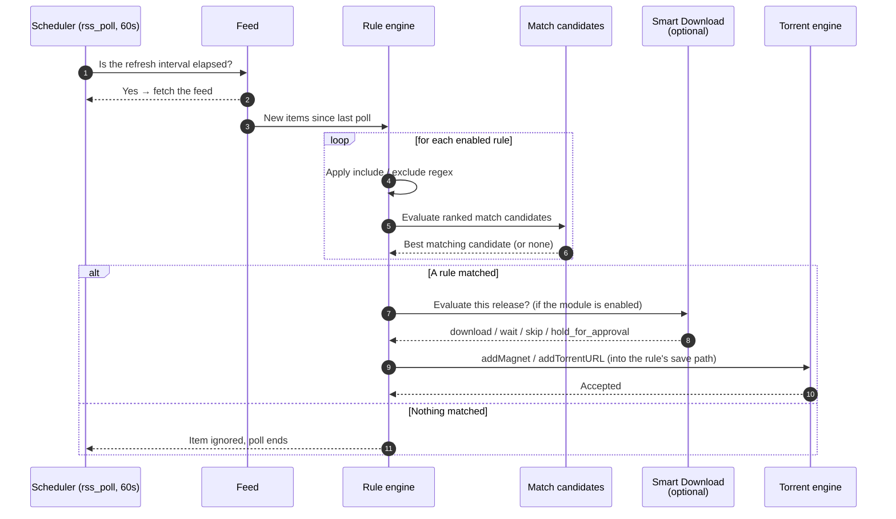

# RSS Automation

## Overview

**RSS Automation** is the front door of automated acquisition. You give UltraTorrent a feed URL — a tracker's RSS output, a Prowlarr feed, a show-specific feed — and it polls it on a schedule. Under each feed you write **rules** that describe what you actually want out of it, and when an item matches, UltraTorrent grabs it.

The chain is short and it is worth memorising, because every acquisition page in this documentation refers back to it:

```
feed  →  rule  →  ranked match candidates  →  grab
```

RSS is a **core** module (id `rss`, permissions `rss.*`), so it cannot be disabled. It is also the hard dependency of [Release Scoring](/modules/smart-download) and [Smart Download](/modules/smart-download) — both build on top of what RSS finds.

## Why / when to use it

Use RSS when you want content to arrive **without you asking for it**:

- A show you follow every week. Add the feed, write a rule, forget about it.
- A release group you trust. Match on the group name, exclude everything else.
- Backfilling a finished series at a specific quality.

Use it *instead of* manual searching when the content is predictable. Use [Indexers](/modules/indexers) + [Smart Download](/modules/smart-download) instead when the content is a **gap you already know about** — a missing episode is better *searched for* than *waited for*.

The two work together: RSS catches things as they appear; Smart Download decides whether what appeared is actually worth taking.

## Prerequisites

- A working **torrent engine** connection — see [Engines](/modules/engines). RSS declares `engine` as a hard dependency, and a grab with no engine goes nowhere.
- A **feed URL** you are entitled to use. Most private trackers expose a personal RSS URL under your profile; most public ones expose a category feed.
- The `rss.view` permission to look, `rss.manage` to change anything.
- **Optional but strongly recommended:** a TMDB API key (`media.tmdbApiKey` in settings, or the `TMDB_API_KEY` environment variable). Without it, airing-status awareness falls back to lower-confidence sources.

:::warning A feed is not an indexer
An RSS feed is a **push** stream — you get what the tracker chose to publish, in the order it published it. An [indexer](/modules/indexers) is a **pull** search API — you can ask it for a specific episode. RSS cannot go and find `S03E07` for you; indexers can. If you need gap-filling, you need indexers.
:::

## Concepts

**Feed** (`RssFeed`) — a polled URL with a refresh interval. The scheduler job `rss_poll` runs every 60 seconds and fetches every feed whose interval has elapsed.

**Rule** (`RssRule`) — lives *under* a feed and describes what to grab from it: include/exclude regex, category, save path, and an ordered list of match candidates. A feed with no rules polls but never grabs.

**Match candidate** (`RssRuleMatchCandidate`) — one condition in a rule's ordered, ranked list. Built in the **Smart Match Builder** and prioritised in the **Match Preferences** list. The order is the preference order: the highest-ranked candidate that matches wins.

**Smart Match Builder** — the UI that turns "I want this show, in 1080p, from these groups, not CAM" into a set of ranked candidates without you writing regex by hand.

**Show status** — for TV rules, the airing status of the series: `continuing`, `returning`, `planned`, `on_hiatus`, `ended`, `canceled`, or `unknown`. Resolved server-side from a provider, cached, and snapshotted onto the rule.

**Recommendation** — the plain-English verdict derived from the status: `recommended` (the show is active), `caution` (on hiatus), `not_recommended` (ended or canceled), or `unknown`.

**Save path** — where the grabbed torrent's data lands. Set per rule; falls back to the engine's default download directory if unset.

## How it works



### TV airing-status awareness

A subtle failure mode: you create a rule for a series that **ended two years ago**. It polls forever, matches nothing, and quietly wastes cycles — and worse, it makes you think the automation is working when it has nothing left to catch.

UltraTorrent resolves a TV rule's airing status **server-side** (it never trusts a status sent by the browser) and acts on it:

| Status | What happens on save |
|--------|---------------------|
| Active (`continuing`, `returning`, `planned`) | Saved normally. |
| `on_hiatus` | Saved, with a `caution` recommendation surfaced on the rule. |
| `unknown` | Saved with a `status_unconfirmed` warning. |
| `ended` / `canceled` | **Rejected with `400`** unless you explicitly confirm. The UI shows a confirmation modal; confirming sets `allowInactiveShowMonitoring`. |

Overriding is audited, emits a WebSocket event, and fires an automation trigger — so an operator can be told about it.

Status is resolved by a **provider**, tried in confidence order:

| Provider | Source | Confidence | Notes |
|----------|--------|-----------|-------|
| TMDB | `/search/tv` + `/tv/{id}` | 0.95 | Status, next/last episode, poster. Needs a TMDB key. |
| IMDb | Your local IMDb dataset (`IMDbTitle`) | 0.6 | `endYear` + title type ⇒ ended/continuing. No next-episode granularity. |
| Local NFO | Your own library (`MediaItem`) | 0.3 | Best-effort fallback. |

Resolved statuses are cached in `tv_show_status`, and a background job (`rss_show_status_refresh`, hourly) re-resolves them on a **per-status cadence** — active every 24 h, `on_hiatus` every 7 days, `ended`/`canceled` every 30 days, `unknown` every 3 days, oldest first, bounded per run.

:::info It surfaces, it never silently disables
When a show's status changes, the refresh job updates every rule that snapshotted it, broadcasts the change, audits it, and fires an automation trigger. It **never disables your rule**. Whether to stop monitoring an ended show is your call — but you will be told.
:::

## Configuration

### Feed options

| Option | What it does | Default | Recommended |
|--------|--------------|---------|-------------|
| **URL** | The feed to poll. | — | Use the tracker's personal/authenticated RSS URL where one exists. |
| **Refresh interval** | How often this feed is fetched. The `rss_poll` job ticks every 60 s and picks up feeds whose interval has elapsed. | Per feed | 10–30 minutes for most trackers. Polling faster than the tracker publishes gains you nothing and may get you rate-limited. |
| **Enabled** | Whether the feed is polled at all. | On | Disable rather than delete when troubleshooting — you keep the rule history. |

### Rule options

| Option | What it does | Default | Recommended |
|--------|--------------|---------|-------------|
| **Include / exclude regex** | Coarse filtering on the release title. | Empty | Use exclude for the things you *never* want (`CAM`, `TS`, `HDCAM`). Use match candidates, not regex, for the things you *do* want. |
| **Media type** | `tv`, `anime`, `episode`, `series`, `movie`, … Drives airing-status resolution. | — | Always set it for TV. It is what unlocks the show-status panel. |
| **Match candidates** | The ranked list built in the Smart Match Builder. | Empty | Rank by what you would actually accept: your ideal release first, your acceptable fallback second. |
| **Category** | The category applied to the grabbed torrent. | Unset | Set it — it is what most Automation rules key off later. |
| **Save path** | Where the data lands. | Engine default | Set it to the library folder for this show, so Media Manager picks it up. |
| **Auto-download** | Whether a match is grabbed automatically or only recorded. | On | Turn it **off** to convert a rule to "backfill only" without deleting it. |
| **Allow inactive show monitoring** | Permits saving a rule for an ended/canceled show. | Off | Leave off. Turn on only when you are deliberately backfilling. |

### Permissions

| Permission | Grants |
|-----------|--------|
| `rss.view` | See feeds and rules; receive `rss.*` realtime events. |
| `rss.manage` | Create, edit, delete feeds and rules. |
| `rss.show_status.lookup` | Call the show-status lookup endpoints. |
| `rss.show_status.refresh` | Trigger a manual status refresh. |
| `rss.show_status.override` | Save a rule for an ended or canceled show. |

## Step-by-step walkthrough

**1. Add a feed.** Go to **RSS & Acquisition → RSS Feeds** and add the feed URL. Save, then confirm the feed shows a recent successful fetch and a non-zero item count. If it shows an error, fix that before writing any rules — a rule on a broken feed will never fire and will look like a rule bug.

**2. Create a rule under that feed.** Give it a name (make it the show's title — it is used later for save-path resolution), pick the **Media type**, and set the **Category** and **Save path**.

**3. Read the show-status panel.** For a TV/anime rule, a live panel appears: status badge, recommendation banner, provider and confidence, next/last episode dates, and a poster. If it says *not recommended*, believe it — that series has ended.

**4. Build the match.** Open the **Smart Match Builder** on the rule detail page. Add candidates for the releases you would accept, then reorder them in **Match Preferences** so your first choice is first.

**5. Watch it fire.** The next poll picks up matching items. Check the rule's history and the torrent list. If Smart Download is enabled, check its queues too — a matched release may have been deliberately held to `wait` for something better.

**6. Tune.** If you get releases you did not want, tighten the match rather than adding regex. If you get nothing, loosen the match and check the feed is actually publishing what you think it is.

## Screenshots


:::tip Watch this tutorial
_Video coming soon._
:::

## Real-world examples

### Follow a weekly show at 1080p, never at 720p

Add the tracker's TV feed. Create a rule named exactly after the show (`Severance`), media type `tv`. In the Smart Match Builder, add a candidate for the show title anchored to 1080p WEB-DL from your preferred groups, and a second, lower-ranked candidate for any 1080p WEB-DL of the show. Set the exclude regex to `720p|HDTV`. Set the save path to your TV library's folder for that show. Now the top candidate wins when your preferred group posts, and the fallback catches it when they do not.

### Backfill a finished series without polling forever

You want every episode of an ended show, once, and then nothing. Create the rule; the confirmation modal will tell you the show is ended and ask you to override — do it. Then **turn off Auto-download** so the rule records matches without grabbing. Grab what you need from the match list by hand, and delete the rule when you are done. (An Automation rule using the `convert_rule_to_backfill` action does exactly this transformation for you when a show ends.)

### Get told when a show comes back

Enable the seeded Automation rule on the `rss.show.became_active` trigger with a `notify_admin` action. When the hourly status refresh notices a `returning` show flip to `continuing`, you get a notification and the rule you already have starts catching episodes again.

## Troubleshooting

| Symptom | Cause | Fix |
|---------|-------|-----|
| Saving a TV rule fails with a `400` | The show has **ended** or been **canceled**, and `allowInactiveShowMonitoring` is off. This is deliberate. | Confirm the override in the modal (needs `rss.show_status.override`), or pick a show that is still airing. |
| A rule matches far more than it should — e.g. an `M.I.A.` rule grabbing Law & Order and MasterChef | Historically, `contains_text` matched **substrings**. `M.I.A.` normalises to `m`, `i`, `a`, each a substring of almost every release name. This was fixed: `contains_text` now requires each word to appear as a **whole token**. | Ensure you are on a current version. Then re-check the rule: single-character and numeric words are now whole-token matched. |
| A rule for `9-1-1` grabs `9-1-1 Lone Star` | Historically, the smart title match was a prefix/set-membership test, so a spinoff's title contained the parent's. Fixed: smart title match now requires **full pure-title equality**, and `smart_episode_match` / `smart_movie_match` anchor the title to the **start of the show region**. | Update. If you still see bleed, tighten the candidate to the exact title. |
| The feed polls but nothing is ever grabbed | Either no rule matches, or Smart Download is deliberately holding the release. | Check the rule's match history. Then check **Smart Download → Waiting** — a release that scores above your minimum but below `waitUntilScore` is held on purpose. |
| Grabbed releases land in `/downloads`, not the library | The rule has no **save path**. | Set the save path on the rule. Media Manager only auto-organises a download whose save path is *inside* an enabled library's root. |
| A grab from a self-hosted Prowlarr fails silently | The `.torrent` proxy URL resolves to a private Docker IP, and the SSRF guard blocks it. The Prowlarr *connection test* still passes — that health check trusts private hosts; the torrent fetch is a separate, stricter guard. | Add the host to `SSRF_ALLOW_HOSTS`. The bundled stack defaults to `prowlarr`. See [Prowlarr](/modules/prowlarr). |
| Show status says `unknown` | No TMDB key, and neither the IMDb dataset nor the local library could resolve the title. | Set `media.tmdbApiKey` in settings or `TMDB_API_KEY` in the environment. |

## Best practices

- **Name the rule after the show.** Several downstream features resolve a save path by matching an RSS rule's **name** against a show title. A rule called `tv-hd-1` helps nobody.
- **Set a save path on every rule.** It is the single highest-leverage field: it decides whether Media Manager will organise the result.
- **Exclude aggressively, include precisely.** Excludes are cheap and safe. A too-broad include is how you end up with 40 unwanted torrents overnight.
- **Rank candidates by what you would actually accept**, best first. The list is a preference order, not a filter.
- **Trust the show-status panel.** If it says *not recommended*, the series is over. Convert the rule to backfill instead of monitoring it forever.
- **Poll politely.** 10–30 minutes is plenty. Aggressive polling risks a tracker ban and gains nothing.

## Common mistakes

- **Writing regex where a match candidate belongs.** The Smart Match Builder exists so you do not have to reason about tokenisation; it already knows what the show region of a release name is.
- **Assuming RSS can find a specific episode.** It cannot. It can only catch what the feed publishes, when it publishes it. Use [Indexers](/modules/indexers).
- **Creating one rule per episode.** Rules are per-show. Episodes are handled by the match.
- **Deleting a rule to "pause" it.** Disable it, or turn off auto-download. You keep the history.
- **Ignoring an `ended` warning and then blaming the automation** for not finding new episodes of a show that has none.

## FAQ

**How often are feeds polled?**
The `rss_poll` scheduler job runs every **60 seconds** and fetches every feed whose own refresh interval has elapsed. Your per-feed interval is the real cadence; 60 s is just the tick granularity.

**Can I use a Prowlarr feed as an RSS feed?**
Yes — Prowlarr exposes RSS output, and UltraTorrent will poll it like any other feed. But if you want *search* (asking for a specific episode), point UltraTorrent's [Indexers](/modules/indexers) at Prowlarr's Torznab URLs instead. RSS and Torznab are different capabilities.

**What happens if a show ends while I am monitoring it?**
The hourly refresh notices, updates your rule's snapshot, broadcasts `rss.show.ended`, audits it, and fires an automation trigger. Your rule keeps running — UltraTorrent tells you, it does not decide for you. An Automation rule can react by calling `convert_rule_to_backfill` or `disable_rss_rule`.

**Do I need a TMDB key?**
No, but you want one. Without it, airing status falls back to the local IMDb dataset (confidence 0.6, no next-episode data) or your own library (0.3). With it, you get 0.95-confidence status plus next/last-episode dates and posters.

**Does RSS decide what to download, or does Smart Download?**
RSS decides what *matches*. If Smart Download is enabled, it decides whether a match is *worth acquiring* — it can skip a release you already own at better quality, hold a mediocre one for something better, or route a risky one to the approval queue. RSS is the fisherman; Smart Download is the one who decides which fish to keep.

## Checklist

- [ ] Add a feed. Expected: it fetches successfully within one poll cycle and reports a non-zero item count.
- [ ] Create a TV rule with a media type set. Expected: the Show Status panel resolves with a provider and confidence.
- [ ] Try to save a rule for a known-ended show without confirming. Expected: `400`, with the confirmation modal offering the override.
- [ ] Build at least two ranked match candidates. Expected: they appear in **Match Preferences** in the order you set.
- [ ] Wait one poll cycle. Expected: a matching item is grabbed into the rule's save path, and appears in [Torrents](/modules/torrents).
- [ ] Check the audit log. Expected: the rule creation is recorded, and any inactive-show override is recorded separately.

## See also

- [Smart Download](/modules/smart-download) — what happens to a matched release next.
- [Indexers](/modules/indexers) — search, as opposed to polling.
- [Prowlarr](/modules/prowlarr) — the companion indexer manager.
- [Media Manager](/modules/media-manager) — where the grabbed file ends up.
- [Automation](/modules/automation) — reacting to `rss.*` triggers.
- [Engines](/modules/engines) — the client that actually downloads.
- [First download](/learn/first-download)
