# Smart Download

## Overview

Most download automation is a glorified filter: *if the title matches, grab it*. That is fine until it grabs a 720p HDTV rip of an episode you already own in 2160p Remux, or grabs the first release of the night when a much better one lands twenty minutes later, or grabs a 90 GB file you did not want at all.

**Smart Download** is the answer to that. It is UltraTorrent's **acquisition decision engine**: instead of grabbing the first matching release, it evaluates every candidate and picks the **best acceptable** one — deciding *what* to acquire, *when*, *which release*, and *whether to upgrade* something you already have.

Every decision is **explainable**. It records a step-by-step trace, and you can replay any release through the whole pipeline with zero side effects to see exactly why it would be chosen or rejected.

Smart Download is the current shape of the **Media Acquisition Intelligence** module (id `media_acquisition_intelligence`, permissions `media_acquisition.*`, tier `community` — it can be disabled).

:::info It orchestrates, it does not duplicate
Smart Download consumes the [RSS](/modules/rss) module's Smart Match preference lists and the Release Scoring engine **as the source of truth**. It never re-implements quality preferences. It is the layer that asks *"given all that, is this worth acquiring?"*
:::

## Why / when to use it

Turn it on when "download everything that matches" has started costing you something:

- **Disk.** You are keeping three copies of the same episode at three qualities.
- **Time.** You are manually reviewing grabs to see if they were any good.
- **Quality.** You keep ending up with the *first* release rather than the *best* one.
- **Trust.** You want automation to grab things while you sleep, but only if you can audit *why*.

Leave it disabled if you genuinely want every match, immediately, with no judgement applied.

## Prerequisites

- The **Media Acquisition Intelligence** module enabled (it is on by default).
- Its hard dependencies, all core and on by default: `rss`, `automation`, `release_scoring`, `notifications`, `settings`, `audit`, `rbac`, `module_registry`.
- A working [engine](/modules/engines) — decisions actually download.
- **A library that Smart Download can read.** Its "do I already own this?" logic diffs against [Media Manager](/modules/media-manager)'s `MediaItem` rows. A poorly-identified library makes every "already owned" check wrong.
- At least one **acquisition profile** and at least one **watchlist item**.

## Concepts

**Watchlist item** — what you have declared you *want*. Types: `series`, `season`, `episode`, `movie`, `movie_collection`, `anime`, `manual_query`. Each carries a priority, an optional acquisition profile, a target library, and a status (`active` / `paused` / `completed` / `archived`).

**Wanted vs. owned vs. needed.** This distinction is the heart of the module. A release is a **needed gap** only when it is *wanted* (it matches an active watchlist item) **and** *missing* from the library. A random release that simply is not on your disk is **not** a gap — it is just a file you never asked for.

**Acquisition profile** — the policy: score thresholds, preferred resolution/codec/source/audio/HDR, required and excluded terms, preferred groups, and the quality/duplicate/storage/automation rule blocks.

**Decision** — the verdict on one candidate release. Exactly one of seven values, listed below.

**Trace** — the step-by-step record of how the decision was reached. Every stage — parse, watchlist match, library state, release score, duplicate risk, upgrade check, profile application, storage check, final decision — is a `TraceStep` with a status and a reason.

**Approval queue** — where decisions that need a human land.

**Waiting queue** — releases the engine is *deliberately* holding out on, because a better one is likely.

## How it works

```mermaid
flowchart TD
    C[Candidate release<br/>from RSS, an indexer search,<br/>or a manual/API evaluation]
    C --> P1[1 · Parse the release name<br/>parseTorrentName]
    P1 --> P2[2 · Match the watchlist<br/>is it WANTED?]
    P2 --> P3[3 · Library state<br/>is it OWNED? at what quality?]
    P3 --> P4[4 · Release score<br/>scoreRelease → 0–100]
    P4 --> P5[5 · Duplicate risk]
    P5 --> P6[6 · Upgrade opportunity<br/>multi-dimensional compare]
    P6 --> P7[7 · Apply the acquisition profile<br/>terms + score thresholds]
    P7 --> P8[8 · Storage check]
    P8 --> D{decide&#40;&#41;<br/>pure · deterministic}

    D -->|wanted, missing,<br/>above thresholds| DL[download]
    D -->|owned, but this is<br/>meaningfully better| UP[upgrade_existing]
    D -->|acceptable, but below<br/>the wait cutoff| W[wait]
    D -->|low score / duplicate risk /<br/>huge file / forced approval| HA[hold_for_approval]
    D -->|ambiguous match| MR[manual_review]
    D -->|excluded / rejected /<br/>already owned / not wanted| SK[skip]

    DL --> EX[SmartDownloadExecutorService<br/>addMagnet / addTorrentURL]
    UP --> EX
    EX --> ENG[(Torrent engine)]
    UP -.also.-> RM[removeTorrentAndData<br/>the superseded release]

    HA --> Q[Approval queue<br/>executes on approve/override]
    W --> WQ[Waiting queue]

    D --> T[(Trace persisted on the<br/>MediaAcquisitionEvaluation)]
```

### The seven decisions

`decide()` is a **pure, deterministic function**. Given the same signals it always returns the same answer — which is what makes the Decision Simulator trustworthy.

| Decision | Meaning |
|----------|---------|
| `download` | Wanted, missing, above thresholds. Acquire it. |
| `upgrade_existing` | You own it, but this release is *meaningfully* better. Acquire it and remove the old one. |
| `wait` | Acceptable, but below the profile's wait cutoff. Hold out for something better. |
| `hold_for_approval` | Would download, but something needs a human — low score, duplicate risk, an unusually large file, or the profile forces approval. |
| `manual_review` | The match is ambiguous across the library or watchlist. |
| `skip` | An excluded term, rejected by scoring, already owned at equal/better quality, below the minimum, or simply not wanted. |
| `replace_existing` | Reserved. The decision type exists but `decide()` does not yet emit it. |

Every decision carries a `reason`, a `confidence` (0–100), a `requiresApproval` flag, and the full trace.

### Upgrade intelligence

Upgrades are **multi-dimensional**, not resolution-only. A candidate is ranked against what you own across:

| Dimension | Order (best → worst) |
|-----------|---------------------|
| Resolution | 2160p > 1080p > 720p > 480p |
| Source | Remux > BluRay > WEB-DL > WEBRip > HDTV |
| HDR | Dolby Vision > HDR10+ > HDR10 > HLG > SDR |
| Audio | Atmos / DTS:X > TrueHD / DTS-HD > DD+ > DTS/DD > AAC |
| Channels | 7.1 > 5.1 > 2.0 |

Codec (HEVC/AV1 vs. AVC) is a **scoring tiebreak but never triggers an upgrade on its own** — an x264→x265 re-encode at the same quality is not worth re-downloading, and treating it as an upgrade would have you re-acquiring your whole library for nothing.

When a candidate wins, the winning dimensions appear in the reason: *"owned, lower quality (resolution 2160p > 1080p, HDR Dolby Vision > SDR)"*.

## Configuration

### Acquisition profile

| Field | What it does | Recommended |
|-------|--------------|-------------|
| `minimumScore` | Below this → `skip`. The floor of acceptability. | Start at `70`. Raise it if junk gets through. |
| `approvalScore` | Below this → `hold_for_approval`. The band between `minimumScore` and `approvalScore` is "acceptable but I want to look at it". | Start at `85`. Set it equal to `minimumScore` to disable the band entirely. |
| `qualityRules.waitForBetter` | Enables the wait policy. | On for TV, where a better release almost always follows. |
| `qualityRules.waitUntilScore` | A fresh release scoring **≥ `minimumScore` but < this** becomes `wait` instead of downloading. | `90`. This is the setting that stops you grabbing the first mediocre release of the night. |
| `duplicateRules.allowUpgrades` | Whether upgrades are permitted at all. | On, unless disk is tight. |
| `automationRules.approvalRequired` | Forces approval for **everything**. | On for the first week, while you learn to trust it. Then off. |
| Preferred resolution / codec / source / audio / HDR | Feed the release score. | Set them to what you actually watch on. |
| Required / excluded terms | Hard filters. | Exclude `CAM`, `TS`, `HDCAM`, `TELESYNC`. |
| Preferred groups | Score bonus. | List the groups you trust. |

A worked example: *TV 1080p HEVC — minimum score 85, approval below 90, prefer x265 WEB-DL, exclude CAM/TS.*

### Watchlist item

| Field | What it does | Recommended |
|-------|--------------|-------------|
| **Type** | `series`, `season`, `episode`, `movie`, `movie_collection`, `anime`, `manual_query`. | — |
| **IMDb ID** | Required for [Missing Episodes](/modules/missing-episodes) and missing-movie detection. Without it, the item is *not monitorable*. | Always set it. Use the **Add from library** picker, which resolves IMDb IDs automatically. |
| **Priority** | Ordering hint. | — |
| **Acquisition profile** | Overrides the default for this item. | Use a stricter profile for shows you care about. |
| **Target library** | Where the content belongs. Used to resolve a save path. | Set it — otherwise grabs land in the engine default. |
| **Status** | `active` / `paused` / `completed` / `archived`. | `paused` is how you stop monitoring without losing history. |

### Queues

| Queue | Endpoint | What is in it |
|-------|----------|---------------|
| **Waiting** | `GET /waiting` | Releases the `wait` policy is deliberately holding. |
| **Upgrades** | `GET /upgrades` | `upgrade_existing` decisions, annotated `pending` or `completed`. |
| **Rejected** | `GET /rejected` | Rejected and skipped evaluations. |
| **Approval** | `GET /approval-queue` | Decisions awaiting a human. |

### Permissions

`media_acquisition.` + `view`, `manage_watchlist`, `manage_profiles`, `evaluate`, `approve`, `reject`, `override`, `history`, `export`, `settings`.

`override` is deliberately stronger than `approve` — it lets you **force any decision**, including one the engine said no to.

## Step-by-step walkthrough

**1. Create an acquisition profile.** Start conservative: `minimumScore: 70`, `approvalScore: 85`, `automationRules.approvalRequired: true`. With approval forced, **nothing downloads without you** — which is exactly what you want on day one.

**2. Add something to the watchlist.** Use **Add from library** to pick shows you already have, so their IMDb IDs resolve automatically. Set the target library.

**3. Let RSS find something.** A matching release flows into the evaluator. Because approval is forced, it lands in the **approval queue** rather than downloading.

**4. Read the trace.** Open the evaluation. You get every stage: what the release parsed to, whether it matched the watchlist, whether you already own it, what it scored, the duplicate risk, the upgrade comparison, and the final decision with a reason and a confidence.

**5. Approve it.** The decision executes: the executor calls the engine and the download starts. If it was an upgrade, the superseded torrent and its data are removed.

**6. Use the Decision Simulator.** Paste a release name into **Decision Simulator** and run it. You get the full pipeline with **no side effects at all** — nothing persisted, no action, no download. This is how you tune a profile without consequences.

**7. Turn off forced approval** once you trust it, and let `minimumScore` / `approvalScore` do the routing.

## Screenshots

:::note Screenshot needed
Capture: **RSS & Acquisition → Acquisition Intelligence → Smart Download** — the widget grid (Approved · Pending approval · Waiting · Pending upgrades · Rejected · Missing episodes · Missing movies · Watchlist) with recent decisions below.
:::

:::note Screenshot needed
Capture: **RSS & Acquisition → Acquisition Intelligence → Decision Simulator** — a release name entered, showing the clickable stage-by-stage pipeline with each TraceStep's status and reason.
:::

:::note Screenshot needed
Capture: the **Approval queue** with a pending evaluation expanded, showing the decision, confidence, reason, release file size, and the Approve / Reject / Override buttons.
:::

:::note Screenshot needed
Capture: an **acquisition profile** edit form showing `minimumScore`, `approvalScore`, `waitForBetter` / `waitUntilScore`, `allowUpgrades`, and the excluded-terms list.
:::

:::tip Watch this tutorial
_Video coming soon._
:::

## Real-world examples

### Stop re-downloading things you already have, better

You own *Dune: Part Two* as a 2160p Remux with Dolby Vision and Atmos. An RSS rule catches a 1080p WEB-DL of it. Without Smart Download, that downloads and either overwrites your Remux or sits beside it wasting 8 GB. With Smart Download, the library-comparison stage sees you own it, the upgrade comparison ranks the candidate **worse** on resolution, source, HDR, and audio, and the decision is `skip` with the reason *"already owned in equal or better quality"*. The trace shows you exactly which dimensions lost.

### Don't grab the first release of the night

A show airs. Within minutes, a 1080p HDTV rip appears — score 74. Your profile has `minimumScore: 70` and `waitUntilScore: 90`, so the decision is **`wait`**, and the release goes into the waiting queue rather than downloading. Ninety minutes later the WEB-DL lands, scores 94, and downloads. You got the good one, automatically, without watching the feed yourself. Check **Smart Download → Waiting** any time to see what it is holding out on.

### Upgrade an old library, deliberately

You have a 720p season from years ago. Put the series on the watchlist with a profile where `allowUpgrades: true` and preferred resolution is 2160p. As 2160p releases appear via RSS or indexer search, each is compared against what you own; the ones that genuinely win on the upgrade dimensions produce `upgrade_existing`, land in the **upgrades queue**, and on execution the old torrent **and its data** are removed. Codec-only "upgrades" are correctly ignored, so you do not re-download the same quality in x265.

### Audit a decision you disagree with

Something got skipped and you think it should not have. Open it in **Rejected**, read the trace, and find the offending step — usually an excluded term, or a score just under the minimum. Then use the **Decision Simulator** to try the same release against a modified profile before you commit the change.

## Troubleshooting

| Symptom | Cause | Fix |
|---------|-------|-----|
| Everything is `skip`: *"not wanted"* | Nothing matches an **active** watchlist item. A release you do not own is not automatically a gap. | Add the content to the watchlist and set its status to `active`. |
| Everything is `skip`: *"already owned"* — but you do not own it | The library-comparison stage is matching the wrong thing, almost always because your library is poorly identified. | Re-identify the library in [Media Manager](/modules/media-manager). Ownership tracks identification quality. |
| Nothing ever downloads, everything waits | `waitUntilScore` is set higher than anything your indexers actually produce. | Lower it, or check what your releases actually score in the Decision Simulator. |
| Everything goes to the approval queue | `automationRules.approvalRequired` is on, or `approvalScore` is set unreasonably high. | Turn off forced approval once you trust the profile. |
| A decision says `download` but no torrent appears | The `.torrent` fetch was blocked by the SSRF guard — typically a Prowlarr proxy link on a private Docker IP. The Prowlarr connection test still passes. | Add the host to `SSRF_ALLOW_HOSTS`. See [Prowlarr](/modules/prowlarr). |
| A grab lands in `/downloads` instead of the show's folder | No save path resolved. | Set the watchlist item's **target library**, link it to an RSS rule, or name an RSS rule after the show — the save path resolves through those in order. |
| Saving an IMDb ID on an existing watchlist item does not stick | A historical bug: the edit dialog sent `externalIds` but the update DTO silently dropped it. Fixed. | Update. Then re-save the IMDb ID. |
| A downloaded episode ends up monitored as its own "series" | A historical bug: an episode file (e.g. `90 Day Fiance - S12E09`) was being folded into a series watchlist item under its own name. Fixed. | Update, then delete the bogus watchlist entry. |
| A show is permanently unresolvable — accents or no year | Two historical bugs: accents were **stripped** rather than folded (so `Pokémon` never matched `Pokemon`), and year-less items skipped the punctuation/accent match entirely. Both fixed. | Update. Resolution now self-heals from the local catalogue. |
| Decisions reference a release size of zero | Release file size is now persisted and surfaced on evaluations and in the approval queue. | Update. |

## Best practices

- **Force approval for the first week.** Read every trace. You will learn more about your indexers and your profile in seven days of approvals than in a month of guessing.
- **Simulate before you change a profile.** `POST /simulate` has zero side effects. Use it.
- **Set the IMDb ID on every watchlist item.** Without it, the item is not monitorable and none of the missing-media detection works.
- **Set `waitUntilScore` deliberately.** It is the single most valuable setting in the module, and the one most people never touch.
- **Keep your library identified.** Every "do I own this?" answer depends on it. A messy library makes Smart Download confidently wrong.
- **Use `override` sparingly, and know that it is audited.** It is a stronger permission than `approve` for a reason.

## Common mistakes

- **Expecting it to find things.** Smart Download *decides*; it does not *search*. Gaps are filled when a release appears via RSS, or when an [indexer search](/modules/indexers) goes looking. It has no search of its own.
- **Treating "not owned" as "wanted".** It is not. Without a watchlist match, there is no gap.
- **Setting `minimumScore` so high nothing passes**, then concluding the module is broken. Run the simulator and look at what your releases actually score.
- **Ignoring the waiting queue.** Things sitting in `wait` are not stuck — they are being held on purpose. If the queue is full and never drains, your `waitUntilScore` is unreachable.
- **Assuming an x265 release is an upgrade.** It is not, by design.

## FAQ

**Does Smart Download search for releases?**
No. It evaluates candidates that arrive from RSS, from an [indexer search](/modules/indexers), or from a manual/API evaluation. The active-search capability lives in the indexer subsystem.

**Does it delete my files?**
Only on an `upgrade_existing` decision that you (or your profile) allowed: the executor removes the **superseded** torrent and its data after acquiring the better release. Nothing else deletes.

**Is `decide()` really deterministic?**
Yes — it is a pure function of the gathered signals. That is why the Decision Simulator can faithfully replay a decision without persisting anything.

**What is the difference between `approve` and `override`?**
`approve` accepts the decision the engine made. `override` **forces a different one** — including downloading something the engine said `skip` to. It is a separate, stronger permission.

**Why is `replace_existing` in the docs if it never happens?**
The decision type exists in the model, but `decide()` does not currently emit it. It is reserved.

**Are decisions notified?**
Events are emitted (`media_acquisition.*`), and the [Notification Center](/modules/notification-center) can route them. Deeper per-user notification on decision events, and firing Smart Download triggers into the [Automation](/modules/automation) engine, remain follow-ups.

## Checklist

- [ ] Create an acquisition profile with forced approval. Expected: it saves, and appears in the profile list.
- [ ] Add a watchlist item **with an IMDb ID**. Expected: it shows as monitorable, not "not monitorable".
- [ ] Run a release through the **Decision Simulator**. Expected: a stage-by-stage pipeline, and **no** evaluation is persisted.
- [ ] Let RSS catch a matching release. Expected: it lands in the approval queue with a full trace.
- [ ] Approve it. Expected: the torrent appears in [Torrents](/modules/torrents) within seconds, and an audit row is written.
- [ ] Feed it a release you already own at better quality. Expected: `skip`, with the reason naming the winning dimensions.
- [ ] Set `waitUntilScore` above your typical first-release score. Expected: mediocre first releases land in the **Waiting** queue rather than downloading.

## See also

- [RSS automation](/modules/rss) — where most candidates come from.
- [Missing Episodes](/modules/missing-episodes) — the gap detector.
- [Indexers](/modules/indexers) — the active-search half.
- [Media Manager](/modules/media-manager) — the library state that "already owned" is computed from.
- [Torrents](/modules/torrents) — where an executed decision shows up.
- [Notification Center](/modules/notification-center) — being told about decisions.
- [Core concepts](/learn/concepts)
