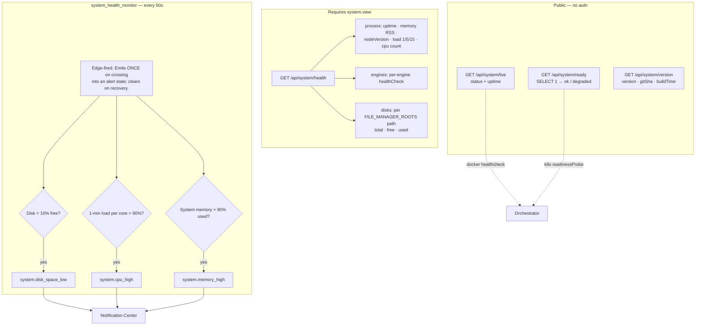

# System & Settings

## Overview

This page covers the plumbing: the **System** module (health probes, resource monitoring, version and update information) and the **Settings** module (the key/value store that everything else configures itself from).

Neither is glamorous. Both are load-bearing — the health probes are what your orchestrator uses to decide whether UltraTorrent is alive, and the settings store is where half the product's configuration actually lives.

Both are **core** modules (`system`, permission `system.view` / `system.manage`; `settings`, permission `settings.view` / `settings.manage`).

## Why / when to use it

- **You are deploying under Docker, Kubernetes, or systemd** and need liveness/readiness endpoints.
- **You want to be told before the disk fills up** rather than after.
- **You are diagnosing a slow or wedged instance** and need to see load, memory, engine health, and free space in one place.
- **You need to know exactly which build is running** when reporting a bug.

## Concepts

**Liveness** (`/api/system/live`) — "is the process running?" **Public, no auth.** Returns `{ status: 'ok', uptime }`.

**Readiness** (`/api/system/ready`) — "can it actually serve traffic?" **Public, no auth.** It runs a `SELECT 1` against Postgres and returns `{ status: 'ok' | 'degraded', database: boolean }`.

**Version** (`/api/system/version`) — **public**. Returns the product name, version, edition, API version, git tag, git SHA, build time, and Node version.

**Health** (`/api/system/health`) — the real diagnostic surface. **Requires `system.view`.**

**Settings** — a **flat key → value table**, not a structured schema. Keys are dot-namespaced strings (`general.theme`, `engine.pollIntervalMs`). A `GET` returns one flat map.

## How it works



### The resource monitor

`system_health_monitor` runs every **60 seconds** and is **edge-fired**: it emits once when a threshold is crossed and clears on recovery. It does not re-alert every minute while the condition persists, which is why it can safely be wired straight into your phone.

| Alert | Threshold | Event |
|-------|-----------|-------|
| Disk | Any `FILE_MANAGER_ROOTS` path with **< 10 % free** | `system.disk_space_low` (with `path` and `freePercent`) |
| CPU | 1-minute load average **per core > 90 %** | `system.cpu_high` (with `loadPercent`) |
| Memory | System memory **> 90 % used** | `system.memory_high` (with `usedPercent`) |

:::caution The thresholds are hard-coded
10 %, 90 %, and 90 % are **constants, not settings**. There is no way to configure them today.

Also: the alerting state is tracked **in memory**, so it **resets on restart** — after a restart, a still-breaching condition will alert again once.
:::

## Configuration

### System endpoints

| Method | Path | Auth | Permission |
|--------|------|------|-----------|
| GET | `/api/system/live` | **Public** | — |
| GET | `/api/system/ready` | **Public** | — |
| GET | `/api/system/version` | **Public** | — |
| GET | `/api/system/health` | Bearer | `system.view` |
| GET | `/api/system/update` | Bearer | `system.view` |
| POST | `/api/system/update/check` | Bearer | `system.view` |
| PATCH | `/api/system/update/settings` | Bearer | **`system.manage`** |

:::info Only a Super Admin can toggle update checks
The **Administrator** role is defined as *every permission except `system.manage`*. Since `PATCH /api/system/update/settings` is the only route requiring it, **only a Super Admin can enable or disable background update checks.**
:::

`GET /api/system/health` returns:

- **`process`** — `uptime` (seconds), `memory` (resident set size, bytes), `nodeVersion`, `load` (the 1/5/15-minute triple), and `cpus` (core count).
- **`engines`** — per registered engine: `{ engineId, kind, online, latencyMs, version, error, checkedAt }`.
- **`disks`** — for each `FILE_MANAGER_ROOTS` path: `{ path, total, free, used }` in bytes, or an `unavailable` error.

### Settings

Settings are a **flat key/value store**, not sections. Six keys are seeded:

| Key | Default |
|-----|---------|
| `general.productName` | `"UltraTorrent"` |
| `general.theme` | `"dark"` |
| `security.refreshTokenTtlDays` | `30` |
| `security.accessTokenTtlMinutes` | `15` |
| `engine.pollIntervalMs` | `2000` |
| `fileManager.defaultRootPath` | `""` (empty = use the `FILE_MANAGER_ROOTS` env boundary as-is) |

Every write emits `system.settings_changed` onto the notification bus carrying **only the key** — never the value, which may be sensitive.

:::warning Two things about settings that will trip you up

**1. Values in the `settings` table are NOT encrypted.** They are stored as plaintext JSON. Encryption exists in UltraTorrent — AES-256-GCM via `SecretCipher` — but it protects secrets in *other modules' own tables*: engine passwords, indexer and Prowlarr API keys, notification channel credentials, media-server tokens, TOTP secrets, and the IMDb API key. **Do not put a secret in the generic settings store.**

**2. The Settings *page* is not a schema.** Beyond a few purpose-built cards (Default Root Path, Email settings, Newsletter images, Prowlarr), it auto-renders a **generic key/value list of whatever keys happen to exist in the database** — choosing the widget by the JavaScript type of the value (boolean → a switch, number → a number input, object → read-only JSON, otherwise a text box).

So the "sections" you see depend entirely on which keys are in the table. Two installs can show different Settings pages.
:::

`fileManager.defaultRootPath` is a **protected key**. Writing it through `PUT /api/settings/:key` or `PATCH /api/settings` returns a **`403`** telling you to use the dedicated route, `PUT /api/files/root`, which requires the separate `settings.manage_root_path` permission and validates the path against the hard roots. See [File Manager](/modules/files).

| Method | Path | Permission |
|--------|------|-----------|
| GET | `/api/settings` | `settings.view` |
| PUT | `/api/settings/:key` | `settings.manage` |
| PATCH | `/api/settings` | `settings.manage` (bulk upsert) |
| PUT | `/api/files/root` | `settings.manage_root_path` |

## Step-by-step walkthrough

**1. Wire the probes into your orchestrator.**

Docker Compose:

```yaml
healthcheck:
  test: ["CMD", "curl", "-fsS", "http://localhost:4000/api/system/live"]
  interval: 30s
  timeout: 5s
  retries: 3
```

Kubernetes:

```yaml
livenessProbe:
  httpGet: { path: /api/system/live, port: 4000 }
readinessProbe:
  httpGet: { path: /api/system/ready, port: 4000 }
```

Use **liveness** to decide whether to restart the container, and **readiness** to decide whether to send it traffic. `/ready` checks the database; `/live` does not.

**2. Look at `/api/system/health` once, deliberately.** It is the single best diagnostic surface in the product: process load and memory, every engine's health with latency and version, and free space on every configured root. Bookmark it.

**3. Wire the resource alerts into the [Notification Center](/modules/notification-center).** `system.disk_space_low` is the one that will save you. Enable its seeded rule, point it at a channel you actually read, and set `severity: critical` with `quietHoursOverride: true` — a full disk at 3 a.m. is worth waking up for.

**4. Check the version.** `GET /api/system/version` (public) gives you the version, git tag, git SHA, and build time. Always include this when you report a bug.

**5. Leave the settings you do not understand alone.** The Settings page auto-renders whatever keys exist. If you do not know what a key does, it is not there for you to tune.

## Screenshots

:::note Screenshot needed
Capture: **Administration → Settings** — the page showing the Default Root Path card (with its exists/readable/writable badges), the Email settings card, and the generic auto-rendered key/value list beneath.
:::


:::note Screenshot needed
Capture: the app header showing the **version badge** with the release tag and the abbreviated git commit hash.
:::


:::note Screenshot needed
Capture: **Dashboard** — the system health widgets showing uptime, load, memory, engine health, and free disk space per root.
:::


:::tip Watch this tutorial
_Video coming soon._
:::

## Real-world examples

### Be told before the disk fills, not after

A media stack fills its disk quietly and then everything fails in confusing ways at once: downloads stall, renames fail, the database refuses writes. The monitor checks every 60 seconds and fires `system.disk_space_low` when **any** `FILE_MANAGER_ROOTS` path drops below **10 % free** — once, on the edge, not every minute. Wire that event to Telegram via the [Notification Center](/modules/notification-center) and you get hours of warning instead of a broken morning.

### Give Kubernetes an honest readiness signal

`/api/system/live` says the process is up. `/api/system/ready` says the **database is reachable**. Those are genuinely different failures, and conflating them is how you get a pod that restarts in a loop when the real problem is Postgres. Point `livenessProbe` at `/live` and `readinessProbe` at `/ready`, and the orchestrator will stop sending traffic to an instance that cannot serve it — without killing it.

### Diagnose a slow instance in one request

Something feels wrong. `GET /api/system/health` tells you, in one payload: the 1/5/15-minute load average against your core count (is the box saturated?), resident memory, every engine's health with **latency** (is rTorrent wedged?), and free space per root (are you out of disk?). That is usually enough to know where to look next.

## Troubleshooting

| Symptom | Cause | Fix |
|---------|-------|-----|
| `/api/system/ready` returns `degraded` | The database is unreachable — the `SELECT 1` failed. | Check Postgres, its credentials, and the network between it and the backend. |
| The container is restarting in a loop | Your liveness probe is pointed at `/ready`, so a temporary database blip kills the container. | Point **liveness** at `/live` and **readiness** at `/ready`. They exist for different questions. |
| I cannot toggle update checks | `PATCH /api/system/update/settings` requires **`system.manage`**, and the Administrator role is explicitly defined as *everything except `system.manage`*. | Use a **Super Admin** account. |
| The disk alert fires repeatedly after a restart | The alerting state is tracked **in memory** and resets on restart, so a still-breaching condition alerts again once. | Expected. Fix the disk. |
| I want to change the 10 % / 90 % thresholds | They are **hard-coded constants**, not settings. | Not configurable today. |
| A settings key will not save: `403` | `fileManager.defaultRootPath` is a **protected key** and cannot be written through the generic settings endpoints. | Use **Settings → Default Root Path**, which calls `PUT /api/files/root` and needs `settings.manage_root_path`. |
| The version badge shows no commit hash | Historically, the git commit was only baked in when build args were passed. Fixed: it is now **always** baked in. | Update, and rebuild with the canonical build wrapper. |
| Two installs show different Settings pages | Expected. Beyond the purpose-built cards, the page auto-renders **whatever keys exist in the database**, choosing a widget by the value's JavaScript type. | Not a bug. |
| I put an API key in the settings store and it is in plaintext | **Settings values are not encrypted.** Encryption protects secrets in *other modules'* own tables, not this one. | Never store a secret here. Use the module that owns it — engines, indexers, notification channels, and media-server integrations all encrypt their own credentials. |

## Best practices

- **Point liveness and readiness at the right endpoints.** `/live` for "restart me", `/ready` for "send me traffic".
- **Wire `system.disk_space_low` to a channel you actually read**, with a quiet-hours override. It is the single highest-value alert in the product.
- **Never put a secret in the settings store.** It is plaintext.
- **Include `GET /api/system/version` output in every bug report.** Version, git tag, git SHA, build time.
- **Restrict `system.manage`.** It is the one permission Administrator deliberately does not hold.
- **Do not tune settings keys you do not recognise.** The page renders whatever is in the table, including keys you were never meant to touch.

## Common mistakes

- **Using `/ready` as the liveness probe**, which turns a transient database hiccup into a restart loop.
- **Storing an API key or a password in the generic settings store**, where it is plaintext.
- **Expecting the health thresholds to be configurable.** They are constants.
- **Trying to set the Default Root Path through `PATCH /api/settings`.** It is protected; it has its own route and its own permission.
- **Assuming Administrator can do everything.** It cannot toggle update checks.

## FAQ

**Are the health endpoints public?**
`/live`, `/ready`, and `/version` are **public and unauthenticated** — orchestrators cannot send a bearer token. `/health`, which is the detailed one, requires `system.view`.

**How often does the resource monitor run?**
Every **60 seconds**, and it is **edge-fired** — it alerts once on crossing a threshold, and clears on recovery, rather than re-alerting every minute.

**Can I change the alert thresholds?**
No. 10 % free disk, 90 % load per core, and 90 % memory are hard-coded.

**Are settings encrypted?**
**No.** Values in the `settings` table are plaintext JSON. Secrets live in their owning module's table, AES-256-GCM encrypted (engine passwords, indexer and Prowlarr API keys, notification channel credentials, media-server tokens, TOTP secrets, the IMDb API key).

**Why does my Settings page look different from someone else's?**
Because beyond a few purpose-built cards, it auto-renders whatever keys exist in the database, picking a widget by the value's type. It is not a fixed schema.

**Why can't my Administrator account change the update setting?**
Administrator is defined as *every permission except `system.manage`* — and that route is the only one requiring it. Use a Super Admin.

**Where do I find which build I am running?**
`GET /api/system/version`, or the version badge in the app header, which shows the release tag and the abbreviated git commit.

## Checklist

- [ ] `curl /api/system/live`. Expected: `{ status: 'ok', uptime }`, with **no auth**.
- [ ] `curl /api/system/ready`. Expected: `{ status: 'ok', database: true }`.
- [ ] Stop Postgres and re-check `/ready`. Expected: `degraded`, `database: false` — and `/live` still `ok`.
- [ ] Call `/api/system/health` with `system.view`. Expected: process, engines (with latency and version), and disks (with free bytes per root).
- [ ] Wire the probes into your orchestrator. Expected: liveness → `/live`, readiness → `/ready`.
- [ ] Enable the `system.disk_space_low` notification rule. Expected: it fires when a root drops below 10 % free.
- [ ] Check the version badge. Expected: a release tag and an abbreviated commit hash.
- [ ] Confirm no secret is stored in the generic settings table. Expected: none.

## See also

- [File Manager](/modules/files) — the Default Root Path and its protected-key rules.
- [Notification Center](/modules/notification-center) — routing `system.*` alerts.
- [Engines](/modules/engines) — the engine health that `/health` reports.
- [Modules overview](/modules/) — the module registry.
- [Environment reference](/reference/environment) — the variables behind all of this.
- [Performance tuning](/operate/performance)
- [Troubleshooting](/operate/troubleshooting)
- [Backup](/operate/backup)
