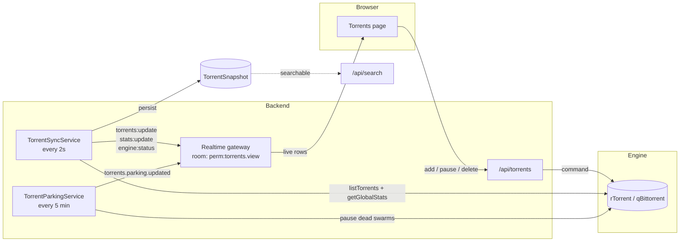

# Torrents

## Overview

**Torrents** is the module you will spend the most time in. It is the list of everything your torrent engine is doing, the detail view for any one of them, and the actions you take on them: add, start, stop, pause, resume, recheck, move, limit, and delete.

It is a **core** module (id `torrents`) and depends on [Engines](/modules/engines) — the torrent module has no download logic of its own. It reads and commands whatever engine you have connected. That separation is deliberate: swapping rTorrent for qBittorrent changes nothing about this page.

## Why / when to use it

This is your control surface for downloads in flight. You come here to:

- **Add** something by magnet link, remote `.torrent` URL, or an uploaded `.torrent` file.
- **Watch** progress, speed, ratio, ETA, seeds, and peers in real time.
- **Intervene** — pause a torrent eating your bandwidth, recheck one whose data looks wrong, delete one you no longer want.
- **Act in bulk** — stop 40 completed torrents at once rather than 40 times.

Everything automation does ([RSS](/modules/rss), [Smart Download](/modules/smart-download), [Missing Episodes](/modules/missing-episodes)) ultimately lands here. When automation goes wrong, this is where you see it.

## Prerequisites

- **A configured, enabled engine.** With no engine, the torrents page shows an empty state telling you to configure one. There is no bundled default engine row — you create it. See [Engines](/modules/engines).
- The `torrents.view` permission to see anything. Each action has its own permission (below).

## Concepts

**Info-hash** — the torrent's unique identity, a lowercase hex string. Every route addresses a torrent by its hash, not by name. Two torrents with the same hash are the same torrent, whatever the file is called.

**State** — one of `downloading`, `seeding`, `paused`, `stopped`, `queued`, `checking`, `error`, `completed`, `allocating`, `unknown`. Note that `paused` and `stopped` are *different states*, with different actions, because the underlying engines distinguish them.

**Ratio** — uploaded ÷ downloaded. The number private trackers care about.

**Label** — a single free-text tag the engine itself stores on the torrent. Displayed under the name in the list, and what the `category` filter matches on.

**Save path** — the directory on disk the engine writes to. It matters far beyond this page: [Media Manager](/modules/media-manager) only auto-organises a completed download whose save path falls inside an enabled library's root.

**Parking queue** — a holding pen for dead torrents, so they cannot block healthy ones. Explained in full below.

**Torrent sync** — the background job that reconciles UltraTorrent's view with the engine's. It runs every **2 seconds** and is what makes the list live.

## How it works

The list you see is pushed to you: the sync job polls the engine every 2 seconds and broadcasts `torrents:update`, `stats:update`, and `engine:status` into the `perm:torrents.view` room — so a user without `torrents.view` never receives a single byte of torrent data over the socket. The browser also does a slower safety-net poll (every 10 seconds) in case the socket drops.

Each sync tick also writes a `TorrentSnapshot` row, which is what `GET /api/search` searches. That is why search works on torrents that have since been removed from the engine.

### The parking queue

This one is worth understanding, because the failure it prevents is brutal and non-obvious.

A magnet link with **zero seeders can never fetch its metadata** — but the engine counts it as an *active download* the whole time it tries. Grab enough dead magnets and they permanently occupy every active-download slot the engine has. Everything healthy queues behind them, forever. On one real install this produced **1,137 torrents moving 0 bytes**, with 1,114 of them reporting zero seeders and 100 slots pinned by torrents that could never finish.

`TorrentParkingService` sweeps every **5 minutes**. A torrent that is `DOWNLOADING`, below the seeder floor, with nobody connected, no bytes moving, and past a grace period is **paused** and recorded in `parked_torrents`. A paused torrent holds no slot, so the engine promotes a queued torrent into the freed one — and that torrent gets judged on its own merits.

Because a paused torrent never announces, its seeder count can never refresh on its own, so the service periodically **probes** parked torrents by briefly force-starting them. If a swarm comes back to life, the torrent is unparked.

:::warning Parking ships disabled
The parking queue is **off by default** (`enabled: false`). Turn it on if you auto-acquire at volume — especially if any of your indexers do not enforce a minimum seeder count.
:::

## Configuration

### Adding a torrent

| Method | How | Permission |
|--------|-----|-----------|
| Magnet link | `POST /api/torrents` with `{ magnet }` | `torrents.add` |
| Remote `.torrent` URL | `POST /api/torrents` with `{ url }` | `torrents.add` |
| Upload a `.torrent` file | `POST /api/torrents/upload` (multipart, field `file`) | `torrents.add` |

Uploads are capped at **20 MB**, and a malformed `.torrent` is rejected with a `400` *before* it ever reaches the engine. At add time you may also supply a **category**, **tags**, and a **save path**.

### Parking rules (settings key `torrents.parking`)

| Option | What it does | Default | Recommended |
|--------|--------------|---------|-------------|
| `enabled` | Turns the parking sweep on. | `false` | **`true`** if you auto-acquire. Leave off if you add everything by hand. |
| `minSeeders` | The seeder floor below which a stuck torrent is a parking candidate. | `1` | `1` is right for most people. Raise it only if you are drowning in one-seeder torrents. |
| `deadAfterMinutes` | How long a zero-seeder, zero-progress torrent must sit before it is parked. | `30` | `30`. Lower it if slots are scarce. |
| `stalledAfterMinutes` | How long a torrent with seeders but no movement must sit before it is parked. | `180` | `180`. A slow swarm is not a dead one — do not be hasty. |
| `probeBatchSize` | How many parked torrents are probed per sweep. | `20` | Raise only if you have hundreds parked and want faster recovery. |
| `probeIntervalMinutes` | How often a parked torrent is re-probed. | `60` | `60`. |
| `maxProbeIntervalMinutes` | The ceiling the probe backoff grows to. | `1440` (24 h) | `1440`. A torrent dead for a day is probably dead. |

Manage these at **Downloads → Torrents → Parking**, or via `PATCH /api/torrents/parking/settings` (`torrents.pause`).

### Permissions

Each action is separately gated — you can build a role that may pause but not delete.

| Permission | Grants |
|-----------|--------|
| `torrents.view` | See the list, detail, files, peers, trackers; receive realtime updates. |
| `torrents.add` | Add by magnet, URL, or file upload. |
| `torrents.start` / `.stop` / `.pause` / `.resume` | The corresponding lifecycle action. |
| `torrents.recheck` | Force a data recheck. |
| `torrents.delete` | Remove the torrent (leaving the data). |
| `torrents.delete_data` | Remove the torrent **and its files on disk**. |
| `torrents.move` | Move a torrent's storage. |
| `torrents.manage_limits` | Set per-torrent upload/download limits. |
| `torrents.manage_files` | Set per-file priority (skip / normal / high). |
| `torrents.manage_trackers` | Add or remove trackers. |

:::danger `delete` and `delete_data` are different permissions, on purpose
`torrents.delete` removes the torrent from the engine. `torrents.delete_data` **also deletes the files**. Grant the second one deliberately, to people you trust with your disk.
:::

### Bulk actions

`POST /api/torrents/bulk` takes `{ hashes[], action }` where `action` is one of `start`, `stop`, `pause`, `resume`, `recheck`, `remove`, `removeData`. The service re-checks the **action-specific** permission for each one, so a user with `torrents.pause` but not `torrents.delete` cannot bulk-remove. It returns `{ succeeded, failed }` counts — one bad hash does not abort the batch.

### Filtering, search, and sorting

`GET /api/torrents` accepts `engineId`, `state`, `category`, `search`, `sortBy`, `sortDir`, `page`, `pageSize` (default 50, hard cap 500).

- **Search** matches the torrent **name or hash**, case-insensitively.
- **Category** filters on the torrent's `label`.
- Sorting defaults to newest-added first.
- The UI adds state filter pills (all / downloading / seeding / completed / paused / error), a 350 ms debounced search box, and sortable columns.

## Step-by-step walkthrough

**1. Confirm an engine is connected.** The page header shows an engine health badge. If it says the engine is offline, stop here and fix [Engines](/modules/engines) — nothing on this page will work.

**2. Add something.** Click **Add torrent**, paste a magnet link, and — importantly — set the **save path** to where you actually want the data. If you leave it at the engine default, everything ends up in one flat directory and Media Manager will not organise it.

**3. Watch it start.** Within about two seconds the row appears and starts moving. If it sits at 0% in `downloading` with 0 seeds, you have a dead magnet — see Troubleshooting.

**4. Use the detail view.** Click the row. You get files (with per-file priority), peers, and trackers. Set a file's priority to **skip** to avoid downloading the sample and the `.nfo`.

**5. Manage completion.** When it finishes, it moves to `seeding`. Leave it seeding if you are on a private tracker and care about ratio. Otherwise, select the completed ones and bulk-**stop** them.

**6. Turn on parking** if you are automating acquisition. **Downloads → Torrents → Parking** → enable. Then check back in a day: the parking list tells you exactly which grabs were dead on arrival, which is excellent signal about your indexers.

## Screenshots

:::tip Watch this tutorial
_Video coming soon._
:::

## Real-world examples

### Reclaim a wedged download queue

You notice your download speed is zero across the board, but the engine says it has 100 active downloads. Sort by seeds ascending: you will find a wall of zero-seeder magnets stuck at 0%, each holding an active slot while it fruitlessly hunts for metadata. Select them and bulk-**remove**, then go to **Parking** and enable it so it never happens again. Then go fix the root cause: set a `minSeeders` floor on every [indexer](/modules/indexers), because an indexer with no floor will happily hand you dead releases forever.

### Free bandwidth without losing your ratio

You need your upstream back for a video call. Select your seeding torrents, bulk-**pause** (not stop — pause is resumable and the engines treat it differently). When you are done, select them again and bulk-**resume**. Your ratio is unaffected; you were simply not uploading for an hour.

### Skip the junk inside a season pack

You grabbed a season pack that includes samples, `.nfo` files, and a `Subs/` folder in twelve languages you do not read. Open the torrent detail, go to **Files**, and set everything you do not want to priority **skip** (`0`). The engine will not download those pieces at all. (For files that are *already* on disk, use the [File Manager](/modules/files) cleanup wizard instead.)

## Troubleshooting

| Symptom | Cause | Fix |
|---------|-------|-----|
| "No torrent engine is configured" | There is no engine row. UltraTorrent does not seed a default one. | Create one at **Downloads → Engines**. See [Engines](/modules/engines). |
| Hundreds of torrents, zero bytes moving, DHT healthy | Dead magnets are holding every active-download slot. A 0-seeder magnet can never fetch metadata but still counts as an active download. | Enable the **parking queue**. Then set `minSeeders` on every indexer — this is caused upstream, by an indexer with no seeder floor. |
| A magnet appears "failed" but downloads fine a minute later | Historically, rTorrent's add-confirmation waited ~6 s for the info-hash to register, which is fine for a `.torrent` file but wrong for a magnet (rTorrent does not list a magnet's hash until it fetches metadata from DHT). This caused a flood of false `download.failed` events — on one host, 257 "failures" of which **256 actually loaded**. Fixed: magnets are now treated as *accepted/pending*, and the 2-second sync reconciles when they register. `.torrent` files still hard-fail, so a genuinely broken file is still surfaced. | Update. If you still see it, check the engine logs. |
| Completed torrents "seed forever" despite a working delete rule | Two separate historical bugs: rTorrent's `delete` did not verify removal (now verifies + retries), and `torrent.completed` automation rules only fired on the *completion edge*, so a torrent already complete when the rule was written never triggered. Both fixed. | Update. Then re-check the rule at [Automation](/modules/automation). |
| The list is stale / not updating | The WebSocket dropped, or you lack `torrents.view`. | The browser polls every 10 s as a fallback, so a stale list usually means a permission problem. Check your role. |
| A torrent is stuck in `checking` | The engine is verifying data against the pieces. | Wait. On a large torrent on slow storage this takes a while. It is not hung. |
| Deleting a torrent left the files behind | You used `delete`, not `delete with data`. That is the designed behaviour. | Use **Delete with data** (needs `torrents.delete_data`), or clean up in the [File Manager](/modules/files). |
| An engine badge flickers between online and offline | The engine is crashing and restarting under load. rTorrent 0.9.8 has an unfixed upstream `priority_queue_insert` crash that is **load-driven** — one host with 752 torrents crashed 44 times in 4 days; another with 7 torrents on the identical build crashed zero times. | See [Engines → Troubleshooting](/modules/engines). No torrents are lost — the session reloads. |

## Best practices

- **Always set a save path.** It is the difference between an organised library and a 4 TB directory called `/downloads`.
- **Enable parking if you automate.** The failure it prevents is silent, total, and takes hours to diagnose without it.
- **Split `delete` from `delete_data` in your roles.** Most people never need to delete files from the web UI.
- **Use bulk actions.** They re-check permissions per action and report per-item success, so they are safe.
- **Watch the engine health badge**, not the torrent list, when things look wrong. A dead engine looks exactly like "nothing is downloading".

## Common mistakes

- **Confusing pause and stop.** They are different engine states with different permissions. Pause is the reversible one you want most of the time.
- **Deleting a torrent to free disk space.** Plain delete does not touch the files. You need delete-with-data, or the File Manager.
- **Adding a torrent without a category** and then wondering why the Automation rule keyed on that category never fired.
- **Assuming a 0% download is a UltraTorrent bug.** It is almost always a dead swarm. Check the seed count.
- **Trying to change a torrent's category after adding it.** There is currently no endpoint for that — see below.

## FAQ

**How fast does the list update?**
The sync job hits the engine every **2 seconds** and pushes the result over WebSocket. The browser also polls every 10 seconds as a fallback.

**Can I change a torrent's category or label after adding it?**
Not currently. Category and tags can only be set **at add time**. There is no `PATCH /api/torrents/:hash` and no set-label route.

**Can I force a reannounce?**
No. There is no reannounce action in the API, the provider interface, or the UI.

**Can I set the priority of a whole torrent?**
Not via the API. **File** priority is exposed (`skip` / `normal` / `high`); torrent-level priority exists in the provider interface but has no route.

**Why do I have two "delete" buttons?**
Because deleting the files is irreversible and deleting the torrent is not. They are separate permissions so an administrator can grant one without the other.

**Does search only cover active torrents?**
No — `GET /api/search` searches persisted `TorrentSnapshot` rows (by name, hash, label, and save path), so it can find torrents that have since been removed from the engine.

## Checklist

- [ ] Open **Downloads → Torrents**. Expected: an engine health badge showing online, and the list rendering.
- [ ] Add a well-seeded magnet with an explicit save path. Expected: the row appears within ~2 s and starts progressing.
- [ ] Open its detail view. Expected: Files, Peers, and Trackers tabs populate.
- [ ] Set one file to **skip**. Expected: the total download size drops.
- [ ] Pause it, then resume it. Expected: state changes are reflected within one sync tick.
- [ ] Select several torrents and bulk-stop. Expected: a `{ succeeded, failed }` result, and all the rows change state.
- [ ] Enable the parking queue. Expected: within 5 minutes, any dead 0-seeder torrent is paused and listed under Parking.
- [ ] Confirm the audit log recorded your add and delete. See [Audit](/modules/audit).

## See also

- [Engines](/modules/engines) — the client underneath, and how to connect it.
- [RSS automation](/modules/rss) — where most torrents come from.
- [Smart Download](/modules/smart-download) — the decision engine that grabs on your behalf.
- [File Manager](/modules/files) — dealing with the files after the fact.
- [Automation](/modules/automation) — reacting to `torrent.completed`.
- [First download](/learn/first-download) — the guided walkthrough.
- [Performance tuning](/operate/performance)
