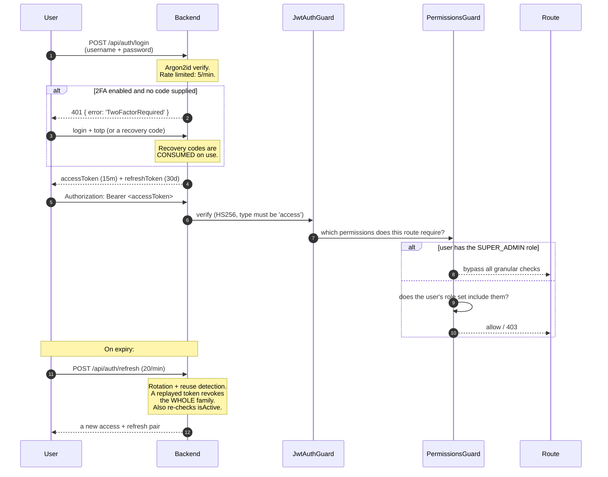

# Users & Roles

## Overview

**Users** is where you create accounts and decide what they may do. What they may do is expressed as **permissions** — about a hundred dot-namespaced strings like `torrents.delete_data` or `media_manager.rename` — which are bundled into **roles**.

The server is always authoritative. The UI hides what you cannot do as a convenience; the backend's permission guard is what actually refuses.

It is a **core** module (id `users`, permissions `users.view` / `users.manage`) and depends on `auth` and `rbac`.

## Why / when to use it

- **You share your instance.** A housemate should be able to browse and download; they should not be able to delete your library.
- **You want least privilege.** Most people never need `torrents.delete_data` or `settings.manage`.
- **You want accountability.** Every user's actions are attributed in the [audit log](/modules/audit).

## Prerequisites

- `users.view` to see users, `users.manage` to create, edit, or delete them.
- Only a **Super Admin** can grant the Super Admin role.

:::danger Change the seeded admin password immediately
A fresh install seeds a super-admin account:

| Username | `admin` |
|----------|---------|
| **Email** | `admin@ultratorrent.local` |
| **Password** | **`changeme123!`** |

Change it before the instance is reachable by anyone else. This is step zero of every install.
:::

## Concepts

**Permission** — one capability, as a string (`torrents.view`, `media_manager.rename`). About a hundred exist. See the [permissions reference](/reference/permissions).

**Role** — a named bundle of permissions. Five are seeded, and all five are marked `isSystem`.

**Super-admin bypass** — the `SUPER_ADMIN` role **bypasses all granular permission checks** in the guard. It does not "have every permission" so much as "is never asked".

**Refresh-token family** — sessions are refresh tokens organised into families, with **rotation and reuse detection**. Presenting an already-revoked refresh token revokes the **entire family** — the assumption being that a replayed token means it was stolen.

## The seeded roles

| Role | What it holds |
|------|--------------|
| **Super Admin** | Everything. Bypasses granular checks entirely. |
| **Administrator** | Everything **except `system.manage`**. In practice this means only a Super Admin can toggle background update checks. |
| **Power User** | All `torrents.*` **except `delete_data`**; categories and tags; all `rss.*`; `automation.view` + `manage`; all `indexers.*`; all `integrations.prowlarr.*`; all `files.*`; `system.view`; most `media_manager.*` including IMDb; `notifications.view` + `manage_preferences`. **No `settings.*`, no `users.*`, no `audit.view`, no `apikeys.manage`.** |
| **User** | `torrents.view/add/pause/resume/start/stop`; categories and tags; `rss.view` + show-status lookup; `files.view/preview/download`; `media_manager.view`; IMDb view + search; `notifications.view` + `manage_preferences`. |
| **Read-Only** | `torrents.view`, `rss.view` + show-status lookup, `automation.view`, `files.view/preview/download`, `system.view`, `media_manager.view`. |

:::warning Custom roles do not exist yet
`GET /api/users/roles` is **read-only**. There is **no endpoint to create, update, or delete a role**, and no custom-role UI. A `roles.manage` permission string is defined in the catalog, but **no route currently uses it** — it is inert.

You assign one or more of the five seeded roles. If you need a permission set that does not exist, you are currently choosing the nearest role — or contributing one. See [RBAC](/develop/rbac).

Also note: the seed **deletes and recreates** every role → permission mapping when it runs. Hand-editing a system role's permissions in the database will not survive a re-seed.
:::

## How it works

### Privilege-escalation guards

Four rules are enforced server-side and are worth knowing:

- **Only a Super Admin can grant the Super Admin role.** Anyone else gets a `403`.
- **Nobody can change their own roles.** Not even a Super Admin. `403: "You cannot change your own roles"`.
- **System users cannot be deleted.** `400`.
- **Deactivating a user immediately revokes all their refresh tokens.** They are logged out everywhere, at once.

## Configuration

### Creating a user

| Field | Rules |
|-------|-------|
| `username` | Required. |
| `email` | Required. |
| `displayName` | Optional, max 120 chars. |
| `password` | Required, **minimum 10 characters**. Hashed with **Argon2id**. |
| `roleNames[]` | One or more of the five seeded roles. |

:::caution The password policy is deliberately minimal
There is a **10-character minimum** and nothing else: **no** complexity rules, **no** password history, **no** expiry or rotation, and **no** breach check.

There is also **no forgot-password or password-reset flow**, and **an administrator cannot reset another user's password** — the update DTO has no password field. Password change is **self-service only** (**Profile → Password**), and changing it revokes all of that user's refresh tokens.

If a user forgets their password, an operator must reset it directly in the database.
:::

### Two-factor authentication

TOTP, via any authenticator app.

| Aspect | Detail |
|--------|--------|
| Algorithm | TOTP, with a **±1 step (30 s) window** for clock skew. |
| Enrollment | **Profile → Two-factor → Setup** returns a secret, an `otpauth://` URL, and a **QR code**. Scan it, then confirm with a code to enable. |
| Secret storage | **Encrypted** at rest. |
| Recovery codes | **10** are issued on enable, in the format `xxxxx-xxxxx-xxxxx-xxxxx` (80 bits of entropy). Only **SHA-256 hashes** of them are stored. |
| Using a recovery code | Supply it in the same field as a TOTP code at login. It is **consumed on use**. |
| Regenerating codes | Requires a valid current TOTP code. |
| Disabling | Requires the **account password**. Wipes the secret and the recovery codes. |

:::warning 2FA cannot be enforced
There is **no mechanism** — no setting, permission, or admin action — to **require** 2FA for a user, a role, or the instance. It is **purely opt-in, per user**.

If you need everyone on 2FA, you need a policy and a person to check it, not a switch. Consider putting the instance behind an authenticating [reverse proxy](/install/reverse-proxy) if you need enforced MFA.
:::

### Sessions and rate limits

| Setting | Default |
|---------|---------|
| Access-token TTL | **15 minutes** (`JWT_ACCESS_TTL`) |
| Refresh-token TTL | **30 days** (`JWT_REFRESH_TTL_DAYS`) |
| Global rate limit | 120 requests / 60 s |
| `POST /api/auth/login` | **5 / min** |
| `POST /api/auth/refresh` | **20 / min** |

Refresh tokens are stored **hashed** (SHA-256), rotate on every use, and detect reuse. A refresh also re-checks `isActive` — a deactivated account cannot refresh its way back in.

### Endpoints

| Method | Path | Permission |
|--------|------|-----------|
| GET | `/api/users` | `users.view` |
| GET | `/api/users/roles` | `users.view` (read-only) |
| POST | `/api/users` | `users.manage` |
| PATCH | `/api/users/:id` | `users.manage` |
| DELETE | `/api/users/:id` | `users.manage` |

**Account self-service** (`/api/account`, authenticated, **no permission required**):
`GET/PATCH /profile`, `POST /password`, `GET /2fa`, `POST /2fa/setup`, `POST /2fa/enable`, `POST /2fa/disable`, `POST /2fa/recovery`.

## Step-by-step walkthrough

**1. Change the seeded admin password.** **Profile → Password**. Do this first, before anything else, before anyone else can reach the instance.

**2. Enable 2FA on the admin account.** **Profile → Two-factor → Setup**. Scan the QR with your authenticator. Enter a code to enable it.

**3. Save your recovery codes somewhere you will actually find them.** You get **ten**, once. They are stored only as hashes, so nobody — including you — can recover them later. **This is the only chance.**

**4. Create a real user for yourself.** Running day-to-day as the seeded `admin` account muddies the audit trail. Give yourself an Administrator account with your own name.

**5. Create accounts for other people at the lowest role that works.** Start at **User** or **Read-Only**. Escalate only when someone actually hits a wall.

**6. Verify.** Log in as the new user and confirm they cannot reach what they should not. The nav will hide it, but **check a route directly** — the backend is the real gate, and that is what you are testing.

## Screenshots

:::tip Watch this tutorial
_Video coming soon._
:::

## Real-world examples

### Give a housemate access without giving them your library

Create them as a **User**. They can view, add, pause, and resume torrents, browse and download files, and see the media library. They **cannot** delete torrent data, manage settings, see the audit log, manage users, or touch your libraries. If they need to be able to write RSS rules, upgrade them to **Power User** — which still cannot delete torrent data or reach settings, users, or the audit log.

### Give someone a purely observational account

**Read-Only**. They can look at torrents, RSS, automation rules, files, system health, and the media library. They can change nothing at all. This is the right role for a dashboard on a wall, or for someone you want to be able to *diagnose* but not *act*.

### Lock down an admin account properly

Change the password. Enable 2FA and store the recovery codes offline. Create a separate, non-admin day-to-day account for yourself, and only escalate to the admin one when you actually need it. Then check the [audit log](/modules/audit) — every admin action is attributed, and using a shared `admin` account destroys that attribution.

## Troubleshooting

| Symptom | Cause | Fix |
|---------|-------|-----|
| A user forgot their password | **There is no reset flow.** No forgot-password endpoint, and an admin **cannot** reset another user's password — the update DTO has no password field. | An operator must reset the hash directly in the database. This is a real gap; plan for it. |
| `403: You cannot change your own roles` | Deliberate. Nobody may escalate themselves, including a Super Admin. | Have another Super Admin do it. |
| `403: Only a super admin can grant the SUPER_ADMIN role` | Deliberate. | Log in as a Super Admin. |
| A deactivated user is still logged in | They should not be — deactivating **immediately revokes all their refresh tokens**, and refresh re-checks `isActive`. Their current access token remains valid for up to its **15-minute** TTL. | Wait out the access-token TTL. |
| Login returns `401 TwoFactorRequired` | The account has 2FA enabled and no code was supplied. This is not a failed login and is deliberately **not audited as one**. | Supply the TOTP code, or a recovery code, in the same field. |
| A TOTP code is always rejected | Clock skew beyond ±1 step (30 s). | Sync the clock on the device generating the codes, and on the server. |
| A user lost their authenticator and their recovery codes | Recovery codes are stored **only as SHA-256 hashes**. They cannot be recovered. | An operator must clear the user's 2FA fields in the database. |
| I edited a system role's permissions and they reverted | The seed **deletes and recreates** every role → permission mapping when it runs. | Do not hand-edit system roles. Custom roles are not yet supported. |
| I cannot create a custom role | Role CRUD does not exist. `GET /api/users/roles` is read-only, and the `roles.manage` permission is currently unwired. | Use the nearest seeded role. See [RBAC](/develop/rbac). |

## Best practices

- **Change the seeded admin password before the instance is reachable.** Nothing else matters if you skip this.
- **Enable 2FA on every privileged account,** and store the recovery codes offline.
- **Do not use the seeded `admin` account day to day.** It destroys audit attribution.
- **Start at the lowest role that works** and escalate only on a real need.
- **Split `delete` from `delete_data` mentally.** Power User deliberately does **not** get `torrents.delete_data` — that is the design, and it is a good one.
- **Deactivate rather than delete.** Deactivating revokes every session instantly and preserves the audit trail.
- **Have a database plan for password resets.** There is no in-app flow.

## Common mistakes

- **Leaving `changeme123!` in place.** It is the first thing anyone will try.
- **Giving everyone Administrator** because Power User "did not have quite enough". Look at what they actually hit a wall on.
- **Assuming 2FA can be enforced.** It cannot. It is opt-in per user.
- **Discarding the recovery codes** because the authenticator "is on my phone and I never lose my phone".
- **Assuming hiding a nav entry protects a route.** It does not. The backend guard does. Test the route, not the menu.

## FAQ

**Can I create a custom role?**
Not currently. Roles are the five seeded ones, and `GET /api/users/roles` is read-only. The `roles.manage` permission exists in the catalog but is wired to nothing.

**What is the difference between Super Admin and Administrator?**
Administrator holds every permission **except `system.manage`**. In practice, only a Super Admin can toggle background update checks. Super Admin also **bypasses granular permission checks entirely** in the guard, rather than being checked against a list.

**Can I force everyone to use 2FA?**
No. There is no enforcement mechanism at all. If you need enforced MFA, put the instance behind an authenticating reverse proxy.

**How do I reset a user's password?**
Directly in the database. There is no forgot-password flow and no admin-initiated reset. This is a known gap.

**What happens if someone steals a refresh token?**
Refresh tokens rotate on every use and the system **detects reuse**: presenting an already-revoked token revokes the **entire token family**, logging out both the thief and the legitimate user. That is the intended behaviour — a replayed token means something is wrong.

**Are logins audited?**
Yes — `auth.login`, for both success and failure. A pending 2FA challenge is deliberately **not** audited as a failed login.

**How long does a session last?**
The access token lives **15 minutes**; the refresh token **30 days**. The client refreshes transparently.

## Checklist

- [ ] Change the seeded `admin` password. Expected: the old one no longer works, and all its refresh tokens are revoked.
- [ ] Enable 2FA on the admin account. Expected: a QR code, then **ten** recovery codes shown **once**.
- [ ] Log out and back in with a TOTP code. Expected: login succeeds.
- [ ] Log in with a **recovery code**. Expected: it works, and it is **consumed** — using it again fails.
- [ ] Create a **Read-Only** user. Expected: they can view but change nothing.
- [ ] As that user, call a mutating endpoint directly. Expected: **403** from the backend, not just a hidden button.
- [ ] Try to change your own roles. Expected: `403`.
- [ ] Deactivate a user. Expected: their refresh tokens are revoked immediately.
- [ ] Check the [audit log](/modules/audit). Expected: the logins, the user creation, and the role change are all attributed.

## See also

- [Permissions reference](/reference/permissions) — every permission string.
- [RBAC](/develop/rbac) — how the guard works, and how to extend it.
- [Authentication](/develop/authentication) — JWTs, refresh rotation, reuse detection.
- [API keys](/modules/api-keys) — and why they are not yet a credential.
- [Audit log](/modules/audit) — attribution.
- [Security](/operate/security)
