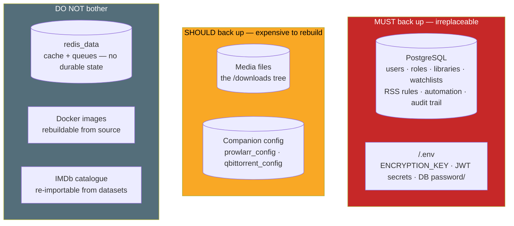
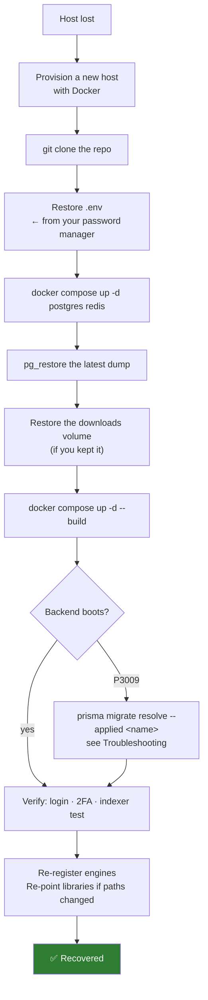

# Backup & Restore

An untested backup is a rumour. This page tells you what is actually
irreplaceable, how to capture it, and — the part everyone skips — how to **prove
you can restore it**.

## Purpose

To be able to lose the host entirely and be running again, with your users,
libraries, rules and history intact.

## When to use this

- **Now.** Before you need it.
- Before any upgrade (see [Upgrading](/install/upgrading)).
- Before rotating `ENCRYPTION_KEY` or doing database surgery.
- Before moving to a new server.

## Prerequisites

- Shell access to the Docker host.
- Somewhere to put the backups that is **not the host being backed up**.

:::tip Watch this tutorial
_Video coming soon._
:::

## Concepts

### What is actually irreplaceable

Be precise about this. Backing up the wrong things wastes storage; backing up too
few loses your installation.



| Item | Where it lives | Back it up? | Why |
|------|----------------|-------------|-----|
| **PostgreSQL** | `postgres_data` volume | **Yes — critical** | Every piece of durable state. Users, roles, engines, libraries, media items, watchlists, RSS feeds and rules, automation rules, jobs, the audit trail. |
| **`.env`** | Repo root, on the host | **Yes — critical** | Holds `ENCRYPTION_KEY`. **It is not in your database dump.** |
| **Media / downloads** | `downloads` volume | Yes, if you value it | Your actual media. Also contains rTorrent's session at `/downloads/.session`. |
| **Prowlarr config** | `prowlarr_config` volume | Recommended | Indexer definitions and settings. Rebuildable, but tedious. |
| **qBittorrent config** | `qbittorrent_config` volume | Recommended | Engine settings + the torrent session. |
| **Redis** | `redis_data` volume | **No** | Cache and job broker. No durable state. |
| **IMDb catalogue** | Inside Postgres | Comes free with the DB dump | It is *in* the dump. If you exclude it to save space, you can re-import from datasets. |

:::danger The `.env` file is half your backup
`ENCRYPTION_KEY` encrypts TOTP secrets, indexer API keys, the Prowlarr key and
engine passwords **at rest, inside the database**. A Postgres dump **without** the
`.env` restores those columns as **undecryptable ciphertext**. You would have your
users and your libraries, and no working 2FA or API keys.

**Store `.env` in a password manager or secret store, off the host.**
:::

### The two backup strategies

| Strategy | What it is | Pros | Cons |
|----------|------------|------|------|
| **Logical dump (`pg_dump`)** — *recommended* | A SQL/custom-format export of the database | Portable across Postgres versions and architectures; can be taken **hot**, with the stack running; compresses well | Slower to restore on a very large IMDb catalogue |
| **Volume snapshot** | Copy the `postgres_data` directory | Fast | **Must stop the database first** or it is inconsistent; not portable across Postgres major versions |

Use `pg_dump`. Use volume snapshots only as a *supplement*.

## Steps

### 1. Back up PostgreSQL

The custom format (`-Fc`) is compressed and restores selectively — prefer it.

```bash
cd /path/to/ultratorrent

# Hot backup — the stack can keep running.
docker compose exec -T postgres \
  pg_dump -U ultratorrent -d ultratorrent -Fc \
  > "ultratorrent-$(date +%F-%H%M).dump"
```

A plain-SQL variant, if you want something you can read and grep:

```bash
docker compose exec -T postgres \
  pg_dump -U ultratorrent -d ultratorrent \
  | gzip > "ultratorrent-$(date +%F-%H%M).sql.gz"
```

:::tip Excluding the IMDb catalogue
The IMDb catalogue can be **8.9 million rows** and will dominate your dump size.
It is fully re-importable from the IMDb datasets, so you may exclude it:

```bash
docker compose exec -T postgres \
  pg_dump -U ultratorrent -d ultratorrent -Fc \
    --exclude-table-data='imdb_titles' \
    --exclude-table-data='imdb_episodes' \
    --exclude-table-data='imdb_akas' \
  > "ultratorrent-slim-$(date +%F).dump"
```

The **schema** is still included — only the row data is skipped. After restoring,
re-import the datasets from **Media → Settings → IMDb**, and let the trigram
indexes rebuild (they build `CONCURRENTLY` in the background at boot). Your
watchlist keeps its IMDb ids either way, because those live on *your* tables.
:::

### 2. Back up `.env`

```bash
cp .env "env-backup-$(date +%F)"
# ...then move it somewhere safe and OFF this host.
```

Better: paste it into your password manager. It is small and it is the difference
between a recoverable and an unrecoverable installation.

### 3. Back up the media (optional but usually wanted)

```bash
# Find where the downloads volume actually lives
docker volume inspect ultratorrent_downloads --format '{{ .Mountpoint }}'

# Then sync it somewhere else (rsync, restic, borg, a NAS share, ...)
sudo rsync -aHAX --info=progress2 \
  "$(docker volume inspect ultratorrent_downloads --format '{{ .Mountpoint }}')/" \
  /mnt/backup/ultratorrent-downloads/
```

If you bind-mounted a host directory for downloads instead of using the named
volume, back up that directory directly — you already know where it is.

### 4. Back up the companion volumes (optional)

```bash
for v in prowlarr_config qbittorrent_config; do
  docker run --rm \
    -v "ultratorrent_${v}:/data:ro" \
    -v "$(pwd):/backup" \
    alpine tar czf "/backup/${v}-$(date +%F).tar.gz" -C /data .
done
```

### 5. Automate it

A minimal nightly cron that keeps 14 days:

```bash
# /etc/cron.d/ultratorrent-backup
0 3 * * * root cd /path/to/ultratorrent && \
  docker compose exec -T postgres pg_dump -U ultratorrent -d ultratorrent -Fc \
    > /mnt/backup/ultratorrent-$(date +\%F).dump && \
  find /mnt/backup -name 'ultratorrent-*.dump' -mtime +14 -delete
```

:::warning Cron and `$(date)`
Percent signs must be escaped (`\%`) in crontab files. This bites everybody once.
:::

## Restore

### Restoring the database

```bash
# 1. Stop the app so nothing writes while you restore.
docker compose stop backend

# 2. Drop and recreate the database.
docker compose exec -T postgres \
  psql -U ultratorrent -d postgres -c "DROP DATABASE IF EXISTS ultratorrent;"
docker compose exec -T postgres \
  psql -U ultratorrent -d postgres -c "CREATE DATABASE ultratorrent OWNER ultratorrent;"

# 3. Restore the dump.
docker compose exec -T postgres \
  pg_restore -U ultratorrent -d ultratorrent --no-owner --clean --if-exists \
  < ultratorrent-2026-07-11-0300.dump

# 4. Bring the backend back. It runs `prisma migrate deploy` on start,
#    so a dump from an OLDER version is migrated forward automatically.
docker compose up -d backend
```

For a plain-SQL dump:

```bash
gunzip -c ultratorrent-2026-07-11.sql.gz | \
  docker compose exec -T postgres psql -U ultratorrent -d ultratorrent
```

### Restoring `.env`

Put the file back at the repo root, then recreate:

```bash
docker compose up -d --force-recreate backend
```

:::danger Restore the ORIGINAL `ENCRYPTION_KEY`
If you restore a database dump but supply a **different** `ENCRYPTION_KEY`, every
TOTP secret and API key in that dump becomes undecryptable. The `.env` and the dump
are a **matched pair**. Restore them together.
:::

## Restore drill

**Do this once, now.** A backup you have never restored is not a backup.

The drill, on a throwaway host or a second Compose project:

```bash
# 1. Fresh directory, same repo, SAME .env (this is the point).
git clone https://github.com/damirabal/ultratorrent-core.git drill
cd drill
cp /path/to/backup/env-backup-2026-07-11 .env

# 2. Bring up ONLY the datastores.
docker compose up -d postgres redis

# 3. Wait for Postgres, then restore.
until docker compose exec -T postgres pg_isready -U ultratorrent; do sleep 1; done
docker compose exec -T postgres \
  pg_restore -U ultratorrent -d ultratorrent --no-owner --clean --if-exists \
  < /path/to/backup/ultratorrent-2026-07-11.dump

# 4. Bring up the app.
docker compose up -d --build backend frontend
```

**Now verify — this is the actual drill:**

- [ ] The UI loads and you can **log in with your real password**.
- [ ] **2FA works** on an account that had it. *(This proves the `ENCRYPTION_KEY`
      matched. If 2FA fails, your `.env` and your dump are mismatched — the single
      most common broken-backup failure.)*
- [ ] Your **users and roles** are present.
- [ ] Your **libraries and media items** are present.
- [ ] Your **RSS feeds and rules** are present.
- [ ] An **indexer test connection** passes. *(This also proves the encryption key
      matched — the API key decrypted.)*
- [ ] The **audit trail** has your history in it.

Then tear the drill down (`docker compose down -v` — safe, it is a throwaway).

If any of those fail, **your backup is broken and you have just found out cheaply**.

## Disaster recovery

### The host is gone. Rebuild from scratch.



Full sequence:

```bash
# 1. New host, Docker installed.
git clone https://github.com/damirabal/ultratorrent-core.git ultratorrent
cd ultratorrent

# 2. Restore .env — the ORIGINAL one, with the ORIGINAL ENCRYPTION_KEY.
#    (From your password manager. You did back it up. Right?)

# 3. Datastores first.
docker compose up -d postgres redis
until docker compose exec -T postgres pg_isready -U ultratorrent; do sleep 1; done

# 4. Restore the database.
docker compose exec -T postgres \
  pg_restore -U ultratorrent -d ultratorrent --no-owner --clean --if-exists \
  < /mnt/backup/ultratorrent-latest.dump

# 5. Restore media (if backed up), into the downloads volume.
docker volume create ultratorrent_downloads
sudo rsync -aHAX /mnt/backup/ultratorrent-downloads/ \
  "$(docker volume inspect ultratorrent_downloads --format '{{ .Mountpoint }}')/"

# 6. Everything up.
docker compose --profile qbittorrent up -d --build

# 7. Verify.
docker compose exec backend wget -qO- http://127.0.0.1:4000/api/system/live
```

### After any restore, expect these

| Thing | Expect | Do |
|-------|--------|----|
| **Migrations** | The backend runs `prisma migrate deploy` on boot, so an **older** dump is migrated forward automatically | Nothing — but watch the log |
| **P3009 on boot** | Possible if a migration is interrupted | [Resolve it](/operate/troubleshooting#the-backend-restart-loops-after-an-upgrade--prisma-p3009) |
| **Orphaned jobs** | Any job that was `running` in the dump | Reconciled at boot automatically — they are failed out with `Interrupted by a service restart` |
| **IMDb trigram indexes** | Rebuilt `CONCURRENTLY` in the background at boot | Nothing. Lookups are slow until they finish |
| **Engines** | Engine rows are restored, but the engine *containers* are new | Re-test the connection under **Infrastructure → Engines** |
| **Torrent session** | Lives in the engine, **not** in Postgres | Restore the `downloads` volume (rTorrent's session is at `/downloads/.session`) or the qBittorrent config volume |
| **Library paths** | Restored as they were | If the new host's paths differ, re-point the libraries |

:::note The torrent session is not in the database
UltraTorrent's database records *what it knows about* torrents; the engine holds
the actual session. Restoring only Postgres gives you your rules, libraries and
history — but the engine will start with **no torrents loaded** unless you also
restore its session (the `downloads` volume for rTorrent, or `qbittorrent_config`
for qBittorrent).
:::

## Troubleshooting

| Symptom after a restore | Cause | Fix |
|--------------------------|-------|-----|
| Login works, **2FA does not** | `ENCRYPTION_KEY` does not match the dump | Restore the **original** `.env` |
| Indexer/Prowlarr keys rejected | Same — key mismatch | Same, or re-enter the keys |
| Backend restart-loops, `P3009` | Interrupted migration | [Resolve it](/operate/troubleshooting#the-backend-restart-loops-after-an-upgrade--prisma-p3009) |
| Backend crash-loops, `P1000` | New `postgres_data` volume initialised with a different password | [P1000](/operate/troubleshooting#the-backend-crash-loops-with-prisma-p1000-authentication-failed) |
| Everything is slow for a while | Trigram indexes are still building in the background | Wait. Check `indisvalid` |
| Engine shows no torrents | You restored the DB but not the engine session | Restore the `downloads` / `qbittorrent_config` volume |
| `pg_restore` errors about ownership | Dump made by a different role | Add `--no-owner` (the commands above do) |

## Tips

- **Test the restore, not the backup.** `pg_dump` exiting 0 tells you almost
  nothing.
- **Keep the `.env` and the dump together**, or at least keep them in sync. They
  are a matched pair.
- **Back up before every upgrade.** It costs 30 seconds and it is the difference
  between a rollback and an incident.
- **Exclude the IMDb catalogue** if dump size bothers you — it is re-importable.
- **Do not back up Redis.** It buys you nothing.

## FAQ

**Can I back up while the stack is running?**
Yes. `pg_dump` takes a consistent snapshot without stopping anything. Volume
*snapshots*, by contrast, require stopping Postgres first.

**Do I need to back up Redis?**
No. It is a cache and job broker with no durable state.

**Can I restore a dump from an older version?**
Yes. The backend runs `prisma migrate deploy` on boot, so the schema is migrated
forward automatically. Restoring a **newer** dump into an **older** app version is
not supported.

**How big will my dump be?**
Dominated by the IMDb catalogue if you imported it (8.9M+ rows). Without it, a
typical install's dump is small — megabytes, not gigabytes.

**I lost my `.env`. How bad is it?**
Your torrents, libraries, users and history are all fine. But every value
encrypted at rest — TOTP secrets, indexer API keys, the Prowlarr key, engine
passwords — is **permanently unreadable**. Set a fresh `ENCRYPTION_KEY`, have
users re-enrol 2FA, and re-enter the keys. See
[Security → Rotating secrets](/operate/security#rotating-secrets).

**Should I back up the Docker images?**
No. They rebuild from source.

## Checklist

**Set up**
- [ ] A nightly `pg_dump` runs automatically
- [ ] Backups land **off** the host
- [ ] `.env` is stored in a password manager / secret store
- [ ] Old backups are pruned (so the disk does not fill)
- [ ] Media is backed up, or you have consciously accepted losing it

**Prove it**
- [ ] You have run the [restore drill](#restore-drill) at least once
- [ ] In the drill, **2FA worked** (this is the `ENCRYPTION_KEY` proof)
- [ ] In the drill, an **indexer test passed**
- [ ] You know how long a full restore takes

**Before every upgrade**
- [ ] Fresh dump taken
- [ ] `.env` copy taken

## See also

- [Upgrading](/install/upgrading) — back up first
- [Security](/operate/security) — why `ENCRYPTION_KEY` matters so much
- [Maintenance](/operate/maintenance) — where backups fit in the routine
- [Troubleshooting](/operate/troubleshooting) — P3009, P1000, restore failures
- [Database schema](/reference/database-schema)
- [Docker Compose](/install/docker-compose)
