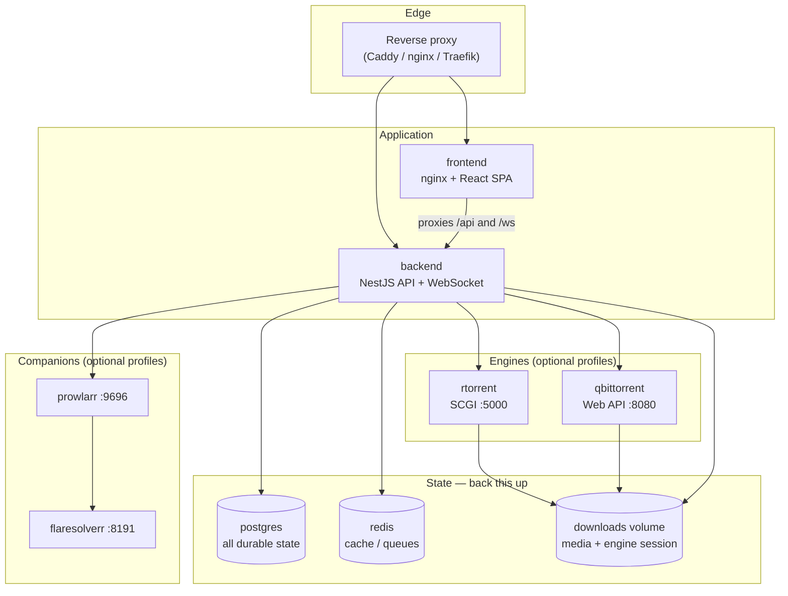
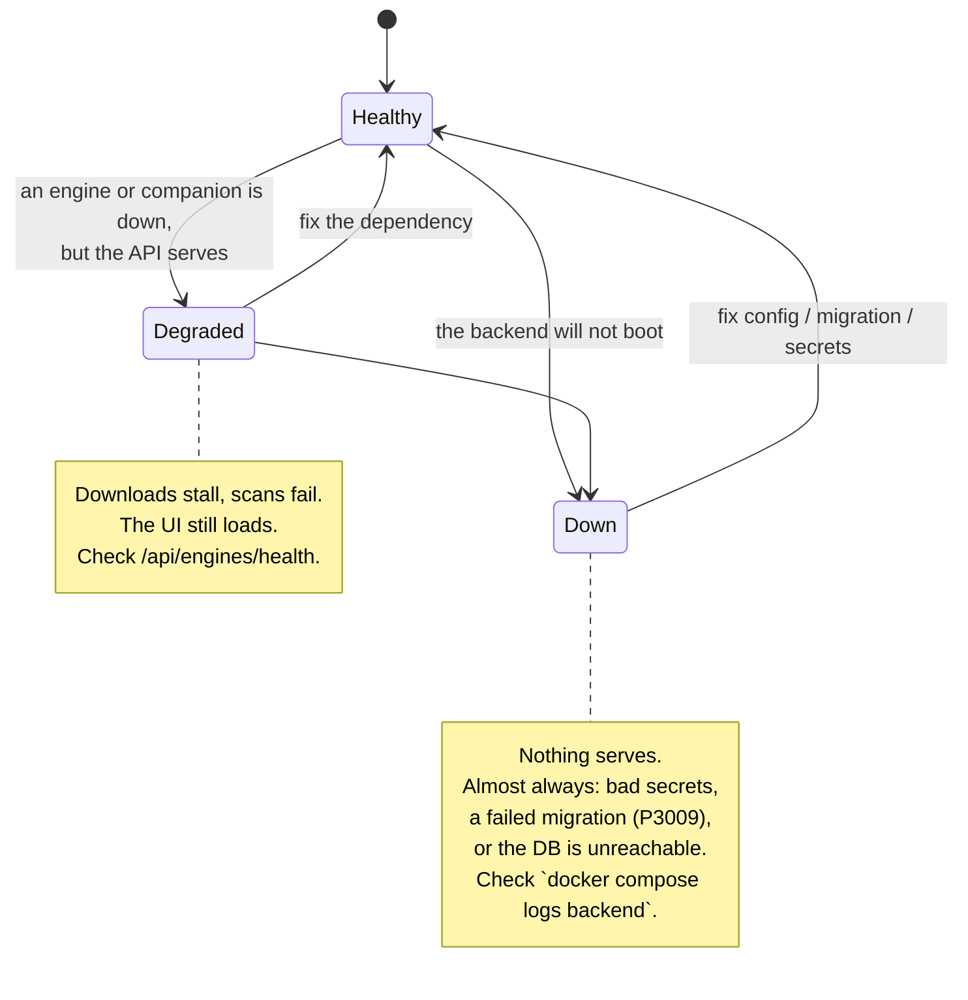

# Operate UltraTorrent in Production

Everything in this section assumes UltraTorrent is already installed and you now
have to **keep it running**. Installation is a one-off; operation is forever.

## Purpose

Getting UltraTorrent up is the easy part — [Install](/install/docker-compose)
covers that in a handful of commands. The hard part is the next eighteen months:
the database grows to millions of rows, the engine accumulates thousands of
torrents, an upgrade half-applies a migration, an indexer starts refusing you,
and a library scan quietly wedges at 74%.

This section is the **operator's manual** for that phase. Unusually for
documentation, most of it is not theoretical: the
[Troubleshooting](/operate/troubleshooting) playbook is built almost entirely
from **real incidents that were diagnosed on live UltraTorrent hosts**, with the
actual numbers, the actual log lines, and the commands that were used to find
the cause. Where something is a plausible failure that has *not* actually been
observed, it is marked as such.

## When to use this section

| Situation | Start here |
|-----------|------------|
| Something is broken **right now** | [Troubleshooting](/operate/troubleshooting) |
| You are about to expose it to the internet | [Security](/operate/security) |
| You have never taken a backup | [Backup & Restore](/operate/backup) |
| It works, but it is *slow* | [Performance](/operate/performance) |
| You want a routine so nothing rots | [Maintenance](/operate/maintenance) |
| You want known-good settings for your size of deployment | [Configuration Profiles](/operate/configuration-profiles) |

## Prerequisites

- A running UltraTorrent stack (see [Docker Compose](/install/docker-compose)).
- Shell access to the Docker host, and the ability to run `docker compose`.
- The `.env` file used to bring the stack up.
- An account with `system.view` (for the health endpoint) and ideally
  `SUPER_ADMIN` for the recovery procedures. See [Permissions](/reference/permissions).

:::tip Watch this tutorial
_Video coming soon._
:::

## Concepts

### The moving parts you are operating

UltraTorrent is not one process. Knowing which box owns a symptom is most of the
diagnosis, so keep this map in your head:



Three facts about this diagram drive most operational decisions:

1. **Postgres is the only thing that is truly irreplaceable.** Redis is a cache
   and a queue — losing it costs you nothing durable. The engines can be
   rebuilt. Postgres holds your users, libraries, rules, watchlists and audit
   trail. Back it up. See [Backup & Restore](/operate/backup).
2. **The backend is not published to the host by default.** In the shipped
   `docker-compose.yml` the backend only exposes port `4000` on the internal
   network; the browser reaches it through the frontend's nginx, which proxies
   `/api/` and `/ws/`. If you are debugging "the API is unreachable", check
   whether you are even *supposed* to be able to reach it directly.
3. **Engines and companions are optional Compose profiles.** They are off unless
   you asked for them. A great many "the engine isn't working" reports are
   simply a stack brought up without `--profile rtorrent`.

### Health endpoints

UltraTorrent exposes a small, deliberate set of health surfaces. Learn these —
they answer "is it up?" far faster than reading logs.

| Endpoint | Auth | What it tells you |
|----------|------|-------------------|
| `GET /api/system/live` | none | The process is alive. This is what the backend container's own Docker healthcheck probes. |
| `GET /api/system/ready` | none | The process is alive **and** its dependencies (DB) are usable. |
| `GET /api/system/version` | none | Version, and the baked-in git commit — invaluable when you are asking "did my deploy actually land?" |
| `GET /api/system/health` | `system.view` | The detailed, authenticated health report. |
| `GET /api/engines/health` | authenticated | Per-engine reachability. `online: false` here is the single most useful signal for a dead engine. |

A fast, dependency-free liveness check from the host:

```bash
docker compose exec backend wget -qO- http://127.0.0.1:4000/api/system/live
docker compose exec backend wget -qO- http://127.0.0.1:4000/api/system/version
```

### The three states a stack can be in



**Down** and **Degraded** have completely different playbooks, and telling them
apart takes one command:

```bash
docker compose ps
```

If `backend` is restarting or exited, you are **Down** — go to
[Troubleshooting → Startup and boot](/operate/troubleshooting#startup-and-boot).
If `backend` is up but downloads aren't moving, you are **Degraded** — go to
[Troubleshooting → Engines](/operate/troubleshooting#engines-and-rtorrent).

## Steps: the first hour on a new deployment

Do these once, immediately after installing. Each takes minutes and each has
prevented a real outage.

1. **Verify the secrets are real.** In production the backend *refuses to boot*
   with weak secrets, so if it started you are probably fine — but confirm
   `JWT_ACCESS_SECRET` and `ENCRYPTION_KEY` are distinct, 32+ characters, and
   not `dev-*` or `change-me`. See [Security](/operate/security#secrets).
2. **Change the seeded admin password** and enrol 2FA. See
   [Security](/operate/security#two-factor-authentication).
3. **Take a backup, and then restore it somewhere.** An untested backup is a
   rumour. See [Backup & Restore](/operate/backup#restore-drill).
4. **Pick a configuration profile** that matches your size and apply it. See
   [Configuration Profiles](/operate/configuration-profiles).
5. **Decide your engine now, not at 800 torrents.** If your library will be
   large, start on qBittorrent — the bundled rTorrent 0.9.8 has an unfixable
   upstream crash bug that scales with torrent count. See
   [Performance → rTorrent at scale](/operate/performance#rtorrent-at-scale).
6. **Write down where your `.env` lives.** It is not in the database and it is
   not in your Postgres dump. Losing it is losing your `ENCRYPTION_KEY`, which
   is losing every stored API key and TOTP secret.

## Examples

### A 30-second "is everything fine?" check

```bash
# 1. Are all containers up and healthy?
docker compose ps

# 2. Is the API alive?
docker compose exec backend wget -qO- http://127.0.0.1:4000/api/system/live

# 3. Anything screaming in the last 5 minutes?
docker compose logs --since 5m --tail 50 backend | grep -iE "error|fatal|refus"

# 4. Is the engine reachable? (rTorrent restart-looping is visible here)
docker compose ps rtorrent qbittorrent
```

### Watching an upgrade land

The version endpoint bakes in the git commit, so you can prove the new image is
actually running rather than assuming it:

```bash
docker compose exec backend wget -qO- http://127.0.0.1:4000/api/system/version
```

If the commit is unchanged after a rebuild, your image did not rebuild. See
[Upgrading](/install/upgrading).

## Troubleshooting

This page is the map; the territory is
[**Troubleshooting**](/operate/troubleshooting), which is organised by symptom
and gives you, for each real failure, the diagnosis commands, the root cause,
the fix, and how to verify the fix worked.

## Tips

- **Logs are cheap; guessing is expensive.** `docker compose logs -f backend` is
  the first command in almost every playbook on this site.
- **Never `docker compose down -v`** unless you intend to destroy the database.
  The `-v` removes volumes. This is the single most destructive command in the
  entire documentation.
- **Restarts are not free.** Job bodies run in-process, so a restart interrupts
  running scans and imports. They are reconciled at boot rather than resumed —
  see [Troubleshooting → Scans and jobs](/operate/troubleshooting#scans-and-jobs).
- **Keep the `.env` in a password manager or secret store**, not only on the
  host you are about to lose.

## FAQ

**Do I need to expose the backend port?**
No. In the default stack the frontend proxies `/api/` and `/ws/` to the backend
over the internal network. Only publish `4000` if you are integrating an
external client directly with the [API](/reference/api).

**Is Redis critical? Do I need to back it up?**
No. Redis is a cache and job broker. Losing it loses in-flight cached values, not
durable state. Do not include it in your backup plan.

**Can I run without any engine?**
Yes — the app boots and the UI works, but nothing will download. The engine is a
separate service you register under **Infrastructure → Engines**. See
[Engines](/modules/engines).

**How do I know which version I am running?**
`GET /api/system/version`, or the version badge in the UI. It reports the version
*and* the git commit that was baked into the image.

## Checklist

- [ ] `docker compose ps` shows every expected service healthy
- [ ] `/api/system/live` returns successfully
- [ ] `/api/engines/health` reports `online: true` for your engine
- [ ] Seeded admin password changed; 2FA enrolled on admin accounts
- [ ] `.env` is backed up **off** the host (it holds `ENCRYPTION_KEY`)
- [ ] A Postgres dump exists, and you have restored it at least once
- [ ] A configuration profile has been chosen and applied
- [ ] You know whether your engine will scale to your library size

## See also

- [Troubleshooting](/operate/troubleshooting) — the symptom-first playbook
- [Security](/operate/security) — hardening, secrets, RBAC, exposure
- [Backup & Restore](/operate/backup) — what to back up and the restore drill
- [Performance](/operate/performance) — tuning and the IMDb catalogue
- [Maintenance](/operate/maintenance) — the routine that prevents incidents
- [Configuration Profiles](/operate/configuration-profiles) — known-good settings
- [Upgrading](/install/upgrading) · [Reverse proxy](/install/reverse-proxy) · [TLS](/install/tls)
- [Environment reference](/reference/environment)
