# Routine Maintenance

Most UltraTorrent incidents are **slow-burning**: a disk that fills, a torrent
count that creeps past rTorrent's crash ceiling, an index that never got rebuilt,
a backup that has silently been failing for three months. None of them announce
themselves. All of them are caught by a routine that takes minutes.

## Purpose

To catch problems while they are still cheap.

## When to use this

Set a recurring reminder. The daily check is 60 seconds; the monthly one is half
an hour.

## Prerequisites

- Shell access to the host.
- A working [backup](/operate/backup).

:::tip Watch this tutorial
_Video coming soon._
:::

## The routine at a glance

```mermaid
flowchart LR
    subgraph D["DAILY — 1 min"]
        D1["Containers healthy?"]
        D2["Errors in the log?"]
        D3["Downloads moving?"]
    end
    subgraph W["WEEKLY — 10 min"]
        W1["Disk space"]
        W2["Engine RestartCount"]
        W3["Stuck jobs"]
        W4["Failed downloads"]
        W5["Backup actually ran?"]
    end
    subgraph M["MONTHLY — 30 min"]
        M1["Upgrade"]
        M2["Audit log review"]
        M3["DB housekeeping"]
        M4["RESTORE DRILL"]
        M5["Prune dead torrents"]
    end
    D --> W --> M

    style D fill:#2e7d32,color:#fff
    style W fill:#f9a825,color:#000
    style M fill:#1565c0,color:#fff
```



## Daily (60 seconds)

A single command tells you most of what you need:

```bash
cd /path/to/ultratorrent

# 1. Is everything up and healthy?
docker compose ps

# 2. Anything screaming?
docker compose logs --since 24h backend | grep -iE "error|fatal|refused" | tail -20

# 3. Is the engine online?
docker compose exec backend wget -qO- http://127.0.0.1:4000/api/system/live
```

**What you are looking for:**

| Red flag | Meaning | Go to |
|----------|---------|-------|
| A container shows `Restarting` | It is crash-looping | [Startup and boot](/operate/troubleshooting#startup-and-boot) |
| A container shows `unhealthy` | The healthcheck is failing (e.g. rTorrent's SCGI port is not listening) | [Engines](/operate/troubleshooting#engines-and-rtorrent) |
| `blocked internal address` | The SSRF guard is blocking your indexer | [SSRF](/operate/troubleshooting#auto-downloads-silently-do-nothing--resolves-to-a-blocked-internal-address) |
| `internal_error: priority_queue_insert` | rTorrent's crash bug | [rTorrent](/operate/troubleshooting#rtorrent-restarts-constantly--internal_error-priority_queue_insert) |
| Downloads at 0 B/s across the board | Possibly dead torrents holding every queue slot | [Queue](/operate/troubleshooting#dead-torrents-block-every-healthy-one-nothing-downloads-at-all) |

:::tip A container can be crash-looping and still look "Up"
`restart: unless-stopped` means Docker keeps bringing it back, so `docker compose
ps` can look healthy while the process dies every twenty minutes. The truth is in
`RestartCount` — see the weekly check.
:::

## Weekly (10 minutes)

### 1. Disk space

The most common cause of a stack that suddenly stops working is a full disk.
Postgres in particular fails in confusing ways when it cannot write.

```bash
df -h

# Which Docker volumes are eating it?
docker system df -v | head -30

# The downloads tree is usually the culprit
du -sh "$(docker volume inspect ultratorrent_downloads --format '{{ .Mountpoint }}')"
```

If Docker itself is bloated (old images, dead build cache):

```bash
docker system prune -f            # safe: removes stopped containers, dangling images
docker builder prune -f           # safe: removes build cache
```

:::danger Never use `docker system prune --volumes`
It deletes **unused volumes** — and it can take your database with it. Never add
`--volumes` on a host that runs UltraTorrent.
:::

### 2. Is the engine quietly crashing?

```bash
docker inspect --format '{{.Name}} restarts={{.RestartCount}}' \
  $(docker compose ps -q) 2>/dev/null
```

Write the number down. **A `RestartCount` that climbs week over week is a
crash-loop**, even if the container looks fine. For rTorrent, that is the
[0.9.8 crash bug](/operate/troubleshooting#rtorrent-restarts-constantly--internal_error-priority_queue_insert)
and it is telling you that you have outgrown the engine.

### 3. Stuck jobs

Because job bodies run **in-process**, a restart orphans them. Boot-time
reconciliation now fails those out automatically — but check that nothing is
wedged *while running*:

```bash
docker compose exec postgres psql -U ultratorrent -d ultratorrent -c "
SELECT type, status, progress, \"createdAt\"
FROM media_processing_jobs
WHERE status IN ('queued','running')
ORDER BY \"createdAt\";"
```

A job that has been `running` at **0%** for hours is orphaned. See
[Jobs stuck running](/operate/troubleshooting#jobs-are-stuck-running-forever).

### 4. Failed downloads

Check the audit trail for `download.failed`. But know the false positive:

:::note The `never registered within 6s` false alarm
On older builds, **magnets** were marked failed if they did not register in ~6
seconds — while downloading perfectly. In one real case, **256 of 257 "failures"
had actually loaded**, at a median of ~53 seconds. If you see a flood of these,
you need [the fix](/operate/troubleshooting#a-magnet-is-marked-failed-but-actually-downloads-fine), not an investigation.
:::

### 5. Did the backup actually run?

```bash
ls -lh /mnt/backup/ultratorrent-*.dump | tail -5
```

Check the **date** and the **size**. A 0-byte dump is a failed backup that exited 0.

### 6. Prune dead torrents

Torrents with **zero seeders** never finish, and — critically — **a 0-seeder magnet
still occupies an active-download slot the whole time it tries**. Left alone, they
head-of-line block your entire queue. Remove them, or
[enable the parking queue](/operate/performance#the-fixes).

## Monthly (30 minutes)

### 1. Upgrade

See [Upgrading](/install/upgrading) for the full procedure. The short form:

```bash
# 1. BACK UP FIRST. Always.
docker compose exec -T postgres pg_dump -U ultratorrent -d ultratorrent -Fc \
  > "pre-upgrade-$(date +%F).dump"
cp .env "pre-upgrade-env-$(date +%F)"

# 2. Pull and rebuild.
git pull
docker compose up -d --build

# 3. Watch the migration land. This is where P3009 appears if it is going to.
docker compose logs -f backend

# 4. PROVE the new code is running (not a cached image):
docker compose exec backend wget -qO- http://127.0.0.1:4000/api/system/version
```

That last step matters more than it looks. The version endpoint reports the
**git commit baked into the image**. If the commit is unchanged after a rebuild,
**your image did not rebuild** and you are still running the old code while
believing otherwise.

| Upgrade risk | Watch for |
|--------------|-----------|
| A migration fails mid-flight | `P3009` → [resolve it](/operate/troubleshooting#the-backend-restart-loops-after-an-upgrade--prisma-p3009) |
| Long index builds | Now built at runtime in the background — the app stays up but is slow until they finish |
| In-flight jobs | Killed by the restart; reconciled (failed out) at boot. **Re-run any scan/import that was running** |
| New required env var | The backend refuses to boot. Read the log; check [Environment](/reference/environment) |

### 2. Review the audit log

The audit trail records the actor, action, object, result, IP and user agent for
every security-relevant and destructive action — and now **names the media** a row
targeted rather than showing an opaque id.

Look for:

- **Failed logins** (`auth.login` with `result: failure`) — recorded *with the
  attempted username*. A cluster is meaningful. Note that a **pending-2FA challenge
  is deliberately not counted as a failure**, so what you see is real.
- **`torrents.delete_data`** — someone deleted data from disk.
- **`files.delete` / `files.cleanup`** — file-manager destruction.
- **Role changes** — who granted what.
- **Settings changes** — especially `settings.update_root_path`.

Access it under **Audit** in the UI (needs `audit.view`), or `GET /api/audit`.

See [Audit](/modules/audit).

### 3. Database housekeeping

```bash
# Refresh planner statistics — a stale plan is a slow plan.
docker compose exec postgres psql -U ultratorrent -d ultratorrent -c "ANALYZE;"

# Check for bloat / dead tuples
docker compose exec postgres psql -U ultratorrent -d ultratorrent -c "
SELECT relname, n_live_tup, n_dead_tup,
       pg_size_pretty(pg_total_relation_size(relid)) AS size
FROM pg_stat_user_tables
ORDER BY n_dead_tup DESC
LIMIT 10;"
```

Autovacuum normally handles the rest. If a table has a very high dead-tuple count
and autovacuum is clearly not keeping up:

```bash
docker compose exec postgres psql -U ultratorrent -d ultratorrent \
  -c "VACUUM (ANALYZE, VERBOSE) media_items;"
```

**And check your trigram indexes are still valid** — an interrupted rebuild leaves
an INVALID index that the planner silently ignores forever:

```sql
SELECT c.relname, i.indisvalid
FROM pg_class c JOIN pg_index i ON i.indexrelid = c.oid
WHERE c.relname LIKE '%trgm%';
```

All must be `true`. See
[Performance](/operate/performance#verify-your-indexes-are-present-and-valid).

### 4. Run a restore drill

**This is the item people skip, and it is the one that matters.** A backup you have
never restored is a rumour.

Follow [the drill](/operate/backup#restore-drill). The two checks that actually
prove your backup is sound:

- **2FA works** on a restored account → your `ENCRYPTION_KEY` matched the dump.
- **An indexer test passes** → the encrypted API key decrypted.

If either fails, your `.env` and your dump are mismatched, and you have just
discovered — cheaply — that your backup was incomplete.

### 5. Review indexer health

- Does **every** indexer have a `minSeeders` set? An indexer without one will hand
  you 0-seeder corpses that clog the queue.
- Is any indexer failing every request? Per-indexer failures are **isolated** — a
  broken indexer does not fail the whole search, so it can rot unnoticed for months.
- If one returns HTTP 429 on everything, read
  [the 429 entry](/operate/troubleshooting#an-indexer-always-returns-http-429-and-flaresolverr-cannot-fix-it)
  before you waste an afternoon tuning rate limits.

## Quarterly / annually

- **Rotate the JWT secrets.** Cheap — everyone is logged out, nothing else happens.
  See [Rotating secrets](/operate/security#rotating-the-jwt-secrets-safe-routine).
- **Review users and roles.** Remove people who have left. Remember `POWER_USER`
  includes **all** `files.*`, including delete.
- **Re-check your exposure.** Are engine/companion ports still unpublished? Run the
  [security audit snippet](/operate/security#audit-the-security-posture-of-a-running-stack).
- **Re-evaluate your engine.** If your torrent count has grown into the hundreds,
  you are on borrowed time with rTorrent.

:::danger Do NOT rotate `ENCRYPTION_KEY` as routine maintenance
It is **destructive** — it invalidates every TOTP secret, indexer API key, Prowlarr
key and engine password. Rotate it only in response to a leak, and follow
[the procedure](/operate/security#rotating-encryption_key-destructive--plan-it).
:::

## Examples

### A one-shot weekly health script

```bash
#!/usr/bin/env bash
# weekly-check.sh — run from the compose directory
set -euo pipefail
cd "$(dirname "$0")"

echo "=== Containers ==="
docker compose ps

echo -e "\n=== Restart counts (a climbing number = a crash loop) ==="
docker inspect --format '{{.Name}} restarts={{.RestartCount}}' $(docker compose ps -q)

echo -e "\n=== Disk ==="
df -h / | tail -1

echo -e "\n=== Errors, last 7 days ==="
docker compose logs --since 168h backend 2>/dev/null \
  | grep -icE "error|fatal" || echo 0

echo -e "\n=== Stuck jobs ==="
docker compose exec -T postgres psql -U ultratorrent -d ultratorrent -tAc \
  "SELECT count(*) FROM media_processing_jobs WHERE status IN ('queued','running');"

echo -e "\n=== Trigram indexes valid? (all must be t) ==="
docker compose exec -T postgres psql -U ultratorrent -d ultratorrent -tAc \
  "SELECT c.relname || '=' || i.indisvalid FROM pg_class c
   JOIN pg_index i ON i.indexrelid = c.oid WHERE c.relname LIKE '%trgm%';"

echo -e "\n=== Latest backup ==="
ls -lht /mnt/backup/ultratorrent-*.dump 2>/dev/null | head -1 || echo "NO BACKUP FOUND"
```


:::note Screenshot needed
`system-maintenance.png` — the System page showing version, health and jobs.
:::

## Troubleshooting

If the routine surfaces something, the fix is almost certainly in
[Troubleshooting](/operate/troubleshooting). Fast links:

- [Backend won't boot](/operate/troubleshooting#startup-and-boot)
- [rTorrent restarting](/operate/troubleshooting#rtorrent-restarts-constantly--internal_error-priority_queue_insert)
- [Nothing downloads](/operate/troubleshooting#dead-torrents-block-every-healthy-one-nothing-downloads-at-all)
- [A scan never finishes](/operate/troubleshooting#a-library-scan-freezes-at-a-percentage-and-never-completes)
- [Jobs stuck running](/operate/troubleshooting#jobs-are-stuck-running-forever)

## Tips

- **Automate the daily check into a notification.** UltraTorrent's own
  [Notification Center](/modules/notification-center) can tell you when things fail
  — use it rather than relying on yourself to look.
- **Write down `RestartCount` each week.** The absolute number is meaningless; the
  **trend** is the whole signal.
- **Upgrade regularly, in small steps.** Most of the incidents in this
  documentation were *fixed* in a release. Staying current is the cheapest form of
  maintenance there is.
- **Re-run interrupted scans after every upgrade.** The restart killed them.

## FAQ

**How often should I upgrade?**
Monthly is a good cadence. Many of the failure modes documented across this site
are fixed in later builds — running old code means keeping old bugs.

**Do I need to run `VACUUM` manually?**
Usually not — autovacuum handles it. Run `ANALYZE` after a large import so the
planner has fresh statistics.

**Is it safe to restart the backend as routine maintenance?**
It is safe, but it **interrupts in-flight jobs**. They are reconciled (failed out)
at boot, not resumed. Restart when nothing is scanning.

**Why is my `RestartCount` high but nothing seems wrong?**
Because `restart: unless-stopped` is hiding a crash loop from you. If it is
rTorrent, that is the 0.9.8 crash bug and it is load-driven — you have outgrown the
engine.

**Should I prune Docker images?**
Yes — `docker system prune -f` and `docker builder prune -f` are safe. **Never**
add `--volumes`.

## Checklist

**Daily**
- [ ] `docker compose ps` — all healthy
- [ ] No new errors in the backend log
- [ ] Downloads are moving

**Weekly**
- [ ] Disk space is fine
- [ ] `RestartCount` is not climbing
- [ ] No jobs stuck `running`
- [ ] No unexplained failed downloads
- [ ] The backup actually ran (check date **and** size)
- [ ] Dead / 0-seeder torrents pruned

**Monthly**
- [ ] Upgraded (with a backup taken first)
- [ ] `/api/system/version` confirms the **new commit** is running
- [ ] Audit log reviewed (failed logins, deletions, role changes)
- [ ] `ANALYZE` run; trigram indexes still **valid**
- [ ] **Restore drill run — 2FA and an indexer test both passed**
- [ ] Every indexer has a `minSeeders`

**Quarterly**
- [ ] JWT secrets rotated
- [ ] Users and roles reviewed
- [ ] Exposure re-checked (no published engine ports)
- [ ] Engine still appropriate for your torrent count

## See also

- [Upgrading](/install/upgrading)
- [Backup & Restore](/operate/backup) — especially the restore drill
- [Troubleshooting](/operate/troubleshooting)
- [Performance](/operate/performance)
- [Security](/operate/security)
- [Configuration Profiles](/operate/configuration-profiles)
- [Audit](/modules/audit) · [Notification Center](/modules/notification-center) · [System](/modules/system)
