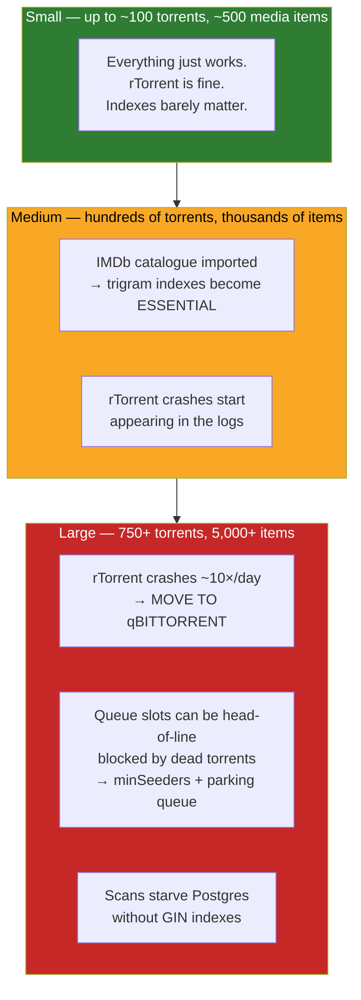

# Performance & Tuning

UltraTorrent's performance story is dominated by **two hard walls** that both
appear suddenly, at scale, after everything worked fine in testing:

1. **The IMDb catalogue** — 8.9 million rows, and a query pattern that cannot use
   a normal index.
2. **rTorrent 0.9.8** — an upstream crash bug whose frequency scales with your
   torrent count.

Everything else is ordinary tuning. Those two are not; both have caused real
outages, and both are documented here with the actual measurements.

## Purpose

To keep UltraTorrent fast as your library grows from tens to thousands of items,
and to know which wall you are about to hit.

## When to use this

- A library scan is slow, or **never finishes**.
- Searches take seconds.
- The engine keeps restarting.
- Downloads sit queued and never start.
- You are *planning* a large library and want to avoid all of the above.

## Prerequisites

- Shell access, and `psql` via `docker compose exec postgres`.
- Familiarity with [Troubleshooting](/operate/troubleshooting) — the two worst
  performance failures present as *outages*, and are documented there.

:::tip Watch this tutorial
_Video coming soon._
:::

## Concepts

### The scaling map



## The IMDb catalogue

This is the single most important performance topic in UltraTorrent, because the
failure mode is not "slow" — it is **a scan that hangs forever**.

### The problem, precisely

Prisma renders `mode: 'insensitive'` as SQL **`ILIKE`**. And:

> **`ILIKE` cannot use a btree index.**

On a small table nobody notices. On the **8.9-million-row** IMDb catalogue, every
case-insensitive title lookup became a **full table scan**. Measured on a live
production host:

| | Value |
|---|---|
| Catalogue size | **8,900,000 rows** |
| Query | `primaryTitle ILIKE ...` + `ORDER BY startYear DESC` |
| Plan | Planner walked a btree index **backward**, ILIKE-filtering the whole table |
| **Time per lookup** | **47.8 seconds** |

And these lookups fire **per media item** — during show-status warm-up,
identification, and missing-episode self-heal. So a library scan issued thousands
of them, which **saturated Postgres and starved every other query, including the
scan's own**. The scan sat at 8%, then 41%, then 74%, and never completed.

### The fix: pg_trgm GIN indexes

Trigram indexes make `LIKE`/`ILIKE` **index-backed**.

```sql
CREATE EXTENSION IF NOT EXISTS pg_trgm;

CREATE INDEX CONCURRENTLY IF NOT EXISTS imdb_titles_primary_title_trgm
  ON imdb_titles USING gin ("primaryTitle" gin_trgm_ops);
CREATE INDEX CONCURRENTLY IF NOT EXISTS imdb_titles_original_title_trgm
  ON imdb_titles USING gin ("originalTitle" gin_trgm_ops);
CREATE INDEX CONCURRENTLY IF NOT EXISTS imdb_akas_title_trgm
  ON imdb_akas USING gin (title gin_trgm_ops);
```

The result, same query, same 8.9M rows:

| | Before | After |
|---|--------|-------|
| Plan | Backward index scan + filter | **Bitmap Index Scan** |
| Time | **47.8 s** | **180 ms** |
| **Speedup** | — | **~265×** |

**No application code changed.** The query was correct all along; the index was
missing.

### You probably don't need to do this by hand

Current builds handle it. The migration does only the cheap
`CREATE EXTENSION IF NOT EXISTS pg_trgm`; a dedicated service then builds the
three GIN indexes **at runtime, in the background**, with
`CREATE INDEX CONCURRENTLY IF NOT EXISTS`:

- A **fresh install** builds them instantly (the catalogue is empty).
- An **existing install** back-fills them with **zero downtime**.
- It is **idempotent** — a no-op once they are valid.
- It **detects an index left INVALID by an interrupted `CONCURRENTLY` build,
  drops it, and rebuilds it.**

:::danger Never put a large `CREATE INDEX` inside a migration
This is not a style preference — it caused a **real outage on two hosts at once**.
`CREATE INDEX` on the full catalogue takes minutes and holds a lock. When one was
killed mid-flight, Prisma marked the migration **failed (P3009)** and the backend
**refused to boot at all**, restart-looping until the migration row was resolved by
hand.

And `CREATE INDEX CONCURRENTLY` **cannot run inside a transaction**, so it can
*never* live in a Prisma migration regardless. Build big indexes at runtime. See
[P3009](/operate/troubleshooting#the-backend-restart-loops-after-an-upgrade--prisma-p3009).
:::

### Verify your indexes are present *and valid*

An INVALID index is worse than no index: the planner ignores it, but its **name
exists**, so `IF NOT EXISTS` skips the rebuild forever.

```sql
SELECT c.relname AS index_name, i.indisvalid, i.indisready
FROM pg_class c
JOIN pg_index i ON i.indexrelid = c.oid
WHERE c.relname LIKE '%trgm%';
```

All three must show `indisvalid = true`. If one is `false`:

```sql
DROP INDEX CONCURRENTLY IF EXISTS <the_invalid_index>;
-- then restart the backend and let the service rebuild it
```

Then prove the planner uses it:

```sql
EXPLAIN ANALYZE
SELECT * FROM imdb_titles WHERE "primaryTitle" ILIKE 'The Expanse';
-- Want: Bitmap Index Scan. Do NOT want: Seq Scan.
```

### The second IMDb lesson: don't ask SQL to fold accents

A related discovery. Matching a title **case-, punctuation- and
accent-insensitively** in SQL means `ILIKE`, which — even with trigrams — meant
Postgres was doing a **parallel sequential scan of all 8.9M titles** for series
resolution, measured at **~8 seconds per show**.

The fix was architectural rather than an index: load the catalogue's **TV slice
only** (~325,000 `tvSeries`/`tvMiniSeries` rows) into memory **once**, and index it
by an accent/punctuation-folded key.

| | Time |
|---|---|
| Load the TV slice once | **7.2 s** |
| Then, per lookup | **~7 ms** |

With a 60-second TTL, a whole sweep pays the load **once**. The lesson generalises:
**when you need fuzzy matching over a bounded subset, a hash lookup in memory beats
any index**.

## rTorrent at scale

### The crash ceiling

The bundled engine is rTorrent `0.9.8` (the maintained jesec `v0.9.8-r16` static
binary — already the newest in that lineage). It carries an unfixed **upstream
bug**:

```
internal_error: priority_queue_insert(...) called on an invalid item
```

fired during tracker-announce scheduling. There is **no fix in the 0.9.8 lineage**
([rakshasa/rtorrent#939](https://github.com/rakshasa/rtorrent/issues/939)).

The defining property is that it is **load-driven**. Two live hosts, identical build:

| Host | Active torrents | Crashes |
|------|-----------------|---------|
| A | **752** | **44** in 4 days (~10/day) |
| B | **7** | **0** |

Each crash exits the process cleanly, Docker restarts it, and the saved session
reloads — **no torrents are lost** — but transfers pause and everything
re-announces.

:::warning You cannot tune your way out of this
It is an upstream bug, not a configuration problem. The mitigations below reduce
the blast radius; only changing engine or reducing torrent count changes the
outcome.
:::

### What to do about it

**In order of impact:**

1. **Move to qBittorrent for a large library.** UltraTorrent's engine layer is
   multi-engine by design, and qBittorrent handles **thousands of torrents
   comfortably**. This is the durable answer.

   ```bash
   docker compose --profile qbittorrent up -d
   docker compose logs qbittorrent | grep -i password   # first-run temp password
   ```

   Then register it under **Infrastructure → Engines** (kind qBittorrent, base URL
   `http://qbittorrent:8080`). If the test fails with 401, disable **Enable Host
   header validation** in qBittorrent's **Options → Web UI** — the backend connects
   by the service name.

2. **Keep the active torrent count modest.** Remove or stop completed seeds. The
   crash rate falls with the count.

3. **Already done for you:** UDP tracker announces are disabled
   (`trackers.use_udp.set = no`), removing a *secondary* crash variant. DHT is off
   by default (`RT_DHT=off`) for the same reason. **Neither fixes the dominant
   crash.** HTTP/HTTPS trackers and PEX still find peers.

4. **A healthcheck surfaces a wedged engine.** The Compose healthcheck checks the
   SCGI port is listening, so the rarer "process alive but SCGI wedged" state shows
   as `unhealthy`. (A *crash* already exits the process, which Docker recovers on
   its own.)

Monitor it:

```bash
docker inspect --format '{{.RestartCount}}' $(docker compose ps -q rtorrent)
```

## Download queue throughput

### Dead torrents can consume every queue slot

A subtle throughput killer, and a real one: an engine holding **1,137 torrents and
moving 0 bytes**. Not slow — *zero*. The network was fine (DHT healthy, 366 nodes;
trackers answering). The torrents were simply **dead — 1,114 of 1,137 had zero
seeders**.

The mechanism:

> **A 0-seeder magnet can never fetch its metadata — yet the engine counts it as an
> active download the entire time it tries.**

With `max_active_downloads: 100`, exactly **88 `metaDL` + 12 `stalledDL` = 100
slots permanently held by torrents that will never finish**. The other 1,034
torrents — including all the healthy ones — sat in `queuedDL` behind them, unable
to start.

**The root cause was upstream of the engine:** two of four indexers had **no
`minSeeders` set**, and the per-indexer seeder filter *only applies when that
column is set*. So 0-seeder releases sailed straight through.

### The fixes

1. **Set `minSeeders` on every indexer.** This is the prevention. An indexer with
   no `minSeeders` will hand you corpses. See [Indexers](/modules/indexers).

2. **Enable the parking queue.** A background service (every 5 minutes) pauses
   torrents that are `DOWNLOADING`, below `minSeeders`, with nobody connected, no
   bytes moving, and past a grace period. **A paused torrent holds no slot**, so the
   engine promotes a queued one into the freed slot — the queue drains its own dead
   weight.

   It handles the obvious trap too: a paused torrent never announces, so its seeder
   count could never refresh, and parking would be a **one-way trip**. So each tick
   it **force-starts** a batch of parked torrents, reads the outcome next tick, and
   releases any that found seeders. Persistently dead ones back off exponentially.

   It never touches a `QUEUED` torrent (costs no slot) or a `PAUSED` one (a human
   paused that deliberately).

   :::caution Ships disabled by default
   You must enable it. It is an automatic pauser, and turning it on is a deliberate
   operator decision.
   :::

3. **Raise `max_active_downloads`** only if your slots are held by *healthy*
   torrents. If they are held by corpses, raising the limit just admits more
   corpses.

## Large media libraries

| Symptom at scale | Cause | Fix |
|------------------|-------|-----|
| Scans crawl or hang | Missing trigram indexes | [pg_trgm](#the-fix-pg_trgm-gin-indexes) |
| Scans interrupted by restarts | Job bodies run **in-process** — a restart orphans them | Don't restart mid-scan. Orphans are reconciled (failed out) at boot |
| Shows show 0 missing episodes | Identification misses | [Media identification](/operate/troubleshooting#a-show-never-reports-any-missing-episodes-scans-to-000) |
| Library fragmented into one entry per episode | Items created with `title = basename(file)` and no season/episode (fixed; self-heals on re-scan) | Upgrade and re-scan |
| Dashboard activity feed is all noise | Bursty background sweeps write one audit row per item | Fixed — bursts are collapsed into a single "N events" line |

### Postgres tuning

The stock `postgres:17-alpine` defaults are conservative. If you have imported the
IMDb catalogue and have RAM to spare, these help:

```yaml
# docker-compose.override.yml
services:
  postgres:
    command:
      - postgres
      - -c
      - shared_buffers=1GB          # ~25% of RAM available to Postgres
      - -c
      - work_mem=32MB               # per sort/hash; raises GIN scan speed
      - -c
      - maintenance_work_mem=512MB  # makes index builds much faster
      - -c
      - effective_cache_size=3GB    # tells the planner how much OS cache exists
      - -c
      - random_page_cost=1.1        # you are on SSD; the default 4.0 assumes spinning rust
```

:::tip `random_page_cost` is the highest-leverage one-liner
The default of `4.0` assumes a spinning disk and biases the planner **against**
index scans. On SSD/NVMe, `1.1` makes it correctly prefer the index. This alone can
flip a bad plan to a good one.
:::

Then keep statistics fresh — the planner cannot pick a good plan from stale stats:

```sql
ANALYZE imdb_titles;
ANALYZE imdb_episodes;
ANALYZE media_items;
```

### Resource sizing

| Deployment | RAM | Notes |
|------------|-----|-------|
| Small (no IMDb catalogue) | 2 GB | Comfortable |
| Medium (IMDb imported) | 4 GB | The catalogue import and index builds want headroom |
| Large (IMDb + thousands of torrents + qBittorrent) | 8 GB+ | qBittorrent's own memory grows with torrent count |

The **IMDb dataset import** is the single most resource-hungry operation the app
performs. Give it room, and do not run it concurrently with a library scan.

:::note FlareSolverr needs shared memory
Headless Chromium crashes with Docker's default 64 MB `/dev/shm`. The shipped
Compose file sets `shm_size: "256m"` for FlareSolverr. If you run it elsewhere,
do the same.
:::

## Examples

### Find your slowest queries

```bash
docker compose exec postgres psql -U ultratorrent -d ultratorrent -c "
SELECT pid, now() - query_start AS duration, state, wait_event_type,
       left(query, 100) AS query
FROM pg_stat_activity
WHERE state <> 'idle'
ORDER BY duration DESC
LIMIT 10;"
```

Remember the reading rule from the real incident: **`state = active`, no lock
contention, and plenty of free connections means _starved, not stuck_** — one query
is so expensive it is eating the server. That points at a missing index, not at
concurrency.

### Confirm a title lookup is index-backed

```bash
docker compose exec postgres psql -U ultratorrent -d ultratorrent -c "
EXPLAIN ANALYZE SELECT * FROM imdb_titles WHERE \"primaryTitle\" ILIKE 'Silo';"
```

Want: **Bitmap Index Scan**. Do not want: **Seq Scan**.

### Check table sizes

```bash
docker compose exec postgres psql -U ultratorrent -d ultratorrent -c "
SELECT relname, n_live_tup,
       pg_size_pretty(pg_total_relation_size(relid)) AS size
FROM pg_stat_user_tables
ORDER BY pg_total_relation_size(relid) DESC
LIMIT 10;"
```

`imdb_titles` will dominate. That is expected.


:::note Screenshot needed
`performance-dashboard.png` — the System page showing resource usage and job
throughput.
:::

## Troubleshooting

| Symptom | Go to |
|---------|-------|
| A scan freezes and never completes | [Troubleshooting](/operate/troubleshooting#a-library-scan-freezes-at-a-percentage-and-never-completes) |
| Nothing downloads; everything is queued | [Troubleshooting](/operate/troubleshooting#dead-torrents-block-every-healthy-one-nothing-downloads-at-all) |
| rTorrent restarts constantly | [Troubleshooting](/operate/troubleshooting#rtorrent-restarts-constantly--internal_error-priority_queue_insert) |
| Indexes exist but are ignored | [Troubleshooting](/operate/troubleshooting#queries-are-slow-again-and-an-index-exists-but-is-ignored) |
| Jobs stuck at 0% forever | [Troubleshooting](/operate/troubleshooting#jobs-are-stuck-running-forever) |

## Tips

- **Import the IMDb catalogue once, deliberately**, and let the trigram indexes
  finish building before you kick off a big library scan.
- **`EXPLAIN ANALYZE` is not optional** when a query is slow. Guessing at indexes is
  how you end up with an INVALID index nobody uses.
- **Load-driven bugs are invisible in testing.** rTorrent at 7 torrents is flawless
  and at 750 crashes ten times a day. Test at your real scale, or plan for it.
- **Don't restart mid-scan.** Jobs run in-process; a restart orphans them.
- **A queue full of dead torrents looks exactly like a network problem.** Check
  seeders before you blame your ISP.

## FAQ

**Do I have to import the IMDb catalogue?**
No — it is **optional and off by default**. Without it you lose local title
resolution and missing-episode detection quality. With it, you gain 8.9M rows and
must have the trigram indexes.

**How long do the trigram indexes take to build?**
Minutes on a fully-imported catalogue. They build `CONCURRENTLY` in the background,
so the app stays up — but lookups are slow until they are done.

**Why is qBittorrent recommended over the bundled rTorrent?**
Because rTorrent 0.9.8 has an unfixable, **load-driven** crash bug. At a handful of
torrents it does not matter. At 750 it crashes ~10 times a day.

**Will raising `max_active_downloads` speed things up?**
Only if your slots are held by *healthy* torrents. If they are held by 0-seeder
corpses, you will just admit more corpses. Fix `minSeeders` first.

**Is Redis a bottleneck?**
Very unlikely. It is a cache and job broker; it is not where your time goes.

## Checklist

**Database**
- [ ] `pg_trgm` extension exists
- [ ] All three GIN trigram indexes exist **and `indisvalid = true`**
- [ ] `EXPLAIN` on a title lookup shows a **Bitmap Index Scan**
- [ ] `ANALYZE` has been run since the last big import
- [ ] `random_page_cost` is lowered if you are on SSD

**Engine**
- [ ] You know your active torrent count
- [ ] If it is in the hundreds, you are on qBittorrent (not rTorrent)
- [ ] `RestartCount` is not climbing

**Queue**
- [ ] **Every** indexer has a `minSeeders` set
- [ ] The parking queue is enabled (if you run a large back-catalogue)
- [ ] Active-download slots are held by torrents that are actually moving bytes

## See also

- [Troubleshooting](/operate/troubleshooting) — the incidents behind this page
- [Configuration Profiles](/operate/configuration-profiles) — sized, known-good settings
- [Maintenance](/operate/maintenance) — keeping it fast
- [Engines](/modules/engines) · [Indexers](/modules/indexers) · [Media Manager](/modules/media-manager)
- [Database schema](/reference/database-schema) · [Environment](/reference/environment)
