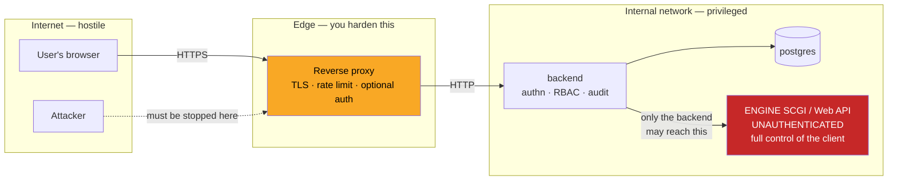
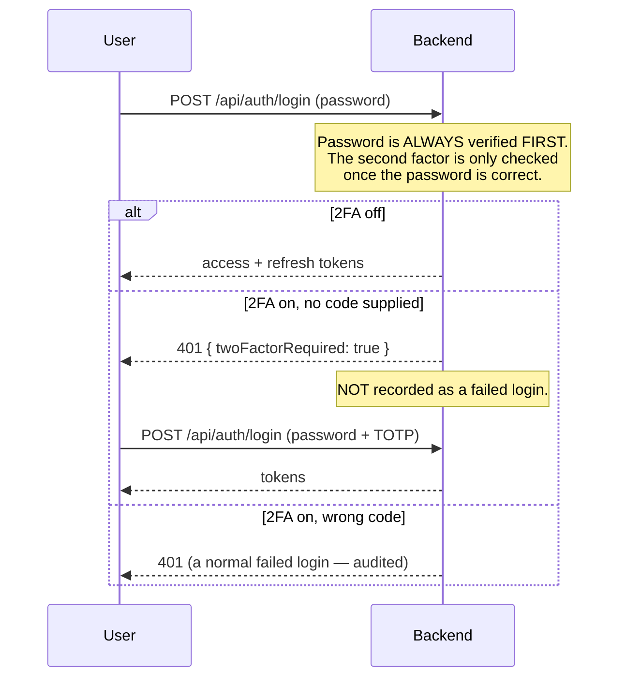
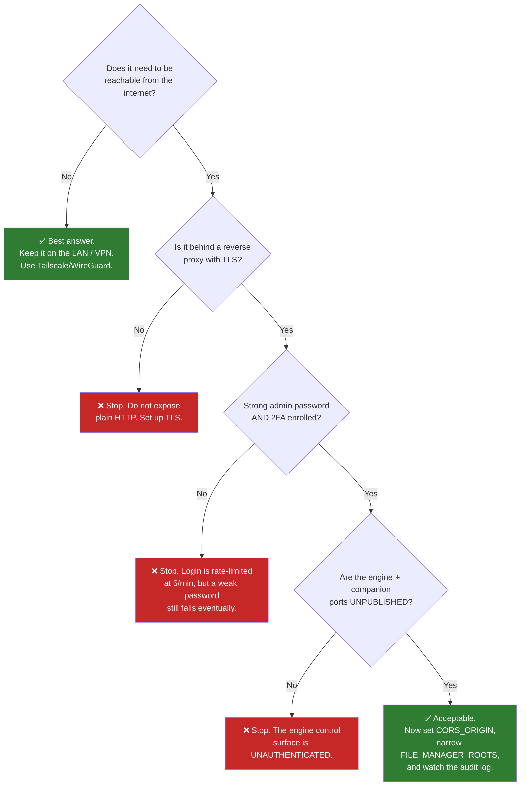

# Security & Hardening

UltraTorrent controls a service that can **move and delete files on disk**, so
security is not decorative. This page is the operator's view: what the platform
already does for you, what you must do yourself, and how to rotate a secret
without locking everyone out.

## Purpose

To take a working UltraTorrent installation and make it safe to run — including,
if you choose, safe to expose to the internet.

## When to use this

- Immediately after installing (the [first-hour checklist](/operate/#steps-the-first-hour-on-a-new-deployment)).
- Before putting it behind a public hostname.
- When onboarding users who are not you.
- When a secret has leaked and must be rotated.

## Prerequisites

- Shell access to the host and the `.env` file.
- A `SUPER_ADMIN` account.
- For public exposure: a reverse proxy and a TLS certificate. See
  [Reverse proxy](/install/reverse-proxy) and [TLS](/install/tls).

:::tip Watch this tutorial
_Video coming soon._
:::

## Concepts

### What the platform already enforces

You get a great deal for free. Knowing what is *already* covered stops you from
"hardening" things that are hard, and focuses you on what is not.

| Control | What it does |
|---------|--------------|
| **Argon2id password hashing** | Memory-hard, GPU/ASIC-resistant. Plaintext passwords are never stored or logged. Login is **timing-hardened** — an unknown username still runs a verify against a dummy hash, so response time does not reveal whether an account exists. |
| **Short-lived JWT access tokens** | Default TTL **15 minutes** (`JWT_ACCESS_TTL`). Algorithm-pinned. A token whose `type` is not `access` is rejected. |
| **Rotating refresh tokens with reuse detection** | Refresh tokens are opaque random secrets, stored **only as a SHA-256 hash**. Each refresh revokes the old token and issues a new one in the same family. **Presenting an already-revoked token burns the entire family** — the hallmark of a stolen token. |
| **Session revocation** | Logout, a password change, and deactivating a user all revoke refresh tokens **server-side**. A changed password ends every active session. |
| **Rate limiting** | `POST /api/auth/login` — **5 requests / 60 s**. `POST /api/auth/refresh` — **20 / 60 s**. The 2FA step posts to the same login endpoint, so that 5/min limit also bounds **TOTP guessing**. |
| **Production boot guard** | The backend **refuses to start** with a weak secret. See [Secrets](#secrets). |
| **Helmet + CORS** | Secure HTTP response headers (HSTS, `X-Content-Type-Options`, frame/cross-origin policies). CORS is restricted to `CORS_ORIGIN`. |
| **Input validation** | Every request body is a typed DTO validated with `class-validator`; invalid payloads are rejected with `400` **before reaching any service**. |
| **Path safety** | The file manager is confined to `FILE_MANAGER_ROOTS`. Traversal, absolute-escape, null bytes and **symlink escape** are all blocked; deleting a configured root or a system directory is always refused. |
| **SSRF guard** | Torrent-URL fetches allow only `http(s)`, block private/loopback/link-local/CGNAT/**cloud-metadata** addresses, refuse redirects, and cap the body at 20 MB. |
| **Audit logging** | Security-relevant and destructive actions are recorded with actor, action, object, result, IP and user agent. |
| **Secrets encrypted at rest** | TOTP secrets, indexer API keys, the Prowlarr key and engine passwords are **AES-256-GCM** encrypted and **redacted** (`••••••••`) in every API response. |
| **Privilege-escalation guards** | Only a `SUPER_ADMIN` may grant `SUPER_ADMIN`. **No user may edit their own roles** — `users.manage` alone cannot self-promote. |

### The trust boundary



:::danger The engine control surface is unauthenticated
The rTorrent SCGI/XML-RPC interface is **unauthenticated and gives full control of
the client** — including the ability to **execute commands** (it runs `rm` during
delete-with-data). Treat it as a privileged internal endpoint:

- **Never expose it to the network.** Bind it to `127.0.0.1` or a Unix socket, or
  keep it on the internal Docker network only (which the shipped Compose file
  does — it uses `expose`, not `ports`).
- Only the UltraTorrent backend should be able to reach it. All *user* access must
  go through the authenticated, permission-checked, audited API.

The same reasoning applies to the qBittorrent Web API: if you publish its port to
grab the first-run password, **consider unpublishing it afterwards**.
:::

## Secrets

Three secrets matter. They are **not** interchangeable and they do **not** rotate
the same way.

| Secret | Protects | Rotating it… |
|--------|----------|--------------|
| `JWT_ACCESS_SECRET` | Signs access tokens | Invalidates all access tokens — users are logged out. **Cheap.** |
| `JWT_REFRESH_SECRET` | Refresh-token machinery | Invalidates refresh tokens — users must log in again. **Cheap.** |
| `ENCRYPTION_KEY` | **AES-256-GCM encryption at rest** for TOTP secrets, indexer API keys, the Prowlarr key, engine passwords | **Destroys access to every one of those values.** **Expensive.** See below. |

Generate each with:

```bash
openssl rand -base64 48
```

### The production boot guard

When `NODE_ENV=production`, the backend **refuses to boot** if `JWT_ACCESS_SECRET`
or `ENCRYPTION_KEY` is:

- unset, or
- a known default (`dev-*`, `change-me`), or
- shorter than **32 characters**, or
- **identical to the other**.

This deliberately closes the *"forgot to set a secret → predictable signing key →
anyone can forge a `SUPER_ADMIN` token"* hole. If the backend starts in
production, these four conditions are satisfied.

Compose applies the same philosophy: it **refuses to start** without
`POSTGRES_PASSWORD` and `ADMIN_PASSWORD`. There are **no insecure defaults**
anywhere in the stack.

:::warning Use an alphanumeric `POSTGRES_PASSWORD`
`DATABASE_URL` is derived from it. A URL-special character (`@ : / ?`) needs
percent-encoding and will otherwise silently break the connection string.
:::

## Rotating secrets

### Rotating the JWT secrets (safe, routine)

Cost: everyone is logged out. That is all.

```bash
# 1. Generate new values
openssl rand -base64 48   # -> JWT_ACCESS_SECRET
openssl rand -base64 48   # -> JWT_REFRESH_SECRET

# 2. Edit .env, then recreate the backend
docker compose up -d --force-recreate backend
```

**Verify.** You are logged out; logging back in works.

Do this if a secret may have leaked, when an admin with host access leaves, or on
a routine schedule (annually is reasonable).

### Rotating `ENCRYPTION_KEY` (destructive — plan it)

:::danger Read this fully before you touch `ENCRYPTION_KEY`
`ENCRYPTION_KEY` is the AES-256-GCM key for everything encrypted at rest.
**Rotating it makes all previously-encrypted values undecryptable.** There is no
automatic re-encryption. Specifically, you will lose:

- **Every user's TOTP secret** → all 2FA users are locked out of their second
  factor and must **re-enrol**.
- **Indexer API keys** → must be re-entered.
- **The Prowlarr API key** → must be re-entered.
- **Engine passwords** (e.g. qBittorrent) → must be re-entered.
:::

The rotation procedure:

1. **Take a backup first.** See [Backup & Restore](/operate/backup).
2. **Warn your users.** Everyone with 2FA will need to re-enrol. Make sure at
   least one `SUPER_ADMIN` account **without** 2FA (or with recovery codes to
   hand) can still get in — otherwise you will lock yourself out of your own
   installation.
3. Disable 2FA on the accounts you can, *before* rotating (this is optional but
   makes recovery cleaner).
4. Set the new key and recreate:

   ```bash
   openssl rand -base64 48   # -> ENCRYPTION_KEY  (must differ from JWT_ACCESS_SECRET)
   docker compose up -d --force-recreate backend
   ```

5. **Re-enrol 2FA** for every affected user.
6. **Re-enter** every indexer API key, the Prowlarr key, and any engine passwords.

**Verify.** Log in with 2FA on a re-enrolled account; run an indexer test and a
Prowlarr connection test — both should pass.

:::tip Back up your `.env`, off the host
`ENCRYPTION_KEY` is **not in your Postgres dump**. A database backup without the
`.env` is a backup you cannot fully restore — you would recover the encrypted
blobs and no key to read them. Store `.env` in a password manager or secret store.
:::

## Two-factor authentication

UltraTorrent supports **TOTP** (RFC 6238) — compatible with Google Authenticator,
Authy, 1Password, and any standard app. 30-second step, ±1 step clock-skew
tolerance.



### Enrolment is confirmed, not blind

This is an important property: `POST /api/account/2fa/setup` generates a secret and
returns an `otpauth://` URI plus a QR code — but **2FA is not active** until the
user proves possession by submitting a valid code to `POST /api/account/2fa/enable`.
Nobody can lock themselves out by scanning a QR code and walking away.

### Recovery codes

Enabling 2FA returns **10 single-use recovery codes**, shown **once**. They are
stored **only as SHA-256 hashes**. At login, a recovery code is accepted in place
of a TOTP code and is **consumed** on use, so it cannot be replayed.

:::warning Save the recovery codes
They are shown once. If a `SUPER_ADMIN` loses both their authenticator and their
recovery codes, recovery means direct database surgery.
:::

Regenerate them at `POST /api/account/2fa/recovery` (requires a current TOTP code).

### Disabling 2FA

`POST /api/account/2fa/disable` requires the account **password** as confirmation,
and clears the secret, the flag and all recovery codes. All 2FA endpoints are
**self-service only** — a user can only manage their own 2FA.

## RBAC

Authorization is **permission-based**, not role-based-with-hardcoded-checks. Every
protected route declares the permissions it needs; a guard verifies the principal
holds **all** of them. `SUPER_ADMIN` bypasses granular checks.

There is **no licensing, edition, or feature gating** — RBAC is the *only*
access-control mechanism in the product.

### The system roles

| Role | Grant it to | Notably includes / excludes |
|------|-------------|------------------------------|
| `SUPER_ADMIN` | Yourself, and as few others as possible | **All** permissions, and bypasses granular checks. The only role that can grant `SUPER_ADMIN`. |
| `ADMINISTRATOR` | A trusted co-admin | All permissions **except `system.manage`**. |
| `POWER_USER` | A housemate who manages their own media | All torrent actions, categories/tags, RSS, automation, **all `files.*`** (including delete/bulk/cleanup), `system.view`. **No** user/role management. |
| `USER` | An ordinary household user | View/add torrents, basic state changes, categories/tags, `rss.view`, and **read-only** files. |
| `READ_ONLY` | A dashboard viewer | View only. |

### Principle of least privilege, applied

- **`POWER_USER` can delete files.** It includes every `files.*` permission,
  including `files.delete` and `files.cleanup`. If that is not what you want,
  build a custom role.
- **`torrents.delete_data` is separate from `torrents.delete`** for a reason. One
  removes the torrent; the other removes the **data on disk**. Grant them
  separately.
- **Bulk actions enforce the same permission as their dedicated route**, per
  action — so a viewer cannot smuggle a destructive operation through
  `/torrents/bulk`.
- **Deactivating a user revokes their refresh tokens**, and token refresh is
  rejected for a disabled account. Deactivation is immediate, not eventual.

See [Permissions](/reference/permissions) for the full catalogue and
[RBAC](/develop/rbac) for the model.

## Exposing UltraTorrent to the internet



**The honest recommendation: don't.** A VPN (WireGuard, Tailscale) gives you
remote access with a fraction of the attack surface. UltraTorrent is a file-moving,
file-deleting, command-executing service. There is very little upside to putting it
on the public internet.

If you must:

1. **TLS, always.** Terminate at the proxy. The bundled Caddy profile does this
   automatically:

   ```bash
   docker compose --profile proxy up -d
   ```

   Replace the `:80` site label in `deploy/Caddyfile` with your domain to get
   automatic Let's Encrypt HTTPS. See [TLS](/install/tls).

2. **Set `CORS_ORIGIN` to your real origin.** Not `*`, not `localhost`.

   ```dotenv
   CORS_ORIGIN=https://ultratorrent.example.com
   ```

3. **Do not publish the engine, Prowlarr, or FlareSolverr ports.** The shipped
   Compose file keeps rTorrent and FlareSolverr on `expose` (internal only). It
   *does* publish qBittorrent (8081) and Prowlarr (9696) for first-run
   convenience — **remove those `ports:` mappings once you are set up** if the host
   is internet-facing.

4. **Narrow `FILE_MANAGER_ROOTS`** to exactly the directories the engine writes to.
   It is the **hard, ops-controlled boundary** and is never widened at runtime.

5. **Consider proxy-level auth** (basic auth, or an identity-aware proxy) in front
   of the whole thing as a second gate.

### The two-layer file-manager boundary

Worth understanding, because it is a genuinely good design and people misconfigure it:

- **`FILE_MANAGER_ROOTS`** (environment) is the **hard outer boundary**. Set in the
  deployment environment; **never widened at runtime**. Nothing in the UI can
  escape it.
- **Default Root Path** (a setting, changed only via `PUT /api/files/root` with the
  `settings.manage_root_path` permission) can only **narrow** browsing to a subtree
  *inside* those roots. A value outside the hard roots is **ignored**.

The directory picker in the UI is a **convenience, not the security boundary** — the
server validates every submitted path on use.

Deletes are **soft by default**: items move to a `.ultratorrent-trash` directory
inside their own root and can be restored; `permanent: true` is required to delete
irreversibly. The Cleanup Wizard **never deletes automatically** — its preview is
read-only and it removes only explicitly-selected paths.

## Examples

### Audit the security posture of a running stack

```bash
# 1. Are any privileged ports published to the host?
docker compose ps --format "table {{.Service}}\t{{.Ports}}"
#    Look for: rtorrent, flaresolverr  -> should show NO host mapping.
#    qbittorrent (8081) / prowlarr (9696) -> unpublish if internet-facing.

# 2. Are the secrets real? (length check, without printing them)
awk -F= '/^(JWT_ACCESS_SECRET|JWT_REFRESH_SECRET|ENCRYPTION_KEY)=/ \
  { printf "%s: %d chars\n", $1, length($2) }' .env
#    Every one must be >= 32. ENCRYPTION_KEY must differ from JWT_ACCESS_SECRET.

# 3. Is CORS locked to a real origin?
grep CORS_ORIGIN .env

# 4. How wide is the file-manager boundary?
grep FILE_MANAGER_ROOTS .env

# 5. Is SSRF protection on for everything except what you trust?
grep SSRF_ALLOW_HOSTS .env
```

### Review who can destroy things

```sql
-- Users holding a destructive permission, via any role
SELECT u.username, r.name AS role
FROM users u
JOIN "_RoleToUser" ru ON ru."B" = u.id
JOIN roles r ON r.id = ru."A"
ORDER BY r.name, u.username;
```

Then cross-check the role against
[the permission catalogue](/reference/permissions). Remember `POWER_USER` includes
**all** `files.*`.


## Troubleshooting

| Symptom | Cause | Fix |
|---------|-------|-----|
| Backend exits with "insecure secret configuration" | The production boot guard tripped | [Troubleshooting → Secrets](/operate/troubleshooting#the-backend-exits-immediately-with-insecure-secret-configuration) |
| Everyone locked out of 2FA after a change | `ENCRYPTION_KEY` was rotated | Re-enrol 2FA. See [Rotating `ENCRYPTION_KEY`](#rotating-encryption_key-destructive--plan-it) |
| Indexer/Prowlarr keys suddenly invalid | `ENCRYPTION_KEY` was rotated | Re-enter them |
| CORS errors in the browser | `CORS_ORIGIN` does not match the browser's origin | Set it exactly |
| A user sees no live updates | They lack the view permission the WebSocket room requires | Grant `torrents.view` etc. |
| Auto-downloads blocked | The SSRF guard is doing its job | [Add the host to `SSRF_ALLOW_HOSTS`](/operate/troubleshooting#auto-downloads-silently-do-nothing--resolves-to-a-blocked-internal-address) |

## Tips

- **The audit log is your friend after an incident.** It records failed logins
  *with the attempted username*, plus every destructive action with actor and IP.
- **A pending-2FA challenge is not recorded as a failed login** — so a spike of
  genuine `auth.login` failures in the audit log is meaningful signal, not noise.
- **Rate limiting bounds TOTP guessing too**, because the 2FA step posts to the
  same rate-limited login endpoint.
- **Least-privilege the `.env` file itself:** `chmod 600 .env`. It contains every
  secret you have.

## FAQ

**Is it safe to put UltraTorrent on the internet?**
It *can* be, behind TLS, with 2FA, strong passwords, and no published engine
ports. But a VPN is a better answer for almost everyone.

**What happens if I lose `ENCRYPTION_KEY`?**
Every TOTP secret, indexer key, Prowlarr key and engine password becomes
permanently unreadable. Users re-enrol 2FA; you re-enter the keys. Your torrents,
libraries and users are unaffected. **Back up `.env`.**

**Can a `USER` delete my media?**
No. `USER` has **read-only** file permissions. `POWER_USER`, however, has **all**
`files.*` including delete and cleanup — grant it deliberately.

**Does UltraTorrent scrape IMDb?**
No. There is **no code path that fetches or parses imdb.com HTML.** The IMDb
provider works only from **user-provided IMDb datasets** and/or a **licensed IMDb
API**. It is **disabled by default**, its API key is AES-GCM encrypted, redacted in
responses, and never logged.

**Can `users.manage` promote itself to `SUPER_ADMIN`?**
No. Only a `SUPER_ADMIN` may grant `SUPER_ADMIN`, and **no user may edit their own
roles**.

**How do I report a vulnerability?**
**Privately** — do not open a public GitHub issue. Use GitHub's private security
advisory feature for the repository, with a description, affected versions,
reproduction steps and impact.

## Hardening checklist

**Secrets**
- [ ] `JWT_ACCESS_SECRET`, `JWT_REFRESH_SECRET`, `ENCRYPTION_KEY` are each 32+ random chars
- [ ] `ENCRYPTION_KEY` **differs** from `JWT_ACCESS_SECRET`
- [ ] `POSTGRES_PASSWORD` is strong and **alphanumeric**
- [ ] `.env` is `chmod 600` and backed up **off the host**

**Accounts**
- [ ] The seeded admin password has been changed
- [ ] 2FA is enrolled on every admin account
- [ ] Recovery codes are stored somewhere safe
- [ ] Users have the **least** role that does their job (`POWER_USER` can delete files)
- [ ] There is more than one route back in if an admin loses their authenticator

**Exposure**
- [ ] Engine (rTorrent/qBittorrent) control ports are **not** published to the host
- [ ] FlareSolverr is internal-only
- [ ] Prowlarr's port is unpublished (or firewalled) if internet-facing
- [ ] TLS terminates at a reverse proxy
- [ ] `CORS_ORIGIN` is the exact production origin

**Filesystem**
- [ ] `FILE_MANAGER_ROOTS` is as narrow as possible
- [ ] It matches the directories the engine actually writes to
- [ ] `SSRF_ALLOW_HOSTS` lists only indexers you trust (keep `prowlarr` if bundled)

**Ongoing**
- [ ] The audit log is reviewed periodically (see [Maintenance](/operate/maintenance))
- [ ] Upgrades are applied (see [Upgrading](/install/upgrading))

## See also

- [Permissions reference](/reference/permissions) — the full catalogue
- [RBAC](/develop/rbac) — the model
- [Users](/modules/users) · [Audit](/modules/audit)
- [Reverse proxy](/install/reverse-proxy) · [TLS](/install/tls)
- [Backup & Restore](/operate/backup) — back up `.env`, not just the database
- [Troubleshooting](/operate/troubleshooting)
- [Environment reference](/reference/environment)
