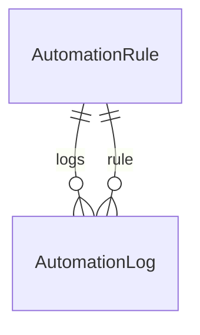
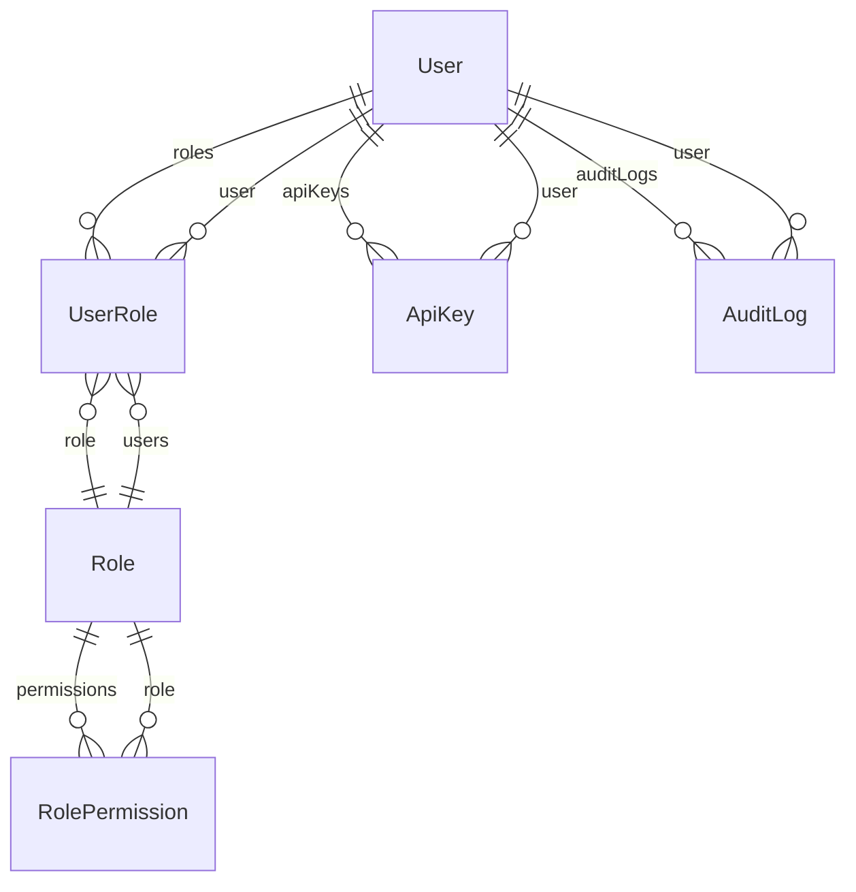
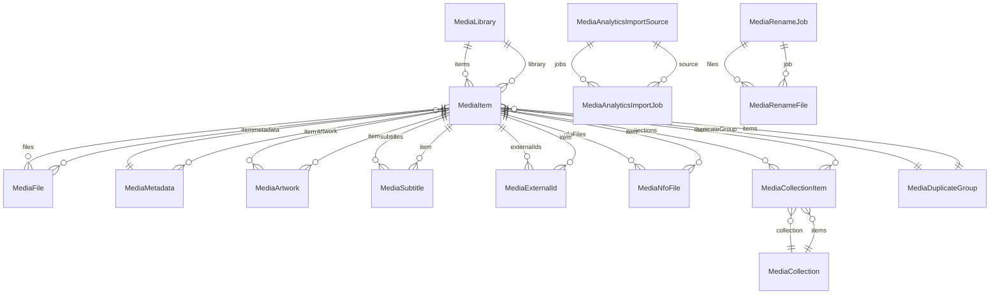
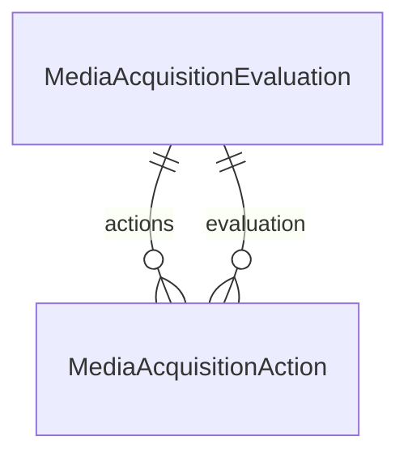
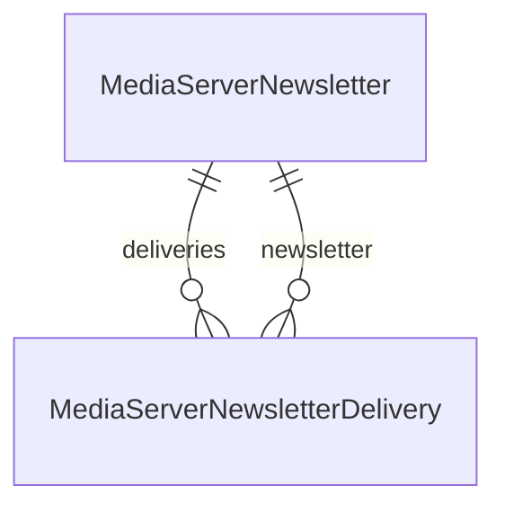
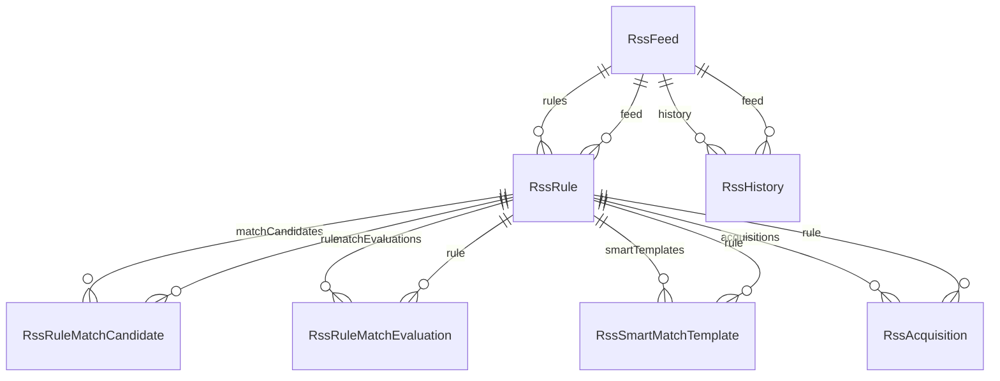
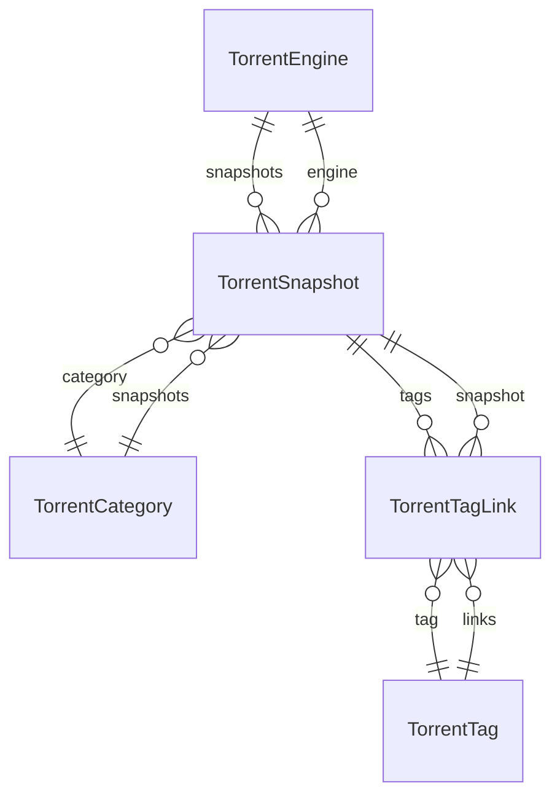

# Database Schema

:::info Auto-generated
This page is generated from `apps/backend/prisma/schema.prisma` at build time. **Do not edit it by hand** — change the source and rebuild. This guarantees the reference always matches the code that ships.
:::

UltraTorrent stores everything in **PostgreSQL**, managed by **Prisma**. There are
**88 models**. A single ER diagram of all of them would be unreadable, so they are
grouped by domain below.

:::tip Never hand-edit the database
Schema changes go through a Prisma migration so every install converges on the same shape.
See [Database & Prisma](/develop/database).
:::

## Automation

_2 models._



### `AutomationRule`

Table: `automation_rules`

| Column | Type |
| --- | --- |
| `id` | `String` |
| `name` | `String` |
| `description` | `String?` |
| `trigger` | `String` |
| `conditions` | `Json` |
| `actions` | `Json` |
| `isEnabled` | `Boolean` |
| `priority` | `Int` |
| `createdAt` | `DateTime` |
| `updatedAt` | `DateTime` |

### `AutomationLog`

Table: `automation_logs`

| Column | Type |
| --- | --- |
| `id` | `String` |
| `ruleId` | `String` |
| `status` | `String` |
| `context` | `Json` |
| `message` | `String?` |
| `createdAt` | `DateTime` |

## IMDb catalogue

_8 models._

```mermaid
erDiagram
```

### `IMDbTitle`

Table: `imdb_titles`

| Column | Type |
| --- | --- |
| `id` | `String` |
| `tconst` | `String` |
| `titleType` | `String` |
| `primaryTitle` | `String` |
| `originalTitle` | `String` |
| `isAdult` | `Boolean` |
| `startYear` | `Int?` |
| `endYear` | `Int?` |
| `runtimeMinutes` | `Int?` |
| `genres` | `String[]` |
| `createdAt` | `DateTime` |
| `updatedAt` | `DateTime` |

### `IMDbAka`

Table: `imdb_akas`

| Column | Type |
| --- | --- |
| `id` | `String` |
| `titleId` | `String` |
| `title` | `String` |
| `region` | `String?` |
| `language` | `String?` |
| `types` | `String?` |
| `attributes` | `String?` |
| `ordering` | `Int?` |
| `isOriginalTitle` | `Boolean` |

### `IMDbCrew`

Table: `imdb_crew`

| Column | Type |
| --- | --- |
| `id` | `String` |
| `titleId` | `String` |
| `directors` | `String[]` |
| `writers` | `String[]` |

### `IMDbEpisode`

Table: `imdb_episodes`

| Column | Type |
| --- | --- |
| `id` | `String` |
| `episodeTitleId` | `String` |
| `parentTitleId` | `String` |
| `seasonNumber` | `Int?` |
| `episodeNumber` | `Int?` |

### `IMDbPrincipal`

Table: `imdb_principals`

| Column | Type |
| --- | --- |
| `id` | `String` |
| `titleId` | `String` |
| `ordering` | `Int` |
| `personId` | `String` |
| `category` | `String?` |
| `job` | `String?` |
| `characters` | `String?` |

### `IMDbPerson`

Table: `imdb_persons`

| Column | Type |
| --- | --- |
| `id` | `String` |
| `nconst` | `String` |
| `primaryName` | `String` |
| `birthYear` | `Int?` |
| `deathYear` | `Int?` |
| `primaryProfession` | `String[]` |
| `knownForTitles` | `String[]` |

### `IMDbRating`

Table: `imdb_ratings`

| Column | Type |
| --- | --- |
| `id` | `String` |
| `titleId` | `String` |
| `averageRating` | `Float` |
| `numVotes` | `Int` |

### `IMDbDatasetImport`

Table: `imdb_dataset_imports`

| Column | Type |
| --- | --- |
| `id` | `String` |
| `status` | `String` |
| `sourcePath` | `String` |
| `startedAt` | `DateTime?` |
| `completedAt` | `DateTime?` |
| `failedAt` | `DateTime?` |
| `errorMessage` | `String?` |
| `filesImported` | `Json` |
| `recordsImported` | `Int` |
| `stats` | `Json?` |
| `strategy` | `String?` |
| `datasetDate` | `DateTime?` |
| `createdAt` | `DateTime` |
| `updatedAt` | `DateTime` |

## Identity & audit

_6 models._



### `User`

Table: `users`

| Column | Type |
| --- | --- |
| `id` | `String` |
| `username` | `String` |
| `email` | `String` |
| `displayName` | `String?` |
| `passwordHash` | `String` |
| `isActive` | `Boolean` |
| `isSystem` | `Boolean` |
| `lastLoginAt` | `DateTime?` |
| `totpSecret` | `String?` |
| `totpEnabled` | `Boolean` |
| `recoveryCodes` | `String[]` |
| `createdAt` | `DateTime` |
| `updatedAt` | `DateTime` |

### `Role`

Table: `roles`

| Column | Type |
| --- | --- |
| `id` | `String` |
| `name` | `String` |
| `description` | `String?` |
| `isSystem` | `Boolean` |
| `createdAt` | `DateTime` |
| `updatedAt` | `DateTime` |

### `UserRole`

Table: `user_roles`

| Column | Type |
| --- | --- |
| `userId` | `String` |
| `roleId` | `String` |

### `RolePermission`

Table: `role_permissions`

| Column | Type |
| --- | --- |
| `roleId` | `String` |
| `permissionId` | `String` |

### `ApiKey`

Table: `api_keys`

| Column | Type |
| --- | --- |
| `id` | `String` |
| `userId` | `String` |
| `name` | `String` |
| `prefix` | `String` |
| `keyHash` | `String` |
| `scopes` | `String[]` |
| `lastUsedAt` | `DateTime?` |
| `expiresAt` | `DateTime?` |
| `revokedAt` | `DateTime?` |
| `createdAt` | `DateTime` |

### `AuditLog`

Table: `audit_logs`

| Column | Type |
| --- | --- |
| `id` | `String` |
| `userId` | `String?` |
| `action` | `String` |
| `objectType` | `String?` |
| `objectId` | `String?` |
| `result` | `String` |
| `ipAddress` | `String?` |
| `userAgent` | `String?` |
| `metadata` | `Json?` |
| `createdAt` | `DateTime` |

## Indexers

_1 model._

```mermaid
erDiagram
```

### `Indexer`

Table: `indexers`

| Column | Type |
| --- | --- |
| `id` | `String` |
| `name` | `String` |
| `implementation` | `String` |
| `protocol` | `String` |
| `baseUrl` | `String` |
| `config` | `Json` |
| `enabled` | `Boolean` |
| `priority` | `Int` |
| `categories` | `Int[]` |
| `capabilities` | `Json?` |
| `minSeeders` | `Int?` |
| `timeoutMs` | `Int` |
| `status` | `String` |
| `statusMessage` | `String?` |
| `lastTestedAt` | `DateTime?` |
| `createdAt` | `DateTime` |
| `updatedAt` | `DateTime` |

## Media Manager

_19 models._



### `MediaLibrary`

Table: `media_libraries`

| Column | Type |
| --- | --- |
| `id` | `String` |
| `name` | `String` |
| `kind` | `String` |
| `path` | `String` |
| `preset` | `String` |
| `template` | `String?` |
| `mode` | `String` |
| `isEnabled` | `Boolean` |
| `scanIntervalMinutes` | `Int?` |
| `lastScanAt` | `DateTime?` |
| `nfoEnabled` | `Boolean` |
| `artworkEnabled` | `Boolean` |
| `createdAt` | `DateTime` |
| `updatedAt` | `DateTime` |

### `MediaItem`

Table: `media_items`

| Column | Type |
| --- | --- |
| `id` | `String` |
| `libraryId` | `String` |
| `mediaType` | `String` |
| `title` | `String` |
| `sortTitle` | `String?` |
| `year` | `Int?` |
| `season` | `Int?` |
| `episode` | `Int?` |
| `matchStatus` | `String` |
| `confidence` | `Float` |
| `path` | `String` |
| `duplicateGroupId` | `String?` |
| `seriesImdbId` | `String?` |
| `createdAt` | `DateTime` |
| `updatedAt` | `DateTime` |

### `MediaFile`

Table: `media_files`

| Column | Type |
| --- | --- |
| `id` | `String` |
| `itemId` | `String` |
| `path` | `String` |
| `size` | `BigInt` |
| `container` | `String?` |
| `videoCodec` | `String?` |
| `audioCodec` | `String?` |
| `resolution` | `String?` |
| `hdr` | `String?` |
| `language` | `String?` |
| `releaseGroup` | `String?` |
| `quality` | `String?` |
| `createdAt` | `DateTime` |

### `MediaMetadata`

Table: `media_metadata`

| Column | Type |
| --- | --- |
| `id` | `String` |
| `itemId` | `String` |
| `title` | `String?` |
| `originalTitle` | `String?` |
| `sortTitle` | `String?` |
| `overview` | `String?` |
| `releaseDate` | `DateTime?` |
| `year` | `Int?` |
| `runtime` | `Int?` |
| `genres` | `Json` |
| `studios` | `Json` |
| `cast` | `Json` |
| `crew` | `Json` |
| `directors` | `Json` |
| `writers` | `Json` |
| `rating` | `Float?` |
| `certification` | `String?` |
| `tags` | `Json` |
| `providerName` | `String?` |
| `updatedAt` | `DateTime` |

### `MediaArtwork`

Table: `media_artwork`

| Column | Type |
| --- | --- |
| `id` | `String` |
| `itemId` | `String` |
| `type` | `String` |
| `url` | `String?` |
| `localPath` | `String?` |
| `source` | `String?` |
| `selected` | `Boolean` |
| `width` | `Int?` |
| `height` | `Int?` |
| `seasonNumber` | `Int?` |
| `createdAt` | `DateTime` |

### `MediaSubtitle`

Table: `media_subtitles`

| Column | Type |
| --- | --- |
| `id` | `String` |
| `itemId` | `String` |
| `path` | `String` |
| `language` | `String` |
| `forced` | `Boolean` |
| `sdh` | `Boolean` |
| `source` | `String?` |
| `createdAt` | `DateTime` |

### `MediaExternalId`

Table: `media_external_ids`

| Column | Type |
| --- | --- |
| `id` | `String` |
| `itemId` | `String` |
| `provider` | `String` |
| `externalId` | `String` |
| `url` | `String?` |

### `MediaCollection`

Table: `media_collections`

| Column | Type |
| --- | --- |
| `id` | `String` |
| `name` | `String` |
| `overview` | `String?` |
| `artworkPath` | `String?` |
| `createdAt` | `DateTime` |
| `updatedAt` | `DateTime` |

### `MediaCollectionItem`

Table: `media_collection_items`

| Column | Type |
| --- | --- |
| `collectionId` | `String` |
| `itemId` | `String` |

### `MediaRenameTemplate`

Table: `media_rename_templates`

| Column | Type |
| --- | --- |
| `id` | `String` |
| `name` | `String` |
| `mediaType` | `String` |
| `template` | `String` |
| `isDefault` | `Boolean` |
| `createdAt` | `DateTime` |
| `updatedAt` | `DateTime` |

### `MediaProcessingJob`

Table: `media_processing_jobs`

| Column | Type |
| --- | --- |
| `id` | `String` |
| `type` | `String` |
| `status` | `String` |
| `libraryId` | `String?` |
| `itemId` | `String?` |
| `payload` | `Json` |
| `result` | `Json?` |
| `error` | `String?` |
| `progress` | `Int` |
| `startedAt` | `DateTime?` |
| `finishedAt` | `DateTime?` |
| `createdAt` | `DateTime` |
| `updatedAt` | `DateTime` |

### `MediaDuplicateGroup`

Table: `media_duplicate_groups`

| Column | Type |
| --- | --- |
| `id` | `String` |
| `reason` | `String` |
| `createdAt` | `DateTime` |

### `MediaAnalyticsImportSource`

Table: `media_analytics_import_sources`

| Column | Type |
| --- | --- |
| `id` | `String` |
| `name` | `String` |
| `type` | `String` |
| `baseUrl` | `String` |
| `encryptedApiKey` | `String?` |
| `enabled` | `Boolean` |
| `syncEnabled` | `Boolean` |
| `lastConnectionTestAt` | `DateTime?` |
| `lastImportAt` | `DateTime?` |
| `lastIncrementalSyncAt` | `DateTime?` |
| `importCursor` | `Json?` |
| `sourceVersion` | `String?` |
| `status` | `String?` |
| `notes` | `String?` |
| `createdAt` | `DateTime` |
| `updatedAt` | `DateTime` |

### `MediaAnalyticsImportJob`

Table: `media_analytics_import_jobs`

| Column | Type |
| --- | --- |
| `id` | `String` |
| `sourceId` | `String` |
| `status` | `String` |
| `mode` | `String` |
| `selectedSections` | `Json?` |
| `progress` | `Int` |
| `totalRecords` | `Int` |
| `processedRecords` | `Int` |
| `importedRecords` | `Int` |
| `skippedRecords` | `Int` |
| `failedRecords` | `Int` |
| `warnings` | `Json?` |
| `errors` | `Json?` |
| `startedAt` | `DateTime?` |
| `completedAt` | `DateTime?` |
| `createdById` | `String?` |
| `createdAt` | `DateTime` |
| `updatedAt` | `DateTime` |

### `MediaNfoFile`

Table: `media_nfo_files`

| Column | Type |
| --- | --- |
| `id` | `String` |
| `itemId` | `String` |
| `type` | `String` |
| `path` | `String` |
| `generatedAt` | `DateTime` |

### `MediaRenameOperation`

Table: `media_rename_operations`

| Column | Type |
| --- | --- |
| `id` | `String` |
| `source` | `String` |
| `destination` | `String?` |
| `action` | `String` |
| `kind` | `String` |
| `mode` | `String` |
| `status` | `String` |
| `message` | `String?` |
| `torrentHash` | `String?` |
| `createdAt` | `DateTime` |

### `MediaRenameJob`

Table: `media_rename_jobs`

| Column | Type |
| --- | --- |
| `id` | `String` |
| `torrentHash` | `String?` |
| `engineId` | `String?` |
| `status` | `String` |
| `mode` | `String` |
| `sourcePath` | `String` |
| `destinationPath` | `String?` |
| `mediaType` | `String?` |
| `parsedMetadata` | `Json?` |
| `providerMetadata` | `Json?` |
| `confidenceScore` | `Int?` |
| `dryRunResult` | `Json?` |
| `executedBy` | `String?` |
| `createdAt` | `DateTime` |
| `completedAt` | `DateTime?` |

### `MediaRenameFile`

Table: `media_rename_files`

| Column | Type |
| --- | --- |
| `id` | `String` |
| `jobId` | `String` |
| `originalPath` | `String` |
| `proposedPath` | `String?` |
| `finalPath` | `String?` |
| `fileType` | `String?` |
| `action` | `String` |
| `status` | `String` |
| `errorMessage` | `String?` |
| `createdAt` | `DateTime` |
| `updatedAt` | `DateTime` |

### `MediaNamingTemplate`

Table: `media_naming_templates`

| Column | Type |
| --- | --- |
| `id` | `String` |
| `name` | `String` |
| `mediaType` | `String` |
| `serverPreset` | `String` |
| `template` | `String` |
| `enabled` | `Boolean` |
| `createdAt` | `DateTime` |
| `updatedAt` | `DateTime` |

## Media acquisition (Smart Download)

_7 models._



### `MediaAcquisitionWatchlistItem`

Table: `media_acquisition_watchlist_items`

| Column | Type |
| --- | --- |
| `id` | `String` |
| `type` | `String` |
| `title` | `String` |
| `normalizedTitle` | `String` |
| `year` | `Int?` |
| `externalIds` | `Json?` |
| `seasonNumber` | `Int?` |
| `episodeNumber` | `Int?` |
| `collectionName` | `String?` |
| `status` | `String` |
| `priority` | `Int` |
| `profileId` | `String?` |
| `rssRuleId` | `String?` |
| `targetLibraryId` | `String?` |
| `settings` | `Json?` |
| `createdBy` | `String?` |
| `createdAt` | `DateTime` |
| `updatedAt` | `DateTime` |

### `WantedEpisode`

Table: `wanted_episodes`

| Column | Type |
| --- | --- |
| `id` | `String` |
| `watchlistItemId` | `String` |
| `seriesTconst` | `String` |
| `episodeTconst` | `String?` |
| `seasonNumber` | `Int` |
| `episodeNumber` | `Int` |
| `episodeTitle` | `String?` |
| `airYear` | `Int?` |
| `status` | `String` |
| `searchStatus` | `String` |
| `lastSearchedAt` | `DateTime?` |
| `grabbedAt` | `DateTime?` |
| `grabbedEvaluationId` | `String?` |
| `downloadUrl` | `String?` |
| `releaseTitle` | `String?` |
| `lastCheckedAt` | `DateTime` |
| `createdAt` | `DateTime` |

### `WantedMovie`

Table: `wanted_movies`

| Column | Type |
| --- | --- |
| `id` | `String` |
| `watchlistItemId` | `String` |
| `movieTconst` | `String` |
| `title` | `String` |
| `year` | `Int?` |
| `status` | `String` |
| `searchStatus` | `String` |
| `lastSearchedAt` | `DateTime?` |
| `grabbedAt` | `DateTime?` |
| `grabbedEvaluationId` | `String?` |
| `downloadUrl` | `String?` |
| `releaseTitle` | `String?` |
| `lastCheckedAt` | `DateTime` |
| `createdAt` | `DateTime` |

### `MediaAcquisitionProfile`

Table: `media_acquisition_profiles`

| Column | Type |
| --- | --- |
| `id` | `String` |
| `name` | `String` |
| `description` | `String?` |
| `mediaType` | `String` |
| `minimumScore` | `Int` |
| `approvalScore` | `Int` |
| `minimumResolution` | `String?` |
| `preferredResolution` | `String?` |
| `preferredSource` | `String?` |
| `preferredCodec` | `String?` |
| `preferredAudio` | `String?` |
| `preferredHdr` | `String?` |
| `preferredLanguages` | `Json?` |
| `requiredTerms` | `Json?` |
| `excludedTerms` | `Json?` |
| `preferredGroups` | `Json?` |
| `qualityRules` | `Json?` |
| `duplicateRules` | `Json?` |
| `storageRules` | `Json?` |
| `automationRules` | `Json?` |
| `enabled` | `Boolean` |
| `createdBy` | `String?` |
| `createdAt` | `DateTime` |
| `updatedAt` | `DateTime` |

### `MediaAcquisitionEvaluation`

Table: `media_acquisition_evaluations`

| Column | Type |
| --- | --- |
| `id` | `String` |
| `sourceType` | `String` |
| `sourceId` | `String?` |
| `releaseName` | `String` |
| `parsedMetadata` | `Json?` |
| `watchlistItemId` | `String?` |
| `profileId` | `String?` |
| `libraryMatch` | `Json?` |
| `releaseScore` | `Json?` |
| `duplicateRisk` | `Json?` |
| `qualityGap` | `Json?` |
| `storageCheck` | `Json?` |
| `serverSelection` | `Json?` |
| `decision` | `String` |
| `decisionReason` | `String?` |
| `priority` | `Int` |
| `confidence` | `Int` |
| `requiresApproval` | `Boolean` |
| `approvalStatus` | `String` |
| `actionTaken` | `String?` |
| `torrentHash` | `String?` |
| `trace` | `Json?` |
| `createdAt` | `DateTime` |
| `updatedAt` | `DateTime` |

### `MediaAcquisitionAction`

Table: `media_acquisition_actions`

| Column | Type |
| --- | --- |
| `id` | `String` |
| `evaluationId` | `String` |
| `actionType` | `String` |
| `status` | `String` |
| `payload` | `Json?` |
| `result` | `Json?` |
| `createdBy` | `String?` |
| `createdAt` | `DateTime` |
| `completedAt` | `DateTime?` |
| `errorMessage` | `String?` |

### `MediaAcquisitionHistory`

Table: `media_acquisition_history`

| Column | Type |
| --- | --- |
| `id` | `String` |
| `watchlistItemId` | `String?` |
| `evaluationId` | `String?` |
| `eventType` | `String` |
| `message` | `String` |
| `metadata` | `Json?` |
| `createdAt` | `DateTime` |

## Media server analytics

_9 models._



### `MediaServerIntegration`

Table: `media_server_integrations`

| Column | Type |
| --- | --- |
| `id` | `String` |
| `name` | `String` |
| `kind` | `String` |
| `config` | `Json` |
| `isEnabled` | `Boolean` |
| `lastRefreshAt` | `DateTime?` |
| `isDefault` | `Boolean` |
| `status` | `String?` |
| `serverVersion` | `String?` |
| `platform` | `String?` |
| `capabilities` | `Json?` |
| `lastHealthCheckAt` | `DateTime?` |
| `notes` | `String?` |
| `createdAt` | `DateTime` |
| `updatedAt` | `DateTime` |

### `MediaServerSession`

Table: `media_server_sessions`

| Column | Type |
| --- | --- |
| `id` | `String` |
| `connectionId` | `String` |
| `providerSessionId` | `String` |
| `providerUserId` | `String?` |
| `userName` | `String?` |
| `title` | `String` |
| `mediaType` | `String?` |
| `libraryName` | `String?` |
| `device` | `String?` |
| `client` | `String?` |
| `ipAddress` | `String?` |
| `playbackState` | `String?` |
| `progressPercent` | `Int?` |
| `playbackMethod` | `String?` |
| `videoCodec` | `String?` |
| `audioCodec` | `String?` |
| `resolution` | `String?` |
| `container` | `String?` |
| `bitrateKbps` | `Int?` |
| `artPath` | `String?` |
| `startedAt` | `DateTime` |
| `updatedAt` | `DateTime` |

### `MediaServerWatchHistory`

Table: `media_server_watch_history`

| Column | Type |
| --- | --- |
| `id` | `String` |
| `connectionId` | `String?` |
| `importSourceId` | `String?` |
| `providerHistoryId` | `String?` |
| `providerUserId` | `String?` |
| `userName` | `String?` |
| `title` | `String` |
| `mediaType` | `String?` |
| `libraryName` | `String?` |
| `device` | `String?` |
| `client` | `String?` |
| `ipAddress` | `String?` |
| `startedAt` | `DateTime` |
| `stoppedAt` | `DateTime?` |
| `watchedSeconds` | `Int?` |
| `percentComplete` | `Int?` |
| `playbackMethod` | `String?` |
| `resolution` | `String?` |
| `videoCodec` | `String?` |
| `audioCodec` | `String?` |
| `container` | `String?` |
| `bitrateKbps` | `Int?` |
| `importSource` | `String?` |
| `importedAt` | `DateTime?` |
| `createdAt` | `DateTime` |

### `MediaServerLibrary`

Table: `media_server_libraries`

| Column | Type |
| --- | --- |
| `id` | `String` |
| `connectionId` | `String` |
| `providerLibraryId` | `String` |
| `name` | `String` |
| `type` | `String` |
| `itemCount` | `Int?` |
| `lastSyncedAt` | `DateTime` |
| `createdAt` | `DateTime` |
| `updatedAt` | `DateTime` |

### `MediaServerUser`

Table: `media_server_users`

| Column | Type |
| --- | --- |
| `id` | `String` |
| `connectionId` | `String?` |
| `providerUserId` | `String?` |
| `userName` | `String` |
| `plays` | `Int` |
| `lastSeenAt` | `DateTime?` |
| `createdAt` | `DateTime` |
| `updatedAt` | `DateTime` |

### `MediaProviderSyncRun`

Table: `media_provider_sync_runs`

| Column | Type |
| --- | --- |
| `id` | `String` |
| `connectionId` | `String?` |
| `type` | `String` |
| `status` | `String` |
| `librariesSynced` | `Int` |
| `usersSynced` | `Int` |
| `message` | `String?` |
| `startedAt` | `DateTime` |
| `finishedAt` | `DateTime?` |

### `MediaServerNewsletter`

Table: `media_server_newsletters`

| Column | Type |
| --- | --- |
| `id` | `String` |
| `name` | `String` |
| `enabled` | `Boolean` |
| `frequency` | `String` |
| `recipientEmails` | `Json` |
| `contentSections` | `Json` |
| `subjectTemplate` | `String?` |
| `dateRangeMode` | `String` |
| `lastDays` | `Int` |
| `startDate` | `DateTime?` |
| `lastSuccessfulSendAt` | `DateTime?` |
| `nextRunAt` | `DateTime?` |
| `createdAt` | `DateTime` |
| `updatedAt` | `DateTime` |

### `MediaServerNewsletterDelivery`

Table: `media_server_newsletter_deliveries`

| Column | Type |
| --- | --- |
| `id` | `String` |
| `newsletterId` | `String` |
| `recipientEmail` | `String` |
| `status` | `String` |
| `subject` | `String?` |
| `sentAt` | `DateTime?` |
| `errorMessage` | `String?` |
| `createdAt` | `DateTime` |

### `MediaServerConfig`

Table: `media_server_configs`

| Column | Type |
| --- | --- |
| `id` | `String` |
| `provider` | `String` |
| `name` | `String` |
| `baseUrl` | `String` |
| `encryptedConfig` | `String` |
| `enabled` | `Boolean` |
| `createdAt` | `DateTime` |
| `updatedAt` | `DateTime` |

## Notification Center

_13 models._

```mermaid
erDiagram
```

### `Notification`

Table: `notifications`

| Column | Type |
| --- | --- |
| `id` | `String` |
| `userId` | `String?` |
| `level` | `String` |
| `title` | `String` |
| `message` | `String` |
| `eventType` | `String?` |
| `readAt` | `DateTime?` |
| `createdAt` | `DateTime` |

### `NotificationChannel`

Table: `notification_channels`

| Column | Type |
| --- | --- |
| `id` | `String` |
| `name` | `String` |
| `description` | `String?` |
| `provider` | `String` |
| `enabled` | `Boolean` |
| `isDefault` | `Boolean` |
| `priority` | `Int` |
| `config` | `Json` |
| `capabilities` | `Json` |
| `rateLimitPerMin` | `Int?` |
| `retryPolicy` | `Json` |
| `quietHours` | `Json` |
| `allowedEvents` | `Json` |
| `allowedGroupIds` | `Json` |
| `healthStatus` | `String` |
| `lastHealthCheckAt` | `DateTime?` |
| `lastError` | `String?` |
| `sentCount` | `Int` |
| `failedCount` | `Int` |
| `createdAt` | `DateTime` |
| `updatedAt` | `DateTime` |

### `NotificationRecipient`

Table: `notification_recipients`

| Column | Type |
| --- | --- |
| `id` | `String` |
| `displayName` | `String` |
| `email` | `String?` |
| `phone` | `String?` |
| `telegramChatId` | `String?` |
| `whatsappNumber` | `String?` |
| `language` | `String` |
| `timezone` | `String?` |
| `preferredChannelId` | `String?` |
| `enabled` | `Boolean` |
| `quietHours` | `Json` |
| `preferences` | `Json` |
| `userId` | `String?` |
| `createdAt` | `DateTime` |
| `updatedAt` | `DateTime` |

### `NotificationRecipientGroup`

Table: `notification_recipient_groups`

| Column | Type |
| --- | --- |
| `id` | `String` |
| `name` | `String` |
| `description` | `String?` |
| `system` | `Boolean` |
| `createdAt` | `DateTime` |
| `updatedAt` | `DateTime` |

### `NotificationRecipientMember`

Table: `notification_recipient_members`

| Column | Type |
| --- | --- |
| `id` | `String` |
| `groupId` | `String` |
| `recipientId` | `String` |
| `createdAt` | `DateTime` |

### `NotificationTemplate`

Table: `notification_templates`

| Column | Type |
| --- | --- |
| `id` | `String` |
| `name` | `String` |
| `description` | `String?` |
| `event` | `String?` |
| `subject` | `String?` |
| `title` | `String?` |
| `subtitle` | `String?` |
| `html` | `String?` |
| `text` | `String?` |
| `markdown` | `String?` |
| `sms` | `String?` |
| `whatsapp` | `String?` |
| `telegram` | `String?` |
| `card` | `Json` |
| `variables` | `Json` |
| `locale` | `String` |
| `system` | `Boolean` |
| `createdAt` | `DateTime` |
| `updatedAt` | `DateTime` |

### `NotificationRule`

Table: `notification_rules`

| Column | Type |
| --- | --- |
| `id` | `String` |
| `name` | `String` |
| `description` | `String?` |
| `enabled` | `Boolean` |
| `event` | `String` |
| `priority` | `Int` |
| `severity` | `String` |
| `conditions` | `Json` |
| `recipients` | `Json` |
| `channelIds` | `Json` |
| `templateId` | `String?` |
| `variables` | `Json` |
| `quietHoursOverride` | `Boolean` |
| `dedupeWindowSec` | `Int` |
| `retryPolicy` | `Json` |
| `escalationPolicy` | `Json` |
| `rateLimitPerHour` | `Int?` |
| `schedule` | `Json` |
| `tags` | `Json` |
| `system` | `Boolean` |
| `triggerCount` | `Int` |
| `lastTriggeredAt` | `DateTime?` |
| `createdAt` | `DateTime` |
| `updatedAt` | `DateTime` |

### `NotificationDelivery`

Table: `notification_deliveries`

| Column | Type |
| --- | --- |
| `id` | `String` |
| `ruleId` | `String?` |
| `eventId` | `String?` |
| `event` | `String` |
| `channelId` | `String?` |
| `provider` | `String` |
| `recipientId` | `String?` |
| `destination` | `String?` |
| `templateId` | `String?` |
| `subject` | `String?` |
| `renderedBody` | `String?` |
| `card` | `Json` |
| `priority` | `Int` |
| `severity` | `String` |
| `status` | `String` |
| `attempts` | `Int` |
| `maxAttempts` | `Int` |
| `dedupeKey` | `String?` |
| `scheduledFor` | `DateTime?` |
| `nextAttemptAt` | `DateTime?` |
| `sentAt` | `DateTime?` |
| `deliveredAt` | `DateTime?` |
| `failedAt` | `DateTime?` |
| `error` | `String?` |
| `providerMessageId` | `String?` |
| `createdAt` | `DateTime` |
| `updatedAt` | `DateTime` |

### `NotificationPreference`

Table: `notification_preferences`

| Column | Type |
| --- | --- |
| `id` | `String` |
| `recipientId` | `String` |
| `event` | `String` |
| `channel` | `String?` |
| `enabled` | `Boolean` |
| `createdAt` | `DateTime` |
| `updatedAt` | `DateTime` |

### `NotificationQueue`

Table: `notification_queue`

| Column | Type |
| --- | --- |
| `id` | `String` |
| `deliveryId` | `String` |
| `priority` | `Int` |
| `scheduledFor` | `DateTime` |
| `leasedAt` | `DateTime?` |
| `attempts` | `Int` |
| `createdAt` | `DateTime` |

### `NotificationAttachment`

Table: `notification_attachments`

| Column | Type |
| --- | --- |
| `id` | `String` |
| `deliveryId` | `String?` |
| `templateId` | `String?` |
| `filename` | `String` |
| `contentType` | `String?` |
| `url` | `String?` |
| `artworkId` | `String?` |
| `cid` | `String?` |
| `createdAt` | `DateTime` |

### `NotificationEvent`

Table: `notification_events`

| Column | Type |
| --- | --- |
| `id` | `String` |
| `event` | `String` |
| `payload` | `Json` |
| `dedupeKey` | `String?` |
| `matchedRules` | `Int` |
| `processedAt` | `DateTime?` |
| `createdAt` | `DateTime` |

### `NotificationStatistics`

Table: `notification_statistics`

| Column | Type |
| --- | --- |
| `id` | `String` |
| `date` | `DateTime` |
| `provider` | `String?` |
| `channelId` | `String?` |
| `event` | `String?` |
| `sent` | `Int` |
| `delivered` | `Int` |
| `failed` | `Int` |
| `skipped` | `Int` |
| `createdAt` | `DateTime` |
| `updatedAt` | `DateTime` |

## Platform

_10 models._

```mermaid
erDiagram
```

### `Permission`

Table: `permissions`

| Column | Type |
| --- | --- |
| `id` | `String` |
| `key` | `String` |
| `description` | `String?` |

### `RefreshToken`

Table: `refresh_tokens`

| Column | Type |
| --- | --- |
| `id` | `String` |
| `userId` | `String` |
| `tokenHash` | `String` |
| `family` | `String` |
| `userAgent` | `String?` |
| `ipAddress` | `String?` |
| `expiresAt` | `DateTime` |
| `revokedAt` | `DateTime?` |
| `createdAt` | `DateTime` |

### `ParkedTorrent`

Table: `parked_torrents`

| Column | Type |
| --- | --- |
| `hash` | `String` |
| `engineId` | `String` |
| `name` | `String` |
| `reason` | `String` |
| `parkedAt` | `DateTime` |
| `probingSince` | `DateTime?` |
| `lastProbedAt` | `DateTime?` |
| `probeCount` | `Int` |
| `lastSeeders` | `Int` |
| `updatedAt` | `DateTime` |

### `DownloadPath`

Table: `download_paths`

| Column | Type |
| --- | --- |
| `id` | `String` |
| `label` | `String` |
| `path` | `String` |
| `isDefault` | `Boolean` |
| `createdAt` | `DateTime` |

### `Setting`

Table: `settings`

| Column | Type |
| --- | --- |
| `key` | `String` |
| `value` | `Json` |
| `updatedAt` | `DateTime` |

### `SystemEvent`

Table: `system_events`

| Column | Type |
| --- | --- |
| `id` | `String` |
| `type` | `String` |
| `severity` | `String` |
| `payload` | `Json` |
| `createdAt` | `DateTime` |

### `ModuleState`

Table: `module_states`

| Column | Type |
| --- | --- |
| `id` | `String` |
| `moduleId` | `String` |
| `enabled` | `Boolean` |
| `status` | `String` |
| `tier` | `String` |
| `reason` | `String?` |
| `metadata` | `Json?` |
| `createdAt` | `DateTime` |
| `updatedAt` | `DateTime` |

### `ModuleEvent`

Table: `module_events`

| Column | Type |
| --- | --- |
| `id` | `String` |
| `moduleId` | `String` |
| `eventType` | `String` |
| `message` | `String` |
| `metadata` | `Json?` |
| `userId` | `String?` |
| `createdAt` | `DateTime` |

### `TrashItem`

Table: `trash_items`

| Column | Type |
| --- | --- |
| `id` | `String` |
| `originalPath` | `String` |
| `name` | `String` |
| `trashPath` | `String` |
| `storageRoot` | `String` |
| `isDirectory` | `Boolean` |
| `size` | `BigInt` |
| `deletedById` | `String?` |
| `deletedAt` | `DateTime` |

### `AcquisitionMatchCandidate`

Table: `acquisition_match_candidates`

| Column | Type |
| --- | --- |
| `id` | `String` |
| `priorityOrder` | `Int` |
| `name` | `String` |
| `description` | `String?` |
| `enabled` | `Boolean` |
| `matchType` | `String` |
| `pattern` | `String?` |
| `requiredTerms` | `Json` |
| `excludedTerms` | `Json` |
| `qualityRules` | `Json` |
| `sizeRules` | `Json` |
| `lastMatchedAt` | `DateTime?` |
| `matchCount` | `Int` |
| `createdAt` | `DateTime` |
| `updatedAt` | `DateTime` |

## RSS

_8 models._



### `RssFeed`

Table: `rss_feeds`

| Column | Type |
| --- | --- |
| `id` | `String` |
| `name` | `String` |
| `url` | `String` |
| `refreshInterval` | `Int` |
| `isEnabled` | `Boolean` |
| `lastFetchedAt` | `DateTime?` |
| `createdAt` | `DateTime` |
| `updatedAt` | `DateTime` |

### `RssRule`

Table: `rss_rules`

| Column | Type |
| --- | --- |
| `id` | `String` |
| `feedId` | `String` |
| `name` | `String` |
| `includeRegex` | `String?` |
| `excludeRegex` | `String?` |
| `categoryId` | `String?` |
| `savePath` | `String?` |
| `autoDownload` | `Boolean` |
| `isEnabled` | `Boolean` |
| `createdAt` | `DateTime` |
| `mediaType` | `String?` |
| `showStatus` | `String?` |
| `showStatusProvider` | `String?` |
| `showStatusProviderId` | `String?` |
| `showStatusCheckedAt` | `DateTime?` |
| `showStatusRecommendation` | `String?` |
| `showFirstAirDate` | `DateTime?` |
| `showLastAirDate` | `DateTime?` |
| `showNextEpisodeAirDate` | `DateTime?` |
| `showStatusWarnings` | `Json` |
| `allowInactiveShowMonitoring` | `Boolean` |

### `TvShowStatus`

Table: `tv_show_status`

| Column | Type |
| --- | --- |
| `id` | `String` |
| `provider` | `String` |
| `providerShowId` | `String` |
| `title` | `String` |
| `normalizedTitle` | `String` |
| `originalStatus` | `String?` |
| `normalizedStatus` | `String` |
| `recommendation` | `String` |
| `confidence` | `Float` |
| `firstAirDate` | `DateTime?` |
| `lastAirDate` | `DateTime?` |
| `nextEpisodeAirDate` | `DateTime?` |
| `lastEpisodeTitle` | `String?` |
| `nextEpisodeTitle` | `String?` |
| `totalSeasons` | `Int?` |
| `totalEpisodes` | `Int?` |
| `overview` | `String?` |
| `posterUrl` | `String?` |
| `warnings` | `Json` |
| `checkedAt` | `DateTime` |

### `RssAcquisition`

Table: `rss_acquisitions`

| Column | Type |
| --- | --- |
| `id` | `String` |
| `rssRuleId` | `String` |
| `identity` | `String` |
| `priorityOrder` | `Int` |
| `releaseTitle` | `String` |
| `torrentHash` | `String?` |
| `createdAt` | `DateTime` |
| `updatedAt` | `DateTime` |

### `RssSmartMatchTemplate`

Table: `rss_smart_match_templates`

| Column | Type |
| --- | --- |
| `id` | `String` |
| `rssRuleId` | `String` |
| `sourceName` | `String` |
| `parsedMetadata` | `Json` |
| `generatedCandidates` | `Json` |
| `confidenceScore` | `Int` |
| `userEdited` | `Boolean` |
| `createdAt` | `DateTime` |
| `updatedAt` | `DateTime` |

### `RssRuleMatchCandidate`

Table: `rss_rule_match_candidates`

| Column | Type |
| --- | --- |
| `id` | `String` |
| `rssRuleId` | `String` |
| `priorityOrder` | `Int` |
| `name` | `String` |
| `description` | `String?` |
| `enabled` | `Boolean` |
| `matchType` | `String` |
| `pattern` | `String?` |
| `requiredTerms` | `Json` |
| `excludedTerms` | `Json` |
| `qualityRules` | `Json` |
| `sizeRules` | `Json` |
| `feedScope` | `Json` |
| `lastMatchedAt` | `DateTime?` |
| `matchCount` | `Int` |
| `createdAt` | `DateTime` |
| `updatedAt` | `DateTime` |

### `RssRuleMatchEvaluation`

Table: `rss_rule_match_evaluations`

| Column | Type |
| --- | --- |
| `id` | `String` |
| `rssRuleId` | `String` |
| `rssItemId` | `String` |
| `matchedCandidateId` | `String?` |
| `matchedCandidatePriority` | `Int?` |
| `result` | `String` |
| `evaluationTrace` | `Json` |
| `actionTaken` | `String?` |
| `torrentHash` | `String?` |
| `createdAt` | `DateTime` |

### `RssHistory`

Table: `rss_history`

| Column | Type |
| --- | --- |
| `id` | `String` |
| `feedId` | `String` |
| `itemGuid` | `String` |
| `title` | `String` |
| `link` | `String` |
| `magnet` | `String?` |
| `infoHash` | `String?` |
| `matched` | `Boolean` |
| `downloaded` | `Boolean` |
| `createdAt` | `DateTime` |

## Torrents

_5 models._



### `TorrentEngine`

Table: `torrent_engines`

| Column | Type |
| --- | --- |
| `id` | `String` |
| `name` | `String` |
| `kind` | `String` |
| `config` | `Json` |
| `isDefault` | `Boolean` |
| `isEnabled` | `Boolean` |
| `createdAt` | `DateTime` |
| `updatedAt` | `DateTime` |

### `TorrentSnapshot`

Table: `torrent_snapshots`

| Column | Type |
| --- | --- |
| `id` | `String` |
| `engineId` | `String` |
| `hash` | `String` |
| `name` | `String` |
| `state` | `String` |
| `progress` | `Float` |
| `size` | `BigInt` |
| `downloaded` | `BigInt` |
| `uploaded` | `BigInt` |
| `ratio` | `Float` |
| `downloadRate` | `Int` |
| `uploadRate` | `Int` |
| `savePath` | `String` |
| `label` | `String?` |
| `categoryId` | `String?` |
| `addedAt` | `DateTime?` |
| `completedAt` | `DateTime?` |
| `capturedAt` | `DateTime` |

### `TorrentCategory`

Table: `torrent_categories`

| Column | Type |
| --- | --- |
| `id` | `String` |
| `name` | `String` |
| `color` | `String?` |
| `savePath` | `String?` |
| `createdAt` | `DateTime` |

### `TorrentTag`

Table: `torrent_tags`

| Column | Type |
| --- | --- |
| `id` | `String` |
| `name` | `String` |
| `color` | `String?` |
| `createdAt` | `DateTime` |

### `TorrentTagLink`

Table: `torrent_tag_links`

| Column | Type |
| --- | --- |
| `snapshotId` | `String` |
| `tagId` | `String` |

## See also

- [Backup & restore](/operate/backup) — dump and restore this database safely
- [Database & Prisma for developers](/develop/database)
