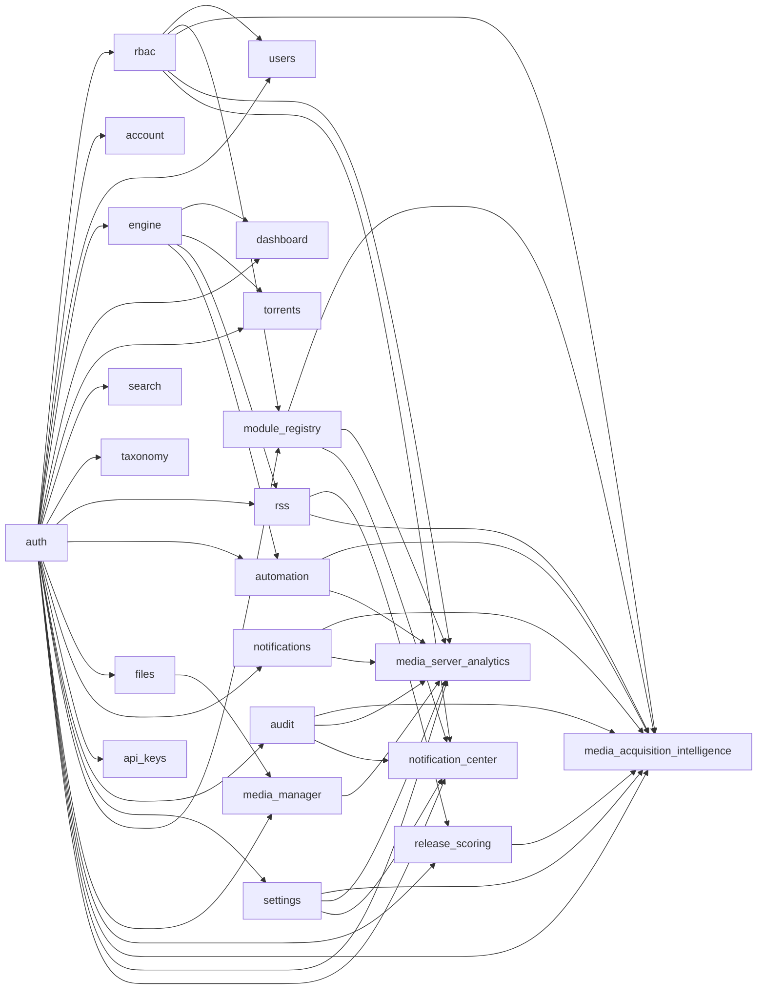

# Module Reference

:::info Auto-generated
This page is generated from `apps/backend/src/modules/module-registry/manifests.ts` at build time. **Do not edit it by hand** — change the source and rebuild. This guarantees the reference always matches the code that ships.
:::

UltraTorrent is built as a **module registry**. Each module declares a manifest — its id,
tier, dependencies, the permissions it introduces and the API routes it owns. The registry
resolves the dependency graph at boot and refuses to start on an unknown or circular
dependency, so a broken module can never half-load.

- **23 modules** across tiers: `core`, `community`
- **Core** modules are always on. **Community/optional** modules can be toggled.

## Dependency graph

## All modules

| Module | Id | Tier | On by default | Depends on |
| --- | --- | --- | :---: | --- |
| **Authentication** | `auth` | core | ✅ | — |
| **Access control (RBAC)** | `rbac` | core | ✅ | `auth` |
| **Account & security** | `account` | core | ✅ | `auth` |
| **Users** | `users` | core | ✅ | `auth`, `rbac` |
| **Torrent engine** | `engine` | core | ✅ | `auth` |
| **Dashboard** | `dashboard` | core | ✅ | `auth`, `engine` |
| **Torrents** | `torrents` | core | ✅ | `auth`, `engine` |
| **Search** | `search` | core | ✅ | `auth` |
| **Categories & tags** | `taxonomy` | core | ✅ | `auth` |
| **RSS automation** | `rss` | core | ✅ | `auth`, `engine` |
| **Automation** | `automation` | core | ✅ | `auth`, `engine` |
| **File manager** | `files` | core | ✅ | `auth` |
| **Notifications** | `notifications` | core | ✅ | `auth` |
| **API keys** | `api_keys` | core | ✅ | `auth` |
| **Audit log** | `audit` | core | ✅ | `auth` |
| **System health** | `system` | core | ✅ | — |
| **Settings** | `settings` | core | ✅ | `auth` |
| **Module registry** | `module_registry` | core | ✅ | `auth`, `rbac` |
| **Media Manager** | `media_manager` | community | ✅ | `auth`, `files` |
| **Release Scoring** | `release_scoring` | community | ✅ | `auth`, `rss` |
| **Media Acquisition Intelligence** | `media_acquisition_intelligence` | community | ✅ | `auth`, `rbac`, `module_registry`, `audit`, `notifications`, `settings`, `rss`, `automation`, `release_scoring` |
| **Media Server Analytics** | `media_server_analytics` | core | ✅ | `auth`, `rbac`, `module_registry`, `audit`, `notifications`, `settings`, `media_manager`, `automation` |
| **Notification Center** | `notification_center` | core | ✅ | `auth`, `rbac`, `module_registry`, `audit`, `settings` |

## Authentication

`auth` · tier `core` · enabled by default

Login, sessions, refresh-token rotation.

**Owns routes:** `/api/auth`

## Access control (RBAC)

`rbac` · tier `core` · enabled by default

Roles, permissions, and route guards.

**Depends on:** `auth`

**Introduces permissions:** `roles.manage`

## Account & security

`account` · tier `core` · enabled by default

Self-service profile, password, and 2FA.

**Depends on:** `auth`

**Owns routes:** `/api/account`

## Users

`users` · tier `core` · enabled by default

User management and role assignment.

**Depends on:** `auth`, `rbac`

**Introduces permissions:** `users.view`, `users.manage`

**Owns routes:** `/api/users`

## Torrent engine

`engine` · tier `core` · enabled by default

Engine provider abstraction (rTorrent) + registry.

**Depends on:** `auth`

**Introduces permissions:** `system.view`, `engines.manage`

**Owns routes:** `/api/engines`

## Dashboard

`dashboard` · tier `core` · enabled by default

Aggregated stats and recent activity.

**Depends on:** `auth`, `engine`

**Introduces permissions:** `torrents.view`

**Owns routes:** `/api/dashboard`

## Torrents

`torrents` · tier `core` · enabled by default

Torrent list, detail, lifecycle, bulk actions.

**Depends on:** `auth`, `engine`

**Introduces permissions:** `torrents.view`, `torrents.add`, `torrents.delete`

**Owns routes:** `/api/torrents`

## Search

`search` · tier `core` · enabled by default

Search persisted torrent snapshots.

**Depends on:** `auth`

**Introduces permissions:** `torrents.view`

**Owns routes:** `/api/search`

## Categories & tags

`taxonomy` · tier `core` · enabled by default

Organise torrents with categories and tags.

**Depends on:** `auth`

**Introduces permissions:** `categories.manage`, `tags.manage`

**Owns routes:** `/api/categories`, `/api/tags`

## RSS automation

`rss` · tier `core` · enabled by default

Feeds, ranked match candidates, and the Smart Match Builder.

**Depends on:** `auth`, `engine`

**Introduces permissions:** `rss.view`, `rss.manage`, `rss.show_status.lookup`, `rss.show_status.refresh`, `rss.show_status.override`

**Owns routes:** `/api/rss`

## Automation

`automation` · tier `core` · enabled by default

Trigger/condition/action rule engine.

**Depends on:** `auth`, `engine`

**Introduces permissions:** `automation.view`, `automation.manage`

**Owns routes:** `/api/automation`

## File manager

`files` · tier `core` · enabled by default

Path-safe browsing and file operations.

**Depends on:** `auth`

**Introduces permissions:** `files.view`, `files.manage`

**Owns routes:** `/api/files`

## Notifications

`notifications` · tier `core` · enabled by default

In-app feed + multi-channel fan-out.

**Depends on:** `auth`

**Introduces permissions:** `notifications.manage`

**Owns routes:** `/api/notifications`

## API keys

`api_keys` · tier `core` · enabled by default

Personal API key issue/list/revoke.

**Depends on:** `auth`

**Introduces permissions:** `apikeys.manage`

**Owns routes:** `/api/api-keys`

## Audit log

`audit` · tier `core` · enabled by default

Append-only audit trail of sensitive actions.

**Depends on:** `auth`

**Introduces permissions:** `audit.view`

**Owns routes:** `/api/audit`

## System health

`system` · tier `core` · enabled by default

Liveness/readiness probes and health reporting.

**Introduces permissions:** `system.view`

**Owns routes:** `/api/system`

## Settings

`settings` · tier `core` · enabled by default

Key/value application settings.

**Depends on:** `auth`

**Introduces permissions:** `settings.view`, `settings.manage`

**Owns routes:** `/api/settings`

## Module registry

`module_registry` · tier `core` · enabled by default

Enable/disable optional modules.

**Depends on:** `auth`, `rbac`

**Introduces permissions:** `modules.view`, `modules.manage`

**Owns routes:** `/api/modules`

## Media Manager

`media_manager` · tier `community` · enabled by default

Scan, identify, enrich, and organise your media libraries: library scanning, filename identification, metadata/artwork/subtitles, duplicate detection, NFO generation, rename/move for media servers, and a health dashboard.

**Depends on:** `auth`, `files`

**Introduces permissions:** `media_manager.view`, `media_manager.manage_libraries`, `media_manager.scan`, `media_manager.match`, `media_manager.edit_metadata`, `media_manager.manage_artwork`, `media_manager.manage_subtitles`, `media_manager.rename`, `media_manager.move_files`, `media_manager.generate_nfo`, `media_manager.manage_integrations`, `media_manager.delete`, `media_manager.admin`, `media_manager.imdb.view`, `media_manager.imdb.configure`, `media_manager.imdb.import_dataset`, `media_manager.imdb.search`, `media_manager.imdb.match`

**Owns routes:** `/api/media`

## Release Scoring

`release_scoring` · tier `community` · enabled by default

Explainable 0–100 scoring of RSS releases with reasons, warnings, and a recommendation.

**Depends on:** `auth`, `rss`

**Introduces permissions:** `release_scoring.view`, `release_scoring.manage`

**Owns routes:** `/api/release-scoring`

## Media Acquisition Intelligence

`media_acquisition_intelligence` · tier `community` · enabled by default

Decides what media to acquire from library gaps, release quality, duplicate risk, watchlists, acquisition profiles, and automation context — explainable decisions, never direct file operations.

**Depends on:** `auth`, `rbac`, `module_registry`, `audit`, `notifications`, `settings`, `rss`, `automation`, `release_scoring`

**Introduces permissions:** `media_acquisition.view`, `media_acquisition.manage_watchlist`, `media_acquisition.manage_profiles`, `media_acquisition.evaluate`, `media_acquisition.approve`, `media_acquisition.reject`, `media_acquisition.override`, `media_acquisition.history`, `media_acquisition.export`, `media_acquisition.settings`

**Owns routes:** `/api/media-acquisition`

## Media Server Analytics

`media_server_analytics` · tier `core` · enabled by default

Media server monitoring, analytics, recently-added, watch history, live activity, user/library statistics, scheduled newsletters, and Tautulli analytics import — across Plex, Jellyfin, Emby, and Kodi.

**Depends on:** `auth`, `rbac`, `module_registry`, `audit`, `notifications`, `settings`, `media_manager`, `automation`

**Introduces permissions:** `media_server_analytics.view`, `media_server_analytics.manage_connections`, `media_server_analytics.manage_mappings`, `media_server_analytics.view_live_activity`, `media_server_analytics.view_users`, `media_server_analytics.view_history`, `media_server_analytics.view_reports`, `media_server_analytics.export`, `media_server_analytics.manage_newsletters`, `media_server_analytics.send_newsletters`, `media_server_analytics.manage_imports`, `media_server_analytics.run_imports`, `media_server_analytics.manage_settings`, `media_server_analytics.admin`

**Owns routes:** `/api/media-server-analytics`

## Notification Center

`notification_center` · tier `core` · enabled by default

The centralized, provider-driven messaging platform. Every module publishes events; configurable rules decide if/when/how/to-whom notifications are delivered across Email, SMS, Telegram, WhatsApp and future providers — with templates, recipients, groups, a delivery queue, retries, quiet hours, dedup, escalation, and full delivery history.

**Depends on:** `auth`, `rbac`, `module_registry`, `audit`, `settings`

**Introduces permissions:** `notifications.view`, `notifications.manage_channels`, `notifications.manage_templates`, `notifications.manage_rules`, `notifications.manage_recipients`, `notifications.manage_groups`, `notifications.view_history`, `notifications.retry`, `notifications.send_test`, `notifications.manage_preferences`, `notifications.manage_settings`, `notifications.admin`

**Owns routes:** `/api/notifications`

## See also

- [Permissions Reference](/reference/permissions)
- [REST API Reference](/reference/api)
- [Writing a module](/develop/creating-modules)
