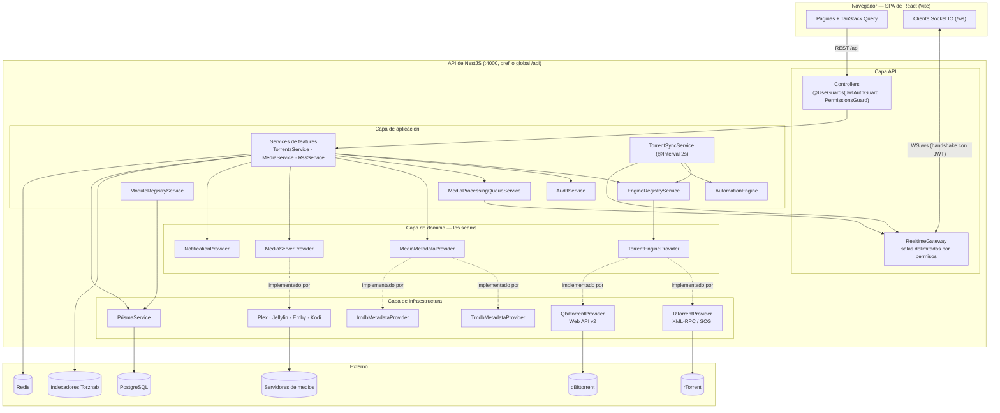
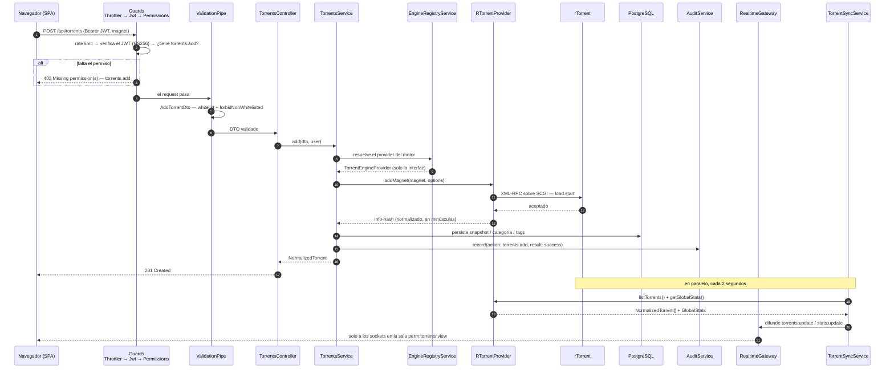

# Arquitectura

## Resumen

UltraTorrent es una **plataforma de adquisición y gestión de medios del lado del servidor**.
El navegador nunca le habla a un motor de torrents: la SPA de React le habla a la API de
UltraTorrent, que traduce cada request al protocolo nativo del motor y devuelve datos
**normalizados**, agnósticos del motor. Las actualizaciones en vivo se empujan por un
WebSocket delimitado por permisos.

```text
        React SPA  ── REST /api ──▶  NestJS API  ── XML-RPC/SCGI ──▶  rTorrent
             ▲         WS /ws           │         ── Web API v2  ──▶  qBittorrent
             └──────── live events ─────┘         PostgreSQL (Prisma) · Redis
```

:::info La fuente de verdad
`docs/ARCHITECTURE.md` en el repositorio es el documento canónico de arquitectura, y lleva
un Change Log con fechas. Esta página es la vista de ese documento para quien contribuye. Si
alguna vez los dos se contradicen, gana el documento del repo — y alguien debería arreglar
esta página.
:::

## Propósito

Explicar la forma del código lo suficientemente bien como para que puedas poner un cambio en
el lugar correcto: cuál capa, cuál módulo, cuál seam.

## Cuándo usarla

Léela antes de tu primer cambio no trivial, y otra vez antes de introducir una nueva
integración o una nueva interacción entre módulos.

## Requisitos previos

- [Aprende → Resumen de arquitectura](/learn/architecture-overview) para la vista orientada al usuario.
- Un checkout del repo; todas las rutas de archivo de abajo son reales.

## Conceptos

### Estructura del monorepo

Tres workspaces de npm:

| Workspace | Paquete | Qué es |
| --- | --- | --- |
| `apps/backend` | `@ultratorrent/backend` | API de NestJS, Prisma, los adaptadores de motores |
| `apps/frontend` | `@ultratorrent/frontend` | SPA de React 18 + Vite + TypeScript + Tailwind |
| `packages/shared` | `@ultratorrent/shared` | Tipos, el catálogo de permisos, los nombres de eventos WS |

`packages/shared` es la lingua franca. Todo lo que ambos lados necesitan — una clave de
permiso, el nombre de un evento, un `NormalizedTorrent` — vive ahí exactamente una vez. El
orden de build es **shared → backend → frontend**; las apps consumen el paquete shared *ya
construido*, así que cuando editas tipos en shared tienes que reconstruir (o correr su build
en modo watch) para que los demás los vean.

El sitio de documentación (`website/`) deliberadamente **no** es un workspace, para que la
documentación nunca pueda romper el build de la aplicación.

### Clean Architecture, impuesta por los imports

```text
apps/backend/src/
├── common/          cross-cutting: @Public, @CurrentUser, @RequirePermissions, SSRF, crypto
├── config/          typed configuration + insecure-secret detection
├── domain/          framework-free contracts — TorrentEngineProvider lives here
├── infrastructure/  concrete adapters — RTorrentProvider, QbittorrentProvider, PrismaService
└── modules/         feature modules — controllers (API) + services (application)
```

La regla de dependencias: **las capas internas nunca importan capas externas.** `domain` no
importa nada específico de un framework. `modules` dependen de las interfaces de `domain`.
`infrastructure` *implementa* las interfaces de `domain`. Ningún controller, service o
componente de React referencia jamás un tipo específico de rTorrent o de qBittorrent.

### Módulos y el registro

Cada capacidad es un module de NestJS *más un manifest*. `ModuleRegistryService` carga
`ALL_MANIFESTS` al arrancar, valida cada manifest, verifica que toda dependencia declarada
exista, detecta ciclos con un DFS de tres colores, y entonces calcula el estado de ejecución
de cada módulo hasta llegar a un punto fijo:

```ts
// apps/backend/src/modules/module-registry/module-registry.service.ts
// Punto fijo: un módulo solo puede estar habilitado si todas sus dependencias lo están.
const enabled = new Map(want);
let changed = true;
while (changed) {
  changed = false;
  for (const m of this.manifests) {
    if (!enabled.get(m.id)) continue;
    if (m.dependencies.some((d) => !enabled.get(d))) {
      enabled.set(m.id, false);
      changed = true;
    }
  }
}
```

Los módulos core están `locked` y nunca pueden deshabilitarse. Deshabilitar un módulo que
tiene dependientes habilitados se rechaza. Ver [Crear módulos](/develop/creating-modules).

### Providers

El mecanismo de extensibilidad de la plataforma. Los services de la capa de aplicación
dependen de una **interfaz**; una factory o un registro construye el adaptador concreto. El
seam principal:

```ts
// apps/backend/src/domain/engine/torrent-engine-provider.interface.ts
export interface TorrentEngineProvider {
  readonly engineId: string;
  readonly kind: EngineKind;

  connect(): Promise<void>;
  disconnect(): Promise<void>;
  healthCheck(): Promise<EngineHealth>;

  listTorrents(): Promise<NormalizedTorrent[]>;
  getTorrent(hash: string): Promise<NormalizedTorrent | null>;
  // …add / remove / start / stop / recheck / move / priorities / trackers / limits
}
```

Ver [Providers](/develop/providers) para el modelo completo, incluyendo capacidades y
`UnsupportedCapabilityError`.

### Acoplamiento por eventos

Los módulos no se llaman entre sí directamente cuando pueden evitarlo. Tres mecanismos
cargan los eventos de dominio:

1. **`RealtimeGateway`** empuja los cambios de estado a salas de socket delimitadas por permisos.
2. **El motor de automatización** convierte eventos de dominio en reglas de condición/acción
   definidas por el usuario.
3. **`MediaProcessingQueueService`** convierte reacciones de larga duración en trabajos
   rastreados cuyo ciclo de vida se emite a su vez como eventos.

También hay un bus interno (`@nestjs/event-emitter`, configurado con
`{ wildcard: true, delimiter: '.' }` en `app.module.ts`) al que el Centro de Notificaciones
se suscribe vía `NOTIFICATION_BUS_CHANNEL`.

## Diagrama de componentes



## Ciclo de vida de un request

Un request a la API pasa por un pipeline fijo, todo cableado en
`apps/backend/src/bootstrap.ts` y `app.module.ts`:

1. **Helmet** + **cookie-parser**, con `trust proxy` en 1 (para que `req.ip` sea el cliente
   real detrás de nginx/Caddy — el rate limiting y la auditoría dependen de eso).
2. **Prefijo global** `api`, CORS desde `corsOrigin`.
3. **`ThrottlerGuard`** — un guard global, `ThrottlerModule.forRoot([{ ttl: 60_000, limit: 120 }])`,
   con límites más estrictos en login/refresh.
4. **`JwtAuthGuard`** — Passport JWT; las rutas con `@Public()` lo saltan.
5. **`PermissionsGuard`** — lee la metadata de `@RequirePermissions(...)` y la hace cumplir.
6. **`ValidationPipe`** — `whitelist: true`, `forbidNonWhitelisted: true`, `transform: true`.
   Una propiedad desconocida en el body es un 400, no un pase silencioso.
7. **Controller → service → Prisma/provider.**
8. **`AllExceptionsFilter`** — un filtro global; ningún stack trace se filtra a los clientes.



Dos cosas de ese diagrama que vale la pena interiorizar:

- **La ruta de escritura no empuja la actualización.** El poll de 2 segundos de
  `TorrentSyncService` es lo que reparte el estado por WebSocket. La mutación solo muta.
- **El socket está delimitado por permisos.** `RealtimeGateway.roomForEvent()` mapea el
  nombre de un evento a una sala `perm:<key>`, y un socket solo entra a las salas de los
  permisos que tiene. Un usuario nunca puede recibir datos en vivo que no pudiera leer por
  REST.

## Datos y caché

**PostgreSQL** vía **Prisma** es el almacén — usuarios/roles/permisos, snapshots de torrents,
categorías/etiquetas, RSS, automatización, notificaciones, claves API, el registro de
auditoría, la configuración y todo el modelo del Gestor de Medios. **Redis** respalda el
caché y la coordinación de trabajos en segundo plano. **No hay un broker de colas externo**:
el trabajo en segundo plano son intervalos de `@nestjs/schedule` más una cola de trabajos
en proceso. Ver [Trabajos en segundo plano](/develop/background-jobs) — lo de "en proceso"
tiene consecuencias reales que necesitas conocer.

## Frontend

React 18 + Vite + TypeScript + Tailwind, React Router, **TanStack Query** para el estado del
servidor, y un cliente Socket.IO para las actualizaciones en vivo. El shell de la app tiene
una barra lateral agrupada y colapsable cuyos elementos se filtran por **permiso + estado del
módulo**, guards de ruta `ProtectedRoute` / `ModuleRoute`, y una barra superior con
breadcrumbs, tasas de transferencia en vivo y estado de conexión. La navegación se define en
código en `navigation.ts`.

La UI está completamente localizada con i18next — **en-US** (predeterminado/fallback) y
**es-PR**, con paridad de claves obligatoria. Ver [Internacionalización](/develop/i18n).

## Solución de problemas

| Síntoma | Causa probable |
| --- | --- |
| Un campo del DTO se descarta en silencio | No está declarado en el DTO. `forbidNonWhitelisted` debería dar 400 en su lugar — verifica que el campo realmente esté en el body. |
| 403 con un token correcto | El rol no tiene el `@RequirePermissions` de la ruta. `SUPER_ADMIN` lo salta. |
| El WS conecta y se desconecta de inmediato | El JWT del handshake no pasó la verificación — `handleConnection` lo atrapa y llama a `client.disconnect(true)`. |
| El frontend tiene un tipo de shared desactualizado | `@ultratorrent/shared` no se reconstruyó. |
| Error de DI de Nest solo en un build limpio | `tsc` y las pruebas unitarias no ejercitan el cableado de módulos. Arranca un build limpio. |

## Consejos

- **`tsc` limpio ≠ arranca.** El chequeo de tipos y las pruebas unitarias no detectan errores
  de DI ni de cableado de módulos de NestJS. Antes de dar un cambio por terminado, arranca un
  build limpio.
- **Ciclos.** Si dos módulos se necesitan mutuamente, una de las direcciones debe pasar por el
  bus de eventos o por un `ModuleRef.get(...)` diferido. `AutomationModule` y `RssModule`
  hacen exactamente eso (un `forwardRef` para el ciclo de orden de carga de los módulos ES,
  y `ModuleRef` para la llamada).
- **`@Global()` con moderación.** `EngineModule`, `AuditModule` y `RealtimeModule` son
  globales porque todo los necesita. Tu módulo probablemente no lo es.

## Preguntas frecuentes

**¿Por qué existe un `LicenseProvider` si el producto no tiene ediciones?**
Es un seam de una línea para que la regla "¿está disponible este módulo?" viva en un solo
lugar. La app enlaza `CommunityLicenseProvider`, bajo el cual todos los módulos están
disponibles. La disponibilidad *nunca* es autorización — eso siempre es RBAC.

**¿Dónde se emiten los eventos de dominio?**
`TorrentSyncService.detectTransitions()` compara cada poll de 2s contra el snapshot
persistido y dispara los triggers de torrents. Las etapas del pipeline de medios disparan
`media.*`. RSS dispara `rss.*` a través de `ModuleRef` (de forma diferida, para mantener el
grafo de DI acíclico).

**¿La API tiene versiones?**
La superficie HTTP está bajo el prefijo global `api` sin un segmento de versión. Swagger en
`/api/docs` (solo fuera de producción) es el contrato vivo.

## Lista de verificación

- [ ] Mi cambio respeta la regla de dependencias (ningún import de `domain` → `infrastructure`).
- [ ] Ningún tipo específico de un motor se escapa de un provider.
- [ ] Todo lo que la UI también necesita vive en `packages/shared`.
- [ ] No creé un ciclo de dependencias entre módulos.
- [ ] Arranqué un build limpio, no solo `tsc`.

## Ver también

- [Providers](/develop/providers) — el modelo de extensión en detalle
- [Crear módulos](/develop/creating-modules) — manifest → ruta → UI
- [WebSockets](/develop/websockets) — el gateway de tiempo real
- [Trabajos en segundo plano](/develop/background-jobs) — schedulers y la cola de procesamiento
- [Base de datos y Prisma](/develop/database)
- [Aprende → Resumen de arquitectura](/learn/architecture-overview)
