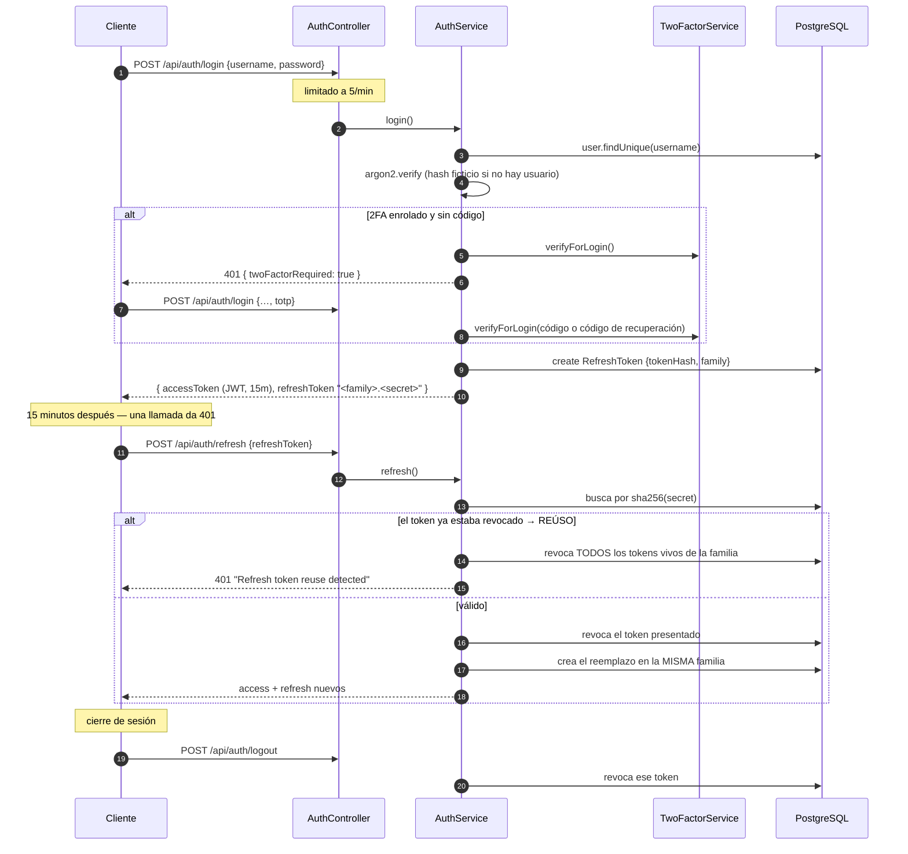

# Autenticación

## Resumen

UltraTorrent autentica con hashing de contraseñas **Argon2id**, **access tokens JWT HS256 de
vida corta**, y **refresh tokens rotativos, hasheados y con detección de reúso**. Opcionalmente
hay **dos factores TOTP** por usuario. Los secretos en reposo (semillas TOTP, credenciales de
integraciones) se cifran con AES-256-GCM.

## Propósito

Entender exactamente cuál es el ciclo de vida de los tokens, para que no lo debilites sin
querer — y para que sepas cuál es el único lugar donde un cambio de permisos *no* es
instantáneo.

## Requisitos previos

- [RBAC](/develop/rbac) — para qué se usa el principal una vez existe.
- [Referencia de entorno](/reference/environment) — las variables de secretos.

## Conceptos

### Contraseñas

`argon2` (variante `argon2id`) con los parámetros de costo por defecto de la librería. El
login verifica contra un **hash ficticio cuando el usuario no existe**, así que un nombre de
usuario inexistente y una contraseña incorrecta toman el mismo tiempo y devuelven el mismo
error — no hay enumeración de usuarios:

```ts
// apps/backend/src/modules/auth/auth.service.ts
const hash =
  user?.passwordHash ??
  '$argon2id$v=19$m=65536,t=3,p=4$AAAAAAAAAAAAAAAAAAAAAA$AAAA…';
const valid = await argon2.verify(hash, password).catch(() => false);
if (!user || !valid || !user.isActive) {
  throw new UnauthorizedException('Invalid credentials');
}
```

### El access token

Un JWT firmado, con el **algoritmo fijado a HS256**, que carga el principal completo:

```ts
// apps/backend/src/modules/auth/auth.service.ts
const accessToken = await this.jwt.signAsync(
  {
    sub: authUser.id,
    username: authUser.username,
    roles: authUser.roles,             // nombres de los roles
    permissions: authUser.permissions, // claves de permisos, sin duplicados
    type: 'access',
  },
  {
    secret: this.config.get<string>('jwt.accessSecret'),
    expiresIn: this.config.get<string>('jwt.accessTtl'),   // JWT_ACCESS_TTL, default 15m
  },
);
```

`roles` y `permissions` se aplanan en el login a partir de
`User → UserRole → Role → RolePermission → Permission`.

La strategy reconstruye el principal **solo a partir de los claims** — no hay ninguna lectura
a la base de datos por request:

```ts
// apps/backend/src/modules/auth/strategies/jwt.strategy.ts
async validate(payload: JwtPayload): Promise<AuthenticatedUser> {
  if (payload.type !== 'access') {
    throw new UnauthorizedException('Invalid token type');
  }
  return {
    id: payload.sub,
    username: payload.username,
    roles: payload.roles ?? [],
    permissions: payload.permissions ?? [],
  };
}
```

Eso es rápido, y es la razón por la cual **un cambio de rol o una desactivación no toman
efecto hasta que el access token expira**. Para un corte inmediato también tienes que revocar
la familia de refresh — que es exactamente lo que hace `changePassword`.

### El refresh token — no es un JWT

Los refresh tokens son **48 bytes aleatorios**, en base64url. El formato en el cable es
`<family>.<secret>`, y **solo se guarda un hash SHA-256 de la mitad secreta**:

```ts
// apps/backend/src/modules/auth/auth.service.ts
const refreshRaw = randomBytes(48).toString('base64url');
const tokenFamily = family ?? randomUUID();
await this.prisma.refreshToken.create({
  data: {
    userId: authUser.id,
    tokenHash: this.hashToken(refreshRaw),   // sha256 hex
    family: tokenFamily,
    userAgent: ctx.userAgent,
    ipAddress: ctx.ipAddress,
    expiresAt,
  },
});
const refreshToken = `${tokenFamily}.${refreshRaw}`;
```

Usar SHA-256 en vez de Argon2 aquí es deliberado y correcto: el token tiene 384 bits de
entropía, así que no es susceptible a fuerza bruta — el hash existe para que una filtración de
la base de datos sea inútil, no para frenar a quien adivina.

### Rotación y detección de reúso

Cada refresh **rota**: el token presentado se revoca y se emite uno nuevo *dentro de la misma
familia*. Si se vuelve a presentar un token que **ya fue rotado**, eso es señal de un token
robado — la familia entera se quema:

```ts
// apps/backend/src/modules/auth/auth.service.ts
if (!stored || stored.family !== family) {
  throw new UnauthorizedException('Invalid refresh token');
}
if (stored.revokedAt) {
  // Reúso de un token ya rotado → compromiso. Quema la familia completa.
  await this.prisma.refreshToken.updateMany({
    where: { family, revokedAt: null },
    data: { revokedAt: new Date() },
  });
  throw new UnauthorizedException('Refresh token reuse detected');
}
```

La consecuencia práctica: quien roba un refresh token consigue **un** uso antes de que el
próximo refresh del cliente legítimo active el detector y saque de sesión a todo el mundo en
esa familia. El usuario se da cuenta. Ese es el punto.

El refresh también vuelve a revisar `isActive` — a una cuenta desactivada se le revocan todos
los tokens vivos y se le rechaza el refresh.

### Dos factores (TOTP)

- Librería: **`otplib`**, `authenticator` con `options = { window: 1 }` (desfase de ±1 × 30s).
- La semilla TOTP se guarda **cifrada** en `User.totpSecret` vía `SecretCipher` — AES-256-GCM,
  con salida `base64(iv(12) | authTag(16) | ciphertext)` y la clave derivada como
  `sha256(ENCRYPTION_KEY)`.
- **Códigos de recuperación**: 10 por generación, 80 bits cada uno, con formato
  `xxxxx-xxxxx-xxxxx-xxxxx`, guardados **hasheados** en `User.recoveryCodes` y consumidos al
  usarse.
- Enrolamiento por código QR vía `qrcode`.

Los endpoints viven en el módulo **account**, no en el módulo two-factor (que no tiene
controller):

| Ruta | Propósito |
| --- | --- |
| `GET /api/account/2fa` | Estado |
| `POST /api/account/2fa/setup` | Comenzar el enrolamiento (devuelve el QR / el secreto) |
| `POST /api/account/2fa/enable` | Confirmar con un código |
| `POST /api/account/2fa/disable` | Confirmado con contraseña |
| `POST /api/account/2fa/recovery` | Regenerar códigos (confirmado con TOTP) |

La verificación al momento del login corre dentro de `AuthService.login`, que lanza una
`TwoFactorRequiredException` dedicada que carga `twoFactorRequired: true` para que el cliente
sepa que debe pedir el código en vez de mostrar "contraseña incorrecta".

:::caution `ENCRYPTION_KEY` no se puede rotar en el sitio
De ella se deriva la clave AES que descifra las semillas TOTP guardadas. **Cambiarla invalida
todos los secretos de 2FA enrolados** — los usuarios tienen que volver a enrolarse.
:::

### Claves API

`POST /api/api-keys` acuña una clave: un prefijo `ut_<12 hex>` más un secreto base64url de 24
bytes. El secreto se **hashea con Argon2id** en `ApiKey.keyHash`, y la clave completa
(`<prefix>.<secret>`) se devuelve exactamente una vez, al crearla.

:::danger Hoy las claves API no pueden autenticar un request
Esto es una brecha verificada, no una omisión de esta documentación. **No hay guard, strategy,
middleware ni interceptor de claves API** en ninguna parte del backend: `keyHash` lo escribe
`apikeys.module.ts` y **nunca se lee**, nunca se llama a `argon2.verify` contra él, y no
existe ninguna búsqueda por `prefix`. Por consiguiente `ApiKey.lastUsedAt` y
`ApiKey.expiresAt` nunca se llenan ni se hacen cumplir, y `ApiKey.scopes` se guarda pero nunca
se revisa.

Las tres rutas (`GET` / `POST` / `DELETE /api/api-keys`, protegidas con
`@RequirePermissions(PERMISSIONS.APIKEYS_MANAGE)`) te dejan acuñar, listar y revocar claves —
pero una clave acuñada no va a autenticar nada. **Usa un JWT.** El esquema está listo para un
flujo de búsqueda-y-verificación (`ApiKey.prefix` es `@unique`); cablear el guard es trabajo
pendiente.
:::

### Límites de tasa

`ThrottlerGuard` es el único guard **global**
(`ThrottlerModule.forRoot([{ ttl: 60_000, limit: 120 }])`). Las rutas de auth son más
estrictas: **login 5/min**, **refresh 20/min**.

### Validación de secretos al arrancar

```ts
// apps/backend/src/bootstrap.ts
const secretProblems = findInsecureSecrets({
  accessSecret: config.get<string>('jwt.accessSecret') ?? '',
  encryptionKey: config.get<string>('encryptionKey') ?? '',
});
if (secretProblems.length) {
  const detail = secretProblems.map((p) => `  - ${p}`).join('\n');
  if (process.env.NODE_ENV === 'production') {
    throw new Error(
      `Refusing to start: insecure secret configuration:\n${detail}\n` +
        'Set strong, distinct JWT_ACCESS_SECRET and ENCRYPTION_KEY (>=32 random chars).',
    );
  }
  bootLogger.warn(`Insecure secrets (OK for dev, NOT production):\n${detail}`);
}
```

`findInsecureSecrets` marca: sin definir, un valor por defecto conocido, más corto de 32
caracteres, o `ENCRYPTION_KEY === JWT_ACCESS_SECRET`. En producción es una negativa rotunda a
arrancar — un secreto conocido le permite a un atacante falsificar un token `SUPER_ADMIN`, lo
que es un bypass total de la autenticación.

## Diagrama — el ciclo de vida de los tokens



## El lado del cliente

La SPA guarda los tokens en localStorage bajo `ultratorrent.auth` y hace refresh **una sola
vez** ante un 401, con un guard de single-flight para que una ráfaga de 401s en paralelo
produzca un solo refresh:

```ts
// apps/frontend/src/lib/api.ts
let refreshInFlight: Promise<boolean> | null = null;

async function performRefresh(): Promise<boolean> {
  if (!tokens?.refreshToken) return false;
  if (refreshInFlight) return refreshInFlight;      // single-flight
  refreshInFlight = (async () => {
    try {
      const res = await fetch(`${API_URL}/auth/refresh`, { /* … */ });
      if (!res.ok) { setTokens(null); return false; }
      storeLoginResponse((await res.json()) as LoginResponse);
      return true;
    } catch { setTokens(null); return false; }
    finally { refreshInFlight = null; }
  })();
  return refreshInFlight;
}
```

…y dentro de `request()`:

```ts
if (res.status === 401 && auth && !_retry && tokens?.refreshToken) {
  const refreshed = await performRefresh();
  if (refreshed) return request<T>(path, { ...options, _retry: true });
}
```

La bandera `_retry` es un guard contra la recursión: un request se reintenta **exactamente una
vez**. El cliente de WebSocket se vuelve a autenticar contra el mismo almacén de tokens
(`wsClient.reauthenticate()`).

## Solución de problemas

| Síntoma | Causa | Solución |
| --- | --- | --- |
| `401 Refresh token reuse detected` y todo el mundo queda fuera de sesión | Se reprodujo un refresh token ya rotado — o un robo genuino, o un cliente que cacheó y reenvió un token viejo. | Vuelve a iniciar sesión. Si se repite, busca el cliente que no está guardando el token rotado. |
| El rol nuevo de un usuario no funciona por ~15 minutos | Los permisos son claims dentro del access token; no hay lectura a la base de datos por request. | Es lo esperado. Fuerza un nuevo login si lo necesitas de inmediato. |
| `Refusing to start: insecure secret configuration` | Arranque en producción con secretos débiles/por defecto/idénticos. | Genera ambos con `openssl rand -base64 48`, y hazlos **distintos**. |
| El 2FA de todo el mundo se rompió tras un redeploy | Cambió `ENCRYPTION_KEY`. | Restaura la clave anterior, o haz que los usuarios se vuelvan a enrolar. |
| Una clave API devuelve 401 en cada llamada | La autenticación por clave API no está implementada (ver arriba). | Usa un JWT. |
| El login dice "Invalid credentials" para un usuario que acabas de crear con el seed | El seed no sobrescribe la contraseña de un usuario existente (`update: {}`). | Usa la contraseña original, o borra la fila y corre el seed de nuevo. |

## Consejos

- **Nunca registres un token en los logs.** Ni el access token, ni el refresh token, ni la
  semilla TOTP.
- **`JWT_REFRESH_SECRET` es configuración muerta.** Está declarada en `configuration.ts` y en
  `.env.example` pero nunca se consume — los refresh tokens son bytes aleatorios, no JWTs
  firmados. Definirla no hace nada.
- **El `expiresIn` de la respuesta de login está fijo en `15 * 60`** mientras que el token
  mismo se firma con el `jwt.accessTtl` configurable. Si cambias `JWT_ACCESS_TTL`, el
  `expiresIn` reportado va a estar mal aunque la vida real del token sea correcta. No
  construyas un cliente que confíe en ese campo por encima del `exp` del propio JWT.
- **La revocación es de familia completa, por diseño.** Eso es lo que hace detectable el robo.

## Preguntas frecuentes

**¿Por qué está todo el conjunto de permisos dentro del JWT?**
Velocidad — elimina un viaje a la base de datos en cada request. El costo es la ventana de
hasta 15 minutos de desactualización descrita arriba. Es un intercambio explícito.

**¿Puedo acortar el TTL del access token?**
`JWT_ACCESS_TTL` (por defecto `15m`). Más corto significa una ventana de revocación más
ajustada y más tráfico de refresh.

**¿Los refresh tokens están atados a un dispositivo?**
Registran `userAgent` e `ipAddress` al emitirse, pero la comprobación es familia + hash, no
una atadura al dispositivo.

**¿Dónde está la cobertura de pruebas?**
:::caution Aún no verificado por pruebas
El único spec bajo `modules/auth/` es `guards/permissions.guard.spec.ts`. **La rotación de
refresh tokens y la detección de reúso no tienen cobertura de pruebas**, y no existe un
`auth.service.spec.ts` ni un `two-factor.service.spec.ts`. Si tocas este código, añadir esas
pruebas es la contribución de mayor valor que puedes hacer.
:::

## Lista de verificación

- [ ] No añadí una consulta a la base de datos por request en `JwtStrategy` sin medirla.
- [ ] No registré en logs ningún token, semilla ni secreto.
- [ ] Todo secreto nuevo en reposo pasa por `SecretCipher` (AES-256-GCM), no en texto plano.
- [ ] Toda ruta nueva cercana a auth está limitada con throttling.
- [ ] Los cambios de comportamiento de login/refresh vienen con pruebas (hoy no hay ninguna).

## Ver también

- [RBAC](/develop/rbac) — qué autoriza el principal
- [Referencia de entorno](/reference/environment) — `JWT_ACCESS_SECRET`, `ENCRYPTION_KEY`, los TTLs
- [Referencia de la API](/reference/api) — los endpoints de auth
- [Módulos → Claves API](/modules/api-keys) · [Usuarios](/modules/users)
- [Opera → Seguridad](/operate/security)
