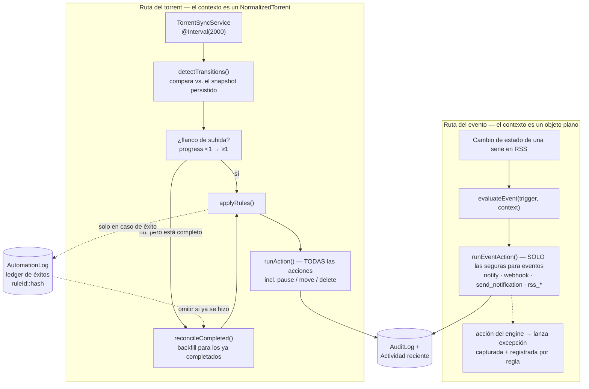
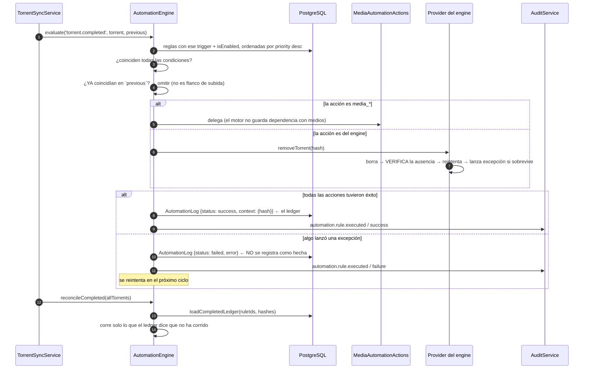

# Automatización

## Resumen

El motor de automatización convierte **eventos del dominio** en **reglas definidas por el
usuario**: se dispara un *trigger*, se verifican las *condiciones* de la regla y corren sus
*acciones*. Las reglas se guardan (`AutomationRule`), se evalúan en orden de `priority`, y
cada ejecución queda registrada (`AutomationLog`) y reflejada en el registro de auditoría.

El catálogo completo se expone a la UI en `GET /api/automation/catalog`.

## Propósito

Permitirle a un operador expresar "cuando pase X, haz Y" sin escribir código — y permitirle a
un desarrollador añadir una X o una Y nueva sin tocar el núcleo del motor.

## Cuándo usarlo

- **Un trigger nuevo** cuando tu módulo produce un evento al que los operadores querrían
  reaccionar.
- **Una acción nueva** cuando tu módulo puede *hacer* algo que los operadores querrían
  automatizar.

## Requisitos previos

- [Trabajos en segundo plano](/develop/background-jobs) — el material de flanco de
  subida/backfill e idempotencia que verás abajo se apoya directamente en esa página.
- [Crear módulos](/develop/creating-modules).

## Conceptos

### El catálogo

Los triggers y las acciones se declaran como datos planos en
`apps/backend/src/modules/automation/automation.module.ts`. Este es el único lugar donde se
registra uno nuevo.

```ts
/**
 * Catálogo de triggers de automatización que el motor entiende. Los triggers se
 * emparejan por su id (string) cuando se evalúa una regla; este catálogo es la
 * metadata que la UI necesita para presentarlos (y el único lugar donde se
 * registran los triggers nuevos).
 */
export const AUTOMATION_TRIGGERS = [
  { id: 'torrent.completed', label: 'When a download completes', category: 'torrent' },
  { id: 'ratio.reached', label: 'When the share ratio is reached', category: 'torrent' },
  { id: 'media.detected', label: 'When media is detected in a download', category: 'media' },
  { id: 'media.matched', label: 'When a media item is matched', category: 'media' },
  { id: 'media.unmatched', label: 'When a media item cannot be matched', category: 'media' },
  { id: 'media.missing_artwork', label: 'When a media item is missing artwork', category: 'media' },
  { id: 'media.missing_subtitles', label: 'When a media item is missing subtitles', category: 'media' },
  { id: 'media.rename_completed', label: 'When a media rename/move completes', category: 'media' },
  { id: 'media.server_refresh_failed', label: 'When a media-server refresh fails', category: 'media' },
  { id: 'rss.rule.created_for_inactive_show', label: 'When an RSS rule is created for an inactive show', category: 'rss' },
  { id: 'rss.show_status.changed', label: "When a monitored show's airing status changes", category: 'rss' },
  { id: 'rss.show.became_active', label: 'When a monitored show becomes active again', category: 'rss' },
  { id: 'rss.show.ended', label: 'When a monitored show ends', category: 'rss' },
  { id: 'rss.show.canceled', label: 'When a monitored show is canceled', category: 'rss' },
] as const;

/** Catálogo de acciones que el motor puede ejecutar (metadata para la UI). */
export const AUTOMATION_ACTIONS = [
  { id: 'notify', label: 'Send notification', category: 'torrent' },
  { id: 'send_notification', label: 'Send via Notification Center', category: 'notification' },
  { id: 'move', label: 'Move data', category: 'torrent' },
  { id: 'pause', label: 'Pause torrent', category: 'torrent' },
  { id: 'stop', label: 'Stop torrent', category: 'torrent' },
  { id: 'delete', label: 'Remove torrent', category: 'torrent' },
  { id: 'delete_with_data', label: 'Remove torrent + data', category: 'torrent' },
  { id: 'webhook', label: 'Call webhook', category: 'torrent' },
  { id: 'rename_for_media', label: 'Rename for media server', category: 'media' },
  { id: 'media_scan_library', label: 'Scan a media library', category: 'media' },
  { id: 'media_match', label: 'Identify a media item', category: 'media' },
  { id: 'media_fetch_metadata', label: 'Fetch media metadata', category: 'media' },
  { id: 'media_fetch_artwork', label: 'Fetch media artwork', category: 'media' },
  { id: 'media_generate_nfo', label: 'Generate NFO sidecars', category: 'media' },
  { id: 'media_rename', label: 'Rename media into the library', category: 'media' },
  { id: 'media_move', label: 'Move media into the library', category: 'media' },
  { id: 'media_notify', label: 'Send media notification', category: 'media' },
  { id: 'media_server_refresh', label: 'Refresh a media server', category: 'media' },
  { id: 'refresh_rss_show_status', label: 'Refresh RSS show status', category: 'rss' },
  { id: 'disable_rss_rule', label: 'Disable RSS rule', category: 'rss' },
  { id: 'convert_rule_to_backfill', label: 'Convert rule to backfill only', category: 'rss' },
  { id: 'notify_admin', label: 'Notify admin', category: 'rss' },
] as const;
```

### Una regla

```ts
type Condition = { field: keyof NormalizedTorrent; op: string; value: unknown };
type Action = { type: string; params?: Record<string, unknown> };
```

Las reglas se cargan por trigger, solo las habilitadas, de mayor a menor prioridad:

```ts
private loadRules(trigger: string) {
  return this.prisma.automationRule.findMany({
    where: { trigger, isEnabled: true },
    orderBy: { priority: 'desc' },
  });
}
```

**Todas las condiciones tienen que coincidir** (AND). Una lista de condiciones vacía coincide
con todo.

### Dos rutas de evaluación

Este es el hecho estructural clave del motor, y lo que más probablemente te va a enredar.

| Ruta | Contexto | Qué acciones pueden correr |
| --- | --- | --- |
| **`evaluate` / `evaluateMany` / `applyRules`** | Un `NormalizedTorrent` | Todo — incluidas las acciones del engine (pausar/mover/eliminar) |
| **`evaluateEvent(trigger, context)`** | Un objeto de evento plano, `Record<string, unknown>` | **Solo las seguras para eventos**: notify / webhook / `send_notification` + las acciones `rss_*` delegadas. Una acción del engine de torrents necesita un torrent real y **falla con error por cada regla.** |

```ts
/** Acciones ejecutables sin un torrent: notificaciones, webhooks, delegados de RSS. */
private async runEventAction(action: Action, context: Record<string, unknown>): Promise<void> {
  const params = action.params ?? {};

  if (RSS_ACTION_TYPES.has(action.type)) {
    await this.rssActions.execute(action.type, params, context);
    return;
  }

  switch (action.type) {
    case 'notify':
    case 'notify_admin':
      await this.notifications.dispatch({ /* … */ });
      break;
    case 'send_notification':
      await this.sendViaCenter(params, context);
      break;
    case 'webhook':
      await fetch(String(params.url), {
        method: 'POST',
        headers: { 'Content-Type': 'application/json' },
        body: JSON.stringify({ event: context, params }),
      });
      break;
    default:
      throw new Error(`Action "${action.type}" is not valid for an event trigger`);
  }
}
```

### La regla del flanco de subida

Para los triggers impulsados por polling, una regla se dispara **solo en el flanco de subida**
(*rising edge*) — el tick en el que sus condiciones se satisfacen por primera vez:

```ts
/**
 * Corre cada regla cuyas condiciones coincidan con `context`. Cuando se pasa
 * `previous` (triggers periódicos), la regla se dispara solo en el FLANCO DE
 * SUBIDA — o sea, cuando sus condiciones NO estaban ya satisfechas por el estado
 * anterior del torrent — para que un trigger impulsado por polling como
 * `ratio.reached` se dispare una sola vez al cruzar el umbral, y no en cada
 * consulta posterior.
 */
private async applyRules(rules, context: NormalizedTorrent, previous?: NormalizedTorrent) {
  for (const rule of rules) {
    const conditions = (rule.conditions as unknown as Condition[]) ?? [];
    if (!conditions.every((c) => this.checkCondition(c, context))) continue;
    if (previous && conditions.every((c) => this.checkCondition(c, previous))) {
      continue; // ya estaban satisfechas en el ciclo anterior — no es un flanco de subida
    }
    // …corre las acciones…
  }
}
```

Los triggers los detecta `TorrentSyncService.detectTransitions()`, que compara cada consulta
de 2 segundos contra el snapshot **persistido**. Los torrents sin un snapshot previo se
omiten en ese ciclo (primero se escribe una línea base), así que nada se dispara en el primer
avistamiento.

### El backfill, y por qué existe

Un flanco solo se dispara para algo que lo **cruza**. Los snapshots viven en Postgres, así que
un torrent que **ya estaba al 100% cuando se le tomó el primer snapshot** quedó
permanentemente pasado del flanco. Igual pasa con uno que terminó mientras la app no estaba
haciendo polling, y con uno que se completó antes de que existiera la regla. Sus reglas de
`torrent.completed` nunca corrieron — y una regla de "eliminar al completar" no hizo nada en
silencio mientras el torrent seguía compartiendo para siempre.

`AutomationEngine.reconcileCompleted()` es el arreglo — una pasada de backfill que se llama en
cada ciclo de sincronización para los torrents completados que **no** subieron de flanco en
ese tick:

```ts
/**
 * Pasada de backfill para el trigger `torrent.completed`.
 *
 * La ruta disparada por flanco (TorrentSyncService.detectTransitions) solo
 * dispara el trigger en la consulta exacta en la que el progreso persistido de un
 * torrent cruza al 100%. Los torrents que YA estaban completos cuando se les tomó
 * el primer snapshot, que se completaron mientras la app no hacía polling, o que
 * terminaron antes de que existiera la regla, nunca cruzan ese flanco — así que
 * sus reglas de finalización nunca correrían y el torrent se queda ahí
 * compartiendo para siempre.
 *
 * Esto reevalúa los torrents ya completos contra cada regla `torrent.completed`
 * habilitada. AutomationLog se usa como ledger de idempotencia — compartido con la
 * ruta disparada por flanco, que registra el mismo contexto `{ hash }` cuando tiene
 * éxito — de modo que cada regla corre a lo sumo una vez por torrent sin importar
 * cuántas veces el bucle de polling llame a esto. Una ejecución fallida NO se
 * registra como hecha, así que una regla bloqueada por un error transitorio
 * (engine sin conexión) se reintenta en el próximo ciclo.
 */
async reconcileCompleted(torrents: NormalizedTorrent[]): Promise<void> {
  const completed = torrents.filter((t) => t.progress >= 1);
  if (completed.length === 0) return;

  const rules = await this.loadRules('torrent.completed');
  if (rules.length === 0) return;   // ruta barata: sin reglas → una consulta por ciclo
  // …carga el ledger, corre lo que no haya corrido…
}
```

Un conjunto `risingEdges` excluye los torrents que se dispararon en ese tick, así que las dos
rutas no pueden dispararse por partida doble.

### El ledger de idempotencia

Las filas de `AutomationLog` exitosas, con clave `ruleId::hash`, son el ledger (el libro de
éxitos). Está **compartido** entre la ruta del flanco y el backfill, así que una regla corre
**a lo sumo una vez por torrent** sin importar cuántas veces la consulta de 2 segundos llame a
`reconcileCompleted`.

Una ejecución **fallida** deliberadamente no se registra como hecha — así una regla bloqueada
por un error transitorio se reintenta en el próximo ciclo. Y la consulta del ledger está
acotada al conjunto de torrents completados actuales, así que la lista del `OR` se mantiene
pequeña.

:::warning Un éxito fantasma envenena el ledger
rTorrent 0.9.8 puede aceptar un `d.erase`, no devolver ningún error y **aun así dejar la
descarga cargada**. Ese éxito fantasma se registraba en el ledger y marcaba la regla como
hecha — así que `reconcileCompleted` nunca reintentaba, y el torrent seguía compartiendo para
siempre a pesar de tener una regla de eliminación que funcionaba. Ahora
`RTorrentProvider.removeTorrent` borra, **verifica la ausencia**, reintenta y **lanza una
excepción** si el torrent sobrevive — precisamente para que el ledger registre un fallo real.
Si escribes una acción de provider, asegúrate de que "éxito" signifique que de verdad ocurrió.
:::

### Delegación — mantener el motor libre de dependencias

El motor no debe depender de cada módulo sobre el que puede actuar. Por eso las acciones de
medios y de RSS están **delegadas**:

- Las acciones `media_*` → `MediaAutomationActions` (en el módulo de medios), así el motor no
  mantiene ninguna dependencia con un provider de engine.
- Las acciones `rss_*` → `RssAutomationActions`.

RSS dispara triggers de vuelta hacia el motor mediante **`ModuleRef` (lazy)**, para que el
grafo de DI se mantenga acíclico, mientras que `AutomationModule` importa `RssModule` detrás
de un `forwardRef` por el ciclo de orden de carga de los módulos ES. Copia este patrón en vez
de inventar uno nuevo.

### Auditoría

Cada ejecución se refleja en el registro de auditoría, así que aparece tanto ahí como en la
Actividad reciente del Panel:

```ts
private async recordAudit(rule, status, message, extra, objectType, objectId) {
  await this.audit.record({
    action: 'automation.rule.executed',
    result: status === 'failed' ? 'failure' : 'success',
    objectType,     // 'torrent' (objectId = hash) o 'automation_rule'
    objectId,
    metadata: {
      rule: rule.name,
      actions: this.actionTypes(rule.actions),
      ...extra,
      ...(message ? { error: message } : {}),
    },
  });
}
```

## Diagrama — las dos rutas





## Paso a paso: añadir una acción nueva

### 1. Regístrala en el catálogo

```ts
// apps/backend/src/modules/automation/automation.module.ts
export const AUTOMATION_ACTIONS = [
  // …
  { id: 'widget_archive', label: 'Archive the widget', category: 'widget' },
] as const;
```

La UI lee esto desde `GET /api/automation/catalog` — no hace falta ningún cambio en el
frontend para que la acción sea *seleccionable*.

### 2. Decide dónde se ejecuta

**No le añadas una dependencia al motor.** Si la acción pertenece a un módulo, sigue el patrón
de medios/RSS: pon la implementación en una clase `<Module>AutomationActions` dentro de tu
módulo, expórtala, y haz que el motor delegue en ella por el conjunto de ids de acción:

```ts
/** Ids de acción de widget delegados a WidgetAutomationActions. */
const WIDGET_ACTION_TYPES = new Set(['widget_archive']);

// en runAction / runEventAction:
if (WIDGET_ACTION_TYPES.has(action.type)) {
  await this.widgetActions.execute(action.type, params, context);
  return;
}
```

### 3. Decide en qué ruta es válida

- ¿Necesita un torrent (pause, move, delete)? Entonces solo pertenece a la **ruta del
  torrent**. Va a lanzar una excepción en la ruta del evento, y eso es correcto.
- ¿Funciona a partir de un objeto de contexto plano? Conéctala también a **`runEventAction`**,
  y añádela al conjunto de acciones delegadas para que esté permitida ahí.

### 4. Hazla idempotente

Tu acción puede volver a correr: por el backfill, por un reintento tras un fallo transitorio, o
por un operador. Tiene que ser segura.

### 5. Haz que "éxito" signifique que pasó de verdad

Si tu acción llama a un sistema externo, **verifica el resultado** antes de retornar. Un éxito
fantasma se registra en el ledger y nunca se reintenta.

## Paso a paso: añadir un trigger nuevo

1. **Añádelo a `AUTOMATION_TRIGGERS`** con un `id`, un `label` y una `category`.
2. **Dispáralo.** Desde una consulta de torrents → `evaluate(trigger, torrent, previous)`.
   Desde un evento del dominio → `evaluateEvent(trigger, context)`. Si tu módulo crearía un
   ciclo de DI al inyectar el motor, llámalo a través de un `ModuleRef` lazy, como hace RSS.
3. **Hazte la pregunta del flanco.** Si es impulsado por polling, ¿qué pasa con las entidades
   que *ya* estaban pasadas del flanco cuando se creó la regla? Si la respuesta es "nunca pasa
   nada", necesitas una pasada de backfill con un ledger de idempotencia compartido.
4. **Decláralo** en el manifest del módulo.

## Resolución de problemas

| Síntoma | Causa | Arreglo |
| --- | --- | --- |
| Una regla de "eliminar al completar" nunca se dispara | qBittorrent mapea los torrents completados/compartiendo a `SEEDING` y **nunca emite `COMPLETED`** — así que una regla con una condición `state == 'completed'` nunca coincide. | Dale a la regla de finalización **condiciones vacías**. |
| Una regla de finalización no se dispara para torrents viejos | Nunca cruzaron el flanco de subida. | Para eso existe `reconcileCompleted` — confirma que esté corriendo. |
| Una regla se dispara cada 2 segundos | La verificación de flanco de subida no está aplicando (no se pasó `previous`), o no se está consultando el ledger. | Pasa `previous`; usa el ledger. |
| Una acción da el error "not valid for an event trigger" | Es una acción del engine en la ruta del evento. | Es el comportamiento correcto. Usa una acción segura para eventos. |
| Una regla corrió una vez, falló y nunca se reintentó | Algo registró un **éxito fantasma** en el ledger. | La acción tiene que lanzar una excepción cuando la operación no ocurrió de verdad. |
| Una regla corrió dos veces | Se dispararon tanto la ruta del flanco como el backfill. El conjunto `risingEdges` existe para evitar esto. | Revisa la clave del ledger (`ruleId::hash`). |
| Añadir un trigger creó un ciclo de DI | Tu módulo inyectó `AutomationEngine` y el motor importa tu módulo. | `forwardRef` para el orden de carga + `ModuleRef.get()` lazy para la llamada, como hace `RssModule`. |

## Consejos

- **Las condiciones se combinan con AND y no hay OR.** Dos comportamientos significan dos
  reglas.
- **La ruta barata importa.** `reconcileCompleted` retorna de inmediato cuando ninguna regla
  usa el trigger — una instalación "sin reglas" cuesta una consulta por ciclo, no una por
  torrent. Preserva eso cuando añadas un trigger al bucle de polling.
- **`priority` es `desc`.** El más alto corre primero.
- **Las acciones de una regla corren en orden, y una excepción aborta el resto de esa regla.**
  La ejecución se registra como fallida, se dispara una notificación, y la regla siguiente
  igual corre.

## Preguntas frecuentes

**¿Dónde veo lo que hizo una regla?**
En `AutomationLog` (el historial propio de la regla) más el registro de auditoría — cada
ejecución se refleja como `automation.rule.executed` y aparece en la Actividad reciente del
Panel.

**¿Pueden los eventos del Centro de Notificaciones disparar reglas de automatización?**
Son sistemas distintos. `NOTIFICATION_EVENTS` es el bus interno al que el Centro de
Notificaciones se suscribe para la **mensajería impulsada por reglas**. `AUTOMATION_TRIGGERS`
es el catálogo propio del motor de automatización. La acción `send_notification` sirve de
puente desde la automatización hacia el Centro de Notificaciones.

**¿Puedo correr un script arbitrario?**
No. Existe una acción `webhook` — un POST a una URL que tú controlas.

**¿Las acciones de medios reciben el contexto del torrent?**
`MediaAutomationActions` recibe del motor el contexto que necesita. El motor en sí **no**
mantiene ninguna dependencia con un provider de engine en la ruta de medios — esa separación
es deliberada.

## Lista de verificación

- [ ] Trigger/acción añadidos al catálogo en `automation.module.ts`.
- [ ] La ejecución específica del módulo está **delegada** a un `<Module>AutomationActions`, y
      no puesta en línea dentro del motor.
- [ ] Si es válida en la ruta del evento, está en `runEventAction` y en el conjunto de acciones
      delegadas.
- [ ] La acción es **idempotente**.
- [ ] "Éxito" significa que la operación de verdad ocurrió (verificado, no asumido).
- [ ] Un trigger impulsado por polling tiene una estrategia de backfill para las entidades que
      ya están pasadas del flanco.
- [ ] La ejecución se registra (`AutomationLog`) y se audita.
- [ ] Ningún ciclo de DI nuevo (`ModuleRef` lazy / `forwardRef` donde haga falta).
- [ ] Declarado en el manifest del módulo.

## Ver también

- [Trabajos en segundo plano](/develop/background-jobs) — el bucle de polling, la idempotencia y la reconciliación
- [Providers](/develop/providers) — por qué hay que verificar el "éxito"
- [Módulos → Automatización](/modules/automation) · [RSS](/modules/rss) · [Centro de Notificaciones](/modules/notification-center)
- [Crear módulos](/develop/creating-modules)
