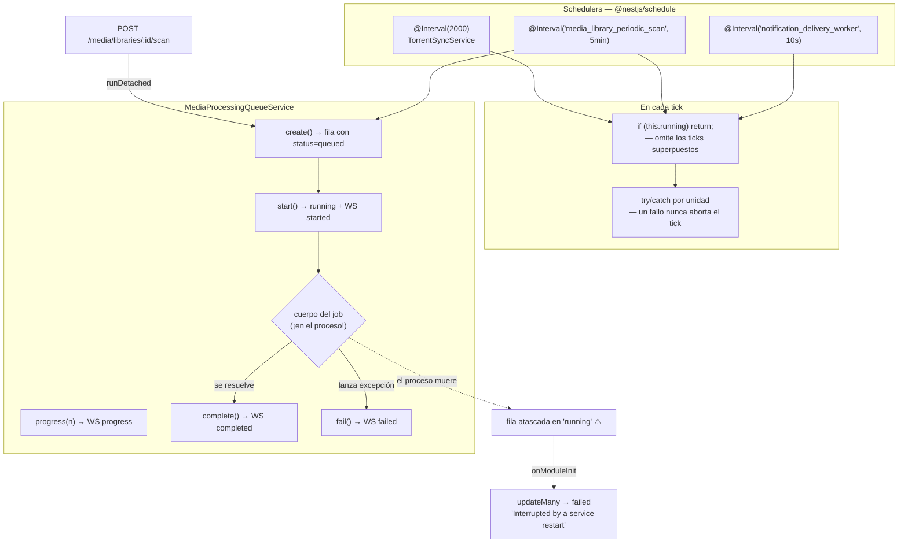
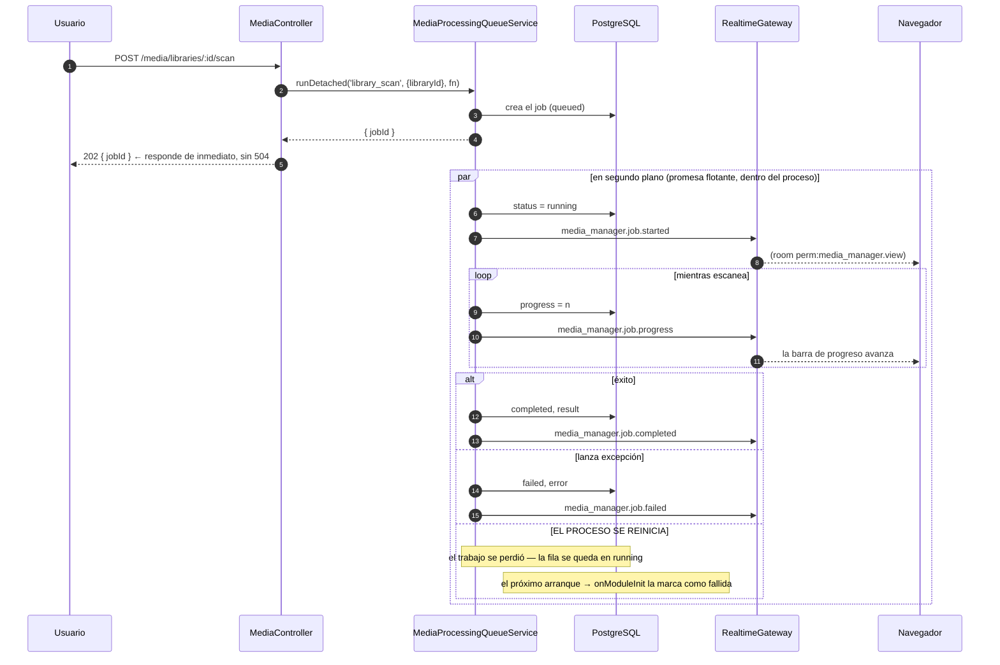

# Trabajos en segundo plano

## Resumen

El trabajo de larga duración **nunca debe bloquear una petición HTTP**. UltraTorrent corre
trabajo en segundo plano de dos maneras:

1. **Schedulers** — métodos `@Interval` de `@nestjs/schedule` que hacen tick a una cadencia.
2. **Una cola con seguimiento** — `MediaProcessingQueueService`, que persiste cada unidad de
   trabajo como una fila `MediaProcessingJob` y transmite su ciclo de vida por WebSocket.

**No hay ningún broker externo**. Los dos mecanismos corren **dentro del proceso de la API**.

:::danger Los cuerpos de los jobs viven en el proceso, no son unidades de trabajo durables
`MediaProcessingQueueService` persiste una **fila** que describe el job, pero el **cuerpo** del
job es simplemente una función asíncrona corriendo en el proceso de Node. *No* es una unidad
de trabajo durable que un worker pueda retomar. **Un reinicio mata el trabajo y deja la fila
huérfana.** Por eso el arranque las reconcilia — mira más abajo. Si de esta página te llevas
una sola cosa, que sea esta.
:::

## Propósito

Mantener la API con buena respuesta, aislar los fallos y hacer observables las operaciones
largas.

## Cuándo usarlo

| Trabajo | Mecanismo |
| --- | --- |
| Polling / barridos recurrentes | `@Interval('<name>', ms)` |
| Una operación larga que inició el usuario (escanear una biblioteca de 20k archivos) | `MediaProcessingQueueService.runDetached()` |
| Una operación larga cuyo resultado necesita quien la llamó | `MediaProcessingQueueService.run()` |
| Una reacción a un evento del dominio | Una acción de automatización, o un suscriptor del bus de eventos |

## Requisitos previos

- [WebSockets](/develop/websockets) — el ciclo de vida de los jobs se emite como eventos WS.
- [Crear módulos](/develop/creating-modules) — los jobs se declaran en el manifest.

## Conceptos

### Schedulers

`ScheduleModule.forRoot()` se importa en `app.module.ts`. Un scheduler es un método con
`@Interval('<job-name>', <ms>)`. El nombre importa: es lo que declaras en los `schedulerJobs`
del manifest de tu módulo, y es como se identifica el job en la UI de administración.

Los jobs que se incluyen hoy:

| Job | Cadencia | Servicio |
| --- | --- | --- |
| *(sin nombre)* sincronización de torrents | 2 s | `TorrentSyncService` |
| *(sin nombre)* consulta de RSS | 60 s | `RssModule` |
| `notification_delivery_worker` | 10 s | `DeliveryService` |
| `media_server_session_poll` | 15 s | `MediaServerSessionService` |
| `system_health_monitor` | 60 s | `SystemModule` |
| `torrent_parking_sweep` | 5 min | `TorrentParkingService` |
| `media_acquisition_rss_sweep` | 5 min | `MediaAcquisitionModule` |
| `media_library_periodic_scan` | tick de 5 min | `MediaLibraryScanSchedulerService` |
| `notification_provider_health` | 5 min | `ProviderHealthService` |
| `media_server_newsletter_dispatch` | 15 min | `MediaServerNewsletterService` |
| `media_acquisition_watchlist_sweep` | 15 min | `MediaAcquisitionModule` |
| `media_acquisition_quality_upgrade_sweep` | 30 min | `MediaAcquisitionModule` |
| `media_server_metadata_sync` | 1 h | `MediaServerSyncService` |
| `imdb_dataset_auto_update` | tick de 1 h | `ImdbDatasetSchedulerService` |
| `rss_show_status_refresh` | 1 h | `RssShowStatusRefreshService` |
| `system_update_check` | según configuración | `SystemUpdateService` |

**Serializa tus ticks.** Nest va a arrancar felizmente un segundo tick mientras el primero
todavía corre. El patrón universal:

```ts
// apps/backend/src/modules/torrents/torrent-sync.service.ts
@Interval(2000)
async sync(): Promise<void> {
  if (this.syncing) return; // omite los ticks superpuestos
  this.syncing = true;
  try {
    for (const provider of this.registry.list()) {
      await this.syncEngine(provider);
    }
  } finally {
    this.syncing = false;
  }
}
```

**Aísla cada unidad.** Un solo engine, biblioteca o elemento que falle no debe abortar el tick
completo:

```ts
private async syncEngine(provider: TorrentEngineProvider): Promise<void> {
  try {
    const [torrents, stats] = await Promise.all([
      provider.listTorrents(),
      provider.getGlobalStats(),
    ]);
    // …transmite, detecta transiciones, persiste snapshots…
  } catch (err) {
    this.logger.warn(`Engine ${provider.engineId} sync failed: ${(err as Error).message}`);
    this.realtime.broadcast(WS_EVENTS.ENGINE_STATUS, {
      engineId: provider.engineId, online: false, error: (err as Error).message, at,
    });
  }
}
```

Esto no es teórico. Se lanzó un bug real porque un `P2025` de Prisma ("Record to update not
found"), causado por una fila eliminada a mitad del barrido, se escapó del manejador de
errores por episodio y **rechazó el barrido entero**, perdiendo los otros ~48 episodios del
lote. El arreglo fue usar `updateMany` (que no hace nada si la fila no existe) en vez de
`update` (que lanza excepción).

### La cola de procesamiento

```ts
// apps/backend/src/modules/media/media-processing-queue.service.ts
export type MediaJobType =
  | 'library_scan'
  | 'media_identification'
  | 'metadata_fetch'
  | 'artwork_fetch'
  | 'subtitle_scan'
  | 'rename_execute'
  | 'library_organize'
  | 'nfo_generate'
  | 'media_server_refresh';
```

Cada job es una fila `MediaProcessingJob` (`type`, `status`, `progress`, `libraryId`, `itemId`,
`payload`, `result`, `error`) cuyo ciclo de vida se emite por el canal WS con alcance
`media_manager.view`: `started` → `progress` → `completed` | `failed`.

Dos puntos de entrada:

**`run()`** — esperas el resultado. El fallo se registra y se transmite, y luego se **relanza**
para que quien llamó pueda mostrarlo.

**`runDetached()`** — devuelve `{ jobId }` de inmediato y corre en segundo plano:

```ts
/**
 * Inicia un job SIN esperar a que termine: crea + arranca la fila, corre `fn` en
 * segundo plano y devuelve `{ jobId }` de inmediato. Quien llama le devuelve eso
 * al cliente enseguida, para que un job largo (p. ej. escanear una biblioteca de
 * 20k archivos) no haga que la petición HTTP expire en el gateway (504); el
 * progreso + la finalización llegan por los eventos WS `media_manager.job.*`. Los
 * fallos se registran y se transmiten, nunca se lanzan — no queda nadie que los
 * capture.
 */
async runDetached(
  type: MediaJobType,
  opts: CreateJobOptions,
  fn: (report: JobReporter) => Promise<unknown>,
): Promise<{ jobId: string }> {
  const created = await this.create(type, opts);
  void (async () => {
    await this.start(created.id);
    const report: JobReporter = (progress, message) =>
      this.progress(created.id, progress, message);
    try {
      const result = await fn(report);
      await this.complete(created.id, result);
    } catch (err) {
      await this.fail(created.id, (err as Error).message);
    }
  })();
  return { jobId: created.id };
}
```

El `void (async () => { … })()` lo dice todo: **el trabajo es una promesa flotante dentro de
este proceso.** Nada fuera del proceso sabe que existe.

### Por qué el arranque reconcilia los jobs huérfanos

Como el cuerpo vive en el proceso, un deploy o un crash deja la fila en `running` **para
siempre**. En un host en producción esto produjo **30 filas huérfanas, algunas de más de 5
horas**, incluyendo `metadata_fetch` y `subtitle_scan` congelados en 0%. La lista de jobs
dejó de significar nada.

El arreglo es una reconciliación al arrancar. Cualquier fila `queued`/`running` al inicio
pertenece a un proceso que ya no existe:

```ts
/**
 * Reconcilia los jobs huérfanos al arrancar. Los cuerpos de los jobs corren **en el
 * proceso** (mira {@link runDetached}) — no son unidades de trabajo durables que un
 * worker pueda retomar. Así que cualquier fila que siga en `queued`/`running`
 * pertenece a un proceso que ya no existe (un deploy, un reinicio o un crash): su
 * trabajo murió con ese proceso y nunca se va a reanudar, pero la fila si no se
 * quedaría "running" para siempre. Si no se manejan, se acumulan y hacen que la
 * lista de jobs no signifique nada — un host en producción tenía 30 de ellas,
 * algunas de más de 5 horas. Márcalas como fallidas para que el estado refleje la
 * realidad.
 */
async onModuleInit(): Promise<void> {
  try {
    const { count } = await this.prisma.mediaProcessingJob.updateMany({
      where: { status: { in: ['queued', 'running'] } },
      data: {
        status: 'failed',
        finishedAt: new Date(),
        error: 'Interrupted by a service restart',
      },
    });
    if (count > 0) {
      this.logger.warn(`Reconciled ${count} orphaned job(s) left queued/running by a previous process`);
    }
  } catch (err) {
    // Nunca bloquees el arranque por esta limpieza de mejor esfuerzo.
    this.logger.warn(`Could not reconcile orphaned jobs: ${(err as Error).message}`);
  }
}
```

Fíjate en la segunda mitad: la reconciliación está envuelta para que un fallo **nunca bloquee
el arranque**. Una limpieza que puede tumbar el servicio es peor que el desorden que limpia.

:::note Esto los marca como fallidos, no los reanuda
La reconciliación marca el trabajo como **fallido**, no lo reinicia. El usuario vuelve a
correr el escaneo. Una cola genuinamente durable (BullMQ sobre el Redis que ya está en el
stack) es el camino de mejora obvio, y el diseño deja espacio para eso a propósito, "sin
cambiar a quienes la llaman".
:::

### Idempotencia

Todo lo que puede correr dos veces, va a correr dos veces. Se usan dos patrones:

**1. Un ledger de éxitos.** El backfill de `torrent.completed` del motor de automatización
reevalúa los torrents ya completos en **cada** ciclo de sincronización de 2 segundos. Las filas
exitosas de `AutomationLog` son el ledger que evita que una regla corra dos veces:

```ts
// apps/backend/src/modules/automation/automation.module.ts
private async loadCompletedLedger(ruleIds: string[], hashes: string[]): Promise<Set<string>> {
  const logs = await this.prisma.automationLog.findMany({
    where: {
      status: 'success',
      ruleId: { in: ruleIds },
      OR: hashes.map((h) => ({ context: { path: ['hash'], equals: h } })),
    },
    select: { ruleId: true, context: true },
  });
  const done = new Set<string>();
  for (const l of logs) {
    const hash = (l.context as { hash?: string } | null)?.hash;
    if (hash) done.add(`${l.ruleId}::${hash}`);
  }
  return done;
}
```

Una ejecución **fallida** deliberadamente *no* se registra como hecha, así que una regla
bloqueada por un error transitorio (engine sin conexión) se reintenta en el próximo ciclo. Y el
ledger está acotado al conjunto de completados actuales, así que la consulta se mantiene
pequeña.

Esa sutileza tiene dientes: un engine que devolvía un "éxito" fantasma para una eliminación que
no ocurrió **envenenaba este ledger**, marcando la regla como hecha para que nunca se
reintentara. Ahora el provider verifica la eliminación y lanza una excepción si el torrent
sobrevive — precisamente para que el ledger registre un fallo real.

**2. Llenar los huecos, no rehacer.** El escaneo periódico de bibliotecas solo llena lo que
falta — `identify → metadata → póster` para los elementos que no los tienen. Los metadatos y
las ilustraciones existentes se dejan tranquilos, así que un escaneo en estado estable casi no
hace trabajo y nunca vuelve a machacar a los providers.

### Disparo por flanco vs. backfill

Un trigger impulsado por polling se dispara en el **flanco de subida**: el tick en el que la
condición se vuelve verdadera por primera vez. Eso es correcto para las transiciones en vivo y
**completamente incorrecto para cualquier cosa que ya fuera verdadera** cuando miraste por
primera vez. `torrent.completed` se dispara solo en la consulta donde el progreso persistido
cruza de `<1 → ≥1` — así que un torrent que ya estaba completo en el primer avistamiento, o
que terminó mientras la app estaba caída, o que terminó antes de que existiera la regla,
**nunca cruza ese flanco**. Sus reglas de finalización nunca corrieron, y siguió compartiendo
para siempre.

La respuesta es una **pasada de backfill** junto al flanco, compartiendo el mismo ledger de
idempotencia. Si añades un trigger impulsado por polling, pregúntate de inmediato: *¿y qué pasa
con los que ya estaban pasados del flanco?*

## Diagrama — los dos mecanismos





## Paso a paso: añadir un scheduler

```ts
@Injectable()
export class WidgetSweepService {
  private readonly logger = new Logger(WidgetSweepService.name);
  private running = false;

  constructor(private readonly prisma: PrismaService) {}

  @Interval('widget_sweep', 10 * 60_000)
  async sweep(): Promise<void> {
    if (this.running) return;          // 1. nunca te superpongas
    this.running = true;
    try {
      const due = await this.prisma.widget.findMany({ where: { /* solo lo que TOCA */ } });
      for (const w of due) {
        try {
          await this.process(w);       // 2. aísla cada unidad
        } catch (err) {
          this.logger.warn(`Widget ${w.id} failed: ${(err as Error).message}`);
        }
      }
    } finally {
      this.running = false;            // 3. libera siempre
    }
  }
}
```

Luego decláralo: `schedulerJobs: ['widget_sweep']` en el manifest del módulo.

Cuatro reglas, aprendidas a la mala:

1. **Protégete contra la superposición.** Un tick que tarda más que su intervalo no puede
   apilarse.
2. **Selecciona solo lo que toca.** Un tick barato que no encuentra nada que hacer debe costar
   una consulta. `MediaLibraryScanSchedulerService` hace tick cada 5 minutos pero solo escoge
   las bibliotecas cuyo `lastScanAt` es más viejo que su propio `scanIntervalMinutes`.
3. **Aísla cada unidad.** Una fila mala no puede matar el lote.
4. **El `@Interval` de Nest se dispara *después* del primer intervalo**, no al arrancar. Si
   necesitas trabajo al inicio, hazlo en `onModuleInit`.

## Paso a paso: añadir un job encolado

1. Añade el tipo a `MediaJobType`.
2. Llama a `runDetached()` (para una operación larga iniciada por el usuario) o a `run()`
   (cuando quien llama necesita el resultado).
3. Reporta el progreso: `await report(40, 'Fetching artwork…')`.
4. Haz que el cuerpo sea **idempotente** — puede volver a correr después de que un intento
   interrumpido se marque como fallido al arrancar.
5. Declara los eventos WS en el manifest si el tipo es nuevo para la UI.

## Resolución de problemas

| Síntoma | Causa | Arreglo |
| --- | --- | --- |
| Jobs atascados en `running` con 0% para siempre | El proceso se reinició a mitad del job. | Es lo esperado. `onModuleInit` los marca como fallidos en el próximo arranque. Vuelve a correr la operación. |
| Un barrido procesa 2 elementos y luego se detiene en silencio | Una excepción se escapó del manejador por elemento y rechazó el tick completo. El `update` de Prisma lanza `P2025` cuando la fila se elimina de forma concurrente. | Envuelve cada unidad en try/catch; usa `updateMany` donde una fila ausente deba ser un no-op. |
| Una regla se dispara repetidamente para el mismo torrent | El ledger de idempotencia no está usando la clave correcta, o la ejecución no está registrando el éxito. | Revisa `AutomationLog` — una ejecución `failed` deliberadamente no se trata como hecha. |
| Una regla de finalización nunca se dispara para torrents viejos | Ya estaban pasados del flanco de subida. | Necesitas una pasada de backfill, no un mejor flanco. |
| La petición HTTP del escaneo da 504 | Usaste `run()` donde necesitabas `runDetached()`. | Devuelve `{ jobId }` de inmediato; transmite el progreso por WS. |
| Los ticks se apilan y machacan la base de datos | No hay protección contra superposición. | `if (this.running) return;` |

## Consejos

- **Todo aquí es de mejor esfuerzo.** El manejador post-descarga de `MediaProcessingService`
  nunca lanza excepciones — protege el bucle de sincronización desde el que se le llama. Copia
  ese instinto.
- **Una limpieza nunca puede tumbar el servicio.** La reconciliación va envuelta en un
  try/catch que solo advierte.
- **Redis ya está en el stack.** Si te ves necesitando durabilidad de verdad (reintentos a
  través de reinicios, multinodo), ese es el camino de mejora — no otra promesa flotante.
- **Ponle nombre a tu interval.** `@Interval(2000)` funciona, pero un job sin nombre no se
  puede declarar en un manifest ni mostrar en la UI de administración. (`TorrentSyncService` y
  la consulta de RSS están los dos sin nombre hoy — no copies eso.)

## Preguntas frecuentes

**¿Por qué no BullMQ o un broker si Redis está justo ahí?**
Las cargas de trabajo actuales están acotadas y son de mejor esfuerzo, y `@nestjs/schedule` +
async alcanza para ellas. `docs/ARCHITECTURE.md` dice que el diseño "deja espacio para pasar a
una cola distribuida más adelante sin cambiar a quienes la llaman".

**¿Pueden correr dos instancias de la API sin problemas?**
:::caution Aún no verificado
Cada scheduler hace tick dentro del proceso con una protección contra superposición en memoria
(`this.running`), que es **por proceso**. Nada en el código toma un lock distribuido. Correr
múltiples réplicas del backend duplicaría cada barrido. Asume una sola instancia.
:::

**¿Cómo veo lo que hizo un job?**
Las filas de `MediaProcessingJob` llevan `result` y `error`. La UI del Gestor de Medios los
lista, y el ciclo de vida se transmite por `media_manager.job.*`.

**¿Un job encolado sobrevive a un reinicio?**
**No.** Vuelve a leer el aviso de peligro al principio de esta página.

## Lista de verificación

- [ ] Mi scheduler tiene una protección contra superposición.
- [ ] Selecciona solo el trabajo que **toca**, para que un tick ocioso sea barato.
- [ ] Cada unidad de trabajo está individualmente en un try/catch.
- [ ] El `@Interval` tiene **nombre**, y está declarado en los `schedulerJobs` del manifest.
- [ ] El cuerpo de mi job es **idempotente** — seguro de volver a correr tras una interrupción.
- [ ] Una operación larga iniciada por el usuario usa `runDetached()` y devuelve un `jobId`.
- [ ] Se reporta el progreso para que la UI tenga algo que mostrar.
- [ ] Si añadí un trigger impulsado por polling, pensé en los que ya estaban pasados del flanco.

## Ver también

- [Automatización](/develop/automation) — triggers, el ledger y el backfill
- [WebSockets](/develop/websockets) — eventos del ciclo de vida de los jobs
- [Base de datos y Prisma](/develop/database) — y por qué construir un índice largo *no* es una migración
- [Módulos → Gestor de Medios](/modules/media-manager) · [Descarga Inteligente](/modules/smart-download)
- [Operar → Rendimiento](/operate/performance)
