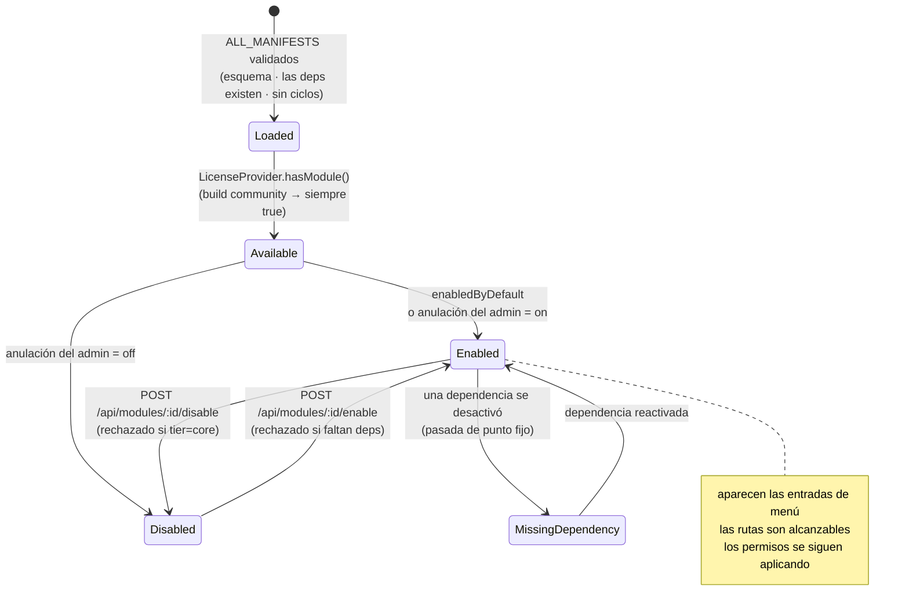
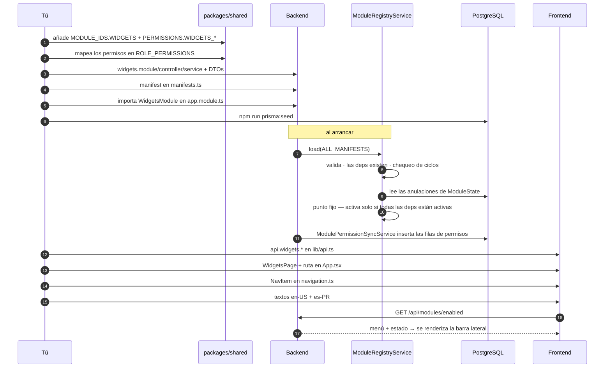

# Crear módulos

## Resumen

Cada capacidad de UltraTorrent es un **módulo**: un módulo de NestJS *más* un manifest que
declara su tier, sus dependencias, sus permisos, sus entradas de menú, sus rutas, sus eventos
de WebSocket y sus trabajos del scheduler. El registry carga todos los manifests al arrancar,
los valida, resuelve el grafo de dependencias y calcula el estado de ejecución de cada módulo.

Esta página recorre el camino completo: módulo del backend → manifest → permiso → ruta
protegida con guards → página del frontend → navegación → i18n.

## Propósito

Añadir una funcionalidad debe ser **aditivo**. Si te encuentras editando `TorrentsService` para
que tu funcionalidad sirva, detente y reconsidera — lo que probablemente quieres es un módulo (o un
[provider](/develop/providers)).

## Cuándo usarlo

- Estás añadiendo una **capacidad** con sus propias rutas, permisos y UI.
- Estás agrupando comportamiento existente detrás de un interruptor de activar/desactivar.

Si lo que estás integrando es un **sistema externo**, lo que quieres es un provider.

## Requisitos previos

- [Configuración local](/develop/setup) funcionando — vas a volver a correr el seed de la base de datos.
- [Arquitectura](/develop/architecture) — las reglas de las capas.
- [RBAC](/develop/rbac) — vas a añadir un permiso.

## Conceptos

### El manifest

```ts
// packages/shared/src/modules.ts
export interface ModuleManifest {
  id: string;
  name: string;
  description: string;
  tier: ModuleTier;             // 'core' | 'community'
  /** Whether the module is on by default. */
  enabledByDefault: boolean;
  dependencies: string[];
  permissions: string[];
  menu?: ModuleMenuItem[];
  routes?: string[];
  websocketEvents?: string[];
  schedulerJobs?: string[];
  settingsSections?: string[];
  features?: string[];
}
```

| Campo | Qué controla |
| --- | --- |
| `tier` | Los módulos `core` están **bloqueados** — nunca se pueden desactivar. Los módulos `community` sí se pueden alternar. |
| `enabledByDefault` | Estado inicial antes de cualquier anulación por parte de un administrador. |
| `dependencies` | El registry se niega a activar un módulo cuyas dependencias no estén activas, y se niega a desactivar uno que tenga dependientes activos. |
| `permissions` | Se sincronizan al catálogo de permisos de la base de datos al arrancar, mediante `ModulePermissionSyncService`. |
| `menu` | Alimenta `GET /api/modules/enabled`, que la SPA usa para filtrar la navegación. |
| `routes` / `websocketEvents` / `schedulerJobs` / `settingsSections` / `features` | Documentación declarativa de la superficie del módulo; se expone en la [Referencia de módulos](/reference/modules) y en la página de Módulos de administración. |

:::warning El manifest no es autorización
El estado activado/desactivado de un módulo es una **conveniencia de UI y de enrutado**. El servidor
siempre aplica `@RequirePermissions`. Nunca confíes en que "el módulo está apagado" para dejar a
alguien fuera.
:::

### Validación del registry al arrancar

`ModuleRegistryService.load()` lanzará una excepción — y la aplicación se negará a arrancar — si:

- un manifest está mal formado (le falta `id`/`name`, tiene un `tier` que no es `core`/`community`,
  `dependencies`/`permissions` que no son arrays, o un `enabledByDefault` que no es booleano);
- dos manifests comparten el mismo `id`;
- un manifest depende del id de un módulo desconocido;
- el grafo de dependencias contiene un **ciclo** (DFS de tres colores →
  `Circular dependency: a → b → a`).

Eso es deliberado: un grafo de módulos roto es un bug de código, y debe fallar ruidosamente al
arrancar, no misteriosamente en tiempo de ejecución.

## Diagrama del ciclo de vida del módulo



## Paso a paso

### 1. Crea el andamiaje del módulo del backend

```text
apps/backend/src/modules/<feature>/
├── <feature>.module.ts        # @Module wiring
├── <feature>.controller.ts    # API layer — thin, declares permissions
├── <feature>.service.ts       # application layer — the actual logic
└── dto/<feature>.dto.ts       # class-validator request DTOs
```

**Service (capa de aplicación).** La lógica vive aquí. Depende de `PrismaService`,
`EngineRegistryService`, `AuditService` — nunca de un provider concreto.

```ts
@Injectable()
export class WidgetsService {
  constructor(
    private readonly prisma: PrismaService,
    private readonly audit: AuditService,
  ) {}

  async remove(id: string, userId?: string) {
    const widget = await this.prisma.widget.delete({ where: { id } });
    await this.audit.record({
      userId,
      action: 'widgets.delete',
      objectType: 'widget',
      objectId: id,
      result: 'success',
    });
    return widget;
  }
}
```

**Controller (capa de API).** Enlaza las rutas con llamadas al service, engancha los guards, declara los
permisos y añade los decorators de Swagger. Nada de lógica de negocio:

```ts
@ApiTags('widgets')
@ApiBearerAuth()
@Controller('widgets')
@UseGuards(JwtAuthGuard, PermissionsGuard)
export class WidgetsController {
  constructor(private readonly widgets: WidgetsService) {}

  @Get()
  @RequirePermissions(PERMISSIONS.WIDGETS_VIEW)
  list() {
    return this.widgets.list();
  }

  @Delete(':id')
  @RequirePermissions(PERMISSIONS.WIDGETS_DELETE)
  remove(@Param('id') id: string, @CurrentUser() user: AuthenticatedUser) {
    return this.widgets.remove(id, user?.id);
  }
}
```

**DTOs.** Valida cada entrada con `class-validator`. El `ValidationPipe` global corre con
`whitelist: true` + `forbidNonWhitelisted: true`, así que una propiedad no declarada es un 400.

### 2. Añade los permisos

Añádelos a `packages/shared/src/permissions.ts` y luego mapéalos en las entradas
correspondientes de `ROLE_PERMISSIONS`. El recorrido completo está en [RBAC](/develop/rbac).

```ts
export const PERMISSIONS = {
  // …
  WIDGETS_VIEW: 'widgets.view',
  WIDGETS_MANAGE: 'widgets.manage',
  WIDGETS_DELETE: 'widgets.delete',
} as const;
```

Vuelve a construir `@ultratorrent/shared` para que el backend y el frontend vean las claves nuevas.

### 3. Escribe el manifest

En `apps/backend/src/modules/module-registry/manifests.ts`, añade una entrada a
`CORE_MANIFESTS` (siempre activo) o a `COMMUNITY_MANIFESTS` (alternable). Primero añade el id a
`MODULE_IDS` en `packages/shared/src/modules.ts`.

```ts
// apps/backend/src/modules/module-registry/manifests.ts
{
  id: MODULE_IDS.NOTIFICATION_CENTER,
  name: 'Notification Center',
  description:
    'The centralized, provider-driven messaging platform. …',
  tier: 'core',
  enabledByDefault: true,
  dependencies: [
    MODULE_IDS.AUTH,
    MODULE_IDS.RBAC,
    MODULE_IDS.MODULE_REGISTRY,
    MODULE_IDS.AUDIT,
    MODULE_IDS.SETTINGS,
  ],
  permissions: [
    P.NOTIFICATIONS_VIEW,
    P.NOTIFICATIONS_MANAGE_CHANNELS,
    // …
  ],
  menu: [
    { label: 'Notification Center', path: '/notifications', icon: 'Bell', permission: P.NOTIFICATIONS_VIEW },
  ],
  routes: ['/api/notifications'],
  websocketEvents: [
    'notification.sent',
    'notification.failed',
    // …
  ],
  schedulerJobs: ['notification_delivery_worker', 'notification_provider_health'],
  settingsSections: ['notification-center'],
  features: ['providers', 'channels', 'templates', 'delivery_queue', 'quiet_hours'],
}
```

Las claves de permiso que listes aquí se insertan (upsert) en el catálogo de la base de datos al arrancar:

```ts
// apps/backend/src/modules/module-registry/module-permission-sync.service.ts
async onModuleInit(): Promise<void> {
  const keys = new Set<string>();
  for (const m of this.registry.allManifests()) {
    for (const p of m.permissions) keys.add(p);
  }
  for (const key of keys) {
    await this.prisma.permission.upsert({
      where: { key },
      update: {},
      create: { key, description: `${key} (module-declared)` },
    });
  }
  this.logger.log(`Synced ${keys.size} module permission key(s)`);
}
```

Esto crea la **fila** del permiso. **No** se lo otorga a ningún rol — de eso se encargan
`ROLE_PERMISSIONS` y el seed.

### 4. Registra el módulo de Nest

Añádelo a los `imports` del módulo raíz en `apps/backend/src/app.module.ts`. Márcalo como
`@Global()` **solo** si toda la aplicación necesita lo que exporta — `EngineModule`, `AuditModule`
y `RealtimeModule` son globales; casi ningún otro debería serlo.

### 5. Vuelve a correr el seed

```bash
npm run prisma:seed
```

El seed es idempotente: aprovisiona los permisos, los roles del sistema, el administrador inicial
y la configuración predeterminada.

### 6. Añade el método de API (frontend)

Añade tus endpoints al objeto `api` en `apps/frontend/src/lib/api.ts`. Todo pasa por el
`request<T>()` privado, que adjunta el bearer token y refresca el token de forma transparente
una vez ante un 401.

### 7. Construye la página

Añade `apps/frontend/src/pages/<area>/<Name>Page.tsx`. El patrón de la casa:

```tsx
export function WidgetsPage() {
  const { t } = useTranslation('widgets');
  const toast = useToast();
  const qc = useQueryClient();

  const widgets = useQuery({ queryKey: ['widgets'], queryFn: () => api.widgets.list() });
  const invalidate = () => void qc.invalidateQueries({ queryKey: ['widgets'] });

  const remove = useMutation({
    mutationFn: (id: string) => api.widgets.remove(id),
    onSuccess: () => { toast.success(t('deleted')); invalidate(); },
    onError: (e) => toast.error(t('deleteFailed'), e instanceof ApiError ? e.message : undefined),
  });

  if (widgets.isLoading) return <CenteredSpinner />;
  if (widgets.isError) return <ErrorState title={t('loadError')} onRetry={() => void widgets.refetch()} />;
  // …
}
```

Claves de query jerárquicas en forma de array, un `invalidate()` local sobre el prefijo de la clave, y
`CenteredSpinner` / `ErrorState` / `EmptyState` de `@/components/ui/feedback` para los
tres estados.

### 8. Añade la ruta

En `apps/frontend/src/App.tsx`, anida la ruta bajo un guard de permiso, dentro del shell de la
aplicación, y envuelve el elemento en un guard de módulo si la funcionalidad es alternable:

```tsx
<Route element={<ProtectedRoute permission={PERMISSIONS.MEDIA_MANAGER_VIEW} />}>
  <Route element={<AppShell />}>
    <Route path="/media" element={<ModuleRoute moduleId="media_manager"><MediaDashboardPage /></ModuleRoute>} />
  </Route>
</Route>
```

`ProtectedRoute` redirige a `/login` a los usuarios no autenticados y muestra un panel de
"Acceso denegado" cuando falta el permiso. `ModuleRoute` renderiza `LockedModulePage` cuando el
módulo está desactivado.

### 9. Añade la entrada de navegación

`apps/frontend/src/components/layout/navigation.ts` contiene `NAV_GROUPS` — la única fuente de
verdad para la barra lateral, las migas de pan y la paleta de comandos. Añade un `NavItem` con un
`id` estable, un `label` en inglés canónico, un `icon` de lucide, un `to` que **coincida exactamente
con la ruta**, y sus compuertas de `permission` / `module`.

El filtrado prioriza el permiso:

```ts
// apps/frontend/src/components/layout/navigation.ts
function selfVisible(item: NavItem, ctx: NavVisibilityCtx): boolean {
  if (item.permission && !ctx.hasPermission(item.permission)) return false;
  if (item.superAdminOnly && !ctx.isSuperAdmin) return false;
  if (item.adminOnly && !ctx.canManageModules) return false;
  // Module gate: hidden when disabled — unless the user can manage modules
  // (module state is convenience-only; route guards remain authoritative).
  if (item.module && !ctx.isEnabled(item.module) && !ctx.canManageModules) return false;
  return true;
}
```

### 10. Añade los textos — en ambos idiomas

Añade el label y la descripción bajo `groups` / `items` / `descriptions` en **ambos**
`src/i18n/locales/en-US/nav.json` y `src/i18n/locales/es-PR/nav.json`, y los textos de tu página
a las dos copias de su namespace. Un namespace totalmente nuevo hay que registrarlo en tres
sitios. De lo contrario, la prueba de paridad rompe el build — mira [i18n](/develop/i18n).

## Flujo completo



## Solución de problemas

| Síntoma | Causa | Solución |
| --- | --- | --- |
| El arranque falla: `Invalid manifest "x": bad tier` | El `tier` no es `core` ni `community`. | Corrige el manifest. |
| El arranque falla: `Module "x" depends on unknown module "y"` | Un typo, o se te olvidó añadir el id a `MODULE_IDS`. | Añade el id / corrige la dependencia. |
| El arranque falla: `Circular dependency: a → b → a` | Dos módulos se importan mutuamente. | Rómpelo: usa el bus de eventos, o un `ModuleRef.get(...)` perezoso (como hacen `AutomationModule` ↔ `RssModule`). |
| `Duplicate module id in manifests` | El mismo `id` aparece dos veces. | Elimina uno. |
| `Core modules cannot be disabled` | Intentaste desactivar un módulo con `tier: 'core'`. | Cambia el tier, o no lo intentes. |
| `Enable its dependencies first: audit, settings` | Activaste un módulo cuyas dependencias están apagadas. | Actívalas primero. |
| La entrada de navegación nunca aparece | El permiso no lo tienes, o el `to` no coincide con ninguna ruta. | Revisa el rol; compara `navigation.ts` contra `App.tsx`. |
| La ruta devuelve 403 a un admin | La fila del permiso existe pero no está otorgada al rol. | Añádelo a `ROLE_PERMISSIONS` y vuelve a correr el seed. |

## Consejos

- **Sigue un módulo existente.** `torrents`, `engine` y `audit` son las plantillas más limpias.
  `notification-center` es la referencia para un módulo grande con providers.
- **Declara tu superficie con honestidad.** `websocketEvents`, `schedulerJobs`, `settingsSections`
  y `features` son la razón por la que la [Referencia de módulos](/reference/modules) sigue siendo
  fiel a la realidad. Un trabajo del scheduler no declarado es un trabajo invisible.
- **No crees un ciclo por ahorrarte una llamada.** Si el módulo A necesita algo del módulo B y B ya
  necesita a A, una de las dos direcciones es un evento, no una llamada a un método.
- **Que `tsc` pase limpio no es suficiente.** La DI y el cableado de módulos solo fallan al arrancar.
  Arranca un build limpio antes de darlo por terminado.

## Preguntas frecuentes

**¿Tier core o community?**
`core` si el producto se rompe sin él (auth, RBAC, torrents, engine). `community` si un operador
razonablemente podría querer apagarlo. Core queda bloqueado permanentemente en encendido.

**¿Se puede activar un módulo por usuario?**
No. El estado del módulo es global. El acceso por usuario es RBAC.

**¿Tengo que añadir una entrada de menú?**
No. Módulos como `search`, `taxonomy` y `system` tienen rutas pero no entrada de menú.

**¿Cómo publico un trabajo del scheduler con mi módulo?**
Decláralo en `schedulerJobs` e impleméntalo con `@Interval('<name>', ms)`. Mira
[Trabajos en segundo plano](/develop/background-jobs).

## Lista de verificación

- [ ] Entrada de `MODULE_IDS` añadida en `packages/shared/src/modules.ts`.
- [ ] Permisos añadidos a `packages/shared/src/permissions.ts` **y** a `ROLE_PERMISSIONS`.
- [ ] Paquete shared reconstruido.
- [ ] Manifest añadido, con `dependencies` / `websocketEvents` / `schedulerJobs` honestos.
- [ ] Módulo importado en `app.module.ts`.
- [ ] El controller lleva `@UseGuards(JwtAuthGuard, PermissionsGuard)` + `@RequirePermissions`.
- [ ] Cada entrada tiene un DTO de `class-validator`.
- [ ] Las acciones destructivas llaman a `AuditService.record(...)`.
- [ ] Seed vuelto a correr.
- [ ] Frontend: método de API, página, ruta, entrada de navegación, textos **en-US + es-PR**.
- [ ] Un build limpio arranca.

## Ver también

- [Providers](/develop/providers) — para integraciones externas
- [RBAC](/develop/rbac) — añadir un permiso de principio a fin
- [Referencia de módulos](/reference/modules) — la tabla de manifests generada
- [Módulos → Torrents](/modules/torrents) y las demás páginas de módulos
- [i18n](/develop/i18n)
