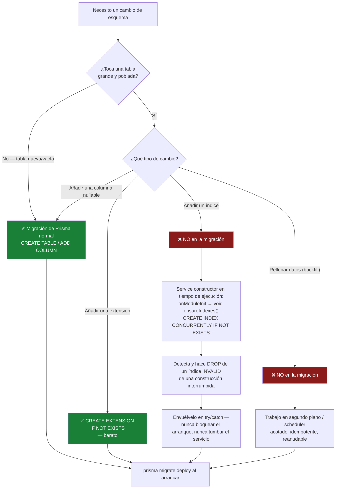

# Base de datos y Prisma

## Resumen

**PostgreSQL** vía **Prisma**. El esquema (`apps/backend/prisma/schema.prisma`) contiene unos 88
modelos que cubren identidad y RBAC, snapshots de torrents, RSS, automatización, todo el conjunto
de modelos del Gestor de Medios, las analíticas del servidor de medios, el catálogo del conjunto de
datos de IMDb, el Centro de Notificaciones, el registro de auditoría y la configuración.

## Propósito

Cambiar el esquema sin romper un deploy — y sin dejar inservible una instalación en producción.

## Requisitos previos

- [Configuración local](/develop/setup) — un Postgres funcionando.
- [Referencia del esquema de la base de datos](/reference/database-schema) — la referencia de modelos generada.

## Conceptos

### El datasource

```prisma
generator client {
  provider = "prisma-client-js"
}

datasource db {
  provider = "postgresql"
  url      = env("DATABASE_URL")
}
```

Sin preview features, sin binary targets personalizados. Cada modelo está mapeado con `@@map` a un
nombre de tabla en snake_case.

### Grupos de modelos

| Dominio | Modelos (selección) |
| --- | --- |
| Identidad y acceso | `User`, `Role`, `Permission`, `UserRole`, `RolePermission`, `RefreshToken`, `ApiKey` |
| Motores y torrents | `TorrentEngine`, `TorrentSnapshot`, `ParkedTorrent`, `TorrentCategory`, `TorrentTag`, `TorrentTagLink` |
| RSS | `RssFeed`, `RssRule`, `TvShowStatus`, `RssAcquisition`, `RssHistory`, … |
| Automatización | `AutomationRule`, `AutomationLog` |
| Biblioteca de medios | `MediaLibrary`, `MediaItem`, `MediaFile`, `MediaMetadata`, `MediaArtwork`, `MediaSubtitle`, `MediaProcessingJob`, `MediaDuplicateGroup`, … |
| Analíticas del servidor de medios | `MediaServerIntegration`, `MediaServerSession`, `MediaServerWatchHistory`, `MediaServerNewsletter`, … |
| Adquisición de medios | `MediaAcquisitionWatchlistItem`, `WantedEpisode`, `WantedMovie`, `Indexer`, `MediaAcquisitionProfile`, … |
| Conjuntos de datos de IMDb | `IMDbTitle`, `IMDbAka`, `IMDbEpisode`, `IMDbRating`, `IMDbDatasetImport`, … |
| Centro de Notificaciones | `NotificationChannel`, `NotificationTemplate`, `NotificationRule`, `NotificationDelivery`, `NotificationQueue`, … |
| Plataforma | `Setting`, `Notification`, `AuditLog`, `SystemEvent`, `ModuleState`, `ModuleEvent` |

La referencia completa y generada está en [Esquema de la base de datos](/reference/database-schema).

Vale la pena conocer algunas decisiones de índices y restricciones:

- `RefreshToken.tokenHash` es `@unique` — eso es lo que hace posible la búsqueda de una sola fila
  para la rotación. Mira [Autenticación](/develop/authentication).
- `IMDbAka` tiene `@@unique([titleId, ordering])` — la clave natural de IMDb, que es lo que convierte
  una reimportación en un upsert en lugar de un duplicado.
- `IMDbTitle` lleva un `@@index([titleType, startYear])` compuesto y un índice GIN sobre
  `genres`.

### Scripts

| Comando | Ejecuta |
| --- | --- |
| `npm run prisma:generate` | `prisma generate` |
| `npm run prisma:migrate` | **`prisma migrate deploy`** — aplica las migraciones existentes |
| `npm run prisma:seed` | `ts-node prisma/seed.ts` |
| `npm run prisma:migrate:dev --workspace @ultratorrent/backend` | `prisma migrate dev` — **crea** una migración |

Fíjate que el `prisma:migrate` de la raíz es `migrate deploy`, no `migrate dev`. Para escribir una
migración nueva tienes que usar el script del workspace.

El contenedor del backend corre `prisma migrate deploy` al arrancar — que es exactamente por lo que la
regla de abajo importa tanto.

## La regla de migración segura

:::danger La construcción de un índice largo NUNCA debe ir en una migración
Esto no es una preferencia de estilo. Causó una **caída real de producción en dos hosts.**

Un `CREATE INDEX` sobre el catálogo de IMDb completamente importado, con 8.9M de filas, toma
**minutos** y mantiene un lock. Correrlo dentro de una migración de Prisma bloqueó el deploy. Cuando
la construcción se mató a mitad de camino, **Prisma marcó la migración como fallida (`P3009`)** — y el
backend entonces **se negó a arrancar del todo**, entrando en un bucle de reinicios en *ambos* hosts
hasta que la fila de la migración se resolvió a mano.

Peor aún, `CREATE INDEX CONCURRENTLY` **no puede correr dentro de una transacción**, así que de todos
modos nunca podría vivir en una migración de Prisma.
:::

**La regla:**

| Contenido de la migración | Veredicto |
| --- | --- |
| `CREATE TABLE` sobre una tabla nueva (vacía) | ✅ Instantáneo. Está bien. |
| `ALTER TABLE … ADD COLUMN` (nullable, sin reescritura por default) | ✅ Está bien. |
| `CREATE EXTENSION IF NOT EXISTS pg_trgm` | ✅ Barato. Está bien. |
| `CREATE INDEX` sobre una tabla grande y poblada | ❌ **Nunca.** Constrúyelo `CONCURRENTLY` en tiempo de ejecución. |
| Un backfill de datos sobre millones de filas | ❌ **Nunca.** Hazlo en un trabajo en segundo plano. |

La migración que se publica es deliberadamente mínima —
`20260711060000_imdb_trigram_indexes` contiene **exactamente una sentencia**,
`CREATE EXTENSION IF NOT EXISTS pg_trgm;`, más un comentario que explica por qué los índices GIN *no*
están ahí.

### Construir un índice en tiempo de ejecución, correctamente

`ImdbTrigramIndexService` construye los tres índices GIN `gin_trgm_ops` en segundo plano.
Léelo antes de escribir el tuyo — tiene tres trampas nada obvias.

**Trampa 1: no debe bloquear el arranque.**

```ts
// apps/backend/src/modules/media/imdb/imdb-trigram-index.service.ts
onModuleInit(): void {
  // Deliberately NOT awaited: a multi-minute index build must never delay boot.
  void this.ensureIndexes();
}
```

**Trampa 2: una construcción `CONCURRENTLY` interrumpida deja el índice en estado *INVALID* — y
entonces `IF NOT EXISTS` se saltará la reconstrucción para siempre** mientras el planner ignora el
índice. Tienes que detectarlo y eliminarlo:

```ts
await this.prisma.$executeRawUnsafe('CREATE EXTENSION IF NOT EXISTS pg_trgm');

for (const idx of TRIGRAM_INDEXES) {
  // A CONCURRENTLY build that is interrupted leaves the index behind but
  // marked INVALID: the planner ignores it, yet `IF NOT EXISTS` sees the name
  // and would skip the rebuild forever. Drop it so we rebuild cleanly.
  if (await this.isInvalid(idx.name)) {
    this.logger.warn(`Dropping invalid index ${idx.name} (a previous build was interrupted)`);
    await this.prisma.$executeRawUnsafe(`DROP INDEX IF EXISTS "${idx.name}"`);
  }
  if (await this.isValid(idx.name)) continue; // already built — no-op

  await this.prisma.$executeRawUnsafe(
    `CREATE INDEX CONCURRENTLY IF NOT EXISTS "${idx.name}" ` +
      `ON "${idx.table}" USING gin ("${idx.column}" gin_trgm_ops)`,
  );
}
```

La validez se comprueba contra `pg_class` / `pg_index` (`indisvalid`).

**Trampa 3: nunca debe tumbar el servicio.** Todo el cuerpo está envuelto en un try/catch
que solo emite una advertencia — *"un índice ausente solo cuesta velocidad, nunca corrección."*

El resultado: una instalación nueva los construye al instante (catálogo vacío); una existente los
rellena con **cero tiempo de inactividad**.

:::warning Editar una migración ya aplicada cambia su checksum
Prisma guarda el sha256 de `migration.sql`. Si editas una migración que ya se aplicó en algún sitio,
el checksum almacenado en ese host tiene que actualizarse antes de desplegar, o
`migrate deploy` se negará.
:::

### La trampa de ILIKE que empezó todo esto

Prisma traduce `mode: 'insensitive'` a **`ILIKE`**, y **`ILIKE` no puede usar un índice btree**.
Sobre el catálogo de IMDb de 8.9M de filas, eso convertía cada búsqueda de título insensible a
mayúsculas en un **escaneo completo de la tabla** — medido en **47.8 segundos por llamada** en un host
en vivo. Esas búsquedas se disparan por cada elemento de medios, así que saturaban Postgres y un
escaneo de biblioteca se quedaba trabado indefinidamente sin ningún error.

La solución fueron los índices `pg_trgm` + GIN `gin_trgm_ops`, que hacen que LIKE/ILIKE se apoyen en un
índice: **180 ms** después, una aceleración de ~265×, **sin ningún cambio en el código de la aplicación**.

**Si escribes una query de Prisma insensible a mayúsculas contra una tabla grande, lo que has escrito
es un escaneo secuencial** a menos que un índice de trigramas cubra esa columna. Ten claro cuál es el caso.

## Flujo de decisión de migraciones



## Paso a paso: cambiar el esquema

### 1. Edita el esquema

```prisma
model Widget {
  id        String   @id @default(uuid())
  name      String
  isActive  Boolean  @default(true)
  createdAt DateTime @default(now())

  @@index([isActive])
  @@map("widgets")
}
```

`@@map` a un nombre de tabla en snake_case — todos los modelos lo hacen.

### 2. Crea la migración

```bash
npm run prisma:migrate:dev --workspace @ultratorrent/backend
```

Prisma escribe `prisma/migrations/<timestamp>_<name>/migration.sql` y la aplica.

### 3. Lee el SQL generado

**Siempre.** Aquí es donde cachas un `CREATE INDEX` que Prisma añadió muy servicialmente a una
tabla con 9 millones de filas. Si el SQL contiene cualquier cosa de la columna ❌ de arriba, sácalo
de ahí y constrúyelo en tiempo de ejecución.

### 4. Regenera el cliente

```bash
npm run prisma:generate
```

### 5. Corre el seed, si añadiste un permiso o una configuración

```bash
npm run prisma:seed
```

## Seeding

`apps/backend/prisma/seed.ts` aprovisiona, en orden:

1. **Permisos** — un upsert por cada clave en `ALL_PERMISSIONS`.
2. **Roles + otorgamientos** — hace upsert de cada `SystemRole` y luego **vuelve a sincronizar** sus
   permisos (`rolePermission.deleteMany` + `createMany({ skipDuplicates: true })`). Por eso un
   mapeo nuevo en `ROLE_PERMISSIONS` cae sobre roles *existentes*.
3. **El super admin inicial** — `ADMIN_USERNAME` (`admin`), `ADMIN_EMAIL`,
   `ADMIN_PASSWORD` (`changeme123!`), con hash Argon2id.
4. **Configuración predeterminada** — nombre del producto, tema, TTLs de los tokens, intervalo de
   sondeo del motor, la ruta raíz predeterminada del Gestor de Archivos.

Es **idempotente**: cada escritura es un `upsert` con `update: {}`. Lo que implica algo que
sorprende a la gente:

:::note Volver a correr el seed no restablece la contraseña de un admin existente
`update: {}` deja la fila existente intacta. Si se te olvidó la contraseña del admin, volver a correr
el seed no te va a ayudar — borra la fila del usuario y vuelve a correr el seed, o restablécela desde
la aplicación.
:::

Los permisos declarados en el **manifest de un módulo** además se insertan (upsert) al arrancar
mediante `ModulePermissionSyncService` — pero eso crea la *fila*, no la *otorga*. El otorgamiento es
`ROLE_PERMISSIONS` + el seed.

## Solución de problemas

| Síntoma | Causa | Solución |
| --- | --- | --- |
| `P3009` — el backend entra en bucle de reinicios y se niega a arrancar | Una migración falló (muy a menudo: una construcción larga de índice interrumpida). Prisma no continúa si hay una migración fallida en el historial. | Resuelve a mano la fila de la migración fallida (`prisma migrate resolve`), luego saca la sentencia problemática de la migración y construye el índice en tiempo de ejecución. |
| `migrate deploy` se niega: checksum no coincide | Se editó un archivo de migración ya aplicado. | Actualiza el checksum almacenado en ese host antes de desplegar. |
| Una query sobre una tabla grande tarda decenas de segundos sin contención de locks | `mode: 'insensitive'` → `ILIKE` → escaneo completo de la tabla. | Añade un índice GIN `pg_trgm` — en **tiempo de ejecución**, `CONCURRENTLY`. |
| Un índice existe pero el planner lo ignora | Está `INVALID` — una construcción `CONCURRENTLY` se interrumpió, y ahora `IF NOT EXISTS` se salta la reconstrucción para siempre. | Detéctalo (`pg_index.indisvalid`), hazle `DROP` y reconstrúyelo. |
| `P2025 Record to update not found` dentro de un barrido | Una fila se borró de forma concurrente, y `update` lanza una excepción. | Usa `updateMany` — es un no-op (`count: 0`) para una fila ausente. |
| Un permiso nuevo devuelve 403 | No se volvió a correr el seed, así que el otorgamiento al rol no existe. | `npm run prisma:seed`. |
| `P1001 Can't reach database server` | Postgres no está levantado, o `DATABASE_URL` está mal. | Revisa ambas cosas. |

## Consejos

- **Lee siempre el SQL generado.** Prisma no está pensando en tu tabla de 9 millones de filas.
- **Una migración debe ser *instantánea*.** Si no puedes decir cuánto tarda en la instalación más
  grande que conoces, no pertenece a una migración.
- **`updateMany` en vez de `update`** dondequiera que una fila ausente deba ser un no-op y no una
  excepción — los barridos en segundo plano compiten con los borrados constantemente.
- **`BigInt` no se serializa.** `bootstrap.ts` parcha `BigInt.prototype.toJSON` para emitir un
  string, porque si no Express no puede serializar los tamaños de los snapshots de torrents.
- **Redis está en el stack.** No recurras a la base de datos como lock ni como cola.

## Preguntas frecuentes

**¿Cuántas migraciones hay?**
41 directorios al momento de escribir esto, desde `20260630034447_init` hasta
`20260711112202_parked_torrents`. La nomenclatura es la predeterminada de Prisma:
`<YYYYMMDDHHMMSS>_<snake_case_description>`.

**¿Puedo borrar y recrear la base de datos en desarrollo?**
Sí. `prisma migrate deploy` + `prisma:seed` la reconstruyen. Deliberadamente no hay ningún script de
reseteo destructivo en el repo.

**¿Necesito una migración para un permiso?**
No. Los permisos son filas, creadas por el seed y por la sincronización del manifest — no son esquema.

**¿Dónde está la referencia del esquema generada?**
[Esquema de la base de datos](/reference/database-schema) — construida a partir de `schema.prisma`, así que
no puede desviarse de la realidad.

## Lista de verificación

- [ ] `@@map` a un nombre de tabla en snake_case.
- [ ] **Leí el `migration.sql` generado**.
- [ ] No contiene ningún `CREATE INDEX` sobre una tabla grande y poblada.
- [ ] No contiene ningún backfill masivo de datos.
- [ ] Cualquier índice necesario sobre una tabla grande se construye en tiempo de ejecución,
      `CONCURRENTLY`, sin esperar el resultado, con detección de índices INVALID, y envuelto de modo
      que nunca pueda bloquear el arranque.
- [ ] Toda query insensible a mayúsculas sobre una tabla grande tiene un índice de trigramas detrás.
- [ ] `prisma:generate` vuelto a correr.
- [ ] Seed vuelto a correr si cambiaron los permisos o la configuración.

## Ver también

- [Referencia del esquema de la base de datos](/reference/database-schema) — la referencia de modelos generada
- [Trabajos en segundo plano](/develop/background-jobs) — dónde pertenece un backfill
- [RBAC](/develop/rbac) — la sincronización de permisos del seed
- [Operar → Respaldo](/operate/backup) · [Rendimiento](/operate/performance)
- [Operar → Solución de problemas](/operate/troubleshooting)
