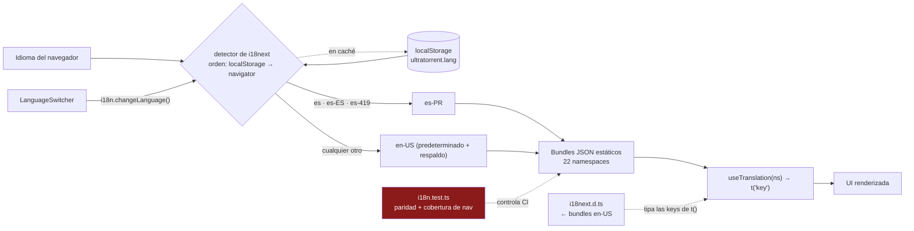

# Internacionalización

## Resumen

La UI está completamente localizada con **i18next + react-i18next** y viene con dos idiomas:
**en-US** (predeterminado y de respaldo) y **es-PR** (español de Puerto Rico). Las traducciones
son **JSON estático, tipado y organizado por namespace** — nada se carga por la red, y las keys
de `t()` se verifican en tiempo de compilación.

**La paridad de keys entre los dos idiomas la exige una prueba.** Un string que exista en un
idioma y no en el otro rompe la suite.

## Propósito

Añadir un string sin romper el build y sin dejar a los usuarios hispanohablantes mirando una
key cruda.

## Cuándo usarla

En todo string visible al usuario. En el código de UI nuevo no hay strings en inglés
hardcodeados.

## Prerrequisitos

- [Configuración local](/develop/setup).
- [Pruebas](/develop/testing) — la prueba de paridad corre bajo Vitest.

## Conceptos

### Estructura

```text
apps/frontend/src/i18n/
├── index.ts          init: imports estáticos, namespaces, mapa de fallback, detección
├── i18next.d.ts      module augmentation — los bundles en-US SON el tipo
├── i18n.test.ts      la prueba de paridad + cobertura de nav
└── locales/
    ├── en-US/        22 archivos de namespace
    └── es-PR/        los mismos 22, con las mismas keys
```

Los 22 namespaces:

`account`, `audit`, `auth`, `automation`, `common`, `dashboard`, `engines`, `files`,
`imdb`, `indexers`, `media`, `mediaServerAnalytics`, `modules`, `nav`,
`notificationCenter`, `prowlarr`, `rss`, `settings`, `shell`, `system`, `torrents`,
`users`.

Los namespaces se dividen **por superficie**, no por página. `common` es el namespace
predeterminado.

### Init

```ts
// apps/frontend/src/i18n/index.ts
fallbackLng: { es: ['es-PR'], 'es-ES': ['es-PR'], 'es-419': ['es-PR'], default: ['en-US'] },
detection: {
  order: ['localStorage', 'navigator'],
  lookupLocalStorage: 'ultratorrent.lang',
  caches: ['localStorage'],
},
```

Toda variante de navegador en español (`es`, `es-ES`, `es-419`) resuelve a **es-PR**. Todo lo
demás cae a **en-US**. La elección del usuario se persiste en localStorage bajo
`ultratorrent.lang` gracias al caché del detector de idioma — el selector en sí solo llama a
`i18n.changeLanguage(...)`.

También se configura: `defaultNS: 'common'`, `supportedLngs: ['en-US', 'es-PR']`,
`interpolation.escapeValue: false`, `react.useSuspense: false`.

### Keys tipadas

`i18next.d.ts` aumenta el module de i18next con los **bundles en-US como la forma canónica**:

```ts
// apps/frontend/src/i18n/i18next.d.ts
declare module 'i18next' {
  interface CustomTypeOptions {
    defaultNS: 'common';
    resources: {
      common: typeof common;
      nav: typeof nav;
      // …los 22
    };
  }
}
```

Así que `t('channels.titel')` es un **error de compilación**, no un string en blanco misterioso
en tiempo de ejecución.

### Cómo se usa

```tsx
const { t } = useTranslation('notificationCenter');
// …
<h1>{t('channels.title')}</h1>
<p>{t('channels.count', { count: channels.length })}</p>
```

Los valores dinámicos usan interpolación; los conteos usan la pluralización de i18next.

### La navegación es especial

`NAV_GROUPS` en `navigation.ts` se mantiene en **inglés canónico** y se traduce al renderizar:

```ts
tNav(t, 'items', item.label)   // → t(`items.${englishLabel}`, { ns: 'nav' })
```

O sea que el `label` de una entrada de nav es a la vez el string en inglés *y* la key de
traducción. Añade el mismo label bajo `items` en **ambos** archivos `nav.json`.

## El requisito de paridad

:::danger en-US y es-PR deben tener conjuntos de keys idénticos
Esto lo exige `apps/frontend/src/i18n/i18n.test.ts`. Una key en un idioma y no en el otro
**rompe la suite de pruebas**.
:::

```ts
// apps/frontend/src/i18n/i18n.test.ts
it('has identical key sets across en-US and es-PR for every namespace (parity)', () => {
  for (const ns of NAMESPACES) {
    const en = flatKeys(i18n.getResourceBundle('en-US', ns) ?? {}).sort();
    const es = flatKeys(i18n.getResourceBundle('es-PR', ns) ?? {}).sort();
    expect({ ns, keys: es }).toEqual({ ns, keys: en });
  }
});
```

Cada bundle se aplana a keys hoja con puntos y se comparan los conjuntos ordenados. El
envoltorio `{ ns, keys }` es un detalle amable: un fallo **nombra el namespace culpable** en
vez de escupir dos arreglos anónimos.

El mismo archivo también exige **cobertura de nav** — todo label de `NAV_GROUPS` tiene que
resolver, en ambos idiomas:

```ts
expect(i18n.exists(`items.${label}`, { ns: 'nav', lng })).toBe(true);
```

…además de `groups.*` y `descriptions.*`.

Por qué esto es una barrera dura y no una advertencia del linter: una key faltante no rompe la
app, renderiza la key cruda con puntos dentro de la UI. Sin la prueba,
`settings.advanced.retryPolicy.label` se envía calladito a todos los usuarios en español y
nadie se da cuenta por un mes.

## Diagrama



## Paso a paso: añadir un string

### A un namespace existente

1. **en-US** — `src/i18n/locales/en-US/<ns>.json`:

   ```json
   {
     "channels": {
       "created": "Channel created",
       "saveFailed": "Could not save the channel"
     }
   }
   ```

2. **es-PR** — `src/i18n/locales/es-PR/<ns>.json`, **la misma ruta de key**:

   ```json
   {
     "channels": {
       "created": "Canal creado",
       "saveFailed": "No se pudo guardar el canal"
     }
   }
   ```

3. **Úsalo**: `const { t } = useTranslation('notificationCenter');` → `t('channels.created')`.

4. **Corre la prueba**: `npm run test --workspace @ultratorrent/frontend`.

### Un namespace completamente nuevo

Regístralo en **tres** lugares, o no va a cargar:

1. `NAMESPACES` **y** `resources` en `src/i18n/index.ts`.
2. `CustomTypeOptions.resources` en `src/i18n/i18next.d.ts` (importa el bundle en-US).
3. Crea **ambos**: `locales/en-US/<ns>.json` y `locales/es-PR/<ns>.json`.

### Una entrada de nav

Añade el label en inglés bajo `items` en **ambos** archivos `nav.json` (más `descriptions.*` si
defines un `descriptionKey`). La aserción de cobertura de nav en `i18n.test.ts` te va a agarrar
si no lo haces.

## Solución de problemas

| Síntoma | Causa | Arreglo |
| --- | --- | --- |
| La prueba falla con una discrepancia `{ ns: 'media', keys: [...] }` | Una key existe en un idioma y no en el otro. | Añade la key faltante. El `ns` del fallo nombra el archivo. |
| Se renderiza una key cruda en la UI (`settings.foo.bar`) | La key no existe en el idioma activo. En en-US eso significa que no existe en absoluto. | Añádela. |
| TypeScript rechaza una key que claramente está ahí | Los tipos vienen del bundle **en-US**. | Añádela primero a en-US, luego a es-PR. |
| Los strings de un namespace nuevo nunca resuelven | Está registrado en solo uno o dos de los tres lugares. | Los tres: `NAMESPACES`, `resources`, `i18next.d.ts`. |
| El selector de idioma no se queda fijo | La key de caché en localStorage es `ultratorrent.lang`. | Verifica que no la estén limpiando. |
| Un label de nav sale en inglés para un usuario en español | El label no está bajo `items` en `es-PR/nav.json`. | Añádelo — los labels de `NAV_GROUPS` *son* las keys. |

## Consejos

- **Escribe ambos idiomas en el mismo commit.** Nada de "el español lo hago después" — la
  prueba no te va a dejar, y eso es a propósito.
- **No traduzcas a máquina un término técnico.** "Seeder", "magnet", "info-hash" son iguales en
  ambos. Traduce la oración alrededor de ellos.
- **Namespace por superficie, no por componente.** Un diálogo dentro de la página de RSS
  pertenece a `rss`, no a un namespace nuevo `rssDialog`.
- **Las keys son estructurales, no oraciones.** `channels.saveFailed`, no
  `couldNotSaveTheChannel`.
- **La prueba de paridad es barata de correr.** Córrela antes de hacer push; toma un segundo.

## Preguntas frecuentes

**¿Cómo añado un tercer idioma?**
Añade el código a `SUPPORTED_LANGUAGES` y a `supportedLngs`, crea `locales/<code>/` con los 22
namespaces y extiende el mapa de fallback. La prueba de paridad actualmente compara **en-US
contra es-PR específicamente** — tendrías que extenderla para cubrir el locale nuevo también.

**¿El backend está localizado?**
No. Los mensajes de error de la API están en inglés. La localización es asunto del frontend.

**¿La documentación está localizada?**
El sitio de Docusaurus está configurado para `en` + `es-PR` (reflejando la app), pero el árbol
de documentación en español es un esfuerzo de traducción aparte de los strings de la app.

**¿Y la pluralización?**
Los sufijos estándar `_one` / `_other` de i18next. Pasa `{ count }`.

## Lista de verificación

- [ ] La key existe en **en-US**.
- [ ] La key existe en **es-PR**, en la ruta idéntica.
- [ ] Un namespace nuevo está registrado en `index.ts` (`NAMESPACES` + `resources`) **y** en
      `i18next.d.ts`.
- [ ] El label de una entrada de nav nueva está en **ambos** archivos `nav.json` bajo `items`.
- [ ] `npm run test --workspace @ultratorrent/frontend` pasa en verde (paridad + cobertura de nav).
- [ ] No queda ningún string en inglés hardcodeado en el componente.

## Ver también

- [Pruebas](/develop/testing) — la suite en la que corre la prueba de paridad
- [Crear módulos](/develop/creating-modules) — el paso 10 es esta página
- [Estándares](/develop/standards)
