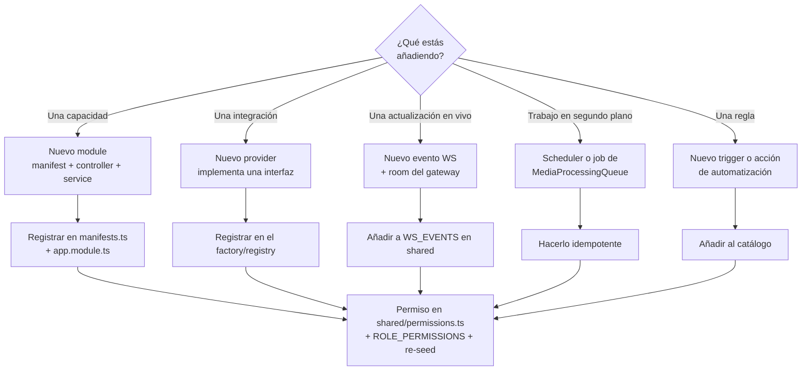

# Desarrollo

Todo lo que necesitas para cambiar UltraTorrent: cómo está organizado el repositorio, dónde
están las costuras de extensión y las convenciones que el código impone.

## Resumen

UltraTorrent es un monorepo de TypeScript: una API en **NestJS**, una SPA en **React + Vite**
y un paquete **shared** que ambas consumen. Es un único producto comunitario de código abierto:
no hay edición comercial, no hay overlay privado y no hay funciones tras un paywall. El acceso
se controla **solamente** con RBAC.

La meta de diseño que moldea casi todos los archivos que vas a tocar: **las integraciones
nuevas se añaden como providers o modules, nunca editando la lógica de negocio central.** Un
nuevo motor de torrents, una fuente de metadatos, un servidor de medios o un canal de
notificación no deberían requerir ningún cambio en los servicios que los consumen.

## Propósito

Esta sección es para quien quiere:

- Añadir un módulo de funcionalidad (manifest → permisos → rutas → página de UI).
- Añadir un provider (engine, indexer, metadatos, servidor de medios, canal de notificación).
- Entender el ciclo de vida del request, el gateway de tiempo real y el modelo de trabajos en
  segundo plano.
- Contribuir un arreglo y llevarlo por revisión, changesets y release.

## Cuándo usarla

| Quieres… | Ve a |
| --- | --- |
| Entender cómo encajan las piezas | [Arquitectura](/develop/architecture) |
| Levantar un entorno de desarrollo | [Configuración local](/develop/setup) |
| Añadir una funcionalidad | [Crear módulos](/develop/creating-modules) |
| Integrar un servicio externo | [Providers](/develop/providers) |
| Añadir o exigir un permiso | [RBAC](/develop/rbac) |
| Cambiar el esquema | [Base de datos y Prisma](/develop/database) |
| Entender login / 2FA / claves API | [Autenticación](/develop/authentication) |
| Enviar actualizaciones en vivo a la UI | [WebSockets](/develop/websockets) |
| Correr trabajo fuera del request | [Trabajos en segundo plano](/develop/background-jobs) |
| Añadir un disparador o acción de automatización | [Automatización](/develop/automation) |
| Escribir pruebas | [Pruebas](/develop/testing) |
| Añadir un string de UI | [Internacionalización](/develop/i18n) |
| Commit, changeset, release | [Estándares](/develop/standards) |

## Prerrequisitos

- **Node.js ≥ 20** (el repo declara `engines.node >= 20`).
- **PostgreSQL** y **Redis** — la manera más simple de tener ambos es Docker
  ([instalación con Docker Compose](/install/docker-compose)).
- Familiaridad con NestJS (decorators, DI, modules) y con componentes de función de React.

Empieza por [Aprende → Resumen de arquitectura](/learn/architecture-overview) si aún no lo has
leído — esta sección da por sentados los conceptos que allí se introducen.

## Conceptos

### Las capas de Clean Architecture

Las dependencias apuntan hacia adentro. El dominio no sabe nada de HTTP, de Prisma ni de
ningún motor en particular.

| Capa | Responsabilidad | Ejemplos |
| --- | --- | --- |
| **API** | Controllers, DTOs/validación, guards, el gateway de WebSocket | `*.controller.ts`, `RealtimeGateway` |
| **Aplicación** | Casos de uso, aplicación de RBAC, auditoría | `TorrentsService`, `EngineRegistryService`, `TorrentSyncService`, `MediaProcessingService` |
| **Dominio** | Contratos libres de framework — *las costuras* | `TorrentEngineProvider`, `MediaMetadataProvider`, tipos `Normalized*` |
| **Infraestructura** | Adaptadores concretos | `RTorrentProvider`, `QbittorrentProvider`, cliente XML-RPC/SCGI, `PrismaService` |

### Las tres costuras

1. **Modules** — cada capacidad es un module de NestJS con un manifest en
   `apps/backend/src/modules/module-registry/manifests.ts`. El registry valida los manifests
   al arrancar, resuelve el grafo de dependencias y rechaza los ciclos.
2. **Providers** — a los servicios externos solo se llega a través de interfaces
   (`TorrentEngineProvider`, `MediaMetadataProvider`, `MediaServerProvider`,
   `NotificationProvider`, …). Los providers declaran **capabilities**; una capability que un
   provider genuinamente no puede servir lanza `UnsupportedCapabilityError`.
3. **Permisos** — toda ruta protegida lleva `JwtAuthGuard` + `PermissionsGuard`
   + `@RequirePermissions(...)`, tomados del catálogo único en
   `packages/shared/src/permissions.ts`.

## Mapa del repo

```text
ultratorrent/
├── apps/
│   ├── backend/                 @ultratorrent/backend — la API NestJS
│   │   ├── prisma/
│   │   │   ├── schema.prisma    el modelo de datos
│   │   │   ├── migrations/      migraciones SQL (se aplican con `prisma migrate deploy`)
│   │   │   └── seed.ts          permisos, roles, admin inicial, configuración
│   │   └── src/
│   │       ├── main.ts          punto de entrada → bootstrap.ts
│   │       ├── bootstrap.ts     ensamblaje de la app Nest: Helmet, ValidationPipe, Swagger
│   │       ├── app.module.ts    module raíz — importa cada módulo de funcionalidad
│   │       ├── common/          transversal: decorators, guard de SSRF, cripto, filters
│   │       ├── config/          cargador de configuración tipada + validación de secretos
│   │       ├── domain/          contratos libres de framework (la costura del engine)
│   │       ├── infrastructure/  adaptadores: providers de engine, rtorrent/qbittorrent, Prisma
│   │       └── modules/         módulos de funcionalidad (controllers + services)
│   └── frontend/                @ultratorrent/frontend — la SPA React + Vite
│       └── src/
│           ├── i18n/locales/    JSON por namespace en en-US + es-PR
│           ├── lib/             cliente de la API, helpers
│           └── pages/           componentes de ruta
├── packages/
│   └── shared/                  @ultratorrent/shared — tipos, permisos, eventos WS
├── docs/                        la documentación canónica de ingeniería (ARCHITECTURE.md y demás)
└── website/                     este sitio de documentación (Docusaurus 3)
```

### Los módulos del backend

Cada funcionalidad bajo `apps/backend/src/modules/` es un module. Al momento de escribir esto:

`account`, `apikeys`, `audit`, `auth`, `automation`, `dashboard`, `engine`, `files`,
`indexers`, `integrations`, `media`, `media-acquisition`, `media-server-analytics`,
`module-registry`, `notification-center`, `notifications`, `realtime`,
`release-scoring`, `rss`, `search`, `settings`, `system`, `taxonomy`, `torrents`,
`two-factor`, `users`.

La lista autoritativa y generada —con tiers, dependencias y permisos— es la
[referencia de Módulos](/reference/modules).

## Paso a paso: tu primer cambio

1. **Lee la verdad de base.** `docs/ARCHITECTURE.md` en el repositorio es el documento de
   arquitectura canónico. Todo cambio arquitectónico lo actualiza *y* le añade una fila fechada
   a su Change Log.
2. **Ponlo a correr.** [Configuración local](/develop/setup) — instala, genera el cliente de
   Prisma, migra, corre el seed, `npm run dev`.
3. **Encuentra la costura.** ¿Tu cambio es un *module* nuevo (una capacidad) o un *provider*
   nuevo (una integración)? Casi nada debería ser un cambio a un servicio central existente.
4. **Protégelo con un guard.** Añade el permiso a `packages/shared/src/permissions.ts`,
   mapéalo en `ROLE_PERMISSIONS`, protege la ruta y vuelve a correr el seed.
5. **Pruébalo.** Jest para el backend, Vitest para el frontend. Las funciones puras (parsers,
   mappers, guards) son los blancos de mayor valor.
6. **Envíalo.** Commit convencional + un changeset. Ver [Estándares](/develop/standards).

## Ejemplo de código — la forma de todo

Una ruta protegida es toda la convención en miniatura. De
`apps/backend/src/modules/torrents/torrents.controller.ts`:

```ts
@ApiTags('torrents')
@ApiBearerAuth()
@Controller('torrents')
@UseGuards(JwtAuthGuard, PermissionsGuard)
export class TorrentsController {
  constructor(
    private readonly torrents: TorrentsService,
    private readonly parking: TorrentParkingService,
  ) {}

  @Get('parking')
  @RequirePermissions(PERMISSIONS.TORRENTS_VIEW)
  listParked(@Query('engineId') engineId?: string) {
    return this.parking.listParked(engineId);
  }
}
```

Controller delgado, permisos del catálogo compartido, todo el trabajo real en el service.

## Diagrama — dónde aterriza un cambio



## Solución de problemas

| Síntoma | Causa | Arreglo |
| --- | --- | --- |
| El backend se niega a arrancar: *"Module X depends on unknown module Y"* | Un manifest referencia un id de module que no está en `ALL_MANIFESTS`. | Corrige el arreglo `dependencies` en `manifests.ts`. |
| El backend se niega a arrancar: *"Circular dependency: …"* | Dos manifests dependen uno del otro. | Rompe el ciclo — una de las direcciones debería usar un evento o `ModuleRef` (lazy) en su lugar. |
| El backend se niega a arrancar: *"Refusing to start: insecure secret configuration"* | `NODE_ENV=production` con `JWT_ACCESS_SECRET` / `ENCRYPTION_KEY` sin definir, débiles o idénticos. | Define secretos fuertes y distintos, de ≥32 caracteres. Ver [referencia de entorno](/reference/environment). |
| Los tipos de `@ultratorrent/shared` están desactualizados | El backend/frontend consumen el paquete shared **compilado**. | Corre su build en modo watch, o `npm run build` desde la raíz. |
| Un permiso nuevo da 403 hasta para los admins | La fila del permiso no está en la base de datos. | Vuelve a correr el seed. Ver [RBAC](/develop/rbac). |

## Consejos

- **Shared primero.** Si tanto la API como la UI necesitan un tipo, un permiso o el nombre de
  un evento, eso pertenece a `@ultratorrent/shared`, no duplicado.
- **Normaliza en la frontera.** Un provider nunca debe dejar escapar hacia arriba un campo
  específico del motor. Mapea a las formas `Normalized*` y ahí paras.
- **Audita lo peligroso.** Toda acción de creación/eliminación/cambio de estado/seguridad
  registra una entrada con `AuditService.record(...)`.
- **La UI esconde; el servidor exige.** El estado de habilitado/deshabilitado de los módulos y
  el filtrado del menú son comodidad. La autorización siempre es el guard.

## Preguntas frecuentes

**¿Hay un sistema de plugins?**
Todavía no para terceros. La costura existe: `bootstrap.ts` acepta `externalModules` y
`ModuleRegistryService.registerExternal()` puede inyectar un manifest en tiempo de ejecución.
Un sistema de plugins publicado está listado como trabajo futuro en `docs/ARCHITECTURE.md`.

**¿Cuáles motores de torrents están implementados?**
rTorrent (XML-RPC sobre SCGI/HTTP) y qBittorrent (Web API v2). Transmission y Deluge están
reconocidos por la unión `EngineKind`, pero el factory lanza
`Engine "<kind>" is planned but not yet implemented`.

**¿Necesito Redis para desarrollar?**
El stack usa Redis para caché/coordinación. El archivo de Compose lo levanta junto a Postgres,
así que el camino de desarrollo más simple es la base de datos + caché de Compose con la app
corriendo desde el código fuente.

**¿Dónde está documentada la API?**
Swagger corre en `http://localhost:4000/api/docs` fuera de producción. La referencia generada
está en la [referencia de la API](/reference/api).

## Lista de verificación

- [ ] Leí `docs/ARCHITECTURE.md` para el área que estoy tocando.
- [ ] Mi cambio es un module o un provider nuevo, no un fork de un servicio central.
- [ ] Toda ruta nueva está protegida con `@RequirePermissions` del catálogo compartido.
- [ ] Todo input nuevo se valida con un DTO de `class-validator`.
- [ ] Las acciones destructivas quedan auditadas.
- [ ] Las pruebas cubren la lógica pura que añadí.
- [ ] Los strings nuevos de la UI existen en **ambos**, `en-US` y `es-PR`.
- [ ] Añadí un changeset.

## Ver también

- [Arquitectura](/develop/architecture) — el panorama completo, con diagramas
- [Aprende → Conceptos](/learn/concepts) — el vocabulario del dominio
- [Referencia de módulos](/reference/modules) — la tabla generada de manifests
- [Referencia de permisos](/reference/permissions) — el catálogo generado
- [Ayuda → Glosario](/help/glossary)
