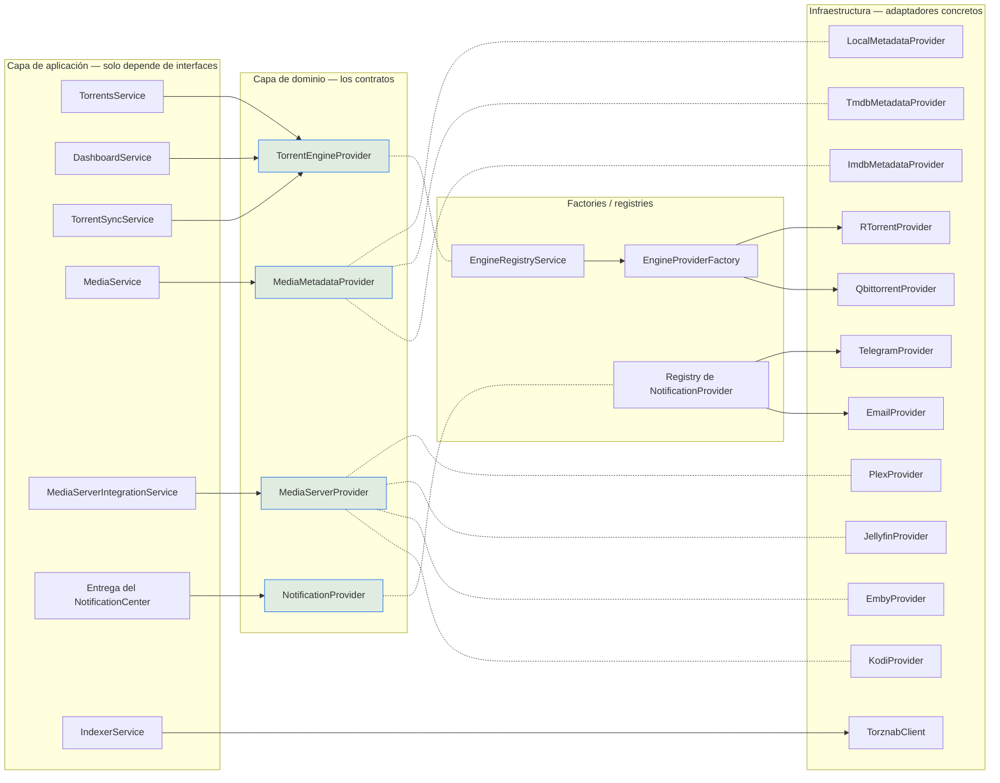
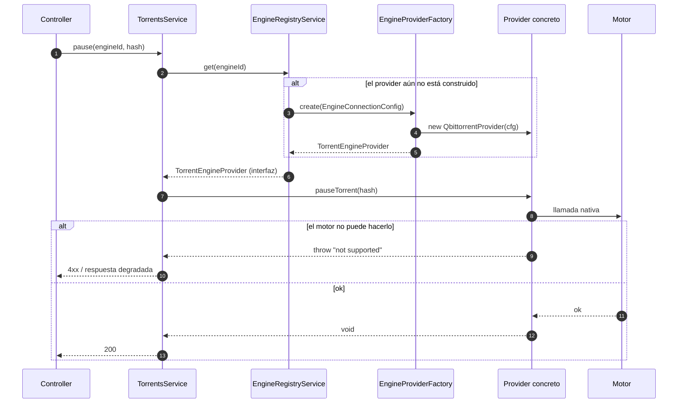

# Providers

## Resumen

Un **provider** es una interfaz en la capa de dominio que aísla un servicio externo — un
motor de torrents, una fuente de metadatos, un servidor de medios, un notificador, un
indexador — de la lógica de negocio que lo usa. Los servicios de aplicación dependen de la
interfaz. Nunca importan el cliente de un vendor.

**La regla de extensión:** una integración nueva es una **nueva implementación de una
interfaz de provider**, conectada a través de un factory o un registry. Debe requerir **cero
cambios** en los servicios que la consumen.

## Propósito

- Mantener el core estable mientras crece la superficie de integraciones.
- Hacer que los servicios externos sean intercambiables y comprobables de forma independiente.
- Darle a la UI una sola forma que renderizar, sin importar qué backend produjo los datos.

## Cuándo usarlo

Usa un provider siempre que lo que estás agregando sea **un sistema externo con su propio
protocolo**. Si es una *capacidad* de UltraTorrent en sí, lo que quieres es un
[módulo](/develop/creating-modules).

## Requisitos previos

- [Arquitectura](/develop/architecture) — las capas de Clean Architecture.
- Un entorno de desarrollo funcionando ([Configuración local](/develop/setup)).

## Conceptos

### Las interfaces de provider

| Interfaz | Propósito | Implementaciones incluidas |
| --- | --- | --- |
| `TorrentEngineProvider` | Controlar un motor de BitTorrent | `RTorrentProvider` (XML-RPC/SCGI), `QbittorrentProvider` (Web API v2) |
| `MediaMetadataProvider` | Resolver un título → metadatos | `LocalMetadataProvider`, `TmdbMetadataProvider`, `ImdbMetadataProvider` |
| `MediaServerProvider` | Sondear un servidor, disparar una actualización de biblioteca, leer sesiones | Plex, Jellyfin, Emby, Kodi |
| `NotificationProvider` | Entregar un mensaje a un canal | correo, SMS, Telegram, WhatsApp (+ fan-out a webhook/Discord/Slack en el módulo legacy de notificaciones) |
| `ArtworkProvider` | ID externo → candidatos de ilustraciones descargables | `TmdbArtworkProvider` |
| Cliente de indexador (Torznab/Newznab) | Buscar candidatos de lanzamientos en los indexadores | `TorznabClient` |
| `TvShowStatusProvider` | Resolver el estado de emisión de una serie | TMDB → conjunto de datos de IMDb → local, en orden de confianza |
| `LicenseProvider` | Decidir si un módulo está disponible | `CommunityLicenseProvider` (todo disponible) |

La tabla completa de estados, incluyendo los seams planificados (`SubtitleProvider`,
`StorageProvider`, `AuthenticationProvider`), está en `docs/ARCHITECTURE.md`.

### El modelo de capacidades

Los providers no son uniformes. Plex puede listar sesiones — Kodi no. qBittorrent puede
renombrar un archivo dentro de un torrent — rTorrent no. Dos mecanismos distintos expresan
esto:

**1. Un conjunto de capacidades declarado** — el provider contesta de entrada "¿qué puedo
hacer?", para que la aplicación pueda degradarse con gracia y la UI pueda esconder lo que no
existe:

```ts
// apps/backend/src/modules/media/media-server-provider.ts
/** Qué capacidades de lectura soporta un provider — las analíticas se degradan con gracia. */
export interface MediaServerCapabilities {
  libraries: boolean;
  recentlyAdded: boolean;
  sessions: boolean;
  watchHistory: boolean;
  refresh: boolean;
}

export interface MediaServerProvider {
  readonly kind: MediaServerKind;
  capabilities(): MediaServerCapabilities;
  testConnection(cfg: MediaServerConfig): Promise<TestResult>;
  getServerInfo(cfg: MediaServerConfig): Promise<ServerInfo>;
  /** Lanza {@link UnsupportedCapabilityError} cuando el provider no puede listar bibliotecas. */
  getLibraries(cfg: MediaServerConfig): Promise<MediaServerLibrary[]>;
  /** Sesiones en reproducción. Lanza {@link UnsupportedCapabilityError} donde no se soporta. */
  getSessions(cfg: MediaServerConfig): Promise<ProviderSession[]>;
  refreshLibrary(cfg: MediaServerConfig): Promise<void>;
}
```

**2. Un error tipado** — invocar una capacidad que el provider genuinamente no puede servir
**no es un fallo**, es un hecho sobre el provider. Lanza un error distinguible:

```ts
// apps/backend/src/modules/media/media-server-provider.ts
/** Se lanza cuando un provider genuinamente no puede servir una capacidad (no es un fallo). */
export class UnsupportedCapabilityError extends Error {
  constructor(
    public readonly capability: string,
    public readonly kind: string,
  ) {
    super(`${kind} does not support "${capability}".`);
    this.name = 'UnsupportedCapabilityError';
  }
}
```

Quienes llaman atrapan `UnsupportedCapabilityError` y omiten esa función, en vez de registrar
un error en rojo y alarmar al operador. Compara eso con un fallo *real* (el servidor está
caído, el token está mal) — eso es un throw ordinario.

El Centro de Notificaciones va más lejos y deriva un método `supports*()` por capacidad a
partir de una sola llamada a `capabilities()`, así que un provider concreto implementa casi
nada:

```ts
// apps/backend/src/modules/notification-center/notification-provider.ts
export abstract class BaseNotificationProvider implements NotificationProvider {
  abstract readonly kind: NotificationKind;
  abstract capabilities(): NotificationCapabilities;
  abstract validateRecipient(addr: NotificationAddress): boolean;
  abstract normalizeRecipient(addr: NotificationAddress): string | null;
  abstract send(config, addr, msg): Promise<SendResult>;
  abstract testConnection(config): Promise<HealthResult>;

  async connect(): Promise<void> {}
  async healthCheck(config) { return this.testConnection(config); }
  async sendBulk(config, addrs, msg) {
    return Promise.all(addrs.map((a) => this.send(config, a, msg)));
  }
  supportsRichCards() { return this.capabilities().richCards; }
  supportsMarkdown() { return this.capabilities().markdown; }
  // …uno por capacidad
}
```

### Normalización — la regla de oro

Mapea la representación del vendor a las formas compartidas `Normalized*`
(`packages/shared/src/torrent.ts`) y **nunca dejes que un campo del vendor escape del
provider**. Info-hashes en minúsculas, `progress` como `0..1`, tasas en bytes/seg, marcas de
tiempo ISO, `TorrentState` mapeado. Esa es toda la razón por la que a la UI no le importa
cuál motor está corriendo.

## Diagrama de la arquitectura de providers



## Paso a paso: escribe un nuevo provider de motor de torrents

Este es el punto de extensión estelar. Como todo habla con los motores **únicamente** a
través de `TorrentEngineProvider`, agregar Transmission o Deluge toca **dos archivos** — y
ningún controller, servicio, DTO ni pantalla de la UI.

### 1. Implementa la interfaz

Crea `apps/backend/src/infrastructure/engine/<engine>/<engine>.provider.ts`:

```ts
import { EngineKind, NormalizedTorrent /* …todos los tipos Normalized* + stats… */ } from '@ultratorrent/shared';
import {
  EngineConnectionConfig,
  TorrentEngineProvider,
} from '../../../domain/engine/torrent-engine-provider.interface';

export class TransmissionProvider implements TorrentEngineProvider {
  readonly kind: EngineKind = 'transmission';
  readonly engineId: string;

  constructor(cfg: EngineConnectionConfig) {
    this.engineId = cfg.engineId;
    // construye tu transporte/cliente desde cfg (host/port/url/socketPath/baseUrl/…/timeoutMs)
  }

  async connect(): Promise<void> { /* … */ }
  async disconnect(): Promise<void> { /* … */ }
  async healthCheck(): Promise<EngineHealth> {
    // { online, latencyMs, version, error, checkedAt }
  }

  async listTorrents(): Promise<NormalizedTorrent[]> {
    // 1. llama a la API nativa del motor
    // 2. MAPEA cada registro nativo a un NormalizedTorrent:
    //    info-hash en minúsculas, progress 0..1, tasas en bytes/seg,
    //    marcas de tiempo ISO, estado nativo → TorrentState
  }

  // …implementa cada método de la interfaz…
}
```

La configuración de transporte que recibes es `EngineConnectionConfig`, que ya carga tanto
una forma estilo SCGI como una forma de Web API por HTTP:

```ts
// apps/backend/src/domain/engine/torrent-engine-provider.interface.ts
export interface EngineConnectionConfig {
  kind: EngineKind;
  engineId: string;
  // rTorrent transport
  mode?: 'scgi-tcp' | 'scgi-unix' | 'http';
  host?: string;
  port?: number;
  socketPath?: string;
  url?: string;
  timeoutMs?: number;
  // qBittorrent Web API transport
  baseUrl?: string;
  username?: string;
  password?: string;
}
```

Si tu motor necesita detalles de transporte nuevos, **extiende `EngineConnectionConfig`
(dominio) y el `EngineConnectionDto`** — no cueles campos específicos del motor a través de
la lógica de negocio.

### 2. Regístralo en el factory

```ts
// apps/backend/src/infrastructure/engine/engine-provider.factory.ts
@Injectable()
export class EngineProviderFactory {
  create(config: EngineConnectionConfig): TorrentEngineProvider {
    switch (config.kind) {
      case 'rtorrent':
        return new RTorrentProvider(config);
      case 'qbittorrent':
        return new QbittorrentProvider(config);
      case 'transmission':
      case 'deluge':
        throw new Error(
          `Engine "${config.kind}" is planned but not yet implemented`,
        );
      default:
        throw new Error(`Unknown engine kind: ${config.kind}`);
    }
  }
}
```

Reemplaza el `throw` con tu `case`. Eso es todo. `EngineRegistryService` construye las
instancias de provider a partir de las filas de `TorrentEngine` guardadas usando este
factory, y `TorrentsService` / `DashboardService` / `TorrentSyncService` funcionan de
inmediato contra el motor nuevo — solo vieron la interfaz.

### 3. Maneja los secretos

Si el motor se autentica con una contraseña (como hace la Web API de qBittorrent), ciframos
en reposo. `apps/backend/src/modules/engine/engine-secrets.ts` provee
`encryptEngineConfig` / `decryptEngineConfig` / `hasEngineSecret`, que cifran el valor con
AES-256-GCM bajo un marcador `__encrypted`. `EngineService.create/update` cifran al escribir,
el endpoint de listado devuelve una bandera `hasPassword` en vez de la contraseña, y
`EngineRegistryService.reload` descifra antes de construir el provider.

### 4. Declara lo que no puedes hacer

Si una capacidad genuinamente no existe en el motor, lanza (`throw`) un error claro en vez de
fingirla — como hace `RTorrentProvider.renameFile`. Así la capa de aplicación puede degradarse
con gracia en lugar de hacer lo incorrecto en silencio.

### 5. Prueba las partes puras

Las funciones de mapeo son puras y no tienen I/O. Eso las convierte en las pruebas unitarias
de mayor valor del código base — mira las specs existentes de `qbittorrent.provider` y
`rtorrent.provider`.

## Paso a paso: otros tipos de provider

### Un provider de metadatos

Implementa `MediaMetadataProvider` (`apps/backend/src/modules/media/metadata-provider.ts`):

```ts
export interface MediaMetadataProvider {
  readonly name: string;
  lookup(query: MediaLookup): Promise<MediaMetadata>;
  /** Enriquecimiento detallado que usa MediaMetadataService. Null cuando no se encuentra nada. */
  fetchDetails(query: MediaLookup): Promise<MediaMetadataDetails | null>;
}
```

Dos convenciones que debes copiar de `TmdbMetadataProvider`:

- **Falla suave.** Cada llamada de red va envuelta en un try/catch que devuelve `{}` o `null`.
  Que un provider de metadatos esté caído nunca debe romper el escaneo de una biblioteca.
- **Acota la llamada.** Un `AbortController` con un timeout de 8 segundos, limpiado en el
  `finally`.
- Devuelve los IDs externos en el mapa agnóstico al provider: `externalIds: { tmdb: '603', imdb: 'tt0133093' }`.

`LocalMetadataProvider` es la implementación null-object: no devuelve nada, así que el
renombrador recae en el nombre del lanzamiento ya analizado y el sistema funciona completo
sin conexión.

### Un provider de servidor de medios

Implementa `MediaServerProvider`. Declara `capabilities()` con honestidad, y lanza
`UnsupportedCapabilityError('sessions', this.kind)` para lo que no puedas servir. Los secretos
(tokens/claves/contraseñas) se cifran con AES-GCM en reposo y se redactan en las respuestas de
la API.

### Un provider de notificaciones

Extiende `BaseNotificationProvider`, implementa los cinco miembros abstractos y agrega una
entrada en el factory. El registry expone `kind + capabilities + config schema` a la UI, así
que el formulario del canal se renderiza solo a partir de tu declaración.

### Un indexador

Los indexadores hablan **Torznab/Newznab**, así que en la práctica configuras un indexador
nuevo en vez de escribir código. `TorznabClient` negocia las capacidades con `t=caps` y
analiza la respuesta RSS/XML en candidatos normalizados:

```ts
// apps/backend/src/modules/indexers/torznab-client.ts
/** Un candidato de lanzamiento normalizado, devuelto por la búsqueda de un indexador. */
export interface IndexerCandidate {
  indexerId: string;
  indexerName: string;
  title: string;
  /** magnet: (preferido) o una URL http(s) a un .torrent — null cuando no hay ninguno. */
  downloadUrl: string | null;
  infoHash: string | null;
  sizeBytes: number | null;
  seeders: number | null;
  categories: number[];
}
```

Mira [Módulos → Indexadores](/modules/indexers).

## Secuencia — una llamada a un provider de punta a punta



## Solución de problemas

| Síntoma | Causa | Solución |
| --- | --- | --- |
| `Engine "transmission" is planned but not yet implemented` | El factory no tiene un `case` para ese kind. | Implementa el provider y agrega el `case`. |
| `Unknown engine kind: …` | El `kind` no está en la unión `EngineKind`. | Agrégalo a `packages/shared/src/torrent.ts` y reconstruye shared. |
| Los datos de un provider se ven mal en la UI | Un campo nativo se escapó hacia arriba, o el mapeo está mal (p. ej. progress como `0..100` en vez de `0..1`). | Arregla el mapper. Nunca parchees la UI para compensar. |
| Una función del servidor de medios sale con error rojo en los logs | El código está lanzando un `Error` genérico en vez de `UnsupportedCapabilityError`. | Lanza el error tipado — quienes llaman ya lo manejan. |
| Agregar un magnet "falla" pero el torrent baja bien | Confirmar la carga de un magnet tiene una ventana corta, y el motor puede tardar mucho más en obtener los metadatos desde DHT. `RTorrentProvider.confirmTorrentLoaded` trata el timeout de un magnet como *aceptado/pendiente*, y solo el timeout de un archivo `.torrent` como un fallo duro. | Preserva esa distinción en un provider nuevo. |

## Consejos

- **Un provider es dueño de su transporte, sus timeouts y sus reintentos.** Nada por encima
  de él debería saber que el motor tiene un socket SCGI.
- **Confirma las operaciones destructivas.** `RTorrentProvider.removeTorrent` borra *y luego
  verifica la ausencia*, con reintentos, porque el motor puede aceptar la llamada y aun así
  dejar la descarga cargada. Un "éxito" fantasma envenena el registro de idempotencia de la
  automatización.
- **Sé honesto con los mapeos con pérdida.** La "priority" por torrent de qBittorrent es una
  posición en la cola, así que `setTorrentPriority` solo mapea los extremos a operaciones de
  tope/fondo de cola y `TorrentPriority` reporta `NORMAL`. Documenta eso — no inventes una
  fidelidad que no tienes.
- **SSRF.** Cualquier provider que descargue una URL suministrada por un sistema externo tiene
  que pasar por `fetchRemoteTorrent` / el guard de `common/ssrf.ts`. Los indexadores
  autoalojados en IPs privadas necesitan `SSRF_ALLOW_HOSTS`.

## Preguntas frecuentes

**¿Puedo agregar un provider sin tocar el repositorio?**
Hoy no. El seam existe (`bootstrap.ts` acepta `externalModules`, y
`ModuleRegistryService.registerExternal()` inyecta un manifest en tiempo de ejecución), pero
un sistema publicado de plugins de terceros es trabajo futuro.

**¿De dónde saca su configuración el provider?**
De una fila en la base de datos — `TorrentEngine`, `MediaServerIntegration`, un `Channel` de
notificaciones, un `Indexer` — con los secretos descifrados al momento de la llamada. Los
providers no guardan estado respecto a la configuración: se les pasa.

**¿Los providers corren en el camino del request?**
Las llamadas al motor sí (una pausa es síncrona). El trabajo de metadatos, ilustraciones y
servidores de medios se despacha a la [cola de procesamiento](/develop/background-jobs), para
que un tercero lento nunca pueda provocar un timeout en un request HTTP.

## Lista de verificación

- [ ] Mi provider implementa la interfaz por completo — sin métodos `// TODO`.
- [ ] Cada campo nativo está mapeado a una forma `Normalized*` — ninguno se escapa.
- [ ] Las capacidades que no puedo servir lanzan `UnsupportedCapabilityError` (o un error
      claro de "no soportado" en el seam del motor), no un no-op silencioso.
- [ ] Los timeouts están acotados, y los fallos de red fallan suave donde quien llama lo espera.
- [ ] Los secretos están cifrados en reposo y redactados en las respuestas.
- [ ] El registry/factory tiene mi entrada.
- [ ] Las funciones puras de mapeo tienen pruebas unitarias.
- [ ] Cambié **cero** servicios consumidores.

## Ver también

- [Arquitectura](/develop/architecture)
- [Crear módulos](/develop/creating-modules)
- [Módulos → Motores](/modules/engines) · [Indexadores](/modules/indexers) · [Centro de Notificaciones](/modules/notification-center)
- [Pruebas](/develop/testing)
