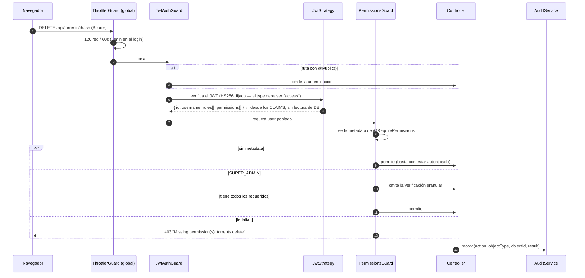
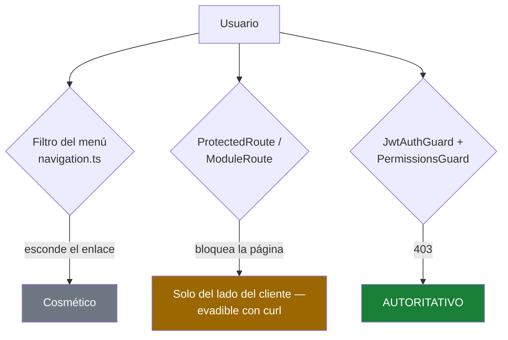

# RBAC

## Resumen

La autorización en UltraTorrent es **solo RBAC**. Todas las funciones vienen incluidas en el
producto — un administrador otorga acceso con roles y permisos. No hay licenciamiento, ni
ediciones, ni funciones bajo llave. La única decisión de acceso que el servidor toma es:

> *¿este principal tiene el permiso requerido?*

Los permisos son **cadenas granulares con espacios de nombre separados por puntos**
(`dominio.acción`), definidas una sola vez en `packages/shared/src/permissions.ts` y
consumidas tanto por los guards del backend como por las verificaciones de capacidad del
frontend.

## Propósito

Agregar un permiso, proteger una ruta con un guard, y entender exactamente qué cuenta — y qué
no cuenta — como control de acceso.

## Cuándo usarlo

Cada vez que agregas una ruta. No hay rutas mutantes sin guard.

## Requisitos previos

- [Autenticación](/develop/authentication) — de dónde sale el principal.
- [Crear módulos](/develop/creating-modules) — los permisos se declaran en el manifest.

## Conceptos

### El catálogo

```ts
// packages/shared/src/permissions.ts
export const PERMISSIONS = {
  // Torrents
  TORRENTS_VIEW: 'torrents.view',
  TORRENTS_ADD: 'torrents.add',
  TORRENTS_DELETE: 'torrents.delete',
  TORRENTS_DELETE_DATA: 'torrents.delete_data',
  // …
} as const;

export type Permission = (typeof PERMISSIONS)[keyof typeof PERMISSIONS];
export const ALL_PERMISSIONS: Permission[] = Object.values(PERMISSIONS);
```

Como `Permission` es una unión de los valores literales, `@RequirePermissions('torrents.veiw')`
es un **error de compilación**. Nunca escribas la cadena a mano — siempre usa la constante.

### Los roles

```ts
export enum SystemRole {
  SUPER_ADMIN = 'SUPER_ADMIN',
  ADMINISTRATOR = 'ADMINISTRATOR',
  POWER_USER = 'POWER_USER',
  USER = 'USER',
  READ_ONLY = 'READ_ONLY',
}
```

Los conjuntos de roles son **explícitos, no heredados** — cada rol enumera lo que tiene, así
que siempre puedes leer con precisión lo que puede hacer:

```ts
export const ROLE_PERMISSIONS: Record<SystemRole, Permission[]> = {
  [SystemRole.SUPER_ADMIN]: ALL_PERMISSIONS,
  [SystemRole.ADMINISTRATOR]: ALL_PERMISSIONS.filter(
    (p) => p !== PERMISSIONS.SYSTEM_MANAGE,
  ),
  [SystemRole.POWER_USER]: [ /* … */ ],
  [SystemRole.USER]: [ /* … */ ],
  [SystemRole.READ_ONLY]: [ /* … */ ],
};
```

`SUPER_ADMIN` es especial: el guard hace corto circuito para él, así que implícitamente lo
tiene todo. `ADMINISTRATOR` es todo **excepto** `system.manage`.

La tabla generada, siempre al día, vive en [Referencia de permisos](/reference/permissions).

### Los guards

Dos guards, siempre juntos:

```ts
@Controller('torrents')
@UseGuards(JwtAuthGuard, PermissionsGuard)
export class TorrentsController {
  @Get()
  @RequirePermissions(PERMISSIONS.TORRENTS_VIEW)
  list(/* … */) { /* … */ }
}
```

`JwtAuthGuard` autentica (y respeta `@Public()`). `PermissionsGuard` autoriza:

```ts
// apps/backend/src/modules/auth/guards/permissions.guard.ts
canActivate(context: ExecutionContext): boolean {
  const required = this.reflector.getAllAndOverride<Permission[]>(
    PERMISSIONS_KEY,
    [context.getHandler(), context.getClass()],
  );
  if (!required || required.length === 0) return true;

  const user = context.switchToHttp().getRequest().user as AuthenticatedUser;
  if (!user) throw new ForbiddenException('Not authenticated');

  // Los super admins se saltan las verificaciones granulares.
  if (user.roles?.includes(SystemRole.SUPER_ADMIN)) return true;

  const held = new Set(user.permissions ?? []);
  const missing = required.filter((p) => !held.has(p));
  if (missing.length > 0) {
    throw new ForbiddenException(`Missing permission(s): ${missing.join(', ')}`);
  }
  return true;
}
```

Tres cosas que debes notar:

1. **Múltiples permisos se combinan con AND.** `@RequirePermissions(A, B)` requiere *ambos*.
2. **Una ruta sin `@RequirePermissions` se le permite a cualquier usuario autenticado.** El
   guard devuelve `true` cuando la metadata está ausente. Si una ruta debe estar restringida,
   dilo.
3. **El conjunto de permisos viene del JWT**, no de una consulta a la base de datos por cada
   request. Mira la advertencia abajo.

:::warning Los permisos van cacheados en el access token
`JwtStrategy.validate()` construye el principal puramente a partir de los claims del token —
**no hay lectura de la base de datos por request**. Por eso, un cambio de rol (o una cuenta
desactivada) no surte efecto hasta que el **access token del usuario expire** (TTL por defecto
de 15 minutos) y se refresque. Diseña con esto en mente: para una revocación inmediata también
tienes que revocar la familia del refresh token, que es lo que hace `AuthService.changePassword`.
:::

### Dónde se registra un permiso

Un permiso tiene que existir en tres lugares antes de que se pueda otorgar:

| Lugar | Qué hace | Quién lo escribe |
| --- | --- | --- |
| `PERMISSIONS` en `packages/shared/src/permissions.ts` | La constante tipada que usan los guards | Tú |
| `ROLE_PERMISSIONS` | Cuáles roles integrados lo tienen | Tú |
| La **tabla** `permissions` | La fila a la que se mapean los roles | El **seed** (`ALL_PERMISSIONS`), *y* `ModulePermissionSyncService` en el arranque para todo lo declarado en un manifest de módulo |

`ModulePermissionSyncService` hace upsert de la **fila** — nunca la otorga. Otorgar es cosa de
`ROLE_PERMISSIONS` + el seed.

## Diagrama — el camino de la autorización



## Paso a paso: agrega un permiso de punta a punta

### 1. Defínelo

```ts
// packages/shared/src/permissions.ts
export const PERMISSIONS = {
  // …
  WIDGETS_VIEW: 'widgets.view',
  WIDGETS_MANAGE: 'widgets.manage',
} as const;
```

Nomenclatura: `dominio.acción`, snake_case dentro de cada segmento (`torrents.delete_data`,
`settings.manage_root_path`). Los sub-espacios de nombre están bien
(`media_manager.imdb.import_dataset`).

### 2. Otórgaselo a los roles

```ts
export const ROLE_PERMISSIONS: Record<SystemRole, Permission[]> = {
  // SUPER_ADMIN / ADMINISTRATOR lo reciben automáticamente (ALL_PERMISSIONS).
  [SystemRole.POWER_USER]: [
    // …
    PERMISSIONS.WIDGETS_VIEW,
    PERMISSIONS.WIDGETS_MANAGE,
  ],
  [SystemRole.USER]: [
    // …
    PERMISSIONS.WIDGETS_VIEW,
  ],
  [SystemRole.READ_ONLY]: [
    // …
    PERMISSIONS.WIDGETS_VIEW,
  ],
};
```

Sé deliberado. `READ_ONLY` nunca debería tener un permiso que mute datos. `USER` no debería
tener `.delete`.

### 3. Reconstruye shared

```bash
npm run build --workspace @ultratorrent/shared
```

De lo contrario, el backend y el frontend siguen viendo el catálogo viejo.

### 4. Decláralo en el manifest

```ts
// apps/backend/src/modules/module-registry/manifests.ts
permissions: [P.WIDGETS_VIEW, P.WIDGETS_MANAGE],
```

Esto es lo que hace que la fila se haga upsert en el arranque, y lo que documenta la
[Referencia de módulos](/reference/modules).

### 5. Protege la ruta con el guard

```ts
@Delete(':id')
@RequirePermissions(PERMISSIONS.WIDGETS_MANAGE)
remove(@Param('id') id: string, @CurrentUser() user: AuthenticatedUser) {
  return this.widgets.remove(id, user?.id);
}
```

### 6. Corre el seed otra vez

```bash
npm run prisma:seed
```

Es idempotente: hace upsert de las filas de permisos y luego **re-sincroniza** las concesiones
de cada rol (`deleteMany` + `createMany`), así que tu mapeo nuevo realmente cae en los roles
existentes.

### 7. Limita la UI

```tsx
const { hasPermission } = useAuth();
// …
{hasPermission(PERMISSIONS.WIDGETS_MANAGE) && <Button onClick={…}>Delete</Button>}
```

O el hook de conveniencia para un solo permiso:

```ts
// apps/frontend/src/auth/AuthContext.tsx
/** Hook de conveniencia que devuelve la verificación de un solo permiso. */
export function usePermission(perm: Permission | string): boolean {
  return useAuth().hasPermission(perm);
}
```

La verificación refleja la del servidor, incluyendo el bypass del super admin:

```ts
const hasPermission = useCallback(
  (perm: Permission | string): boolean => {
    if (!user) return false;
    if (user.roles?.includes(SystemRole.SUPER_ADMIN)) return true;
    return user.permissions?.includes(perm) ?? false;
  },
  [user],
);
```

### 8. Limita la ruta y la entrada del menú

Agrega `permission` al `<ProtectedRoute>` y al `NavItem` en `navigation.ts`. Ambos son
conveniencia — el servidor sigue siendo el que impone.

### 9. Delimita el feed en tiempo real, si tiene uno

Si tu función empuja eventos por WebSocket, agrega su permiso de vista a `SCOPED_PERMISSIONS` y
mapea el prefijo del evento a una sala en `RealtimeGateway.roomForEvent()`. De lo contrario tus
eventos caen en la sala `authenticated`, que no tiene permisos, y **todo el mundo** los recibe.
Mira [WebSockets](/develop/websockets).

## Las tres capas, y cuál es la autoritativa



**Activar o desactivar un módulo no es autorización.** Un módulo desactivado esconde su entrada
en el menú y su ruta — pero sus rutas de API siguen existiendo y siguen gobernadas por el guard
de permisos. Nunca confíes en que "el módulo está apagado" para dejar a alguien afuera.

## Solución de problemas

| Síntoma | Causa | Solución |
| --- | --- | --- |
| `403 Missing permission(s): widgets.manage` para un usuario que *sí* tiene el rol | Las concesiones del rol están desactualizadas en la base de datos. | Corre `npm run prisma:seed` otra vez — re-sincroniza los mapeos rol→permiso. |
| Un cambio de permiso no surte efecto para un usuario con sesión iniciada | Los permisos viven en el access token — el principal no se vuelve a leer en cada request. | Espera a que expire el TTL del access token (15 min), o fuerza un nuevo inicio de sesión. |
| Cualquier usuario con sesión iniciada puede alcanzar una ruta | No tiene `@RequirePermissions`. El guard permite cuando la metadata está ausente. | Agrega el decorator. |
| TypeScript rechaza mi cadena de permiso | `Permission` es una unión de literales. | Usa la constante `PERMISSIONS.*`. |
| La UI muestra un botón que da 403 | La verificación de la UI y el guard de la ruta usan permisos distintos. | Haz que coincidan. El servidor tiene la razón — arregla la UI. |
| Un usuario recibe eventos WS de una función que no puede leer | El evento no está mapeado a una sala `perm:`. | Mapéalo en `roomForEvent()`. |

## Consejos

- **Separa ver de administrar.** `x.view` y `x.manage` es la base. Agrega `x.delete` cuando
  borrar sea genuinamente más peligroso que editar (casi siempre lo es).
- **Audita todo lo que protejas con un permiso destructivo.** `AuditService.record(...)` con
  actor, IP, user agent y resultado.
- **No inventes cadenas ad-hoc.** Si no está en el catálogo, no es un permiso.
- **`SUPER_ADMIN` se salta todo.** Eso incluye tu guard nuevo. Prueba con un rol menor, o nunca
  vas a ver tu 403.

## Preguntas frecuentes

**¿Puedo crear roles personalizados?**
Sí — los roles son filas en la base de datos construidas desde el mismo catálogo, y se
administran en Administración → Usuarios → Roles (requiere `roles.manage`). Los cinco
`SystemRole` son la base que instala el seed.

**¿Por qué `files.manage` sigue ahí si ya hay permisos granulares de archivos?**
Es un paraguas legacy que se mantiene por retrocompatibilidad (el renombrador de medios todavía
lo usa). El código nuevo debe usar las llaves granulares.

**¿Existe una variante OR (cualquiera de) de `@RequirePermissions`?**
No. Es solo AND. Si necesitas semántica de "cualquiera de", haz la verificación dentro del
servicio.

**¿Cuántos permisos hay?**
Mira la [Referencia de permisos](/reference/permissions) generada — se construye desde el
código fuente al momento de generar la documentación, así que nunca puede quedar desfasada.

## Lista de verificación

- [ ] Constante agregada a `PERMISSIONS`.
- [ ] Mapeada en cada entrada apropiada de `ROLE_PERMISSIONS` (y *no* en `READ_ONLY` si muta
      datos).
- [ ] `@ultratorrent/shared` reconstruido.
- [ ] Declarada en el manifest del módulo.
- [ ] Ruta protegida con `@UseGuards(JwtAuthGuard, PermissionsGuard)` + `@RequirePermissions`.
- [ ] Seed corrido de nuevo.
- [ ] UI limitada con `hasPermission` / `usePermission`.
- [ ] Eventos WS (si los hay) mapeados a una sala `perm:`.
- [ ] Acción destructiva auditada.
- [ ] Probado con un rol que no sea super admin.

## Ver también

- [Referencia de permisos](/reference/permissions) — el catálogo generado
- [Autenticación](/develop/authentication) — de dónde sale el principal
- [Crear módulos](/develop/creating-modules)
- [WebSockets](/develop/websockets) — salas delimitadas por permiso
- [Módulos → Usuarios](/modules/users) · [Auditoría](/modules/audit)
- [Operar → Seguridad](/operate/security)
