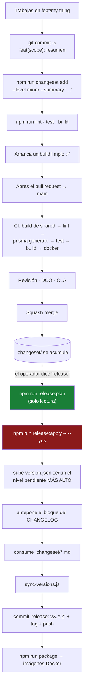

# Estándares

## Resumen

Las convenciones que logran que un cambio se revise y se integre: cómo debe verse el código,
cómo debe leerse el commit, qué es un changeset y qué pasa cuando alguien dice *release*.

Las fuentes autoritativas en el repositorio son `docs/CONTRIBUTING.md`,
`docs/VERSIONING.md`, `docs/RELEASE_PROCESS.md` y `docs/BUILD.md`. Esta página es la destilación
para quien contribuye.

## Estándares de código

De `docs/DEVELOPMENT.md`, y se exigen en revisión:

- **Clean Architecture, impuesta por los imports.** El dominio se mantiene libre de framework.
  Los servicios de aplicación dependen de interfaces del dominio, nunca de infraestructura. La
  UI y el código de aplicación nunca referencian un tipo específico de un motor.
- **Nada de lógica de negocio en los controllers.** Los controllers validan, autorizan y
  delegan. Todo el trabajo real vive en los services.
- **Normaliza los datos del provider.** Los providers traducen los datos nativos a los DTOs
  `Normalized*` y nunca dejan escapar campos crudos hacia arriba. Una capability no soportada
  lanza un error explícito.
- **Permisos del catálogo.** Siempre `@RequirePermissions(PERMISSIONS.*)` usando las constantes
  compartidas — nunca un string improvisado.
- **Audita lo peligroso.** Toda acción de creación / eliminación / cambio de estado / seguridad
  registra una entrada de auditoría.
- **Valida todo input** con DTOs de `class-validator`. Nunca confíes directamente en un valor
  del query o del body.
- **El modo estricto de TypeScript** está activo (`strict`, `noImplicitAny`,
  `noFallthroughCasesInSwitch`, …). Mantenlo libre de advertencias.
- **Shared primero.** Los tipos, permisos y nombres de eventos que necesitan tanto la API como
  la UI pertenecen a `@ultratorrent/shared`, no duplicados.

Más dos que vienen de `docs/ARCHITECTURE.md` y de cosas que de verdad se rompieron:

- **Las integraciones nuevas son providers o modules.** No ediciones a los servicios centrales.
- **Mantén `ARCHITECTURE.md` al día.** Todo cambio arquitectónico actualiza la sección relevante
  **y** le añade una fila fechada a su Change Log. Ese log es la memoria institucional de este
  código y es inusualmente bueno — lee unas cuantas filas antes de cambiar algo sutil.

## Antes de hacer push

```bash
npm run lint      # ESLint, --max-warnings 0
npm run test      # Jest (backend) + Vitest (frontend)
npm run build     # shared → backend → frontend
```

:::caution No existe un script de `typecheck`
Buscar con grep `typecheck` / `type-check` / `tsc --noEmit` en cada `package.json` no devuelve
nada. La verificación de tipos ocurre **solo** como efecto secundario de `npm run build`. Así
que `npm run build` no es opcional antes de hacer push.
:::

Y la que las pruebas unitarias no pueden hacer por ti: **arranca un build limpio.** `tsc` y Jest
no ejercitan la DI de NestJS ni el cableado de los modules. Un servidor de desarrollo corriendo
desde un `dist/` viejo va a seguir sirviendo felizmente el código anterior mientras tu module
nuevo no logra resolverse.

## Ramas y commits

Ramifica desde `main`: `<type>/<short-slug>` — `feat/`, `fix/`, `docs/`, `refactor/`, `test/`,
`chore/`. Haz rebase sobre `main`; no hagas merge de `main` hacia adentro.

**[Conventional Commits](https://www.conventionalcommits.org/):**

```text
<type>(<optional scope>): <short summary>

<optional body>

<optional footer>
```

| Parte | Valores |
| --- | --- |
| **Tipos** | `feat`, `fix`, `docs`, `refactor`, `test`, `chore`, `perf`, `build`, `ci` |
| **Scopes** | reflejan los workspaces/módulos: `backend`, `frontend`, `shared`, `auth`, `torrents`, `engine`, `rtorrent`, `realtime`, `audit`, `prisma`, … |
| **Breaking** | un footer `BREAKING CHANGE:`, o un `!` después del tipo — `feat(api)!: …` |

```bash
git commit -s -m "feat(engine): add Deluge provider"
```

**El `-s` no es opcional** — todo commit tiene que llevar un **sign-off del DCO**. Arregla una
rama existente con `git rebase --signoff main`.

Un bot de **CLA-Assistant** comenta en tu primer pull request. Firmas una sola vez, comentando:

> `I have read the CLA Document and I hereby sign the CLA`

## Changesets

Todo cambio que deba aparecer en un release viene con un **changeset**, commiteado junto al
trabajo que describe.

El flujo está modelado sobre [Changesets](https://github.com/changesets/changesets) — la
convención `.changeset/*.md` — pero lo manejan scripts en `ops/scripts/`, **no el CLI de
Changesets**.

```bash
npm run changeset:add -- --level <patch|minor|major> --summary "<concise summary>"
# equivalente:
node ops/scripts/changeset-add.js --level <patch|minor|major> --summary "<…>"
```

Esto escribe `.changeset/<level>-<id>.md`.

### La regla práctica

> **Lo arreglaste → patch. Le añadiste → minor. Lo rompiste o lo borraste → major.**

| Nivel | Significado | Aterriza en el CHANGELOG bajo |
| --- | --- | --- |
| `patch` | Nada nuevo, solo arreglado. Corrección de bug, de rendimiento, ajuste de texto. | **Fixed** |
| `minor` | Capacidad nueva y retrocompatible. Los datos y la configuración existentes siguen funcionando. | **Added** |
| `major` | Rompe cosas o impacta al operador. Una migración que borra o reescribe datos, un cambio incompatible con la configuración, una revisión de auth/permisos. | **Changed** |

En el día a día, casi todo es `minor` o `patch`. `major` es raro y deliberado.

## Versionado

`version.json` es la **única fuente de verdad**. Hay **una** versión canónica del producto; cada
paquete del workspace (`@ultratorrent/shared`, `-backend`, `-frontend`) es un satélite que se
mantiene en sincronía — **no** se versionan de forma independiente.

```bash
npm run version:show      # imprime las versiones de product / community / sdk
npm run version:check     # barrera de CI: falla si algún package.json o VERSION se desvía
npm run version:sync      # reescribe los archivos VERSION + cada package.json desde version.json
```

La app en ejecución expone su versión en `GET /api/system/version`.

## Cortar un release

:::warning Nada se libera automáticamente
Un release es una acción explícita del operador, disparada cuando el operador dice **`release`**.
Hacer merge de un pull request **no** corta un release.
:::

```bash
npm run release:plan               # solo lectura — muestra lo que PASARÍA, no escribe nada
npm run release:apply -- --yes     # lo hace de verdad
```

`--yes` es un seguro obligatorio contra accidentes: un `release:apply` pelado imprime su plan y
se detiene.

Entonces `release:apply`:

1. Sube el `package.json` raíz según el **nivel más alto entre los changesets pendientes**.
2. Antepone un bloque fechado `## [X.Y.Z] - DATE` a `CHANGELOG.md`, agrupando las entradas por
   nivel.
3. Borra los archivos `.changeset/*.md` consumidos.
4. Corre `ops/scripts/sync-versions.js` para replicar el número en todas partes.
5. Hace el commit `release: vX.Y.Z`, etiqueta `vX.Y.Z` y hace push de la rama + el tag.

`--no-git` se detiene después de los cambios de archivos. **No hay publicación en npm** — todos
los paquetes son `private`; la distribución es `git pull` + build. El empaquetado en Docker es
un paso aparte:

```bash
npm run package        # construye las imágenes de backend + frontend, estampadas con versión/git
```

## El flujo del release



## Pull requests

De `docs/CONTRIBUTING.md`:

- **Abre un issue primero** para cualquier cosa no trivial.
- `lint`, `test` y `build` tienen que pasar **localmente** antes de que abras el pull request.
- El pull request va contra `main`.
- La descripción debe incluir: **qué y por qué**, el **issue enlazado** (`Closes #NNN`), cómo lo
  **probaste**, **capturas de pantalla** para cualquier cambio de UI, y cualquier **cambio
  incompatible / nota de migración**.
- **Un cambio lógico por pull request.**
- Atiende los comentarios con commits de seguimiento — el pull request se **aplasta con squash
  al hacer merge**.
- Un maintainer hace el merge una vez CI esté en verde.
- Las capacidades nuevas tienen que ser **modules con un manifest y endpoints protegidos por
  RBAC**. Los tipos, permisos y nombres de eventos compartidos pertenecen a
  `@ultratorrent/shared`.

CI (`.github/workflows/core-ci.yml`, Node 22) corre:

```text
npm ci
npm run build --workspace @ultratorrent/shared
npm run lint --workspaces --if-present
npm run prisma:generate
npm test
npm run build
→ luego un job de docker construye ambas imágenes
```

Fíjate en el orden: **shared se construye primero**, y `prisma generate` corre antes de las
pruebas — porque ninguna de las dos cosas funciona sin ellos.

## Solución de problemas

| Síntoma | Causa | Arreglo |
| --- | --- | --- |
| El chequeo del DCO falla | Un commit no está firmado. | `git rebase --signoff main`, y haz force-push. |
| El bot del CLA bloquea el pull request | Es tu primera contribución. | Comenta la línea de firma exacta. |
| `version:check` falla en CI | Un `package.json` o un `VERSION` se desvió de `version.json`. | `npm run version:sync`. |
| `release:apply` no hizo nada | Omitiste `--yes`. | Ese es el seguro funcionando. |
| El release escogió el bump equivocado | Toma el **nivel pendiente más alto** entre todos los changesets. | Revisa `.changeset/` antes de liberar. |
| CI pasa pero la app no arranca | Nada en CI arranca la app. | Arranca un build limpio tú mismo. Esta es la brecha más grande del pipeline. |

## Consejos

- **Un cambio lógico por pull request**, y un changeset con él. Un pull request sin changeset
  produce un release sin entrada en el changelog, que es exactamente como un arreglo se envía en
  silencio y nadie se entera.
- **Escribe el resumen del changeset para las notas del release**, no para ti. Termina en
  `CHANGELOG.md` tal cual.
- **Explica el *porqué* en el cuerpo del commit.** Las filas del Change Log de
  `ARCHITECTURE.md` en este repo son ejemplares: dicen qué se rompió, cómo se diagnosticó, cuál
  es el arreglo y qué se decidió deliberadamente *no* hacer. Apunta ahí.
- **Anota lo que deliberadamente no hiciste.** "Deliberadamente no añadido: coincidencia por
  prefijo — eso es exactamente lo que dejaría que un spin-off secuestre la serie original." Esa
  oración le ahorra una semana a la próxima persona.

## Inconsistencias conocidas en la documentación

:::caution Dos conflictos en la documentación del repo
1. `docs/CONTRIBUTING.md` dice que la rama predeterminada es `main` (y lo es), pero
   `docs/VERSIONING.md` §5 dice que el paso del release corre en `master`. Puede que exista un
   `master` local viejo. **`main` es lo correcto.**
2. CONTRIBUTING le dice a quien contribuye que escriba a mano una entrada de `CHANGELOG.md` bajo
   **Unreleased**, mientras que RELEASE_PROCESS dice que `release:apply` **genera** el CHANGELOG
   a partir de los changesets. Esos dos flujos se solapan y no están reconciliados. **Escribe un
   changeset** — ese es el flujo que la herramienta realmente implementa.
:::

## Preguntas frecuentes

**¿Necesito un changeset para un cambio solo de documentación?**
Si debe aparecer en las notas del release, sí. Arreglar un typo en un comentario, no.

**¿Y si mi cambio es a la vez un arreglo y una funcionalidad?**
Dos changesets, o divide el pull request. El release toma el nivel más alto de todos modos, pero
el CHANGELOG debería decir ambas cosas.

**¿De dónde sale la insignia de versión en la UI?**
De `GET /api/system/version`, que resuelve la versión y el SHA de git desde un `build-info.json`
horneado (o desde build args). Los hooks de git lo refrescan en pull/checkout/commit, así que
hasta un `docker compose build` pelado lleva el commit.

**¿El proyecto acepta contribuciones?**
Sí — AGPL-3.0-or-later, desarrollado en abierto. Firma el CLA en tu primer pull request.

## Lista de verificación

- [ ] La rama es `<type>/<slug>` desde `main`, con rebase (no merge).
- [ ] Los commits son Conventional y están **firmados** (`-s`).
- [ ] Existe un changeset, en el nivel correcto, con un resumen de calidad de notas de release.
- [ ] `npm run lint` limpio (`--max-warnings 0`).
- [ ] `npm run test` en verde — incluyendo la prueba de paridad de i18n.
- [ ] `npm run build` limpio (esta es tu única verificación de tipos).
- [ ] **Un build limpio arranca.**
- [ ] `docs/ARCHITECTURE.md` actualizado + una fila fechada en el Change Log, si el cambio es
      arquitectónico.
- [ ] El pull request describe qué, por qué, el issue enlazado, las pruebas, las capturas de
      pantalla y los cambios incompatibles.
- [ ] Un solo cambio lógico.

## Ver también

- [Pruebas](/develop/testing)
- [Arquitectura](/develop/architecture) — y `docs/ARCHITECTURE.md`, la verdad de base
- [Crear módulos](/develop/creating-modules)
- [i18n](/develop/i18n) — la barrera de paridad
- [Desarrollo → resumen](/develop/)
