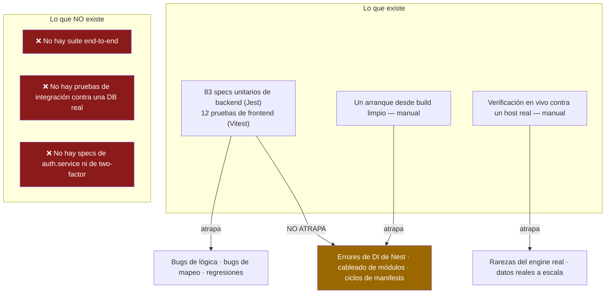

# Pruebas

## Resumen

- **Backend** — Jest con `ts-jest`. 83 archivos `*.spec.ts`.
- **Frontend** — Vitest con jsdom + Testing Library. 12 archivos de prueba.

Ambos corren desde la raíz: `npm run test` (que ejecuta `test` en cada workspace que lo
defina).

## Propósito

Cubrir la lógica que de verdad se va a romper — parsers, mappers, guards, engines — sin
pretender que las pruebas unitarias atrapan cosas que no pueden atrapar.

## Cuándo usarlo

En todo cambio que no sea trivial. Y ojo con el corolario que sale de `docs/DEVELOPMENT.md`
y de la experiencia dura: **que `tsc` esté limpio y las pruebas unitarias pasen no significa
que la app arranque.** Ninguna de las dos ejercita la DI de NestJS ni el cableado de
módulos. Levanta también un build limpio.

## Prerrequisitos

- [Configuración local](/develop/setup).

## Conceptos

### Backend — Jest

**No hay un `jest.config.*`**. La configuración está en línea en
`apps/backend/package.json`:

```json
"jest": {
  "moduleFileExtensions": ["js", "json", "ts"],
  "rootDir": "src",
  "testRegex": ".*\\.spec\\.ts$",
  "transform": { "^.+\\.(t|j)s$": "ts-jest" },
  "collectCoverageFrom": ["**/*.(t|j)s"],
  "coverageDirectory": "../coverage",
  "testEnvironment": "node",
  "moduleNameMapper": {
    "^@ultratorrent/shared$": "<rootDir>/../../../packages/shared/src/index.ts",
    "^(\\.{1,2}/.*)\\.js$": "$1"
  }
}
```

La línea que importa es la del mapper: `@ultratorrent/shared` resuelve al **código fuente**
(`packages/shared/src/index.ts`), **no** a `dist`. Por eso las pruebas unitarias del backend
ven los tipos compartidos vivos sin un build previo — a diferencia del servidor de desarrollo,
que sí necesita el paquete construido.

```bash
npm run test --workspace @ultratorrent/backend          # correr una vez
npm run test:watch --workspace @ultratorrent/backend    # modo watch
npm run test:cov --workspace @ultratorrent/backend      # cobertura
```

Las pruebas son `*.spec.ts`, colocadas junto al código que prueban.

### Hacer stub de Prisma

:::info No existe un Prisma en memoria
No hay `jest-mock-extended`, ni directorio `__mocks__`, ni un helper compartido
`createMockPrisma`. El patrón de la casa es un **objeto plano hecho a mano con `jest.fn()`s**,
casteado y pasado directo al constructor del servicio. Los servicios se instancian
directamente — no a través de `Test.createTestingModule`.
:::

```ts
// apps/backend/src/modules/media/imdb/imdb-trigram-index.service.spec.ts
function build(state: Record<string, 'valid' | 'invalid' | 'missing'> = {}) {
  const executed: string[] = [];
  const prisma = {
    $executeRawUnsafe: jest.fn(async (sql: string) => {
      executed.push(sql);
      return 0;
    }),
    $queryRawUnsafe: jest.fn(async (_sql: string, name: string, valid: boolean) => {
      const s = state[name] ?? 'missing';
      const hit = valid ? s === 'valid' : s === 'invalid';
      return [{ n: BigInt(hit ? 1 : 0) }];
    }),
  };
  const svc = new ImdbTrigramIndexService(prisma as any);
  return { svc, prisma, executed };
}

describe('ImdbTrigramIndexService', () => {
  it('builds every missing index CONCURRENTLY (never inside a transaction)', async () => {
    const { svc, executed } = build();
    await svc.ensureIndexes();

    expect(executed[0]).toMatch(/CREATE EXTENSION IF NOT EXISTS pg_trgm/);
    for (const name of ALL) {
      const stmt = executed.find((s) => s.includes(name) && s.includes('CREATE INDEX'));
      expect(stmt).toMatch(/CREATE INDEX CONCURRENTLY IF NOT EXISTS/);
      expect(stmt).toMatch(/USING gin \(".+" gin_trgm_ops\)/);
    }
  });
});
```

Para los delegates de modelos, la misma idea con objetos anidados:

```ts
// apps/backend/src/modules/users/users-roles.spec.ts
const prisma = {
  role: { findMany: jest.fn(/* … */) },
  user: { findUnique: jest.fn(/* … */) },
  userRole: { deleteMany: jest.fn(/* … */) },
};
```

42 de los 83 specs del backend hacen stub de Prisma así. Es verboso, pero es honesto: la
prueba declara exactamente qué queries se le permite hacer al código. Fíjate cómo el spec de
arriba hace aserciones sobre el **texto del SQL** — esa prueba existe para que nadie
reintroduzca calladito un `CREATE INDEX` bloqueante. Así se ve una buena prueba en este
codebase: fija la propiedad que importaba.

### Qué probar

Los objetivos de mayor valor son las **funciones puras sin I/O**:

| Objetivo | Por qué |
| --- | --- |
| El parser de nombres de lanzamiento (`parseTorrentName`) | Se ha roto una y otra vez con nombres del mundo real — siglas (`L.A.'s Finest`), años sueltos antes de un marcador de episodio (`Hijack.2023.S02E03`), season packs. Cada arreglo se entrega con un spec. |
| Los mappers de providers | Estado nativo → `TorrentState`, prioridades de archivos, centinelas de ETA. Son puros, y un mapeo malo es invisible hasta producción. |
| El códec XML-RPC (`buildMethodCall` / `parseMethodResponse`) y el lector de info-hash bencode | Puros y críticos para el protocolo. |
| `PermissionsGuard` | Autorización. Obviamente. |
| El motor de coincidencias | La diferencia entre "9-1-1" y "9-1-1 Lone Star" es un spec. |
| El motor de renombrado | Puede destruir archivos. Ya lo ha hecho. Hay 35 specs. |
| Ledgers de idempotencia, reconciliación, backfills | El comportamiento es "corre a lo sumo una vez, reintenta si falla" — solo una prueba fija eso. |

### Frontend — Vitest

**No hay `vitest.config.ts`** — la configuración vive en el bloque `test` de
`apps/frontend/vite.config.ts` (que importa `defineConfig` desde `vitest/config`):

```ts
test: {
  globals: true,
  environment: 'jsdom',
  setupFiles: ['./src/test/setup.ts'],
  css: false,
  include: ['src/**/*.{test,spec}.{ts,tsx}'],
}
```

```bash
npm run test --workspace @ultratorrent/frontend        # vitest run
npm run test:watch --workspace @ultratorrent/frontend  # vitest
```

`src/test/setup.ts` importa `@testing-library/jest-dom/vitest`, inicializa i18n **una sola
vez** (para que los componentes rendericen strings reales de en-US sin envolverlos en un
provider) y llama a `cleanup()` en `afterEach`.

Las pruebas de componentes usan `@testing-library/react`:

```tsx
// apps/frontend/src/components/layout/CommandPalette.test.tsx — la forma
render(<CommandPalette open entries={entries} onSelect={onSelect} />);
fireEvent.change(screen.getByRole('textbox'), { target: { value: 'torr' } });
expect(screen.getByText('Torrents')).toBeInTheDocument();
```

Las pruebas de lógica pura construyen un contexto falso y hacen aserciones sobre la función —
`navigation.test.ts` construye un `NavVisibilityCtx` y asegura sobre `visibleGroups()`, que es
como se cubre el filtrado por permisos y por módulos sin renderizar nada.

Dos pruebas del frontend que te llegan **gratis** y que no debes romper:

- **`i18n.test.ts`** — paridad de llaves en-US/es-PR para cada namespace, más la cobertura de
  las etiquetas de navegación. Ver [i18n](/develop/i18n).
- **`navigation.test.ts`** — cada entrada de navegación resuelve.

## La pirámide de pruebas, tal como está de verdad



## Paso a paso: escribir una prueba de backend

1. Coloca `my-thing.spec.ts` junto a `my-thing.ts`.
2. **Extrae primero la lógica pura.** Si tu función necesita un `PrismaService` para calcular
   algo que en realidad es solo una transformación, saca la transformación a una función pura
   exportada y prueba *esa*. Varios arreglos reales en este repo hicieron exactamente eso —
   `parseItemIdentity`, `mergeExternalIds`, `catalogueTitleKey`, `collapseActivity` e
   `isRenderedPathSafe` se extrajeron precisamente para poder probarlas.
3. Construye un objeto stub de `jest.fn()`s con lo que necesite el constructor; pásalo con
   `as any`.
4. Instancia el servicio directamente.
5. Haz aserciones sobre el **comportamiento** y, donde importe, sobre la llamada exacta que se
   hizo (el SQL, el método de Prisma — `updateMany` y no `update`).
6. Añade una prueba de regresión **nombrada por el bug**. El repo está lleno de ellas, y son
   las pruebas que siguen rindiendo.

## Solución de problemas

| Síntoma | Causa | Arreglo |
| --- | --- | --- |
| `Cannot find module '@ultratorrent/shared'` en una prueba de backend | La ruta del `moduleNameMapper` es relativa a `rootDir: src`. | No muevas el spec fuera de `src`. |
| Una prueba pasa pero la app revienta al arrancar | Las pruebas unitarias no ejercitan la DI ni el cableado de módulos. | Levanta un build limpio. Siempre. |
| Una prueba del frontend no encuentra el texto | i18n renderiza strings reales de en-US — haz la aserción sobre el texto en inglés, no sobre la llave. | Revisa el JSON del locale real. |
| `i18n.test.ts` falla después de añadir un string | Lo añadiste a en-US pero no a es-PR (o al revés). | Añádelo a los dos. |
| Un stub de Prisma lanza "not a function" | El código llama a un delegate que tu stub no declara. | Añádelo — y fíjate que la prueba te acaba de decir que el código hace una query que no esperabas. |
| La cobertura se ve espectacular y producción se rompe | Los huecos de abajo. | Léelos. |

## Huecos de cobertura conocidos

:::caution Estos son huecos reales y verificados
- **La autenticación no está probada.** El único spec bajo `modules/auth/` es
  `guards/permissions.guard.spec.ts`. **No hay `auth.service.spec.ts`** ni
  **`two-factor.service.spec.ts`** — **la rotación de refresh tokens y la detección de reuso
  no tienen cobertura de pruebas ninguna**. Si buscas una primera contribución de alto valor,
  esta es.
- **No hay suite end-to-end** ni **pruebas de integración contra una base de datos real.**
  Toda prueba del backend es unitaria contra un Prisma con stub.
- **rTorrent no se ha verificado en vivo** en todos sus caminos; varios comportamientos del
  engine se descubrieron solo corriendo contra un host real.
:::

## Consejos

- **Prueba el bug, no el arreglo.** Nombra el spec por lo que se rompió. `"9-1-1 vs Lone
  Star"`, `"a vanished wanted row no longer aborts the tick"`. Seis meses después, ese nombre
  es la única documentación de por qué el código tiene esa forma.
- **Fija la propiedad que importaba.** El spec de trigramas asegura que el SQL diga
  `CONCURRENTLY`. Eso no es probar un detalle de implementación — es probar justo lo que causó
  una caída.
- **Un stub que es molesto de escribir te está diciendo algo.** Si necesitas mockear quince
  delegates de Prisma, el servicio está haciendo demasiado.
- **Pasa el lint antes de hacer push**: `npm run lint` (ESLint, `--max-warnings 0`).

## Preguntas frecuentes

**¿Existe un comando de typecheck?**
:::caution No
Buscar `typecheck` / `type-check` / `tsc --noEmit` con grep en cada `package.json` no devuelve
nada. La verificación de tipos ocurre solo como efecto secundario de `npm run build`. CI corre:
build de shared → lint → `prisma generate` → `npm test` → `npm run build`.
:::

**¿Cómo corro una sola prueba?**
`npx jest path/to/file.spec.ts` en `apps/backend`, o `npx vitest run path/to/file.test.ts` en
`apps/frontend`.

**¿Las pruebas del backend necesitan el paquete shared construido?**
No — Jest lo mapea al código fuente. El **servidor** de desarrollo sí lo necesita construido.

**¿Debo usar `Test.createTestingModule`?**
Nada en el repo lo hace. La convención es instanciar directamente con stubs, y es más rápido.

## Lista de verificación

- [ ] Lógica pura extraída y probada directamente.
- [ ] Prisma con stub de `jest.fn()`s planos; solo los delegates que realmente se usan.
- [ ] Una prueba de regresión nombrada por el bug que arreglé.
- [ ] Donde importa, aseguro la llamada exacta que se hizo (`updateMany`, no `update`).
- [ ] Frontend: la paridad de i18n sigue en verde.
- [ ] `npm run lint` limpio (`--max-warnings 0`).
- [ ] `npm run build` limpio.
- [ ] **Un build limpio realmente arranca.**

## Ver también

- [Configuración local](/develop/setup)
- [Estándares](/develop/standards) — lint, commits, CI
- [i18n](/develop/i18n) — la prueba de paridad
- [Providers](/develop/providers) — las pruebas de mappers son las de mejor rendimiento aquí
- [Trabajos en segundo plano](/develop/background-jobs) — la idempotencia solo es real si una prueba la fija
