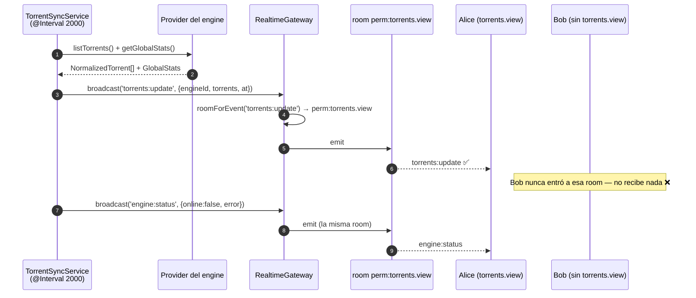
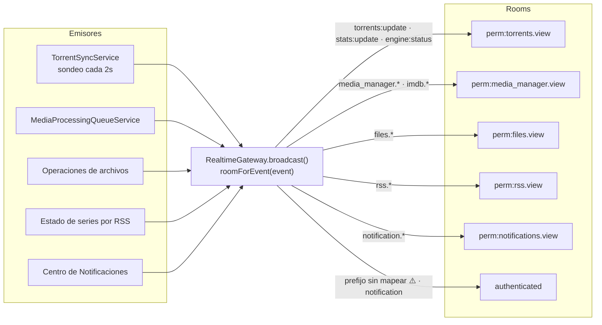

# WebSockets

## Resumen

`RealtimeGateway` es un gateway de Socket.IO montado en **`/ws`**. Los clientes se autentican
con un JWT en el handshake, y cada socket se une únicamente a las **rooms limitadas por
permisos** a las que tiene derecho. Los eventos se emiten a una room, nunca se transmiten a
ciegas — así un usuario jamás recibe en vivo datos que no podría leer por REST.

## Propósito

Empujar cambios de estado a la UI sin hacer polling: listas de torrents, estadísticas de
transferencia, salud de los motores, operaciones de archivos, progreso de trabajos de medios,
importaciones de IMDb, estado de series por RSS y envío de notificaciones.

## Cuándo usarlo

Emite un evento WS cuando **el estado cambió y probablemente alguien lo está mirando**. No uses
WebSockets para request/response — para eso está la API REST.

## Prerrequisitos

- [RBAC](/develop/rbac) — las rooms *son* permisos.
- [Autenticación](/develop/authentication) — el token del handshake es un JWT de acceso.

## Conceptos

### El handshake

```ts
// apps/backend/src/modules/realtime/realtime.gateway.ts
@WebSocketGateway({
  cors: { origin: true, credentials: true },
  path: '/ws',
})
export class RealtimeGateway implements OnGatewayInit, OnGatewayConnection {
  async handleConnection(client: Socket): Promise<void> {
    try {
      const token =
        (client.handshake.auth?.token as string) ??
        (client.handshake.query?.token as string);
      const payload = await this.jwt.verifyAsync(token, {
        secret: this.config.get<string>('jwt.accessSecret'),
        algorithms: ['HS256'],
      });
      client.data.userId = payload.sub;
      client.join('authenticated');
      client.join(`user:${payload.sub}`);

      // Únete solo a los feeds que el usuario tiene permiso de leer (SUPER_ADMIN: todos).
      const held = new Set<string>(payload.permissions ?? []);
      const isSuper = (payload.roles ?? []).includes(SystemRole.SUPER_ADMIN);
      for (const perm of SCOPED_PERMISSIONS) {
        if (isSuper || held.has(perm)) client.join(`perm:${perm}`);
      }
    } catch {
      client.disconnect(true);
    }
  }
}
```

Un token inválido, vencido o ausente significa un `disconnect(true)` inmediato. No existe el
socket anónimo.

### Las rooms

Todo socket se une a:

| Room | Contenido |
| --- | --- |
| `authenticated` | Todo socket autenticado. Los eventos sin permiso caen aquí. |
| `user:<id>` | Ese usuario y nadie más. La usa `toUser()`. |
| `perm:<key>` | Una por cada permiso de vista que el usuario **tiene**, de `SCOPED_PERMISSIONS`. |

```ts
const SCOPED_PERMISSIONS = [
  PERMISSIONS.TORRENTS_VIEW,
  PERMISSIONS.FILES_VIEW,
  PERMISSIONS.MEDIA_MANAGER_VIEW,
  PERMISSIONS.MEDIA_ACQUISITION_VIEW,
  PERMISSIONS.MEDIA_SERVER_ANALYTICS_VIEW,
  PERMISSIONS.RSS_VIEW,
  PERMISSIONS.NOTIFICATIONS_VIEW,
];
```

### Mapeo de evento → room

El gateway enruta por el **prefijo del nombre del evento**. Este es todo el modelo de
autorización del tiempo real, y vale la pena leerlo con calma:

```ts
// apps/backend/src/modules/realtime/realtime.gateway.ts
/** Room a la que se confina un evento, según el permiso requerido para leerlo. */
private roomForEvent(event: string): string {
  if (
    event === WS_EVENTS.TORRENTS_UPDATE ||
    event === WS_EVENTS.STATS_UPDATE ||
    event === WS_EVENTS.ENGINE_STATUS
  ) {
    return `perm:${PERMISSIONS.TORRENTS_VIEW}`;
  }
  if (event.startsWith('files.')) return `perm:${PERMISSIONS.FILES_VIEW}`;
  if (event.startsWith('media_manager.') || event.startsWith('imdb.')) {
    return `perm:${PERMISSIONS.MEDIA_MANAGER_VIEW}`;
  }
  if (event.startsWith('media_acquisition.')) {
    return `perm:${PERMISSIONS.MEDIA_ACQUISITION_VIEW}`;
  }
  if (event.startsWith('media_server.')) {
    return `perm:${PERMISSIONS.MEDIA_SERVER_ANALYTICS_VIEW}`;
  }
  if (event.startsWith('rss.')) {
    return `perm:${PERMISSIONS.RSS_VIEW}`;
  }
  // Tiempo real del Centro de Notificaciones (envío/cola/provider) — `notification.*`.
  // El evento heredado in-app `notification` (sin punto) queda sin permiso, más abajo.
  if (event.startsWith('notification.')) {
    return `perm:${PERMISSIONS.NOTIFICATIONS_VIEW}`;
  }
  // Los eventos sin permiso (p. ej. el `notification` in-app) van a todos los sockets autenticados.
  return 'authenticated';
}
```

:::danger Un prefijo de evento sin mapear es una fuga de datos
La rama por defecto devuelve `'authenticated'` — **todos los sockets con sesión iniciada**. Si
inventas un evento `widgets.*` y se te olvida mapearlo, todos los usuarios lo reciben, tengan o
no `widgets.view`. Añadir el prefijo a `roomForEvent()` no es opcional.
:::

Fíjate en la distinción deliberada: `notification` (sin punto) es el toast in-app sin permiso;
`notification.*` (con punto) es la telemetría de envío del Centro de Notificaciones y sí está
limitada por permiso.

### El catálogo de eventos

Los nombres de eventos se declaran una sola vez, en `packages/shared/src/events.ts`, y los
consumen ambos lados:

```ts
export const WS_EVENTS = {
  TORRENTS_UPDATE: 'torrents:update',
  TORRENT_UPDATE: 'torrent:update',
  STATS_UPDATE: 'stats:update',
  NOTIFICATION: 'notification',
  ENGINE_STATUS: 'engine:status',
  SYSTEM_HEALTH: 'system:health',
  FILES_OP_STARTED: 'files.operation.started',
  FILES_OP_PROGRESS: 'files.operation.progress',
  FILES_OP_COMPLETED: 'files.operation.completed',
  FILES_OP_FAILED: 'files.operation.failed',
  FILES_CLEANUP_COMPLETED: 'files.cleanup.completed',
  FILES_TRASH_UPDATED: 'files.trash.updated',
  // Progreso de los trabajos del Gestor de Medios (limitado a media_manager.view).
  MEDIA_JOB_STARTED: 'media_manager.job.started',
  MEDIA_JOB_PROGRESS: 'media_manager.job.progress',
  MEDIA_JOB_COMPLETED: 'media_manager.job.completed',
  MEDIA_JOB_FAILED: 'media_manager.job.failed',
  // …eventos del dataset de IMDb, eventos de estado de series por RSS, eventos del Centro de Notificaciones
} as const;
```

| Prefijo | Room | Lo emite |
| --- | --- | --- |
| `torrents:update`, `stats:update`, `engine:status` | `perm:torrents.view` | `TorrentSyncService` (cada 2s) |
| `files.*` | `perm:files.view` | Las operaciones largas del Gestor de Archivos |
| `media_manager.job.*` | `perm:media_manager.view` | `MediaProcessingQueueService` |
| `imdb.*` | `perm:media_manager.view` | El pipeline de validar/descargar/importar el dataset de IMDb |
| `media_acquisition.*` | `perm:media_acquisition.view` | Los barridos de adquisición |
| `media_server.*` | `perm:media_server_analytics.view` | Sondeo de sesiones, sincronización, boletines, importaciones |
| `rss.*` | `perm:rss.view` | Consulta y actualización del estado de series |
| `notification.*` | `perm:notifications.view` | Envíos del Centro de Notificaciones |
| `notification` (sin punto) | `authenticated` | Toasts in-app |

Dos cosas distintas comparten la palabra "evento", y confundirlas te va a costar una tarde:

- **`WS_EVENTS`** — lo que viaja por el socket hacia los navegadores.
- **`NOTIFICATION_EVENTS`** — **eventos de dominio** internos publicados en el bus de
  `@nestjs/event-emitter` bajo `NOTIFICATION_BUS_CHANNEL`, a los que el Centro de
  Notificaciones se suscribe y contra los que evalúa reglas. *No son eventos de WebSocket.*

### Emitir

```ts
// Las tres salidas del gateway
broadcast(event: string, payload: unknown): void {
  this.server?.to(this.roomForEvent(event)).emit(event, payload);
}

toUser(userId: string, event: string, payload: unknown): void {
  this.server?.to(`user:${userId}`).emit(event, payload);
}
```

`RealtimeModule` es `@Global()`, así que puedes inyectar `RealtimeGateway` donde sea y llamar a
`broadcast(...)`. Los tipos de payload viven en `packages/shared/src/events.ts`
(`TorrentsUpdatePayload`, `MediaJobEventPayload`, `EngineStatusPayload`, …).

## Diagrama — el viaje de un evento





## El frontend

**Cliente:** `apps/frontend/src/lib/ws.ts` — una clase `WsClient` y un singleton exportado
`wsClient`.
**Capa de React:** `apps/frontend/src/realtime/RealtimeContext.tsx` — `RealtimeProvider`, más
`useRealtime()` y `useTorrentStream()`.

```ts
// apps/frontend/src/lib/ws.ts
connect(): void {
  const token = getAccessToken();
  if (!token) return;
  if (this.socket?.connected) return;

  // Desmonta cualquier socket viejo antes de reconectar con un token fresco.
  this.socket?.removeAllListeners();
  this.socket?.disconnect();

  this.setStatus('connecting');

  this.socket = io(WS_URL, {
    path: '/ws',
    transports: ['websocket'],
    auth: { token },
    reconnection: true,
    reconnectionDelay: 1000,
    reconnectionDelayMax: 8000,
  });

  this.socket.on('connect', () => this.setStatus('connected'));
  this.socket.on('disconnect', () => this.setStatus('disconnected'));
  this.socket.on('connect_error', () => this.setStatus('disconnected'));

  // Vuelve a enlazar cada handler registrado al socket recién creado.
  this.attachHandlers();
}
```

El punto de diseño clave: **los handlers viven en un `Map<string, Set<Handler>>` duradero, no
en el socket vivo.** Una suscripción sobrevive a `reauthenticate()` y a cada reconexión.
`wsClient.on()` devuelve un closure para desuscribirse.

El ciclo de vida lo maneja `AuthContext`: `connect()` después del login o de `me()`,
`disconnect()` al cerrar sesión, y `reauthenticate()` cuando la capa de API rota los tokens.

Los componentes se suscriben mediante un hook con limpieza automática:

```ts
// apps/frontend/src/realtime/RealtimeContext.tsx
/** Suscríbete a los snapshots de torrents en vivo con limpieza automática. */
export function useTorrentStream(listener: (torrents: NormalizedTorrent[]) => void): void {
  const { subscribeTorrents } = useRealtime();
  const ref = useRef(listener);
  ref.current = listener;
  useEffect(() => {
    return subscribeTorrents((torrents) => ref.current(torrents));
  }, [subscribeTorrents]);
}
```

Los nombres de eventos y sus payloads están tipados por `WsEventMap` en `ws.ts`, tomando como
llave `WS_EVENTS` del paquete shared.

En desarrollo, Vite hace proxy de `/ws` hacia `http://localhost:4000` con `ws: true`.

## Paso a paso: añadir un evento de tiempo real

1. **Nómbralo** en `packages/shared/src/events.ts` bajo `WS_EVENTS`, reutilizando un prefijo
   existente si puedes (`media_manager.*`, `rss.*`, …). Añade su interfaz de payload.
2. **Reconstruye shared.**
3. **Mapea el prefijo** en `RealtimeGateway.roomForEvent()` — *a menos que* estés reutilizando
   un prefijo que ya está mapeado. Si tu funcionalidad necesita un permiso de vista nuevo,
   añádelo también a `SCOPED_PERMISSIONS`.
4. **Decláralo** en el manifest de tu módulo bajo `websocketEvents`. Esto es lo que documenta
   la [Referencia de módulos](/reference/modules).
5. **Emítelo**: inyecta `RealtimeGateway` (es global) y llama a
   `this.realtime.broadcast(WS_EVENTS.MY_EVENT, payload)`.
6. **Tipéalo** en el frontend, en `WsEventMap` (`apps/frontend/src/lib/ws.ts`).
7. **Suscríbete**: `wsClient.on('my.event', handler)` — o añade un hook de conveniencia junto a
   `useTorrentStream` si una página lo va a usar mucho.

## Solución de problemas

| Síntoma | Causa | Arreglo |
| --- | --- | --- |
| El socket conecta y se desconecta enseguida | El JWT del handshake no se pudo verificar. `handleConnection` lo captura y llama a `disconnect(true)`. | Inicia sesión; verifica que el token no esté vencido; verifica que `JWT_ACCESS_SECRET` coincida con el que lo firmó. |
| No llega nada, pero el socket está conectado | El usuario no está en la room del evento. | Verifica que tenga el permiso de vista; verifica que `roomForEvent()` mapee tu prefijo. |
| Un usuario ve eventos que no debería ver | Tu prefijo de evento no está mapeado — el valor por defecto es `'authenticated'`. | Mapéalo. Esto es una fuga, no un bug cosmético. |
| Las suscripciones mueren tras refrescar el token | Enganchaste un handler al socket crudo en vez de usar `wsClient.on()`. | Usa `wsClient.on()` — los handlers se vuelven a enlazar al reconectar. |
| Los eventos llegan pero la UI no se actualiza | Mutaste estado fuera de React, o no invalidaste el caché de queries. | Actualiza el estado dentro del handler, o usa `queryClient.invalidateQueries`. |
| Eventos duplicados después de reconectar | El handler se registró más de una vez. | Devuelve el closure de desuscripción desde `useEffect`. |

## Consejos

- **El feed de torrents es una manguera cada 2 segundos.** `TorrentSyncService` emite la lista
  normalizada completa en cada tick, por engine. No le añadas ruido por torrent encima.
- **Nunca pongas un secreto en un payload.** El comentario de doc de `ImdbEventPayload` lo dice
  explícito: *"Never carries secrets."* Mantén esa línea en cada payload que añadas.
- **Prefiere un prefijo existente.** Un prefijo nuevo significa un mapeo nuevo, un permiso
  nuevo y una manera nueva de filtrar datos. Reutiliza `media_manager.*` si el evento es del
  Gestor de Medios.
- **`toUser()` existe.** Úsalo para algo genuinamente por usuario (una notificación personal)
  en vez de hacer broadcast y filtrar en el cliente.

## Preguntas frecuentes

**¿Hay un protocolo de subscribe/unsubscribe?**
No. La membresía en las rooms se decide **una sola vez al conectar**, a partir de los claims del
JWT. No hay mensajes de suscripción iniciados por el cliente.

**¿Qué pasa con la membresía en las rooms cuando cambian los permisos de un usuario?**
Nada, hasta que se reconecte con un token fresco — las rooms se unieron con los claims del token
viejo. La misma ventana de desactualización que en [RBAC](/develop/rbac).

**¿Puedo emitir desde un scheduler?**
Sí — `TorrentSyncService` y `MediaProcessingQueueService` lo hacen. `RealtimeModule` es
`@Global()`.

**¿El gateway hace request/response?**
No existe ningún handler `@SubscribeMessage`. Es solo push.

## Lista de verificación

- [ ] Nombre del evento añadido a `WS_EVENTS` en `packages/shared/src/events.ts`.
- [ ] Interfaz de payload añadida y **sin secretos**.
- [ ] Prefijo mapeado en `roomForEvent()` — o reutilizaste un prefijo ya mapeado.
- [ ] Permiso de vista nuevo (si aplica) añadido a `SCOPED_PERMISSIONS`.
- [ ] Declarado en `websocketEvents` del manifest del módulo.
- [ ] Tipado en el `WsEventMap` del frontend.
- [ ] Suscrito vía `wsClient.on()` o un hook, con limpieza.
- [ ] Verificaste que un usuario *sin* el permiso no recibe nada.

## Ver también

- [RBAC](/develop/rbac) — las rooms son permisos
- [Trabajos en segundo plano](/develop/background-jobs) — la cola transmite su progreso por WS
- [Arquitectura](/develop/architecture)
- [Referencia de la API](/reference/api)
- [Referencia de módulos](/reference/modules) — los `websocketEvents` declarados por módulo
