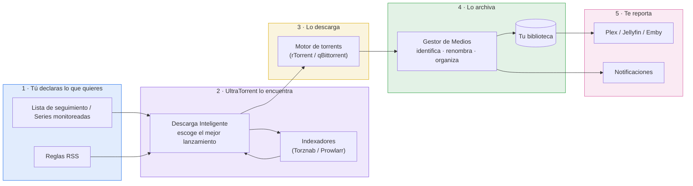

# Documentación de UltraTorrent {#ultratorrent-documentation}

**UltraTorrent** es una **plataforma auto-hospedada de adquisición y gestión de medios**. Busca
medios, los descarga, los identifica, los organiza en una biblioteca limpia, le avisa a tu servidor
de medios y *te* avisa a ti — según las reglas que tú escribas, sin que tengas que estar pendiente.

Es una sola aplicación que reemplaza un montón de ellas: un gestor de clientes de descarga, un
agregador de indexadores, un motor de automatización de RSS, un cazador de episodios faltantes, un
organizador de bibliotecas y un panel de analíticas del servidor de medios.

:::tip ¿Nuevo por aquí? Toma la ruta de 15 minutos
[**Inicio Rápido**](/learn/quick-start) → instala con Docker Compose, inicia sesión, agrega un
indexador y termina tu primera descarga. Luego lee [Conceptos Básicos](/learn/concepts) para que el
resto de la documentación te haga sentido.
:::

## Escoge tu ruta {#choose-your-path}

| Quiero… | Ve aquí |
| --- | --- |
| **Entender qué es esto** y cómo encajan las piezas | [Conceptos Básicos](/learn/concepts) · [Resumen de la Arquitectura](/learn/architecture-overview) |
| **Instalarlo** — Docker, NAS, Proxmox, la nube | [Instalación](/install/docker-compose) |
| **Lograr que mi primera descarga funcione** | [Inicio Rápido](/learn/quick-start) · [Mi Primera Descarga](/learn/first-download) |
| **Automatizar una serie de TV** de principio a fin | [Automatizar Series de TV](/learn/tutorials/automating-tv-shows) |
| **Configurar una función** a fondo | [Módulos](/modules/) |
| **Llamar a la API** | [Referencia de la API REST](/reference/api) |
| **Arreglar algo que está roto** | [Resolución de Problemas](/operate/troubleshooting) |
| **Operarlo en serio** — asegurar, respaldar, afinar | [Operar](/operate/) |
| **Extenderlo o contribuir** | [Desarrollar](/develop/) |

## Lo que realmente hace {#what-it-actually-does}

Cada etapa es un módulo que puedes configurar, automatizar o apagar por completo. Consulta la
[Referencia de Módulos](/reference/modules) para ver el catálogo completo y cómo dependen unos de otros.

## La documentación, de un vistazo {#the-documentation-at-a-glance}

- **[Aprender](/learn/quick-start)** — conceptos, inicio rápido, tutoriales y flujos de trabajo de
  principio a fin. Empieza aquí si eres nuevo.
- **[Instalación](/install/docker-compose)** — Docker Compose es la instalación de referencia; toda
  otra plataforma (Synology, QNAP, Unraid, TrueNAS, Proxmox, la nube…) es una capa fina encima de ella.
- **[Módulos](/modules/)** — una página a fondo por función: qué es, por qué, cuándo, cómo configurarla,
  qué sale mal y cómo arreglarlo.
- **[Referencia](/reference/api)** — **generada desde el código fuente al compilar**, así que no puede
  desactualizarse: cada endpoint REST, cada permiso, cada variable de entorno, cada modelo de la base
  de datos.
- **[Operar](/operate/troubleshooting)** — resolución de problemas, seguridad, backup y recuperación
  ante desastres, rendimiento y mantenimiento.
- **[Desarrollar](/develop/)** — arquitectura, el sistema de proveedores, cómo escribir un módulo, pruebas.

:::info La sección de Referencia se genera automáticamente
[API REST](/reference/api), [Permisos](/reference/permissions),
[Módulos](/reference/modules), [Variables de Entorno](/reference/environment) y el
[Esquema de la Base de Datos](/reference/database-schema) se generan desde el código que se publica. Si
una página de ahí está mal, el código está mal — lo cual hace que sea seguro confiar en ella.
:::

## Convenciones usadas en esta documentación {#conventions-used-in-these-docs}

A lo largo del sitio vas a ver:

:::tip
Una recomendación, o una forma más rápida de hacer algo.
:::

:::warning
Algo con lo que la gente suele tropezar. Léelo antes de que te pase.
:::

:::danger
Pérdida de datos, o una exposición de seguridad. No te lo saltes.
:::

:::note Falta una captura de pantalla
Algunas páginas todavía llevan una nota como esta, nombrando la pantalla exacta que hay que capturar.
Todas son pantallas dentro de *otros* productos — Synology, QNAP, Portainer, TrueNAS, Unraid,
Proxmox — que no podemos capturar por ti. Contribuir una es sobrescribir un archivo: conserva el
nombre del archivo, no hace falta cambiar el texto.
:::

Las capturas de pantalla de UltraTorrent mismo están **censuradas**: los títulos de medios, las rutas
de archivos y los nombres de usuario del servidor de medios están difuminados, mientras que la interfaz
— botones, insignias, conteos, barras de progreso — se mantiene nítida. Eso es a propósito, y es la
razón por la que las pantallas se ven cargadas pero ilegibles en algunas partes.

Toda página sustancial termina con una **Lista de verificación** — pasos de verificación y el resultado
que deberías esperar — para que siempre sepas si lo que acabas de hacer de verdad funcionó.

## Cómo conseguir ayuda {#getting-help}

1. Busca en este sitio (arriba a la derecha, o presiona <kbd>Ctrl</kbd>/<kbd>⌘</kbd> + <kbd>K</kbd>).
2. Revisa las [Preguntas Frecuentes](/help/faq) y el [Glosario](/help/glossary).
3. Trabaja con [Resolución de Problemas](/operate/troubleshooting) — está organizada por *síntoma*, y
   cada entrada te da los comandos de diagnóstico exactos.
4. ¿Todavía atascado? [Abre un issue en GitHub](https://github.com/damirabal/ultratorrent-core/issues) —
   e incluye los diagnósticos que la página de resolución de problemas te pidió recopilar.
