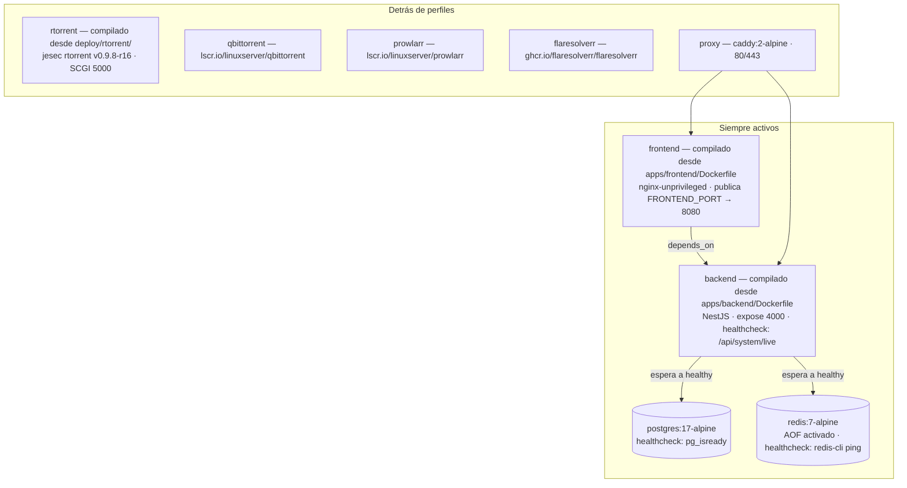

import Tabs from '@theme/Tabs';
import TabItem from '@theme/TabItem';

# Instalar con Docker Compose

## Resumen

Esta es **la** guía de instalación de UltraTorrent. Cada página de plataforma en esta sección es una diferencia mínima sobre ella — otro shell, otras rutas, otros choques de puertos, el mismo stack.

Vas a:

1. Poner el código fuente en el host.
2. Generar cinco secretos dentro de un archivo `.env`.
3. Compilar y arrancar el stack (`docker compose up -d --build`).
4. Sembrar la base de datos con el seed, una sola vez.
5. Iniciar sesión, agregar un motor de torrents y verificar.

:::tip Mira este tutorial
_Video próximamente._
:::

## Requisitos previos

| Necesitas | Para qué |
|----------|-----|
| **Docker Engine** (cualquier versión reciente) | Corre el stack |
| **Docker Compose v2** — el *plugin* `docker compose`, no el antiguo script `docker-compose` | El archivo de Compose usa perfiles y `condition: service_healthy` |
| **`git`** (o la capacidad de descargar y descomprimir un ZIP) | No hay imágenes publicadas — compilas desde el código fuente |
| **`openssl`** (o cualquier generador aleatorio fuerte) | Generar los secretos |
| Acceso por shell al host | Compilar y el seed único de la base de datos |

Revisa lo que tienes:

```bash
docker --version
docker compose version     # debe imprimir v2.x — si da error, instala el plugin de Compose
```

## Requisitos

| Recurso | Mínimo | Cómodo |
|----------|---------|-------------|
| **CPU** | 2 núcleos (x86-64 o ARM64) | 4 núcleos |
| **RAM** | **~2 GB libres durante el build** | 4 GB+ (Postgres + Redis + Node + un motor) |
| **Disco — el stack** | ~2–3 GB para imágenes y volúmenes | más margen para cuando te dé pereza correr `docker image prune` |
| **Disco — descargas** | Lo que necesite tu biblioteca | en un sistema de archivos aparte y grande |
| **Primer build** | 10–15 minutos | segundos en cada arranque posterior |

El build es la parte que consume memoria (compila el backend y la SPA). Un host con 1 GB de RAM típicamente se quedará sin memoria (OOM) durante el build del frontend.

## Puertos {#ports}

Solo la interfaz web se publica de forma predeterminada.

| Puerto (host) | Servicio | ¿Publicado de forma predeterminada? | Se cambia con |
|-------------|---------|----------------------|-------------|
| **8080** | `frontend` — la interfaz web (nginx, escuchando en `8080` dentro del container) | ✅ Sí | `FRONTEND_PORT` |
| 4000 | `backend` — API REST + gateway de WebSocket | ❌ **No** — solo interno; el frontend le hace proxy a `/api/` y `/ws/` | agrega un mapeo `ports:` si de verdad quieres acceso directo a la API |
| 5432 | `postgres` | ❌ No — solo interno | — |
| 6379 | `redis` | ❌ No — solo interno | — |
| 5000 | SCGI de `rtorrent` (perfil `rtorrent`) | ❌ No — solo interno | — (**nunca** lo publiques: SCGI no tiene autenticación y otorga control total) |
| 8081 | Interfaz web de `qbittorrent` (perfil `qbittorrent`) | ✅ Sí, cuando el perfil está activo | `QBITTORRENT_PORT` |
| 9696 | `prowlarr` (perfil `prowlarr`) | ✅ Sí, cuando el perfil está activo | `PROWLARR_PORT` |
| 8191 | `flaresolverr` (perfil `flaresolverr`) | ❌ No — solo interno | — |
| 80 / 443 | `proxy` — el Caddy incluido (perfil `proxy`) | ✅ Sí, cuando el perfil está activo | edita `docker-compose.yml` |

:::info No se publica ningún puerto de pares entrantes
El rTorrent incluido escucha a los pares en `6890-6999` **dentro** del container, y el archivo de Compose que se distribuye **no** publica ese rango al host. Las descargas siguen funcionando (las conexiones salientes no se ven afectadas), pero no aceptarás conexiones entrantes de pares. Para cambiar eso, publica el rango tú mismo en un archivo de override y redirígelo en tu router — ver [Opcional: aceptar pares entrantes](#optional-accept-inbound-peers).
:::

## Volúmenes

| Volumen | Usado por | Contiene |
|--------|---------|-------|
| `postgres_data` | `postgres` | **La base de datos.** Haz copia de seguridad de esto. |
| `redis_data` | `redis` | El AOF de Redis (caché + colas de trabajos) — regenerable |
| `downloads` | `backend`, `rtorrent`, `qbittorrent` | **El árbol de descargas compartido**, montado en la misma ruta (`/downloads`) en cada container para que las rutas de guardado del motor cuadren con `FILE_MANAGER_ROOTS`. El estado de sesión de rTorrent también vive aquí, en `/downloads/.session`. |
| `prowlarr_config` | `prowlarr` | La base de datos de Prowlarr, las definiciones de indexadores, la clave API |
| `qbittorrent_config` | `qbittorrent` | Los ajustes de qBittorrent y su propio estado de torrents |
| `caddy_data` | `proxy` | Los certificados de Caddy y el estado ACME |

Todos son volúmenes nombrados gestionados por Docker de forma predeterminada. **El de descargas es el que casi seguro quieres redirigir** a una carpeta real — ver [Apunta las descargas a una carpeta real](#point-downloads-at-a-real-folder).

## Permisos {#permissions}

Hay tres usuarios distintos en juego:

| Container | Corre como | Notas |
|-----------|---------|-------|
| `backend` | `node`, **uid 1000** | Sus acciones del gestor de archivos (crear/mover/eliminar) ocurren como este usuario |
| `frontend` | nginx-unprivileged, uid 101 | Solo sirve archivos estáticos — sin volúmenes compartidos |
| `rtorrent` | **`PUID`:`PGID`**, predeterminado `1000:1000` | El entrypoint arranca como root y luego baja privilegios con `gosu` |
| `qbittorrent` | **`PUID`:`PGID`**, predeterminado `1000:1000` | Convención de las imágenes de LinuxServer |

**`PUID` / `PGID` deciden quién es dueño de tus archivos descargados.** Los predeterminados (`1000:1000`) coinciden con el backend, que es lo que quieres cuando UltraTorrent es dueño de la carpeta.

Si tu carpeta de descargas pertenece **al usuario de otra aplicación** — el caso clásico es un recurso compartido de medios que le pertenece a Plex — **no** le hagas `chown` a 1000; eso rompe Plex. En vez de eso, haz que el motor escriba *como* ese usuario:

```bash
id plex        # p. ej. uid=1001(plex) gid=1001(plex)
```

```dotenv
# .env
PUID=1001
PGID=1001
```

```bash
docker compose --profile rtorrent up -d rtorrent
```

El entrypoint del rTorrent incluido deliberadamente **solo** reclama `/downloads` cuando es un volumen nuevo, sin reclamar y perteneciente a root — una carpeta que ya pertenece a un usuario real se deja intacta. Apuntarlo a un recurso compartido de Plex es seguro.

**Opcional — deja que el Gestor de Archivos de la app también escriba ahí.** El backend sigue corriendo como uid 1000, así que sus acciones de *escritura* sobre una carpeta de Plex están limitadas hasta que lo agregues a ese grupo:

```bash
sudo chmod -R g+rwX /path/to/downloads
sudo find /path/to/downloads -type d -exec chmod g+s {} +   # los archivos nuevos heredan el grupo
```

```yaml
# docker-compose.override.yml
services:
  backend:
    group_add: ["1001"]     # el GID de plex
```

Si te saltas esto, la descarga sigue funcionando por completo; solo se restringen las acciones de escritura del Gestor de Archivos sobre esa carpeta (y recibes una advertencia de "no se puede escribir en esta ruta" al establecer la Ruta raíz predeterminada — una advertencia, no un bloqueo).

## Paso a paso

### 1. Consigue el código fuente

```bash
git clone https://github.com/damirabal/ultratorrent-core.git
cd ultratorrent-core
```

¿No tienes `git`? Descarga el ZIP del repositorio desde GitHub, extráelo en el host y entra con `cd`.

### 2. Genera tus secretos

Copia la plantilla:

```bash
cp .env.example .env
```

**No hay valores predeterminados inseguros.** El stack se niega a arrancar hasta que establezcas `POSTGRES_PASSWORD` y `ADMIN_PASSWORD`, y el backend se niega a arrancar en producción a menos que `JWT_ACCESS_SECRET`, `JWT_REFRESH_SECRET` y `ENCRYPTION_KEY` estén establecidos, tengan al menos 32 caracteres y no sean un valor predeterminado conocido — y `ENCRYPTION_KEY` **debe ser distinta** de `JWT_ACCESS_SECRET`.

Genera un secreto a la vez:

```bash
openssl rand -base64 48     # ejecútalo una vez por secreto — todos deben ser distintos
```

…o llena las tres claves aleatorias de una sola vez, y luego establece las dos contraseñas a mano:

```bash
for k in JWT_ACCESS_SECRET JWT_REFRESH_SECRET ENCRYPTION_KEY; do
  sed -i "s|^$k=.*|$k=$(openssl rand -base64 48 | tr -d '\n')|" .env
done
```

:::warning POSTGRES_PASSWORD debe ser alfanumérica
Compose deriva `DATABASE_URL` de `POSTGRES_USER` / `POSTGRES_PASSWORD` / `POSTGRES_DB`. Un carácter especial de URL (`@`, `:`, `/`, `#`, `?`) en la contraseña rompe esa cadena de conexión derivada. **Usa solo letras y números.**
:::

### 3. Llena el `.env`

Un `.env` mínimo y funcional — todo lo demás tiene un valor predeterminado sensato:

```dotenv
# ---- Requerido -----------------------------------------------------------
POSTGRES_PASSWORD=alphanumericPasswordHere123     # SOLO letras + números
ADMIN_PASSWORD=the-password-you-will-log-in-with  # esta es TU contraseña de inicio de sesión

JWT_ACCESS_SECRET=<openssl rand -base64 48>
JWT_REFRESH_SECRET=<openssl rand -base64 48>
ENCRYPTION_KEY=<openssl rand -base64 48>          # DEBE ser distinta de JWT_ACCESS_SECRET

# ---- Se cambian con frecuencia -------------------------------------------
FRONTEND_PORT=8080            # el ÚNICO puerto publicado por defecto; cámbialo si el 8080 está ocupado
CORS_ORIGIN=http://localhost:8080
ADMIN_USERNAME=admin          # inicias sesión con este NOMBRE DE USUARIO, no con el correo
ADMIN_EMAIL=admin@ultratorrent.local
TZ=Etc/UTC                    # zona horaria de los containers acompañantes incluidos

# ---- Descargas / permisos ------------------------------------------------
FILE_MANAGER_ROOTS=/downloads # raíces absolutas, separadas por comas, que el explorador de archivos puede tocar
# PUID=1000                   # quién es dueño de los archivos descargados (ver Permisos arriba)
# PGID=1000

# ---- Motores / acompañantes incluidos opcionales --------------------------
QBITTORRENT_PORT=8081         # solo se usa con --profile qbittorrent
PROWLARR_PORT=9696            # solo se usa con --profile prowlarr
PROWLARR_BASE_URL=http://prowlarr:9696
PROWLARR_PUBLIC_URL=http://localhost:9696
# RT_DHT=off                  # rTorrent incluido: DHT está APAGADO por defecto (puede tumbar este build)
# SSRF_ALLOW_HOSTS=prowlarr   # hosts cuyos enlaces .torrent pueden resolver a una IP privada
```

:::danger Nunca subas un `.env` real al repositorio
Contiene la contraseña de tu base de datos, tu contraseña de administrador y las claves que firman cada token de sesión y cifran cada secreto 2FA almacenado. Ver [Seguridad](/operate/security).
:::

La lista completa y generada de cada variable que UltraTorrent lee vive en **[Variables de entorno](/reference/environment)**.

### 4. Apunta las descargas a una carpeta real {#point-downloads-at-a-real-folder}

De forma predeterminada, las descargas caen dentro de un volumen gestionado por Docker que no puedes explorar fácilmente. Para enviarlas a una carpeta normal, crea `docker-compose.override.yml` **al lado** de `docker-compose.yml`:

```yaml
# docker-compose.override.yml
volumes:
  downloads:
    driver: local
    driver_opts:
      type: none
      o: bind
      device: /srv/downloads        # una carpeta real y EXISTENTE en el host
```

Crea la carpeta primero (`mkdir -p /srv/downloads`) — Docker no la creará por ti, y el bind fallará si no existe.

:::caution No remapees el puerto de la UI con un override
Compose **añade** las entradas de `ports:` en vez de reemplazarlas, así que un override agrega un *segundo* mapeo y el original sigue en conflicto. Cambia `FRONTEND_PORT` en el `.env` en su lugar.
:::

### 5. Compila y arranca

<Tabs groupId="engine">
<TabItem value="rtorrent" label="rTorrent incluido (predeterminado)" default>

```bash
docker compose --profile rtorrent up -d --build
```

El primer build toma **varios minutos** — eso es normal. Déjalo terminar.

</TabItem>
<TabItem value="qbittorrent" label="qBittorrent incluido (bibliotecas grandes)">

```bash
docker compose --profile qbittorrent up -d --build
```

Luego saca la contraseña temporal del primer arranque y establece la tuya:

```bash
docker compose logs qbittorrent | grep -i password
```

Abre `http://<host>:8081`, inicia sesión como `admin` con esa contraseña temporal y establece un usuario y contraseña reales bajo **Options → Web UI**.

</TabItem>
<TabItem value="own" label="Mi propio motor">

```bash
docker compose up -d --build
```

Sin perfil — sin motor incluido. Registra después tu rTorrent o qBittorrent existente bajo **Infraestructura → Motores**.

</TabItem>
<TabItem value="everything" label="Todo">

```bash
docker compose --profile rtorrent --profile prowlarr --profile flaresolverr up -d --build
```

Los perfiles se acumulan. Agrega `--profile proxy` para el proxy inverso de borde Caddy incluido.

</TabItem>
</Tabs>

### 6. Siembra la base de datos con el seed — una sola vez

Las migraciones se aplican automáticamente en cada arranque del backend (el comando del container es `prisma migrate deploy && node dist/main.js`). **El seed es un paso aparte, de una sola vez** que inserta los permisos, los cinco roles del sistema, el administrador inicial y la configuración predeterminada:

```bash
docker compose exec backend npx prisma db seed
```

El seed es idempotente — volver a correrlo nunca reinicia tu contraseña de administrador ni toca tus datos. Lo vas a correr de nuevo después de las actualizaciones, para recoger los permisos nuevos.

### 7. Primer inicio de sesión

Abre **`http://<host>:8080`** (o el `FRONTEND_PORT` que hayas elegido).

- **Usuario:** `admin` — es un *nombre de usuario*, **no** una dirección de correo electrónico.
- **Contraseña:** la `ADMIN_PASSWORD` que estableciste en el `.env`.


### 8. Agrega el motor de torrents

En la navegación de la izquierda: **Infraestructura → Motores → Agregar motor**.

<Tabs groupId="engine">
<TabItem value="rtorrent" label="rTorrent incluido" default>

| Campo | Valor |
|-------|-------|
| Cliente | rTorrent |
| Conexión / modo | **SCGI sobre TCP** (`scgi-tcp`) |
| Host | `rtorrent` |
| Puerto | `5000` |
| Motor predeterminado | Activado |

Haz clic en **Probar conexión** → debe decir **Conectado**. Luego **Agregar motor**.

</TabItem>
<TabItem value="qbittorrent" label="qBittorrent incluido">

| Campo | Valor |
|-------|-------|
| Cliente | qBittorrent |
| URL base | `http://qbittorrent:8080` |
| Usuario / contraseña | Los que estableciste en la interfaz web de qBittorrent |
| Motor predeterminado | Activado |

Si **Probar conexión** falla con un 401, desactiva **Enable Host header validation** (o pon *Server domains* en `*`) bajo **Options → Web UI** de qBittorrent — el backend se conecta por el nombre del servicio `qbittorrent`, que esa validación rechaza de forma predeterminada.

</TabItem>
<TabItem value="own" label="Tu propio rTorrent">

Habilita un endpoint SCGI en tu `~/.rtorrent.rc`:

```ini
# SCGI sobre un puerto TCP (modo "scgi-tcp"):
network.scgi.open_port = 127.0.0.1:5000
# …o un socket Unix (modo "scgi-unix"):
# network.scgi.open_local = /var/run/rtorrent/rpc.socket
```

| `mode` | Campos | Directiva de rTorrent |
|--------|--------|--------------------|
| `scgi-tcp` | `host`, `port` | `network.scgi.open_port` |
| `scgi-unix` | `socketPath` | `network.scgi.open_local` |
| `http` | `url` | un front end HTTP→XML-RPC |

:::danger SCGI no tiene autenticación
Otorga **control total** del cliente y del usuario del host bajo el que corre. Enlázalo a `127.0.0.1` o a un socket Unix. Nunca lo expongas a una red ni lo publiques desde Docker.
:::

</TabItem>
</Tabs>


### 9. Apunta el explorador de archivos a tus descargas

Si hiciste el paso 4: **Configuración → Ruta raíz predeterminada** → elige `/downloads`.

## Verificación

Corre esto en orden. Cada comando debe verse como la salida esperada.

**Todos los servicios levantados y saludables:**

```bash
docker compose ps
```

```text
NAME                       STATUS                    PORTS
ultratorrent-backend-1     Up 2 minutes (healthy)    4000/tcp
ultratorrent-frontend-1    Up 2 minutes (healthy)    0.0.0.0:8080->8080/tcp
ultratorrent-postgres-1    Up 2 minutes (healthy)    5432/tcp
ultratorrent-redis-1       Up 2 minutes (healthy)    6379/tcp
ultratorrent-rtorrent-1    Up 2 minutes (healthy)    5000/tcp
```

**La API está viva** (endpoints públicos, no hace falta autenticación):

```bash
curl -s http://localhost:8080/api/system/live
curl -s http://localhost:8080/api/system/ready
curl -s http://localhost:8080/api/system/version
```

`/api/system/version` devuelve la versión en ejecución — la misma cadena que deberías ver en **Acerca de**.

**El backend arrancó limpio:**

```bash
docker compose logs backend | tail -30
```

Quieres ver las migraciones aplicadas y a Nest escuchando — **sin** `insecure secret configuration`, sin `P1000`, sin `P1001`.

**El motor está en línea.** En la UI, **Infraestructura → Motores** debe mostrarlo en verde. La página de **Descargas** debe cargar una lista (vacía) en vez de "No se pudieron cargar los torrents".

**Una descarga real.** Agrega un torrent (una ISO de Linux es la prueba clásica) y observa la barra de progreso moverse *sin refrescar la página* — eso confirma que la conexión WebSocket funciona de punta a punta. Ver [Tu primera descarga](/learn/first-download).

## Opcional: aceptar pares entrantes {#optional-accept-inbound-peers}

El archivo de Compose que se distribuye no publica ningún puerto de pares, así que el rTorrent incluido solo hace conexiones salientes. Para aceptar pares entrantes, publica su rango de puertos y redirígelo en tu router:

```yaml
# docker-compose.override.yml
services:
  rtorrent:
    ports:
      - "6890-6999:6890-6999/tcp"
```

:::caution Verificado por la comunidad
Publicar un rango de puertos de pares es una práctica estándar de BitTorrent, pero **no** forma parte del archivo de Compose que se distribuye y no se ejercita en los despliegues propios del proyecto. Verifica que se comporte como esperas en tu host antes de depender de ello, y recuerda que redirigir un puerto hace que tu cliente sea accesible desde el internet.
:::

## Perfiles opcionales {#optional-profiles}

Todo lo opcional está detrás de un perfil de Compose y viene **apagado de forma predeterminada**.

| Perfil | Agrega | Se accede en |
|---------|------|-------------|
| `rtorrent` | El motor rTorrent incluido | interno `rtorrent:5000` (SCGI) |
| `qbittorrent` | El motor qBittorrent incluido | `http://<host>:8081`, interno `http://qbittorrent:8080` |
| `prowlarr` | Un gestor de indexadores [Prowlarr](/modules/prowlarr) como acompañante | `http://<host>:9696`, interno `http://prowlarr:9696` |
| `flaresolverr` | Un solucionador de Cloudflare que Prowlarr puede usar para indexadores protegidos | interno `http://flaresolverr:8191` |
| `proxy` | Un proxy inverso de borde Caddy con TLS automático | `:80` / `:443` |

```bash
docker compose --profile rtorrent --profile prowlarr up -d --build
```

:::info Indexadores autoalojados y la protección SSRF
Las descargas automáticas (reglas RSS, [Descarga Inteligente](/modules/smart-download), adquisición de episodios faltantes) obtienen el enlace `.torrent` del indexador por HTTP. La protección SSRF del backend **bloquea cualquier URL que resuelva a una dirección privada/interna** a menos que su host esté listado en `SSRF_ALLOW_HOSTS`.

El stack usa `SSRF_ALLOW_HOSTS=prowlarr` de forma predeterminada, así que el Prowlarr **incluido** funciona sin configuración adicional. ¿Usas un indexador autoalojado *distinto* (un Prowlarr o Jackett en otro punto de tu LAN)? Agrega su host — y conserva `prowlarr` si también usas el incluido:

```dotenv
SSRF_ALLOW_HOSTS=prowlarr,indexer.lan,10.0.0.0/24
```

Sin eso, las capturas fallan con *"Torrent URL resolves to a blocked internal address"* y las descargas automáticas silenciosamente no hacen nada — **aunque la prueba de conexión de Prowlarr siga pasando**. Esa verificación de salud confía en los hosts privados; la *obtención* del torrent es una protección aparte y más estricta.
:::

## El archivo de Compose, servicio por servicio



**`postgres`** — `postgres:17-alpine`. Se niega a arrancar sin `POSTGRES_PASSWORD` (la protección `:?` de Compose). Con healthcheck vía `pg_isready`; el backend espera por `service_healthy`. Los datos van en `postgres_data`.

**`redis`** — `redis:7-alpine` con persistencia append-only activada. Caché y colas de trabajos de BullMQ. Con healthcheck vía `redis-cli ping`. Los datos van en `redis_data`.

**`backend`** — compilado desde `apps/backend/Dockerfile` (Node 22 multietapa, corre como el usuario sin privilegios `node`, uid 1000). Su `DATABASE_URL` se *deriva* de `POSTGRES_USER`/`POSTGRES_PASSWORD`/`POSTGRES_DB`, así que nunca puede desincronizarse de la contraseña de la base de datos — que es exactamente por lo que la contraseña debe ser alfanumérica. Se niega a arrancar en producción con secretos débiles, idénticos o predeterminados. Su comando es `prisma migrate deploy && node dist/main.js`, así que **las migraciones se aplican en cada arranque**. `expose: 4000` — **no** se publica al host.

**`frontend`** — compilado desde `apps/frontend/Dockerfile` sobre `nginx-unprivileged`, que escucha en el **8080** dentro del container. Se publica como `${FRONTEND_PORT:-8080}:8080`. Su configuración de nginx le hace proxy a `/api/` hacia `backend:4000` y a `/ws/` hacia `backend:4000` **con las cabeceras de upgrade de WebSocket**, así que el navegador solo habla con un puerto. Las URL de la API y del WebSocket se hornean en tiempo de *build* (`VITE_API_URL=/api`, `VITE_WS_URL=/`) como rutas relativas del mismo origen.

**`rtorrent`** (perfil) — compilado desde `deploy/rtorrent/` alrededor del binario estático jesec `v0.9.8-r16`. Sirve SCGI en `0.0.0.0:5000` solo en la red interna. Su entrypoint limpia un `rtorrent.lock` obsoleto de un crash anterior, le hace chown a `/downloads/.session` y baja a `PUID:PGID` con `gosu`. Solicita `cap_add: [SETUID, SETGID]` — esas capacidades son parte del conjunto *predeterminado* de Docker, pero algunos hosts (notablemente Synology DSM) se las quitan, lo que haría fallar la bajada de privilegios; volver a agregarlas restaura el comportamiento predeterminado. Healthcheck: que el puerto SCGI esté escuchando.

**`qbittorrent`** (perfil) — `lscr.io/linuxserver/qbittorrent`. Comparte el mismo volumen `downloads` para que las rutas de guardado cuadren. Su interfaz web se publica en `QBITTORRENT_PORT` (8081) para que puedas obtener la contraseña del primer arranque.

**`prowlarr`** (perfil) — `lscr.io/linuxserver/prowlarr`. Es un *acompañante*, no parte de UltraTorrent; lo enlazas bajo **Configuración → Integraciones → Prowlarr**. Su clave API se ingresa en la UI y se guarda cifrada con AES-GCM — nunca en el `.env`.

**`flaresolverr`** (perfil) — resuelve los desafíos de Cloudflare para los indexadores de Prowlarr. Recibe `shm_size: 256m` porque Chromium headless se cae con los 64 MB de `/dev/shm` predeterminados de Docker.

**`proxy`** (perfil) — `caddy:2-alpine`, montando `deploy/Caddyfile`. Ver [Proxy inverso](/install/reverse-proxy).

Todos los servicios están en una sola red bridge `internal` y se direccionan entre sí **por nombre de servicio** — `postgres`, `redis`, `backend`, `rtorrent`, `qbittorrent`, `prowlarr`.

## Proxy inverso

No hace falta en una LAN — entra a `http://<host>:8080` y listo.

¿Accesible desde el internet, o quieres un nombre de host y HTTPS? Pon un proxy al frente. **El único requisito estricto: `/ws/` debe pasar por el proxy con las cabeceras de upgrade de WebSocket**, o la UI carga pero nunca se actualiza en vivo (sin barras de progreso, sin lista de torrents en vivo).

Configuraciones completas y funcionales para Traefik, NGINX, Nginx Proxy Manager, Caddy, HAProxy y Cloudflare Tunnel: **[Proxy inverso](/install/reverse-proxy)**.

## HTTPS

La ruta más rápida es el perfil de Caddy incluido — reemplaza la etiqueta de sitio `:80` en `deploy/Caddyfile` con tu dominio y obtiene un certificado de Let's Encrypt automáticamente:

```bash
docker compose --profile proxy up -d
```

Detalles, certificados personalizados, CA internas y DNS-01 para configuraciones de horizonte dividido: **[TLS](/install/tls)**.

## Actualizaciones

```bash
cd ultratorrent-core
docker compose exec -T postgres pg_dump -U ultratorrent ultratorrent > backup-$(date +%F).sql
git pull
docker compose --profile rtorrent up -d --build
docker compose exec backend npx prisma db seed        # recoge los NUEVOS permisos/ajustes
```

Las migraciones son **solo hacia adelante** y se aplican automáticamente al arrancar el backend. Siempre haz una copia de seguridad primero. El procedimiento completo, incluida la reversión: **[Actualizaciones](/install/upgrading)**.

## Copias de seguridad

Respalda dos cosas:

```bash
# 1. La base de datos — todo excepto los medios en sí
docker compose exec -T postgres pg_dump -U ultratorrent ultratorrent > ultratorrent-$(date +%F).sql

# 2. Tu .env — no puedes descifrar los secretos 2FA guardados sin ENCRYPTION_KEY
cp .env /somewhere/safe/ultratorrent.env.bak
```

`redis_data` es regenerable. `downloads` son tus medios — respáldalos con la frecuencia que tus medios merezcan. Ver [Copia de seguridad y restauración](/operate/backup).

## Solución de problemas

| Síntoma | Causa | Solución |
|---------|-------|-----|
| Compose se niega a arrancar: *"POSTGRES_PASSWORD is required"* | Se disparó la protección `:?` del archivo de Compose | Establece `POSTGRES_PASSWORD` (y `ADMIN_PASSWORD`) en el `.env` |
| El backend termina al arrancar: *"insecure secret configuration"* | `JWT_ACCESS_SECRET` / `ENCRYPTION_KEY` sin establecer, con un valor predeterminado conocido, con menos de 32 caracteres, o **idénticos entre sí** | Genera valores fuertes y **distintos**: `openssl rand -base64 48` |
| El backend entra en bucle de crashes con Prisma **`P1000: Authentication failed`** | El volumen `postgres_data` se creó originalmente con una `POSTGRES_PASSWORD` *diferente*. Postgres solo aplica la contraseña en la **primera inicialización** — editar el `.env` después no le hace nada a un volumen existente | Si todavía no hay datos reales: `docker compose down -v && docker compose --profile rtorrent up -d --build`. Además, asegúrate de que la contraseña sea **alfanumérica** — un `@`, `:` o `/` rompe el `DATABASE_URL` derivado |
| **`P1001: Can't reach database server at postgres:5432`** | Estás corriendo una instalación *manual* con un `DATABASE_URL` que apunta al nombre del servicio de Docker | Apúntalo a `localhost` — y asegúrate de que PostgreSQL de verdad esté corriendo |
| El puerto de la interfaz web ya está en uso | Otra cosa ocupa el 8080 (muy común en un NAS) | Establece `FRONTEND_PORT=18080` en el `.env` y vuelve a correr `up -d`. **No** intentes remapearlo con un override — Compose *añade* los `ports`, así que el mapeo viejo sobrevive y sigue chocando |
| El backend se cae con `Cannot find module '...'` | Una imagen obsoleta a la que le falta una dependencia anidada del workspace | `docker compose up -d --build`. Si personalizaste el Dockerfile, asegúrate de que la etapa de runtime copie `apps/backend/node_modules` — npm no siempre hace hoisting |
| *"Invalid username or password"* justo después de instalar | Escribiste el **correo electrónico**, o nunca corriste el seed | Inicia sesión con el **nombre de usuario** (`admin`). Corre `docker compose exec backend npx prisma db seed` |
| Olvidaste la contraseña de administrador o no puedes usarla | El seed solo establece la contraseña cuando **crea por primera vez** el administrador — nunca sobrescribe un cambio posterior | Restablécela al valor actual del `.env`: `docker compose exec backend node -e 'const argon2=require("argon2");const{PrismaClient}=require("@prisma/client");(async()=>{const p=new PrismaClient();const u=process.env.ADMIN_USERNAME\|\|"admin";const h=await argon2.hash(process.env.ADMIN_PASSWORD,{type:argon2.argon2id});const r=await p.user.update({where:{username:u},data:{passwordHash:h,isActive:true}});console.log("reset:",r.username);await p.$disconnect()})().catch(e=>{console.error(e.message);process.exit(1)})'` |
| *"No se pudieron cargar los torrents"* / `/api/engines/health` → `online: false` | No hay motor configurado, o SCGI no es alcanzable | Agrega el motor (**Infraestructura → Motores**, rTorrent / `scgi-tcp` / host `rtorrent` / puerto `5000`) y usa **Probar conexión**. El motor incluido solo existe si arrancaste con `--profile rtorrent` |
| Las descargas automáticas no hacen nada; las capturas fallan con *"resolves to a blocked internal address"* | La protección SSRF bloqueó un enlace `.torrent` con IP privada | Agrega el host del indexador a `SSRF_ALLOW_HOSTS` y recrea el backend |
| *"El proceso de la aplicación no puede escribir en esta ruta"* en la Ruta raíz predeterminada | La carpeta no es escribible por el uid 1000 | Carpeta normal → `chown -R 1000:1000 <folder>`. Pertenece a otra app (Plex) → **no le hagas chown**; establece `PUID`/`PGID` y opcionalmente hazle `group_add` al backend (ver [Permisos](#permissions)) |
| rTorrent entra en bucle de crashes: *"Could not lock session directory"* | Un `rtorrent.lock` obsoleto de un crash anterior | Las imágenes actuales lo limpian automáticamente — recompila. A mano: `rm -f <downloads>/.session/rtorrent.lock` |
| rTorrent se reinicia periódicamente; los logs muestran `priority_queue_insert(...) called on an invalid item` | El **bug sin corregir de rTorrent 0.9.8 en el proyecto original**. La frecuencia escala con la cantidad de torrents activos | No se pierde nada — se reinicia solo y recarga su sesión. Reduce los torrents activos, o cambia al perfil de qBittorrent para una biblioteca grande |
| rTorrent se cae con `DhtServer::event_write … both write queues are empty` | Un bug de DHT en este build de rTorrent — que es por lo que DHT está **apagado de forma predeterminada** | Establece `RT_DHT=off` en el `.env` y recrea. Los trackers + PEX siguen encontrando pares |
| La UI carga pero nada se actualiza en vivo | El WebSocket nunca conectó — normalmente `/ws/` no pasa por el proxy con las cabeceras `Upgrade`/`Connection` | Arregla tu proxy inverso — ver [Proxy inverso](/install/reverse-proxy) |
| El build muere por falta de memoria (OOM) | Menos de ~2 GB de RAM libre | Libera memoria, o agrega swap, y recompila |

Más: **[Solución de problemas](/operate/troubleshooting)**.

## Mejores prácticas

- **Genera cada secreto por separado.** Tres corridas de `openssl rand -base64 48`, tres valores diferentes. `ENCRYPTION_KEY` no puede ser igual a `JWT_ACCESS_SECRET` — el backend lo verifica.
- **Mantén `POSTGRES_PASSWORD` alfanumérica.** El `DATABASE_URL` derivado no está codificado como URL.
- **Monta las descargas con bind mount a una carpeta real** en un sistema de archivos grande, no en un volumen de Docker que no puedes explorar.
- **Nunca publiques el puerto SCGI (5000).** Es control remoto sin autenticación.
- **Nunca publiques el backend (4000)** a menos que específicamente necesites acceso directo a la API — el frontend ya le hace proxy.
- **Haz copia de seguridad antes de cada actualización.** Las migraciones son solo hacia adelante.
- **Limpia las imágenes viejas** de vez en cuando: `docker image prune -f`.
- **Cambia `FRONTEND_PORT` en vez de pelear con un choque de puertos** usando un archivo de override.
- **Elige el motor que corresponda al tamaño de tu biblioteca** — rTorrent para una modesta, qBittorrent para una grande.
- **No lo expongas al internet sin un proxy inverso y HTTPS.** Ver [Seguridad](/operate/security).

## Preguntas frecuentes

**¿Tengo que correr `--build`?**
Sí, al menos una vez — no hay imágenes publicadas, así que el primer `up` tiene que compilarlas. Después, `docker compose up -d` reutiliza las imágenes ya compiladas; solo necesitas `--build` otra vez tras bajar código nuevo.

**¿Necesito correr el seed después de cada actualización?**
Volver a correr el seed es *recomendado* — recoge los permisos, roles y ajustes nuevos que introdujo el lanzamiento. Es idempotente y nunca reinicia tu contraseña de administrador.

**¿Dónde está la documentación de la API?**
Swagger se sirve en `/api/docs` en los builds que no son de producción. La referencia vive en [API](/reference/api).

**¿Puedo exponer el backend directamente?**
Sí — agrega `ports: ["4000:4000"]` al servicio `backend`. Rara vez lo necesitas; el frontend ya le hace proxy a `/api/` por ti.

**¿Puedo correr solo Postgres y Redis en Docker, y las apps desde el código fuente?**
Sí: `docker compose -f docker-compose.dev.yml up -d` publica solo esos dos. Ver [Linux → instalación manual](/install/platforms/linux#manual-install-from-source).

**¿Los containers se actualizan solos?**
No. Actualizar significa bajar código nuevo y recompilar — ver [Actualizaciones](/install/upgrading).

## Lista de verificación

- [ ] Docker Engine + Compose v2 presentes (`docker compose version` imprime v2.x)
- [ ] Código fuente clonado; `cp .env.example .env` hecho
- [ ] `POSTGRES_PASSWORD` establecida — **solo alfanumérica**
- [ ] `ADMIN_PASSWORD` establecida
- [ ] `JWT_ACCESS_SECRET`, `JWT_REFRESH_SECRET`, `ENCRYPTION_KEY` generadas — tres valores *distintos* de 48 bytes
- [ ] `ENCRYPTION_KEY` ≠ `JWT_ACCESS_SECRET`
- [ ] `FRONTEND_PORT` libre en este host
- [ ] Descargas montadas con bind mount a una carpeta real (opcional pero recomendado), y esa carpeta existe
- [ ] `PUID`/`PGID` establecidos si la carpeta de descargas pertenece a otra app
- [ ] `docker compose --profile <engine> up -d --build` completado
- [ ] `docker compose exec backend npx prisma db seed` corrido **una sola vez**
- [ ] `docker compose ps` muestra todo en `healthy`
- [ ] `curl http://localhost:8080/api/system/live` responde
- [ ] Iniciaste sesión como `admin` (el *nombre de usuario*)
- [ ] Motor agregado y **Probar conexión** devuelve Conectado
- [ ] Ruta raíz predeterminada establecida en `/downloads`
- [ ] Un torrent de prueba descarga, con la barra de progreso moviéndose en vivo
- [ ] El `.env` y un `pg_dump` respaldados en un lugar seguro

## Ver también

- [Elige tu método de instalación](/install/) — el árbol de decisión
- [Diferencias por plataforma](/install/platforms/linux) — Linux, Synology, QNAP, Unraid, TrueNAS, Portainer, Proxmox, nube
- [Proxy inverso](/install/reverse-proxy) · [TLS](/install/tls) · [Actualizaciones](/install/upgrading)
- [Variables de entorno](/reference/environment) — la referencia generada
- [Motores](/modules/engines) · [Prowlarr](/modules/prowlarr) · [Torrents](/modules/torrents)
- [Inicio rápido](/learn/quick-start) · [Tu primera descarga](/learn/first-download)
- [Copia de seguridad y restauración](/operate/backup) · [Seguridad](/operate/security) · [Rendimiento](/operate/performance)
