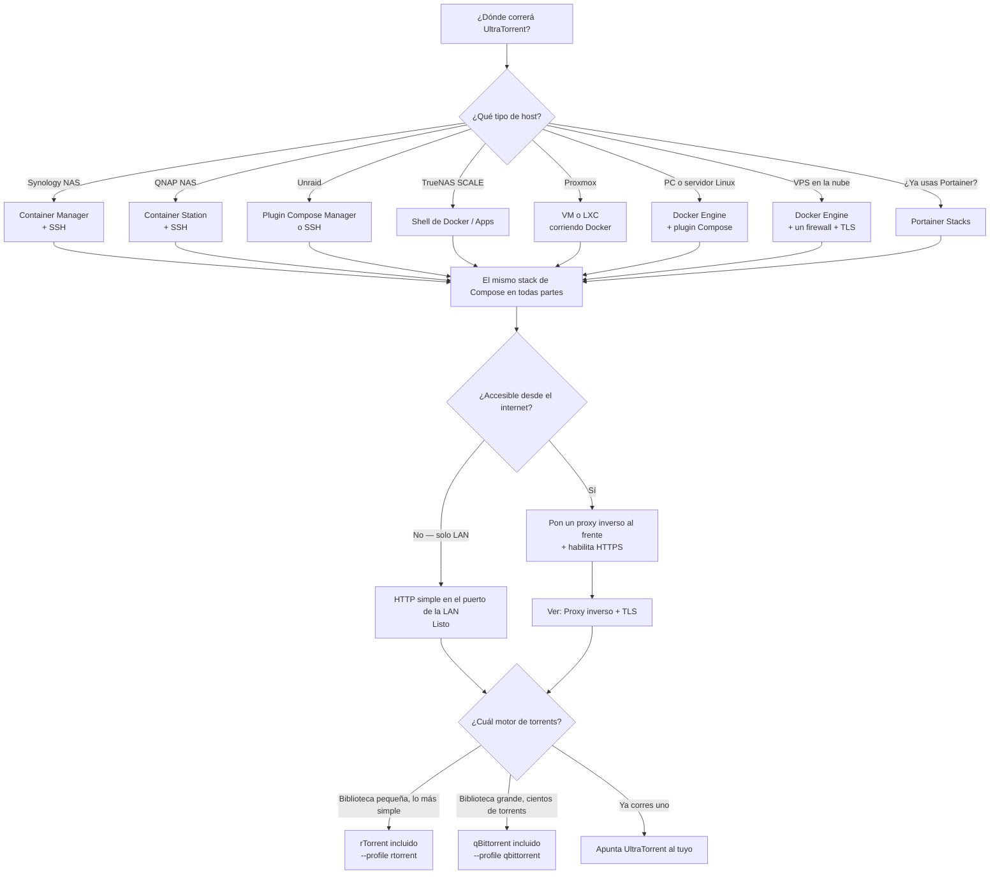
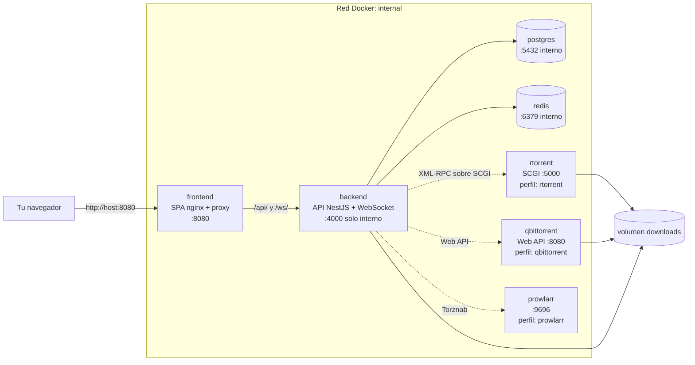

# Elige tu método de instalación

## Resumen

UltraTorrent se distribuye como un **stack de Docker Compose**: PostgreSQL, Redis, la API de NestJS, la interfaz web en React y — detrás de perfiles opcionales de Compose — un motor de torrents incluido, un gestor de indexadores Prowlarr, un solucionador de Cloudflare y un proxy inverso de borde.

Ese solo hecho simplifica toda la historia de la instalación. **Casi toda "plataforma" en esta sección no es más que un host de Docker.** Synology, QNAP, Unraid, TrueNAS SCALE, Portainer, Proxmox, un VPS de Hetzner — se diferencian en *cómo consigues un shell*, *dónde viven tus volúmenes* y *qué puertos ya están ocupados*. No se diferencian en cómo corre UltraTorrent.

Por eso esta sección está armada así a propósito:

- **[Docker Compose](/install/docker-compose)** es la guía autoritativa. Todas las demás páginas remiten a ella.
- **[Las páginas de plataforma](/install/platforms/linux)** son diferencias mínimas: acceso al shell, rutas, choques de puertos, detalles a cuidar.
- **[Proxy inverso](/install/reverse-proxy)** y **[TLS](/install/tls)** son transversales y aplican a todas.

:::info Todavía no hay imágenes precompiladas
El stack de Compose **compila las imágenes desde el código fuente** — no hay una imagen publicada en un registry que puedas bajar con `docker pull`. Por eso tu host necesita Docker, el árbol de código fuente y aproximadamente **2 GB de RAM libre** para el primer build (unos 10–15 minutos; los arranques posteriores toman segundos). Las imágenes base son multiarquitectura, así que funcionan tanto hosts x86-64 como ARM64.
:::

:::tip Mira este tutorial
_Video próximamente._
:::

## Árbol de decisión

## Tabla comparativa

| Host | Cómo se instala | Dificultad | ¿Requiere shell? | Notas |
|------|-----------------|-----------|---------------|-------|
| **[PC / servidor Linux](/install/platforms/linux)** | Docker Engine + plugin Compose | Fácil | Sí | La plataforma de referencia. Ubuntu, Debian, Fedora, Rocky. |
| **[Synology](/install/platforms/synology)** | Container Manager + SSH | Media | Sí (una vez) | **Bien comprobado** — UltraTorrent está desplegado en Synology. Remapea el puerto de la UI; DSM puede quitarle capacidades al container. |
| **[QNAP](/install/platforms/qnap)** | Container Station + SSH | Media | Sí | **Bien comprobado.** El binario `docker` no está en el `PATH` de forma predeterminada. La UI de administración de QNAP ya ocupa el puerto 8080. |
| **[Unraid](/install/platforms/unraid)** | Plugin Docker Compose Manager, o SSH | Media | Sí | No existe una plantilla de Community Apps — el stack se compila desde el código fuente. |
| **[TrueNAS SCALE](/install/platforms/truenas)** | Docker / app personalizada | Media | Sí | Depende mucho del motor de apps de tu versión de SCALE. |
| **[Portainer](/install/platforms/portainer)** | Stacks → repositorio Git | Fácil | No | Bueno si ya corres Portainer. El seed todavía necesita una consola del container. |
| **[Proxmox](/install/platforms/proxmox)** | VM (recomendado) o LXC corriendo Docker | Media | Sí | Proxmox por sí solo no corre Docker — lo instalas dentro de un invitado. |
| **[VPS en la nube](/install/platforms/cloud)** | Docker Engine + firewall + TLS | Media | Sí | AWS, Azure, GCP, Oracle, Hetzner, DigitalOcean, Vultr. **Nunca lo expongas sin HTTPS y un firewall.** |

## Qué se instala

**El único puerto publicado de forma predeterminada es el de la interfaz web** (`8080`, cambiable con `FRONTEND_PORT`). El backend *no* se publica al host — el nginx del frontend le hace proxy a `/api/` y `/ws/` sobre la red interna de Docker.

## ¿Cuál motor?

UltraTorrent es multimotor. Dos motores vienen incluidos detrás de perfiles de Compose:

| | **rTorrent** incluido (`--profile rtorrent`) | **qBittorrent** incluido (`--profile qbittorrent`) |
|---|---|---|
| Configuración | Cero configuración — agrégalo en la UI como `scgi-tcp` / host `rtorrent` / puerto `5000` | Saca la contraseña del primer arranque de los logs y luego regístralo |
| Huella | Muy pequeña | Pequeña |
| Estabilidad a escala | **Se degrada.** rTorrent 0.9.8 tiene un crash `priority_queue_insert` sin corregir en el proyecto original, que se dispara con más frecuencia mientras más torrents activos corras | Cómodo con miles de torrents |
| Ideal para | Una biblioteca modesta, una primera instalación | Una biblioteca grande |

:::warning El rTorrent incluido y las bibliotecas grandes
El motor incluido es rTorrent `0.9.8` (jesec `v0.9.8-r16`, el build más nuevo de esa línea). Arrastra un bug **del proyecto original** de larga data — `internal_error: priority_queue_insert(...) called on an invalid item`, disparado durante la programación del anuncio al tracker — **sin corrección en la línea 0.9.8**. La frecuencia escala con la cantidad de torrents *activos*: prácticamente cero con unos pocos, y alrededor de diez crashes al día con unos 750.

Cada crash termina el proceso; el `restart: unless-stopped` de Docker lo relanza y rTorrent recarga su sesión guardada, así que **no se pierde ningún torrent** — las transferencias solo se pausan brevemente y vuelven a anunciarse. Mitígalo manteniendo modesta la cantidad de torrents activos, o corre **qBittorrent** en su lugar para una biblioteca grande. Los trackers UDP y DHT ya vienen deshabilitados en la configuración incluida para eliminar variantes secundarias de crash.
:::

## Antes de empezar

Vas a necesitar, en el host:

- **Docker Engine** con el **plugin Compose v2** (`docker compose`, con espacio — no el antiguo `docker-compose`).
- **~2 GB de RAM libre** para el build, **2+ GB de disco** para las imágenes, más lo que necesiten tus descargas.
- El **árbol de código fuente** (`git clone`, o un ZIP descargado).
- Cinco secretos que generas tú mismo: `POSTGRES_PASSWORD`, `JWT_ACCESS_SECRET`, `JWT_REFRESH_SECRET`, `ENCRYPTION_KEY`, `ADMIN_PASSWORD`. **No hay valores predeterminados inseguros** — el stack se niega a arrancar sin ellos.

## Próximos pasos

1. **[Sigue la guía de Docker Compose](/install/docker-compose)** — la instalación autoritativa.
2. Repasa la **[página de tu plataforma](/install/platforms/linux)** para ver las diferencias que aplican a tu host.
3. ¿Lo vas a exponer más allá de tu LAN? **[Proxy inverso](/install/reverse-proxy)** → **[TLS](/install/tls)**.
4. Luego **[Inicio rápido](/learn/quick-start)** y **[tu primera descarga](/learn/first-download)**.

## Lista de verificación

- [ ] Sé en cuál host voy a instalar
- [ ] Docker Engine + Compose v2 están instalados en él
- [ ] Tengo ~2 GB de RAM libre y un par de GB de disco
- [ ] Ya decidí entre rTorrent (biblioteca pequeña) y qBittorrent (biblioteca grande)
- [ ] Sé si esta máquina será accesible desde el internet (→ proxy inverso + TLS)
- [ ] Tengo un lugar seguro donde guardar los cinco secretos que voy a generar

## Preguntas frecuentes

**¿Hay una app de un solo clic o una imagen en Docker Hub?**
Todavía no. Cada instalación se compila desde el código fuente con `docker compose up -d --build`.

**¿Puedo correrlo sin Docker?**
Sí — Node 20, PostgreSQL 14+ y Redis 6+, desde el código fuente. Es una ruta de desarrollo, no una ruta de producción soportada. Ver [Linux](/install/platforms/linux#manual-install-from-source).

**¿Necesita GPU o transcodificación?**
No. UltraTorrent adquiere y organiza medios; no transcodifica ni transmite.

**¿Puedo usar mi qBittorrent / rTorrent existente?**
Sí — omite ambos perfiles y registra tu propio motor bajo **Infraestructura → Motores**. Ver [Motores](/modules/engines).

## Ver también

- [Instalación con Docker Compose](/install/docker-compose) — la guía autoritativa
- [Actualizaciones](/install/upgrading) — actualizaciones, reversión, seguridad en las migraciones
- [Variables de entorno](/reference/environment) — cada variable, generada desde `.env.example`
- [Conceptos](/learn/concepts) — qué son las piezas
- [Solución de problemas](/operate/troubleshooting)
- [Seguridad](/operate/security)
