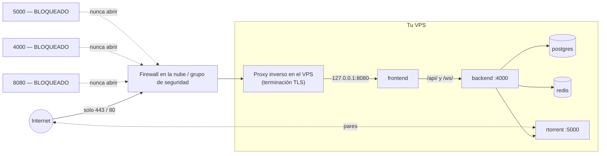

import Tabs from '@theme/Tabs';
import TabItem from '@theme/TabItem';

# Nube y VPS

## Resumen

Un VPS en la nube es un [host Linux](/install/platforms/linux) que alquilas. La instalación es idéntica. Lo que cambia es que está **en el internet público**, lo que convierte tres cosas opcionales en obligatorias:

1. **Un firewall.** Expón solo el 80/443 — nunca el 8080, nunca el 4000, nunca el 5000.
2. **HTTPS.** Sin excepciones.
3. **Copias de seguridad que guardes en otro lugar.** Una instancia en la nube puede desaparecer.

Y dos cosas que tienes que entender antes de gastar dinero:

- **El ancho de banda se mide** casi en todas partes, y BitTorrent es ancho de banda. De ahí salen las facturas sorpresa.
- **La política de uso aceptable (AUP) de tu proveedor te aplica a ti.** Léela.

:::warning Lee primero la AUP de tu proveedor
Algunos proveedores prohíben el tráfico de BitTorrent de plano, otros lo toleran, y otros cancelan tu cuenta con el primer aviso de DMCA. Esto es una cuestión de política, no técnica, y corre completamente por tu cuenta. UltraTorrent es una plataforma de adquisición de medios — úsala para contenido sobre el que tengas derechos.
:::

:::caution Verificado por la comunidad
Los proveedores de nube **no** están entre los destinos de despliegue propios de este proyecto. Las partes de UltraTorrent de abajo están fundamentadas en el repositorio; los detalles de cada proveedor siguen su práctica estándar y sus consolas cambian constantemente. Verifica contra la documentación vigente del proveedor.
:::

:::tip Mira este tutorial
_Video próximamente._
:::

## Requisitos previos

- Una cuenta en la nube y un **nombre de dominio** (lo necesitas para HTTPS).
- Acceso SSH por llave a la instancia.
- Una tarjeta de crédito que estés vigilando.

## Requisitos

| Recurso | Mínimo | Cómodo | Por qué |
|----------|---------|-------------|-----|
| vCPU | 2 | 2–4 | La compilación; el estado estable es liviano |
| **RAM** | **4 GB** | 4–8 GB | La compilación llega a un pico de unos 2 GB *libres* — un droplet de 1 GB **fallará al compilar** |
| Disco de arranque | 20 GB | 40 GB | SO + imágenes |
| **Disco de datos** | Conecta almacenamiento en bloque | tan grande como tu biblioteca | Los discos de arranque son pequeños y caros |
| Ancho de banda | **revisa el tope** | sin medir o generoso | Aquí está el costo real |

A grandes rasgos, por proveedor:

| Proveedor | Instancia inicial sensata | Notas sobre el ancho de banda |
|----------|-----------------------|-----------------|
| **Hetzner** | CX22 / CPX21 (2 vCPU, 4 GB) | Tráfico incluido generoso — normalmente la opción sensata más barata |
| **DigitalOcean** | Basic 2 vCPU / 4 GB | La cuota de transferencia se agrupa por cuenta; el exceso se factura |
| **Vultr** | 2 vCPU / 4 GB Regular | Modelo similar al de DO |
| **Oracle Cloud** | Ampere A1 (ARM) — 4 OCPU / 24 GB en la capa gratuita | Capa gratuita grande, **pero** la capacidad muchas veces no está disponible, y el egress más allá de la cuota gratuita se factura |
| **AWS EC2** | t3.medium / t4g.medium | **El egress es caro.** Esta es la plataforma clásica de la factura sorpresa |
| **GCP** | e2-medium | Egress facturado por GB |
| **Azure** | B2s | Egress facturado por GB |
| **Linode/Akamai** | 2 GB shared → **4 GB** | 2 GB es muy poco para compilar |

:::danger El egress en los hiperescaladores
En AWS/GCP/Azure, la transferencia de datos **de salida** se factura por gigabyte. Un cliente de torrents compartiendo (seeding) es una máquina para generar transferencia de datos de salida. Hay gente que ha acumulado facturas de cuatro cifras así. Si usas un hiperescalador, **limita tu tasa de subida**, configura una **alarma de facturación** y conoce el precio de tu egress antes de empezar.
:::

Las instancias ARM64 (Graviton, Ampere, Axion) funcionan — las imágenes base son multiarquitectura.

## Puertos



| Puerto | ¿Abierto al internet? |
|------|----------------------|
| **22** (SSH) | Solo por llave, e idealmente restringido a tu IP |
| **80** | Sí — redirección HTTP→HTTPS y ACME |
| **443** | Sí — la UI |
| 8080 | **No.** Enlázalo a `127.0.0.1` y deja que el proxy lo alcance |
| 4000 (backend) | **Nunca.** No se publica de forma predeterminada; déjalo así |
| 5000 (SCGI) | **Nunca.** Control remoto total sin autenticación |
| Puertos de pares | Opcional, y solo si entiendes la exposición |

## Volúmenes

Usa **almacenamiento en bloque** para las descargas, no el disco de arranque:

```bash
# después de conectar el volumen en la consola del proveedor
lsblk                                     # encuentra el dispositivo, p. ej. /dev/sdb
sudo mkfs.ext4 /dev/sdb
sudo mkdir -p /mnt/downloads
echo '/dev/sdb /mnt/downloads ext4 defaults,nofail,discard 0 2' | sudo tee -a /etc/fstab
sudo mount -a
sudo chown -R 1000:1000 /mnt/downloads
```

```yaml
# docker-compose.override.yml
volumes:
  downloads:
    driver: local
    driver_opts:
      type: none
      o: bind
      device: /mnt/downloads
```

:::tip `nofail` importa en la nube
Sin él, una instancia que arranca antes de que el volumen se conecte cae a un shell de emergencia y nunca vuelve — y te toca depurarla por consola serial.
:::

## Permisos

Linux estándar — la carpeta de descargas tiene que ser escribible por el **uid 1000** (o por tu `PUID`/`PGID`). Ver [Permisos](/install/docker-compose#permissions).

La pregunta de permisos más importante en un VPS es **quién puede iniciar sesión**: solo llaves, sin autenticación por contraseña, sin login de root.

## Paso a paso

### 1. Crea la instancia

<Tabs groupId="cloud">
<TabItem value="hetzner" label="Hetzner" default>

- **Image:** Ubuntu 24.04
- **Type:** CX22 (2 vCPU, 4 GB) o mayor
- **Volume:** conecta almacenamiento en bloque para las descargas
- **Firewall:** crea uno que permita **22 (tu IP), 80, 443** — nada más
- **SSH key:** agrega la tuya

La cuota de tráfico incluida de Hetzner es generosa, y por eso es la respuesta usual para esta carga de trabajo.

</TabItem>
<TabItem value="do" label="DigitalOcean / Vultr">

- **Image:** Ubuntu 24.04
- **Size:** Basic, 2 vCPU / 4 GB (el nivel de 1 GB **no puede compilar** las imágenes)
- **Volume:** conecta un volumen de Block Storage
- **Firewall:** un firewall en la nube que permita **22 (tu IP), 80, 443**
- **SSH key:** agrega la tuya

Vigila la cuota de transferencia agrupada de tu cuenta.

</TabItem>
<TabItem value="aws" label="AWS EC2">

- **AMI:** Ubuntu 24.04
- **Instance:** `t3.medium` (x86) o `t4g.medium` (ARM/Graviton — más barata)
- **Storage:** 20 GB gp3 de raíz **+ un volumen EBS aparte** para las descargas
- **Security group:** entrada **22 (tu IP), 80, 443** solamente
- **Elastic IP** para que la dirección sobreviva a un stop/start

:::danger EBS + egress = las dos facturas de AWS que sorprenden a la gente
Configura una **alarma de facturación** antes de hacer cualquier otra cosa, y limita tu tasa de subida de torrents.
:::

</TabItem>
<TabItem value="gcp" label="GCP / Azure">

**GCP:** `e2-medium`, Ubuntu 24.04, un disco persistente aparte para las descargas, reglas de firewall que permitan 80/443 (y 22 desde tu IP).

**Azure:** `Standard_B2s`, Ubuntu 24.04, un disco de datos, un NSG que permita 80/443 (y 22 desde tu IP).

Ambos facturan el egress por GB. Configura una alerta de presupuesto.

</TabItem>
<TabItem value="oracle" label="Oracle Cloud">

La capa gratuita de **Ampere A1** (hasta 4 OCPU / 24 GB, ARM64) es generosa, y las imágenes de UltraTorrent son multiarquitectura, así que compilan.

Dos cosas que debes saber:

1. **La capacidad de A1 frecuentemente no está disponible** en una región dada — puedes pasar días reintentando.
2. Las instancias de Oracle vienen con **reglas de iptables horneadas en la imagen**, además de la *security list* a nivel de nube. Abrir un puerto en la consola **no es suficiente**:

```bash
sudo iptables -I INPUT -p tcp --dport 443 -j ACCEPT
sudo iptables -I INPUT -p tcp --dport 80 -j ACCEPT
sudo netfilter-persistent save
```

Esa sorpresa de las iptables locales es el "abrí el puerto y aun así no funciona" más común en OCI.

</TabItem>
</Tabs>

### 2. Endurece la máquina — antes de instalar nada

```bash
sudo apt update && sudo apt upgrade -y

# SSH: solo llaves
sudo sed -i 's/^#\?PasswordAuthentication.*/PasswordAuthentication no/' /etc/ssh/sshd_config
sudo sed -i 's/^#\?PermitRootLogin.*/PermitRootLogin no/' /etc/ssh/sshd_config
sudo systemctl restart ssh

# Actualizaciones de seguridad automáticas
sudo apt install -y unattended-upgrades fail2ban
```

Cortafuegos del host, además del de la nube:

```bash
sudo ufw default deny incoming
sudo ufw default allow outgoing
sudo ufw allow 22/tcp
sudo ufw allow 80/tcp
sudo ufw allow 443/tcp
sudo ufw enable
```

:::danger Docker atraviesa ufw
Docker escribe sus propias reglas de iptables y **un puerto publicado se salta ufw**. `ufw deny 8080` **no** protege un container publicado en `0.0.0.0:8080`. La única solución confiable es **no publicarlo públicamente** — enlázalo a localhost (próximo paso) y usa el firewall de la nube como capa exterior.
:::

### 3. Instala Docker + UltraTorrent

```bash
curl -fsSL https://get.docker.com | sudo sh
sudo usermod -aG docker "$USER"     # cierra sesión y vuelve a entrar

git clone https://github.com/damirabal/ultratorrent-core.git
cd ultratorrent-core
cp .env.example .env
for k in JWT_ACCESS_SECRET JWT_REFRESH_SECRET ENCRYPTION_KEY; do
  sed -i "s|^$k=.*|$k=$(openssl rand -base64 48 | tr -d '\n')|" .env
done
nano .env
```

```dotenv
POSTGRES_PASSWORD=lettersAndNumbers123
ADMIN_PASSWORD=a-genuinely-strong-password       # esta da la cara al internet
FRONTEND_PORT=8080
CORS_ORIGIN=https://torrents.example.com         # tu origen público real
```

### 4. Enlaza la UI a localhost

Este es el paso que mantiene el puerto HTTP crudo fuera del internet.

```yaml
# docker-compose.override.yml
services:
  frontend:
    ports: !override
      - "127.0.0.1:8080:8080"

volumes:
  downloads:
    driver: local
    driver_opts:
      type: none
      o: bind
      device: /mnt/downloads
```

:::caution Verificado por la comunidad
`!override` necesita un Compose v2 reciente. Si el tuyo lo rechaza, edita la línea `ports:` directamente en `docker-compose.yml` — un override sencillo **agrega** puertos en vez de reemplazarlos, lo que dejaría `0.0.0.0:8080` publicado.
:::

Verifícalo después. Este comando es el punto entero de esta sección:

```bash
sudo ss -tlnp | grep 8080
# QUEREMOS:  127.0.0.1:8080
# NO:        0.0.0.0:8080
```

### 5. Compila, inicia, siembra la base de datos

```bash
docker compose --profile rtorrent up -d --build
docker compose exec backend npx prisma db seed
```

### 6. Pon un proxy al frente, con HTTPS

Apunta el registro A de tu dominio a la IP de la instancia y luego — el camino correcto más corto:

```bash
sudo apt install -y caddy
```

```caddy
# /etc/caddy/Caddyfile
torrents.example.com {
    encode gzip
    reverse_proxy 127.0.0.1:8080
}
```

```bash
sudo systemctl reload caddy
```

Caddy obtiene el certificado, redirige de HTTP a HTTPS, renueva automáticamente y hace de proxy de los WebSockets de forma transparente. Otros proxies (NGINX, Traefik, HAProxy): [Proxy inverso](/install/reverse-proxy). Los certificados a fondo: [TLS](/install/tls).

### 7. Inicia sesión

`https://torrents.example.com` → inicia sesión como **`admin`**.

**De inmediato:** cambia la contraseña de admin desde el menú de perfil y **habilita la autenticación de dos factores**. Este login está en el internet público. Ver [Seguridad](/operate/security) y [Usuarios](/modules/users).

Luego agrega el motor: **Infraestructura → Motores → Agregar motor** → rTorrent · SCGI sobre TCP · host `rtorrent` · puerto `5000` → **Probar conexión** → **Agregar motor**. Y **Configuración → Ruta raíz predeterminada** → `/downloads`.

## Verificación

```bash
# Nada peligroso está escuchando públicamente
sudo ss -tlnp | grep -E '0\.0\.0\.0:(8080|4000|5000)'
#   ^ esto no debe imprimir NADA

# La app responde por HTTPS
curl -s https://torrents.example.com/api/system/live
curl -s https://torrents.example.com/api/system/version
```

**Confirma que el WebSocket hace upgrade a través del proxy** — de lo contrario la UI se verá bien y nunca se actualizará:

```bash
curl -i -N -H "Connection: Upgrade" -H "Upgrade: websocket" \
  -H "Sec-WebSocket-Version: 13" -H "Sec-WebSocket-Key: dGhlIHNhbXBsZSBub25jZQ==" \
  https://torrents.example.com/ws/
```

```text
HTTP/1.1 101 Switching Protocols
```

**Desde otra computadora**, comprueba que los puertos crudos están cerrados:

```bash
curl -m 5 http://<public-ip>:8080     # tiene que dar timeout / ser rechazado
curl -m 5 http://<public-ip>:4000     # tiene que dar timeout / ser rechazado
```


## Proxy inverso

Obligatorio. Ver [Proxy inverso](/install/reverse-proxy). El upgrade de WebSocket no es opcional — la UI en vivo depende de él.

## HTTPS

Obligatorio. Let's Encrypt vía Caddy es el camino más corto; certbot + NGINX es el clásico. Ver [TLS](/install/tls).

## Actualizaciones

```bash
cd ultratorrent-core
docker compose exec -T postgres pg_dump -U ultratorrent ultratorrent > backup-$(date +%F).sql
# copia el dump FUERA de la instancia:
scp backup-$(date +%F).sql you@home:/backups/

git pull
docker compose --profile rtorrent up -d --build
docker compose exec backend npx prisma db seed
```

Toma un **snapshot del proveedor** de la instancia antes de una actualización — es el equivalente en la nube de un snapshot de Proxmox y te da una reversión de la máquina completa. Procedimiento completo: [Actualizar](/install/upgrading).

Mantén el SO parchado: `unattended-upgrades` ya lo está haciendo si lo instalaste en el paso 2.

## Copias de seguridad

**Fuera de la instancia o no cuentan.**

```bash
# Cada noche: haz el dump y luego mándalo a otro lugar
docker compose exec -T postgres pg_dump -U ultratorrent ultratorrent \
  | gzip > /mnt/downloads/backups/ut-$(date +%F).sql.gz

# luego sácalo de la máquina con rclone/scp/s3
```

Respalda también el **`.env`** — sin el `ENCRYPTION_KEY`, los secretos de 2FA guardados son irrecuperables.

Los snapshots del proveedor son convenientes, pero viven en la misma cuenta que un compromiso de seguridad o un fallo de facturación se llevaría por delante. Guarda una copia en otro lugar. Ver [Copias de seguridad y restauración](/operate/backup).

## Resolución de problemas

| Síntoma | Causa | Solución |
|---------|-------|-----|
| La compilación muere por falta de memoria (OOM) | La instancia es muy pequeña — 1–2 GB de RAM | Redimensiona a **4 GB**, o agrega swap y recompila lentamente |
| Puerto abierto en la consola de la nube y aun así inalcanzable | También hay un firewall del **host** en el medio (`ufw`, o las iptables horneadas de Oracle) | Ábrelo también localmente: `ufw allow 443/tcp`, o `iptables -I INPUT ... && netfilter-persistent save` |
| `ufw deny 8080` no hace nada — el 8080 sigue accesible | **Docker se salta ufw** escribiendo sus propias reglas de iptables para los puertos publicados | No lo publiques: enlázalo a `127.0.0.1:8080` y confía en el firewall de la nube |
| Falla la emisión del certificado | El puerto 80 está bloqueado, o el DNS no ha propagado | Abre el 80 en **ambos** firewalls; verifica que el registro A realmente resuelva |
| Factura de ancho de banda escandalosa | Estás compartiendo (seeding) en un proveedor que cobra el egress por GB | Limita la tasa de subida, detén los seeds completados, configura una alarma de facturación, múdate a un proveedor de tarifa plana |
| La instancia no arranca tras agregar un volumen | Una entrada en `fstab` sin `nofail` | Agrega `nofail`; recupera vía la consola serial/de rescate |
| Disco de descargas lleno, el stack se degrada | Usaste el disco de arranque para las descargas, o el volumen se llenó | Las descargas van en almacenamiento en bloque; monitorea el espacio libre |
| La UI carga por HTTPS pero nunca se actualiza | El WebSocket no está haciendo upgrade a través del proxy | Corre la prueba de `101 Switching Protocols` de arriba; ver [Proxy inverso](/install/reverse-proxy) |
| Intentos de fuerza bruta en los logs | Es una página de login pública | `ADMIN_PASSWORD` fuerte, **habilita 2FA**, `fail2ban`, y considera autenticación a nivel del proxy |
| Cuenta suspendida | AUP del proveedor / DMCA | Es un problema de política, no técnico. Lee la AUP antes de desplegar |

Más: [Resolución de problemas](/operate/troubleshooting) · [Seguridad](/operate/security).

## Mejores prácticas

- **Nunca publiques el 8080, el 4000 ni el 5000 al internet.** Enlaza a `127.0.0.1` y pon un proxy al frente.
- **Dos firewalls**: el de la nube *y* el del host. Recuerda que Docker atraviesa ufw para los puertos publicados.
- **HTTPS desde el día uno.** Una página de login en HTTP plano en el internet público manda tu contraseña en texto claro.
- **Habilita 2FA en la cuenta de admin** de inmediato.
- **SSH: solo llaves**, sin login de root, `fail2ban`.
- **Conoce el precio de tu egress y configura una alarma de facturación** *antes* de compartir nada.
- **Limita la tasa de subida** en un proveedor que mide el tráfico.
- **Almacenamiento en bloque para las descargas**, con `nofail` en el `fstab`.
- **Manda las copias de seguridad fuera de la instancia.**
- **Parcha el SO automáticamente** (`unattended-upgrades`).
- **Lee la AUP del proveedor.** Ese es el riesgo que acaba con el proyecto, no un puerto mal configurado.
- Prefiere **qBittorrent** si vas a manejar una biblioteca grande en una máquina remota a la que no le vas a estar pendiente.

## Preguntas frecuentes

**¿Cuál proveedor es el más barato para esto?**
Los proveedores de tarifa plana o con tráfico generoso (Hetzner y similares) le ganan dramáticamente a los hiperescaladores que cobran el egress por GB cuando la carga de trabajo consume mucho ancho de banda. Eso es un hecho aritmético, no una preferencia.

**¿Puedo usar la capa gratuita de Oracle?**
Sí — Ampere A1 es ARM64 y las imágenes son multiarquitectura. Espera dolores de cabeza con la capacidad, y acuérdate de las reglas de iptables horneadas en la imagen.

**¿Alcanza con un droplet de 1 GB?**
No. Solo la compilación quiere ~2 GB libres. Usa 4 GB.

**¿Esto es un seedbox?**
Puede serlo. Si tu proveedor está contento con eso es una pregunta que solo su AUP puede contestar.

**¿Necesito un dominio?**
Para HTTPS, en la práctica sí. Let's Encrypt no emite certificados para una IP pelada.

**¿Cómo evito que le hagan fuerza bruta al login de admin?**
Contraseña fuerte, 2FA, `fail2ban` y, opcionalmente, una capa de autenticación en el proxy (Cloudflare Access, basic auth). Ver [Seguridad](/operate/security).

**¿Puedo ponerlo detrás de Cloudflare?**
Para la interfaz web, sí — un Tunnel incluso evita abrir cualquier puerto de entrada. Ver [Proxy inverso](/install/reverse-proxy). El tráfico de pares de BitTorrent no pasa por Cloudflare.

## Lista de verificación

- [ ] AUP del proveedor leída y entendida
- [ ] Instancia de ≥ **2 vCPU / 4 GB de RAM**
- [ ] Almacenamiento en bloque conectado para las descargas, montado con `nofail`
- [ ] Firewall de la nube: **22 (tu IP), 80, 443** — nada más
- [ ] Firewall del host habilitado también (y las iptables locales de Oracle, si aplica)
- [ ] Solo llaves SSH; login de root apagado; `fail2ban` instalado
- [ ] `unattended-upgrades` instalado
- [ ] `.env`: `POSTGRES_PASSWORD` alfanumérica, `ADMIN_PASSWORD` **fuerte**, tres secretos distintos, `CORS_ORIGIN` = tu origen HTTPS
- [ ] Frontend enlazado a **`127.0.0.1:8080`** — verificado con `ss -tlnp`
- [ ] Proxy inverso + certificado TLS válido
- [ ] `/ws/` devuelve **101 Switching Protocols** a través del proxy
- [ ] `curl http://<public-ip>:8080` desde afuera **falla** (como debe ser)
- [ ] Contraseña de admin cambiada y **2FA habilitada**
- [ ] Alarma de facturación configurada; tasa de subida limitada si el egress se mide
- [ ] Copias de seguridad corriendo **y enviadas fuera de la instancia**

## Ver también

- [Linux](/install/platforms/linux) — la misma instalación, en tu propio hardware
- [Instalación con Docker Compose](/install/docker-compose) — la guía autoritativa
- [Proxy inverso](/install/reverse-proxy) · [TLS](/install/tls) — ambos obligatorios aquí
- [Seguridad](/operate/security) — lee esto antes de exponer nada
- [Copias de seguridad y restauración](/operate/backup) · [Actualizar](/install/upgrading) · [Rendimiento](/operate/performance)
