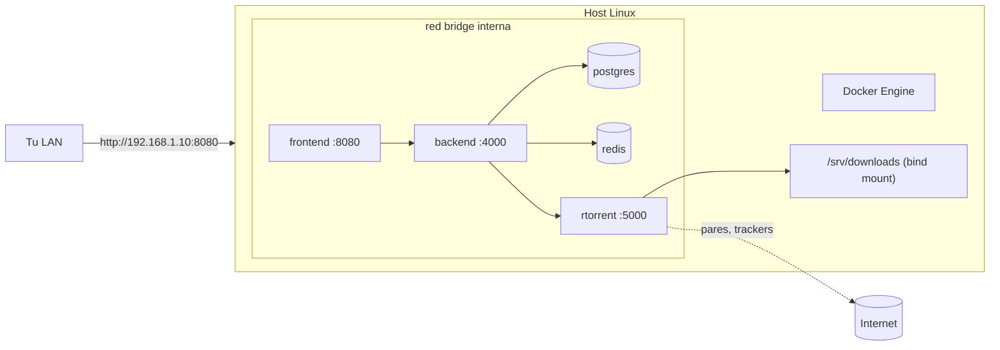

import Tabs from '@theme/Tabs';
import TabItem from '@theme/TabItem';

# Linux

## Resumen

Linux es la plataforma de referencia de UltraTorrent — sobre ella se desarrolla, se prueba y se despliega. La diferencia con la [guía de Docker Compose](/install/docker-compose) es mínima: instala Docker y luego sigue esa guía al pie de la letra.

También se documenta abajo una instalación **manual, desde el código fuente**. Existe para desarrollo. Usa Docker para cualquier cosa que te importe.

:::tip Mira este tutorial
_Video próximamente._
:::

## Requisitos previos

- Un host Linux de 64 bits (x86-64 o ARM64) donde puedas usar `sudo`.
- Acceso a internet de salida (para bajar las imágenes base y las dependencias).
- ~2 GB de RAM libre y un par de GB de disco.

## Requisitos

| | Mínimo | Cómodo |
|---|---------|-------------|
| CPU | 2 núcleos | 4 núcleos |
| RAM | 2 GB libres (el build es el pico) | 4 GB+ |
| Disco (stack) | 3 GB | 10 GB |
| Disco (descargas) | tu biblioteca | en su propio sistema de archivos |
| Kernel | cualquiera que Docker soporte | — |

## Puertos

Exactamente como en la [guía principal](/install/docker-compose#ports): solo se publica el **8080** (la interfaz web). Revisa que esté libre antes de empezar:

```bash
sudo ss -tlnp | grep -E ':(8080|9696|8081)\b'
```

Si aparece algo → elige otro `FRONTEND_PORT` en `.env`.

## Volúmenes

Los volúmenes con nombre gestionados por Docker viven bajo `/var/lib/docker/volumes/`. Casi seguro vas a querer hacer bind-mount de **downloads** a una ruta real:

```bash
sudo mkdir -p /srv/downloads
sudo chown -R 1000:1000 /srv/downloads
```

```yaml
# docker-compose.override.yml
volumes:
  downloads:
    driver: local
    driver_opts:
      type: none
      o: bind
      device: /srv/downloads
```

## Permisos

- Agrégate al grupo `docker` para no necesitar `sudo` en cada comando (y cierra sesión y vuelve a entrar para que surta efecto).
- La carpeta de descargas debe ser escribible por el **uid 1000** (el usuario `node` del backend y el `PUID` predeterminado de los motores).
- ¿Compartes la carpeta con otra aplicación (Plex, Jellyfin)? Configura `PUID`/`PGID` con *ese* usuario en vez de hacerle chown a la carpeta — ver [Permisos](/install/docker-compose#permissions).

## Red



## Paso a paso

### 1. Instala Docker Engine + Compose

<Tabs groupId="distro">
<TabItem value="ubuntu" label="Ubuntu / Debian" default>

El script oficial de conveniencia instala Engine **y** el plugin de Compose:

```bash
curl -fsSL https://get.docker.com | sudo sh
sudo usermod -aG docker "$USER"     # luego cierra sesión y vuelve a entrar
```

:::caution No uses los paquetes `docker.io` / `docker-compose` de la distro
Suelen estar viejos, y el script heredado `docker-compose` (con guion) no implementa todo lo que este stack usa. Lo que quieres es `docker compose` (con espacio).
:::

</TabItem>
<TabItem value="fedora" label="Fedora">

```bash
sudo dnf -y install dnf-plugins-core
sudo dnf config-manager --add-repo https://download.docker.com/linux/fedora/docker-ce.repo
sudo dnf -y install docker-ce docker-ce-cli containerd.io docker-buildx-plugin docker-compose-plugin
sudo systemctl enable --now docker
sudo usermod -aG docker "$USER"     # luego cierra sesión y vuelve a entrar
```

</TabItem>
<TabItem value="rocky" label="Rocky / AlmaLinux / RHEL">

```bash
sudo dnf -y install dnf-plugins-core
sudo dnf config-manager --add-repo https://download.docker.com/linux/centos/docker-ce.repo
sudo dnf -y install docker-ce docker-ce-cli containerd.io docker-buildx-plugin docker-compose-plugin
sudo systemctl enable --now docker
sudo usermod -aG docker "$USER"     # luego cierra sesión y vuelve a entrar
```

**SELinux** está en modo enforcing de forma predeterminada. Si una carpeta de descargas con bind mount da errores de permisos dentro del container a pesar de tener la propiedad correcta, vuelve a etiquetarla:

```bash
sudo chcon -Rt svirt_sandbox_file_t /srv/downloads
```

:::caution Verificado por la comunidad
El reetiquetado de SELinux de arriba es el remedio estándar para las denegaciones de bind mount en hosts de la familia RHEL, pero no se ejercita en los despliegues propios de este proyecto. Revisa `sudo ausearch -m avc -ts recent` si te topas con denegaciones.
:::

</TabItem>
<TabItem value="arch" label="Arch">

```bash
sudo pacman -S --needed docker docker-compose
sudo systemctl enable --now docker
sudo usermod -aG docker "$USER"     # luego cierra sesión y vuelve a entrar
```

:::caution Verificado por la comunidad
Arch no forma parte de los despliegues propios de este proyecto. Docker se comporta con normalidad ahí; el stack no tiene requisitos específicos de distro.
:::

</TabItem>
</Tabs>

Verifica:

```bash
docker --version
docker compose version        # debe ser v2.x
docker run --rm hello-world
```

### 2. Instala UltraTorrent

De aquí en adelante, sigue la **[guía de Docker Compose](/install/docker-compose)** exactamente — nada en Linux se desvía de ella.

```bash
git clone https://github.com/damirabal/ultratorrent-core.git
cd ultratorrent-core
cp .env.example .env

for k in JWT_ACCESS_SECRET JWT_REFRESH_SECRET ENCRYPTION_KEY; do
  sed -i "s|^$k=.*|$k=$(openssl rand -base64 48 | tr -d '\n')|" .env
done

nano .env       # define POSTGRES_PASSWORD (¡alfanumérica!) y ADMIN_PASSWORD

docker compose --profile rtorrent up -d --build
docker compose exec backend npx prisma db seed
```

Abre `http://<host-ip>:8080` e inicia sesión como `admin`.

### 3. Arranque al iniciar el sistema

Nada que hacer — `restart: unless-stopped` en cada servicio, más el demonio de Docker habilitado, significa que el stack regresa después de un reinicio:

```bash
sudo systemctl enable docker
```

Confírmalo con un reinicio de verdad; es la única prueba que cuenta.

## Verificación

```bash
docker compose ps
curl -s http://localhost:8080/api/system/live
curl -s http://localhost:8080/api/system/version
```

```text
NAME                       STATUS                    PORTS
ultratorrent-backend-1     Up 2 minutes (healthy)    4000/tcp
ultratorrent-frontend-1    Up 2 minutes (healthy)    0.0.0.0:8080->8080/tcp
ultratorrent-postgres-1    Up 2 minutes (healthy)    5432/tcp
ultratorrent-redis-1       Up 2 minutes (healthy)    6379/tcp
ultratorrent-rtorrent-1    Up 2 minutes (healthy)    5000/tcp
```


## Proxy inverso

En una LAN, sáltatelo. ¿Vas a exponer la máquina? Termina TLS con NGINX, Caddy o Traefik — ver [Proxy inverso](/install/reverse-proxy).

Si tienes un firewall corriendo, permite solo lo que necesitas:

<Tabs groupId="firewall">
<TabItem value="ufw" label="ufw (Ubuntu/Debian)" default>

```bash
sudo ufw allow from 192.168.1.0/24 to any port 8080 proto tcp   # solo LAN
sudo ufw enable
```

</TabItem>
<TabItem value="firewalld" label="firewalld (Fedora/Rocky)">

```bash
sudo firewall-cmd --permanent --add-port=8080/tcp
sudo firewall-cmd --reload
```

</TabItem>
</Tabs>

## HTTPS

Ver [TLS](/install/tls). En una máquina Linux solo en LAN, HTTP plano es una decisión defendible; en el momento en que sea alcanzable desde internet, deja de serlo.

## Actualizaciones

```bash
cd ultratorrent-core
docker compose exec -T postgres pg_dump -U ultratorrent ultratorrent > backup-$(date +%F).sql
git pull
docker compose --profile rtorrent up -d --build
docker compose exec backend npx prisma db seed
```

Procedimiento completo y reversión: [Actualización](/install/upgrading).

## Copias de seguridad

```bash
docker compose exec -T postgres pg_dump -U ultratorrent ultratorrent > /backups/ut-$(date +%F).sql
cp .env /backups/
```

Un temporizador de `systemd` o una línea de cron es suficiente. Ver [Copia de seguridad y restauración](/operate/backup).

## Instalación manual (desde el código fuente) {#manual-install-from-source}

Para desarrollo, o para un host donde Docker no es opción. **Este no es el camino soportado para producción.**

### Requisitos previos

| Requisito | Versión |
|-------------|---------|
| **Node.js** | **20 LTS** (fijado por `.nvmrc`; `engines` requiere ≥20) |
| **PostgreSQL** | 14+ |
| **Redis** | 6+ |
| **rTorrent** | cualquier build reciente alcanzable por SCGI — opcional para arrancar, requerido para descargar de verdad |

:::warning Consigue un Node 20 limpio
**No** dependas de un paquete `nodejs`/`npm` de la distro — un npm de distro desajustado es una fuente clásica de `Cannot find module 'semver'` y de errores de versión de Prisma. Usa **nvm** (`nvm install 20 && nvm use 20`) o **NodeSource**. Evita versiones de Node que no sean LTS.
:::

### Pasos

```bash
# 1. Clona e instala (workspaces de npm — instala siempre desde la raíz del repo)
git clone https://github.com/damirabal/ultratorrent-core.git
cd ultratorrent-core
npm install

# 2. Entorno del backend
cp .env.example apps/backend/.env
```

`.env.example` está escrito para **Docker**, donde el host de la base de datos es el nombre del servicio `postgres`. Para una instalación manual, apúntalo a tus servicios locales:

```dotenv
DATABASE_URL=postgresql://ultratorrent:<PASSWORD>@localhost:5432/ultratorrent?schema=public
REDIS_HOST=localhost
```

La forma más fácil de tener PostgreSQL y Redis sin instalarlos:

```bash
docker compose -f docker-compose.dev.yml up -d     # publica 5432 y 6379 en el host
```

```bash
# 3. Prisma: generar, migrar, sembrar
npm run prisma:generate
npm run prisma:migrate      # prisma migrate deploy
npm run prisma:seed         # permisos, roles, admin, ajustes

# 4. Corre ambas apps en modo desarrollo
npm run dev
#   backend  → http://localhost:4000   (Swagger en /api/docs fuera de producción)
#   frontend → http://localhost:5173   (hace proxy de /api y /ws al backend)
```

:::info El seed de desarrollo tiene una contraseña de respaldo
Sin `ADMIN_PASSWORD` definida, un seed de desarrollo local recurre a una contraseña de desarrollo bien conocida (`changeme123!`). Cámbiala de inmediato. En producción `ADMIN_PASSWORD` es **obligatoria** y no hay respaldo.
:::

Actualizar una instalación manual:

```bash
git pull
nvm use                     # si cambió el Node requerido
npm install
npm run prisma:generate
npm run prisma:migrate
npm run prisma:seed
npm run build
# reinicia como sea que lo corras (systemd / pm2 / nohup)
```

## Resolución de problemas

| Síntoma | Causa | Solución |
|---------|-------|-----|
| `permission denied … /var/run/docker.sock` | No estás en el grupo `docker` | `sudo usermod -aG docker "$USER"`, luego **cierra sesión y vuelve a entrar** |
| `docker compose` → *command not found* | Solo está instalado el `docker-compose` heredado | Instala el **plugin** de Compose (`docker-compose-plugin`, o el script de get.docker.com) |
| El puerto 8080 ya está en uso | Otro servicio lo ocupa | `sudo ss -tlnp \| grep 8080`, luego define `FRONTEND_PORT` en `.env` |
| El build muere por falta de memoria (OOM) | Menos de ~2 GB de RAM libre | Libera memoria o agrega swap, luego recompila |
| La carpeta de descargas con bind mount no es escribible a pesar del `chown` correcto | **SELinux** (Fedora/Rocky/RHEL) | `sudo chcon -Rt svirt_sandbox_file_t /srv/downloads` |
| El container no puede resolver DNS | El DNS del host o una VPN interfiere con el bridge de Docker | Define `dns:` en el servicio, o arregla `/etc/docker/daemon.json` |
| El stack no regresa después de un reinicio | Docker no está habilitado | `sudo systemctl enable docker` |
| (Manual) `Prisma only supports Node.js >= 16.13` | Node muy viejo | Instala Node 20 con nvm o NodeSource |
| (Manual) `Cannot find module 'semver'` desde `/usr/share/nodejs/npm` | npm de la distro roto | Elimina los paquetes `nodejs`/`npm` de la distro; usa nvm o NodeSource |
| (Manual) `P1001: Can't reach database server at postgres:5432` | `DATABASE_URL` sigue apuntando al nombre del servicio de Docker | Cambia el host a `localhost` |

Más: [Resolución de problemas](/operate/troubleshooting).

## Mejores prácticas

- Usa el **plugin de Compose**, nunca el script heredado `docker-compose`.
- **Haz bind-mount de las descargas** a un sistema de archivos dedicado — una partición raíz llena tumba el stack completo.
- Mantén la máquina **parchada**: `unattended-upgrades` (Debian/Ubuntu) o `dnf-automatic` (Fedora/Rocky).
- **Ponle firewall.** Solo el 8080 en la LAN — o solo el 80/443 si un proxy va al frente.
- Pon el `pg_dump` en un **temporizador**, no en tu memoria.
- Prefiere Docker sobre la instalación manual para cualquier cosa de la que dependas.
- Si un servidor de medios comparte la carpeta de descargas, configura `PUID`/`PGID` en vez de hacerle chown.

## Preguntas frecuentes

**¿Qué distro debo usar?**
Cualquiera soportada por Docker. Ubuntu LTS y Debian stable son las que menos sorpresas dan.

**¿Funciona en ARM (Raspberry Pi, servidor ARM)?**
Las imágenes base son multi-arquitectura, así que ARM64 compila. Ten en cuenta que el build necesita ~2 GB de RAM — una Pi de 2 GB va justa, y una de 1 GB no lo logra.

**¿Puedo correrlo rootless?**
Docker rootless no es algo que este proyecto pruebe. El entrypoint de rTorrent ya maneja arrancar como usuario no root, pero cuenta con resolver por tu cuenta los problemas de permisos de volúmenes.

**¿Necesito `sudo` para cada comando?**
No — agrégate al grupo `docker`.

**¿Puedo usar Podman?**
Sin probar. El archivo de Compose usa perfiles, condiciones de healthcheck y opciones de bind en volúmenes con nombre; el soporte de `podman compose` para eso varía.

## Lista de verificación

- [ ] Docker Engine instalado y habilitado al arranque
- [ ] `docker compose version` imprime **v2.x**
- [ ] El usuario actual está en el grupo `docker` (con sesión cerrada y vuelta a abrir)
- [ ] Puerto 8080 libre, o `FRONTEND_PORT` cambiado
- [ ] Carpeta de descargas creada, con propietario `1000:1000` (o el de `PUID`/`PGID`)
- [ ] `.env` completado — `POSTGRES_PASSWORD` alfanumérica, tres secretos distintos
- [ ] `docker compose --profile rtorrent up -d --build` completado
- [ ] Seed corrido una vez
- [ ] Sesión iniciada, motor conectado, torrent de prueba descargando
- [ ] El firewall restringe el 8080 a la LAN
- [ ] Copias de seguridad programadas
- [ ] Sobrevive un reinicio

## Ver también

- [Instalación con Docker Compose](/install/docker-compose) — la guía autoritativa
- [Proxy inverso](/install/reverse-proxy) · [TLS](/install/tls) · [Actualización](/install/upgrading)
- [Nube / VPS](/install/platforms/cloud) — una máquina Linux en el hardware de otra persona
- [Proxmox](/install/platforms/proxmox) — una VM Linux en el tuyo
- [Rendimiento](/operate/performance) · [Seguridad](/operate/security)
