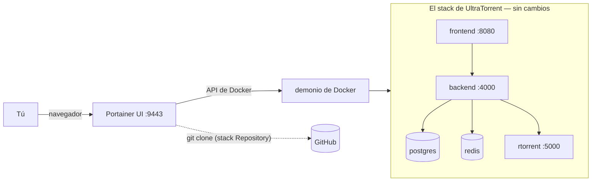

import Tabs from '@theme/Tabs';
import TabItem from '@theme/TabItem';

# Portainer

## Resumen

Portainer es una interfaz web para Docker — no cambia cómo corre UltraTorrent, solo te da un lugar donde hacer clic. Si ya usas Portainer, desplegar UltraTorrent como un **Stack desde un repositorio Git** es la opción más limpia: Portainer clona el repo, obtiene el **contexto de build** que necesita y vuelve a desplegar cuando se lo pidas.

Lo único que Portainer no puede hacer por ti es el **seed único de la base de datos**. Eso lo vas a correr desde la consola de un container (que Portainer sí provee).

:::caution Verificado por la comunidad
Portainer **no** forma parte de los despliegues propios de este proyecto. Los detalles de UltraTorrent de abajo están fundamentados en el repo; el flujo de Portainer sigue su función documentada de Stacks. Las etiquetas de los menús cambian entre versiones de Portainer — adapta según haga falta.
:::

:::tip Mira este tutorial
_Video próximamente._
:::

## Requisitos previos

- Una instancia de Portainer corriendo (CE o BE) que gestione un entorno **Docker standalone**.
- Que el demonio de Docker de ese entorno pueda alcanzar GitHub (para clonar) y Docker Hub (para bajar las imágenes base).
- ~2 GB de RAM libre en el host de Docker para el build.

:::warning El "Web editor" por sí solo no es suficiente
Pegar `docker-compose.yml` en el **Web editor** de Portainer le da a Compose el archivo pero **no el contexto de build** — y las imágenes del backend, del frontend y de rTorrent de UltraTorrent **se compilan desde el código fuente**. El build fallará por el contexto faltante. Usa el método **Repository**.
:::

## Requisitos

Portainer en sí es trivial (~100 MB de RAM). El requisito recae sobre el host de Docker que está por debajo: 2 núcleos, ~2 GB de RAM libre para el build, ~3 GB de disco para las imágenes.

## Puertos

La interfaz propia de Portainer está en el **9443** (HTTPS) o el **9000** — sin conflicto con el **8080** de UltraTorrent. Verifica que el 8080 esté libre en el host, o define `FRONTEND_PORT` en las variables de entorno del stack.

## Volúmenes

Portainer crea los mismos volúmenes con nombre que declara el archivo de Compose — `postgres_data`, `redis_data`, `downloads` y cualquier volumen de perfil. Puedes explorarlos en **Volumes**.

Para enlazar las descargas a una carpeta real del host, agrega el override **dentro del stack**. Con el método Repository, la ruta más fácil es el campo **additional compose file** de Portainer (ver el paso 3), apuntando a un `docker-compose.override.yml` que mantengas en tu propio fork — o simplemente edita el stack después del primer despliegue.

## Permisos

Sin cambios respecto a la [guía principal](/install/docker-compose#permissions): el backend corre como uid 1000 y los motores respetan `PUID`/`PGID`. Define esos valores como **variables de entorno del stack** en la interfaz de Portainer en vez de en un archivo `.env` — Portainer gestiona el entorno por ti.

## Cómo encaja Portainer



Portainer se sienta *al lado* del stack, no delante de él. Quita Portainer mañana y UltraTorrent sigue corriendo.

## Paso a paso

### 1. Crea el stack

**Stacks → Add stack**

- **Name:** `ultratorrent`
- **Build method:** **Repository**

### 2. Apúntalo al repo

| Campo | Valor |
|-------|-------|
| Repository URL | `https://github.com/damirabal/ultratorrent-core` |
| Repository reference | `refs/heads/main` |
| Compose path | `docker-compose.yml` |
| Authentication | apagado (repo público) |


:::note Falta captura de pantalla
Portainer **Stacks → Add stack**, pestaña **Repository**, con la URL del repositorio y la ruta de compose `docker-compose.yml` completadas.
:::

### 3. Habilita el perfil del motor

Los motores incluidos viven detrás de **perfiles** de Compose, y un despliegue sin perfil no levanta ningún motor.

Si tu versión de Portainer expone un campo de **profiles**, define `rtorrent` (o `qbittorrent`) ahí. Si no lo hace, define la variable de entorno en el próximo paso:

```dotenv
COMPOSE_PROFILES=rtorrent
```

:::caution Verificado por la comunidad
`COMPOSE_PROFILES` es una variable de entorno estándar de Compose y es la forma habitual de seleccionar perfiles cuando la interfaz no tiene un campo de perfiles. Confirma que tu versión de Portainer pase las variables de entorno del stack a la invocación de Compose.
:::

### 4. Define las variables de entorno

En la sección **Environment variables** del stack — haz clic en **Advanced mode** para pegarlas todas de una vez:

```dotenv
POSTGRES_PASSWORD=lettersAndNumbers123
ADMIN_PASSWORD=the-password-you-log-in-with
JWT_ACCESS_SECRET=<openssl rand -base64 48>
JWT_REFRESH_SECRET=<openssl rand -base64 48>
ENCRYPTION_KEY=<openssl rand -base64 48>
FRONTEND_PORT=8080
CORS_ORIGIN=http://localhost:8080
COMPOSE_PROFILES=rtorrent
TZ=Etc/UTC
```

Genera cada secreto en cualquier máquina con:

```bash
openssl rand -base64 48
```

Reglas que te van a morder si las ignoras:

- `POSTGRES_PASSWORD` tiene que ser **alfanumérica** — el `DATABASE_URL` derivado no lleva codificación de URL.
- `ENCRYPTION_KEY` tiene que **ser distinta** de `JWT_ACCESS_SECRET`, y ambas deben tener ≥32 caracteres. De lo contrario el backend se niega a arrancar.

:::danger Portainer guarda esto en texto plano
Cualquiera con acceso al stack de Portainer puede leer tus secretos. Restringe quién puede ver el entorno y trata el login del propio Portainer como una credencial de alto valor.
:::

### 5. Despliega

**Deploy the stack.** Portainer clona el repo y corre Compose, que **compila** las imágenes — espera varios minutos en el primer despliegue, y ninguna salida mientras trabaja.

### 6. Siembra la base de datos — una sola vez

Portainer no tiene un botón de "correr un comando puntual", pero tiene una consola.

**Containers → `ultratorrent-backend-1` → Console → Connect** (comando: `/bin/sh`), y luego:

```sh
npx prisma db seed
```


:::note Falta captura de pantalla
Portainer **Containers → backend → Console**, conectado como `/bin/sh`, mostrando `npx prisma db seed` completándose con éxito.
:::

### 7. Inicia sesión y agrega el motor

Abre `http://<docker-host>:8080` e inicia sesión como **`admin`** con tu `ADMIN_PASSWORD`.

**Infraestructura → Motores → Agregar motor** → rTorrent · SCGI sobre TCP · host `rtorrent` · puerto `5000` · Motor predeterminado activado → **Probar conexión** → **Agregar motor**.

Luego **Configuración → Ruta raíz predeterminada** → `/downloads`.

## Verificación

En Portainer: **Stacks → ultratorrent** debe mostrar todos los containers **running**, y el backend y el frontend **healthy**.

Desde un shell en el host de Docker (o la consola de Portainer):

```bash
curl -s http://localhost:8080/api/system/live
curl -s http://localhost:8080/api/system/version
```

El log del backend (**Containers → backend → Logs**) debe mostrar las migraciones aplicadas y a Nest escuchando — sin `insecure secret configuration`, sin `P1000`.

## Proxy inverso

Sin cambios. Portainer no es un proxy inverso. Apunta NGINX / Traefik / Caddy / NPM a `http://<docker-host>:8080` y **habilita el soporte de WebSocket** — ver [Proxy inverso](/install/reverse-proxy).

Si ya corres Traefik, agrega sus labels al servicio `frontend` editando el stack, o mediante un archivo de compose adicional.

## HTTPS

Termina TLS en tu proxy, no en Portainer. Ver [TLS](/install/tls).

## Actualizaciones

**Stacks → ultratorrent → Pull and redeploy**, con **Re-pull image** habilitado — Portainer vuelve a clonar la referencia del repositorio y recompila.

**Luego vuelve a correr el seed** desde la consola del backend (`npx prisma db seed`) para que aparezcan los permisos y ajustes nuevos.

:::danger Respalda antes de volver a desplegar
Las migraciones son de **solo avance** y se aplican automáticamente al arrancar el backend. Toma un volcado primero — desde la consola del container de postgres:

```sh
pg_dump -U ultratorrent ultratorrent > /tmp/backup.sql
```

…y cópialo fuera del host (`docker cp`). Ver [Actualización](/install/upgrading).
:::

Las **actualizaciones automáticas / GitOps** de Portainer BE pueden sondear el repositorio y volver a desplegar ante un commit nuevo. Es cómodo — y una buena manera de que se aplique una migración de solo avance sin supervisión mientras duermes. Actívalo solo si tienes copias de seguridad automatizadas.

## Copias de seguridad

Portainer no respalda nada. Desde la consola del container de postgres:

```sh
pg_dump -U ultratorrent ultratorrent > /tmp/ultratorrent.sql
```

```bash
docker cp ultratorrent-postgres-1:/tmp/ultratorrent.sql ./ultratorrent-$(date +%F).sql
```

Exporta también las variables de entorno de tu stack a un lugar seguro — **especialmente `ENCRYPTION_KEY`**, sin la cual los secretos 2FA guardados son irrecuperables. Ver [Copia de seguridad y restauración](/operate/backup).

## Resolución de problemas

| Síntoma | Causa | Solución |
|---------|-------|-----|
| El despliegue falla: contexto de build / `failed to read dockerfile` | Usaste el **Web editor** en vez de **Repository** — Compose recibió el YAML pero no el árbol de código fuente | Vuelve a crear el stack con el método **Repository** |
| El stack levanta pero **no hay container de rTorrent** | No se pasaron los perfiles — un despliegue sin perfil omite los servicios opcionales | Define `COMPOSE_PROFILES=rtorrent` (o usa el campo de profiles) y vuelve a desplegar |
| El backend termina: *"insecure secret configuration"* | `JWT_ACCESS_SECRET` / `ENCRYPTION_KEY` faltan, son muy cortos o son idénticos | Corrige las variables de entorno del stack y vuelve a desplegar |
| El backend entra en ciclo de fallos con **`P1000`** | El volumen `postgres_data` se creó con otra contraseña (Postgres la establece solo en la primera inicialización) | Si no hay datos reales: elimina el stack **y sus volúmenes**, luego vuelve a desplegar. Mantén la contraseña **alfanumérica** |
| El despliegue se queda colgado por muchos minutos | El primer build es genuinamente lento, y Portainer no muestra salida del build | Observa el host: `docker compose logs -f` |
| *"Invalid username or password"* en el primer inicio de sesión | Nunca corriste el seed | Consola del backend → `npx prisma db seed` |
| Página de Torrents: *"No se pudieron cargar los torrents"* | No hay motor registrado, o el perfil está apagado | Registra el motor; confirma que el container de rTorrent existe |
| El redespliegue no tomó el código nuevo | No se habilitó **Re-pull / re-clone** | Usa **Pull and redeploy** con re-pull activado |
| Los secretos son visibles para otros usuarios de Portainer | Portainer guarda las variables de entorno del stack en texto plano | Restringe el acceso; trata el login de Portainer como algo de alto valor |

Más: [Resolución de problemas](/operate/troubleshooting).

## Mejores prácticas

- **Método Repository, siempre.** El Web editor no puede compilar desde el código fuente.
- **Define `COMPOSE_PROFILES`** o terminarás con un stack sin motor de torrents y un confuso "No se pudieron cargar los torrents".
- **Genera los secretos fuera de la máquina** (`openssl rand -base64 48`) y pégalos; no los inventes a mano.
- **`POSTGRES_PASSWORD` alfanumérica.**
- **Respalda antes de cada redespliegue** — las migraciones son de solo avance y Portainer las aplicará sin pensarlo.
- **Ten cuidado con la actualización automática de GitOps** a menos que tus copias de seguridad estén automatizadas.
- **Asegura el propio Portainer** — guarda en texto plano las contraseñas de tu base de datos y de admin, y puede controlar todos los containers del host.
- **No uses Portainer como proxy inverso.** No lo es.

## Preguntas frecuentes

**¿Puedo simplemente pegar el archivo de compose en el Web editor?**
No — las imágenes se compilan desde el código fuente, y el editor no le da a Compose ningún contexto de build.

**¿Dónde pongo el `.env`?**
No lo pones. Usa las **environment variables** del stack de Portainer; cumplen el mismo propósito.

**¿Cómo corro el seed sin SSH?**
En la pestaña **Console** del container del backend: `npx prisma db seed`.

**¿El "Update the stack" de Portainer actualiza UltraTorrent?**
Solo si vuelve a clonar la referencia del repositorio y recompila. Usa **Pull and redeploy** con re-pull habilitado — y vuelve a sembrar después.

**¿Puedo usar los entornos de Kubernetes de Portainer?**
No. UltraTorrent entrega un stack de Compose; no hay manifiestos de Kubernetes.

**¿Portainer Agent en un host remoto?**
Está bien — el stack se despliega en el demonio de Docker remoto exactamente igual.

## Lista de verificación

- [ ] Stack creado con el método **Repository** (no con el Web editor)
- [ ] Ruta de compose `docker-compose.yml`
- [ ] `COMPOSE_PROFILES=rtorrent` (o el campo de profiles) definido
- [ ] Variables de entorno definidas: `POSTGRES_PASSWORD` alfanumérica, `ADMIN_PASSWORD`, tres secretos **distintos**
- [ ] `ENCRYPTION_KEY` ≠ `JWT_ACCESS_SECRET`, ambas con ≥32 caracteres
- [ ] `FRONTEND_PORT` libre en el host de Docker
- [ ] Stack desplegado; todos los containers corriendo y saludables
- [ ] Seed corrido una vez desde la consola del backend
- [ ] Sesión iniciada como `admin`; motor agregado y conectado
- [ ] Ruta raíz predeterminada configurada en `/downloads`
- [ ] Un `pg_dump` tomado y copiado fuera del host
- [ ] Acceso a Portainer restringido (guarda tus secretos en texto plano)

## Ver también

- [Instalación con Docker Compose](/install/docker-compose) — la guía autoritativa, incluyendo qué significa cada variable
- [Variables de entorno](/reference/environment)
- [Proxy inverso](/install/reverse-proxy) · [TLS](/install/tls) · [Actualización](/install/upgrading)
- [Resolución de problemas](/operate/troubleshooting) · [Seguridad](/operate/security)
