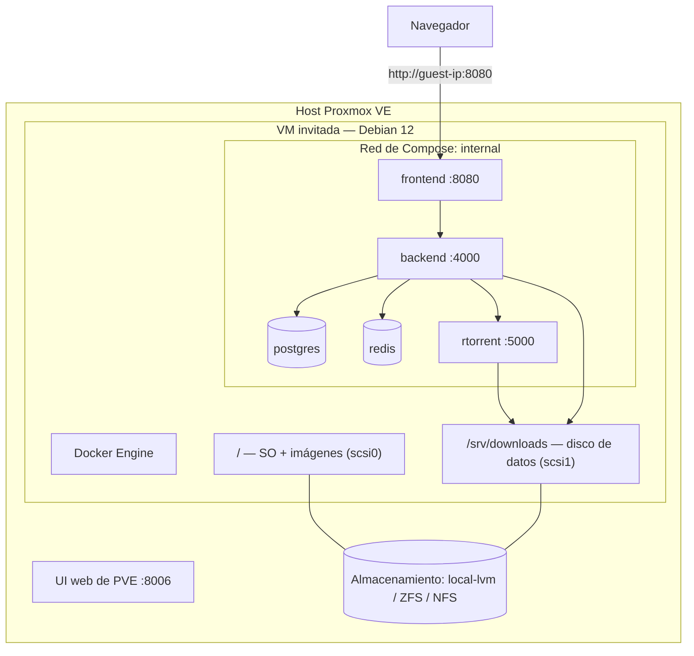

import Tabs from '@theme/Tabs';
import TabItem from '@theme/TabItem';

# Proxmox VE

## Resumen

**Proxmox por sí mismo no ejecuta UltraTorrent.** Proxmox es un hipervisor; creas un invitado, instalas Docker dentro de él y luego sigues la [guía de Docker Compose](/install/docker-compose) como si fuera cualquier [máquina Linux](/install/platforms/linux).

La única decisión real es **VM o LXC**:

| | **VM (QEMU/KVM)** — recomendado | **Container LXC** |
|---|---|---|
| Soporte de Docker | Normal, sin modificaciones, aburrido | Requiere nesting; históricamente quisquilloso |
| Aislamiento | Completo | Kernel compartido |
| Sobrecarga | ~1 GB de RAM para el SO invitado | Mínima |
| Snapshots / copias de seguridad | Excelentes (`vzdump`) | Excelentes |
| Riesgo de sorpresas | Bajo | Moderado |

**Escoge la VM.** La RAM que ahorras con LXC no vale la clase de bug que compras.

:::caution Verificado por la comunidad
Proxmox **no** es uno de los destinos de despliegue propios de este proyecto. Las partes de UltraTorrent de abajo están fundamentadas en el repositorio; las partes de Proxmox siguen la práctica estándar de PVE. Verifica contra tu versión de PVE.
:::

:::tip Mira este tutorial
_Video próximamente._
:::

## Requisitos previos

- Proxmox VE 7 u 8, con un almacén de ISOs o de plantillas.
- Una ISO de Debian 12 / Ubuntu 22.04+ (o la imagen cloud), o una plantilla LXC de Debian.
- Suficiente RAM libre para darle al invitado al menos 4 GB.

## Requisitos

Dimensiona el **invitado**, no el host:

| Recurso | Mínimo | Cómodo |
|----------|---------|-------------|
| vCPU | 2 | 4 |
| RAM | **4 GB** (2 GB de ellos libres para la compilación) | 6–8 GB |
| Disco (SO + imágenes) | 20 GB | 32 GB |
| Disco (descargas) | un segundo disco virtual grande — o un montaje por passthrough/NFS | — |

:::warning No pongas las descargas en el disco del SO
Un disco raíz que se llena tumba todo el stack y puede corromper la base de datos. Dale a las descargas su propio disco virtual, o monta almacenamiento desde otro lugar.
:::

## Puertos

Nada específico de Proxmox. El invitado publica el **8080**; la interfaz web de Proxmox está en el **8006** — no hay conflicto. Accede en `http://<guest-ip>:8080`.

## Volúmenes



Dentro del invitado, enlaza el volumen de descargas al disco de datos:

```yaml
# docker-compose.override.yml
volumes:
  downloads:
    driver: local
    driver_opts:
      type: none
      o: bind
      device: /srv/downloads
```

## Permisos

Dentro del invitado aplican las reglas normales de Linux — la carpeta de descargas tiene que ser escribible por el **uid 1000** (o por el `PUID`/`PGID` que hayas fijado). Ver [Permisos](/install/docker-compose#permissions).

Si las descargas viven en un **share NFS** de un NAS, recuerda que NFS mapea los UIDs numéricamente: el uid 1000 del invitado tiene que poder escribir en el NAS. Haz que los UIDs coincidan, o exporta con los `anonuid`/`anongid` correctos.

## Paso a paso

<Tabs groupId="pve-guest">
<TabItem value="vm" label="VM (recomendado)" default>

### 1. Crea la VM

**Create VM**, con:

| Pestaña | Configuración |
|-----|---------|
| OS | ISO de Debian 12 (o Ubuntu 22.04+) |
| System | Máquina `q35`, BIOS `OVMF (UEFI)` o SeaBIOS — cualquiera sirve; **QEMU Guest Agent: activado** |
| Disks | `scsi0` de **32 GB** (SO + imágenes de Docker), controladora **VirtIO SCSI single**, **Discard** activado para almacenamiento thin |
| CPU | **4 núcleos**, tipo `host` (mejor rendimiento) |
| Memory | **4096 MB** como mínimo. Apaga el **ballooning** si quieres que la compilación tenga RAM predecible |
| Network | `virtio`, en el bridge de tu LAN |

Agrega un **segundo disco** para las descargas — `scsi1`, tan grande como lo necesite tu biblioteca.

### 2. Instala Debian, luego Docker

Instala el SO como de costumbre y luego, dentro del invitado:

```bash
curl -fsSL https://get.docker.com | sudo sh
sudo usermod -aG docker "$USER"     # cierra sesión y vuelve a entrar
sudo apt install -y qemu-guest-agent && sudo systemctl enable --now qemu-guest-agent
```

### 3. Monta el disco de datos

```bash
sudo mkfs.ext4 /dev/sdb
sudo mkdir -p /srv/downloads
echo '/dev/sdb /srv/downloads ext4 defaults 0 2' | sudo tee -a /etc/fstab
sudo mount -a
sudo chown -R 1000:1000 /srv/downloads
```

(Confirma primero el nombre del dispositivo con `lsblk` — `/dev/sdb` es una suposición, no una promesa.)

### 4. Instala UltraTorrent

Sigue **[Linux](/install/platforms/linux)** / **[Docker Compose](/install/docker-compose)** al pie de la letra. Ya nada de aquí en adelante es específico de Proxmox:

```bash
git clone https://github.com/damirabal/ultratorrent-core.git
cd ultratorrent-core
cp .env.example .env
for k in JWT_ACCESS_SECRET JWT_REFRESH_SECRET ENCRYPTION_KEY; do
  sed -i "s|^$k=.*|$k=$(openssl rand -base64 48 | tr -d '\n')|" .env
done
nano .env                    # POSTGRES_PASSWORD (alfanumérica), ADMIN_PASSWORD
nano docker-compose.override.yml   # enlaza las descargas a /srv/downloads

docker compose --profile rtorrent up -d --build
docker compose exec backend npx prisma db seed
```

</TabItem>
<TabItem value="lxc" label="LXC (avanzado)">

Docker dentro de LXC funciona, pero es una configuración que te tienes que ganar.

### 1. Crea un container privilegiado

**Create CT**, plantilla de Debian 12 y — esto es crítico — **desmarca "Unprivileged container"**.

| Configuración | Valor |
|---------|-------|
| Cores | 4 |
| Memory | 4096 MB |
| Swap | 2048 MB |
| Root disk | 32 GB |
| Features | **Nesting: ✅**, **keyctl: ✅**, **FUSE: ✅** |

### 2. Habilita las features en la configuración del CT

Si la interfaz no las expone, edita `/etc/pve/lxc/<CTID>.conf` en el **host**:

```ini
features: nesting=1,keyctl=1,fuse=1
```

Luego reinicia el container.

### 3. Instala Docker dentro del CT

```bash
curl -fsSL https://get.docker.com | sh
```

### 4. Dale almacenamiento

Haz un bind mount de un directorio del host dentro del CT (en el **host Proxmox**):

```bash
pct set <CTID> -mp0 /tank/downloads,mp=/srv/downloads
```

### 5. Instala UltraTorrent

Exactamente igual que en la pestaña de la VM.

:::danger LXC no privilegiado + Docker + permisos de volúmenes
Los containers no privilegiados desplazan los UIDs (uid 1000 del invitado → uid 101000+ del host), lo que convierte cada pregunta de permisos de un bind mount en un rompecabezas, y Docker dentro de un LXC no privilegiado tiene un largo historial de problemas con el driver de almacenamiento. Si insistes en LXC, usa uno **privilegiado**. Si algo de esto suena poco atractivo: **usa la VM**.
:::

:::caution Verificado por la comunidad
Docker dentro de LXC es un patrón bien conocido de la comunidad de Proxmox, no uno bendecido oficialmente, y este proyecto **no** lo prueba. Trátalo como algo avanzado.
:::

</TabItem>
</Tabs>

### Por último

Abre `http://<guest-ip>:8080`, inicia sesión como **`admin`** y agrega el motor: **Infraestructura → Motores → Agregar motor** → rTorrent · SCGI sobre TCP · host `rtorrent` · puerto `5000` → **Probar conexión** → **Agregar motor**. Luego **Configuración → Ruta raíz predeterminada** → `/downloads`.

## Verificación

Dentro del invitado:

```bash
docker compose ps
curl -s http://localhost:8080/api/system/live
df -h /srv/downloads          # el disco de datos, no el disco raíz
```

```text
NAME                       STATUS                    PORTS
ultratorrent-backend-1     Up 2 minutes (healthy)    4000/tcp
ultratorrent-frontend-1    Up 2 minutes (healthy)    0.0.0.0:8080->8080/tcp
ultratorrent-postgres-1    Up 2 minutes (healthy)    5432/tcp
ultratorrent-redis-1       Up 2 minutes (healthy)    6379/tcp
ultratorrent-rtorrent-1    Up 2 minutes (healthy)    5000/tcp
```

Desde la interfaz de Proxmox, el invitado debe mostrar un QEMU Guest Agent saludable (en el caso de la VM) y un uso de memoria estable.


:::note Falta captura de pantalla
Proxmox VE **invitado → Summary**, mostrando la VM de UltraTorrent en ejecución con sus gráficas de CPU/RAM/disco.
:::

## Proxy inverso

Dos patrones limpios:

1. **Proxy dentro del mismo invitado** — NGINX o Caddy junto a Docker. Simple.
2. **Un invitado dedicado al proxy** (una VM o LXC pequeña con Caddy/Traefik/NPM) al frente de varios servicios del homelab, apuntando a `http://<ut-guest-ip>:8080`. Esta es la forma usual en un homelab.

En cualquiera de los dos casos, las cabeceras de upgrade de WebSocket son obligatorias: [Proxy inverso](/install/reverse-proxy).

## HTTPS

Let's Encrypt estándar en el proxy. Para un homelab que solo vive en la LAN, **DNS-01** te consigue un certificado real sin puertos de entrada — ver [TLS](/install/tls).

## Actualizaciones

Dentro del invitado, el flujo normal:

```bash
cd ultratorrent-core
docker compose exec -T postgres pg_dump -U ultratorrent ultratorrent > backup-$(date +%F).sql
git pull
docker compose --profile rtorrent up -d --build
docker compose exec backend npx prisma db seed
```

**Proxmox te da una segunda red de seguridad: tómale un snapshot al invitado primero.** Haz clic derecho sobre el invitado → **Snapshot → Take Snapshot**. Si la actualización sale mal, revierte el *invitado completo* — lo que esquiva por completo el problema de las migraciones que solo van hacia adelante.

Esa es una historia de reversión genuinamente más agradable que la de bare metal. Aun así, no te excusa de saltarte el `pg_dump`. Ver [Actualizar](/install/upgrading).

## Copias de seguridad

El **`vzdump`** de Proxmox respalda el invitado entero — SO, volúmenes de Docker, base de datos y todo — de forma programada, hacia un almacén de copias de seguridad.

**Datacenter → Backup → Add**, apuntando a tu invitado, cada noche.

:::warning Un vzdump de un invitado en ejecución es consistente ante caídas (crash-consistent)
Las copias de seguridad en modo snapshot no ponen a PostgreSQL en reposo. *Normalmente* restauran bien (Postgres es seguro ante caídas), pero un `pg_dump` es una copia de seguridad lógica y limpia que puedes restaurar selectivamente. **Haz las dos.**
:::

```bash
docker compose exec -T postgres pg_dump -U ultratorrent ultratorrent > /srv/backups/ut-$(date +%F).sql
```

Ver [Copias de seguridad y restauración](/operate/backup).

## Resolución de problemas

| Síntoma | Causa | Solución |
|---------|-------|-----|
| Docker no arranca en un LXC | Nesting/keyctl no habilitados, o el container es no privilegiado | Fija `features: nesting=1,keyctl=1,fuse=1` y usa un CT **privilegiado** — o múdate a una VM |
| Los permisos de los bind mounts en un LXC no tienen sentido | Desplazamiento de UID en containers no privilegiados (invitado 1000 → host 101000) | Usa un CT privilegiado, o una VM |
| La compilación muere por falta de memoria (OOM) | El invitado tiene muy poca RAM, o el ballooning se la quitó | 4 GB, con el ballooning apagado durante la compilación |
| El disco raíz del invitado se llena | Descargas (o imágenes viejas de Docker) en el disco del SO | Pon las descargas en un segundo disco; `docker image prune -f` |
| Rendimiento de disco pobre | Controladora IDE/SATA en vez de VirtIO | Usa **VirtIO SCSI single** y habilita Discard en almacenamiento thin |
| No se puede escribir en las descargas por NFS | Desajuste de UID entre el invitado y el NAS | Haz que coincida el uid 1000, o exporta con los `anonuid`/`anongid` correctos |
| El reloj de la VM se desfasa, errores de TLS/tracker | Sin guest agent / sin NTP | Instala `qemu-guest-agent`; habilita la sincronización de hora |
| El invitado no vuelve tras reiniciar el host | No está fijado el arranque automático | Habilita **Start at boot** en el invitado |
| rTorrent se reinicia periódicamente | La conocida caída de rTorrent 0.9.8 upstream | No se pierde nada. Reduce los torrents activos, o usa el perfil de qBittorrent |

Más: [Resolución de problemas](/operate/troubleshooting).

## Mejores prácticas

- **Usa una VM.** LXC ahorra ~1 GB de RAM y te cuesta toda una categoría de bugs.
- **Tómale un snapshot al invitado antes de cada actualización de UltraTorrent** — la mejor reversión disponible en cualquier plataforma.
- **Aun así, haz el `pg_dump`.** Consistente ante caídas no es lo mismo que limpio.
- **Descargas en su propio disco**, nunca en el disco del SO.
- **VirtIO en todos lados** — controladora SCSI single, red virtio.
- **`vzdump` programado**, hacia un almacenamiento que no sea el host que estás respaldando.
- **Habilita Start at boot** en el invitado.
- **Tipo de CPU `host`** a menos que necesites migración en vivo entre hardware distinto.
- Dale al invitado **4 GB**; la compilación es el pico, no el estado estable.

## Preguntas frecuentes

**¿Puedo correr Docker directamente en el host Proxmox?**
Puedes. No lo hagas. El hipervisor debe hospedar invitados, no aplicaciones — vas a pelear con `apt` y con el kernel de PVE para siempre, y una configuración de red de Docker mal hecha puede tumbar tu interfaz de administración.

**¿VM o LXC, en serio?**
VM. Ver la tabla al principio.

**¿Cuánta RAM necesita el invitado?**
4 GB con comodidad. La compilación quiere ~2 GB libres; el estado estable es mucho más liviano.

**¿Puedo hacer passthrough de un disco completo para las descargas?**
Sí — `qm set <VMID> -scsi1 /dev/disk/by-id/...`. Es común para un disco mecánico grande.

**¿Puedo usar un share de un NAS para las descargas?**
Sí, por NFS o SMB montado dentro del invitado. Cuidado con el mapeo de UIDs.

**¿Un snapshot de Proxmox reemplaza las copias de seguridad de la base de datos?**
No. Es consistente ante caídas, del invitado completo y poco granular. Mantén el `pg_dump`.

## Lista de verificación

- [ ] Invitado creado (preferiblemente una **VM**) con 4 vCPU / 4 GB de RAM / 32 GB de disco de SO
- [ ] Disco de datos separado (o montaje NFS) para las descargas, montado y con el dueño correcto
- [ ] Docker Engine + Compose v2 instalados **dentro del invitado**
- [ ] `qemu-guest-agent` en ejecución (VM)
- [ ] Solo para LXC: privilegiado, con `nesting=1,keyctl=1,fuse=1`
- [ ] UltraTorrent instalado según la [guía de Compose](/install/docker-compose)
- [ ] Descargas enlazadas al disco de datos, no al disco del SO
- [ ] Base de datos sembrada; sesión iniciada; motor conectado
- [ ] **Start at boot** habilitado en el invitado
- [ ] `vzdump` programado
- [ ] `pg_dump` programado *también*
- [ ] Un snapshot tomado antes de la primera actualización

## Ver también

- [Linux](/install/platforms/linux) — lo que realmente haces dentro del invitado
- [Instalación con Docker Compose](/install/docker-compose) — la guía autoritativa
- [TrueNAS SCALE](/install/platforms/truenas) — la otra respuesta del tipo "ejecútalo en una VM"
- [Proxy inverso](/install/reverse-proxy) · [TLS](/install/tls) · [Actualizar](/install/upgrading)
- [Copias de seguridad y restauración](/operate/backup) · [Rendimiento](/operate/performance)
