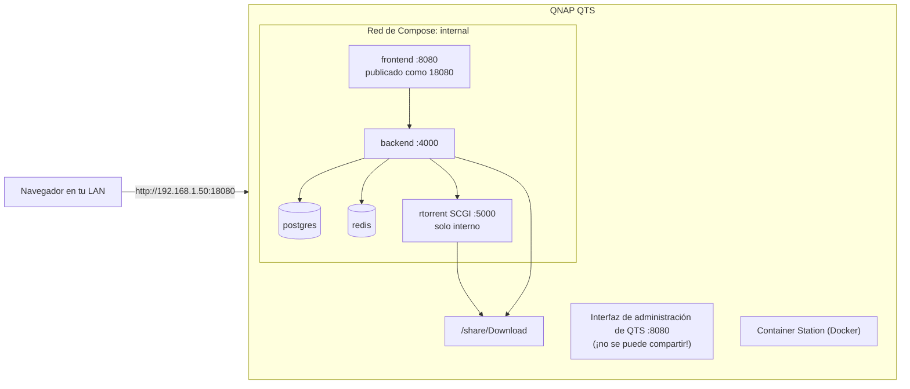

import Tabs from '@theme/Tabs';
import TabItem from '@theme/TabItem';

# NAS QNAP

## Resumen

QNAP es un objetivo **bien fundamentado**: UltraTorrent está desplegado en él y las peculiaridades de abajo son reales — el proyecto se topó con ellas.

Un QNAP es un host Docker con tres filos bien cortantes:

1. **La propia interfaz web de administración de QNAP ya es dueña del puerto 8080.** *Tienes* que reasignar el de UltraTorrent.
2. **El binario `docker` no está en tu `PATH` de forma predeterminada** después de entrar por SSH. Este es el detalle más confuso de QNAP.
3. Las versiones más viejas de Container Station traen el **`docker-compose`** legado (con guion) en vez de `docker compose` (con espacio).

Todo lo demás es la [guía de Docker Compose](/install/docker-compose), al pie de la letra.

:::tip Mira este tutorial
_Video próximamente._
:::

## Requisitos previos

- Un NAS QNAP compatible con Container Station (la mayoría de los modelos de los últimos años).
- Una cuenta de **administrador**.
- **Container Station** instalado — App Center → buscar → Install. *Esto es lo que provee Docker.*
- La dirección IP del NAS, p. ej. `192.168.1.50`.
- Unos 2 GB de RAM libre y de 10 a 15 minutos.

## Requisitos

| | Mínimo | Cómodo |
|---|---------|-------------|
| CPU | x86-64 o ARM64, 2 núcleos | 4 núcleos |
| RAM | **2 GB libres durante la compilación** | 4 GB o más |
| Disco | ~3 GB para las imágenes + tus descargas | — |

:::warning Modelos QNAP con ARM
Los QNAP basados en ARM compilan bien (las imágenes base son multiarquitectura) pero lento, y los modelos con poca RAM van a sufrir con la compilación. Si la compilación se muere, eso es memoria, no arquitectura.
:::

## Puertos

| Puerto | Dueño | Notas |
|------|-------|-------|
| **8080** | **La propia interfaz web de administración de QNAP** | Conflicto duro. Reasigna UltraTorrent |
| 18080 | La interfaz de UltraTorrent | Puerto libre sugerido |
| 9696 | Prowlarr, si habilitas ese perfil | Cámbialo con `PROWLARR_PORT` si está ocupado |

```dotenv
# .env
FRONTEND_PORT=18080
```

Luego abre `http://<NAS-IP>:18080`.

:::caution No reasignes puertos con un archivo override
Compose **añade** las entradas de `ports:`, así que un override agrega una segunda asignación mientras la original del 8080 sobrevive y sigue chocando con QTS. Cambia `FRONTEND_PORT` en `.env`.
:::

## Volúmenes

Las carpetas compartidas de QNAP viven bajo `/share/`. Container Station crea una carpeta compartida `Container`:

| Ruta | Uso |
|------|-----|
| `/share/Container` | Donde va el árbol de código fuente |
| `/share/Download` | La carpeta compartida de descargas que trae QNAP de fábrica — buen destino para tus medios |

```yaml
# docker-compose.override.yml
volumes:
  downloads:
    driver: local
    driver_opts:
      type: none
      o: bind
      device: /share/Download
```

:::info La ruta de tu carpeta compartida puede ser distinta
Algunos modelos de QNAP exponen las carpetas compartidas como `/share/CACHEDEV1_DATA/<Share>` y dejan `/share/<Share>` como un enlace simbólico. Si un bind mount se porta mal, usa la ruta completa con `CACHEDEV`. Revísalo con `ls -l /share/`.
:::

## Permisos

Los archivos descargados pertenecen al **uid 1000** de forma predeterminada — el usuario interno de la app. Todo dentro de UltraTorrent funciona así.

Para manejar además esos archivos desde tu cuenta de QNAP por SMB, ajusta los permisos de la carpeta compartida para permitir tu usuario del NAS. Si la carpeta le pertenece a **otra app**, pon `PUID`/`PGID` con el usuario de esa app en vez de hacerle chown — ve [Permisos](/install/docker-compose#permissions).

## Red



## Paso a paso

### 1. Instala Container Station

**App Center** → busca **Container Station** → **Install**. Esto es lo que le da Docker al NAS.


:::note Falta captura de pantalla
El App Center de QNAP mostrando **Container Station** con su botón Install / Open.
:::

### 2. Habilita SSH

**Control Panel → Telnet / SSH** → marca **Allow SSH connection** → **Apply**.

:::caution Vuelve a apagar SSH cuando termines
Lo necesitas para la compilación y para el seed que se corre una sola vez. Deshabilítalo otra vez una vez que UltraTorrent esté corriendo.
:::

### 3. Conéctate

<Tabs groupId="os">
<TabItem value="win" label="Windows" default>

```powershell
ssh admin@192.168.1.50
```

</TabItem>
<TabItem value="mac" label="macOS / Linux">

```bash
ssh admin@192.168.1.50
```

</TabItem>
</Tabs>

La contraseña se queda invisible mientras la escribes — eso es normal. La primera conexión te pregunta *"are you sure you want to continue"* → escribe `yes`.

### 4. Encuentra `docker` — el detalle de QNAP {#docker-not-on-path}

Pruébalo:

```bash
docker --version
```

Si eso dice **`command not found`** — que es el estado normal en QNAP — los binarios de Docker de Container Station están instalados pero no en el `PATH` de tu sesión. Localízalos y añádelos:

```bash
# Encuentra dónde los puso Container Station (la ruta contiene el directorio de instalación de la app):
ls -d /share/*/.qpkg/container-station/usr/bin 2>/dev/null

# Añádelo al PATH para esta sesión:
export PATH="$(ls -d /share/*/.qpkg/container-station/usr/bin | head -1):$PATH"

docker --version          # ahora debería imprimir una versión
docker compose version    # v2.x, si tu Container Station es lo bastante reciente
```

:::caution Esta ruta depende de la versión
La ubicación exacta de los binarios de Container Station ha cambiado entre versiones de QTS. El glob de `ls -d` de arriba la encuentra en las versiones actuales; en las más viejas búscala bajo `/share/CACHEDEV1_DATA/.qpkg/container-station/`. Si ninguna de las dos da con ella, `find / -name docker -type f 2>/dev/null | head` sí.
:::

Para que se quede fija entre sesiones, añade la línea `export PATH=...` a `~/.profile`.

### 5. `docker compose` vs. `docker-compose`

Los Container Station nuevos traen **Compose v2** (`docker compose`, con espacio). Los viejos traen solo el **`docker-compose`** legado (con guion).

```bash
docker compose version      # prueba esto primero
docker-compose version      # recurre a esto si falla
```

**Usa el que te funcione** para todos los comandos de abajo. Aquí aceptan los mismos flags.

### 6. Consigue el código fuente

```bash
cd /share/Container
git clone https://github.com/damirabal/ultratorrent-core.git
cd ultratorrent-core
```

**¿No hay `git`?** En tu propia computadora, abre la página del proyecto en GitHub → **Code → Download ZIP** → descomprime → copia la carpeta `ultratorrent-core` a la carpeta compartida `Container` usando **File Station** o por SMB. Luego `cd /share/Container/ultratorrent-core`.

### 7. Configura `.env`

```bash
cp .env.example .env

# Rellena automáticamente las tres claves aleatorias largas (pega este bloque completo tal cual):
for k in JWT_ACCESS_SECRET JWT_REFRESH_SECRET ENCRYPTION_KEY; do
  sed -i "s|^$k=.*|$k=$(openssl rand -base64 48 | tr -d '\n')|" .env
done

nano .env
```

Ajusta:

```dotenv
POSTGRES_PASSWORD=lettersAndNumbers123    # SOLO letras + números, sin símbolos
ADMIN_PASSWORD=the-password-you-log-in-with
FRONTEND_PORT=18080                       # el 8080 le pertenece a QTS
```

Guarda y sal de `nano`: **Ctrl+O**, **Enter**, **Ctrl+X**.

### 8. Envía las descargas a una carpeta compartida

```bash
nano docker-compose.override.yml
```

```yaml
volumes:
  downloads:
    driver: local
    driver_opts:
      type: none
      o: bind
      device: /share/Download        # tiene que existir ya
```

### 9. Compila y arranca

```bash
docker compose --profile rtorrent up -d --build
# Container Station más viejo:
# docker-compose --profile rtorrent up -d --build
```

**La primera compilación tarda varios minutos.** Deja que termine.

### 10. Siembra la base de datos — una sola vez

```bash
docker compose exec backend npx prisma db seed
```

### 11. Inicia sesión y agrega el motor

Abre `http://<NAS-IP>:18080`.

- Usuario: **`admin`** (un nombre de usuario, *no* un correo electrónico)
- Contraseña: tu `ADMIN_PASSWORD`

**Infraestructura → Motores → Agregar motor**:

| Campo | Valor |
|-------|-------|
| Cliente | rTorrent |
| Conexión | SCGI sobre TCP |
| Host | `rtorrent` |
| Puerto | `5000` |
| Motor predeterminado | Activado |

**Probar conexión** → *Conectado* → **Agregar motor**.

Luego **Configuración → Ruta raíz predeterminada** → `/downloads`.

## La ruta gráfica

Puedes pegar el contenido de `docker-compose.yml` en **Container Station → Applications → Create**.

:::caution La ruta por SSH es más confiable para la primera instalación
La interfaz gráfica batalla con el `--build` inicial y no puede correr el seed con facilidad. Usa SSH para la instalación, y luego Container Station para el arranque/parada/logs del día a día.
:::


:::note Falta captura de pantalla
Container Station → **Applications**, mostrando la aplicación `ultratorrent-core` con sus containers corriendo.
:::

## Verificación

```bash
docker compose ps
curl -s http://localhost:18080/api/system/live
curl -s http://localhost:18080/api/system/version
```

```text
NAME                       STATUS                    PORTS
ultratorrent-backend-1     Up 3 minutes (healthy)    4000/tcp
ultratorrent-frontend-1    Up 3 minutes (healthy)    0.0.0.0:18080->8080/tcp
ultratorrent-postgres-1    Up 3 minutes (healthy)    5432/tcp
ultratorrent-redis-1       Up 3 minutes (healthy)    6379/tcp
ultratorrent-rtorrent-1    Up 3 minutes (healthy)    5000/tcp
```

Una descarga terminada debe aparecer en `/share/Download` y verse en File Station.

## Proxy inverso

QNAP no trae un proxy inverso de propósito general que sea agradable de usar para esto. Dos opciones viables:

1. **El perfil de Caddy incluido** — `docker compose --profile proxy up -d`, con tu dominio en `deploy/Caddyfile`. Requiere que los puertos 80/443 estén libres en el NAS, cosa que en QTS muchas veces **no** lo están.
2. **Un proxy inverso en otro lugar de tu LAN** (una máquina Linux, un router, Nginx Proxy Manager) apuntando a `http://<NAS-IP>:18080`.

De cualquiera de las dos formas, los encabezados de upgrade de WebSocket son obligatorios. Ve [Proxy inverso](/install/reverse-proxy).

:::caution Verificado por la comunidad
Las funciones propias de QTS de "Web Server" / hosts virtuales no son una forma soportada de poner UltraTorrent detrás de un proxy, y este proyecto no las prueba. Usa una de las dos opciones de arriba.
:::

## HTTPS

Lo más sencillo: pon el terminador de TLS en otra máquina, o usa el perfil de Caddy incluido si los puertos 80/443 de verdad están libres. Ve [TLS](/install/tls).

## Actualizaciones

Por SSH (acuérdate del export del `PATH` si no lo dejaste fijo):

```bash
cd /share/Container/ultratorrent-core
docker compose exec -T postgres pg_dump -U ultratorrent ultratorrent > backup-$(date +%F).sql
git pull
docker compose --profile rtorrent up -d --build
docker compose exec backend npx prisma db seed
```

¿Lo desplegaste con Container Station? Actualiza primero la carpeta del código fuente, luego usa la acción **Rebuild** de la aplicación, y corre el seed por SSH.

Procedimiento completo y reversión: [Actualizar](/install/upgrading).

## Copias de seguridad

- **Base de datos:** `pg_dump` hacia una carpeta compartida que **Hybrid Backup Sync** ya cubra.
- **`.env`:** cópialo ahí también.
- **Descargas:** están en `/share/Download`, así que tus tareas de respaldo de QNAP ya las ven.

Ve [Copia de seguridad y restauración](/operate/backup).

## Solución de problemas

| Síntoma | Causa | Solución |
|---------|-------|-----|
| **`docker: command not found`** después del SSH | Los binarios de Container Station **no están en el `PATH`** — el detalle clásico de QNAP | `export PATH="$(ls -d /share/*/.qpkg/container-station/usr/bin \| head -1):$PATH"` — ve [más arriba](#docker-not-on-path) |
| `docker compose` → *command not found*, pero `docker` sí funciona | El Container Station más viejo solo trae el binario legado | Usa `docker-compose` (con guion) |
| La interfaz no carga / conflicto de puertos | **La propia interfaz de administración de QTS es dueña del 8080** | Pon `FRONTEND_PORT=18080` en `.env` y vuelve a correr `up -d`. **No** uses un override — Compose añade puertos |
| El bind mount falla: *"no such file or directory"* | La ruta de la carpeta compartida está mal | Prueba la ruta completa: `/share/CACHEDEV1_DATA/Download`. Revísalo con `ls -l /share/` |
| La compilación se muere a mitad de camino | Al NAS se le acabó la RAM | La compilación necesita ~2 GB libres. Detén otras apps, añade RAM, o compila en otro lado |
| No puedo llegar a la interfaz desde otro dispositivo | El firewall / la protección de acceso de QNAP | **Control Panel → Security** — permite el puerto en tu LAN |
| Las descargas tienen dueño root | El descenso de privilegios se quedó como root | Revisa `docker compose logs rtorrent \| head`. Asegúrate de que `cap_add: ["SETUID","SETGID"]` esté presente en el servicio `rtorrent` |
| rTorrent se reinicia cada cierto tiempo | El conocido crash de rTorrent 0.9.8 upstream — peor mientras más torrents activos haya | No se pierde nada (recarga su sesión). Reduce los torrents activos, o usa el perfil de qBittorrent |
| La importación en "Applications" de Container Station falla en el `--build` | La interfaz gráfica no es buena compilando desde el código fuente | Haz la primera compilación por SSH |

Más: [Solución de problemas](/operate/troubleshooting).

## Buenas prácticas

- **Deja fijo el arreglo del `PATH`** en `~/.profile` — vas a necesitar `docker` otra vez a la hora de actualizar.
- **Usa siempre `FRONTEND_PORT=18080`** (u otro puerto libre). El 8080 no es negociable en QTS.
- **Pon las descargas en `/share/Download`** para que File Station, SMB y Hybrid Backup Sync las vean todas.
- **Vuelve a apagar SSH** una vez instalado.
- **Deja que Hybrid Backup Sync cubra la salida del `pg_dump`** en vez de inventar un segundo sistema de respaldo.
- Haz la **primera compilación por SSH**, y luego maneja el día a día desde Container Station.
- Prefiere **qBittorrent** si piensas correr cientos de torrents.

## Preguntas frecuentes

**¿Por qué no puedo usar el puerto 8080 y ya?**
La propia interfaz web de administración de QTS está ahí. No hay forma de darle la vuelta más que mover UltraTorrent.

**¿Tengo que usar SSH?**
Para la primera instalación, en la práctica sí — el `--build` y el paso del seed los dos quieren un shell.

**¿Va a chocar con el Download Station de QNAP?**
En puertos no, pero no apuntes dos clientes de BitTorrent a la misma carpeta. Dale a UltraTorrent la suya.

**`docker` desaparece cada vez que inicio sesión — ¿algo anda mal?**
No. Los binarios de Container Station simplemente no están en el `PATH` predeterminado. Añade la línea `export PATH=...` a `~/.profile`.

**¿Funciona en los QNAP con ARM?**
Sí — las imágenes base son multiarquitectura. La compilación es más lenta y necesita los mismos ~2 GB de RAM.

## Lista de verificación

- [ ] Container Station instalado
- [ ] SSH habilitado temporalmente
- [ ] `docker --version` funciona (export del PATH aplicado, y fijado en `~/.profile`)
- [ ] Establecido si en este NAS es `docker compose` o `docker-compose`
- [ ] Código fuente en `/share/Container/ultratorrent-core`
- [ ] `.env`: `POSTGRES_PASSWORD` alfanumérica, `ADMIN_PASSWORD`, tres secretos distintos, **`FRONTEND_PORT=18080`**
- [ ] `/share/Download` enlazado vía `docker-compose.override.yml`
- [ ] Compilación terminada; seed corrido una sola vez
- [ ] Sesión iniciada en `http://<NAS-IP>:18080` como `admin`
- [ ] Motor agregado (`rtorrent` : `5000`), Probar conexión en verde
- [ ] Ruta raíz predeterminada puesta en `/downloads`
- [ ] Las descargas se ven en File Station
- [ ] SSH apagado otra vez
- [ ] Hybrid Backup Sync cubre la salida del `pg_dump` y el `.env`

## Ver también

- [Instalación con Docker Compose](/install/docker-compose) — la guía autoritativa
- [Synology](/install/platforms/synology) — el otro NAS bien fundamentado
- [Proxy inverso](/install/reverse-proxy) · [TLS](/install/tls) · [Actualizar](/install/upgrading)
- [Motores](/modules/engines) · [Solución de problemas](/operate/troubleshooting)
