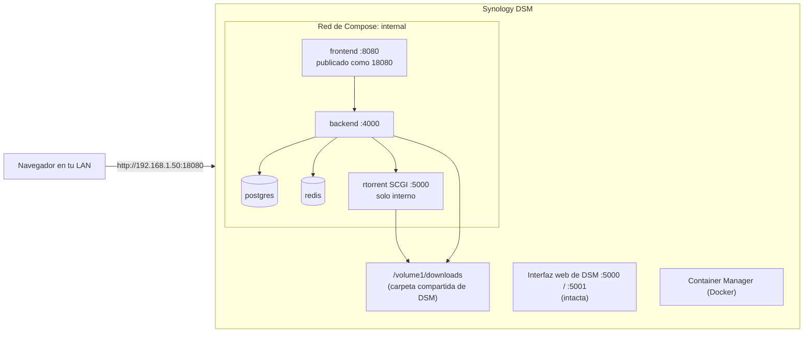

import Tabs from '@theme/Tabs';
import TabItem from '@theme/TabItem';

# NAS Synology

## Resumen

Synology es un objetivo **bien fundamentado**: UltraTorrent está desplegado en DSM, y las peculiaridades de abajo son reales — el proyecto se topó con ellas y las arregló.

Un Synology no es más que un host Docker con un shell inusual y una opinión bien firme sobre los puertos. Las diferencias son:

1. **SSH viene apagado de fábrica**, y necesitas `sudo -i` después de conectarte.
2. **El puerto 8080 puede chocar** con otras apps de DSM — reasígnalo.
3. **DSM le quita `SETUID`/`SETGID`** a los containers, lo que rompería el descenso de privilegios del rTorrent incluido. El archivo Compose ya los vuelve a añadir.
4. Tus carpetas compartidas viven bajo **`/volume1/…`**.

Todo lo demás es la [guía de Docker Compose](/install/docker-compose), al pie de la letra.

:::tip Mira este tutorial
_Video próximamente._
:::

## Requisitos previos

- Un NAS Synology compatible con Docker (la mayoría de los modelos de los últimos años).
- Una cuenta de **administrador** en DSM.
- **Container Manager** instalado (en DSM más viejos se llama "Docker") — Package Center → buscar → Install.
- La dirección IP del NAS, p. ej. `192.168.1.50`.
- Unos 2 GB de RAM libre y de 10 a 15 minutos.

## Requisitos

| | Mínimo | Cómodo |
|---|---------|-------------|
| CPU | x86-64 o ARM64, 2 núcleos | 4 núcleos |
| RAM | **2 GB libres durante la compilación** | 4 GB o más |
| Disco | ~3 GB para las imágenes + tus descargas | — |

:::warning Modelos con poca RAM
Los Synology de entrada vienen con 1–2 GB de RAM, y DSM se come una buena parte. La compilación de la imagen es el pico de memoria — si el OOM killer la mata, añade un módulo de RAM (muchos modelos son ampliables) o compila las imágenes en otra computadora.
:::

## Puertos

| Puerto | Dueño | Notas |
|------|-------|-------|
| 5000 / 5001 | **el propio DSM** | Intactos — UltraTorrent nunca los publica |
| 8080 | Muchas veces lo toma otro paquete de DSM | **Reasígnalo**: pon `FRONTEND_PORT=18080` |
| 18080 | La interfaz de UltraTorrent | Puerto libre sugerido |

```dotenv
# .env
FRONTEND_PORT=18080
```

Luego abre `http://<NAS-IP>:18080`.

:::caution No reasignes puertos con un archivo override
Compose **añade** las entradas de `ports:`, así que un override agrega una segunda asignación mientras la original sigue chocando. Cambia `FRONTEND_PORT` en `.env`.
:::

## Volúmenes

Las carpetas compartidas de DSM viven bajo `/volume1/`. Dos rutas importan:

| Ruta | Uso |
|------|-----|
| `/volume1/docker` | Donde va el árbol de código fuente (Container Manager crea esta carpeta compartida) |
| `/volume1/downloads` | Donde quieres que caigan las descargas de verdad (crea primero la carpeta compartida en File Station) |

Enlaza el volumen de descargas a una carpeta compartida real:

```yaml
# docker-compose.override.yml
volumes:
  downloads:
    driver: local
    driver_opts:
      type: none
      o: bind
      device: /volume1/downloads
```

## Permisos

Los archivos descargados pertenecen al usuario interno de la app, **uid 1000**, de forma predeterminada. Eso está bien — todo *dentro* de UltraTorrent funciona.

Si además quieres manejar esos archivos desde tu cuenta de DSM por SMB, ajusta los permisos de la carpeta compartida para permitir tu usuario de DSM. Si la carpeta le pertenece a **otra app** (Plex, por ejemplo), no le hagas chown — pon `PUID`/`PGID` con el usuario de esa app para que el motor escriba como ella. Ve [Permisos](/install/docker-compose#permissions).

:::info El detalle de las capacidades en DSM — ya está resuelto
El entrypoint del rTorrent incluido arranca como root, le hace chown al volumen de descargas y luego baja a `PUID:PGID` con `gosu`. **DSM le quita `SETUID` y `SETGID`** al conjunto de capacidades predeterminado de un container, lo que hace que ese descenso falle con *"operation not permitted"* — y el entrypoint entonces se quedaría corriendo como **root**, dejando descargas con dueño root.

`docker-compose.yml` ya declara `cap_add: ["SETUID", "SETGID"]` en el servicio de rTorrent, restaurando el valor predeterminado de Docker y dejando que el descenso de privilegios funcione. No tienes que hacer nada — pero si ves `cannot switch to 1000:1000 (CAP_SETUID/CAP_SETGID unavailable) — running as root` en los logs de rTorrent, eso fue lo que pasó, y significa que esas líneas de `cap_add` se perdieron de tu archivo Compose.
:::

## Red



Fíjate que el puerto SCGI de rTorrent *también* es el 5000 — pero vive **dentro de la red de Docker** y nunca se publica, así que no puede chocar con el puerto 5000 propio de DSM.

## Paso a paso

### 1. Instala Container Manager

**Package Center** → busca **Container Manager** → **Install**. (En DSM más viejos se llama **Docker**.)


:::note Falta captura de pantalla
El Package Center de Synology mostrando **Container Manager**, con su botón **Install**/**Open**.
:::

### 2. Habilita SSH

**Control Panel → Terminal & SNMP → Enable SSH service → Apply.**

:::caution Vuelve a apagar SSH cuando termines
Lo necesitas para la compilación y para el seed que se corre una sola vez. Una vez que UltraTorrent esté corriendo, deshabilitar SSH otra vez es buena higiene.
:::

### 3. Conéctate y conviértete en root

<Tabs groupId="os">
<TabItem value="win" label="Windows" default>

Abre **Windows Terminal** o **PowerShell** (los dos vienen incluidos):

```powershell
ssh admin@192.168.1.50
```

</TabItem>
<TabItem value="mac" label="macOS / Linux">

```bash
ssh admin@192.168.1.50
```

</TabItem>
</Tabs>

Escribe la contraseña de administrador de DSM — se queda invisible mientras la escribes, y eso es normal. La primera conexión te pregunta *"are you sure you want to continue"* → escribe `yes`.

Luego, **en Synology específicamente**, conviértete en root:

```bash
sudo -i
```

Escribe la contraseña otra vez. Tu prompt ahora termina en `#`. **Todo lo de abajo asume que hiciste esto** — el socket de Docker en DSM es solo para root.

### 4. Consigue el código fuente

```bash
cd /volume1/docker
git clone https://github.com/damirabal/ultratorrent-core.git
cd ultratorrent-core
```

**¿No hay `git` en tu DSM?** En tu propia computadora, abre la página del proyecto en GitHub → **Code → Download ZIP** → descomprime → copia la carpeta `ultratorrent-core` a la carpeta compartida `docker` con **File Station** o por SMB. Luego `cd /volume1/docker/ultratorrent-core`.

### 5. Configura `.env`

```bash
cp .env.example .env

# Rellena automáticamente las tres claves aleatorias largas (pega este bloque completo tal cual):
for k in JWT_ACCESS_SECRET JWT_REFRESH_SECRET ENCRYPTION_KEY; do
  sed -i "s|^$k=.*|$k=$(openssl rand -base64 48 | tr -d '\n')|" .env
done

nano .env
```

Ajusta estas tres líneas:

```dotenv
POSTGRES_PASSWORD=lettersAndNumbers123    # SOLO letras + números, sin símbolos
ADMIN_PASSWORD=the-password-you-log-in-with
FRONTEND_PORT=18080
```

Guarda y sal de `nano`: **Ctrl+O**, **Enter**, y luego **Ctrl+X**.

`POSTGRES_PASSWORD` es la contraseña privada de la base de datos (rara vez la volverás a ver). `ADMIN_PASSWORD` es la que **tú** escribes para iniciar sesión — elige una buena y recuérdala.

### 6. Envía las descargas a una carpeta compartida de DSM

Crea primero la carpeta compartida en **File Station** (p. ej. una carpeta compartida `downloads` → `/volume1/downloads`). Luego:

```bash
nano docker-compose.override.yml
```

```yaml
volumes:
  downloads:
    driver: local
    driver_opts:
      type: none
      o: bind
      device: /volume1/downloads
```

Guarda y sal. **La carpeta tiene que existir ya** o el bind mount falla.

### 7. Compila y arranca

```bash
docker compose --profile rtorrent up -d --build
```

**La primera compilación tarda varios minutos.** Deja que termine.

### 8. Siembra la base de datos — una sola vez

```bash
docker compose exec backend npx prisma db seed
```

### 9. Inicia sesión y agrega el motor

Abre `http://<NAS-IP>:18080`.

- Usuario: **`admin`** (un nombre de usuario, *no* un correo electrónico)
- Contraseña: tu `ADMIN_PASSWORD`

Luego ve a **Infraestructura → Motores → Agregar motor**:

| Campo | Valor |
|-------|-------|
| Cliente | rTorrent |
| Conexión | SCGI sobre TCP |
| Host | `rtorrent` |
| Puerto | `5000` |
| Motor predeterminado | Activado |

**Probar conexión** → *Conectado* → **Agregar motor**. La página de **Descargas** ya cargará.

Por último, **Configuración → Ruta raíz predeterminada** → `/downloads`.

## La ruta gráfica (Container Manager Project)

¿Prefieres hacer clic en vez de escribir? **Container Manager → Project → Create** → apúntalo a la carpeta `ultratorrent-core`; él lee el `docker-compose.yml` por ti.

Todavía necesitas el seed que se corre una sola vez. O por SSH, o así: abre el container **backend** en Container Manager, ve a su pestaña **Terminal** y corre `npx prisma db seed` ahí.


:::note Falta captura de pantalla
Container Manager → **Project → Create**, con la ruta puesta en `/volume1/docker/ultratorrent-core` y el `docker-compose.yml` detectado.
:::

:::caution La ruta por SSH es más confiable para la primera instalación
El `--build` inicial y el paso del seed son los dos más fáciles por SSH. Usa la interfaz gráfica después, para el arranque/parada/logs del día a día.
:::

## Verificación

```bash
docker compose ps
curl -s http://localhost:18080/api/system/live
curl -s http://localhost:18080/api/system/version
```

```text
NAME                       STATUS                    PORTS
ultratorrent-backend-1     Up 3 minutes (healthy)    4000/tcp
ultratorrent-frontend-1    Up 3 minutes (healthy)    0.0.0.0:18080->8080/tcp
ultratorrent-postgres-1    Up 3 minutes (healthy)    5432/tcp
ultratorrent-redis-1       Up 3 minutes (healthy)    6379/tcp
ultratorrent-rtorrent-1    Up 3 minutes (healthy)    5000/tcp
```

Confirma que el descenso de privilegios funcionó (esta es la revisión específica de DSM):

```bash
docker compose logs rtorrent | head -20
```

**No** deberías ver `cannot switch to 1000:1000 … running as root`. Y una descarga terminada debe caer en `/volume1/downloads` con dueño `1000:1000` — no `root`:

```bash
ls -ln /volume1/downloads
```

## Proxy inverso

DSM trae **Application Portal → Reverse Proxy**, que puede poner a UltraTorrent detrás de un nombre de host y un certificado manejado por DSM.

**Crea una regla:**

| Campo | Valor |
|-------|-------|
| Protocolo / nombre de host / puerto de origen | HTTPS · `torrents.example.com` · 443 |
| Protocolo / nombre de host / puerto de destino | HTTP · `localhost` · `18080` |

**Y ahora — la parte que a todo el mundo se le olvida:** abre la pestaña **Custom Header** de la regla y haz clic en **Create → WebSocket**. DSM te inserta los encabezados `Upgrade` y `Connection`.

:::danger Sin el preset del encabezado WebSocket, la interfaz nunca se actualiza
Carga, inicia sesión, y luego las barras de progreso se quedan congeladas para siempre. Ve [Proxy inverso](/install/reverse-proxy).
:::


:::note Falta captura de pantalla
DSM **Control Panel → Login Portal → Advanced → Reverse Proxy**, la pestaña **Custom Header** de la regla, mostrando el preset **Create → WebSocket** aplicado.
:::

:::caution Verificado por la comunidad
El flujo del proxy inverso de DSM que se explica arriba es estándar en las versiones recientes de DSM, pero la ruta del menú se movió entre DSM 6 y DSM 7 (Application Portal → Login Portal). Ajústalo a tu versión.
:::

## HTTPS

DSM puede obtener un certificado de Let's Encrypt por ti (**Control Panel → Security → Certificate**) y adjuntarlo a la regla del proxy inverso. Ese es el camino de menor resistencia en un Synology.

Alternativas (Caddy, Traefik, DNS-01 para un NAS que solo vive en la LAN): [TLS](/install/tls).

## Actualizaciones

Por SSH (como root):

```bash
cd /volume1/docker/ultratorrent-core
docker compose exec -T postgres pg_dump -U ultratorrent ultratorrent > backup-$(date +%F).sql
git pull
docker compose --profile rtorrent up -d --build
docker compose exec backend npx prisma db seed
```

¿Lo desplegaste con la interfaz gráfica? Actualiza primero la carpeta del código fuente, luego **Project → Build** en Container Manager, y corre el seed desde la pestaña **Terminal** del container backend.

Procedimiento completo y reversión: [Actualizar](/install/upgrading).

## Copias de seguridad

- **Base de datos:** `docker compose exec -T postgres pg_dump …` hacia una carpeta compartida que **Hyper Backup** ya cubra.
- **`.env`:** cópialo también a algún sitio que Hyper Backup cubra.
- **Descargas:** están en `/volume1/downloads`, así que tus tareas de respaldo de DSM ya las ven.

Ve [Copia de seguridad y restauración](/operate/backup).

## Solución de problemas

| Síntoma | Causa | Solución |
|---------|-------|-----|
| `permission denied` al correr `docker` | Se te olvidó el `sudo -i` | Corre `sudo -i` después de conectarte — el socket de Docker en DSM es solo para root |
| Conflicto de puertos en la interfaz web / la página no carga | Otro paquete de DSM se quedó con el 8080 | Pon `FRONTEND_PORT=18080` en `.env` y vuelve a correr `up -d`. **No** uses un override — Compose añade puertos |
| Las descargas tienen dueño **root** | Se le quitaron las capacidades `SETUID`/`SETGID` y el descenso de privilegios se quedó como root | Confirma que `cap_add: ["SETUID","SETGID"]` siga en el servicio `rtorrent` de `docker-compose.yml`, y luego recréalo. Revisa con `docker compose logs rtorrent \| head` |
| La compilación se muere a mitad de camino | A DSM se le acabó la RAM | La compilación necesita ~2 GB libres. Detén otros paquetes, añade RAM, o compila en otro lado |
| `docker compose` → command not found | Los Container Manager más viejos traen el binario legado | Prueba `docker-compose` (con guion) |
| El bind mount falla: *"no such file or directory"* | `/volume1/downloads` no existe | Crea primero la carpeta compartida en File Station |
| No puedo llegar a la interfaz desde otro dispositivo | El firewall de DSM | **Control Panel → Security → Firewall** — permite el puerto en tu LAN |
| rTorrent se reinicia cada cierto tiempo | El conocido crash de rTorrent 0.9.8 upstream — peor mientras más torrents activos haya | No se pierde nada (recarga su sesión). Reduce los torrents activos, o usa el perfil de qBittorrent |
| Todo funciona, pero la interfaz en vivo está congelada detrás del proxy inverso de DSM | Falta el encabezado personalizado de WebSocket | Añade el preset **WebSocket** a la pestaña Custom Header de la regla |

Más: [Solución de problemas](/operate/troubleshooting).

## Buenas prácticas

- **Vuelve a apagar SSH** cuando termines de instalar.
- **Reasigna el puerto de la interfaz** (`18080`) en vez de pelear con DSM por el 8080.
- **Pon las descargas en una carpeta compartida real** (`/volume1/downloads`) para que File Station, SMB y Hyper Backup las vean todas.
- **No corras UltraTorrent en el mismo volumen que la partición de sistema de DSM** si lo puedes evitar.
- **Deja que Hyper Backup cubra la salida del `pg_dump`** — no inventes un segundo sistema de respaldo.
- **Mantén `cap_add: ["SETUID","SETGID"]`** en el servicio de rTorrent. Existe precisamente por DSM.
- **Usa el proxy inverso + certificado de DSM** si quieres HTTPS — y acuérdate del encabezado de WebSocket.
- Prefiere **qBittorrent** si piensas correr cientos de torrents en un NAS.

## Preguntas frecuentes

**¿Tengo que usar SSH?**
Para la primera instalación, en la práctica sí — el `--build` y el paso del seed son mucho más fáciles ahí. El manejo del día a día puede ser totalmente gráfico.

**¿Va a chocar con Synology Download Station?**
En puertos no (los de UltraTorrent son aparte), pero dos clientes de BitTorrent escribiendo en la misma carpeta es mala idea. Dale a UltraTorrent su propia carpeta compartida de descargas.

**¿Choca con DSM en el puerto 5000?**
No. El SCGI 5000 de rTorrent está *dentro* de la red de Docker y nunca se publica al host.

**¿Puedo usar mi Download Station / Transmission que ya tengo?**
No como motor — UltraTorrent habla rTorrent (SCGI/XML-RPC) y qBittorrent (Web API). Ve [Motores](/modules/engines).

**¿Cuáles modelos de Synology sirven?**
Cualquiera que pueda instalar Container Manager y darte ~2 GB de RAM libre para la compilación. Los modelos ARM64 también compilan, solo que más lento.

## Lista de verificación

- [ ] Container Manager instalado
- [ ] SSH habilitado temporalmente
- [ ] Conectado **y corriste `sudo -i`**
- [ ] Código fuente en `/volume1/docker/ultratorrent-core`
- [ ] `.env`: `POSTGRES_PASSWORD` alfanumérica, `ADMIN_PASSWORD`, tres secretos distintos, `FRONTEND_PORT=18080`
- [ ] Carpeta compartida `/volume1/downloads` creada y enlazada vía `docker-compose.override.yml`
- [ ] `docker compose --profile rtorrent up -d --build` terminó
- [ ] Seed corrido una sola vez
- [ ] `docker compose logs rtorrent` **no** muestra el fallback de "running as root"
- [ ] Sesión iniciada en `http://<NAS-IP>:18080` como `admin`
- [ ] Motor agregado (`rtorrent` : `5000`), Probar conexión en verde
- [ ] Ruta raíz predeterminada puesta en `/downloads`
- [ ] Las descargas caen en `/volume1/downloads` con el dueño esperado
- [ ] SSH apagado otra vez
- [ ] Hyper Backup cubre la salida del `pg_dump` y el `.env`

## Ver también

- [Instalación con Docker Compose](/install/docker-compose) — la guía autoritativa
- [QNAP](/install/platforms/qnap) — el otro NAS bien fundamentado
- [Proxy inverso](/install/reverse-proxy) · [TLS](/install/tls) · [Actualizar](/install/upgrading)
- [Motores](/modules/engines) · [Solución de problemas](/operate/troubleshooting)
