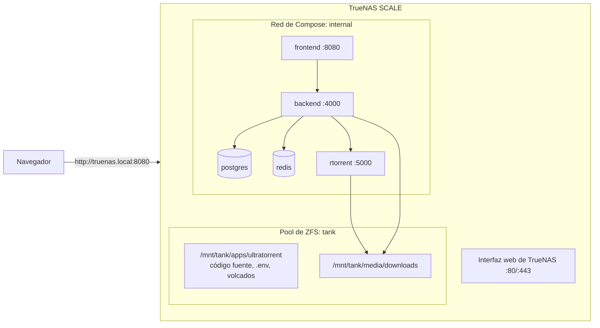

import Tabs from '@theme/Tabs';
import TabItem from '@theme/TabItem';

# TrueNAS SCALE

## Resumen

TrueNAS SCALE es un NAS con Linux, así que UltraTorrent corre en él exactamente como describe [la guía de Compose](/install/docker-compose). La complicación es **cuál motor de apps usa tu versión de SCALE**:

| Era de SCALE | Motor de apps | Qué significa eso para UltraTorrent |
|-----------|-----------|---------------------------------|
| Más viejas (Bluefin / Cobia / Dragonfish) | **Kubernetes (k3s)** | El formulario de "Custom App" es un formulario de *Kubernetes*, no de Docker Compose. Un `docker-compose.yml` no se va a importar |
| Más nuevas (Electric Eel en adelante) | **Docker** | Compose es el modelo nativo, y este stack encaja de forma natural |

De cualquiera de las dos formas, el camino confiable es **SSH + `docker compose`** contra el árbol de código fuente en un dataset.

:::caution Verificado por la comunidad
TrueNAS SCALE **no** es uno de los objetivos de despliegue propios de este proyecto, y su motor de apps ha cambiado de forma sustancial entre versiones. Las partes de UltraTorrent de abajo están fundamentadas en el repositorio; las partes de TrueNAS siguen las convenciones de SCALE. Consulta la documentación de tu versión de SCALE para conocer el modelo de apps actual, y por favor reporta correcciones.
:::

:::tip Mira este tutorial
_Video próximamente._
:::

## Requisitos previos

- TrueNAS SCALE con un **pool** configurado y un **apps pool** elegido.
- SSH habilitado (**System Settings → Services → SSH**), o el **Shell** integrado.
- ~2 GB de RAM libre para la compilación.

## Requisitos

| | Mínimo | Cómodo |
|---|---------|-------------|
| CPU | 2 núcleos | 4 núcleos |
| RAM | 2 GB libres por encima del apetito del ARC de ZFS | 8 GB o más (ZFS es glotón) |
| Disco | ~3 GB para las imágenes | más tu dataset de medios |

:::warning El ARC de ZFS se va a comer tu RAM
La compilación de la imagen necesita ~2 GB *libres*. En un SCALE ocupado, puede que el ARC se los haya llevado. Si el OOM killer mata la compilación, esa es la razón.
:::

## Puertos

La propia interfaz web de TrueNAS está en el **80/443**. El puerto **8080** normalmente está libre — pero otras apps lo agarran con frecuencia, así que revísalo:

```bash
ss -tlnp | grep :8080
```

¿Ocupado? `FRONTEND_PORT=18080` en `.env`.

**No** habilites el perfil `proxy` incluido de UltraTorrent — quiere los puertos 80/443, que la interfaz de TrueNAS tiene tomados.

## Volúmenes

Crea **datasets**, no carpetas simples — de eso se trata ZFS (snapshots, cuotas, replicación):

| Dataset | Montado en (ejemplo) | Uso |
|---------|---------------------|-----|
| `tank/apps/ultratorrent` | `/mnt/tank/apps/ultratorrent` | Árbol de código fuente, `.env`, volcados de la base de datos |
| `tank/media/downloads` | `/mnt/tank/media/downloads` | La carpeta compartida de descargas |

```yaml
# docker-compose.override.yml
volumes:
  downloads:
    driver: local
    driver_opts:
      type: none
      o: bind
      device: /mnt/tank/media/downloads
```

:::tip Tómale un snapshot al dataset de la app
Un snapshot de ZFS de `tank/apps/ultratorrent` antes de una actualización es una segunda red de seguridad además de tu `pg_dump`. **No** sustituye el volcado — un snapshot de un directorio de datos de Postgres en vivo es, en el mejor de los casos, consistente ante caídas.
:::

## Permisos

TrueNAS usa **ACLs** de forma predeterminada, y esas pueden anular calladitas la propiedad POSIX que Docker espera.

La configuración confiable más sencilla:

1. En **Datasets → Permissions**, dale al dataset de descargas un tipo de ACL **POSIX** (o una ACL que le dé control total al UID que vas a usar).
2. Pon como dueño el UID con el que el motor va a escribir.

```dotenv
# .env — elige un UID/GID que cuadre con tu stack de medios
PUID=1000
PGID=1000
```

```bash
sudo chown -R 1000:1000 /mnt/tank/media/downloads
```

Si Plex/Jellyfin ya son dueños de ese dataset, **no le hagas chown** — pon `PUID`/`PGID` con el usuario *de ellos*. Ve [Permisos](/install/docker-compose#permissions).

:::caution Las ACLs suelen ser las culpables
Cuando un container reporta "permission denied" en un dataset cuyo `ls -ln` se ve correcto, la causa casi siempre es una ACL restrictiva, no el UID. Revísalo con `getfacl /mnt/tank/media/downloads`.
:::

## Red



## Paso a paso

### 1. Crea los datasets

**Datasets → Add Dataset** → `apps/ultratorrent` y `media/downloads` (los nombres, a tu gusto).


:::note Falta captura de pantalla
TrueNAS SCALE **Datasets → Add Dataset**, creando `tank/media/downloads`, con el panel de ACL/permisos visible.
:::

### 2. Consigue un shell

**System Settings → Shell**, o entra por SSH:

```bash
ssh root@truenas.local
```

### 3. Confirma que Docker está disponible

```bash
docker --version
docker compose version
```

<Tabs groupId="scale">
<TabItem value="docker" label="SCALE de la era Docker (Electric Eel y posteriores)" default>

Los dos comandos funcionan. Sigue adelante.

</TabItem>
<TabItem value="k8s" label="SCALE de la era Kubernetes (Dragonfish y anteriores)">

Puede que `docker` ni siquiera esté presente — las apps corren sobre k3s. Opciones, en orden de sensatez:

1. **Actualiza SCALE** a una versión basada en Docker. Por mucho, lo más limpio.
2. **Corre UltraTorrent en una VM** dentro de TrueNAS (SCALE trae un hipervisor) y trátalo como un [host Linux](/install/platforms/linux) común. Bien confiable, cuesta algo de RAM.
3. Traduce tú mismo el stack de Compose a manifiestos de Kubernetes. **No está soportado, no está documentado y no se recomienda** — el stack compila imágenes desde el código fuente, cosa que un formulario de Custom App no puede hacer.

:::danger Un YAML de "Custom App" no es un docker-compose.yml
En el SCALE de la era Kubernetes, pegar `docker-compose.yml` en el formulario de Custom App no funciona. Son esquemas distintos. Usa una VM, o actualiza.
:::

</TabItem>
</Tabs>

### 4. Instala

```bash
cd /mnt/tank/apps/ultratorrent
git clone https://github.com/damirabal/ultratorrent-core.git
cd ultratorrent-core

cp .env.example .env
for k in JWT_ACCESS_SECRET JWT_REFRESH_SECRET ENCRYPTION_KEY; do
  sed -i "s|^$k=.*|$k=$(openssl rand -base64 48 | tr -d '\n')|" .env
done
nano .env
```

```dotenv
POSTGRES_PASSWORD=lettersAndNumbers123
ADMIN_PASSWORD=the-password-you-log-in-with
FRONTEND_PORT=8080
PUID=1000
PGID=1000
```

Enlaza las descargas al dataset:

```bash
nano docker-compose.override.yml
```

```yaml
volumes:
  downloads:
    driver: local
    driver_opts:
      type: none
      o: bind
      device: /mnt/tank/media/downloads
```

### 5. Compila, arranca, siembra

```bash
docker compose --profile rtorrent up -d --build
docker compose exec backend npx prisma db seed
```

### 6. Inicia sesión y agrega el motor

`http://<truenas-ip>:8080`, inicia sesión como **`admin`**.

**Infraestructura → Motores → Agregar motor** → rTorrent · SCGI sobre TCP · host `rtorrent` · puerto `5000` → **Probar conexión** → **Agregar motor**.

**Configuración → Ruta raíz predeterminada** → `/downloads`.

## Verificación

```bash
docker compose ps
curl -s http://localhost:8080/api/system/live
ls -ln /mnt/tank/media/downloads
```

```text
NAME                       STATUS                    PORTS
ultratorrent-backend-1     Up 2 minutes (healthy)    4000/tcp
ultratorrent-frontend-1    Up 2 minutes (healthy)    0.0.0.0:8080->8080/tcp
ultratorrent-postgres-1    Up 2 minutes (healthy)    5432/tcp
ultratorrent-redis-1       Up 2 minutes (healthy)    6379/tcp
ultratorrent-rtorrent-1    Up 2 minutes (healthy)    5000/tcp
```

Una descarga terminada en `/mnt/tank/media/downloads`, con dueño tu `PUID:PGID`, es la prueba de verdad.

## Proxy inverso

TrueNAS tiene tomados los puertos 80/443, así que corre tu proxy **en otro lado** — otro host, o un container en otro puerto — apuntando a `http://<truenas-ip>:8080`. Los encabezados de upgrade de WebSocket son obligatorios: [Proxy inverso](/install/reverse-proxy).

## HTTPS

Lo maneja el proxy que le pongas al frente. Ve [TLS](/install/tls).

## Actualizaciones

```bash
cd /mnt/tank/apps/ultratorrent/ultratorrent-core
docker compose exec -T postgres pg_dump -U ultratorrent ultratorrent > backup-$(date +%F).sql
git pull
docker compose --profile rtorrent up -d --build
docker compose exec backend npx prisma db seed
```

Tómale primero un snapshot de ZFS al dataset de la app — es gratis e instantáneo. Procedimiento completo: [Actualizar](/install/upgrading).

:::warning Una actualización mayor de SCALE puede cambiar el motor de apps
Actualizar TrueNAS en sí (no UltraTorrent) te puede migrar entre k3s y Docker. Lee las notas de la versión de SCALE antes de un salto de versión mayor — puede dejar varado un stack que esté corriendo.
:::

## Copias de seguridad

```bash
docker compose exec -T postgres pg_dump -U ultratorrent ultratorrent \
  > /mnt/tank/apps/ultratorrent/backup-$(date +%F).sql
cp .env /mnt/tank/apps/ultratorrent/env.bak
```

Luego deja que TrueNAS haga lo que hace bien: **tareas de snapshots periódicos** sobre `tank/apps/ultratorrent`, y **replicación** hacia otra máquina. Ve [Copia de seguridad y restauración](/operate/backup).

## Solución de problemas

| Síntoma | Causa | Solución |
|---------|-------|-----|
| `docker: command not found` | SCALE de la era Kubernetes — ahí no hay Docker | Actualiza SCALE, o corre UltraTorrent en una VM |
| Pegar `docker-compose.yml` en "Custom App" falla | Ese formulario recibe un esquema de *Kubernetes* | Usa `docker compose` en un shell, o una VM |
| *"permission denied"* en el dataset de descargas a pesar de un `chown` correcto | Una **ACL** restrictiva | `getfacl /mnt/tank/media/downloads`; dale control total al UID, o cambia el dataset a ACLs POSIX |
| El OOM killer mata la compilación | El ARC de ZFS tiene tomada la RAM | Libera memoria (o limita el ARC) y vuelve a compilar |
| El puerto 8080 está en uso | Otra app lo tomó | `FRONTEND_PORT=18080` |
| El perfil `proxy` incluido no logra enlazarse | TrueNAS es dueño del 80/443 | No lo habilites; corre el proxy en otro lado |
| El stack desapareció tras una actualización de TrueNAS | El motor de apps te cambió por debajo | Lee las notas de la versión de SCALE; vuelve a desplegar desde el árbol de código fuente (tu dataset y tu `.env` sobreviven) |
| rTorrent se reinicia cada cierto tiempo | El conocido crash de rTorrent 0.9.8 upstream | No se pierde nada. Reduce los torrents activos, o usa el perfil de qBittorrent |

Más: [Solución de problemas](/operate/troubleshooting).

## Buenas prácticas

- **Datasets, no carpetas.** Los snapshots y la replicación son la razón por la que compraste TrueNAS.
- **Revisa la ACL, no solo el UID**, cuando un error de permisos no tenga ni pies ni cabeza.
- **Tómale un snapshot antes de cada actualización** — y aun así haz el `pg_dump`. Un snapshot de una base de datos en vivo es consistente ante caídas, no limpio.
- **No corras el perfil `proxy` incluido** — TrueNAS es dueño del 80/443.
- **Lee las notas de la versión de SCALE antes de una actualización mayor de TrueNAS**; el motor de apps ya ha cambiado antes.
- **Una VM es una respuesta legítima** en el SCALE de la era Kubernetes. Aburrida, confiable, y convierte esto en una [instalación de Linux](/install/platforms/linux) común.
- Mantén el dataset de descargas en el **mismo pool** que la app si quieres snapshots atómicos de los dos.

## Preguntas frecuentes

**¿Hay una app oficial de TrueNAS / una entrada en el catálogo?**
No. UltraTorrent es un stack de Compose que se compila desde el código fuente.

**SCALE de la era Kubernetes — ¿de verdad no hay forma?**
Ninguna soportada. El stack compila imágenes desde el código fuente, cosa que el formulario de Custom App no puede hacer. Corre una VM, o actualiza SCALE.

**¿Debería correrlo en una VM de todos modos?**
Es una decisión bien defendible: aislamiento total, una máquina Linux normal, e inmunidad al vaivén del motor de apps de TrueNAS. Cuesta RAM.

**¿Los snapshots de ZFS van a respaldar bien mi base de datos?**
No de forma confiable — un snapshot de un Postgres corriendo es consistente ante caídas. Usa `pg_dump`, y luego tómale un snapshot al volcado.

**¿Funciona en TrueNAS CORE (FreeBSD)?**
No. CORE no tiene Docker. Usa SCALE, o una VM de Linux / un montaje tipo jail de tu propia cosecha.

## Lista de verificación

- [ ] Identificado el motor de apps de tu versión de SCALE (Docker vs. Kubernetes)
- [ ] `docker compose version` funciona en el shell
- [ ] Datasets creados para la app y para las descargas
- [ ] La ACL/los permisos del dataset permiten el `PUID`/`PGID` que elegiste
- [ ] `.env`: `POSTGRES_PASSWORD` alfanumérica, `ADMIN_PASSWORD`, tres secretos distintos
- [ ] Descargas enlazadas a `/mnt/<pool>/media/downloads`
- [ ] Compilado, arrancado, sembrado
- [ ] Motor agregado y conectado
- [ ] Las descargas caen con el dueño esperado
- [ ] Tarea de snapshots periódicos sobre el dataset de la app
- [ ] `pg_dump` escrito dentro de un dataset con snapshots

## Ver también

- [Instalación con Docker Compose](/install/docker-compose) — la guía autoritativa
- [Linux](/install/platforms/linux) — lo que debes seguir si lo corres en una VM
- [Proxmox](/install/platforms/proxmox) — la otra opción con forma de hipervisor
- [Proxy inverso](/install/reverse-proxy) · [TLS](/install/tls) · [Actualizar](/install/upgrading)
- [Copia de seguridad y restauración](/operate/backup) · [Solución de problemas](/operate/troubleshooting)
