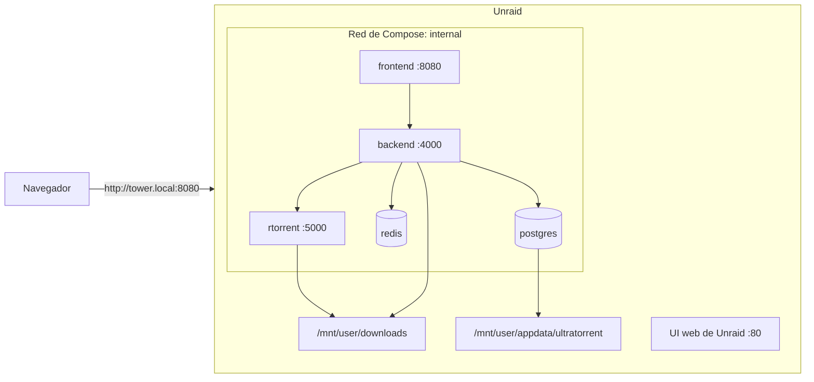

import Tabs from '@theme/Tabs';
import TabItem from '@theme/TabItem';

# Unraid

## Resumen

Unraid es un host de Docker con una interfaz web muy buena y una restricción importante para nosotros: **UltraTorrent es un stack de Compose con múltiples containers, no un solo container**, y **se compila desde el código fuente** — así que no encaja en el modelo clásico de "Add Container" / plantillas de Community Apps de Unraid.

La forma de ejecutarlo es con **Docker Compose**, mediante el plugin **Compose Manager** (o simplemente por SSH).

:::caution Verificado por la comunidad
Unraid **no** es uno de los destinos de despliegue propios de este proyecto. Todo lo de abajo es el flujo estándar de Compose en Unraid aplicado al stack documentado de UltraTorrent — las partes de UltraTorrent están fundamentadas en el repositorio, y las partes de Unraid siguen las convenciones de Unraid. Verifica contra tu versión de Unraid y, por favor, reporta correcciones.
:::

:::tip Mira este tutorial
_Video próximamente._
:::

## Requisitos previos

- Unraid 6.10+ con el array iniciado.
- El plugin **Docker Compose Manager** (Community Applications → Apps → busca "Compose") — o simplemente SSH, que Unraid habilita de forma predeterminada.
- ~2 GB de RAM libre para la compilación.

## Requisitos

| | Mínimo | Cómodo |
|---|---------|-------------|
| CPU | 2 núcleos | 4 núcleos |
| RAM | 2 GB libres durante la compilación | 4 GB+ |
| Disco | ~3 GB en el pool de cache/appdata | más tu array de medios |

## Puertos

La propia interfaz web de Unraid usa el puerto **80** de forma predeterminada (y el 443). **No** usa el 8080 — así que `FRONTEND_PORT=8080` normalmente está bien. Revísalo de todos modos, porque otros containers suelen ocuparlo:

```bash
ss -tlnp | grep :8080
```

Si está ocupado: `FRONTEND_PORT=18080` en `.env`.

El perfil `proxy` de Caddy incluido quiere los puertos **80 y 443**, que la propia UI de Unraid ocupa. No habilites ese perfil a menos que hayas movido los puertos de la UI de Unraid (**Settings → Management Access**).

## Volúmenes

Convención de Unraid:

| Ruta | Uso |
|------|-----|
| `/boot/config/plugins/compose.manager/projects/ultratorrent/` | Donde Compose Manager guarda un proyecto (si usas el plugin) |
| `/mnt/user/appdata/ultratorrent/` | Estado persistente de la app — pon aquí el árbol de código fuente y el `.env` |
| `/mnt/user/downloads/` | Tu share de medios |

Enlaza las descargas al share:

```yaml
# docker-compose.override.yml
volumes:
  downloads:
    driver: local
    driver_opts:
      type: none
      o: bind
      device: /mnt/user/downloads
```

:::warning Usa `/mnt/user/...`, no `/mnt/cache/...` ni `/mnt/disk1/...`
Mezclarlos para los mismos datos es la manera clásica de corromper un share en Unraid. Escoge el user share y quédate en él.
:::

## Permisos

La convención de Unraid es **`nobody:users` = uid 99, gid 100**, no los 1000:1000 predeterminados de UltraTorrent. Dos opciones:

**Opción A — adopta la convención de Unraid** (recomendado si otros containers de Unraid comparten la carpeta):

```dotenv
# .env
PUID=99
PGID=100
```

El motor entonces escribe las descargas como `nobody:users`, igual que cualquier otro container de Unraid.

**Opción B — mantén 1000:1000** y haz `chown` al share de descargas:

```bash
chown -R 1000:1000 /mnt/user/downloads
```

**No** hagas esto si Plex/Jellyfin/Sonarr también escriben ahí.

:::info El backend sigue corriendo como uid 1000
Solo el *motor* respeta `PUID`/`PGID`. El container del backend está fijo en uid 1000, así que las acciones de **escritura** del Gestor de Archivos de la app sobre una carpeta `nobody:users` necesitan que se agregue el grupo:

```yaml
# docker-compose.override.yml
services:
  backend:
    group_add: ["100"]      # el grupo `users`
```

Descargar funciona en cualquier caso; esto solo afecta las escrituras del Gestor de Archivos. Ver [Permisos](/install/docker-compose#permissions).
:::

## Red



## Paso a paso

<Tabs groupId="unraid-method">
<TabItem value="plugin" label="Plugin Compose Manager" default>

### 1. Instala el plugin

**Apps** (Community Applications) → busca **Compose Manager** → Install.

### 2. Trae el código fuente al array

Compose Manager te deja pegar un `docker-compose.yml`, pero UltraTorrent **se compila desde el código fuente** — así que el contexto de compilación (el repositorio completo) tiene que estar en disco. Haz esto por SSH:

```bash
mkdir -p /mnt/user/appdata/ultratorrent
cd /mnt/user/appdata/ultratorrent
git clone https://github.com/damirabal/ultratorrent-core.git
cd ultratorrent-core
```

### 3. Agrega el proyecto

**Docker tab → Compose → Add New Stack → `ultratorrent`**, y luego fija su **directory** a `/mnt/user/appdata/ultratorrent/ultratorrent-core` para que tome el `docker-compose.yml` y el `.env` reales.

### 4. Configura y compila

El `.env` y el primer `--build` siguen siendo trabajo de shell — continúa en la pestaña de SSH de abajo, y luego usa los botones **Compose Up** / **Compose Down** del plugin en el día a día.


:::note Falta captura de pantalla
Pestaña **Docker** de Unraid, sección de Compose Manager, mostrando el stack `ultratorrent` con los botones Compose Up / Down / Update.
:::

</TabItem>
<TabItem value="ssh" label="SSH (lo más simple)">

### 1. Conéctate por SSH

```bash
ssh root@tower.local
```

### 2. Trae el código fuente

```bash
mkdir -p /mnt/user/appdata/ultratorrent
cd /mnt/user/appdata/ultratorrent
git clone https://github.com/damirabal/ultratorrent-core.git
cd ultratorrent-core
```

### 3. Configura

```bash
cp .env.example .env
for k in JWT_ACCESS_SECRET JWT_REFRESH_SECRET ENCRYPTION_KEY; do
  sed -i "s|^$k=.*|$k=$(openssl rand -base64 48 | tr -d '\n')|" .env
done
nano .env
```

```dotenv
POSTGRES_PASSWORD=lettersAndNumbers123
ADMIN_PASSWORD=the-password-you-log-in-with
FRONTEND_PORT=8080          # o 18080 si algo más lo tiene ocupado
PUID=99                     # el `nobody` de Unraid
PGID=100                    # el `users` de Unraid
```

### 4. Enlaza las descargas

```bash
nano docker-compose.override.yml
```

```yaml
volumes:
  downloads:
    driver: local
    driver_opts:
      type: none
      o: bind
      device: /mnt/user/downloads
services:
  backend:
    group_add: ["100"]      # para que el Gestor de Archivos también pueda escribir ahí
```

### 5. Compila, inicia, siembra la base de datos

```bash
docker compose --profile rtorrent up -d --build
docker compose exec backend npx prisma db seed
```

</TabItem>
</Tabs>

### Por último: inicia sesión y agrega el motor

Abre `http://<unraid-ip>:8080` e inicia sesión como **`admin`** con tu `ADMIN_PASSWORD`.

**Infraestructura → Motores → Agregar motor** → rTorrent · SCGI sobre TCP · host `rtorrent` · puerto `5000` · Motor predeterminado activado → **Probar conexión** → **Agregar motor**.

Luego **Configuración → Ruta raíz predeterminada** → `/downloads`.

## Verificación

```bash
docker compose ps
curl -s http://localhost:8080/api/system/live
```

```text
NAME                       STATUS                    PORTS
ultratorrent-backend-1     Up 2 minutes (healthy)    4000/tcp
ultratorrent-frontend-1    Up 2 minutes (healthy)    0.0.0.0:8080->8080/tcp
ultratorrent-postgres-1    Up 2 minutes (healthy)    5432/tcp
ultratorrent-redis-1       Up 2 minutes (healthy)    6379/tcp
ultratorrent-rtorrent-1    Up 2 minutes (healthy)    5000/tcp
```

Luego revisa la propiedad de una descarga terminada:

```bash
ls -ln /mnt/user/downloads
```

Con `PUID=99`/`PGID=100`, los archivos deben aparecer como `99 100` — igual que en cualquier otro container de Unraid.

## Proxy inverso

Los usuarios de Unraid típicamente ya corren **Nginx Proxy Manager** o **SWAG**. Apúntalo a `http://<unraid-ip>:8080` y **activa el soporte de WebSocket** — ver [Proxy inverso](/install/reverse-proxy). Sin eso, la UI carga pero nunca se actualiza.

**No** habilites el perfil `proxy` incluido de UltraTorrent en Unraid a menos que primero hayas movido la interfaz web de Unraid fuera de los puertos 80/443.

## HTTPS

Cualquier proxy que ya uses (NPM, SWAG) ya se encarga de los certificados. Ver [TLS](/install/tls).

## Actualizaciones

```bash
cd /mnt/user/appdata/ultratorrent/ultratorrent-core
docker compose exec -T postgres pg_dump -U ultratorrent ultratorrent > backup-$(date +%F).sql
git pull
docker compose --profile rtorrent up -d --build
docker compose exec backend npx prisma db seed
```

El botón **Update** de Compose Manager descarga imágenes — pero las imágenes de UltraTorrent se **compilan localmente**, así que no traerá código nuevo. Tienes que hacer `git pull` y recompilar. Ver [Actualizar](/install/upgrading).

## Copias de seguridad

El plugin **Appdata Backup** de Unraid cubre `/mnt/user/appdata` — pon ahí la salida de tu `pg_dump` y una copia del `.env` y queda resuelto:

```bash
docker compose exec -T postgres pg_dump -U ultratorrent ultratorrent \
  > /mnt/user/appdata/ultratorrent/backup-$(date +%F).sql
cp .env /mnt/user/appdata/ultratorrent/env.bak
```

Ver [Copias de seguridad y restauración](/operate/backup).

## Resolución de problemas

| Síntoma | Causa | Solución |
|---------|-------|-----|
| No hay plantilla de Community Apps para UltraTorrent | No existe — esto es un stack de múltiples containers compilado desde el código fuente | Usa Compose Manager o SSH |
| El botón *Update* de Compose Manager no hace nada útil | Descarga imágenes; las de UltraTorrent se compilan localmente | `git pull` y luego `up -d --build` |
| Las descargas quedan con dueño `1000:1000` y otras apps no pueden leerlas | Los `PUID`/`PGID` predeterminados | Fija `PUID=99`, `PGID=100` y recrea el container del motor |
| El Gestor de Archivos no puede escribir en `/downloads` | El backend es uid 1000 y la carpeta es `nobody:users` | `group_add: ["100"]` en el servicio `backend` |
| El bind mount falla | Error de tipeo en la ruta, o el share no existe | Crea el share primero; usa siempre `/mnt/user/...` |
| Los datos aparecen en dos lugares / rarezas con el share | Mezclaste `/mnt/user`, `/mnt/cache` y `/mnt/diskN` para los mismos datos | Usa `/mnt/user/...` exclusivamente |
| Puerto 8080 en uso | Otro container lo tomó | `FRONTEND_PORT=18080` |
| El perfil `proxy` incluido no arranca | La propia UI de Unraid ocupa 80/443 | No uses ese perfil; usa NPM/SWAG en su lugar |
| El stack no reinicia tras un reinicio del servidor | El auto-arranque de Compose Manager no está habilitado | Habilita el auto-arranque del stack (la política `restart: unless-stopped` se encarga del resto) |
| La compilación muere por falta de memoria (OOM) | Menos de ~2 GB de RAM libre | Detén otros containers y vuelve a intentar |

Más: [Resolución de problemas](/operate/troubleshooting).

## Mejores prácticas

- **`PUID=99` / `PGID=100`** para que las descargas cumplan la convención de Unraid y tus apps de medios puedan leerlas.
- **El árbol de código fuente y el `.env` bajo `/mnt/user/appdata/`** para que el plugin Appdata Backup los cubra.
- **Descargas en un share `/mnt/user/`**, nunca en una ruta de disco crudo o de cache.
- **No uses el perfil `proxy` incluido** — ya tienes NPM/SWAG, y Unraid es dueño de los puertos 80/443.
- **Recuerda que el botón Update de Compose Manager no actualiza UltraTorrent.** `git pull` + `--build`.
- Prefiere **qBittorrent** si planeas manejar una biblioteca grande.

## Preguntas frecuentes

**¿Por qué no hay una plantilla de Community Apps?**
Porque UltraTorrent es un stack de Compose con cinco containers o más que se compila desde el código fuente — las plantillas de CA son para containers únicos y precompilados.

**¿Puedo usar la interfaz "Add Container" de Unraid en su lugar?**
No en la práctica. Estarías cableando a mano Postgres, Redis, el backend, el frontend y el motor, además de un paso de compilación. Usa Compose.

**¿Tengo que usar el plugin?**
No — SSH a secas funciona, y Unraid ya trae Docker Compose.

**¿Sobrevivirá a un reinicio?**
Sí, siempre que Docker arranque y el stack esté configurado para auto-arrancar; cada servicio lleva `restart: unless-stopped`.

**¿Las descargas deben ir en el pool de cache o en el array?**
Las descargas activas en el pool de cache son mucho más rápidas; mueve los medios completados al array con el Mover. Esa es una pregunta de Unraid, no de UltraTorrent.

## Lista de verificación

- [ ] Compose Manager instalado (o SSH listo)
- [ ] Código fuente clonado bajo `/mnt/user/appdata/ultratorrent/`
- [ ] `.env`: `POSTGRES_PASSWORD` alfanumérica, `ADMIN_PASSWORD`, tres secretos distintos
- [ ] `PUID=99`, `PGID=100`
- [ ] `FRONTEND_PORT` libre
- [ ] Descargas enlazadas a un share `/mnt/user/`
- [ ] `group_add: ["100"]` en el backend si quieres escrituras del Gestor de Archivos
- [ ] Compilado, iniciado y con la base de datos sembrada
- [ ] Motor agregado y conectado
- [ ] Las descargas llegan con propiedad `99:100`
- [ ] NPM/SWAG al frente, con **el soporte de WebSocket activado**
- [ ] Appdata Backup cubre la salida del `pg_dump` y el `.env`

## Ver también

- [Instalación con Docker Compose](/install/docker-compose) — la guía autoritativa
- [Permisos](/install/docker-compose#permissions) — PUID/PGID en detalle
- [Proxy inverso](/install/reverse-proxy) · [TLS](/install/tls) · [Actualizar](/install/upgrading)
- [Resolución de problemas](/operate/troubleshooting) · [Copias de seguridad y restauración](/operate/backup)
