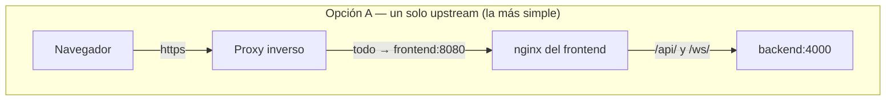
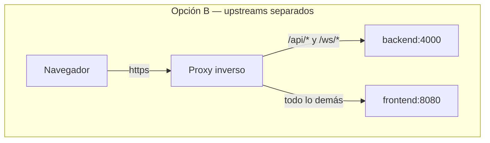

import Tabs from '@theme/Tabs';
import TabItem from '@theme/TabItem';

# Proxy inverso

## Resumen

En una LAN no necesitas un proxy inverso — abre `http://<host>:8080` y ya está.

Quieres uno cuando necesitas un **nombre de host en vez de un puerto**, **HTTPS**, o **un solo punto de entrada frente a varias apps autoalojadas**.

:::danger Los WebSockets no son opcionales
La UI de UltraTorrent es **en vivo**: progreso de torrents, salud de los motores, ejecuciones de RSS, progreso de importación, notificaciones — todo se envía por un WebSocket en **`/ws/`**. Un proxy que no reenvía los encabezados `Upgrade` y `Connection` produce una UI que *aparenta* estar bien, carga, te deja iniciar sesión — y luego nunca se actualiza. Las barras de progreso se quedan en 0%. Este es de lejos el error más común con proxies inversos, y todas las configuraciones de abajo lo manejan.
:::

:::tip Mira este tutorial
_Video próximamente._
:::

## Requisitos previos

- Una [instalación con Docker Compose](/install/docker-compose) funcionando.
- Un nombre DNS apuntando al host (para una instalación pública).
- Los puertos 80/443 libres en el host, o un proxy que ya los tenga.

## Requerimientos

Un proxy inverso es barato: **~64 MB de RAM** y un uso de CPU insignificante para cualquiera de las opciones de abajo. El único requerimiento real es que pueda hacer proxy de WebSockets.

## Puertos

| Puerto | Quién escucha | Notas |
|------|-------------|-------|
| 80 / 443 | Tu proxy inverso | Los únicos puertos que deben mirar hacia el internet |
| 8080 (host) | contenedor `frontend` | Enlázalo a `127.0.0.1` una vez que un proxy esté al frente — mira [Mejores prácticas](#best-practices) |
| 8080 (contenedor) | nginx dentro de la imagen `frontend` | **El contenedor escucha en el 8080, no en el 80** — mira la nota de abajo |
| 4000 (contenedor) | `backend` | Solo interno; nunca se publica |

:::info El contenedor frontend escucha en el 8080, no en el 80
La imagen se construye sobre `nginx-unprivileged`, que corre como uid 101 y por lo tanto no puede enlazarse a un puerto privilegiado. Dentro de la red de Docker el frontend es **`http://frontend:8080`**.

Esto muerde a las configuraciones de proxy escritas a mano: apuntar un upstream a `frontend:80` da un **502 Bad Gateway**, porque no hay nada escuchando ahí. Usa `frontend:8080`.

El `deploy/Caddyfile` que viene con el repo (el perfil `proxy`) enruta correctamente a `frontend:8080`. Si estás corriendo una copia anterior a esa corrección y el proxy incluido da 502, esa es la razón — actualízalo, o haz pull.
:::

## Volúmenes

Solo el estado propio de tu proxy (certificados, cuenta ACME). Un proxy no toca los volúmenes de UltraTorrent.

## Permisos

Ninguno en específico — pero si tu proxy se enlaza al 80/443, necesita la capacidad de hacerlo (root, `CAP_NET_BIND_SERVICE`, o un container que ya la tenga).

## Dos maneras de enrutar





**La Opción A es la que quieres.** El nginx propio del frontend ya hace proxy de `/api/` y `/ws/` hacia el backend, con los encabezados de upgrade de WebSocket incluidos — así que un solo upstream te da una app completamente funcional, y hay exactamente un lugar que se puede configurar mal.

**La Opción B** (lo que hace el Caddyfile incluido) le quita un salto a las llamadas a la API. Úsala solo si tienes una razón; entonces tú mismo tienes que acertar con los encabezados de upgrade de `/ws/`.

Todas las configuraciones de abajo usan la **Opción A** a menos que se indique lo contrario.

## Paso a paso

### 1. Dile a UltraTorrent cuál es su origen público

En `.env`:

```dotenv
CORS_ORIGIN=https://torrents.example.com
```

Luego recrea el backend:

```bash
docker compose up -d backend
```

La SPA llama a la API en una ruta *relativa* (`/api`), así que es del mismo origen y CORS es casi irrelevante — pero el valor se usa para los orígenes de navegador permitidos y debe reflejar la realidad. Acepta una lista separada por comas.

### 2. Enlaza el puerto de la UI a localhost

Si el proxy corre **en el mismo host**, deja de exponer el 8080 a toda tu LAN:

```yaml
# docker-compose.override.yml
services:
  frontend:
    ports: !override
      - "127.0.0.1:8080:8080"
```

:::caution Verificado por la comunidad
`!override` requiere un Compose v2 reciente. Si tu versión lo rechaza, edita directamente la entrada `ports:` en `docker-compose.yml` — recuerda que un archivo de override normal **añade** puertos en vez de reemplazarlos.
:::

Si el proxy corre **en el mismo proyecto de Compose**, elimina por completo el mapeo al host y deja que el proxy alcance `frontend:8080` por la red `internal`.

### 3. Configura el proxy

<Tabs groupId="proxy">
<TabItem value="traefik" label="Traefik" default>

Etiquetas en el servicio `frontend`, asumiendo un Traefik con un entrypoint `websecure` y un resolver `letsencrypt` ya corriendo en una red compartida:

```yaml
# docker-compose.override.yml
services:
  frontend:
    labels:
      - "traefik.enable=true"
      - "traefik.docker.network=traefik_proxy"
      - "traefik.http.routers.ultratorrent.rule=Host(`torrents.example.com`)"
      - "traefik.http.routers.ultratorrent.entrypoints=websecure"
      - "traefik.http.routers.ultratorrent.tls.certresolver=letsencrypt"
      # El contenedor escucha en el 8080 (nginx-unprivileged), NO en el 80.
      - "traefik.http.services.ultratorrent.loadbalancer.server.port=8080"
    networks: [internal, traefik_proxy]

networks:
  traefik_proxy:
    external: true
```

**WebSockets:** Traefik los pasa de forma transparente — sin middleware extra, sin malabares con encabezados. Simplemente funciona, siempre que **no** hayas eliminado `Upgrade`/`Connection` con un middleware `headers` personalizado.

Recordatorio de configuración estática (`traefik.yml`), si aún no la tienes:

```yaml
entryPoints:
  web:
    address: ":80"
    http:
      redirections:
        entryPoint: { to: websecure, scheme: https }
  websecure:
    address: ":443"

certificatesResolvers:
  letsencrypt:
    acme:
      email: you@example.com
      storage: /letsencrypt/acme.json
      httpChallenge:
        entryPoint: web
```

</TabItem>
<TabItem value="nginx" label="NGINX">

Un NGINX independiente en el host, al frente del `127.0.0.1:8080` publicado:

```nginx
# /etc/nginx/sites-available/ultratorrent.conf
map $http_upgrade $connection_upgrade {
    default upgrade;
    ''      close;
}

upstream ultratorrent {
    server 127.0.0.1:8080;
    keepalive 32;
}

server {
    listen 80;
    server_name torrents.example.com;
    return 301 https://$host$request_uri;
}

server {
    listen 443 ssl http2;
    server_name torrents.example.com;

    ssl_certificate     /etc/letsencrypt/live/torrents.example.com/fullchain.pem;
    ssl_certificate_key /etc/letsencrypt/live/torrents.example.com/privkey.pem;

    # Los archivos torrent pueden ser algo grandes; subir archivos .torrent no debe dar 413.
    client_max_body_size 64m;

    location / {
        proxy_pass http://ultratorrent;
        proxy_http_version 1.1;

        # --- REQUERIDO para la UI en vivo ---------------------------------
        proxy_set_header Upgrade    $http_upgrade;
        proxy_set_header Connection $connection_upgrade;
        # ------------------------------------------------------------------

        proxy_set_header Host              $host;
        proxy_set_header X-Real-IP         $remote_addr;
        proxy_set_header X-Forwarded-For   $proxy_add_x_forwarded_for;
        proxy_set_header X-Forwarded-Proto $scheme;

        # WebSocket de larga duración: no lo cortes a los 60s.
        proxy_read_timeout  86400s;
        proxy_send_timeout  86400s;
        proxy_buffering     off;
    }
}
```

```bash
sudo ln -s /etc/nginx/sites-available/ultratorrent.conf /etc/nginx/sites-enabled/
sudo nginx -t && sudo systemctl reload nginx
```

El bloque `map` **tiene que estar a nivel de `http`** (fuera de `server`). Poner `proxy_set_header Connection "upgrade"` de forma incondicional también funciona, pero rompe el keep-alive de HTTP normal; el `map` es la forma correcta.

</TabItem>
<TabItem value="npm" label="Nginx Proxy Manager">

En la UI web de NPM:

**Hosts → Proxy Hosts → Add Proxy Host → Details**

| Campo | Valor |
|-------|-------|
| Domain Names | `torrents.example.com` |
| Scheme | `http` |
| Forward Hostname / IP | la IP del host de Docker, o `frontend` si NPM comparte la red de Compose |
| Forward Port | `8080` |
| Cache Assets | apagado |
| **Block Common Exploits** | encendido |
| **Websockets Support** | ✅ **ENCENDIDO — aquí está todo el juego** |

**Pestaña SSL:** solicita un certificado nuevo de Let's Encrypt, activa **Force SSL** y **HTTP/2**.

**Pestaña Advanced** — pega esto para que el WebSocket no muera por el tiempo de espera de lectura predeterminado de 60 segundos:

```nginx
proxy_read_timeout 86400s;
proxy_send_timeout 86400s;
proxy_buffering off;
client_max_body_size 64m;
```


:::note Falta captura de pantalla
La pestaña **Add Proxy Host → Details** de NPM, con Forward Port `8080` y el interruptor de **Websockets Support** encendido y resaltado.
:::

:::caution Verificado por la comunidad
Nginx Proxy Manager no forma parte de los despliegues propios de este proyecto. Los ajustes de arriba son los estándar para una app con WebSocket; verifícalos contra tu versión de NPM.
:::

</TabItem>
<TabItem value="caddy" label="Caddy">

Caddy hace proxy de WebSockets de forma transparente y consigue un certificado de Let's Encrypt por su cuenta. Esta es la opción menos propensa a errores.

**Caddy independiente** (`Caddyfile`):

```caddy
torrents.example.com {
    encode gzip
    reverse_proxy 127.0.0.1:8080
}
```

Esa es toda la configuración. HTTPS, la redirección HTTP→HTTPS, la renovación del certificado y el upgrade de WebSocket son todos automáticos.

**El perfil `proxy` incluido.** El repo trae `deploy/Caddyfile` y un servicio `caddy:2-alpine` detrás de `--profile proxy`. Reemplaza la etiqueta de sitio `:80` con tu dominio para obtener HTTPS automático — y de paso corrige el puerto del upstream:

```caddy
# deploy/Caddyfile
torrents.example.com {
	encode gzip

	# WebSocket + API directo al backend
	@api path /api/* /ws/*
	handle @api {
		reverse_proxy backend:4000
	}

	# Todo lo demás a la SPA. NOTA: la imagen del frontend es nginx-unprivileged
	# y escucha en el 8080 — no en el 80.
	handle {
		reverse_proxy frontend:8080
	}
}
```

```bash
docker compose --profile proxy up -d
```

:::warning Puerto del Caddyfile incluido
El archivo en el repo actualmente dice `reverse_proxy frontend:80`, mientras que el contenedor frontend escucha en el **8080**. Si el proxy incluido da 502, corrige esa línea como se muestra arriba.
:::

Caddy necesita el 80 y el 443 libres en el host, y el DNS de tu dominio ya debe resolver hacia él para el desafío ACME por HTTP.

</TabItem>
<TabItem value="haproxy" label="HAProxy">

```haproxy
# /etc/haproxy/haproxy.cfg
global
    log stdout format raw local0
    maxconn 4096

defaults
    mode    http
    log     global
    option  httplog
    option  forwardfor
    timeout connect 5s
    timeout client  1h      # largo, para que el WebSocket sobreviva
    timeout server  1h
    timeout tunnel  24h     # <-- el timeout del túnel WebSocket: REQUERIDO

frontend https_in
    bind :80
    bind :443 ssl crt /etc/haproxy/certs/torrents.example.com.pem alpn h2,http/1.1
    http-request redirect scheme https unless { ssl_fc }

    http-request set-header X-Forwarded-Proto https if { ssl_fc }
    http-request set-header X-Forwarded-Port  %[dst_port]

    acl host_ut hdr(host) -i torrents.example.com
    use_backend ultratorrent if host_ut

backend ultratorrent
    # HAProxy pasa Upgrade/Connection en modo HTTP; el `timeout tunnel`
    # de arriba es lo que mantiene viva la conexión actualizada.
    option httpchk GET /api/system/live
    http-check expect status 200
    server ut1 127.0.0.1:8080 check
```

El certificado tiene que ser un **PEM combinado** (fullchain + llave privada concatenados). Mira [TLS](/install/tls).

El ajuste clave aquí es **`timeout tunnel`**. Sin él, el WebSocket muere en `timeout client` y la UI deja de actualizarse en silencio.

</TabItem>
<TabItem value="cloudflare" label="Cloudflare Tunnel">

Un túnel te da un nombre de host público con HTTPS y **sin ningún puerto entrante abierto** — ideal detrás de CGNAT o de un router bien cerrado.

Añade `cloudflared` al stack:

```yaml
# docker-compose.override.yml
services:
  cloudflared:
    image: cloudflare/cloudflared:latest
    restart: unless-stopped
    command: tunnel --no-autoupdate run
    environment:
      TUNNEL_TOKEN: ${CLOUDFLARE_TUNNEL_TOKEN}
    networks: [internal]
    depends_on: [frontend]
```

```dotenv
# .env
CLOUDFLARE_TUNNEL_TOKEN=eyJhIjoi...        # desde el panel de Zero Trust
```

En el **panel de Cloudflare Zero Trust** → *Networks → Tunnels* → tu túnel → *Public Hostname*:

| Campo | Valor |
|-------|-------|
| Subdomain | `torrents` |
| Domain | `example.com` |
| Service type | `HTTP` |
| URL | **`frontend:8080`** — el nombre del servicio en la red compartida de Compose |

Cloudflare hace proxy de WebSockets de forma predeterminada. Si la UI en vivo no se actualiza, revisa que **WebSockets** esté habilitado bajo *Network* en el panel de Cloudflare para esa zona.

Una vez que el túnel funcione, elimina por completo el mapeo `ports:` al host de `frontend` — no hace falta que nada sea alcanzable desde tu LAN.

:::caution Verificado por la comunidad
Cloudflare Tunnel no forma parte de los despliegues propios de este proyecto. El mapeo de arriba es el patrón estándar de `cloudflared`; el texto exacto del panel cambia con el tiempo.
:::

:::warning Cloudflare y las descargas grandes
El túnel es para la **UI web**, no para el tráfico de BitTorrent — los peers se conectan directamente a tu motor, no a través de Cloudflare. Además, ten presentes los términos de Cloudflare sobre contenido que no sea HTML servido por proxy.
:::

</TabItem>
</Tabs>

## Verificación {#verification}

**1. La página carga por HTTPS** en tu nombre de host, con un candado válido.

**2. La API responde a través del proxy:**

```bash
curl -s https://torrents.example.com/api/system/live
```

**3. El WebSocket hace upgrade.** Esta es la prueba que de verdad importa:

```bash
curl -i -N \
  -H "Connection: Upgrade" \
  -H "Upgrade: websocket" \
  -H "Sec-WebSocket-Version: 13" \
  -H "Sec-WebSocket-Key: dGhlIHNhbXBsZSBub25jZQ==" \
  https://torrents.example.com/ws/
```

Lo esperado — el servidor acepta el upgrade:

```text
HTTP/1.1 101 Switching Protocols
Upgrade: websocket
Connection: Upgrade
```

Cualquier otra cosa — `200`, `400`, `404`, `502` — significa que tu proxy se está **comiendo el upgrade**. Regresa y arregla los encabezados `Upgrade` / `Connection`.

**4. La prueba de verdad.** Abre la UI, comienza una descarga y observa la barra de progreso moverse **sin refrescar**. Si tienes que presionar F5 para ver el progreso, el WebSocket no está conectado.


Para comprobarlo tú mismo: **DevTools → Network → Socket**, y luego recarga. La petición
`ws/?EIO=4&transport=websocket` tiene que reportar **`101 Switching Protocols`**, con
`Connection: upgrade` y `Upgrade: websocket` en los encabezados de respuesta. Cualquier otra cosa —
casi siempre un `200` o un `400` — significa que tu proxy eliminó los encabezados de upgrade, y no
hay reinicio de UltraTorrent que lo arregle.

## HTTPS

Todas las configuraciones de arriba asumen que TLS termina **en el proxy**. Certificados, Let's Encrypt, CAs personalizadas y DNS-01: **[TLS](/install/tls)**.

## Actualizaciones

Un proxy inverso es ortogonal a las actualizaciones de UltraTorrent — las reconstrucciones no lo tocan. Lo único que hay que volver a revisar tras una actualización: si editaste `deploy/Caddyfile` en el repo, un `git pull` puede entrar en conflicto con tu cambio. Mantén la configuración del proxy **fuera** del repo (o en `docker-compose.override.yml`, que no está bajo control de versiones) para que las actualizaciones se mantengan limpias.

## Copias de seguridad

Haz una copia de seguridad del almacén de certificados de tu proxy — `caddy_data`, el `acme.json` de Traefik, `/etc/letsencrypt`, o las carpetas `data/` + `letsencrypt/` de NPM. Perderlo es sobrevivible (los certificados se vuelven a emitir), pero llegarás a los límites de tasa de Let's Encrypt si lo haces repetidamente.

## Resolución de problemas

| Síntoma | Causa | Solución |
|---------|-------|-----|
| **502 Bad Gateway** desde el proxy Caddy incluido | `deploy/Caddyfile` enruta a `frontend:80`, pero la imagen nginx-unprivileged escucha en el **8080** | Cámbialo a `reverse_proxy frontend:8080` |
| **502 / conexión rechazada** en general | El proxy no puede alcanzar el upstream — puerto equivocado, nombre de host equivocado, o no están en la misma red de Docker | El upstream es `frontend:8080` (misma red) o `127.0.0.1:8080` (mismo host). Conecta el proxy a la red `internal` si usas nombres de servicio |
| La UI carga, inicias sesión, **pero nada se actualiza nunca** | El upgrade de `/ws/` se está descartando | Ejecuta la prueba de curl del `101 Switching Protocols` de arriba. Añade los encabezados `Upgrade`/`Connection` (NGINX), habilita **Websockets Support** (NPM), o pon `timeout tunnel` (HAProxy) |
| Las actualizaciones en vivo funcionan por ~60 segundos y luego paran | El tiempo de espera de lectura del proxy está matando el WebSocket inactivo | `proxy_read_timeout 86400s` (NGINX/NPM), `timeout tunnel 24h` (HAProxy) |
| El login funciona pero al refrescar te saca la sesión | Cookies/encabezados alterados, o falta `X-Forwarded-Proto` y la app cree que está en HTTP | Reenvía `Host` y `X-Forwarded-Proto` |
| Los recursos estáticos dan 404 bajo una **subruta** (p. ej. `/ultratorrent/`) | La SPA está construida para la ruta **raíz** — las URLs de sus recursos son absolutas | Sirve UltraTorrent en **su propio nombre de host o subdominio**, no en una subruta |
| Al subir un archivo `.torrent` → **413 Request Entity Too Large** | Límite de tamaño del cuerpo en el proxy | `client_max_body_size 64m` (NGINX/NPM) |
| La emisión del certificado falla | El DNS todavía no apunta al proxy, o el 80/443 no es alcanzable para el desafío HTTP-01 | Mira [TLS](/install/tls) |
| Todo funciona en la LAN, nada desde afuera | Firewall o router | Solo el 80/443 debe reenviarse — y nunca el 4000 ni el 5000 |

## Mejores prácticas {#best-practices}

- **Termina TLS en el proxy**, y deja que el proxy sea lo único en el 80/443.
- **Usa la Opción A (un solo upstream, `frontend:8080`)** a menos que tengas una razón específica para no hacerlo. Menos lugares donde equivocarte con el WebSocket.
- **Enlaza el puerto del host del contenedor a `127.0.0.1`** una vez que un proxy esté al frente, para que el puerto HTTP en crudo no sea alcanzable desde tu LAN.
- **Nunca expongas el backend (4000) ni SCGI (5000) al internet mediante proxy.** La API ya es alcanzable a través de `/api/`; SCGI es control remoto sin autenticación.
- **Configura tiempos de espera de lectura/túnel largos** — un WebSocket es, por diseño, una conexión inactiva de larga duración.
- **Mantén la configuración del proxy fuera del repo** para que `git pull` nunca entre en conflicto con ella.
- **Dale su propio nombre de host**, no una subruta.
- **Añade autenticación al frente si es público** — una política de Cloudflare Access, o la autenticación básica de tu proxy — como defensa en profundidad sobre el propio login de UltraTorrent. Mira [Seguridad](/operate/security).

## Preguntas frecuentes

**¿Necesito un proxy inverso en mi LAN?**
No. `http://<host>:8080` funciona bien.

**¿Puedo correr UltraTorrent bajo `example.com/torrents`?**
No está soportado — la SPA está construida para la ruta raíz. Usa un subdominio.

**¿Cuál proxy da menos problemas?**
Caddy o Traefik: ambos manejan los upgrades de WebSocket de forma transparente y emiten certificados por sí mismos.

**¿Todavía necesito el perfil `proxy` incluido si corro mi propio proxy?**
No. No lo inicies — pelearía por los puertos 80/443.

**¿El WebSocket necesita su propio nombre de host o puerto?**
No. Se sirve en `/ws/` en el mismo origen que la UI.

**¿Por qué la prueba de conexión a Prowlarr pasa pero las descargas fallan?**
Eso no es un problema del proxy — es la protección contra SSRF. Mira [Docker Compose → perfiles opcionales](/install/docker-compose#optional-profiles).

## Lista de verificación

- [ ] El proxy alcanza el upstream — `frontend:8080` (misma red) o `127.0.0.1:8080` (mismo host)
- [ ] `/ws/` devuelve **101 Switching Protocols** a través del proxy
- [ ] Los tiempos de espera de lectura / túnel están muy por encima de 60 segundos
- [ ] `client_max_body_size` (o su equivalente) de al menos 64 MB
- [ ] `CORS_ORIGIN` en `.env` coincide con la URL pública; backend recreado
- [ ] HTTPS funciona, y HTTP redirige hacia él
- [ ] El puerto 8080 del host está enlazado a `127.0.0.1` (o eliminado por completo)
- [ ] El backend (4000) y SCGI (5000) **no** están expuestos
- [ ] La barra de progreso de una descarga se mueve en vivo, sin refrescar la página
- [ ] La configuración del proxy vive fuera del repo de git

## Mira también

- [TLS y certificados](/install/tls)
- [Instalación con Docker Compose](/install/docker-compose)
- [Instalación en Cloud / VPS](/install/platforms/cloud) — donde un proxy es obligatorio
- [Seguridad](/operate/security) · [Resolución de problemas](/operate/troubleshooting)
- [Variables de entorno](/reference/environment) — `CORS_ORIGIN`
