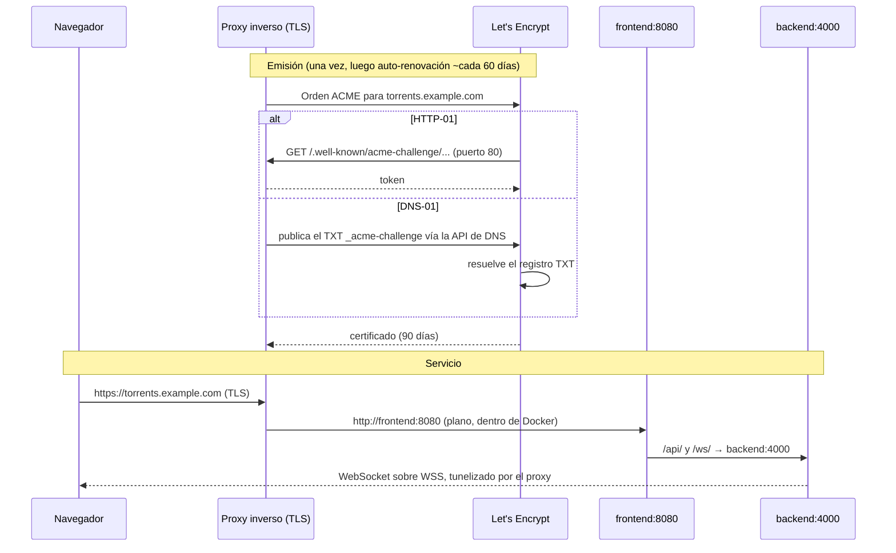

import Tabs from '@theme/Tabs';
import TabItem from '@theme/TabItem';

# TLS y HTTPS

## Resumen

Los contenedores de UltraTorrent hablan **HTTP plano** y están diseñados para colocarse detrás de algo que termine TLS. Eso es deliberado: el manejo de certificados pertenece a un solo lugar, y todo despliegue serio ya tiene un proxy inverso.

Así que "habilitar HTTPS" significa: **pon un proxy al frente y dale un certificado.** Esta página cubre la mitad del certificado; [Proxy inverso](/install/reverse-proxy) cubre la mitad del enrutamiento.

Tienes tres opciones realistas:

| | Úsala cuando | Esfuerzo |
|---|---|---|
| **Let's Encrypt — HTTP-01** | La máquina es alcanzable desde el internet en el puerto 80 | El más bajo |
| **Let's Encrypt — DNS-01** | Solo en LAN, detrás de CGNAT, o si quieres un **wildcard** | Medio — necesita un token de API de un proveedor de DNS |
| **Certificado personalizado / de CA interna** | PKI corporativa, o un homelab con su propia CA | Medio — tienes que distribuir la CA a los clientes |

:::tip Mira este tutorial
_Video próximamente._
:::

## Requisitos previos

- Una [instalación con Docker Compose](/install/docker-compose) funcionando y un [proxy inverso](/install/reverse-proxy).
- Un **nombre de dominio que controles**. Una dirección IP solo de LAN no puede obtener un certificado público — necesitas un nombre de host, incluso para un servicio puramente interno (DNS-01 emite certificados para nombres de host que nunca resuelven públicamente).
- Para HTTP-01: el **puerto 80 alcanzable desde el internet**, y el DNS ya apuntando al host.

## Requerimientos

Insignificantes — terminar TLS cuesta unos pocos MB de RAM. Lo que cuesta es *atención*: un certificado vencido es una caída del servicio.

## Puertos

| Puerto | Necesario para |
|------|-----------|
| **80** | El desafío ACME HTTP-01 **y** la redirección HTTP→HTTPS. Mantenlo abierto incluso después de tener un certificado — la renovación lo usa |
| **443** | HTTPS |
| — | DNS-01 **no** necesita ningún puerto entrante |

## Volúmenes

Lo que sea que tu proxy use para guardar certificados. Respáldalo:

| Proxy | Almacén de certificados |
|-------|-------------------|
| Caddy (perfil `proxy` incluido) | el volumen `caddy_data` |
| Traefik | `acme.json` |
| NGINX + certbot | `/etc/letsencrypt` |
| Nginx Proxy Manager | sus carpetas `data/` y `letsencrypt/` |
| HAProxy | tu directorio de PEM combinados |

## Permisos

Las llaves privadas deben ser legibles **solo** por el proceso que las usa:

```bash
sudo chmod 600 /etc/haproxy/certs/torrents.example.com.pem
sudo chown root:root /etc/haproxy/certs/torrents.example.com.pem
```

Nunca subas una llave a git; nunca pongas una en `.env`.

## Cómo encaja todo



Fíjate en la última línea: como TLS termina en el proxy, el WebSocket del navegador es automáticamente **`wss://`** — eso no lo configuras en ninguna parte. Solo funciona si tu proxy reenvía el upgrade; mira [Proxy inverso](/install/reverse-proxy).

## Paso a paso

<Tabs groupId="tls">
<TabItem value="caddy" label="Caddy (lo más fácil)" default>

Caddy obtiene, instala y renueva un certificado de Let's Encrypt con **cero configuración** más allá de nombrar tu dominio.

Edita `deploy/Caddyfile` (o tu propio Caddyfile) para que la etiqueta del sitio sea tu dominio en vez de `:80`:

```caddy
torrents.example.com {
	encode gzip

	@api path /api/* /ws/*
	handle @api {
		reverse_proxy backend:4000
	}

	handle {
		# nginx-unprivileged escucha en el 8080 — no en el 80.
		reverse_proxy frontend:8080
	}
}
```

```bash
docker compose --profile proxy up -d
docker compose logs -f proxy        # observa cómo se emite el certificado
```

Requerimientos: que el DNS de `torrents.example.com` ya apunte a este host, y que los puertos **80 y 443 sean alcanzables**. Caddy se encarga solo de la redirección HTTP→HTTPS y de la renovación.

**Wildcard / DNS-01 con Caddy** necesita un plugin del proveedor de DNS, lo que implica una imagen de Caddy personalizada:

```dockerfile
FROM caddy:2-builder AS builder
RUN xcaddy build --with github.com/caddy-dns/cloudflare
FROM caddy:2-alpine
COPY --from=builder /usr/bin/caddy /usr/bin/caddy
```

```caddy
*.example.com {
	tls {
		dns cloudflare {env.CLOUDFLARE_API_TOKEN}
	}
	reverse_proxy frontend:8080
}
```

</TabItem>
<TabItem value="certbot" label="Let's Encrypt + NGINX (certbot)">

**HTTP-01** — el camino estándar cuando el host es alcanzable públicamente.

<Tabs groupId="os">
<TabItem value="deb" label="Ubuntu / Debian" default>

```bash
sudo apt update && sudo apt install -y certbot python3-certbot-nginx
```

</TabItem>
<TabItem value="rhel" label="Fedora / Rocky">

```bash
sudo dnf install -y certbot python3-certbot-nginx
```

</TabItem>
</Tabs>

Con tu [configuración de proxy NGINX](/install/reverse-proxy) ya en su lugar y escuchando en el puerto 80:

```bash
sudo certbot --nginx -d torrents.example.com
```

certbot edita el vhost, instala el certificado y configura la redirección. La renovación se instala como un temporizador de systemd:

```bash
systemctl list-timers | grep certbot
sudo certbot renew --dry-run          # comprueba que la renovación funciona ANTES de necesitarla
```

**DNS-01 / wildcard** — sin necesidad de ningún puerto entrante:

```bash
sudo apt install -y python3-certbot-dns-cloudflare
sudo install -m 600 /dev/null /etc/letsencrypt/cloudflare.ini
echo 'dns_cloudflare_api_token = <your-scoped-token>' | sudo tee /etc/letsencrypt/cloudflare.ini

sudo certbot certonly \
  --dns-cloudflare \
  --dns-cloudflare-credentials /etc/letsencrypt/cloudflare.ini \
  -d 'example.com' -d '*.example.com'
```

Luego apunta NGINX a `/etc/letsencrypt/live/example.com/fullchain.pem` y `privkey.pem`, y recárgalo después de cada renovación:

```bash
# /etc/letsencrypt/renewal-hooks/deploy/reload-nginx.sh
#!/bin/sh
systemctl reload nginx
```

```bash
sudo chmod +x /etc/letsencrypt/renewal-hooks/deploy/reload-nginx.sh
```

</TabItem>
<TabItem value="traefik" label="Traefik">

Configuración estática (`traefik.yml`):

```yaml
certificatesResolvers:
  letsencrypt:
    acme:
      email: you@example.com
      storage: /letsencrypt/acme.json
      httpChallenge:
        entryPoint: web

  # Wildcard / sin puertos abiertos:
  letsencrypt-dns:
    acme:
      email: you@example.com
      storage: /letsencrypt/acme-dns.json
      dnsChallenge:
        provider: cloudflare
        resolvers: ["1.1.1.1:53"]
```

```yaml
# el servicio de Traefik
environment:
  CF_DNS_API_TOKEN: ${CLOUDFLARE_API_TOKEN}
volumes:
  - ./letsencrypt:/letsencrypt
```

Luego en el servicio `frontend`:

```yaml
labels:
  - "traefik.http.routers.ultratorrent.tls.certresolver=letsencrypt"
  # variante wildcard:
  # - "traefik.http.routers.ultratorrent.tls.certresolver=letsencrypt-dns"
  # - "traefik.http.routers.ultratorrent.tls.domains[0].main=example.com"
  # - "traefik.http.routers.ultratorrent.tls.domains[0].sans=*.example.com"
```

`acme.json` tiene que estar en modo **0600** o Traefik se niega a usarlo.

</TabItem>
<TabItem value="custom" label="Certificado personalizado / corporativo">

Tienes un certificado de una CA comercial o de la PKI interna de tu empresa. Típicamente recibirás:

- `certificate.crt` — tu certificado de hoja (leaf)
- `intermediate.crt` (o un bundle) — la cadena
- `private.key` — la llave

**Construye la cadena correctamente.** Los navegadores necesitan la hoja **y luego** los intermedios, en ese orden:

```bash
cat certificate.crt intermediate.crt > fullchain.pem
```

<Tabs groupId="proxy">
<TabItem value="nginx" label="NGINX" default>

```nginx
ssl_certificate     /etc/ssl/ultratorrent/fullchain.pem;
ssl_certificate_key /etc/ssl/ultratorrent/private.key;

ssl_protocols       TLSv1.2 TLSv1.3;
ssl_prefer_server_ciphers off;
ssl_session_cache   shared:SSL:10m;
```

</TabItem>
<TabItem value="haproxy" label="HAProxy">

HAProxy quiere **un** solo archivo: la fullchain **y** la llave concatenadas.

```bash
cat fullchain.pem private.key > /etc/haproxy/certs/torrents.example.com.pem
sudo chmod 600 /etc/haproxy/certs/torrents.example.com.pem
```

```haproxy
bind :443 ssl crt /etc/haproxy/certs/torrents.example.com.pem alpn h2,http/1.1
```

</TabItem>
<TabItem value="caddy" label="Caddy">

```caddy
torrents.example.com {
	tls /etc/ssl/ultratorrent/fullchain.pem /etc/ssl/ultratorrent/private.key
	reverse_proxy frontend:8080
}
```

Monta ambos archivos dentro del container del proxy en modo solo lectura.

</TabItem>
</Tabs>

**CA interna / homelab.** `mkcert` produce certificados en los que confían las máquinas donde instales su CA raíz:

```bash
mkcert -install
mkcert torrents.home.lan
```

Cada dispositivo que vaya a abrir la UI — incluyendo los teléfonos — tiene que confiar en esa CA raíz, o recibirás una advertencia del navegador. Para un homelab con más de dos o tres dispositivos, **DNS-01 con un dominio real es menos trabajo** que distribuir una CA.

</TabItem>
</Tabs>

## Verificación

**La cadena está completa y las fechas son correctas:**

```bash
openssl s_client -connect torrents.example.com:443 -servername torrents.example.com < /dev/null 2>/dev/null \
  | openssl x509 -noout -subject -issuer -dates
```

```text
subject=CN = torrents.example.com
issuer=C = US, O = Let's Encrypt, CN = R11
notBefore=Jul 12 09:14:02 2026 GMT
notAfter=Oct 10 09:14:01 2026 GMT
```

**Sin huecos en la cadena** (el clásico bug de "funciona en Chrome, falla en Android"):

```bash
openssl s_client -connect torrents.example.com:443 -servername torrents.example.com < /dev/null 2>&1 | grep -i "verify"
```

```text
Verify return code: 0 (ok)
```

**HTTP redirige a HTTPS:**

```bash
curl -sI http://torrents.example.com | head -1
# HTTP/1.1 301 Moved Permanently
```

**La app funciona sobre TLS**, WebSocket incluido:

```bash
curl -s https://torrents.example.com/api/system/live
```

Luego abre la UI y confirma que la barra de progreso de una descarga se actualiza en vivo — eso prueba que `wss://` está tunelizando correctamente a través de tu terminador de TLS.


:::tip ¿Dónde se metió el candado?
Chrome 117 y posteriores reemplazaron el ícono del candado con un ícono de **información del sitio**
(los dos deslizadores). Haz clic en él: un certificado funcional dice **"La conexión es segura"**, y
*La conexión es segura → El certificado es válido* muestra el emisor. Una cadena mal configurada
dice "No es seguro" ahí, incluso cuando la página todavía carga.
:::

## Proxy inverso

TLS y el enrutamiento son dos mitades de un mismo trabajo. Configura el enrutamiento (y el obligatorio upgrade de WebSocket) en **[Proxy inverso](/install/reverse-proxy)**.

## Actualizaciones

Los certificados son independientes de las actualizaciones de UltraTorrent — reconstruir el stack no los toca, siempre que el almacén de certificados de tu proxy sea un volumen o una ruta del host fuera del repo.

**Después de cualquier renovación de certificado, el proxy tiene que recargarse.** Caddy y Traefik lo hacen solos. NGINX y HAProxy necesitan un deploy hook (mira la pestaña de certbot más arriba).

## Copias de seguridad

Respalda el almacén de certificados (`caddy_data`, `acme.json`, `/etc/letsencrypt`, tu directorio de PEM) junto con tu `.env` y el volcado de la base de datos. Perderlo es recuperable — pero Let's Encrypt aplica límites de tasa a los certificados duplicados (5 por semana por cada conjunto idéntico de nombres), así que perderlo repetidamente te dejará sin poder reemitir por días.

## Resolución de problemas

| Síntoma | Causa | Solución |
|---------|-------|-----|
| ACME falla: *"Timeout during connect"* en HTTP-01 | El puerto 80 no es alcanzable desde el internet | Abre el 80 en el firewall **y** en el router. En hosts de nube: revisa el grupo de seguridad. O cámbiate a DNS-01, que no necesita ningún puerto entrante |
| ACME falla: *"Invalid response … 404"* | Otra cosa está respondiendo en el puerto 80, o el proxy no está sirviendo `/.well-known/acme-challenge/` | Haz que el proxy sea lo único en el puerto 80 |
| *"too many certificates already issued"* | Límite de tasa de Let's Encrypt — normalmente por un ciclo de reintentos fallidos | Espera a que pase (una semana), y la próxima vez prueba contra `--staging` / el directorio staging de ACME |
| El certificado es válido en Chrome, **no confiable en Android/iOS** | Falta el intermedio — serviste solo la hoja | Sirve la **fullchain**: `cat certificate.crt intermediate.crt > fullchain.pem` |
| `ERR_SSL_PROTOCOL_ERROR` | Estás accediendo por HTTPS a un puerto que solo habla HTTP (p. ej. `https://host:8080`) | El contenedor habla HTTP plano. Pasa por el 443 del proxy |
| El candado es válido, pero **la UI nunca se actualiza** | TLS está bien; el upgrade del **WebSocket** se está descartando | Mira [Proxy inverso → verificación](/install/reverse-proxy#verification) |
| Advertencias de contenido mixto en la consola | Algo está pidiendo `http://` desde una página `https://` | La SPA usa URLs relativas de forma predeterminada. Revisa `CORS_ORIGIN` y cualquier build arg `VITE_API_URL` personalizado |
| Traefik ignora `acme.json` | Permisos de archivo equivocados | `chmod 600 acme.json` |
| Certificado vencido | La renovación corrió pero el proxy nunca se recargó | Añade un deploy hook que recargue el proxy; verifícalo con `certbot renew --dry-run` |
| Advertencia del navegador con un certificado de `mkcert` | El dispositivo no confía en tu CA raíz | Instala la CA raíz en ese dispositivo — o cámbiate a DNS-01 con un dominio real |

## Mejores prácticas

- **Automatiza la renovación, y luego comprueba que funciona** — `certbot renew --dry-run` — mucho antes del día 89.
- **Prefiere Caddy o Traefik** si no tienes una opinión fuerte: emiten y renuevan certificados sin ningún cron job que se te pueda olvidar.
- **Usa DNS-01 para instalaciones solo en LAN.** Un certificado público para un nombre de host privado, sin puertos entrantes, sin advertencias del navegador, sin una CA que distribuir.
- **Sirve siempre la cadena completa**, nunca la hoja sola.
- **Mantén el puerto 80 abierto** para las redirecciones y las renovaciones por HTTP-01, incluso cuando HTTPS ya funcione.
- **TLS 1.2 como mínimo**, TLS 1.3 preferido.
- **Respalda el almacén de certificados** junto con todo lo demás.
- **Nunca termines TLS dentro de los contenedores de la app** — están hechos para vivir detrás de un proxy.
- **¿Despliegue público? TLS es lo mínimo indispensable, no toda la historia.** Lee también [Seguridad](/operate/security).

## Preguntas frecuentes

**¿Puedo obtener un certificado para una dirección IP pelada?**
De Let's Encrypt no. Usa un nombre de host (DNS-01 funciona incluso si solo resuelve en tu LAN).

**¿Tengo que cambiar algo en UltraTorrent para HTTPS?**
Solo `CORS_ORIGIN` en `.env`, a tu origen público `https://`. La SPA usa URLs relativas, así que `wss://` se sigue automáticamente.

**¿Puedo terminar TLS directamente en el contenedor del frontend?**
No — es un nginx de HTTP plano por diseño. Usa un proxy.

**¿Autofirmado para una prueba rápida?**
Está bien para un laboratorio, pero todos los dispositivos advertirán, y algunas herramientas se negarán. `mkcert` es una mejor versión de la misma idea.

**¿El perfil de Caddy incluido renueva automáticamente?**
Sí, siempre que se mantenga corriendo y `caddy_data` persista.

## Lista de verificación

- [ ] Existe un nombre de host y (para HTTP-01) resuelve al host
- [ ] El proxy inverso funciona primero sobre HTTP plano
- [ ] Los puertos 80 y 443 son alcanzables (HTTP-01) — o hay un token de API de DNS en su lugar (DNS-01)
- [ ] Certificado emitido, se sirve la **fullchain**
- [ ] `openssl s_client` reporta `Verify return code: 0 (ok)`
- [ ] HTTP redirige a HTTPS
- [ ] La renovación está automatizada **y** probada con dry-run
- [ ] El proxy se recarga al renovar (deploy hook, para NGINX/HAProxy)
- [ ] `CORS_ORIGIN` actualizado al origen `https://`; backend recreado
- [ ] La UI en vivo sigue actualizándose sobre `wss://`
- [ ] El almacén de certificados está incluido en las copias de seguridad
- [ ] La llave privada está en `0600`, es propiedad del usuario del proxy, y no está en git

## Mira también

- [Proxy inverso](/install/reverse-proxy) — la mitad del enrutamiento, y el requisito del WebSocket
- [Instalación en Cloud / VPS](/install/platforms/cloud) — donde HTTPS es obligatorio
- [Instalación con Docker Compose](/install/docker-compose)
- [Seguridad](/operate/security) · [Resolución de problemas](/operate/troubleshooting)
