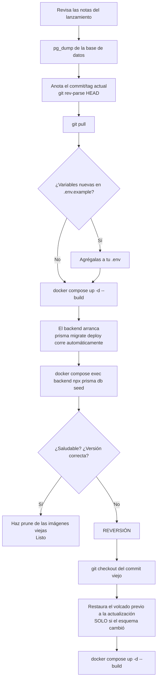
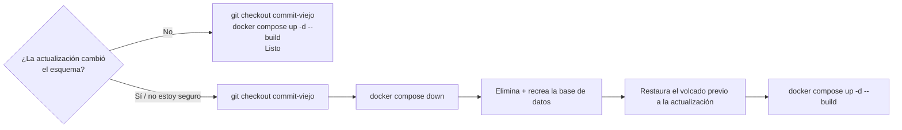

import Tabs from '@theme/Tabs';
import TabItem from '@theme/TabItem';

# Actualización y reversión

## Resumen

UltraTorrent se actualiza **bajando el código más reciente y recompilando las imágenes**. No hay una imagen publicada en un registro para hacer `docker pull`, y nada se actualiza solo.

Dos hechos gobiernan todo lo que hay en esta página:

1. **Las migraciones de la base de datos se aplican automáticamente.** El comando del container del backend es `prisma migrate deploy && node dist/main.js`, así que un lanzamiento nuevo migra el esquema en el momento en que arranca su container.
2. **Las migraciones son de solo avance.** No existe `migrate down`. Una vez aplicado un esquema nuevo, la *única* forma de volver al código viejo es **restaurar la copia de seguridad de la base de datos que tomaste primero**.

Por eso cada procedimiento de abajo empieza con un `pg_dump`.

:::danger Respalda antes de cada actualización
Es un solo comando y es toda la diferencia entre "revertir en dos minutos" y "reinstalar desde cero".
:::

:::tip Mira este tutorial
_Video próximamente._
:::

## Requisitos previos

- Acceso por shell al host de Docker.
- Algún lugar donde poner un volcado de la base de datos que **no** sea el host que estás actualizando.
- Unos minutos de tiempo fuera de servicio — la recompilación recrea los containers.

## Requisitos

Los mismos que la instalación: **~2 GB de RAM libre** para el build, más un par de GB de disco para las capas de la imagen nueva (las viejas se quedan hasta que hagas prune).

## Puertos · Volúmenes · Permisos

Una actualización no cambia ninguno. Tu `.env`, tu `docker-compose.override.yml`, tu `postgres_data` y tus `downloads` sobreviven todos — `git pull` no toca archivos sin seguimiento, y `up -d --build` recrea containers, no volúmenes.

Lo único que *sí puede* cambiar entre lanzamientos: **variables de entorno nuevas**. Compara la plantilla después de hacer pull:

```bash
git diff HEAD@{1} -- .env.example
```

## El flujo de actualización



## Paso a paso

### 1. Lee las notas del lanzamiento

Revisa el `CHANGELOG.md` del proyecto para las versiones entre la tuya y la de destino. Busca cualquier cosa sobre **variables de entorno requeridas**, **cambios incompatibles** o **pasos de migración manuales**.

Tu versión actual:

```bash
curl -s http://localhost:8080/api/system/version
```

…o **Configuración → Acerca de** en la interfaz.

### 2. Respalda

```bash
cd ultratorrent-core

# La base de datos — todo excepto los medios en sí
docker compose exec -T postgres pg_dump -U ultratorrent ultratorrent > backup-$(date +%F).sql

# Tu .env — sin ENCRYPTION_KEY no puedes descifrar los secretos 2FA guardados
cp .env ~/ultratorrent-env-$(date +%F).bak

# El commit exacto en el que estás ahora mismo — tu objetivo de reversión
git rev-parse HEAD > ~/ultratorrent-rollback-$(date +%F).txt
```

Verifica que el volcado no esté vacío y que no sea un mensaje de error:

```bash
ls -lh backup-$(date +%F).sql
head -5 backup-$(date +%F).sql        # debe empezar con los encabezados del volcado de PostgreSQL
```

Luego **cópialo fuera del host**. Una copia de seguridad en la máquina que estás a punto de romper no es una copia de seguridad. Ver [Copia de seguridad y restauración](/operate/backup).

### 3. Baja el código nuevo

```bash
git pull
```

Tu `.env` y tu `docker-compose.override.yml` no tienen seguimiento, así que sobreviven intactos.

:::caution Si editaste un archivo con seguimiento
Editar `docker-compose.yml` o `deploy/Caddyfile` directamente hace que `git pull` entre en conflicto. Mantén tus personalizaciones en **`docker-compose.override.yml`** — para eso existe exactamente.
:::

¿No tienes `git`? Descarga el ZIP nuevo, extráelo **encima** de la carpeta y conserva tu `.env` y tu archivo de override.

### 4. Revisa si hay variables de entorno nuevas

```bash
git diff HEAD@{1} -- .env.example
```

Todo lo nuevo y requerido va en tu `.env` **antes** de que arranques.

### 5. Recompila y reinicia

<Tabs groupId="engine">
<TabItem value="rtorrent" label="Con rTorrent incluido" default>

```bash
docker compose --profile rtorrent up -d --build
```

</TabItem>
<TabItem value="qbittorrent" label="Con qBittorrent incluido">

```bash
docker compose --profile qbittorrent up -d --build
```

</TabItem>
<TabItem value="own" label="Motor propio (sin perfil)">

```bash
docker compose up -d --build
```

</TabItem>
</Tabs>

:::warning Pasa los mismos perfiles con los que instalaste
`docker compose up -d` **sin** `--profile rtorrent` dejará el container de rTorrent *detenido*. Siempre repite los perfiles que usaste originalmente.
:::

El backend corre `prisma migrate deploy` mientras arranca, así que los cambios de esquema se aplican solos. Obsérvalo:

```bash
docker compose logs -f backend
```

### 6. Vuelve a sembrar

```bash
docker compose exec backend npx prisma db seed
```

Esto recoge los **nuevos permisos, roles y ajustes predeterminados** que introduce el lanzamiento. Es idempotente: nunca restablece tu contraseña de admin y nunca toca tus datos. Si lo omites, las funciones nuevas pueden quedar invisibles porque nadie tiene su permiso.

### 7. Verifica

```bash
docker compose ps                                   # todos saludables
curl -s http://localhost:8080/api/system/version    # la versión NUEVA
docker compose logs backend | tail -30              # sin errores de migración
```

Luego, en la interfaz: inicia sesión, abre **Torrents** (el motor debe seguir conectado y tus torrents presentes) y confirma que el progreso de una transferencia se actualiza en vivo.

### 8. Limpia

```bash
docker image prune -f
```

Las recompilaciones dejan capas de imagen colgando. Haz esto de vez en cuando, no obsesivamente — hacer prune demasiado agresivo te cuesta el caché de capas en el próximo build.

## Verificación

```bash
docker compose ps
```

```text
NAME                       STATUS                   PORTS
ultratorrent-backend-1     Up 40 seconds (healthy)  4000/tcp
ultratorrent-frontend-1    Up 40 seconds (healthy)  0.0.0.0:8080->8080/tcp
ultratorrent-postgres-1    Up 45 seconds (healthy)  5432/tcp
ultratorrent-redis-1       Up 45 seconds (healthy)  6379/tcp
ultratorrent-rtorrent-1    Up 40 seconds (healthy)  5000/tcp
```

```bash
curl -s http://localhost:8080/api/system/version
```

La cadena de versión debe ser la del lanzamiento que acabas de instalar. También se muestra en **Configuración → Acerca de**, junto con el commit de git si la imagen se marcó con build args.


## Reversión

La reversión es fácil *si* tienes el volcado. No es posible si no lo tienes.



**¿Cambió el esquema?** Compara la carpeta de migraciones entre los dos commits:

```bash
git diff --stat <old-commit> HEAD -- apps/backend/prisma/migrations
```

Salida vacía → sin cambio de esquema → el camino simple es suficiente.

### Reversión simple (sin cambio de esquema)

```bash
git checkout <old-commit-or-tag>
docker compose --profile rtorrent up -d --build
```

### Reversión completa (el esquema cambió)

La migración nueva ya está aplicada; el código viejo no entenderá el esquema nuevo. Tienes que restaurar.

```bash
# 1. Regresa al código viejo
git checkout <old-commit-or-tag>

# 2. Detén todo (¡conserva los volúmenes!)
docker compose down

# 3. Levanta SOLO postgres y restablece la base de datos
docker compose up -d postgres
docker compose exec -T postgres psql -U ultratorrent -d postgres \
  -c "DROP DATABASE ultratorrent;" -c "CREATE DATABASE ultratorrent;"

# 4. Restaura tu volcado previo a la actualización
docker compose exec -T postgres psql -U ultratorrent -d ultratorrent < backup-2026-07-12.sql

# 5. Levanta de nuevo el stack viejo
docker compose --profile rtorrent up -d --build
```

:::danger `docker compose down -v` destruye tu base de datos
`-v` elimina los volúmenes — incluidos `postgres_data` **y** `downloads`. Nunca lo uses como parte de una reversión. El único uso legítimo es un borrado deliberado para empezar de cero en una instalación sin datos reales.
:::

Tus **descargas quedan intactas** con todo esto. El volumen `downloads` nunca se migra, se elimina ni se reescribe.

## Seguridad de las migraciones

| Hecho | Consecuencia |
|------|-------------|
| Las migraciones corren **al arrancar el backend**, automáticamente | No puedes "actualizar el código pero no la base de datos" |
| Las migraciones son de **solo avance** — no hay migración de bajada | Revertir a través de un cambio de esquema **requiere** el volcado previo a la actualización |
| `prisma migrate deploy` es **idempotente** | Un container reiniciado no vuelve a correr las migraciones ya aplicadas |
| Una migración fallida **detiene el backend** | El container entrará en un ciclo de fallos en vez de correr contra un esquema a medio migrar — eso es intencional |
| El seed es **idempotente** | Es seguro (y recomendado) volver a correrlo después de cada actualización |
| Saltarse versiones está bien | Prisma aplica en orden todas las migraciones pendientes |

Si el backend entra en ciclo de fallos con un error de migración después de una actualización, **no** intentes arreglar el esquema a mano. Restaura el volcado, regresa al commit viejo y abre un issue con el log.

## Actualizar un despliegue por interfaz de NAS

Si desplegaste con Container Manager / Container Station en vez de por SSH:

1. Actualiza la carpeta del código fuente en el NAS (`git pull` por SSH, o vuelve a copiar el ZIP extraído encima, conservando el `.env`).
2. Usa la acción de recompilar de la interfaz — **Project → Build** (Synology) o **Rebuild** (QNAP).
3. Corre el seed de una sola vez. Ya sea por SSH, o desde la pestaña **Terminal** integrada del container **backend**: `npx prisma db seed`.

Ver [Synology](/install/platforms/synology) y [QNAP](/install/platforms/qnap).

## Copias de seguridad

La copia de seguridad de la actualización de arriba es una *red de seguridad puntual*, no una estrategia de respaldo. Para una de verdad — programación, retención, simulacros de restauración — ver **[Copia de seguridad y restauración](/operate/backup)**.

El conjunto mínimo viable:

- `pg_dump` de la base de datos
- Tu `.env` (especialmente `ENCRYPTION_KEY` — sin ella, los secretos 2FA guardados son irrecuperables)
- Tu `docker-compose.override.yml`

## Resolución de problemas

| Síntoma | Causa | Solución |
|---------|-------|-----|
| El backend entra en ciclo de fallos tras una actualización con un **error de migración** | Una migración falló a medias, o el esquema se editó a mano | Restaura el volcado previo a la actualización, haz `git checkout` del commit viejo y recompila. **No** parches el esquema manualmente |
| El backend termina: *"insecure secret configuration"* tras una actualización | Falta un secreto recién requerido, o el lanzamiento endureció la validación | Compara `.env.example`, completa los valores faltantes o débiles, `docker compose up -d backend` |
| El container del motor incluido **desapareció** tras una actualización | Corriste `up -d` sin repetir `--profile rtorrent` | Vuelve a correrlo con el perfil |
| Una función nueva es invisible / "permiso denegado" para el admin | El lanzamiento nuevo agregó permisos y no volviste a sembrar | `docker compose exec backend npx prisma db seed` |
| `git pull` se niega: *"local changes would be overwritten"* | Editaste un archivo con seguimiento (normalmente `docker-compose.yml`) | Mueve el cambio a `docker-compose.override.yml`, luego `git checkout -- <file>` y haz pull |
| `/api/system/version` sigue reportando la versión vieja | La imagen no se recompiló — corriste `up -d` sin `--build` | `docker compose up -d --build` |
| El disco se llena después de varias actualizaciones | Se acumulan capas de imagen colgando | `docker image prune -f` |
| Los torrents desaparecieron tras la actualización | Casi nunca es la actualización. Revisa que el motor esté corriendo y siga registrado | La sesión de rTorrent vive en `/downloads/.session` y sobrevive las recompilaciones. Revisa **Infraestructura → Motores** |
| El build muere por falta de memoria (OOM) | Menos de ~2 GB de RAM libre | Libera memoria o agrega swap, luego recompila |

Más: **[Resolución de problemas](/operate/troubleshooting)**.

## Mejores prácticas

- **`pg_dump` primero. Cada vez. Sin excepciones.** Las migraciones de solo avance significan que el volcado es tu única reversión.
- **Copia el volcado fuera del host.**
- **Anota el commit en el que estás** (`git rev-parse HEAD`) antes de hacer pull — ese es tu objetivo de reversión.
- **Lee el changelog** entre tu versión y la de destino, sobre todo para variables de entorno nuevas requeridas.
- **Mantén todas las personalizaciones en `docker-compose.override.yml`** y en `.env`, nunca en archivos con seguimiento, para que `git pull` siempre esté limpio.
- **Siempre repite tus flags `--profile`.**
- **Siempre vuelve a sembrar** después de una actualización.
- **Actualiza cuando puedas estar pendiente**, no justo antes de necesitar que la máquina funcione.
- **Prueba una restauración de vez en cuando.** Una copia de seguridad sin probar es un rumor.
- **No te saltes un lanzamiento con un paso de migración manual** — lee las notas de cada versión que cruces.

## Preguntas frecuentes

**¿Pierdo mis torrents cuando actualizo?**
No. El estado de los torrents vive en el motor (el directorio de sesión de rTorrent está dentro del volumen `downloads`) y en la base de datos — la recompilación no toca ninguno de los dos.

**¿Pierdo mis descargas?**
No. El volumen `downloads` nunca se modifica en una actualización. Solo `docker compose down -v` lo destruiría.

**¿Tengo que volver a sembrar?**
Es muy recomendable — los permisos y ajustes nuevos solo aparecen si lo haces. Es idempotente y seguro.

**¿Puedo saltarme varias versiones?**
Sí. Prisma aplica en orden todas las migraciones pendientes. Lee el changelog de todas ellas.

**¿Puedo degradar sin una copia de seguridad?**
No a través de un cambio de esquema. El esquema nuevo ya está aplicado y el código viejo no puede leerlo.

**¿UltraTorrent busca actualizaciones por su cuenta?**
La API expone un endpoint de estado de actualización (`GET /api/system/update`, protegido por permisos) que reporta si existe un lanzamiento más nuevo y cómo aplicarlo según tu despliegue. **No** aplica nada automáticamente.

**¿Cómo actualizo una instalación manual (sin Docker)?**
`git pull`, `npm install`, `npm run prisma:generate`, `npm run prisma:migrate`, `npm run prisma:seed`, `npm run build`, reinicia. Respalda la base de datos primero, por la misma razón de solo avance. Ver [Linux](/install/platforms/linux#manual-install-from-source).

## Lista de verificación

- [ ] Changelog leído para cada versión que se cruza
- [ ] `pg_dump` tomado **y copiado fuera del host**
- [ ] `.env` respaldado
- [ ] Commit actual anotado (`git rev-parse HEAD`)
- [ ] `git pull` limpio (sin conflictos en archivos con seguimiento)
- [ ] `.env.example` comparado en busca de variables nuevas
- [ ] Recompilado **con los mismos flags `--profile`** que la instalación original
- [ ] Los logs del backend muestran las migraciones aplicadas, sin errores
- [ ] Seed vuelto a correr
- [ ] `docker compose ps` — todo saludable
- [ ] `/api/system/version` reporta la versión nueva
- [ ] Motor aún conectado; torrents aún listados; actualizaciones en vivo aún funcionando
- [ ] `docker image prune -f`
- [ ] Copia de seguridad retenida hasta que tengas confianza en la versión nueva

## Ver también

- [Instalación con Docker Compose](/install/docker-compose) — el stack que estás actualizando
- [Copia de seguridad y restauración](/operate/backup) — la estrategia de respaldo de verdad
- [Variables de entorno](/reference/environment) — revisa si hay nuevas después de un pull
- [Resolución de problemas](/operate/troubleshooting)
- [Synology](/install/platforms/synology) · [QNAP](/install/platforms/qnap) — recompilaciones desplegadas por interfaz
